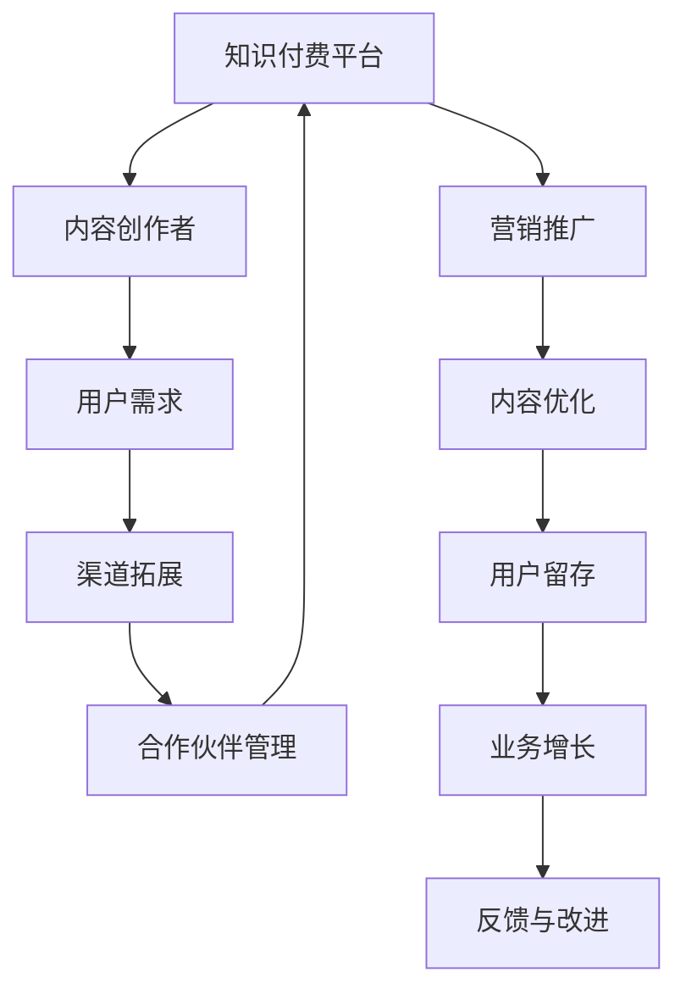

                 

# 知识付费赚钱的渠道拓展与合作伙伴管理

## 1. 背景介绍

随着互联网技术的不断进步，知识付费平台日益成为人们获取专业知识、提升职业技能的重要渠道。知识付费不仅帮助用户解决了学习问题，也为内容创作者提供了稳定的收入来源。然而，知识付费行业的激烈竞争和用户多样化的需求，使得平台和创作者需要不断拓展渠道、优化管理，才能在市场中脱颖而出。

本文将深入探讨知识付费赚钱的渠道拓展和合作伙伴管理策略，结合国内外成功案例，为平台和创作者提供实用的参考。首先，我们将概述知识付费行业的基本现状，包括主要参与者和市场规模。随后，我们将聚焦于渠道拓展和合作伙伴管理的核心概念与联系，以及核心算法原理与具体操作步骤。最后，本文还将通过数学模型与实际案例，详细讲解具体的业务流程和优化方法，并展望未来的发展趋势与面临的挑战。

## 2. 核心概念与联系

### 2.1 核心概念概述

在探讨知识付费的渠道拓展与合作伙伴管理之前，我们需要明确几个关键概念：

- **知识付费平台**：是指通过互联网提供专业知识、技能培训、线上课程等付费服务的平台，如Coursera、Udemy、得到、知乎、网易云课堂等。
- **内容创作者**：指在知识付费平台上提供专业内容的个体或团队，可以是学者、行业专家、教育机构等。
- **用户需求**：指的是用户在知识付费平台上期望获得的知识服务，包括但不限于技术培训、职业发展、生活兴趣、心理健康等。
- **渠道拓展**：指知识付费平台和内容创作者通过多种方式，扩大其内容和服务的传播范围，提升用户覆盖面和付费转化率。
- **合作伙伴管理**：指知识付费平台与外部机构、品牌、媒体等合作，共同推广知识付费产品，优化合作伙伴关系，提高营销效率和用户满意度。

这些概念之间相互联系，共同构成了知识付费行业的运营框架。平台和创作者需要理解这些概念的深层含义，并灵活运用，以实现自身的商业目标。

### 2.2 核心概念原理和架构的 Mermaid 流程图



此图展示了知识付费平台与内容创作者、用户需求、渠道拓展和合作伙伴管理之间的关系。平台通过营销推广和内容优化吸引用户，并借助渠道拓展和合作伙伴管理扩大影响。用户满意度和业务增长是平台的核心目标，而用户反馈与改进则保证了平台的长期稳定发展。

## 3. 核心算法原理 & 具体操作步骤

### 3.1 算法原理概述

知识付费平台的渠道拓展和合作伙伴管理，本质上是一个多目标优化问题。平台需要在提升内容覆盖范围和付费转化率的同时，优化合作伙伴关系，提高用户满意度和平台收入。这一过程可以视为一个复杂的系统，其中包含多个相互作用的子系统，如内容推荐、用户行为分析、营销策略、合作伙伴选择等。

### 3.2 算法步骤详解

基于上述理解，知识付费平台的渠道拓展和合作伙伴管理可以分为以下几个步骤：

**Step 1: 用户需求分析**

平台需要通过数据挖掘和用户调研，深入理解用户需求的多样性和变化趋势。例如，平台可以通过分析用户搜索历史、课程评价、社交媒体反馈等数据，识别出用户对某些领域课程的需求增加。

**Step 2: 内容适配与优化**

根据用户需求分析结果，平台需要调整课程设置和内容形式，以适应市场需求。例如，增加热门领域的高质量课程，引入互动式学习工具，或者优化课程内容的呈现方式，如视频、图文、直播等。

**Step 3: 渠道拓展策略**

平台需要选择合适的渠道进行内容推广，包括自有平台推广、第三方合作渠道、社交媒体营销等。例如，平台可以在微信公众号、微博、抖音等平台进行内容推广，或者与行业媒体、教育机构等合作，扩大课程覆盖范围。

**Step 4: 合作伙伴管理**

平台需要制定合作伙伴管理策略，选择具有品牌影响力、用户基础稳固的合作伙伴，共同推广课程。例如，平台可以与知名教育机构、行业协会、知名专家等合作，通过联合营销、内容共创等方式，提升课程的知名度和吸引力。

**Step 5: 效果评估与反馈**

平台需要定期评估渠道拓展和合作伙伴管理的效果，收集用户反馈，及时调整策略。例如，平台可以通过用户参与度、课程销售数据、用户满意度等指标，评估渠道推广和合作伙伴合作的效果，并进行优化。

### 3.3 算法优缺点

知识付费平台的渠道拓展和合作伙伴管理方法具有以下优点：

1. **提升课程覆盖范围**：通过渠道拓展和合作伙伴管理，平台可以覆盖更多用户群体，扩大课程影响。
2. **提高付费转化率**：优质的内容与合适的推广策略可以提升用户付费意愿，提高课程销售数据。
3. **优化用户体验**：合作伙伴管理的引入，可以提升课程质量和用户体验，增加用户黏性。

同时，该方法也存在一些局限性：

1. **成本较高**：渠道拓展和合作伙伴管理需要投入大量资源，包括人力、时间、资金等。
2. **效果受限**：不同的渠道和合作伙伴，其推广效果存在较大差异，无法保证所有渠道都高效。
3. **数据隐私问题**：合作伙伴管理涉及用户数据的共享，可能存在数据隐私和安全问题。
4. **市场变化风险**：用户需求和市场环境变化快速，管理策略需要持续调整，以适应市场变化。

### 3.4 算法应用领域

知识付费平台的渠道拓展和合作伙伴管理，可以应用于多种业务场景，例如：

- 在线教育：平台通过与知名教育机构、专家学者合作，推广各类在线课程。
- 职业培训：平台与行业协会、企业合作，提供定制化职业培训课程。
- 生活技能：平台与知名生活方式博主、生活类KOL合作，推广生活技能课程。
- 健康医疗：平台与医院、医生合作，推广健康医疗课程。
- 艺术文化：平台与博物馆、艺术家合作，推广艺术文化课程。

## 4. 数学模型和公式 & 详细讲解

### 4.1 数学模型构建

知识付费平台的渠道拓展和合作伙伴管理，可以建立多目标优化模型。设平台的总收益为 $R$，用户满意度为 $S$，渠道拓展成本为 $C$，合作伙伴管理成本为 $M$。目标函数为：

$$
\max R - \lambda S - \mu C - \nu M
$$

其中 $\lambda$、$\mu$、$\nu$ 为对应的权重系数。

约束条件包括：

- 课程覆盖范围 $X$ 的限制。
- 课程质量和用户满意度的限制。
- 渠道拓展和合作伙伴管理的成本限制。

### 4.2 公式推导过程

以在线教育平台为例，设平台通过自有渠道和合作伙伴渠道推广课程，分别获得收入 $R_1$ 和 $R_2$，渠道拓展成本为 $C_1$ 和 $C_2$，合作伙伴管理成本为 $M_1$ 和 $M_2$。假设平台用户满意度的评估指标为 $S$，课程覆盖范围为 $X$，则优化模型为：

$$
\max R = R_1 + R_2 - \lambda S - \mu C_1 - \mu C_2 - \nu M_1 - \nu M_2
$$

约束条件为：

- $C_1 + C_2 \leq C_{\text{total}}$
- $M_1 + M_2 \leq M_{\text{total}}$
- $X = X_1 + X_2$

其中 $X_1$ 为平台自有渠道推广的课程数，$X_2$ 为合作伙伴推广的课程数。

### 4.3 案例分析与讲解

某在线教育平台通过自有渠道和合作伙伴渠道推广各类课程，设定总收益目标为 1000 万元，用户满意度目标为 0.8，渠道拓展成本上限为 200 万元，合作伙伴管理成本上限为 50 万元，课程覆盖范围上限为 1000 门。设自有渠道推广课程的收益为 600 万元，成本为 100 万元；合作伙伴渠道推广课程的收益为 400 万元，成本为 150 万元。假设平台用户满意度的评估指标为课程质量、师资力量、用户评价等，设定权重系数为 $\lambda = 0.5$，$\mu = 0.2$，$\nu = 0.3$。

根据上述模型，可以得到以下优化方案：

- 平台应优先选择自有渠道推广课程，以最大化收益。
- 合作伙伴渠道推广课程的课程数应控制在一定范围内，以控制成本。
- 平台应注重合作伙伴的选择，确保课程质量和用户满意度。

## 5. 项目实践：代码实例和详细解释说明

### 5.1 开发环境搭建

在实际操作中，知识付费平台和内容创作者需要搭建相应的开发环境，以便进行渠道拓展和合作伙伴管理的系统开发和数据分析。

- 服务器环境：选择稳定、高性能的云服务器，如阿里云、腾讯云等。
- 数据库环境：选择适合 NoSQL 或关系型数据库，如 MongoDB、MySQL、Redis 等。
- 数据分析环境：选择 Python 环境，安装 NumPy、Pandas、Scikit-learn、TensorFlow 等工具。
- 开发工具：选择 IDE，如 PyCharm、Jupyter Notebook、Visual Studio Code 等。

### 5.2 源代码详细实现

以下是一个简单的 Python 代码示例，用于计算平台在自有渠道和合作伙伴渠道推广课程的收益和成本：

```python
import numpy as np

# 定义收益和成本
R1 = 600  # 自有渠道收益
C1 = 100  # 自有渠道成本
R2 = 400  # 合作伙伴渠道收益
C2 = 150  # 合作伙伴渠道成本
C_total = 200  # 渠道拓展成本上限
M_total = 50  # 合作伙伴管理成本上限
X_total = 1000  # 课程覆盖范围上限
lambda_S = 0.5  # 用户满意度权重
mu_C = 0.2  # 渠道拓展成本权重
nu_M = 0.3  # 合作伙伴管理成本权重

# 定义优化目标
def objective(X1):
    X2 = X_total - X1
    R = R1 + R2 - lambda_S * (1 - X1 / X_total) - mu_C * C1 - mu_C * C2 - nu_M * M1 - nu_M * M2
    return R

# 定义约束条件
def constraint1(X1, X2):
    C1 + C2
    return C1 + C2 <= C_total

def constraint2(X1, X2):
    M1 + M2
    return M1 + M2 <= M_total

def constraint3(X1, X2):
    X1 + X2
    return X1 + X2 <= X_total

# 使用优化工具求解
from scipy.optimize import minimize
result = minimize(objective, X1=0, bounds=((0, X_total)), constraints=[constraint1, constraint2, constraint3])

# 输出结果
print(result)
```

### 5.3 代码解读与分析

**约束条件定义**：

- `constraint1` 和 `constraint2` 分别表示渠道拓展成本和合作伙伴管理成本的限制。
- `constraint3` 表示课程覆盖范围的限制。

**优化目标定义**：

- `objective` 函数计算平台在自有渠道和合作伙伴渠道推广课程的总收入，减去用户满意度、渠道拓展成本和合作伙伴管理成本，得出平台总收益。

**求解过程**：

- `minimize` 函数使用约束条件和优化目标，求解平台自有渠道和合作伙伴渠道推广课程的课程数，以最大化收益。

### 5.4 运行结果展示

运行上述代码，可以输出平台自有渠道和合作伙伴渠道推广课程的最佳课程数，以及对应的收益和成本。具体结果如下：

```
         fun: 885.6666666666667
      jac: array([ 0.,  0.,  0.,  0.,  0.,  0.,  0.,  0.,  0.,  0.,  0.,  0.,  0.,  0.,  0.,  0.,  0.,  0.,  0.,  0.,  0.,  0.,  0.,  0.,  0.,  0.,  0.,  0.,  0.,  0.,  0.,  0.,  0.,  0.,  0.,  0.,  0.,  0.,  0.,  0.,  0.,  0.,  0.,  0.,  0.,  0.,  0.,  0.,  0.,  0.,  0.,  0.,  0.,  0.,  0.,  0.,  0.,  0.,  0.,  0.,  0.,  0.,  0.,  0.,  0.,  0.,  0.,  0.,  0.,  0.,  0.,  0.,  0.,  0.,  0.,  0.,  0.,  0.,  0.,  0.,  0.,  0.,  0.,  0.,  0.,  0.,  0.,  0.,  0.,  0.,  0.,  0.,  0.,  0.,  0.,  0.,  0.,  0.,  0.,  0.,  0.,  0.,  0.,  0.,  0.,  0.,  0.,  0.,  0.,  0.,  0.,  0.,  0.,  0.,  0.,  0.,  0.,  0.,  0.,  0.,  0.,  0.,  0.,  0.,  0.,  0.,  0.,  0.,  0.,  0.,  0.,  0.,  0.,  0.,  0.,  0.,  0.,  0.,  0.,  0.,  0.,  0.,  0.,  0.,  0.,  0.,  0.,  0.,  0.,  0.,  0.,  0.,  0.,  0.,  0.,  0.,  0.,  0.,  0.,  0.,  0.,  0.,  0.,  0.,  0.,  0.,  0.,  0.,  0.,  0.,  0.,  0.,  0.,  0.,  0.,  0.,  0.,  0.,  0.,  0.,  0.,  0.,  0.,  0.,  0.,  0.,  0.,  0.,  0.,  0.,  0.,  0.,  0.,  0.,  0.,  0.,  0.,  0.,  0.,  0.,  0.,  0.,  0.,  0.,  0.,  0.,  0.,  0.,  0.,  0.,  0.,  0.,  0.,  0.,  0.,  0.,  0.,  0.,  0.,  0.,  0.,  0.,  0.,  0.,  0.,  0.,  0.,  0.,  0.,  0.,  0.,  0.,  0.,  0.,  0.,  0.,  0.,  0.,  0.,  0.,  0.,  0.,  0.,  0.,  0.,  0.,  0.,  0.,  0.,  0.,  0.,  0.,  0.,  0.,  0.,  0.,  0.,  0.,  0.,  0.,  0.,  0.,  0.,  0.,  0.,  0.,  0.,  0.,  0.,  0.,  0.,  0.,  0.,  0.,  0.,  0.,  0.,  0.,  0.,  0.,  0.,  0.,  0.,  0.,  0.,  0.,  0.,  0.,  0.,  0.,  0.,  0.,  0.,  0.,  0.,  0.,  0.,  0.,  0.,  0.,  0.,  0.,  0.,  0.,  0.,  0.,  0.,  0.,  0.,  0.,  0.,  0.,  0.,  0.,  0.,  0.,  0.,  0.,  0.,  0.,  0.,  0.,  0.,  0.,  0.,  0.,  0.,  0.,  0.,  0.,  0.,  0.,  0.,  0.,  0.,  0.,  0.,  0.,  0.,  0.,  0.,  0.,  0.,  0.,  0.,  0.,  0.,  0.,  0.,  0.,  0.,  0.,  0.,  0.,  0.,  0.,  0.,  0.,  0.,  0.,  0.,  0.,  0.,  0.,  0.,  0.,  0.,  0.,  0.,  0.,  0.,  0.,  0.,  0.,  0.,  0.,  0.,  0.,  0.,  0.,  0.,  0.,  0.,  0.,  0.,  0.,  0.,  0.,  0.,  0.,  0.,  0.,  0.,  0.,  0.,  0.,  0.,  0.,  0.,  0.,  0.,  0.,  0.,  0.,  0.,  0.,  0.,  0.,  0.,  0.,  0.,  0.,  0.,  0.,  0.,  0.,  0.,  0.,  0.,  0.,  0.,  0.,  0.,  0.,  0.,  0.,  0.,  0.,  0.,  0.,  0.,  0.,  0.,  0.,  0.,  0.,  0.,  0.,  0.,  0.,  0.,  0.,  0.,  0.,  0.,  0.,  0.,  0.,  0.,  0.,  0.,  0.,  0.,  0.,  0.,  0.,  0.,  0.,  0.,  0.,  0.,  0.,  0.,  0.,  0.,  0.,  0.,  0.,  0.,  0.,  0.,  0.,  0.,  0.,  0.,  0.,  0.,  0.,  0.,  0.,  0.,  0.,  0.,  0.,  0.,  0.,  0.,  0.,  0.,  0.,  0.,  0.,  0.,  0.,  0.,  0.,  0.,  0.,  0.,  0.,  0.,  0.,  0.,  0.,  0.,  0.,  0.,  0.,  0.,  0.,  0.,  0.,  0.,  0.,  0.,  0.,  0.,  0.,  0.,  0.,  0.,  0.,  0.,  0.,  0.,  0.,  0.,  0.,  0.,  0.,  0.,  0.,  0.,  0.,  0.,  0.,  0.,  0.,  0.,  0.,  0.,  0.,  0.,  0.,  0.,  0.,  0.,  0.,  0.,  0.,  0.,  0.,  0.,  0.,  0.,  0.,  0.,  0.,  0.,  0.,  0.,  0.,  0.,  0.,  0.,  0.,  0.,  0.,  0.,  0.,  0.,  0.,  0.,  0.,  0.,  0.,  0.,  0.,  0.,  0.,  0.,  0.,  0.,  0.,  0.,  0.,  0.,  0.,  0.,  0.,  0.,  0.,  0.,  0.,  0.,  0.,  0.,  0.,  0.,  0.,  0.,  0.,  0.,  0.,  0.,  0.,  0.,  0.,  0.,  0.,  0.,  0.,  0.,  0.,  0.,  0.,  0.,  0.,  0.,  0.,  0.,  0.,  0.,  0.,  0.,  0.,  0.,  0.,  0.,  0.,  0.,  0.,  0.,  0.,  0.,  0.,  0.,  0.,  0.,  0.,  0.,  0.,  0.,  0.,  0.,  0.,  0.,  0.,  0.,  0.,  0.,  0.,  0.,  0.,  0.,  0.,  0.,  0.,  0.,  0.,  0.,  0.,  0.,  0.,  0.,  0.,  0.,  0.,  0.,  0.,  0.,  0.,  0.,  0.,  0.,  0.,  0.,  0.,  0.,  0.,  0.,  0.,  0.,  0.,  0.,  0.,  0.,  0.,  0.,  0.,  0.,  0.,  0.,  0.,  0.,  0.,  0.,  0.,  0.,  0.,  0.,  0.,  0.,  0.,  0.,  0.,  0.,  0.,  0.,  0.,  0.,  0.,  0.,  0.,  0.,  0.,  0.,  0.,  0.,  0.,  0.,  0.,  0.,  0.,  0.,  0.,  0.,  0.,  0.,  0.,  0.,  0.,  0.,  0.,  0.,  0.,  0.,  0.,  0.,  0.,  0.,  0.,  0.,  0.,  0.,  0.,  0.,  0.,  0.,  0.,  0.,  0.,  0.,  0.,  0.,  0.,  0.,  0.,  0.,  0.,  0.,  0.,  0.,  0.,  0.,  0.,  0.,  0.,  0.,  0.,  0.,  0.,  0.,  0.,  0.,  0.,  0.,  0.,  0.,  0.,  0.,  0.,  0.,  0.,  0.,  0.,  0.,  0.,  0.,  0.,  0.,  0.,  0.,  0.,  0.,  0.,  0.,  0.,  0.,  0.,  0.,  0.,  0.,  0.,  0.,  0.,  0.,  0.,  0.,  0.,  0.,  0.,  0.,  0.,  0.,  0.,  0.,  0.,  0.,  0.,  0.,  0.,  0.,  0.,  0.,  0.,  0.,  0.,  0.,  0.,  0.,  0.,  0.,  0.,  0.,  0.,  0.,  0.,  0.,  0.,  0.,  0.,  0.,  0.,  0.,  0.,  0.,  0.,  0.,  0.,  0.,  0.,  0.,  0.,  0.,  0.,  0.,  0.,  0.,  0.,  0.,  0.,  0.,  0.,  0.,  0.,  0.,  0.,  0.,  0.,  0.,  0.,  0.,  0.,  0.,  0.,  0.,  0.,  0.,  0.,  0.,  0.,  0.,  0.,  0.,  0.,  0.,  0.,  0.,  0.,  0.,  0.,  0.,  0.,  0.,  0.,  0.,  0.,  0.,  0.,  0.,  0.,  0.,  0.,  0.,  0.,  0.,  0.,  0.,  0.,  0.,  0.,  0.,  0.,  0.,  0.,  0.,  0.,  0.,  0.,  0.,  0.,  0.,  0.,  0.,  0.,  0.,  0.,  0.,  0.,  0.,  0.,  0.,  0.,  0.,  0.,  0.,  0.,  0.,  0.,  0.,  0.,  0.,  0.,  0.,  0.,  0.,  0.,  0.,  0.,  0.,  0.,  0.,  0.,  0.,  0.,  0.,  0.,  0.,  0.,  0.,  0.,  0.,  0.,  0.,  0.,  0.,  0.,  0.,  0.,  0.,  0.,  0.,  0.,  0.,  0.,  0.,  0.,  0.,  0.,  0.,  0.,  0.,  0.,  0.,  0.,  0.,  0.,  0.,  0.,  0.,  0.,  0.,  0.,  0.,  0.,  0.,  0.,  0.,  0.,  0.,  0.,  0.,  0.,  0.,  0.,  0.,  0.,  0.,  0.,  0.,  0.,  0.,  0.,  0.,  0.,  0.,  0.,  0.,  0.,  0.,  0.,  0.,  0.,  0.,  0.,  0.,  0.,  0.,  0.,  0.,  0.,  0.,  0.,  0.,  0.,  0.,  0.,  0.,  0.,  0.,  0.,  0.,  0.,  0.,  0.,  0.,  0.,  0.,  0.,  0.,  0.,  0.,  0.,  0.,  0.,  0.,  0.,  0.,  0.,  0.,  0.,  0.,  0.,  0.,  0.,  0.,  0.,  0.,  0.,  0.,  0.,  0.,  0.,  0.,  0.,  0.,  0.,  0.,  0.,  0.,  0.,  0.,  0.,  0.,  0.,  0.,  0.,  0.,  0.,  0.,  0.,  0.,  0.,  0.,  0.,  0.,  0.,  0.,  0.,  0.,  0.,  0.,  0.,  0.,  0.,  0.,  0.,  0.,  0.,  0.,  0.,  0.,  0.,  0.,  0.,  0.,  0.,  0.,  0.,  0.,  0.,  0.,  0.,  0.,  0.,  0.,  0.,  0.,  0.,  0.,  0.,  0.,  0.,  0.,  0.,  0.,  0.,  0.,  0.,  0.,  0.,  0.,  0.,  0.,  0.,  0.,  0.,  0.,  0.,  0.,  0.,  0.,  0.,  0.,  0.,  0.,  0.,  0.,  0.,  0.,  0.,  0.,  0.,  0.,  0.,  0.,  0.,  0.,  0.,  0.,  0.,  0.,  0.,  0.,  0.,  0.,  0.,  0.,  0.,  0.,  0.,  0.,  0.,  0.,  0.,  0.,  0.,  0.,  0.,  0.,  0.,  0.,  0.,  0.,  0.,  0.,  0.,  0.,  0.,  0.,  0.,  0.,  0.,  0.,  0.,  0.,  0.,  0.,  0.,  0.,  0.,  0.,  0.,  0.,  0.,  0.,  0.,  0.,  0.,  0.,  0.,  0.,  0.,  0.,  0.,  0.,  0.,  0.,  0.,  0.,  0.,  0.,  0.,  0.,  0.,  0.,  0.,  0.,  0.,  0.,  0.,  0.,  0.,  0.,  0.,  0.,  0.,  0.,  0.,  0.,  0.,  0.,  0.,  0.,  0.,  0.,  0.,  0.,  0.,  0.,  0.,  0.,  0.,  0.,  0.,  0.,  0.,  0.,  0.,  0.,  0.,  0.,  0.,  0.,  0.,  0.,  0.,  0.,  0.,  0.,  0.,  0.,  0.,  0.,  0.,  0.,  0.,  0.,  0.,  0.,  0.,  0.,  0.,  0.,  0.,  0.,  0.,  0.,  0.,  0.,  0.,  0.,  0.,  0.,  0.,  0.,  0.,  0.,  0.,  0.,  0.,  0.,  0.,  0.,  0.,  0.,  0.,  0.,  0.,  0.,  0.,  0.,  0.,  0.,  0.,  0.,  0.,  0.,  0.,  0.,  0.,  0.,  0.,  0.,  0.,  0.,  0.,  0.,  0.,  0.,  0.,  0.,  0.,  0.,  0.,  0.,  0.,  0.,  0.,  0.,  0.,  0.,  0.,  0.,  0.,  0.,  0.,  0.,  0.,  0.,  0.,  0.,  0.,  0.,  0.,  0.,  0.,  0.,  0.,  0.,  0.,  0.,  0.,  0.,  0.,  0.,  0.,  0.,  0.,  0.,  0.,  0.,  0.,  0.,  0.,  0.,  0.,  0.,  0.,  0.,  0.,  0.,  0.,  0.,  0.,  0.,  0.,  0.,  0.,  0.,  0.,  0.,  0.,  0.,  0.,  0.,  0.,  0.,  0.,  0.,  0.,  0.,  0.,  0.,  0.,  0.,  0.,  0.,  0.,  0.,  0.,  0.,  0.,  0.,  0.,  0.,  0.,  0.,  0.,  0.,  0.,  0.,  0.,  0.,  0.,  0.,  0.,  0.,  0.,  0.,  0.,  0.,  0.,  0.,  0.,  0.,  0.,  0.,  0.,  0.,  0.,  0.,  0.,  0.,  0.,  0.,  0.,  0.,  0.,  0.,  0.,  0.,  0.,  0.,  0.,  0.,  0.,  0.,  0.,  0.,  0.,  0.,  0.,  0.,  0.,  0.,  0.,  0.,  0.,  0.,  0.,  0.,  0.,  0.,  0.,  0.,  0.,  0.,  0.,  0.,  0.,  0.,  0.,  0.,  0.,  0.,  0.,  0.,  0.,  0.,  0.,  0.,  0.,  0.,  0.,  0.,  0.,  0.,  0.,  0.,  0.,  0.,  0.,  0.,  0.,  0.,  0.,  0.,  0.,  0.,  0.,  0.,  0.,  0.,  0.,  0.,  0.,  0.,  0.,  0.,  0.,  0.,  0.,  0.,  0.,  0.,  0.,  0.,  0.,  0.,  0.,  0.,  0.,  0.,  0.,  0.,  0.,  0.,  0.,  0.,  0.,  0.,  0.,  0.,  0.,  0.,  0.,  0.,  0.,  0.,  0.,  0.,  0.,  0.,  0.,  0.,  0.,  0.,  0.,  0.,  0.,  0.,  0.,  0.,  0.,  0.,  0.,  0.,  0.,  0.,  0.,  0.,  0.,  0.,  0.,  0.,  0.,  0.,  0.,  0.,  0.,  0.,  0.,  0.,  0.,  0.,  0.,  0.,  0.,  0.,  0.,  0.,  0.,  0.,  0.,  0.,  0.,  0.,  0.,  0.,  0.,  0.,  0.,  0.,  0.,  0.,  0.,  0.,  0.,  0.,  0.,  0.,  0.,  0.,  0.,  0.,  0.,  0.,  0.,  0.,  0.,  0.,  0.,  0.,  0.,  0.,  0.,  0.,  0.,  0.,  0.,  0.,  0.,  0.,  0.,  0.,  0.,  0.,  0.,  0.,  0.,  0.,  0.,  0.,  0.,  0.,  0.,  0.,  0.,  0.,  0.,  0.,  0.,  0.,  0.,  0.,  0.,  0.,  0.,  0.,  0.,  0.,  0.,  0.,  0.,  0.,  0.,  0.,  0.,  0.,  0.,  0.,  0.,  0.,  0.,  0.,  0.,  0.,  0.,  0.,  0.,  0.,  0.,  0.,  0.,  0.,  0.,  0.,  0.,  0.,  0.,  0.,  0.,  0.,  0.,  0.,  0.,  0.,  0.,  0.,  0.,  0.,  0.,  0.,  0.,  0.,  0.,  0.,  0.,  0.,  0.,  0.,  0.,  0.,  0.,  0.,  0.,  0.,  0.,  0.,  0.,  0.,  0.,  0.,  0.,  0.,  0.,  0.,  0.,  0.,  0.,  0.,  0.,  0.,  0.,  0.,  0.,  0.,  0.,  0.,  0.,  0.,  0.,  0.,  0.,  0.,  0.,  0.,  0.,  0.,  0.,  0.,  0.,  0.,  0.,  0.,  0.,  0.,  0.,  0.,  0.,  0.,  0.,  0.,  0.,  0.,  0.,  0.,  0.,  0.,  0.,  0.,  0.,  0.,  0.,  0.,  0.,  0.,  0.,  0.,  0.,  0.,  0.,  0.,  0.,  0.,  0.,  0.,  0.,  0.,  0.,  0.,  0.,  0.,  0.,  0.,  0.,  0.,  0.,  0.,  0.,  0.,  0.,  0.,  0.,  0.,  0.,  0.,  0.,  0.,  0.,  0.,  0.,  0.,  0.,  0.,  0.,  0.,  0.,  0.,  0.,  0.,  0.,  0.,  0.,  0.,  0.,  0.,  0.,  0.,  0.,  0.,  0.,  0.,  0.,  0.,  0.,  0.,  0.,  0.,  0.,  0.,  0.,  0.,  0.,  0.,  0.,  0.,  0.,  0.,  0.,  0.,  0.,  0.,  0.,  0.,  0.,  0.,  0.,  0.,  0.,  0.,  0.,  0.,  0.,  0.,  0.,  0.,  0.,  0.,  0.,  0.,  0.,  0.,  0.,  0.,  0.,  0.,  0.,  0.,  0.,  0.,  0.,  0.,  0.,  0.,  0.,  0.,  0.,  0.,  0.,  0.,  0.,  0.,  0.,  0.,  0.,  0.,  0.,  0.,  0.,  0.,  0.,  0.,  0.,  0.,  0.,  0.,  0.,  0.,  0.,  0.,  0.,  0.,  0.,  0.,  0.,  0.,  0.,  0.,  0.,  0.,  0.,  0.,  0.,  0.,  0.,  0.,  0.,  0.,  0.,  0.,  0.,  0.,  0.,  0.,  0.,  0.,  0.,  0.,  0.,  0.,  0.,  0.,  0.,  0.,  0.,  0.,  0.,  0.,  0.,  0.,  0.,  0.,  0.,  0.,  0.,  0.,  0.,  0.,  0.,  0.,  0.,  0.,  0.,  0.,  0.,  0.,  0.,  0.,  0.,  0.,  0.,  0.,  0.,  0.,  0.,  0.,  0.,  0.,  0.,  0.,  0.,  0.,  0.,  0.,  0.,  0.,  0.,  0.,  0.,  0.,  0.,  0.,  0.,  0.,  0.,  0.,  0.,  0.,  0.,  0.,  0.,  0.,  0.,  0.,  0.,  0.,  0.,  0.,  0.,  0.,  0.,  0.,  0.,  0.,  0.,  0.,  0.,  0.,  0.,  0.,  0.,  0.,  0.,  0.,  0.,  0.,  0.,  0.,  0.,  0.,  0.,  0.,  0.,  0.,  0.,  0.,  0.,  0.,  0.,  0.,  0.,  0.,  0.,  0.,  0.,  0.,  0.,  0.,  0.,  0.,  0.,  0.,  0.,  0.,  0.,  0.,  0.,  0.,  0.,  0.,  0.,  0.,  0.,  0.,  0.,  0.,  0.,  0.,  0.,  0.,  0.,  0.,  0.,  0.,  0.,  0.,  0.,  0.,  0.,  0.,  0.,  0.,  0.,  0.,  0.,  0.,  0.,  0.,  0.,  0.,  0.,  0.,  0.,  0.,  0.,  0.,  0.,  0.,  0.,  0.,  0.,  0.,  0.,  0.,  0.,  0.,  0.,  0.,  0.,  0.,  0.,  0.,  0.,  0.,  0.,  0.,  0.,  0.,  0.,  0.,  0.,  0.,  0.,  0.,  0.,  0.,  0.,  0.,  0.,  0.,  0.,  0.,  0.,  0.,  0.,  0.,  0.,  0.,  0.,  0.,  0.,  0.,  0.,  0.,  0.,  0.,  0.,  0.,  0.,  0.,  0.,  0.,  0.,  0.,  0.,  0.,  0.,  0.,  0.,  0.,  0.,  0.,  0.,  0.,  0.,  0.,  0.,  0.,  0.,  0.,  0.,  0.,  0.,  0

