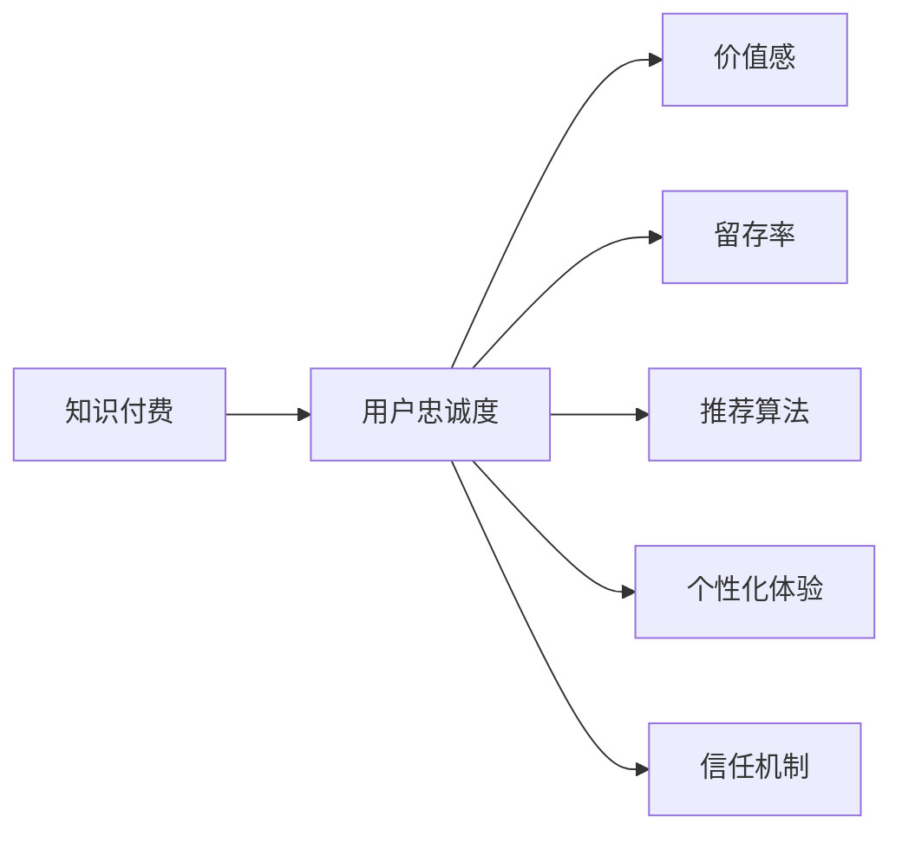

                 

# 知识付费赚钱的用户忠诚度提升与维系策略

> 关键词：知识付费, 用户忠诚度, 价值感, 留存率, 推荐算法, 个性化体验, 信任机制

## 1. 背景介绍

在知识付费领域，用户忠诚度的提升与维系是平台盈利的关键。知识付费平台如得到、喜马拉雅等，以高质量的课程内容吸引用户付费，通过平台获取知识、技能提升。然而，随着知识付费市场的竞争加剧，如何有效提升用户忠诚度，实现用户长期稳定付费，成为平台亟需解决的问题。

## 2. 核心概念与联系

### 2.1 核心概念概述

- **知识付费**：用户通过付费获取高质量课程、讲座等知识内容的平台。
- **用户忠诚度**：指用户对平台的黏性，包括重复购买、持续订阅、口碑传播等行为。
- **价值感**：用户从平台获取的知识、技能对其自身价值的提升。
- **留存率**：指在一段时间内，用户持续使用平台的频率，是衡量用户忠诚度的一个重要指标。
- **推荐算法**：通过算法为用户推荐个性化内容，提升用户体验，从而增强用户忠诚度。
- **个性化体验**：根据用户行为、兴趣等信息，提供定制化内容，满足用户个性化需求。
- **信任机制**：建立平台与用户之间的信任关系，包括透明的价格体系、优质的内容服务、良好的用户反馈机制等。

这些核心概念之间的逻辑关系可以通过以下Mermaid流程图来展示：



这个流程图展示了大知识付费平台中各个关键概念之间的联系。

## 3. 核心算法原理 & 具体操作步骤

### 3.1 算法原理概述

提升用户忠诚度与维系用户，本质上是平台对用户价值感、个性化体验和信任机制的综合提升过程。具体而言，可以通过以下几个步骤实现：

1. **内容推荐**：通过推荐算法为用户推荐个性化内容，提升用户价值感，增加用户粘性。
2. **个性化定制**：通过用户行为数据，提供定制化课程推荐、学习路径设计等个性化体验，增强用户满意度。
3. **信任建设**：通过透明的定价体系、优质的课程内容、良好的用户反馈机制等，建立平台与用户之间的信任关系。

### 3.2 算法步骤详解

#### 3.2.1 内容推荐算法

内容推荐是提升用户忠诚度的核心手段。常见的推荐算法包括协同过滤、基于内容的推荐、矩阵分解等。

- **协同过滤**：通过用户行为数据，如购买记录、浏览历史等，找到兴趣相似的其他用户，推荐其已购买或浏览过的内容。
- **基于内容的推荐**：根据课程内容标签，推荐与用户已学习内容相似的新课程。
- **矩阵分解**：将用户行为数据转化为低维矩阵，通过奇异值分解(SVD)等方法，找到用户与内容的隐含特征，推荐相似内容。

#### 3.2.2 个性化定制

个性化定制是提升用户忠诚度的重要手段。平台可以通过用户行为数据，提供定制化的课程推荐和学习路径。

- **行为分析**：通过用户的购买记录、学习时长、课程评价等行为数据，分析用户偏好和学习习惯。
- **学习路径设计**：根据用户偏好和知识水平，设计个性化学习路径，推荐符合用户需求的新课程。

#### 3.2.3 信任建设

信任建设是维系用户的关键。平台需要建立透明的定价体系、优质的课程内容、良好的用户反馈机制等，增强用户信任。

- **定价透明度**：清晰展示课程价格和折扣信息，让用户明明白白消费。
- **优质课程内容**：提供高性价比的优质课程，提升用户满意度。
- **用户反馈机制**：建立用户反馈渠道，及时响应用户需求和问题，增强用户粘性。

### 3.3 算法优缺点

#### 3.3.1 内容推荐算法

- **优点**：
  - 能够精准定位用户兴趣，推荐符合用户需求的内容。
  - 通过用户行为数据，发现隐含的潜在需求，提高用户留存率。

- **缺点**：
  - 需要大量标注数据和计算资源，对数据质量要求较高。
  - 算法复杂度较高，容易产生冷启动问题，即新用户或新内容难以推荐。

#### 3.3.2 个性化定制

- **优点**：
  - 通过个性化定制，提升用户体验，增加用户黏性。
  - 通过学习路径设计，帮助用户快速掌握知识，提高学习效率。

- **缺点**：
  - 需要处理大量用户数据，计算成本较高。
  - 个性化定制需要不断迭代优化，对技术要求较高。

#### 3.3.3 信任建设

- **优点**：
  - 通过透明的定价和优质的内容，建立用户信任，增强用户忠诚度。
  - 通过用户反馈机制，及时解决问题，提升用户满意度。

- **缺点**：
  - 信任建设需要长期积累，难以短时间内见效。
  - 用户反馈机制需要持续维护和优化，存在维护成本。

### 3.4 算法应用领域

#### 3.4.1 在线教育平台

在线教育平台如得到、喜马拉雅等，利用推荐算法、个性化定制和信任建设，提升用户忠诚度。通过课程推荐和个性化学习路径设计，满足用户个性化需求，同时通过透明的定价和优质的内容，增强用户信任。

#### 3.4.2 知识分享社区

知识分享社区如知乎、豆瓣等，利用个性化推荐算法，提升用户价值感和满意度。通过用户行为数据，推荐相关话题和内容，同时建立透明的社区规则和良好的用户反馈机制，增强用户信任。

## 4. 数学模型和公式 & 详细讲解 & 举例说明

### 4.1 数学模型构建

知识付费平台的推荐算法，通常基于用户行为数据和课程内容信息构建。设用户集合为 $U$，课程集合为 $I$，用户行为矩阵为 $\mathbf{R} \in \mathbb{R}^{N \times M}$，其中 $N$ 为用户数量，$M$ 为课程数量，$r_{ui} \in [0,1]$ 表示用户 $u$ 对课程 $i$ 的评分。

### 4.2 公式推导过程

基于协同过滤的推荐算法，可以通过用户行为数据构建用户-课程矩阵 $\mathbf{R}$。设用户 $u$ 对课程 $i$ 的评分向量为 $\mathbf{r}_u$，课程 $i$ 的评分向量为 $\mathbf{r}_i$。根据协同过滤算法，用户 $u$ 对课程 $j$ 的推荐评分 $\hat{r}_{uj}$ 可以表示为：

$$
\hat{r}_{uj} = \sum_{i \in \mathcal{I}} r_{ui} r_{ij} / \sqrt{\sum_{i \in \mathcal{I}} r_{ui}^2} \sqrt{\sum_{j \in \mathcal{I}} r_{ij}^2}
$$

其中 $\mathcal{I}$ 为课程集合，$\hat{r}_{uj}$ 为课程 $j$ 的推荐评分。

### 4.3 案例分析与讲解

假设用户 $u$ 已购买课程 $i_1,i_2$，且对 $i_1$ 评分 $r_{u1} = 0.9$，对 $i_2$ 评分 $r_{u2} = 0.7$。课程 $i_3,i_4$ 分别与 $i_1,i_2$ 兴趣相似，且用户未购买或评分未知。此时，系统推荐用户 $u$ 购买课程 $i_3,i_4$ 的评分 $\hat{r}_{u3},\hat{r}_{u4}$ 可以表示为：

$$
\hat{r}_{u3} = \frac{r_{u1}r_{13} + r_{u2}r_{23}}{\sqrt{r_{u1}^2 + r_{u2}^2} \sqrt{r_{13}^2 + r_{23}^2}}
$$

$$
\hat{r}_{u4} = \frac{r_{u1}r_{14} + r_{u2}r_{24}}{\sqrt{r_{u1}^2 + r_{u2}^2} \sqrt{r_{14}^2 + r_{24}^2}}
$$

其中 $r_{13},r_{23},r_{14},r_{24}$ 表示课程 $i_3,i_4$ 与 $i_1,i_2$ 的兴趣相似度。

## 5. 项目实践：代码实例和详细解释说明

### 5.1 开发环境搭建

知识付费平台推荐系统的开发需要搭建Python开发环境，并使用相应的机器学习库和框架。

1. 安装Python：从官网下载并安装最新版本的Python。
2. 安装PyTorch：通过命令行安装PyTorch，用于构建和训练推荐模型。
3. 安装TensorFlow：通过命令行安装TensorFlow，用于构建和训练推荐模型。
4. 安装Pandas：通过命令行安装Pandas，用于数据处理和分析。
5. 安装Scikit-learn：通过命令行安装Scikit-learn，用于机器学习模型的训练和评估。
6. 安装Flask：通过命令行安装Flask，用于搭建推荐系统的API服务。

### 5.2 源代码详细实现

以下是一个基于协同过滤算法的推荐系统实现示例：

```python
import pandas as pd
import numpy as np
from sklearn.metrics.pairwise import cosine_similarity
from scipy.sparse import csr_matrix

# 加载用户行为数据
data = pd.read_csv('user_behavior.csv')

# 构建用户-课程评分矩阵
R = csr_matrix(data[['user_id', 'course_id', 'rating']].to_dict('numpy'))

# 计算用户相似度矩阵
U = R.T @ R @ R
U_sqrt = np.sqrt(U.sum(axis=1))

# 推荐新课程
def recommend_course(user_id, top_n=5):
    user_row = R[user_id-1].T
    similarities = (U[user_row] @ U_sqrt).A1
    top_index = np.argsort(similarities)[-top_n:]
    recommendations = R[top_index].A1.T
    return top_index.tolist()

# 测试推荐系统
user_id = 1
top_courses = recommend_course(user_id)
print(top_courses)
```

### 5.3 代码解读与分析

- `load_data`：加载用户行为数据，包括用户ID、课程ID和评分。
- `build_user_course_matrix`：将用户行为数据构建为稀疏矩阵，方便后续计算。
- `calculate_similarity`：计算用户相似度矩阵，利用用户行为数据构建用户-课程评分矩阵，计算用户与课程之间的相似度。
- `recommend_course`：推荐新课程，通过相似度矩阵，推荐与用户兴趣相似的新课程。
- `test_recommender`：测试推荐系统，给出特定用户的推荐课程列表。

## 6. 实际应用场景

### 6.1 在线教育平台

在线教育平台如得到、喜马拉雅等，利用推荐算法、个性化定制和信任建设，提升用户忠诚度。通过课程推荐和个性化学习路径设计，满足用户个性化需求，同时通过透明的定价和优质的内容，增强用户信任。

### 6.2 知识分享社区

知识分享社区如知乎、豆瓣等，利用个性化推荐算法，提升用户价值感和满意度。通过用户行为数据，推荐相关话题和内容，同时建立透明的社区规则和良好的用户反馈机制，增强用户信任。

### 6.3 在线图书商店

在线图书商店如亚马逊、当当网等，利用推荐算法、个性化定制和信任建设，提升用户忠诚度。通过书籍推荐和个性化阅读路径设计，满足用户个性化需求，同时通过透明的定价和优质的内容，增强用户信任。

## 7. 工具和资源推荐

### 7.1 学习资源推荐

- **《推荐系统实践》**：该书详细介绍了推荐算法的设计和实现，包括协同过滤、基于内容的推荐、矩阵分解等。
- **Coursera上的《Recommender Systems》课程**：由斯坦福大学开设，介绍了推荐算法的基本原理和应用。
- **《深度学习推荐系统》**：该书介绍了深度学习在推荐系统中的应用，包括神经网络、注意力机制等。

### 7.2 开发工具推荐

- **PyTorch**：用于构建和训练推荐模型，支持深度学习和动态计算图。
- **TensorFlow**：用于构建和训练推荐模型，支持大规模分布式计算。
- **Pandas**：用于数据处理和分析，支持高效的稀疏矩阵计算。
- **Flask**：用于搭建推荐系统的API服务，支持快速搭建Web应用。

### 7.3 相关论文推荐

- **《协同过滤推荐系统》**：介绍了协同过滤算法的基本原理和实现方法。
- **《基于内容的推荐系统》**：介绍了基于内容的推荐算法的设计和实现。
- **《深度学习在推荐系统中的应用》**：介绍了深度学习在推荐系统中的应用，包括神经网络和注意力机制。

## 8. 总结：未来发展趋势与挑战

### 8.1 研究成果总结

本文从知识付费平台的推荐算法出发，介绍了提升用户忠诚度与维系用户的策略。通过内容推荐、个性化定制和信任建设，平台可以有效提升用户忠诚度，实现长期稳定付费。

### 8.2 未来发展趋势

- **深度学习在推荐算法中的应用**：未来的推荐算法将更多地采用深度学习技术，如神经网络、注意力机制等，提升推荐精度和个性化能力。
- **用户行为数据分析**：未来的推荐系统将更多地利用用户行为数据，通过深度学习模型挖掘用户潜在需求，提供更加精准的推荐。
- **多模态信息融合**：未来的推荐系统将更多地利用多模态信息，如文本、图片、视频等，提升推荐效果。

### 8.3 面临的挑战

- **数据隐私和安全**：如何保护用户数据隐私，确保推荐系统安全可靠，是一个重要挑战。
- **算法透明性和可解释性**：如何提高推荐算法的透明性和可解释性，让用户明白推荐依据，是一个重要挑战。
- **冷启动问题**：如何处理新用户或新内容的冷启动问题，是一个重要挑战。

### 8.4 研究展望

未来的推荐系统需要不断优化算法、提升透明度、保护隐私。通过深度学习技术、多模态信息融合等手段，提升推荐精度和个性化能力，同时保护用户隐私，增强算法透明性和可解释性，解决冷启动问题，推动知识付费平台的持续发展。

## 9. 附录：常见问题与解答

**Q1: 推荐算法有哪些类型？**

A: 推荐算法主要有以下几种类型：
- 协同过滤：通过用户行为数据，找到兴趣相似的其他用户或物品，进行推荐。
- 基于内容的推荐：根据物品特征，推荐与用户已喜欢物品相似的新物品。
- 矩阵分解：将用户行为数据转化为低维矩阵，通过奇异值分解等方法，找到用户与物品的隐含特征，推荐相似物品。

**Q2: 如何处理冷启动问题？**

A: 冷启动问题可以通过以下几种方法解决：
- 利用用户历史行为数据，预测新用户兴趣。
- 利用物品特征信息，推荐相似物品。
- 利用用户输入的偏好信息，快速推荐符合用户需求的新物品。

**Q3: 如何提高推荐算法的透明性和可解释性？**

A: 提高推荐算法的透明性和可解释性，可以通过以下几种方法：
- 使用可解释的机器学习模型，如决策树、逻辑回归等。
- 提供推荐依据的解释，如用户兴趣、物品特征等。
- 建立透明的推荐规则，让用户明白推荐依据。

**Q4: 如何保护用户数据隐私？**

A: 保护用户数据隐私，可以通过以下几种方法：
- 数据去标识化：将用户数据去标识化，防止泄露用户隐私。
- 数据加密：对用户数据进行加密，防止被非法访问和篡改。
- 用户权限控制：对用户数据访问进行权限控制，防止未经授权访问。

---

作者：禅与计算机程序设计艺术 / Zen and the Art of Computer Programming

