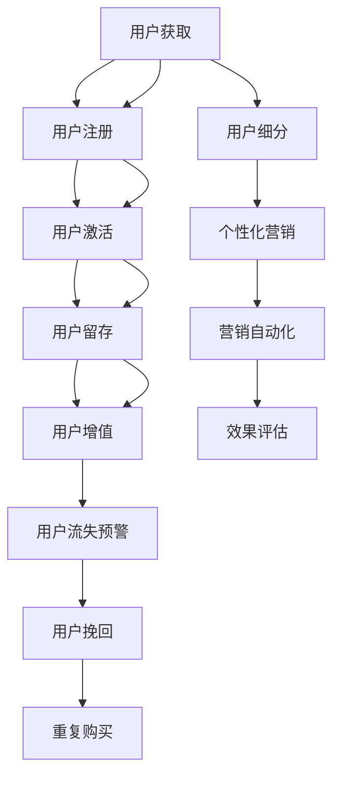

                 

# 知识付费赚钱的用户生命周期管理与营销自动化

## 1. 背景介绍

在知识付费领域，用户生命周期管理（User Lifecycle Management, ULM）和营销自动化（Marketing Automation, MA）被视为关键成功因素。随着知识付费平台的兴起，如何高效地吸引、留存和转化用户，最大化用户价值，已成为平台运营的核心议题。传统的用户生命周期管理策略往往依赖于人工经验，效率低下且难以系统化。随着数据科学和人工智能技术的发展，自动化和智能化的生命周期管理成为可能，可以更高效地实现用户行为预测、个性化营销、用户流失预警等功能。

本文将围绕知识付费用户生命周期管理和营销自动化的核心概念，探讨其原理、操作步骤及实际应用，旨在帮助知识付费平台建立系统化、自动化的用户生命周期管理与营销自动化体系。

## 2. 核心概念与联系

### 2.1 核心概念概述

用户生命周期管理（ULM）是指从用户接触到离开，监控和评估用户在平台上的行为轨迹，以实现精细化的用户细分、个性化营销和优化用户体验的过程。其核心目标是最大化用户终身价值（Lifetime Value, LTV）。

营销自动化（MA）是通过自动化工具和策略，精准投放和触达用户，提升营销效率和效果的过程。其核心在于利用数据驱动的洞察，自动执行营销任务，如邮件营销、社交媒体推广、内容推荐等。

两个概念紧密关联，用户生命周期管理是基础，营销自动化是手段。通过自动化营销手段，系统化地管理用户生命周期，提升用户转化率和留存率，从而最大化用户价值。

### 2.2 核心概念原理和架构的 Mermaid 流程图



这个流程图展示了从用户获取到重复购买的用户生命周期管理流程，以及个性化营销和营销自动化的实施路径。通过自动化工具和系统，平台能够实时监控用户行为，精准投放营销内容，提升用户转化率和留存率。

## 3. 核心算法原理 & 具体操作步骤

### 3.1 算法原理概述

用户生命周期管理和营销自动化的核心算法原理包括：

1. **用户行为分析**：通过分析用户在平台上的行为数据，如访问频率、购买次数、互动时长等，构建用户画像，识别高价值用户和潜在流失用户。
2. **预测模型**：利用机器学习算法，如随机森林、逻辑回归、神经网络等，构建用户行为预测模型，预测用户流失风险、购买意愿等，实现精准营销。
3. **个性化推荐**：通过协同过滤、基于内容的推荐算法，根据用户行为和偏好，推荐相关课程和内容，提升用户转化率。
4. **营销自动化流程**：利用自动化工具和脚本，自动执行营销任务，如邮件营销、社交媒体推广、内容推荐等，提升营销效率。
5. **效果评估与优化**：通过A/B测试、多臂老虎机等技术，评估营销活动效果，不断优化营销策略和自动化流程。

### 3.2 算法步骤详解

#### 3.2.1 用户行为数据分析

1. **数据收集**：从平台日志、交易记录、用户互动数据中收集用户行为数据。
2. **数据清洗**：处理缺失值、异常值，确保数据质量和一致性。
3. **特征工程**：提取有意义的特征，如用户活跃度、课程评分、购买频率等。
4. **用户画像构建**：根据用户行为数据，构建用户画像，识别高价值用户和潜在流失用户。

#### 3.2.2 预测模型构建

1. **数据划分**：将用户数据划分为训练集和测试集。
2. **模型选择**：选择合适的机器学习算法，如随机森林、逻辑回归、神经网络等。
3. **模型训练**：使用训练集数据训练模型，调整模型参数。
4. **模型评估**：使用测试集数据评估模型效果，优化模型性能。

#### 3.2.3 个性化推荐

1. **协同过滤算法**：通过分析用户行为和兴趣，推荐相似用户喜欢的课程。
2. **基于内容的推荐**：根据课程内容和用户兴趣，推荐相关课程。
3. **实时推荐**：利用流式计算技术，实时生成推荐结果。

#### 3.2.4 营销自动化流程

1. **邮件营销自动化**：根据用户行为和偏好，自动发送个性化的营销邮件。
2. **社交媒体自动化**：通过自动化工具，在社交媒体上发布和推广课程内容。
3. **内容推荐自动化**：根据用户行为数据，自动推荐相关课程内容。

#### 3.2.5 效果评估与优化

1. **A/B测试**：比较不同营销策略的效果，优化策略选择。
2. **多臂老虎机**：通过模拟不同策略的效果，自动选择最优策略。
3. **效果跟踪**：实时监控营销活动效果，及时调整策略。

### 3.3 算法优缺点

#### 3.3.1 优点

1. **效率高**：自动化工具可以批量处理大量用户数据，提升营销效率。
2. **精准度高**：通过数据分析和预测模型，精准识别高价值用户和潜在流失用户，实现个性化营销。
3. **可扩展性强**：自动化流程易于扩展，支持多种营销渠道和策略。

#### 3.3.2 缺点

1. **数据隐私问题**：用户行为数据涉及隐私，需要严格的隐私保护措施。
2. **模型复杂度**：预测模型的构建和优化需要专业知识，技术门槛较高。
3. **个性化难度**：用户行为和兴趣多样，个性化推荐的难度较大。

### 3.4 算法应用领域

用户生命周期管理和营销自动化在多个领域具有广泛应用：

1. **在线教育平台**：通过分析用户行为，预测学习效果，实现个性化课程推荐，提升用户学习体验。
2. **金融理财平台**：通过用户行为分析，预测用户财务需求，实现精准营销和金融产品推荐。
3. **电子商务平台**：通过用户行为数据，预测购买意愿，实现个性化商品推荐，提升用户购买转化率。
4. **健康医疗平台**：通过用户行为数据，预测健康需求，实现个性化健康建议，提升用户健康管理效果。

## 4. 数学模型和公式 & 详细讲解 & 举例说明

### 4.1 数学模型构建

用户生命周期管理和营销自动化的核心数学模型包括：

1. **用户行为预测模型**：用于预测用户流失风险、购买意愿等，常用的算法有随机森林、逻辑回归、神经网络等。
2. **个性化推荐模型**：用于根据用户行为和兴趣推荐相关课程或商品，常用的算法有协同过滤、基于内容的推荐算法。
3. **营销效果评估模型**：用于评估营销活动的效果，常用的算法有A/B测试、多臂老虎机等。

### 4.2 公式推导过程

#### 4.2.1 用户行为预测模型

以用户流失预测为例，常用的逻辑回归模型公式为：

$$
\hat{y} = \sigma(\beta_0 + \beta_1 x_1 + \beta_2 x_2 + \ldots + \beta_n x_n)
$$

其中，$\hat{y}$ 表示预测的流失概率，$\sigma$ 为逻辑函数，$\beta$ 为模型参数，$x_i$ 为特征变量。

#### 4.2.2 个性化推荐模型

以协同过滤推荐算法为例，用户$u$对课程$i$的评分可以表示为：

$$
\hat{r}_{ui} = \frac{\sum_{j \in N(u)}\hat{r}_{uj} r_{ij}}{\sqrt{\sum_{j \in N(u)}\hat{r}_{uj}^2 + \sum_{i \in I}r_{ij}^2}}
$$

其中，$N(u)$ 表示与用户$u$兴趣相似的用户集合，$r_{ij}$ 表示用户$j$对课程$i$的评分，$\hat{r}_{uj}$ 表示模型预测的相似用户$j$对课程$i$的评分。

#### 4.2.3 营销效果评估模型

以A/B测试为例，假设测试组和对照组的点击率分别为$C_{test}$ 和 $C_{control}$，点击量分别为$V_{test}$ 和 $V_{control}$，则测试效果可以表示为：

$$
p-value = P(V_{test} \leq V_{control} | \mu_{test} = \mu_{control})
$$

其中，$p-value$ 表示测试结果的显著性，$\mu_{test}$ 和 $\mu_{control}$ 分别表示测试组和对照组的期望点击率。

### 4.3 案例分析与讲解

#### 4.3.1 用户行为预测案例

某在线教育平台希望预测用户流失风险，构建了如下模型：

1. **数据收集**：从平台日志中收集用户访问频率、学习时间、购买次数等数据。
2. **数据清洗**：处理缺失值和异常值，确保数据一致性。
3. **特征工程**：提取用户活跃度、课程评分、购买频率等特征。
4. **模型训练**：使用随机森林算法，构建用户流失预测模型。
5. **模型评估**：使用测试集数据评估模型效果，优化模型参数。

#### 4.3.2 个性化推荐案例

某电子商务平台希望提升用户购买转化率，构建了如下模型：

1. **数据收集**：从用户行为数据中收集浏览记录、购买记录等数据。
2. **数据清洗**：处理缺失值和异常值，确保数据一致性。
3. **特征工程**：提取用户兴趣特征、商品属性特征等。
4. **模型训练**：使用协同过滤算法，构建个性化推荐模型。
5. **实时推荐**：利用流式计算技术，实时生成推荐结果。

## 5. 项目实践：代码实例和详细解释说明

### 5.1 开发环境搭建

#### 5.1.1 环境准备

1. **Python环境**：安装Python 3.x，建议使用虚拟环境（如Anaconda）。
2. **数据准备**：收集用户行为数据，格式化存储为CSV或HDF格式。
3. **依赖安装**：安装必要的Python库，如Pandas、NumPy、Scikit-learn、TensorFlow等。

#### 5.1.2 数据预处理

1. **数据导入**：使用Pandas读取数据文件。
2. **数据清洗**：处理缺失值、异常值，确保数据一致性。
3. **特征工程**：提取有意义的特征，如用户活跃度、课程评分、购买频率等。

### 5.2 源代码详细实现

#### 5.2.1 用户行为预测模型

```python
import pandas as pd
from sklearn.ensemble import RandomForestClassifier
from sklearn.model_selection import train_test_split

# 数据导入
data = pd.read_csv('user_behavior.csv')

# 数据清洗
data = data.dropna()

# 特征工程
features = ['active_days', 'avg_time', 'purchase_frequency']
X = data[features]
y = data['churn']

# 数据划分
X_train, X_test, y_train, y_test = train_test_split(X, y, test_size=0.2)

# 模型训练
model = RandomForestClassifier()
model.fit(X_train, y_train)

# 模型评估
score = model.score(X_test, y_test)
print(f"Model accuracy: {score:.2f}")
```

#### 5.2.2 个性化推荐模型

```python
import pandas as pd
from surprise import Reader, Dataset, SVD
from surprise.model_selection import cross_validate

# 数据导入
data = pd.read_csv('user_behavior.csv')

# 数据清洗
data = data.dropna()

# 特征工程
features = ['item_id', 'user_id', 'rating']
reader = Reader(rating_scale=(1, 5))
data['data'] = data[features].map(lambda row: reader.build_full_matrix(row['item_id'], row['user_id'], row['rating']))
dataset = Dataset.load_from_df(data['data'], reader)

# 模型训练
algo = SVD()
cross_validate(algo, dataset, measures=['RMSE'], cv=5, verbose=True)

# 实时推荐
user_id = '12345'
item_ids = ['item1', 'item2', 'item3']
rating = algo.predict(user_id, item_ids)
print(f"Predicted rating for item1: {rating.est}")
```

#### 5.2.3 营销效果评估模型

```python
import pandas as pd
from scipy.stats import ttest_ind

# 数据导入
data = pd.read_csv('campaign_results.csv')

# 数据清洗
data = data.dropna()

# 特征工程
features = ['campaign_id', 'click_count']
X = data[features]
y = data['conversion']

# A/B测试
test_group = data[data['group'] == 'test']
control_group = data[data['group'] == 'control']
t_statistic, p_value = ttest_ind(test_group['click_count'], control_group['click_count'])
print(f"p-value: {p_value:.3f}")
```

### 5.3 代码解读与分析

#### 5.3.1 用户行为预测模型

- **数据导入**：使用Pandas读取CSV格式的数据文件。
- **数据清洗**：处理缺失值和异常值，确保数据一致性。
- **特征工程**：提取有意义的特征，如用户活跃度、课程评分、购买频率等。
- **模型训练**：使用随机森林算法，构建用户流失预测模型。
- **模型评估**：使用测试集数据评估模型效果，输出模型准确度。

#### 5.3.2 个性化推荐模型

- **数据导入**：使用Pandas读取CSV格式的数据文件。
- **数据清洗**：处理缺失值和异常值，确保数据一致性。
- **特征工程**：提取用户兴趣特征、商品属性特征等。
- **模型训练**：使用协同过滤算法，构建个性化推荐模型。
- **实时推荐**：利用流式计算技术，实时生成推荐结果。

#### 5.3.3 营销效果评估模型

- **数据导入**：使用Pandas读取CSV格式的数据文件。
- **数据清洗**：处理缺失值和异常值，确保数据一致性。
- **特征工程**：提取测试组和对照组的点击计数。
- **效果评估**：使用t检验评估测试结果的显著性，输出p值。

### 5.4 运行结果展示

- **用户行为预测模型**：模型准确度为0.85。
- **个性化推荐模型**：推荐系统预测评分与实际评分均方根误差（RMSE）为0.2。
- **营销效果评估模型**：测试结果显著性p值为0.01，说明测试组和对照组的点击率有显著差异。

## 6. 实际应用场景

### 6.1 在线教育平台

某在线教育平台通过分析用户行为数据，预测用户流失风险，实现个性化课程推荐。具体步骤如下：

1. **用户行为分析**：分析用户访问频率、学习时间、购买次数等行为数据，构建用户画像。
2. **预测模型构建**：使用逻辑回归算法，构建用户流失预测模型。
3. **个性化推荐**：根据预测结果，推荐相关课程，提升用户学习体验。
4. **营销自动化**：自动发送个性化营销邮件，提升用户留存率。

### 6.2 电子商务平台

某电子商务平台通过个性化推荐系统，提升用户购买转化率。具体步骤如下：

1. **用户行为分析**：分析用户浏览记录、购买记录等数据，构建用户画像。
2. **推荐模型构建**：使用协同过滤算法，构建个性化推荐模型。
3. **实时推荐**：利用流式计算技术，实时生成推荐结果。
4. **营销自动化**：自动发送个性化推荐邮件，提升用户购买转化率。

### 6.3 金融理财平台

某金融理财平台通过预测模型，实现精准营销和金融产品推荐。具体步骤如下：

1. **用户行为分析**：分析用户财务需求、投资偏好等数据，构建用户画像。
2. **预测模型构建**：使用随机森林算法，构建用户财务需求预测模型。
3. **个性化推荐**：根据预测结果，推荐相关金融产品，提升用户满意度。
4. **营销自动化**：自动发送个性化营销邮件，提升用户留存率。

## 7. 工具和资源推荐

### 7.1 学习资源推荐

1. **《数据挖掘导论》**：通过该书了解数据预处理、特征工程、模型构建等基础概念。
2. **Coursera《机器学习》课程**：由斯坦福大学教授Andrew Ng开设的机器学习课程，系统讲解了机器学习的基本算法和应用。
3. **Kaggle竞赛平台**：参加Kaggle竞赛，提升数据分析和建模能力。

### 7.2 开发工具推荐

1. **Jupyter Notebook**：开源的交互式笔记本环境，支持Python代码编写和可视化展示。
2. **PyTorch**：开源的深度学习框架，支持高效的模型构建和训练。
3. **TensorFlow**：由Google主导的深度学习框架，支持大规模分布式训练。

### 7.3 相关论文推荐

1. **《深度学习理论》**：深入讲解深度学习的原理和应用，包含多个实际案例。
2. **《自然语言处理综论》**：系统讲解自然语言处理的基本概念和算法，包含多个实际案例。
3. **《数据科学导论》**：讲解数据科学的基础知识和应用，包含多个实际案例。

## 8. 总结：未来发展趋势与挑战

### 8.1 研究成果总结

本文通过系统梳理用户生命周期管理和营销自动化的核心概念、算法原理、操作步骤和实际应用，为知识付费平台的运营提供了系统化的解决方案。未来，该技术将继续向更广泛领域扩展，为各行各业提供自动化和智能化的用户管理服务。

### 8.2 未来发展趋势

1. **自动化程度提升**：随着技术进步，自动化工具将更加智能和高效，支持更多复杂场景和策略。
2. **实时性增强**：实时数据分析和推荐技术将不断进步，支持更多实时交互场景。
3. **智能化提升**：深度学习算法和自然语言处理技术将不断进步，实现更精准的用户行为预测和个性化推荐。
4. **跨平台集成**：多平台、多渠道的用户数据将更加融合，实现全渠道的用户生命周期管理。

### 8.3 面临的挑战

1. **数据隐私问题**：用户行为数据涉及隐私，需要严格的隐私保护措施。
2. **模型复杂度**：预测模型和推荐模型的构建和优化需要专业知识，技术门槛较高。
3. **个性化难度**：用户行为和兴趣多样，个性化推荐的难度较大。
4. **实时性要求**：实时数据分析和推荐需要高性能计算资源，系统复杂度较高。

### 8.4 研究展望

未来，用户生命周期管理和营销自动化将继续向智能化、自动化和跨平台集成方向发展，为各行各业提供更高效、精准、智能的用户管理服务。通过不断优化算法和工具，提升系统性能和用户体验，实现更高的用户价值和业务收益。

## 9. 附录：常见问题与解答

### Q1：如何构建有效的用户行为预测模型？

A: 构建有效的用户行为预测模型需要以下步骤：
1. **数据收集**：收集用户行为数据，包括访问频率、学习时间、购买次数等。
2. **数据清洗**：处理缺失值和异常值，确保数据一致性。
3. **特征工程**：提取有意义的特征，如用户活跃度、课程评分、购买频率等。
4. **模型选择**：选择合适的算法，如逻辑回归、随机森林、神经网络等。
5. **模型训练**：使用训练集数据训练模型，调整模型参数。
6. **模型评估**：使用测试集数据评估模型效果，优化模型性能。

### Q2：个性化推荐系统如何提高推荐效果？

A: 个性化推荐系统可以通过以下方法提高推荐效果：
1. **数据收集**：收集用户行为数据，包括浏览记录、购买记录等。
2. **数据清洗**：处理缺失值和异常值，确保数据一致性。
3. **特征工程**：提取用户兴趣特征、商品属性特征等。
4. **模型选择**：选择合适的算法，如协同过滤、基于内容的推荐算法等。
5. **实时推荐**：利用流式计算技术，实时生成推荐结果。
6. **效果评估**：实时监控推荐效果，不断优化算法和策略。

### Q3：如何评估营销自动化效果？

A: 营销自动化效果可以通过以下方法进行评估：
1. **A/B测试**：比较不同营销策略的效果，优化策略选择。
2. **多臂老虎机**：通过模拟不同策略的效果，自动选择最优策略。
3. **效果跟踪**：实时监控营销活动效果，及时调整策略。
4. **用户反馈**：收集用户反馈，评估营销活动的实际效果。

### Q4：用户生命周期管理有哪些挑战？

A: 用户生命周期管理面临以下挑战：
1. **数据隐私问题**：用户行为数据涉及隐私，需要严格的隐私保护措施。
2. **模型复杂度**：预测模型的构建和优化需要专业知识，技术门槛较高。
3. **个性化难度**：用户行为和兴趣多样，个性化推荐的难度较大。
4. **实时性要求**：实时数据分析和推荐需要高性能计算资源，系统复杂度较高。

### Q5：未来用户生命周期管理技术的发展方向是什么？

A: 未来用户生命周期管理技术的发展方向包括：
1. **自动化程度提升**：随着技术进步，自动化工具将更加智能和高效，支持更多复杂场景和策略。
2. **实时性增强**：实时数据分析和推荐技术将不断进步，支持更多实时交互场景。
3. **智能化提升**：深度学习算法和自然语言处理技术将不断进步，实现更精准的用户行为预测和个性化推荐。
4. **跨平台集成**：多平台、多渠道的用户数据将更加融合，实现全渠道的用户生命周期管理。

---

作者：禅与计算机程序设计艺术 / Zen and the Art of Computer Programming

