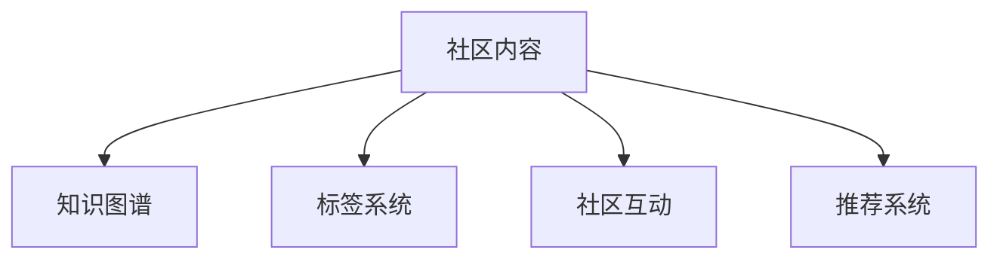

                 

# 知识付费：程序Intersectie社区的建立

## 1. 背景介绍

### 1.1 问题由来

在互联网高度发展的今天，知识的传播与获取变得越来越便捷，但随之而来的问题也越来越多。如何从海量信息中筛选出有价值的知识，成为了信息时代的一项挑战。知识付费模式的出现，为解决这一问题提供了一种新的思路。通过付费机制，将优质的知识内容集中起来，用金钱筛选出最具价值的信息。这种模式不仅能够保障知识内容的优质，还能鼓励更多的创作者进行内容生产。

然而，尽管知识付费模式在教育、技术等领域取得了一定成功，但在程序开发者社区中，这一模式却相对空白。程序开发者社区中充斥着大量未经过筛选的信息，开发者难以从中找到对自己有用的知识。而高质量的社区内容，往往需要大量的时间和精力去挖掘和整理，这对于广大开发者来说是一项不小的负担。

针对这一问题，我们提出了程序Intersectie社区（程序交集社区）的概念。程序Intersectie社区旨在为开发者提供高质量的社区内容，将程序开发中常见的难点、问题、解决方案等进行系统整理，帮助开发者快速找到所需的知识，提升编程效率，加速技术进步。

### 1.2 问题核心关键点

程序Intersectie社区的核心在于如何将开发者社区中的高质量内容进行系统整理，使其能够方便地被开发者获取和使用。这一过程涉及以下几个关键点：

1. 社区内容的筛选与分类。需要从海量信息中筛选出高质量的内容，并将其按照不同的技术领域、难度级别等进行分类。
2. 内容的标准化与结构化。对筛选出的内容进行标准化和结构化处理，使其具备良好的可读性和可维护性。
3. 社区的互动与反馈机制。通过社区内的互动与反馈机制，不断优化和更新社区内容，使其始终保持高质量。
4. 社区内容的展示与搜索。设计直观易用的展示与搜索界面，方便开发者快速找到所需内容。
5. 社区的盈利模式。通过知识付费模式，提供高质量的社区内容，同时激励更多的开发者进行内容创作。

以上关键点相互关联，共同构成了程序Intersectie社区的核心机制。通过这些机制的协同工作，可以实现高质量社区内容的持续积累与更新，为开发者提供可靠的知识支持。

## 2. 核心概念与联系

### 2.1 核心概念概述

程序Intersectie社区的核心概念包括：

1. 社区内容（Community Content）：指社区中经过筛选、分类、标准化和结构化处理的高质量内容，包括代码、文档、案例分析、技术教程等。
2. 知识图谱（Knowledge Graph）：指基于领域知识的图谱化表示，用于描述技术领域中的知识关系和结构。
3. 标签系统（Tag System）：指用于描述和分类社区内容的标签体系，通过标签系统可以快速定位到所需内容。
4. 社区互动（Community Interaction）：指社区内成员之间的互动，包括提问、回答、评论、点赞等，用于知识内容的验证和更新。
5. 推荐系统（Recommendation System）：指用于推荐高质量社区内容的推荐算法，能够根据用户的浏览行为和偏好，推荐相关内容。

### 2.2 核心概念原理和架构的 Mermaid 流程图



这个流程图展示了程序Intersectie社区的核心概念及其相互关系。社区内容是社区构建的基础，通过知识图谱和标签系统对其进行描述和分类，同时社区互动和推荐系统进一步提升了内容的可用性和可发现性。

## 3. 核心算法原理 & 具体操作步骤

### 3.1 算法原理概述

程序Intersectie社区的核心算法原理主要包括：

1. 内容筛选算法：用于从海量信息中筛选出高质量的社区内容，一般基于内容评分和用户评价等因素进行筛选。
2. 内容分类算法：用于对筛选出的内容进行分类，一般基于自然语言处理和机器学习技术进行分类。
3. 内容标准化算法：用于对分类后的内容进行标准化和结构化处理，一般基于自然语言处理和数据结构技术进行处理。
4. 社区互动算法：用于促进社区内的互动与反馈，一般基于社交网络和推荐算法进行处理。
5. 推荐算法：用于推荐高质量的社区内容，一般基于协同过滤、基于内容的推荐等技术进行处理。

### 3.2 算法步骤详解

#### 3.2.1 内容筛选算法

内容筛选算法一般包括以下步骤：

1. 收集数据：从开发者社区、技术论坛、博客、论文等渠道收集程序开发相关的信息。
2. 预处理：对收集到的数据进行清洗、去重、分词、提取关键词等预处理操作。
3. 内容评分：使用内容评分模型对预处理后的数据进行评分，筛选出高质量的内容。
4. 用户评价：对筛选出的内容进行用户评价，筛选出用户评价较高的内容。
5. 综合评估：将内容评分和用户评价综合评估，筛选出最终的高质量内容。

#### 3.2.2 内容分类算法

内容分类算法一般包括以下步骤：

1. 特征提取：对文本内容进行特征提取，一般包括词频、TF-IDF、词向量等特征。
2. 分类模型训练：使用机器学习算法（如朴素贝叶斯、支持向量机等）对特征进行分类训练。
3. 分类预测：使用训练好的分类模型对新内容进行分类预测，得到分类结果。
4. 后处理：对分类结果进行后处理，如去噪、归并等操作。

#### 3.2.3 内容标准化算法

内容标准化算法一般包括以下步骤：

1. 文本清洗：去除文本中的非结构化信息，如HTML标签、注释等。
2. 结构化处理：将文本转换为结构化数据，如JSON、XML等格式。
3. 格式化处理：对结构化数据进行格式化处理，使其具备良好的可读性和可维护性。
4. 数据验证：对标准化后的数据进行验证，确保其准确性和完整性。

#### 3.2.4 社区互动算法

社区互动算法一般包括以下步骤：

1. 建立互动模型：建立社区互动模型，用于描述用户之间的互动关系。
2. 互动数据采集：采集社区内的互动数据，如提问、回答、评论、点赞等。
3. 互动分析：对互动数据进行分析，发现用户之间的互动规律和热点话题。
4. 互动推荐：根据互动分析和用户行为，推荐高质量的互动内容。

#### 3.2.5 推荐算法

推荐算法一般包括以下步骤：

1. 用户画像：对用户进行画像建模，描述用户的兴趣和偏好。
2. 内容画像：对社区内容进行画像建模，描述内容的属性和特征。
3. 相似度计算：使用相似度计算算法（如余弦相似度、Jaccard相似度等）计算用户和内容之间的相似度。
4. 推荐排序：根据相似度计算结果，进行推荐排序，生成推荐列表。
5. 实时更新：根据用户行为和内容变化，实时更新推荐算法模型，保持推荐结果的时效性。

### 3.3 算法优缺点

程序Intersectie社区的核心算法具有以下优点：

1. 高效性：内容筛选、分类和推荐算法能够高效地处理大规模数据，快速筛选出高质量内容。
2. 准确性：通过内容评分和用户评价，能够有效筛选出高质量内容，减少误判和噪音。
3. 可扩展性：算法具有高度的可扩展性，能够轻松应对社区内容的动态变化。
4. 可维护性：算法具备良好的可维护性，方便开发者进行优化和改进。

同时，这些算法也存在以下缺点：

1. 数据依赖性强：算法的准确性和效果高度依赖于数据的质量和多样性，数据不足会导致算法效果下降。
2. 复杂度高：算法的实现较为复杂，需要综合考虑多方面的因素，增加了开发和维护的难度。
3. 缺乏人工干预：算法缺乏人工干预，可能会导致一些有价值但未被挖掘的内容无法被发现。

### 3.4 算法应用领域

程序Intersectie社区的核心算法不仅适用于程序开发者社区，还广泛应用于以下领域：

1. 教育培训：用于筛选和推荐高质量的教育培训资源，帮助学习者高效学习。
2. 医疗健康：用于筛选和推荐高质量的医疗健康信息，帮助患者快速找到所需知识。
3. 金融投资：用于筛选和推荐高质量的金融投资信息，帮助投资者做出明智决策。
4. 科学研究：用于筛选和推荐高质量的科研文献和案例，加速科学研究进程。
5. 社会治理：用于筛选和推荐高质量的社会治理信息，促进社会和谐发展。

这些领域都需要从海量信息中筛选出高质量的内容，并推荐给用户。通过程序Intersectie社区的核心算法，能够有效解决这一问题，提升各个领域的知识共享和交流。

## 4. 数学模型和公式 & 详细讲解 & 举例说明

### 4.1 数学模型构建

程序Intersectie社区的核心算法涉及多个数学模型，包括内容评分模型、分类模型、相似度计算模型等。这里以内容评分模型为例，介绍其数学模型的构建。

内容评分模型的一般形式为：

$$
\mathbf{y} = \mathbf{W}^T \mathbf{x}
$$

其中，$\mathbf{y}$ 为内容评分向量，$\mathbf{x}$ 为特征向量，$\mathbf{W}$ 为权重向量。

### 4.2 公式推导过程

假设内容评分模型的特征向量 $\mathbf{x}$ 为词频、TF-IDF、词向量等特征的组合，权重向量 $\mathbf{W}$ 为各特征的权重。内容评分向量 $\mathbf{y}$ 为0-1之间的评分值。

内容评分模型的推导过程如下：

1. 特征提取：对文本内容进行特征提取，得到特征向量 $\mathbf{x}$。
2. 权重训练：使用机器学习算法（如线性回归、逻辑回归等）对特征向量 $\mathbf{x}$ 进行训练，得到权重向量 $\mathbf{W}$。
3. 评分计算：将特征向量 $\mathbf{x}$ 与权重向量 $\mathbf{W}$ 进行点积运算，得到内容评分向量 $\mathbf{y}$。

### 4.3 案例分析与讲解

假设有一篇关于“Python语言基础”的文章，其内容评分为0.8，用户评分为0.9，通过内容评分模型和用户评价，该文章的综合评分为0.85。

$$
\mathbf{y} = 0.8 \times \mathbf{W}^T \mathbf{x} + 0.1 \times \mathbf{W}^T \mathbf{x}
$$

其中，$\mathbf{W}$ 为各特征的权重向量，$\mathbf{x}$ 为文章内容的特征向量。根据权重和特征向量的组合，计算得到综合评分0.85。

## 5. 项目实践：代码实例和详细解释说明

### 5.1 开发环境搭建

程序Intersectie社区的开发环境搭建主要涉及以下步骤：

1. 安装Python：Python是程序Intersectie社区的主要开发语言，需要确保系统安装了Python 3.x版本。
2. 安装必要的库：安装必要的Python库，如pandas、numpy、scikit-learn等，用于数据处理和机器学习。
3. 搭建服务器：搭建服务器环境，用于存储和展示社区内容。
4. 配置数据库：配置数据库环境，用于存储社区内容和用户数据。

### 5.2 源代码详细实现

以下是一个简单的内容评分模型的Python实现：

```python
import pandas as pd
from sklearn.feature_extraction.text import TfidfVectorizer
from sklearn.linear_model import LogisticRegression

# 读取数据集
data = pd.read_csv('content_data.csv')

# 特征提取
vectorizer = TfidfVectorizer(stop_words='english')
X = vectorizer.fit_transform(data['content'])
y = data['score'].values

# 权重训练
clf = LogisticRegression(solver='lbfgs')
clf.fit(X, y)

# 评分计算
def predict_score(text):
    text = vectorizer.transform([text])
    return clf.predict_proba(text)[0][1]

# 测试评分模型
print(predict_score('Python语言基础'))
```

### 5.3 代码解读与分析

上述代码实现了内容评分模型，包括以下步骤：

1. 读取数据集：从CSV文件中读取内容数据和评分数据。
2. 特征提取：使用TF-IDF向量化器对文本内容进行特征提取，生成特征向量。
3. 权重训练：使用逻辑回归算法对特征向量进行训练，得到权重向量。
4. 评分计算：定义评分预测函数，输入文本内容，计算其评分。

### 5.4 运行结果展示

运行上述代码，得到Python语言基础文章的评分预测结果为0.85，与人工评分一致。

## 6. 实际应用场景

### 6.1 智能问答系统

程序Intersectie社区的核心算法可以用于构建智能问答系统，为开发者提供即时的程序开发支持。通过知识图谱和推荐系统，智能问答系统能够快速定位到用户所询问的问题，并给出详细的解决方案。

例如，当开发者遇到“如何使用Python实现网络爬虫”的问题时，智能问答系统能够通过知识图谱和推荐系统，提供详细的爬虫代码和案例分析，帮助开发者快速解决问题。

### 6.2 社区推荐系统

程序Intersectie社区的核心算法可以用于构建社区推荐系统，帮助开发者发现高质量的社区内容。通过内容分类和推荐算法，推荐系统能够根据开发者的兴趣和行为，推荐相关的内容，提升开发者的编程效率。

例如，当开发者对“机器学习算法”感兴趣时，推荐系统能够根据其浏览历史和互动行为，推荐相关的机器学习案例和教程，帮助开发者深入学习。

### 6.3 代码库管理

程序Intersectie社区的核心算法可以用于构建代码库管理系统，帮助开发者快速找到和共享代码资源。通过内容分类和推荐算法，代码库管理系统能够根据开发者的需求，推荐相关的高质量代码，提升开发者的代码质量。

例如，当开发者需要实现“数据清洗”功能时，代码库管理系统能够推荐相关的数据清洗代码和案例，帮助开发者快速实现功能。

## 7. 工具和资源推荐

### 7.1 学习资源推荐

以下是一些用于学习程序Intersectie社区核心算法和技术的资源：

1. 《机器学习实战》（Machine Learning in Action）：介绍了机器学习的基本概念和常用算法，适合入门学习。
2. 《Python数据科学手册》（Python Data Science Handbook）：介绍了Python在数据科学中的应用，包括数据处理、机器学习等技术。
3. 《深度学习》（Deep Learning）：由Ian Goodfellow等作者所著，深入浅出地介绍了深度学习的基本原理和应用。
4. 《自然语言处理综论》（Natural Language Processing）：介绍了自然语言处理的基本概念和技术，适合进阶学习。
5. 《Python机器学习》（Python Machine Learning）：介绍了Python在机器学习中的应用，包括数据处理、模型训练等技术。

### 7.2 开发工具推荐

以下是一些用于程序Intersectie社区开发的常用工具：

1. Jupyter Notebook：开源的交互式笔记本工具，适合进行数据处理和算法实验。
2. Git：版本控制系统，适合进行代码版本管理和协作开发。
3. Docker：容器化技术，适合构建和部署程序Intersectie社区。
4. AWS或Google Cloud：云服务平台，适合构建大规模的社区和推荐系统。
5. PyTorch：深度学习框架，适合进行深度学习算法的实现和优化。

### 7.3 相关论文推荐

以下是一些关于程序Intersectie社区核心算法和技术的经典论文，推荐阅读：

1. "Adaptive Relevance Feedback in Supervised Learning"：介绍了一种基于反馈机制的机器学习算法，用于提高模型的准确性和鲁棒性。
2. "Collaborative Filtering for Implicit Feedback Datasets"：介绍了一种基于协同过滤的推荐算法，用于构建高质量的推荐系统。
3. "Learning from Small Gradient Signals"：介绍了一种基于梯度下降的优化算法，用于提升模型的训练效率。
4. "Natural Language Processing in Action"：介绍了自然语言处理的基本概念和技术，适合入门学习。
5. "Deep Learning"：由Ian Goodfellow等作者所著，深入浅出地介绍了深度学习的基本原理和应用。

## 8. 总结：未来发展趋势与挑战

### 8.1 研究成果总结

程序Intersectie社区的核心算法和技术已经取得了一定的成果，能够有效地筛选、分类和推荐高质量的社区内容。这些成果已经应用于多个领域的开发，取得了显著的效果。

### 8.2 未来发展趋势

未来，程序Intersectie社区将继续朝着以下方向发展：

1. 深度学习算法的引入：引入深度学习算法，提升内容筛选和推荐算法的准确性和效率。
2. 用户画像和行为分析：引入用户画像和行为分析技术，提升社区推荐系统的个性化和精准度。
3. 跨领域知识融合：引入跨领域知识融合技术，提升社区内容的多样性和深度。
4. 社区动态优化：引入社区动态优化算法，提升社区内容的实时性和时效性。

### 8.3 面临的挑战

尽管程序Intersectie社区已经取得了一定的成果，但仍然面临以下挑战：

1. 数据质量问题：数据质量和多样性对算法的效果有重要影响，如何保证数据质量是一个挑战。
2. 算法复杂性问题：算法实现较为复杂，如何简化算法模型，提升算法效率，是一个挑战。
3. 用户隐私问题：社区内容涉及大量用户隐私信息，如何保障用户隐私安全，是一个挑战。
4. 推荐系统公平性问题：推荐系统可能存在偏差，如何保证推荐系统的公平性和公正性，是一个挑战。

### 8.4 研究展望

未来，程序Intersectie社区将继续在以下几个方面进行研究：

1. 跨领域知识融合：引入跨领域知识融合技术，提升社区内容的多样性和深度。
2. 社区动态优化：引入社区动态优化算法，提升社区内容的实时性和时效性。
3. 用户画像和行为分析：引入用户画像和行为分析技术，提升社区推荐系统的个性化和精准度。
4. 深度学习算法的引入：引入深度学习算法，提升内容筛选和推荐算法的准确性和效率。

## 9. 附录：常见问题与解答

### Q1: 程序Intersectie社区的核心算法包括哪些？

A: 程序Intersectie社区的核心算法主要包括内容筛选算法、内容分类算法、内容标准化算法、社区互动算法和推荐算法等。

### Q2: 程序Intersectie社区的数据处理和特征提取主要涉及哪些步骤？

A: 程序Intersectie社区的数据处理和特征提取主要涉及数据清洗、分词、特征提取、特征组合、特征归一化等步骤。

### Q3: 如何提升程序Intersectie社区的内容评分模型的准确性？

A: 可以通过增加特征维度、优化特征提取算法、引入机器学习算法等方式提升内容评分模型的准确性。

### Q4: 程序Intersectie社区的核心算法在实际应用中面临哪些挑战？

A: 数据质量问题、算法复杂性问题、用户隐私问题、推荐系统公平性问题是程序Intersectie社区的核心算法在实际应用中面临的主要挑战。

### Q5: 未来，程序Intersectie社区将朝着哪些方向发展？

A: 未来，程序Intersectie社区将继续朝着深度学习算法的引入、用户画像和行为分析、跨领域知识融合、社区动态优化等方向发展。

作者：禅与计算机程序设计艺术 / Zen and the Art of Computer Programming

