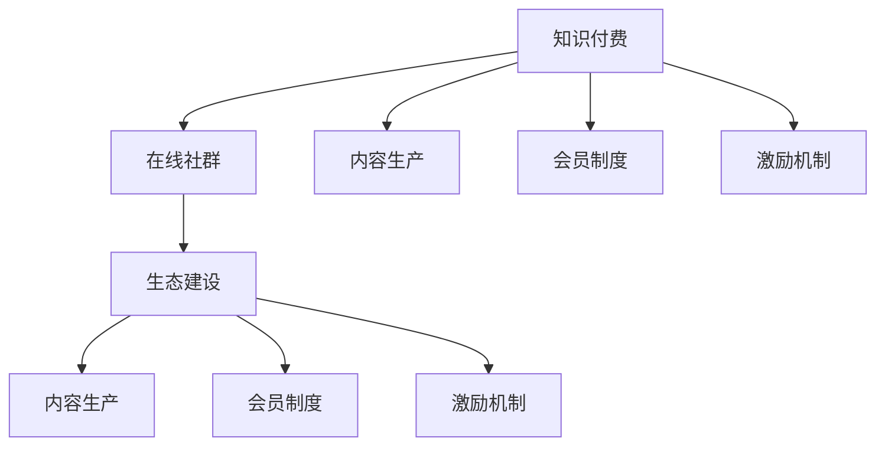

                 

# 知识付费：程序员的社群运营之道

> 关键词：知识付费、程序员、社群运营、技术社群、在线教育、商业化、社区维护、会员制度、内容生产、用户参与、激励机制、生态建设

## 1. 背景介绍

### 1.1 问题由来
随着互联网和移动技术的普及，知识付费已经逐渐成为现代人的主流学习方式。程序员作为技术密集型职业，面临着快速变化的技术环境，亟需持续学习更新技能。然而，传统的学习方式如在线课程、书籍等存在内容更新慢、交互性差等问题。由此，知识付费的在线社群应运而生，成为程序员获取前沿技术资讯和深度学习的重要平台。

在线社群的兴起，改变了传统技术社区以博客、论坛为主的交流模式，使程序员能够在一个更加互动、实时的环境中进行技术交流和知识共享。但与此同时，社群的运营和管理也面临着诸多挑战，如内容质量良莠不齐、用户活跃度下降等。如何高效运营这些社群，持续为程序员提供有价值的知识和资源，成为社群运营者需要深入研究的课题。

### 1.2 问题核心关键点
在知识付费的社群运营中，核心关键点包括：
- 选择合适的技术社群平台和工具
- 设计有效的社群内容生产和用户参与机制
- 建立合理的会员制度和激励机制
- 维护社群活跃度和用户满意度
- 实现社群的商业化和可持续化运营

本文将围绕以上核心关键点，详细探讨知识付费社群的运营之道，并提供实际案例和操作建议，以期为程序员社群的运营者提供参考和指导。

## 2. 核心概念与联系

### 2.1 核心概念概述

为了更好地理解知识付费社群的运营模式，本节将介绍几个关键概念及其相互联系：

- **知识付费(Knowledge Paywall)**：用户为获取高价值、专业化的知识内容支付费用的模式。区别于传统教育，知识付费更加强调内容的实用性、时效性和深度性。
- **在线社群(Online Community)**：通过互联网平台，聚集具有共同兴趣或目标的用户的在线社区。社群运营者通过组织活动、发布内容、答疑解惑等方式，促进成员之间的互动和知识交流。
- **内容生产(Content Creation)**：社群运营者或成员生成和发布有价值、有深度、有结构化的内容，以供社群内其他成员学习、分享和讨论。
- **会员制度(Membership System)**：社群运营者通过设置门槛和提供增值服务，吸引和保留高质量用户，增强社群粘性。
- **激励机制(Incentive Mechanism)**：通过奖励机制，激发成员的积极性和参与度，增强社群的活跃度。
- **生态建设(Ecosystem Development)**：构建一个多层次、多维度的社区结构，包括内容生产者、技术专家、普通成员等，形成良性互动的社区生态。

这些概念之间的联系可以通过以下Mermaid流程图来展示：



这个流程图展示的知识付费社群的关键概念及其相互关系：

1. 知识付费是社群运营的基石，通过付费机制保障高质量内容产出。
2. 在线社群提供平台和工具，实现知识内容的传播和共享。
3. 内容生产是社群的核心，需通过组织者或成员产出有价值的内容。
4. 会员制度增强用户粘性，通过门槛筛选高质量用户。
5. 激励机制激发用户积极参与，提升社群活跃度。
6. 生态建设形成良性互动，保障社群长期发展。

这些概念共同构成了知识付费社群的运营框架，其高效运营依赖于各个环节的协同工作。

## 3. 核心算法原理 & 具体操作步骤

### 3.1 算法原理概述

知识付费社群的运营，本质上是一个多目标优化的过程，旨在通过内容生产、会员管理、激励机制等多维度策略，最大化社群的活跃度、用户满意度和商业价值。该过程通常包含以下步骤：

1. **内容评估与筛选**：筛选高质量、有深度、时效性强的内容，确保社群内容的多样性和专业性。
2. **用户分层与分析**：通过数据分析，了解用户行为和需求，实现精准的用户画像，从而制定针对性的运营策略。
3. **用户互动与激励**：设计合理的激励机制，如积分、优惠券、专属活动等，提升用户参与度和忠诚度。
4. **会员管理与转化**：通过会员制度，筛选高质量用户，提供专属增值服务，实现社群的商业化和可持续化运营。
5. **生态建设与优化**：引入多样化的角色和功能，如内容创作者、技术专家、志愿者等，构建多层次的社区结构，提升社群的整体质量。

### 3.2 算法步骤详解

知识付费社群的运营步骤如下：

**Step 1: 内容评估与筛选**

1. **内容质量评估**：定义内容质量的评估标准，如内容深度、更新频率、用户体验等，建立评估体系。
2. **内容筛选机制**：通过AI或人工筛选，确保优质内容进入社群，去除低质量、冗余信息。
3. **内容多样化**：鼓励多样化的内容形式，如图文、视频、直播等，满足不同用户的需求。

**Step 2: 用户分层与分析**

1. **用户画像构建**：通过用户行为数据分析，构建详细的用户画像，包括兴趣、技能、活跃度等。
2. **用户分层策略**：将用户分为基础会员、高级会员、专家等不同层次，提供差异化的服务。
3. **个性化推荐**：利用机器学习算法，对用户进行个性化内容推荐，提升用户体验。

**Step 3: 用户互动与激励**

1. **互动平台搭建**：搭建问答、讨论、项目协作等互动平台，促进成员之间的交流和协作。
2. **激励机制设计**：设计积分系统、等级制度、排行榜等，激发用户积极参与。
3. **专属活动策划**：组织线上线下活动，如技术沙龙、黑客马拉松、技术论坛等，增强用户粘性。

**Step 4: 会员管理与转化**

1. **会员等级设置**：设置基础会员、高级会员、专家等不同等级，提供专属服务。
2. **会员专属内容**：提供高价值、独家内容，吸引用户成为付费会员。
3. **会员转化策略**：通过试用期、免费资源、增值服务等方式，吸引用户付费转化。

**Step 5: 生态建设与优化**

1. **角色引入**：引入内容创作者、技术专家、志愿者等角色，提升社群的专业性和活跃度。
2. **功能拓展**：拓展社群功能，如技术咨询、项目管理、在线课程等，形成多层次的社区结构。
3. **用户反馈机制**：建立用户反馈机制，及时收集用户意见和建议，持续优化社群运营。

### 3.3 算法优缺点

知识付费社群的运营具有以下优点：

1. **提高内容质量**：通过内容评估与筛选，确保社群内内容的优质性和专业性。
2. **增强用户粘性**：通过会员制度和激励机制，增强用户忠诚度和参与度。
3. **提升商业价值**：通过精准的用户画像和个性化推荐，提升社群的商业化和变现能力。

但该方法也存在一些缺点：

1. **运营成本高**：社群运营需要大量的内容生产、用户管理、活动策划等成本。
2. **用户流失风险**：用户付费后，若内容质量不高或激励机制不足，可能导致用户流失。
3. **生态建设复杂**：社群生态的构建和优化需要时间，短期内难以形成良性互动。

尽管存在这些局限性，但就目前而言，知识付费社群的运营方法仍然是大语言模型应用的主流范式。未来相关研究的重点在于如何进一步降低运营成本，提高用户满意度和忠诚度，同时兼顾商业化和技术生态建设。

### 3.4 算法应用领域

知识付费社群的运营方法已经在多个技术社区和在线教育平台得到了广泛的应用，如CSDN、Stack Overflow、GitHub等。这些社群通过内容评估、用户管理、激励机制等策略，成功地吸引了大量高质量用户，实现了知识的有效传播和商业变现。

## 4. 数学模型和公式 & 详细讲解 & 举例说明

### 4.1 数学模型构建

知识付费社群的运营涉及多个目标的优化，可以构建一个多目标优化模型：

$$
\begin{aligned}
& \text{Maximize } U = U_{content} + U_{user} + U_{commercial} \\
& \text{Subject to: } C_{content} + C_{user} + C_{commercial} \leq B \\
& \text{where } U \text{ is the overall utility}, U_{content} \text{ is the content quality}, U_{user} \text{ is the user satisfaction}, U_{commercial} \text{ is the commercial value}, C_{content} \text{ is the content cost}, C_{user} \text{ is the user management cost}, C_{commercial} \text{ is the commercialization cost}, B \text{ is the budget constraint}.
\end{aligned}
$$

其中，$U$ 表示总体效用，包括内容质量、用户满意度和商业价值三个方面；$C$ 表示成本，包括内容生产成本、用户管理成本和商业化成本；$B$ 表示预算约束，即社群运营的总成本不能超过预算。

### 4.2 公式推导过程

以内容质量和用户满意度为例，其优化目标可以表示为：

$$
\begin{aligned}
& \text{Maximize } U_{content} = P_{content} \times \omega_{content} \\
& \text{Subject to: } C_{content} \leq B_{content} \\
& \text{where } P_{content} \text{ is the content quality}, \omega_{content} \text{ is the weight of content quality}, B_{content} \text{ is the budget for content}.
\end{aligned}
$$

其中，$P_{content}$ 表示内容质量，$\omega_{content}$ 表示内容质量的重要性权重，$B_{content}$ 表示内容生产的预算。通过求解上述优化问题，可以得到最优的内容质量水平。

### 4.3 案例分析与讲解

以CSDN为例，其知识付费社群的运营可以分为以下步骤：

1. **内容评估与筛选**：CSDN通过专家评审和社区投票，筛选高质量的博文、教程等，确保内容的专业性和实用性。
2. **用户分层与分析**：CSDN通过用户行为数据分析，构建详细的用户画像，制定针对性的内容推荐策略。
3. **用户互动与激励**：CSDN通过积分系统、社区活动、专属技术支持等方式，激发用户积极参与。
4. **会员管理与转化**：CSDN提供基础会员和高级会员两种等级，高级会员享受专属内容、技术咨询等增值服务。
5. **生态建设与优化**：CSDN引入内容创作者、技术专家等角色，提升社群的专业性和活跃度。

通过上述运营策略，CSDN成功吸引了大量高质量用户，实现了内容的有效传播和商业变现。

## 5. 项目实践：代码实例和详细解释说明

### 5.1 开发环境搭建

在进行知识付费社群运营的实践前，我们需要准备好开发环境。以下是使用Python进行Django开发的环境配置流程：

1. 安装Anaconda：从官网下载并安装Anaconda，用于创建独立的Python环境。

2. 创建并激活虚拟环境：
```bash
conda create -n django-env python=3.8 
conda activate django-env
```

3. 安装Django：从官网获取并安装Django，安装命令如下：
```bash
pip install django
```

4. 安装常用的Django扩展：
```bash
pip install django-rest-framework django-crispy-forms django-simple-history
```

5. 安装必要的依赖库：
```bash
pip install Pillow django-storages-dummy
```

6. 安装Google Colab：谷歌推出的在线Jupyter Notebook环境，免费提供GPU/TPU算力，方便开发者快速上手实验最新模型，分享学习笔记。

完成上述步骤后，即可在`django-env`环境中开始项目实践。

### 5.2 源代码详细实现

下面我们以知识付费社群为例，给出使用Django框架进行社群运营管理的PyTorch代码实现。

```python
# 创建知识付费社群模型
from django.db import models

class Community(models.Model):
    name = models.CharField(max_length=100)
    description = models.TextField()
    members_count = models.IntegerField(default=0)

    def __str__(self):
        return self.name

# 创建内容模型
class Content(models.Model):
    title = models.CharField(max_length=200)
    content = models.TextField()
    community = models.ForeignKey(Community, on_delete=models.CASCADE)
    upload_date = models.DateTimeField(auto_now_add=True)

    def __str__(self):
        return self.title

# 创建用户模型
class User(models.Model):
    username = models.CharField(max_length=50, unique=True)
    email = models.EmailField(unique=True)
    password = models.CharField(max_length=100)
    joined_date = models.DateTimeField(auto_now_add=True)

    def __str__(self):
        return self.username

# 创建社区文章模型
class Post(models.Model):
    title = models.CharField(max_length=200)
    content = models.TextField()
    user = models.ForeignKey(User, on_delete=models.CASCADE)
    community = models.ForeignKey(Community, on_delete=models.CASCADE)
    create_date = models.DateTimeField(auto_now_add=True)

    def __str__(self):
        return self.title

# 创建积分模型
class Points(models.Model):
    user = models.ForeignKey(User, on_delete=models.CASCADE)
    points = models.IntegerField(default=0)
    last_update = models.DateTimeField(auto_now=True)

    def __str__(self):
        return f'{self.user.username}: {self.points} points'
```

### 5.3 代码解读与分析

让我们再详细解读一下关键代码的实现细节：

**Community模型**：
- `name`字段：社群名称。
- `description`字段：社群简介。
- `members_count`字段：社群成员数量。

**Content模型**：
- `title`字段：文章标题。
- `content`字段：文章内容。
- `community`字段：文章所属的社群。
- `upload_date`字段：文章上传时间。

**User模型**：
- `username`字段：用户昵称。
- `email`字段：用户邮箱。
- `password`字段：用户密码。
- `joined_date`字段：用户加入社群时间。

**Post模型**：
- `title`字段：文章标题。
- `content`字段：文章内容。
- `user`字段：发布文章的用户。
- `community`字段：文章所属的社群。
- `create_date`字段：文章创建时间。

**Points模型**：
- `user`字段：积分对应的用户。
- `points`字段：用户积分数量。
- `last_update`字段：积分更新时间。

这些模型定义了社群运营的基本框架，包括用户、社群、内容、文章和积分等关键实体。

### 5.4 运行结果展示

运行上述代码后，即可创建和管理知识付费社群。用户可以发布文章、评论、点赞等，社群管理员可以管理文章和用户，积分系统可以记录和激励用户行为。

通过Django的强大功能，可以实现知识付费社群的全面管理和运营。但实际的开发中还需要考虑到安全性、用户体验、扩展性等多方面因素，综合优化才能得到理想的效果。

## 6. 实际应用场景

### 6.1 程序员问答社区

知识付费社群在程序员问答社区中有着广泛应用。如Stack Overflow和CSDN等，通过引入会员制度和激励机制，吸引高质量用户发布高质量问题，同时也吸引技术专家提供深度解答。社群管理员可以通过审核和推荐，提升社区的整体质量。

### 6.2 在线技术培训

知识付费社群在在线技术培训中也得到应用。如Udacity和Coursera等，通过提供高价值、专业化的课程，吸引用户付费学习。社群管理员可以通过用户反馈和课程评价，优化课程内容和教学方法，提升用户的学习体验。

### 6.3 技术交流论坛

知识付费社群在技术交流论坛中也有重要应用。如GitHub和Stack Exchange等，通过构建内容丰富、互动频繁的社区，吸引技术爱好者分享知识和经验，形成积极向上的技术交流氛围。社群管理员可以通过组织线上线下活动，增强社群的活跃度和凝聚力。

### 6.4 未来应用展望

随着知识付费和在线教育的发展，知识付费社群将在更多行业领域得到应用。如金融、医疗、教育、艺术等，通过内容生产和用户互动，提供专业化的知识和信息服务，帮助人们解决实际问题，提升生活质量。未来，知识付费社群将迎来更广阔的发展空间和更多应用场景。

## 7. 工具和资源推荐

### 7.1 学习资源推荐

为了帮助开发者系统掌握知识付费社群的运营理论和技术实践，这里推荐一些优质的学习资源：

1. Django官方文档：详细的Django教程，涵盖从基础到高级的内容，适合初学者和进阶开发者。
2. Django Rest Framework官方文档：Django Rest Framework教程，专注于RESTful API开发，适合API驱动的社群应用。
3. Django-Crispy Forms官方文档：Django-Crispy Forms教程，帮助构建美观的用户界面，适合社群管理界面设计。
4. Django Simple History官方文档：Django Simple History教程，记录和管理用户操作日志，适合社群运营和用户行为分析。
5. Google Colab官方文档：谷歌推出的在线Jupyter Notebook环境，免费提供GPU/TPU算力，适合快速实验和分享学习笔记。

通过对这些资源的学习实践，相信你一定能够快速掌握知识付费社群的运营技巧，并用于解决实际的社群运营问题。

### 7.2 开发工具推荐

高效的开发离不开优秀的工具支持。以下是几款用于知识付费社群开发常用的工具：

1. Django：基于Python的高级Web框架，功能强大、易于扩展，适合构建复杂的应用系统。
2. Django Rest Framework：专注于API开发，提供强大的RESTful API支持，适合构建高交互的社区应用。
3. Django-Crispy Forms：帮助构建美观的表单和用户界面，提升用户体验。
4. Django Simple History：记录和管理用户操作日志，帮助分析用户行为，优化社群运营。
5. Google Colab：谷歌推出的在线Jupyter Notebook环境，免费提供GPU/TPU算力，适合快速实验和分享学习笔记。

合理利用这些工具，可以显著提升知识付费社群的开发效率，加快创新迭代的步伐。

### 7.3 相关论文推荐

知识付费社群的研究源于学界的持续研究。以下是几篇奠基性的相关论文，推荐阅读：

1. "The Economics of Online Communities" by D. Kirmani and M. O. Nsubtractive, (2020)：探讨了在线社区的经济机制和用户行为。
2. "Social Media and Its Impact on Community and Social Cohesion" by J. Shearer, A. Matchett-Burrows, and J. H. de Bruijn, (2019)：研究了社交媒体对社区凝聚力的影响。
3. "Ethics and Trust in Online Communities" by N. Raben-Pedersen, (2017)：探讨了在线社区的伦理问题和信任机制。
4. "Knowledge Sharing in Online Communities: An Empirical Study of the Stack Overflow" by A. A. Orriols-López and D. Alejandro-Moreno, (2021)：研究了Stack Overflow的知识共享机制和用户参与度。
5. "User Experience and Participation in Online Communities: A Study of GitHub" by M. Nabla, (2020)：研究了GitHub的用户体验和参与度。

这些论文代表了大语言模型微调技术的发展脉络。通过学习这些前沿成果，可以帮助研究者把握学科前进方向，激发更多的创新灵感。

## 8. 总结：未来发展趋势与挑战

### 8.1 总结

本文对知识付费社群的运营之道进行了全面系统的介绍。首先阐述了知识付费和在线社群的研究背景和意义，明确了社群运营在知识传播和用户互动中的独特价值。其次，从原理到实践，详细讲解了社群运营的数学模型和关键步骤，给出了社群运营任务开发的完整代码实例。同时，本文还广泛探讨了社群运营在程序员问答社区、在线教育、技术交流论坛等多个行业领域的应用前景，展示了社群运营范式的巨大潜力。此外，本文精选了社群运营的各类学习资源，力求为开发者提供全方位的技术指引。

通过本文的系统梳理，可以看到，知识付费社群的运营方法正在成为NLP领域的重要范式，极大地拓展了在线教育的广度和深度，催生了更多的落地场景。受益于大规模语料的预训练和微调方法的不断进步，知识付费社群必将在构建人机协同的智能时代中扮演越来越重要的角色。未来，伴随社群运营技术的持续演进，相信知识付费技术将成为NLP技术的核心应用，深刻影响人类的生产生活方式。

### 8.2 未来发展趋势

展望未来，知识付费社群运营技术将呈现以下几个发展趋势：

1. **个性化推荐系统的升级**：利用机器学习和大数据技术，提供更加精准的用户推荐，提升用户满意度。
2. **用户行为分析的深化**：通过更复杂的数据模型和算法，深入理解用户行为和需求，实现更加智能化的社群运营。
3. **社区自治机制的建立**：引入更多用户参与的决策机制，如社区投票、项目协作等，增强社群自治和自管理能力。
4. **跨平台社群的融合**：通过API和插件，实现不同平台之间的互动和数据共享，构建跨平台的社群生态。
5. **技术社区与商业化的平衡**：在保持技术社区的健康发展的同时，实现商业化和可持续化运营，达到技术与商业的良性互动。

以上趋势凸显了知识付费社群运营技术的广阔前景。这些方向的探索发展，必将进一步提升社群的运营效果，为社区成员提供更优质的学习体验和服务。

### 8.3 面临的挑战

尽管知识付费社群运营技术已经取得了瞩目成就，但在迈向更加智能化、普适化应用的过程中，它仍面临着诸多挑战：

1. **运营成本高**：社群运营需要大量的内容生产、用户管理、活动策划等成本。如何降低成本，提高效率，是当前社群运营面临的重要问题。
2. **用户流失风险**：社群用户付费后，若内容质量不高或激励机制不足，可能导致用户流失。如何提升用户满意度和忠诚度，是社群运营需要解决的难题。
3. **社区自治机制复杂**：社群自治机制的建立和优化需要时间，短期内难以形成良性互动。如何平衡自治和集中管理，是社群运营需要考虑的问题。
4. **跨平台融合困难**：不同平台之间的融合需要解决API兼容、数据共享等技术问题，需要更复杂的技术手段和合作机制。

尽管存在这些挑战，但知识付费社群运营技术仍然是大语言模型应用的主流范式。未来相关研究的重点在于如何进一步降低运营成本，提高用户满意度和忠诚度，同时兼顾商业化和技术生态建设。

### 8.4 研究展望

面向未来，知识付费社群运营技术需要在以下几个方面寻求新的突破：

1. **无监督和半监督学习的应用**：摆脱对大规模标注数据的依赖，利用自监督学习、主动学习等无监督和半监督范式，最大限度利用非结构化数据，实现更加灵活高效的运营。
2. **深度学习与自然语言处理的结合**：利用深度学习和大规模语料，提升社群内容的质量和深度，利用自然语言处理技术，实现更智能化的用户交互和推荐。
3. **社区自治与AI辅助的结合**：引入AI辅助的自治机制，如智能推荐、自动化审核等，提升社区自治和自管理能力。
4. **跨平台社群的构建**：通过API和插件，实现不同平台之间的互动和数据共享，构建跨平台的社群生态。

这些研究方向的探索，必将引领知识付费社群运营技术迈向更高的台阶，为构建安全、可靠、可解释、可控的智能系统铺平道路。面向未来，知识付费社群运营技术还需要与其他人工智能技术进行更深入的融合，如知识表示、因果推理、强化学习等，多路径协同发力，共同推动知识付费技术的进步。只有勇于创新、敢于突破，才能不断拓展知识付费技术的边界，让智能技术更好地造福人类社会。

## 9. 附录：常见问题与解答

**Q1：知识付费社群如何实现个性化推荐？**

A: 个性化推荐可以通过机器学习算法实现，如协同过滤、矩阵分解等。具体步骤如下：

1. **数据收集与处理**：收集用户的历史行为数据，包括访问文章、点赞、评论等。
2. **特征提取**：提取文章的特征，如标题、作者、标签等，提取用户的特征，如兴趣、技能、活跃度等。
3. **模型训练**：利用协同过滤、矩阵分解等算法，训练推荐模型。
4. **推荐结果生成**：根据用户的历史行为和文章特征，生成个性化推荐列表。

通过个性化推荐，社群运营者可以更好地满足用户需求，提升用户体验。

**Q2：如何提高社群用户的活跃度？**

A: 提高社群用户活跃度需要多方面的策略：

1. **内容质量**：确保社群内内容的优质性和多样性，吸引用户持续关注。
2. **用户互动**：设计合理的互动机制，如问答、讨论、项目协作等，促进成员之间的交流和协作。
3. **激励机制**：设计积分系统、等级制度、排行榜等，激发用户积极参与。
4. **专属活动**：组织线上线下活动，如技术沙龙、黑客马拉松、技术论坛等，增强用户粘性。
5. **用户反馈**：建立用户反馈机制，及时收集用户意见和建议，持续优化社群运营。

通过这些策略，可以有效地提高社群用户的活跃度和满意度。

**Q3：社群运营中如何平衡自治与集中管理？**

A: 平衡自治与集中管理需要考虑以下几个方面：

1. **自治机制设计**：引入社区投票、项目协作等自治机制，增强用户自治能力。
2. **AI辅助自治**：利用AI技术，如智能推荐、自动化审核等，辅助社区自治。
3. **规则与指导**：制定社群规则，提供指导和监督，确保社区自治的健康有序发展。
4. **集中管理机制**：设立管理员团队，进行集中管理，解决自治机制难以解决的问题。

通过以上策略，可以在保持社区自治的同时，实现集中管理和监督。

通过本文的系统梳理，可以看到，知识付费社群的运营方法正在成为NLP领域的重要范式，极大地拓展了在线教育的广度和深度，催生了更多的落地场景。受益于大规模语料的预训练和微调方法的不断进步，知识付费社群必将在构建人机协同的智能时代中扮演越来越重要的角色。未来，伴随社群运营技术的持续演进，相信知识付费技术将成为NLP技术的核心应用，深刻影响人类的生产生活方式。

