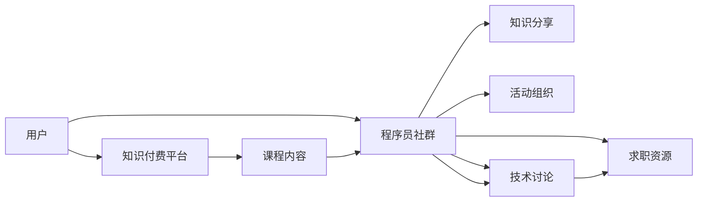

                 

# 知识付费：程序员的社群运营指南

在数字化时代，技术飞速迭代，信息呈爆炸性增长。程序员作为推动这一进程的关键力量，其成长路径变得愈加复杂且竞争激烈。知识付费作为一种新的教育和学习方式，为程序员提供了快速获取最新知识和技能，适应职业发展的机会。本文旨在深入探讨知识付费对程序员社群的影响，并通过案例分析提出有效的社群运营策略。

## 1. 背景介绍

### 1.1 知识付费的兴起
知识付费的兴起源于信息时代的知识碎片化和知识获取的多样化需求。传统的学术期刊、教科书和线下讲座已无法满足专业人士对知识更新速度和深度学习的需要。

随着互联网的普及，技术内容消费形态开始多样化，包括在线课程、技术博客、开源软件分享等。知识付费服务以高效、便捷、高质量等特点，迅速在程序员社群中普及，并逐渐成为主流学习方式之一。

### 1.2 技术社群的角色
程序员社群是知识付费发展的重要阵地，其作用在于：
- **知识交流平台**：成员通过分享和学习，形成良性互动，促进知识传播和吸收。
- **职业发展支持**：为成员提供职业发展路径和资源，包括课程推荐、面试经验分享等。
- **社区氛围营造**：通过活动、论坛和博客等形式，构建积极向上的社区文化。

## 2. 核心概念与联系

### 2.1 核心概念概述

- **知识付费**：用户为获取知识或技能而支付费用，涵盖在线课程、技术博客、问答社区等形式。
- **程序员社群**：由具有共同技术兴趣和职业发展需求的程序员组成，涵盖论坛、博客、开源社区等。
- **社群运营**：通过对社群成员进行管理和引导，提升社群活跃度和质量，达成社群目标。

- **知识付费平台**：如Coursera、Udemy、Bilibili技术区等，提供知识付费内容。
- **社群管理工具**：如Discourse、Slack、GitHub等，用于组织和管理社群活动。

### 2.2 核心概念原理和架构的 Mermaid 流程图



此图展示了知识付费、社群运营和成员交互的关系：用户从知识付费平台获取课程内容，通过社群进行知识分享、活动参与和求职支持，从而形成良性互动。

## 3. 核心算法原理 & 具体操作步骤

### 3.1 算法原理概述

知识付费和社群运营可以看作是一个反馈循环系统。用户在社群中积极学习与分享，提升了社群活跃度和质量，吸引了更多高质量用户，进一步促进了知识的传播与吸收。

### 3.2 算法步骤详解

**Step 1: 选择知识付费平台**
- 确定学习需求：如编程语言、开发框架、项目管理等。
- 筛选付费平台：综合平台口碑、课程质量、师资力量等因素选择平台。

**Step 2: 参与社群活动**
- 关注优质社群：加入知名技术博客、开源社区、开发者论坛等。
- 积极参与互动：通过留言、评论、提问等方式参与社群交流。

**Step 3: 学习与分享**
- 系统学习课程：根据个人需求选择课程，制定学习计划。
- 分享学习成果：将学习心得、项目案例等分享给社群成员，促进知识共享。

**Step 4: 反馈与优化**
- 收集反馈信息：定期收集社群成员对课程、活动和讨论的反馈。
- 持续优化运营：根据反馈不断优化内容、活动和社区管理策略。

### 3.3 算法优缺点

知识付费和社群运营的优势在于：
- **效率高**：通过优质课程和即时互动，快速获取知识。
- **覆盖广**：涵盖多种技术主题，满足多样化的学习需求。
- **质量高**：平台筛选课程和专家，确保内容专业性和权威性。

劣势在于：
- **成本较高**：部分高质量课程费用不菲。
- **内容泛化**：课程内容可能较为通用，缺乏个性化指导。
- **自律性要求高**：需要用户自主学习，缺乏系统性的监督。

### 3.4 算法应用领域

知识付费和社群运营在以下领域得到广泛应用：
- **技术学习**：在线编程课程、技术书籍、视频教程等。
- **职业发展**：求职培训、面试准备、职业规划等。
- **工具与资源分享**：开源项目、代码库、学习工具等。

## 4. 数学模型和公式 & 详细讲解 & 举例说明

### 4.1 数学模型构建

本节将使用数学语言对知识付费和社群运营进行更加严格的描述。

假设有一个技术社群，有 $N$ 名用户。每位用户每天在知识付费平台上花费 $t$ 时间学习，可获取的知识总量为 $K$。社群活跃度 $A$ 与知识总量 $K$ 和用户投入时间 $t$ 成正比，即：

$$ A = \alpha K^{\beta} t^{\gamma} $$

其中 $\alpha$、$\beta$、$\gamma$ 为常数。

### 4.2 公式推导过程

设社群初始用户数为 $N_0$，每天新增用户数为 $n$。则社群总用户数为 $N = N_0 + n \cdot T$，其中 $T$ 为时间。

根据以上假设，知识付费和社群运营的反馈循环系统可以建立如下数学模型：

$$
\begin{cases}
A = \alpha K^{\beta} t^{\gamma} \\
K = f(A) \\
N = N_0 + n \cdot T
\end{cases}
$$

其中 $f(A)$ 为知识总量与社群活跃度的函数关系。

### 4.3 案例分析与讲解

以一个开源社区为例：
- **初期**：社区用户数较少，知识共享不活跃。
- **发展期**：用户通过付费平台获取知识，并积极分享，社群活跃度提升。
- **成熟期**：社群规模不断扩大，知识总量增加，平台吸引更多高质量用户。

## 5. 项目实践：代码实例和详细解释说明

### 5.1 开发环境搭建

首先，我们需要安装所需的开发环境。以下是基于Python的开发环境搭建流程：

1. **安装Python**：下载并安装最新版本的Python解释器。
2. **安装Pip**：在命令行执行 `pip install pip` 安装Pip包管理工具。
3. **安装Git**：下载并安装Git版本控制系统。
4. **安装知识付费平台API**：如Coursera、Udemy等，通常提供Python SDK。
5. **安装社群管理工具**：如Discourse、Slack等，根据平台文档进行安装。

### 5.2 源代码详细实现

以下是一个简化的知识付费平台API调用示例：

```python
from coursera_api import Coursera

# 初始化API
api = Coursera('username', 'password')

# 查询课程
courses = api.get_courses()

# 选择课程
selected_course = courses[0]

# 注册课程
api.enroll_course(selected_course.id)

# 学习课程
api.start_course(selected_course.id)

# 获取课程进度
progress = api.get_course_progress(selected_course.id)
```

### 5.3 代码解读与分析

**API调用**：
- `api.get_courses()`：获取用户所有可报名课程。
- `api.enroll_course(course_id)`：注册选修课程。
- `api.start_course(course_id)`：开始学习课程。
- `api.get_course_progress(course_id)`：获取课程进度。

**社群管理**：
- **Discourse**：通过Discourse社区管理系统，可以对论坛帖子、用户评论进行管理。
- **Slack**：使用Slack平台创建频道和用户群组，进行实时沟通和协作。

### 5.4 运行结果展示

**学习进度报告**：
- 通过API定期获取学习进度，生成报告。
- 显示用户完成的课程、学习时间和知识点掌握情况。

**社区活动参与度报告**：
- 通过社区管理系统记录和分析用户互动数据。
- 生成论坛活跃度、活动参与度、技术讨论次数等报告。

## 6. 实际应用场景

### 6.1 技术学习社区

知识付费和社群运营在技术学习社区中应用广泛。用户通过付费平台学习新技术，在社群内讨论和分享，提升学习效果。例如：
- **在线编程课程**：用户通过Udacity、Coursera等平台学习编程语言、开发框架等。
- **技术博客和论坛**：在Medium、Stack Overflow等平台发布和阅读技术文章。

### 6.2 职业发展平台

知识付费和社群运营为职业发展提供支持，如求职培训、面试准备等。例如：
- **在线求职培训**：通过LinkedIn Learning等平台获取职业发展课程。
- **面试模拟平台**：通过HackerRank等平台进行在线编程面试模拟。

### 6.3 开源社区

知识付费和社群运营推动开源社区的发展，促进技术交流和合作。例如：
- **开源项目贡献**：通过GitHub等平台分享和协作开源项目。
- **代码审查与讨论**：在Slack或Discourse平台上进行代码审查和讨论。

## 7. 工具和资源推荐

### 7.1 学习资源推荐

为帮助程序员系统掌握知识付费和社群运营的知识，推荐以下学习资源：

1. **《知识付费的经济逻辑》**：探讨知识付费的市场环境和发展趋势。
2. **《社群运营的艺术》**：涵盖社群管理、用户互动、内容生成等方面的实战技巧。
3. **《知识付费平台的技术实现》**：介绍知识付费平台的架构和开发技术。
4. **《开源社区运营》**：提供开源社区的建立、运营和管理策略。

### 7.2 开发工具推荐

高效的知识付费和社群运营开发离不开优秀工具的支持。以下是几款常用工具：

1. **Python**：广泛的编程语言，支持丰富的第三方库。
2. **Coursera API**：Coursera提供Python SDK，方便接入课程数据。
3. **Slack**：支持创建频道和用户群组，方便实时沟通。
4. **Discourse**：开源社区管理平台，支持论坛管理。
5. **GitHub**：全球最大的开源平台，支持代码共享和协作。

### 7.3 相关论文推荐

为深入了解知识付费和社群运营，推荐以下几篇相关论文：

1. **《知识付费平台的用户行为分析》**：研究用户在使用知识付费平台的行为模式。
2. **《社群运营效果评估》**：通过实验数据评估社群运营的效果和影响。
3. **《知识付费平台的技术架构设计》**：探讨知识付费平台的技术实现和架构设计。
4. **《开源社区的用户参与模型》**：建立开源社区用户参与的数学模型，并进行分析。

## 8. 总结：未来发展趋势与挑战

### 8.1 研究成果总结

本文深入探讨了知识付费和社群运营的原理、步骤和实践，并给出相关案例和工具推荐。通过系统分析，得出以下结论：
- **知识付费**：高效、便捷、高质量，提升用户学习效果。
- **社群运营**：通过互动和交流，提升社群活跃度和质量。
- **工具和资源**：为知识付费和社群运营提供技术支持。

### 8.2 未来发展趋势

未来，知识付费和社群运营将呈现以下几个趋势：
1. **技术创新**：随着人工智能和机器学习的发展，知识付费平台将提供更加智能化的推荐和个性化服务。
2. **跨平台融合**：知识付费和社群运营将与其他技术形态（如AR、VR、区块链等）融合，形成更丰富的应用场景。
3. **国际化扩展**：知识付费平台和社群运营将逐步走向国际化，为全球用户提供服务。

### 8.3 面临的挑战

尽管知识付费和社群运营在不断发展，但仍面临以下挑战：
1. **用户粘性不足**：如何保持用户长期参与和活跃度，提升平台粘性。
2. **内容质量不稳定**：平台如何筛选高质量内容，提升用户满意度。
3. **技术壁垒高**：平台开发和运营需要较高的技术门槛，需持续投入资源。
4. **用户体验差**：部分平台用户体验不佳，需不断优化提升。

### 8.4 研究展望

未来，知识付费和社群运营的研究需要进一步探索：
1. **智能推荐系统**：利用机器学习提升内容推荐效果，提升用户学习体验。
2. **个性化学习路径**：通过用户行为数据，生成个性化学习路径，提高学习效率。
3. **用户社区建设**：构建更加活跃、互动频繁的用户社区，提升用户归属感和粘性。
4. **多模态知识融合**：将文本、图像、视频等多种模态知识融合，提升知识传播和共享效果。

通过不断创新和优化，知识付费和社群运营必将在推动技术进步和职业发展方面发挥更大作用。

## 9. 附录：常见问题与解答

**Q1: 知识付费和社群运营的原理是什么？**

A: 知识付费和社群运营基于反馈循环的原理，通过用户积极学习与分享，提升社群活跃度和质量，吸引更多高质量用户，进一步促进知识的传播与吸收。

**Q2: 如何选择知识付费平台？**

A: 选择知识付费平台时，需要综合考虑平台的口碑、课程质量、师资力量等因素。通过对比不同平台，选择最适合自身学习需求的平台。

**Q3: 如何提升社群的活跃度和质量？**

A: 提升社群活跃度和质量的方法包括：
- 定期发布高质量内容：如技术文章、项目案例等。
- 组织线上和线下活动：如技术分享会、代码评审会等。
- 鼓励用户互动：通过讨论区、问答社区等形式，促进用户互动。

通过不断优化社群管理策略，可以提升社群的整体质量和用户满意度。

---

作者：禅与计算机程序设计艺术 / Zen and the Art of Computer Programming

