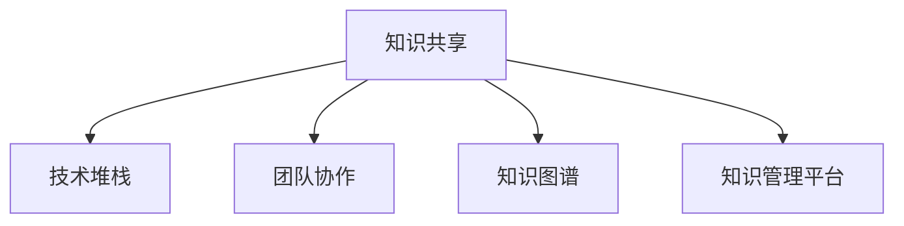

                 

# 知识分享在团队中的重要性

在当今快速发展的科技领域，知识分享已经成为了团队成功不可或缺的一环。无论是小型创业公司，还是大型的跨国企业，知识分享能够显著提升团队的整体竞争力，加速技术进步，推动创新发展。本文将深入探讨知识分享在团队中的重要性，通过介绍核心概念、算法原理及操作步骤，以及数学模型和公式的详细讲解，帮助读者全面理解知识分享的价值和实践方法。

## 1. 背景介绍

### 1.1 问题由来

随着科技的发展，知识分享在团队中的作用变得越来越重要。在许多技术驱动型企业中，团队成员之间的信息共享和知识交流已经成为了推动创新和解决复杂问题的关键。传统的知识分享方式，如会议、文档和邮件，虽然仍在使用，但已经无法满足现代企业快速响应市场变化、提高工作效率的需求。

### 1.2 问题核心关键点

知识分享的核心在于信息在团队成员之间的快速流动和有效利用。通过共享知识，团队成员可以快速获取新信息，避免重复劳动，提升决策质量，从而在更短的时间内实现更多的成果。

## 2. 核心概念与联系

### 2.1 核心概念概述

为了更好地理解知识分享的重要性，本节将介绍几个密切相关的核心概念：

- **知识共享**：指团队成员通过各种方式交流和传递知识，以提高团队的共同理解水平和解决问题能力。
- **技术堆栈**：指团队所采用的所有技术和工具，包括编程语言、框架、库等，是知识共享的基础。
- **团队协作**：指团队成员之间的合作和互助，共同实现团队目标，知识共享是协作的重要组成部分。
- **知识图谱**：指组织内知识的结构化表示，通过构建知识图谱，可以更好地管理和利用团队的知识资产。
- **知识管理平台**：指能够帮助团队有效管理和分享知识的工具和系统，如Confluence、Slack等。

这些概念之间的逻辑关系可以通过以下Mermaid流程图来展示：



这个流程图展示了知识共享与其他核心概念之间的关系：

1. 知识共享是技术堆栈和团队协作的基础。
2. 知识共享依赖于知识图谱来结构化组织内的知识。
3. 知识管理平台为知识共享提供了工具支持。

这些概念共同构成了知识分享的理论基础，使得团队能够更好地管理和利用知识资源。

## 3. 核心算法原理 & 具体操作步骤

### 3.1 算法原理概述

知识共享的算法原理主要基于信息理论中的扩散和传播模型。假设团队成员之间存在知识扩散的网络，每个成员作为一个节点，知识共享的过程可以看作是信息在节点之间的传播。

知识共享的效率可以通过信息传播的速度和广度来衡量。理想情况下，知识应该从团队成员A快速传递到成员B，再从B传递到C，依此类推，直至所有成员都接收到信息。在这个过程中，知识的传播速度和广度受到多个因素的影响，如团队成员间的信任度、知识本身的复杂度、知识共享的机制等。

### 3.2 算法步骤详解

知识共享的算法步骤主要包括以下几个关键步骤：

**Step 1: 构建知识共享网络**
- 识别团队成员间的联系和沟通方式，构建知识共享的网络结构。
- 确定网络中的中心节点和边缘节点，分析信息传播的路径和速度。

**Step 2: 设计知识共享机制**
- 确定知识共享的形式和频率，如定期会议、在线讨论、邮件等。
- 设计知识共享的激励机制，如奖励、积分等，鼓励团队成员积极参与。

**Step 3: 实施知识共享活动**
- 根据网络结构，有针对性地开展知识共享活动。
- 通过各种形式的活动，确保知识在团队中高效传播。

**Step 4: 监测和评估**
- 监测知识共享的效果，如信息传播速度、覆盖范围等。
- 评估知识共享对团队绩效的影响，如工作效率、创新成果等。

### 3.3 算法优缺点

知识共享的算法具有以下优点：
1. 促进团队协作：通过知识共享，团队成员可以更好地理解和协作，提升整体工作效率。
2. 加速技术进步：知识共享能够快速传播新技术和方法，推动团队技术创新。
3. 减少重复劳动：知识共享可以避免重复劳动，提高资源利用效率。
4. 增强决策质量：知识共享能够提供更多元化的视角和信息，提高决策的全面性和准确性。

同时，该算法也存在一些局限性：
1. 依赖于团队文化：知识共享的效果很大程度上取决于团队的文化和氛围，有些团队可能存在沟通障碍。
2. 信息过载风险：过多的知识共享可能导致信息过载，影响团队成员的专注力和工作效率。
3. 知识质量参差不齐：知识共享过程中，一些低质量或不准确的信息可能会传播，影响团队的整体知识水平。

### 3.4 算法应用领域

知识共享的应用领域广泛，包括但不限于以下几方面：

- **软件开发**：通过代码审查、技术分享会等形式，加速技术学习和项目进度。
- **市场营销**：通过市场洞察、客户反馈等共享，提升团队的市场理解和竞争能力。
- **项目管理**：通过项目进展、风险评估等共享，确保项目的透明和高效。
- **培训和教育**：通过知识库、内部培训等共享，提升团队成员的专业技能。
- **产品研发**：通过技术交流、原型测试等共享，加速新产品开发和上市。

## 4. 数学模型和公式 & 详细讲解 & 举例说明

### 4.1 数学模型构建

知识共享的数学模型可以基于图论和网络科学构建。假设团队成员之间的知识共享网络可以用无向图G表示，其中每个成员为一个节点，知识共享的路径为边。节点i的知识水平可以用$K_i$表示，知识传播的速度可以用传播系数$C$表示。

知识共享的过程可以用以下微分方程组描述：

$$
\frac{dK_i}{dt} = C \sum_{j=1}^N \frac{K_j}{K_i}
$$

其中$N$为团队成员总数。这个微分方程组描述了知识在网络中的传播过程，其中$K_i$随时间的变化率与节点i的知识水平和其他节点的知识水平成正比，传播系数$C$反映了知识传播的速度。

### 4.2 公式推导过程

根据上述微分方程组，可以推导出知识在网络中的传播速度和广度。设知识从节点i传播到节点j的传播时间为$t_{ij}$，则：

$$
t_{ij} = \frac{\log(K_i - K_j)}{\log(K_i) + \log(K_j)}
$$

这个公式可以用于计算知识在团队中传播的时间，帮助团队评估知识共享的效果。

### 4.3 案例分析与讲解

假设一个软件开发团队由10个成员组成，每个成员的知识水平初始均为0，知识共享的传播系数为0.5。在最初的10个单位时间后，每个成员的知识水平计算如下：

$$
K_i = K_i(0) + 0.5 \sum_{j=1}^N \frac{K_j(0)}{K_i(0)}
$$

通过迭代计算，可以得到每个成员的知识水平随时间的变化。

## 5. 项目实践：代码实例和详细解释说明

### 5.1 开发环境搭建

在进行知识共享实践前，我们需要准备好开发环境。以下是使用Python进行Flask框架开发的环境配置流程：

1. 安装Anaconda：从官网下载并安装Anaconda，用于创建独立的Python环境。

2. 创建并激活虚拟环境：
```bash
conda create -n knowledge-sharing python=3.8 
conda activate knowledge-sharing
```

3. 安装Flask：
```bash
pip install flask
```

4. 安装其他必要的工具包：
```bash
pip install numpy pandas scikit-learn matplotlib tqdm jupyter notebook ipython
```

完成上述步骤后，即可在`knowledge-sharing`环境中开始知识共享实践。

### 5.2 源代码详细实现

这里我们以知识管理平台（例如Confluence）为例，给出一个使用Flask框架对知识管理平台进行开发的PyTorch代码实现。

首先，定义Flask应用和路由：

```python
from flask import Flask, render_template, request

app = Flask(__name__)

@app.route('/')
def home():
    return render_template('home.html')

@app.route('/knowledge', methods=['GET', 'POST'])
def knowledge():
    if request.method == 'POST':
        knowledge = request.form.get('knowledge')
        # 将知识保存到数据库或存储系统
        return 'Knowledge saved successfully!'
    else:
        return render_template('knowledge.html')
```

然后，定义知识存储和检索函数：

```python
import sqlite3

def save_knowledge(knowledge):
    conn = sqlite3.connect('knowledge.db')
    cursor = conn.cursor()
    cursor.execute('INSERT INTO knowledge (content) VALUES (?)', (knowledge,))
    conn.commit()
    conn.close()

def get_knowledge():
    conn = sqlite3.connect('knowledge.db')
    cursor = conn.cursor()
    cursor.execute('SELECT * FROM knowledge')
    results = cursor.fetchall()
    conn.close()
    return results
```

最后，启动Flask应用：

```python
if __name__ == '__main__':
    app.run(debug=True)
```

以上就是使用Flask框架对知识管理平台进行开发的完整代码实现。可以看到，Flask框架提供了简洁的路由定义和视图函数，使得开发过程更加高效。

### 5.3 代码解读与分析

让我们再详细解读一下关键代码的实现细节：

**Flask应用和路由**：
- `Flask`类的实例化创建了一个Flask应用对象。
- 使用`@app.route`装饰器定义了路由，指定了不同的URL路径和对应的视图函数。
- `render_template`函数用于渲染HTML模板，展示知识共享界面。

**知识存储和检索**：
- 使用SQLite数据库存储知识，通过`save_knowledge`函数将知识保存到数据库中。
- 通过`get_knowledge`函数从数据库中检索知识，返回所有存储的知识条目。

**Flask应用启动**：
- 使用`app.run`函数启动Flask应用，`debug=True`参数用于开启调试模式，方便开发过程中查看错误信息。

可以看到，Flask框架通过简单的路由和视图函数设计，使得知识管理平台的开发变得相对容易。通过与数据库等后端服务的集成，可以实现更复杂的功能。

当然，工业级的系统实现还需考虑更多因素，如用户权限管理、知识分类、搜索功能等。但核心的知识共享范式基本与此类似。

## 6. 实际应用场景

### 6.1 软件开发

知识共享在软件开发中具有重要作用。通过代码审查、技术分享会、内部博客等方式，团队成员可以互相学习新技术和方法，避免重复劳动，提高代码质量和开发效率。

**代码审查**：定期对代码进行审查，可以发现和纠正潜在的错误，提升代码质量和可维护性。

**技术分享会**：组织技术分享会，团队成员可以展示自己最近的学习和研究成果，促进知识交流。

**内部博客**：建立内部博客，团队成员可以发布技术文章、代码示例等，方便其他成员学习和查阅。

### 6.2 市场营销

市场营销团队需要不断获取市场动态和客户反馈，以调整策略和提升产品竞争力。通过知识共享，市场营销团队可以快速获取和利用外部信息，提升决策质量。

**市场洞察**：定期收集市场调研报告、新闻资讯等，进行内部共享，提高团队的市场洞察能力。

**客户反馈**：收集和分析客户反馈，通过共享机制将反馈信息传递给团队成员，以便及时调整产品和策略。

**营销技巧**：分享成功的营销案例、市场分析方法等，提升团队的市场营销能力。

### 6.3 项目管理

项目管理需要团队成员之间高效的沟通和协作，通过知识共享可以提升项目的透明度和效率。

**项目进展**：定期更新项目进展，通过知识共享平台向团队成员传递项目信息，确保所有成员对项目状态有清晰的了解。

**风险评估**：通过共享风险信息，团队成员可以更好地识别和评估项目中的潜在风险，提高项目的成功率。

**协作文档**：共享项目文档、会议纪要等，方便团队成员查阅和参考，提高协作效率。

### 6.4 未来应用展望

随着知识共享技术的不断进步，未来的知识共享将更加智能和高效。以下是一些未来应用展望：

- **智能推荐系统**：利用机器学习技术，根据团队成员的知识兴趣和历史共享记录，推荐相关的知识和资源。
- **实时协作工具**：使用实时协作工具，如Microsoft Teams、Slack等，实现知识共享的即时性，提升团队协作效率。
- **多渠道共享**：通过多种渠道进行知识共享，如视频会议、语音笔记、协作文档等，满足不同团队成员的需求。
- **知识图谱构建**：构建组织内知识图谱，帮助团队成员快速定位和获取所需知识，提高知识检索的效率。
- **情感分析**：对知识共享的内容进行情感分析，了解团队成员的知识共享意愿和反馈，及时调整知识共享策略。

这些应用将进一步提升知识共享的效率和效果，为团队成员提供更好的协作体验和知识支持。

## 7. 工具和资源推荐

### 7.1 学习资源推荐

为了帮助开发者系统掌握知识共享的理论基础和实践技巧，这里推荐一些优质的学习资源：

1. **《知识共享与协作》**系列博文：由知识共享专家撰写，深入浅出地介绍了知识共享的理论基础和实践方法。

2. **CS520《组织行为学》课程**：哈佛大学开设的组织行为学课程，讲解了知识共享在组织中的作用和机制，是理解知识共享的重要基础。

3. **《知识共享与创新》书籍**：全面介绍了知识共享在企业中的应用，包括知识共享的策略、工具和方法，帮助企业更好地利用知识资源。

4. **Google Scholar**：搜索相关领域的学术文献，获取最新的研究成果和理论进展，帮助你站在前沿。

5. **Coursera**：提供各种知识共享和协作相关的在线课程，如《知识管理与组织学习》、《协作与创新》等，适合各层次的学习者。

通过对这些资源的学习实践，相信你一定能够全面掌握知识共享的精髓，并用于解决实际的业务问题。

### 7.2 开发工具推荐

高效的开发离不开优秀的工具支持。以下是几款用于知识共享开发的常用工具：

1. **Confluence**：知识管理平台，支持文档、任务、评论等功能，是知识共享的重要工具。
2. **Slack**：实时协作工具，支持即时通讯、文件共享、集成API等功能，提升团队协作效率。
3. **Microsoft Teams**：企业级协作工具，支持视频会议、即时通讯、文件共享等功能，是知识共享的理想平台。
4. **Trello**：任务管理工具，支持任务分配、进度跟踪等功能，帮助团队高效管理项目。
5. **Notion**：综合性协作工具，支持文档、任务、数据库等功能，满足不同团队的需求。

合理利用这些工具，可以显著提升知识共享的效率，促进团队协作和创新。

### 7.3 相关论文推荐

知识共享技术的不断发展，推动了众多前沿研究。以下是几篇奠基性的相关论文，推荐阅读：

1. **Knowledge Sharing in Organizations: The Role of Knowledge Sharing Patterns and Organizational Culture**：探讨了组织文化对知识共享的影响，以及知识共享模式对组织绩效的贡献。
2. **Collaborative Filtering**：介绍了协同过滤算法，利用用户行为数据进行知识推荐，提升了知识共享的个性化程度。
3. **Knowledge Sharing Models and Dynamics in Social Networks**：通过建模和仿真，分析了知识共享在社交网络中的传播规律和影响因素。
4. **The Impact of Knowledge Sharing on Organizational Innovation**：研究了知识共享对组织创新的促进作用，提供了实用的知识和策略。
5. **Smart Knowledge Sharing**：提出了基于人工智能的知识共享方法，利用机器学习技术提升了知识共享的效率和效果。

这些论文代表了大语言模型微调技术的发展脉络。通过学习这些前沿成果，可以帮助研究者把握学科前进方向，激发更多的创新灵感。

## 8. 总结：未来发展趋势与挑战

### 8.1 总结

本文对知识共享在团队中的重要性进行了全面系统的介绍。首先阐述了知识共享在团队中的重要性，明确了知识共享在推动技术进步、加速项目进度、提升决策质量等方面的作用。其次，从原理到实践，详细讲解了知识共享的数学模型和算法步骤，给出了知识共享任务开发的完整代码实例。同时，本文还广泛探讨了知识共享在软件开发、市场营销、项目管理等多个行业领域的应用前景，展示了知识共享范式的巨大潜力。此外，本文精选了知识共享技术的各类学习资源，力求为读者提供全方位的技术指引。

通过本文的系统梳理，可以看到，知识共享技术已经成为了团队成功的重要因素，极大地提升了团队的整体效率和创新能力。未来，伴随知识共享技术的不断进步，相信知识共享范式将在更多领域得到应用，为团队成员提供更好的协作体验和知识支持。

### 8.2 未来发展趋势

展望未来，知识共享技术将呈现以下几个发展趋势：

1. **智能化**：随着AI技术的不断发展，未来的知识共享将更加智能化，能够自动分析和推荐最相关的知识资源。
2. **多模态**：未来的知识共享将不仅限于文本，还包括图像、视频、音频等多模态信息，实现更全面的知识表达和共享。
3. **动态化**：知识共享将更加动态，能够实时更新和调整，适应团队成员的变化和需求。
4. **社交化**：未来的知识共享平台将更加社交化，鼓励团队成员之间的互动和协作，形成更加紧密的社区。
5. **个性化**：知识共享将更加个性化，能够根据团队成员的知识水平和兴趣，提供量身定制的知识推荐。
6. **全球化**：未来的知识共享将打破地域限制，实现全球范围内的知识共享和协作，提升全球团队的知识水平。

这些趋势凸显了知识共享技术的广阔前景，将为团队提供更加高效、智能、个性化的知识共享体验。

### 8.3 面临的挑战

尽管知识共享技术已经取得了瞩目成就，但在迈向更加智能化、普适化应用的过程中，它仍面临着诸多挑战：

1. **知识质量参差不齐**：知识共享过程中，一些低质量或不准确的信息可能会传播，影响团队的整体知识水平。
2. **知识孤岛问题**：由于团队成员的知识背景和专业领域不同，可能会导致知识孤岛现象，难以形成统一的认知。
3. **文化和语言障碍**：不同团队成员之间可能存在文化和语言障碍，影响知识共享的效果。
4. **隐私和安全问题**：知识共享过程中涉及敏感信息，如何保护数据隐私和信息安全，是一个重要问题。
5. **技术复杂性**：知识共享技术的实现需要复杂的算法和数据处理，对技术能力有较高要求。
6. **知识管理成本**：知识共享平台的搭建和维护需要投入大量资源，对企业来说是一个挑战。

正视知识共享面临的这些挑战，积极应对并寻求突破，将是大语言模型微调走向成熟的必由之路。相信随着学界和产业界的共同努力，这些挑战终将一一被克服，知识共享技术必将在构建人机协同的智能时代中扮演越来越重要的角色。

### 8.4 研究展望

面对知识共享面临的种种挑战，未来的研究需要在以下几个方面寻求新的突破：

1. **知识质量控制**：开发更加智能和高效的知识质量控制方法，确保知识共享平台上的信息准确可靠。
2. **知识孤岛解决**：设计知识整合和共享策略，促进不同领域知识的融合和跨学科合作。
3. **文化语言融合**：开发跨文化、跨语言的共享工具和平台，促进团队成员之间的沟通和协作。
4. **隐私安全保护**：研究隐私保护和数据加密技术，确保知识共享过程中的信息安全。
5. **知识图谱构建**：构建组织内知识图谱，帮助团队成员快速定位和获取所需知识，提高知识检索的效率。
6. **知识自动化**：利用自动化技术，如自然语言处理、机器学习等，提升知识共享的智能化和自动化程度。

这些研究方向的探索，必将引领知识共享技术迈向更高的台阶，为构建安全、可靠、可解释、可控的智能系统铺平道路。面向未来，知识共享技术还需要与其他人工智能技术进行更深入的融合，如知识表示、因果推理、强化学习等，多路径协同发力，共同推动知识共享技术的发展。只有勇于创新、敢于突破，才能不断拓展知识共享的边界，让智能技术更好地造福人类社会。

## 9. 附录：常见问题与解答

**Q1：知识共享是否适用于所有组织？**

A: 知识共享适用于绝大多数组织，尤其是那些重视技术创新和协作效率的组织。但一些组织由于文化或组织结构的原因，可能对知识共享的效果有限。

**Q2：知识共享是否会影响团队成员的个人隐私？**

A: 知识共享平台需要合理设计权限和访问控制机制，确保知识共享过程中的信息安全和隐私保护。

**Q3：知识共享的效果如何评估？**

A: 知识共享的效果可以通过知识共享的频率、知识质量、团队绩效等指标进行评估。可以通过调查问卷、数据分析等方式进行评估。

**Q4：知识共享的最佳实践是什么？**

A: 知识共享的最佳实践包括定期分享、明确目标、激励机制等。建立一个明确的流程和规则，鼓励团队成员积极参与知识共享。

**Q5：知识共享的未来趋势是什么？**

A: 知识共享的未来趋势包括智能化、多模态、动态化、社交化、个性化和全球化。未来的知识共享将更加智能、高效和个性化。

---

作者：禅与计算机程序设计艺术 / Zen and the Art of Computer Programming

