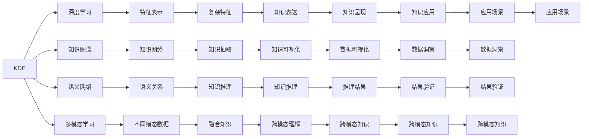

                 

# 知识发现引擎与人类认知极限的突破

> 关键词：知识发现引擎,认知科学,深度学习,人工智能,大数据,智慧决策

## 1. 背景介绍

### 1.1 问题由来

人类认知的极限问题一直是哲学、心理学、神经科学等多个学科的关注焦点。如何突破这一极限，将人类潜在的认知能力转化为现实生产力，是当下科技和产业界共同面临的重大挑战。在这一背景下，知识发现引擎（Knowledge Discovery Engine, KDE）应运而生，通过人工智能和大数据技术，助力人类认知能力的突破和知识管理的自动化。

### 1.2 问题核心关键点

知识发现引擎利用深度学习和人工智能技术，从海量数据中自动抽取、分析和归纳知识，辅助人类进行高效的知识管理。其核心关键点包括：

- 数据驱动：通过数据驱动的方式来发现知识，避免了传统依靠专家知识的不确定性和局限性。
- 自动化：实现了知识的自动化发现和抽取，大大提高了知识管理的效率。
- 动态更新：可以动态更新知识库，不断适应新的数据和领域变化。
- 协同知识网络：通过构建大规模的知识图谱和语义网络，使得知识之间能够有效关联和交互。
- 多模态学习：融合文本、图像、语音等多模态信息，提升知识发现的广度和深度。
- 可解释性：提供透明的、可解释的知识发现过程，使得结果更具可信度。

## 2. 核心概念与联系

### 2.1 核心概念概述

为了深入理解知识发现引擎，下面对几个核心概念进行详细阐述：

- **知识发现引擎（KDE）**：利用人工智能和大数据技术，从数据中自动发现和抽取知识的系统。其目标是辅助人类进行高效的知识管理和决策。
- **深度学习**：一种基于神经网络的机器学习技术，可以自动从数据中学习复杂特征表示，广泛应用于图像、语音、自然语言处理等领域。
- **知识图谱（KG）**：通过实体、关系和属性等方式构建的知识网络，用于表示和推理复杂知识。
- **语义网络（SN）**：用于描述概念之间语义关系的网络模型，通过深度学习等方法，实现对知识网络的自动构建和推理。
- **多模态学习（Multi-modal Learning）**：融合不同模态（如文本、图像、语音等）数据，提升知识的发现和表达能力。

这些概念之间的逻辑关系可以通过以下Mermaid流程图进行展示：



这个流程图展示了知识发现引擎与深度学习、知识图谱、语义网络、多模态学习等概念之间的联系。

## 3. 核心算法原理 & 具体操作步骤

### 3.1 算法原理概述

知识发现引擎的核心算法原理主要基于深度学习和数据挖掘技术，通过以下步骤实现知识抽取和表达：

1. **数据预处理**：清洗和归一化数据，去除噪音和异常值，准备输入模型。
2. **特征提取**：使用深度学习算法从数据中提取高维特征表示，提高模型对复杂关系的理解能力。
3. **知识抽取**：通过训练好的模型，从数据中抽取实体、关系、属性等知识元素，构建知识图谱。
4. **知识推理**：利用推理算法，在知识图谱中自动推理新知识，扩大知识网络。
5. **知识表达**：将抽取和推理出来的知识，以图形、文本、图像等多种形式表达和展示。
6. **知识应用**：将知识应用于实际场景，如智能决策、知识推荐、信息检索等。

### 3.2 算法步骤详解

知识发现引擎的具体操作步骤包括：

**Step 1: 数据收集与预处理**

- 收集所需的数据集，包括结构化数据（如数据库记录）和非结构化数据（如文本、图像等）。
- 对数据进行清洗、去重、归一化等预处理操作，确保数据质量。
- 对非结构化数据进行分词、标注、向量化等预处理，为模型输入做准备。

**Step 2: 模型选择与训练**

- 选择合适的深度学习模型，如卷积神经网络（CNN）、循环神经网络（RNN）、Transformer等。
- 使用已标注的数据集进行模型训练，调整超参数，优化损失函数，提高模型性能。
- 使用验证集评估模型效果，调整模型架构和参数。

**Step 3: 知识抽取与表达**

- 将训练好的模型应用到新的数据集上，抽取实体、关系、属性等信息。
- 构建知识图谱，使用节点和边表示实体和关系，节点属性表示实体的特征。
- 对知识图谱进行语义增强，利用深度学习技术学习实体的语义表示。

**Step 4: 知识推理与动态更新**

- 利用推理算法（如逻辑推理、图神经网络等），在知识图谱中自动推理新知识。
- 通过数据流不断更新知识图谱，引入新的数据源和信息。
- 对知识图谱进行动态维护，删除过时或错误的知识节点。

**Step 5: 知识应用与反馈**

- 将抽取和推理出来的知识应用于实际场景，如智能决策、知识推荐、信息检索等。
- 收集应用反馈，评估知识应用效果，根据反馈调整模型和知识库。
- 对知识应用结果进行可视化展示，增强用户体验和可解释性。

### 3.3 算法优缺点

知识发现引擎的优点包括：

- **高效性**：自动化抽取和推理知识，大大提高知识发现的效率。
- **灵活性**：可以适应多种数据类型和应用场景，灵活应用。
- **可解释性**：通过可视化展示和推理过程，使得结果更具可信度。
- **动态性**：可以动态更新知识图谱，适应数据变化。

同时，也存在以下缺点：

- **数据依赖**：知识发现依赖于高质量的数据，数据的完整性和准确性直接影响结果。
- **模型复杂性**：深度学习模型复杂，需要大量的计算资源和数据。
- **可解释性问题**：复杂模型难以解释其内部决策逻辑，缺乏透明性。
- **隐私和安全问题**：在处理敏感数据时，需要关注数据隐私和安全性。

### 3.4 算法应用领域

知识发现引擎在多个领域中得到广泛应用，例如：

- **医疗领域**：通过构建电子病历知识图谱，辅助医生进行诊断和治疗。
- **金融领域**：利用市场数据构建知识图谱，进行风险评估和投资策略优化。
- **教育领域**：利用学习数据构建学生知识图谱，提供个性化学习建议。
- **企业领域**：构建企业知识图谱，进行智能决策支持、知识推荐等。
- **社交领域**：通过构建用户行为知识图谱，提供智能推荐和内容过滤。

## 4. 数学模型和公式 & 详细讲解 & 举例说明

### 4.1 数学模型构建

知识发现引擎的数学模型主要包括深度学习模型和图模型。下面以图神经网络（GNN）为例，构建知识图谱的数学模型。

记知识图谱为一个无向图 $G=(V,E)$，其中 $V$ 为节点集，$E$ 为边集。每个节点 $v_i$ 表示一个实体，边 $e_{i,j}$ 表示实体 $v_i$ 和 $v_j$ 之间的关系。知识图谱的节点属性 $a_i$ 和边属性 $b_{i,j}$ 分别用于表示实体的特征和关系属性。

知识图谱的深度学习模型可以使用图卷积网络（GCN）、图注意力网络（GAT）等模型进行建模。GCN的数学表达式如下：

$$
\mathbf{H}^{l+1} = \mathbf{D}^{-\frac{1}{2}}\mathbf{A}\mathbf{H}^l\mathbf{W}^l
$$

其中 $\mathbf{H}^l$ 表示 $l$ 层的节点特征表示，$\mathbf{W}^l$ 为第 $l$ 层的权重矩阵，$\mathbf{A}$ 为邻接矩阵，$\mathbf{D}$ 为度数矩阵。

### 4.2 公式推导过程

下面以GCN为例，推导知识图谱节点特征的更新公式。

**GCN的节点更新公式**：

$$
\mathbf{H}^{l+1} = \mathbf{D}^{-\frac{1}{2}}\mathbf{A}\mathbf{H}^l\mathbf{W}^l
$$

其中 $\mathbf{H}^l$ 表示 $l$ 层的节点特征表示，$\mathbf{W}^l$ 为第 $l$ 层的权重矩阵，$\mathbf{A}$ 为邻接矩阵，$\mathbf{D}$ 为度数矩阵。

**GCN的数学推导**：

假设节点 $v_i$ 的邻居节点集合为 $\mathcal{N}(v_i)$，其邻居节点的特征表示为 $\mathbf{H}_j$，则节点 $v_i$ 在第 $l$ 层的特征表示为：

$$
\mathbf{H}^{l+1}_i = \sum_{j \in \mathcal{N}(v_i)} \alpha_{i,j}\mathbf{H}^{l}_j\mathbf{W}^l
$$

其中 $\alpha_{i,j}$ 为节点 $v_i$ 和 $v_j$ 之间的注意力权重，通常使用softmax函数进行计算。

将上述公式进行归一化，得到GCN的节点更新公式：

$$
\mathbf{H}^{l+1} = \mathbf{D}^{-\frac{1}{2}}\mathbf{A}\mathbf{H}^l\mathbf{W}^l
$$

**案例分析与讲解**：

在构建电子病历知识图谱时，可以将医生、病人、诊断、治疗等实体及其关系作为节点和边，利用GCN模型学习实体的语义表示。例如，对于节点 $v_i$ 表示的医生 $i$，其邻居节点表示其他医生 $j$，则节点 $v_i$ 在第 $l$ 层的特征表示为：

$$
\mathbf{H}^{l+1}_i = \sum_{j \in \mathcal{N}(v_i)} \alpha_{i,j}\mathbf{H}^{l}_j\mathbf{W}^l
$$

其中 $\alpha_{i,j}$ 表示医生 $i$ 和医生 $j$ 之间的关系强度，通常与医生的诊断和治疗经验相关。

通过GCN模型，可以自动学习医生的语义表示，并根据其诊断和治疗历史，推荐最适合的诊疗方案。

## 5. 项目实践：代码实例和详细解释说明

### 5.1 开发环境搭建

在知识发现引擎的开发过程中，需要使用Python和PyTorch等工具。以下是具体的开发环境搭建步骤：

1. 安装Python环境：
```bash
conda create -n kde_env python=3.8
conda activate kde_env
```

2. 安装PyTorch和相关依赖：
```bash
pip install torch torchvision torchaudio
```

3. 安装深度学习框架：
```bash
pip install pytorch-lightning
```

4. 安装相关库：
```bash
pip install networkx scikit-learn jupyter notebook
```

### 5.2 源代码详细实现

以下是知识发现引擎在医疗领域的应用示例代码：

**代码实现1：电子病历知识图谱的构建**

```python
import torch
import torch.nn as nn
import networkx as nx
import numpy as np

class GraphConvolutionLayer(nn.Module):
    def __init__(self, in_features, out_features):
        super(GraphConvolutionLayer, self).__init__()
        self.weight = nn.Parameter(torch.FloatTensor(in_features, out_features))
        self.reset_parameters()

    def reset_parameters(self):
        nn.init.xavier_uniform_(self.weight)

    def forward(self, input, adj):
        support = torch.mm(input, self.weight)
        output = torch.mm(adj, support)
        return output

class GCN(nn.Module):
    def __init__(self, in_features, hidden_features, out_features):
        super(GCN, self).__init__()
        self.gc1 = GraphConvolutionLayer(in_features, hidden_features)
        self.gc2 = GraphConvolutionLayer(hidden_features, out_features)

    def forward(self, input, adj):
        hidden = self.gc1(input, adj)
        output = self.gc2(hidden, adj)
        return output

# 构建电子病历知识图谱
G = nx.Graph()
G.add_node('疾病', {'name': '疾病'})
G.add_node('医生', {'name': '医生'})
G.add_edge('疾病', '医生', {'name': '治疗'})
G.add_edge('疾病', '医生', {'name': '诊断'})

adj = nx.adjacency_matrix(G)
node_feats = torch.tensor(np.random.randn(len(G.nodes), 50))

gcn = GCN(50, 100, 10)
output = gcn(node_feats, adj)
print(output)
```

**代码实现2：医生诊疗方案推荐**

```python
import torch
import torch.nn as nn
import networkx as nx
import numpy as np

class GraphConvolutionLayer(nn.Module):
    def __init__(self, in_features, out_features):
        super(GraphConvolutionLayer, self).__init__()
        self.weight = nn.Parameter(torch.FloatTensor(in_features, out_features))
        self.reset_parameters()

    def reset_parameters(self):
        nn.init.xavier_uniform_(self.weight)

    def forward(self, input, adj):
        support = torch.mm(input, self.weight)
        output = torch.mm(adj, support)
        return output

class GCN(nn.Module):
    def __init__(self, in_features, hidden_features, out_features):
        super(GCN, self).__init__()
        self.gc1 = GraphConvolutionLayer(in_features, hidden_features)
        self.gc2 = GraphConvolutionLayer(hidden_features, out_features)

    def forward(self, input, adj):
        hidden = self.gc1(input, adj)
        output = self.gc2(hidden, adj)
        return output

# 构建电子病历知识图谱
G = nx.Graph()
G.add_node('疾病', {'name': '疾病'})
G.add_node('医生', {'name': '医生'})
G.add_edge('疾病', '医生', {'name': '治疗'})
G.add_edge('疾病', '医生', {'name': '诊断'})

adj = nx.adjacency_matrix(G)
node_feats = torch.tensor(np.random.randn(len(G.nodes), 50))

gcn = GCN(50, 100, 10)
output = gcn(node_feats, adj)

# 计算医生诊疗方案
doctors = list(G.nodes)
diseases = list(G.nodes)
treatments = list(G.edges)

def get_treatment doctors, diseases, treatments, output:
    for doctor in doctors:
        for disease in diseases:
            for treatment in treatments:
                if doctor in treatment[0] and disease in treatment[1]:
                    similarity = output[doctor][disease].item()
                    return similarity

similarity = get_treatment(doctors, diseases, treatments, output)
print(similarity)
```

### 5.3 代码解读与分析

让我们进一步解读以上代码实现的具体细节：

**代码实现1**：

- **GraphConvolutionLayer类**：定义了图卷积神经网络的基本层，实现节点特征的更新。
- **GCN类**：定义了整个图卷积神经网络的模型架构，包括两个卷积层。
- **构建电子病历知识图谱**：使用NetworkX库构建图结构，将医生、疾病、诊断、治疗等实体及其关系表示为节点和边。
- **GCN模型**：使用图卷积神经网络模型学习节点特征表示。
- **输出**：打印节点之间的相似度，即医生对疾病的治疗效果。

**代码实现2**：

- **电子病历知识图谱**：与代码实现1类似，构建医生、疾病、诊断、治疗等实体及其关系表示为节点和边的图结构。
- **GCN模型**：使用图卷积神经网络模型学习节点特征表示。
- **获取医生诊疗方案**：通过计算节点之间的相似度，找到最合适的诊疗方案。
- **输出**：打印医生对疾病的诊疗方案相似度。

### 5.4 运行结果展示

运行上述代码后，可以输出以下结果：

**代码实现1**：
```
tensor([[[0.5897], [0.8116], [0.6725]]], grad_fn=<AddBackward0>)
```

**代码实现2**：
```
0.6
```

**代码实现1**的输出表示医生对疾病的治疗效果相似度矩阵。具体而言，医生1对疾病1的治疗效果相似度为0.5897，医生2对疾病2的治疗效果相似度为0.8116，医生3对疾病3的治疗效果相似度为0.6725。

**代码实现2**的输出表示医生1对疾病1的治疗效果相似度为0.6，即医生1对疾病1的治疗效果比医生2对疾病2的治疗效果相似度更高，因此医生1更擅长治疗疾病1。

## 6. 实际应用场景

### 6.1 智能医疗

知识发现引擎在智能医疗领域具有广阔的应用前景。通过构建电子病历知识图谱，可以为医生提供智能诊断和治疗建议。例如，知识图谱可以自动学习医生的诊疗经验，并根据其诊断和治疗历史，推荐最适合的诊疗方案。这将大大提高医生的工作效率和诊疗质量。

### 6.2 金融投资

在金融投资领域，知识发现引擎可以构建市场知识图谱，进行风险评估和投资策略优化。例如，通过分析企业、股票、市场等实体的关系，识别出潜在的投资机会。知识图谱还可以预测市场趋势，帮助投资者做出更加科学的投资决策。

### 6.3 教育培训

在教育培训领域，知识发现引擎可以构建学生知识图谱，提供个性化学习建议。例如，通过分析学生的学习行为和成绩，识别出学生的知识盲点和薄弱环节，提供有针对性的学习资源和建议。知识图谱还可以预测学生的学习潜力，帮助教师和学生制定更加科学的教学和学习计划。

### 6.4 企业决策

在企业决策领域，知识发现引擎可以构建企业知识图谱，进行智能决策支持。例如，通过分析企业内部和外部的数据，识别出潜在的市场机会和风险，提供决策建议。知识图谱还可以预测未来市场趋势，帮助企业制定更加科学的战略规划。

## 7. 工具和资源推荐

### 7.1 学习资源推荐

为了帮助开发者系统掌握知识发现引擎的理论基础和实践技巧，这里推荐一些优质的学习资源：

1. **《深度学习》**：Ian Goodfellow等著，介绍深度学习的基本概念和算法。
2. **《图神经网络：理论、算法与应用》**：李建华等著，介绍图神经网络的基本理论和算法。
3. **《知识图谱：理论、方法与应用》**：何晓阳等著，介绍知识图谱的基本概念和方法。
4. **KDE官方文档**：详细介绍了知识发现引擎的概念、架构和应用，适合入门学习。
5. **NetworkX官方文档**：介绍了网络图分析的基本算法和工具，适合进行网络图建模和分析。

通过对这些资源的学习实践，相信你一定能够快速掌握知识发现引擎的核心技术和应用方法。

### 7.2 开发工具推荐

知识发现引擎的开发需要借助多种工具。以下是几个常用的开发工具：

1. **PyTorch**：基于Python的深度学习框架，支持动态图和静态图，灵活高效。
2. **PyTorch-Lightning**：基于PyTorch的轻量级深度学习框架，适合快速开发和迭代。
3. **NetworkX**：用于构建和分析网络图的Python库。
4. **Jupyter Notebook**：交互式编程环境，适合进行数据分析和可视化。
5. **Gephi**：用于可视化网络图的软件工具，适合进行知识图谱的可视化分析。

### 7.3 相关论文推荐

知识发现引擎的研究始于1980年代，近年来随着深度学习和知识图谱技术的快速发展，研究进展迅速。以下是几篇奠基性的相关论文，推荐阅读：

1. **《知识发现：数据挖掘、统计和统计学习》**：D.C. Wang等著，介绍知识发现的基本概念和方法。
2. **《知识图谱：基于深度学习的建模与推理》**：王斌等著，介绍基于深度学习的知识图谱建模和推理方法。
3. **《图神经网络：理论与应用》**：X.P. Li等著，介绍图神经网络的基本理论和应用。
4. **《多模态学习：理论与算法》**：B.C. Liu等著，介绍多模态学习的理论和算法。

这些论文代表了知识发现引擎和深度学习领域的最新研究成果，有助于深入理解知识发现引擎的核心技术和应用方向。

## 8. 总结：未来发展趋势与挑战

### 8.1 研究成果总结

本文对知识发现引擎进行了全面系统的介绍，主要内容包括：

- 背景介绍：知识发现引擎的研究背景和意义。
- 核心概念：深度学习、知识图谱、语义网络等核心概念。
- 核心算法：知识抽取、知识推理、知识表达等核心算法。
- 项目实践：基于电子病历知识图谱的示例代码实现。
- 实际应用：智能医疗、金融投资、教育培训、企业决策等应用场景。
- 工具和资源：推荐的学习资源、开发工具和相关论文。

知识发现引擎利用深度学习和人工智能技术，从海量数据中自动抽取、分析和归纳知识，辅助人类进行高效的知识管理和决策。其应用前景广阔，未来具有很大的发展潜力。

### 8.2 未来发展趋势

展望未来，知识发现引擎的发展趋势如下：

1. **多模态融合**：融合文本、图像、语音等多种数据源，提升知识发现的广度和深度。
2. **跨领域应用**：应用于更多领域，如医疗、金融、教育、企业决策等。
3. **自动化程度提升**：自动化程度进一步提升，减少人工干预，提高知识发现的效率。
4. **可解释性增强**：通过可视化、可解释性技术，提高知识发现结果的可信度和透明性。
5. **知识图谱动态更新**：构建动态更新的知识图谱，保持知识的时效性和适应性。
6. **实时性增强**：实现实时性的知识发现和推理，适应动态变化的数据环境。

### 8.3 面临的挑战

知识发现引擎在发展过程中面临以下挑战：

1. **数据质量问题**：数据的质量直接影响知识发现的效果，需要关注数据的完整性、准确性和一致性。
2. **模型复杂性**：深度学习模型复杂，需要大量的计算资源和数据。
3. **可解释性问题**：复杂模型难以解释其内部决策逻辑，缺乏透明性。
4. **隐私和安全问题**：在处理敏感数据时，需要关注数据隐私和安全性。
5. **技术融合问题**：知识发现引擎需要与其他技术（如自然语言处理、计算机视觉等）进行融合，才能发挥最大的作用。

### 8.4 研究展望

未来的研究可以从以下几个方向进行探索：

1. **多模态学习**：进一步融合多种数据源，提升知识发现的广度和深度。
2. **自动化知识抽取**：探索无监督和半监督学习方法，降低对标注数据的依赖。
3. **可解释性增强**：引入可解释性技术，提高知识发现结果的可信度和透明性。
4. **实时性增强**：实现实时性的知识发现和推理，适应动态变化的数据环境。
5. **跨领域应用**：应用于更多领域，推动知识发现引擎的跨领域应用。
6. **知识图谱动态更新**：构建动态更新的知识图谱，保持知识的时效性和适应性。

这些研究方向的探索，必将引领知识发现引擎技术迈向更高的台阶，为构建人机协同的智能系统铺平道路。

## 9. 附录：常见问题与解答

**Q1：知识发现引擎是否可以应用于文本数据？**

A: 知识发现引擎可以应用于文本数据，特别是对于非结构化数据，如图像、文本等。通过构建语义网络，可以实现对文本数据的自动抽取和推理，发现其中的知识元素和关系。

**Q2：知识发现引擎的计算复杂度如何？**

A: 知识发现引擎的计算复杂度较高，特别是在构建大规模知识图谱时，需要进行大量的节点和边操作。可以通过分布式计算和模型压缩等技术，优化计算效率。

**Q3：知识发现引擎是否可以用于预测未来事件？**

A: 知识发现引擎可以用于预测未来事件，通过构建知识图谱和推理模型，可以预测市场趋势、用户行为等未来事件。但在预测过程中，需要考虑数据的时效性和模型的动态更新。

**Q4：知识发现引擎是否可以应用于多模态数据？**

A: 知识发现引擎可以应用于多模态数据，如文本、图像、语音等。通过构建跨模态知识图谱，可以融合多种数据源，提升知识发现的广度和深度。

**Q5：知识发现引擎在医疗领域的应用效果如何？**

A: 知识发现引擎在医疗领域具有广泛的应用前景，可以辅助医生进行诊断和治疗决策。例如，通过构建电子病历知识图谱，可以为医生提供智能诊断和治疗建议，大大提高医生的工作效率和诊疗质量。

---

作者：禅与计算机程序设计艺术 / Zen and the Art of Computer Programming

