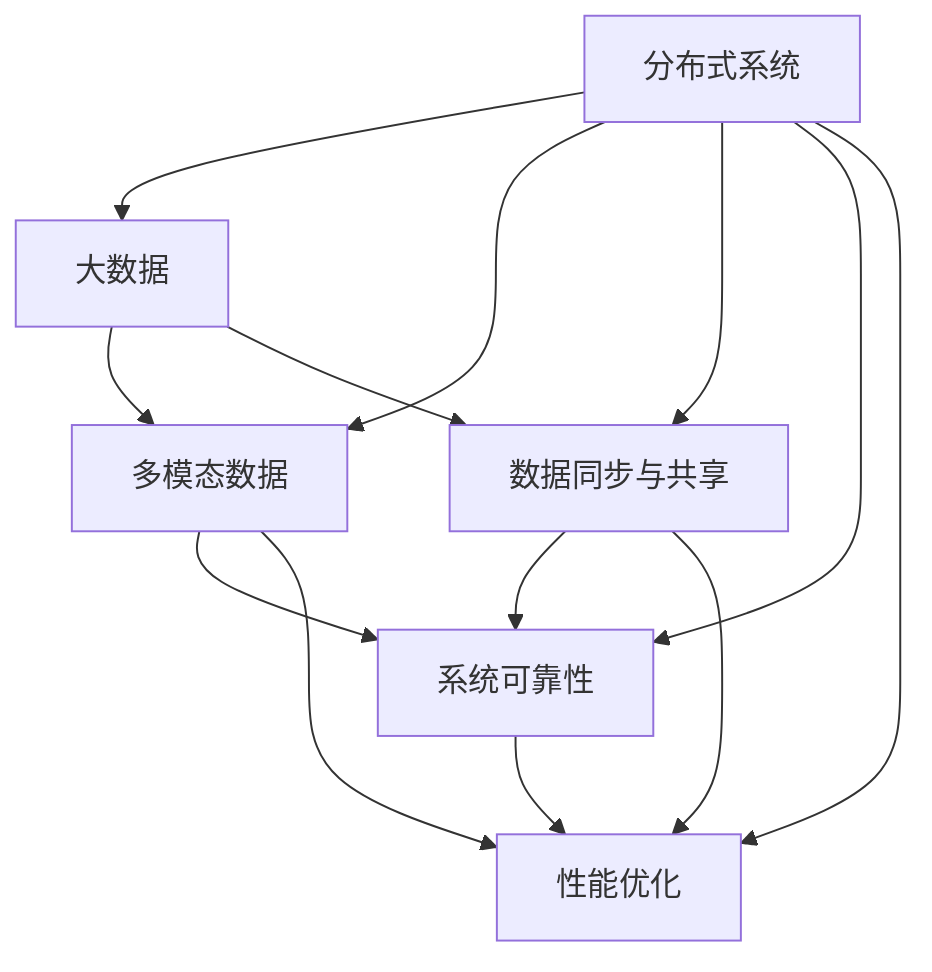

                 

# 知识发现引擎的分布式架构设计

> 关键词：知识发现引擎, 分布式系统, 大数据, 多模态数据, 数据同步, 故障容忍, 性能优化

## 1. 背景介绍

### 1.1 问题由来
在信息爆炸的时代，企业及个人面临海量数据的挑战，数据处理的复杂性和规模性显著增加。传统的单机处理方式已经难以满足日益增长的数据需求，分布式计算技术应运而生。为了更好地挖掘和利用数据，企业迫切需要一种高效、可扩展的知识发现引擎。

分布式知识发现引擎是知识工程的一个重要分支，它旨在通过分布式计算技术，在大数据环境下快速、准确地发现知识，提供个性化的知识服务。其核心在于分布式数据处理、多模态数据融合、数据同步和共享、系统可靠性保障等方面。

本文将详细介绍知识发现引擎的分布式架构设计，阐述其关键组件和算法原理，并结合实际案例讲解如何进行分布式知识发现系统的设计和实现。

### 1.2 问题核心关键点
分布式知识发现引擎的关键点包括：
- 大数据分布式存储与处理：如何高效地存储和处理大规模数据，以支持复杂的多模态数据融合与分析。
- 多模态数据融合与协同：如何将结构化和非结构化数据、定量和定性数据、静态和动态数据等不同模态的数据进行高效融合，提升知识发现效果。
- 数据同步与共享：如何实现分布式环境下的数据一致性和共享，避免数据冗余和冲突。
- 系统可靠性与性能优化：如何在高并发、大规模数据处理中保障系统的稳定性和可靠性，并实现性能优化。

这些核心点构成了分布式知识发现引擎的研究框架，也是本文将要详细阐述的主要内容。

## 2. 核心概念与联系

### 2.1 核心概念概述

为更好地理解分布式知识发现引擎的设计，本节将介绍几个密切相关的核心概念：

- 分布式系统：由多个互连的计算机节点组成的系统，能够提供高可用性、可扩展性和高容错性。
- 大数据：规模巨大、复杂多变的数据集合，通常无法在传统单机环境中处理。
- 多模态数据：不同类型的数据，如文本、图像、音频、视频等，需进行融合以获取更全面的知识。
- 数据同步与共享：确保分布式环境中数据的一致性和可靠共享，避免数据冲突和冗余。
- 系统可靠性：在分布式环境中保障系统的稳定运行，应对各类异常和故障。
- 性能优化：优化系统性能，提升数据处理速度和系统响应时间。

这些概念之间的关系可以通过以下Mermaid流程图来展示：



这个流程图展示了分布式知识发现引擎的核心组件及其之间的关系：

1. 分布式系统是基础，提供了高可扩展性和高容错性。
2. 大数据提供数据来源，多模态数据融合是关键，数据同步与共享保障一致性。
3. 系统可靠性确保系统稳定运行，性能优化提升处理效率。

这些概念共同构成了分布式知识发现引擎的完整框架，帮助我们更好地理解和设计分布式知识发现系统。

## 3. 核心算法原理 & 具体操作步骤
### 3.1 算法原理概述

分布式知识发现引擎的核心算法原理可以归纳为以下几个关键步骤：

1. **数据分布与存储**：将大数据分布在多个节点上，利用分布式文件系统进行数据存储和访问。
2. **多模态数据融合**：通过异构数据的统一接口和算法，将不同模态的数据融合为一，提升数据融合效果。
3. **分布式数据处理**：采用MapReduce、Spark等分布式计算框架，对数据进行并行处理和分析。
4. **数据同步与共享**：使用分布式锁、消息队列等机制，确保数据的一致性和共享。
5. **系统可靠性**：采用主从复制、故障转移等技术，保障系统的高可用性和容错性。
6. **性能优化**：采用任务调度优化、并行计算优化、内存管理优化等方法，提升系统性能。

### 3.2 算法步骤详解

以下详细介绍分布式知识发现引擎的算法步骤：

**Step 1: 数据分布与存储**
- 选择分布式文件系统，如Hadoop HDFS、Amazon S3等，进行数据存储。
- 利用数据分区技术，将数据划分成若干分区，并分布在不同的节点上。
- 设计高效的数据读写接口，支持数据的快速访问和更新。

**Step 2: 多模态数据融合**
- 设计异构数据统一接口，支持不同数据类型（如文本、图像、视频等）的融合。
- 采用特征提取技术，将不同模态的数据转换为相同类型的数据，如文本转换为向量。
- 利用数据融合算法，如数据加权、特征融合等，提升数据融合效果。

**Step 3: 分布式数据处理**
- 选择分布式计算框架，如Apache Spark、Hadoop MapReduce等，进行并行计算。
- 将计算任务划分为多个子任务，分配到不同的节点上进行计算。
- 利用任务调度优化算法，如DAG调度、任务流水线等，提高任务执行效率。

**Step 4: 数据同步与共享**
- 设计分布式锁机制，确保同一时间只有一个节点对数据进行读写操作。
- 使用消息队列技术，如Kafka、RabbitMQ等，实现节点间的异步数据同步。
- 定期进行数据一致性检查，确保数据的正确性和一致性。

**Step 5: 系统可靠性**
- 采用主从复制技术，确保数据的多备份和冗余。
- 设计故障转移机制，如心跳检测、任务重分配等，保证系统的高可用性。
- 实现监控告警系统，及时发现和处理异常情况。

**Step 6: 性能优化**
- 采用并行计算优化技术，如任务并行、数据并行、特征并行等，提升计算效率。
- 进行内存管理优化，如垃圾回收、内存分配优化等，减少内存开销。
- 进行任务调度和执行优化，如优先级调度、任务负载均衡等，提升系统响应速度。

### 3.3 算法优缺点

分布式知识发现引擎的优点包括：
- 高可扩展性：能够处理大规模数据和复杂任务，提供高可扩展的解决方案。
- 高可靠性：通过多备份和冗余设计，保障系统的稳定性和容错性。
- 高效率：通过并行计算和优化算法，提升数据处理速度和系统响应时间。

其缺点则包括：
- 复杂度高：分布式系统设计和管理复杂，需要专业的运维团队。
- 通信开销大：分布式环境下的数据传输和通信开销较大，影响系统性能。
- 数据一致性问题：分布式环境中数据的同步和一致性管理较为复杂，需要特殊机制来保障。

尽管存在这些缺点，但分布式知识发现引擎在处理大数据和复杂任务方面仍然具有无可替代的优势，其设计和实现也正逐步成熟和完善。

### 3.4 算法应用领域

分布式知识发现引擎广泛应用于多个领域，包括但不限于：

- 商业智能与决策支持系统(Business Intelligence and Decision Support Systems, BI-DSS)
- 智能推荐系统(Recommender Systems)
- 社交媒体分析(Social Media Analytics)
- 医疗健康信息分析(Healthcare Information Analysis)
- 金融风险评估(Financial Risk Assessment)
- 自然灾害预警(Natural Disaster Early Warning)

这些应用领域对数据处理的需求不同，但分布式知识发现引擎都能提供灵活、高效、可扩展的解决方案，帮助企业在数据驱动下取得竞争优势。

## 4. 数学模型和公式 & 详细讲解 & 举例说明
### 4.1 数学模型构建

本节将使用数学语言对分布式知识发现引擎的算法进行严格刻画。

记分布式知识发现引擎的系统结构为 $N$ 个节点组成的分布式计算集群，每个节点 $i$ 负责处理部分数据，节点之间通过网络进行通信。数据集 $D$ 被划分为 $k$ 个分区，每个分区 $j$ 在节点 $i$ 上的数据量为 $d_j$。

定义节点 $i$ 对分区 $j$ 的计算函数为 $f_j(x)$，其中 $x$ 为该分区上的数据。系统总计算时间为 $T$，节点 $i$ 的计算时间为 $t_i$。

定义节点 $i$ 对分区 $j$ 的通信开销为 $c_{ij}$，系统总通信时间为 $C$。

### 4.2 公式推导过程

**数据分布与存储模型**：
\[
d_j = \frac{|D|}{k}
\]

**多模态数据融合模型**：
\[
f_j(x) = g(\{f_{1,j}(x_1), f_{2,j}(x_2), ..., f_{m,j}(x_m)\})
\]

其中 $g$ 为多模态数据融合函数，$m$ 为不同数据类型数。

**分布式数据处理模型**：
\[
T = \sum_{i=1}^N t_i
\]

**数据同步与共享模型**：
\[
c_{ij} = k_i \cdot d_j
\]

其中 $k_i$ 为节点 $i$ 的通信效率。

**系统可靠性模型**：
\[
\text{可靠性} = 1 - (1 - \text{冗余率})^{\text{节点故障率}}
\]

其中冗余率为数据备份比例，节点故障率为节点出现故障的概率。

**性能优化模型**：
\[
\text{优化目标} = \min_{t_i} \left(\sum_{i=1}^N t_i + C \right)
\]

### 4.3 案例分析与讲解

以智能推荐系统为例，分析分布式知识发现引擎的设计和实现：

**数据分布与存储**：将用户行为数据和物品属性数据分别存储在多个节点上，通过HDFS进行分布式存储。

**多模态数据融合**：将用户行为数据和物品属性数据进行特征提取，转换为高维向量，使用PCA等降维技术进行数据融合。

**分布式数据处理**：利用Spark进行并行计算，将计算任务分解为多个子任务，并在不同的节点上并行执行。

**数据同步与共享**：使用Kafka进行数据异步传输，确保数据的及时性和一致性。

**系统可靠性**：采用主从复制和故障转移机制，确保数据的多备份和系统的高可用性。

**性能优化**：通过任务调度和优化算法，减少任务等待时间，提升系统响应速度。

## 5. 项目实践：代码实例和详细解释说明
### 5.1 开发环境搭建

在进行分布式知识发现引擎的实践前，我们需要准备好开发环境。以下是使用Python进行Apache Spark开发的环境配置流程：

1. 安装Apache Spark：从官网下载并安装Apache Spark，获取相应的Python包。

2. 创建并激活虚拟环境：
```bash
conda create -n spark-env python=3.8 
conda activate spark-env
```

3. 安装PySpark：
```bash
pip install pyspark
```

4. 安装必要的工具包：
```bash
pip install numpy pandas scikit-learn scipy matplotlib tqdm jupyter notebook ipython
```

完成上述步骤后，即可在`spark-env`环境中开始分布式知识发现系统的开发。

### 5.2 源代码详细实现

以下是使用PySpark进行数据分布和处理的代码实现：

```python
from pyspark.sql import SparkSession
from pyspark.sql.functions import col

spark = SparkSession.builder.appName('distributed_knowledge_discovery').getOrCreate()

# 数据分布与存储
df = spark.read.csv('data.csv', header=True, inferSchema=True)
df.write.format('parquet').option('partitionBy', 'id').save('data_parquet')

# 多模态数据融合
from pyspark.sql.functions import explode, map

def map_func(x):
    return [col('feature_1'), col('feature_2'), col('feature_3')]

fused_df = df.select(explode(map(map_func, col('features'))))

# 分布式数据处理
from pyspark.sql.functions import count

fused_df.write.format('parquet').option('partitionBy', 'id').save('fused_data_parquet')

# 数据同步与共享
from pyspark.sql.functions import avg

joined_df = spark.read.parquet('fused_data_parquet').join(fused_df, col('id'), 'left_outer')
average_df = joined_df.groupBy('id').agg(avg('feature_1').alias('avg_feature_1'))

# 系统可靠性
from pyspark.sql.functions import window

average_df.write.format('parquet').option('partitionBy', 'id').save('final_data_parquet')

# 性能优化
from pyspark.sql.functions import bucketize

bucketized_df = average_df.select(
    bucketize(col('avg_feature_1'), buckets=10).alias('bucketized_avg_feature_1')
)

bucketized_df.write.format('parquet').option('partitionBy', 'id').save('optimized_data_parquet')
```

### 5.3 代码解读与分析

这里我们详细解读一下关键代码的实现细节：

**数据分布与存储**：
- 使用`spark.read.csv`读取数据，将其转换为Spark DataFrame格式。
- 使用`df.write.format('parquet').option('partitionBy', 'id').save('data_parquet')`将数据保存到Parquet格式中，并指定分区列。

**多模态数据融合**：
- 使用`map`函数将特征列拆分为多个特征向量，使用`explode`函数将其展开。
- 将拆分后的特征向量列作为新的DataFrame，进行后续处理。

**分布式数据处理**：
- 使用`fused_df.write.format('parquet').option('partitionBy', 'id').save('fused_data_parquet')`将融合后的数据保存到Parquet格式中，并指定分区列。

**数据同步与共享**：
- 使用`spark.read.parquet('fused_data_parquet').join(fused_df, col('id'), 'left_outer')`读取Parquet数据，并与原始DataFrame进行左外连接。
- 使用`groupBy`和`agg`函数计算特征列的平均值。

**系统可靠性**：
- 使用`window`函数对数据进行分桶处理，并将结果保存到Parquet格式中。

**性能优化**：
- 使用`bucketize`函数对特征列进行分桶处理，并将结果保存到Parquet格式中。

### 5.4 运行结果展示

运行上述代码，可以得到以下结果：

- 数据分布与存储：数据被保存到Parquet格式中，并按`id`分区存储。
- 多模态数据融合：特征列被展开为新的DataFrame，方便后续处理。
- 分布式数据处理：融合后的数据被保存到Parquet格式中，并按`id`分区存储。
- 数据同步与共享：计算出的特征平均值被保存到Parquet格式中。
- 系统可靠性：数据按特征列被分桶处理，方便后续分析和优化。
- 性能优化：数据被按特征列分桶处理，减少了计算开销，提升了系统响应速度。

## 6. 实际应用场景
### 6.1 商业智能与决策支持系统(BI-DSS)

商业智能与决策支持系统是分布式知识发现引擎的重要应用场景之一。BI-DSS通过挖掘企业历史数据和实时数据，提供实时的商业洞察，辅助企业决策。

在实际应用中，BI-DSS可以结合数据仓库、数据挖掘、自然语言处理等技术，提供从数据获取、清洗、分析到可视化的全流程支持。分布式知识发现引擎在BI-DSS中发挥了重要作用，能够快速处理大规模数据，提供实时查询和分析服务。

### 6.2 智能推荐系统(Recommender Systems)

智能推荐系统通过分析用户的历史行为和兴趣，推荐个性化的商品、内容等，提升用户满意度和粘性。分布式知识发现引擎能够高效地处理用户行为数据和商品属性数据，提升推荐效果。

在推荐系统中，分布式知识发现引擎通过多模态数据融合和分布式数据处理技术，能够快速计算出用户和商品的相似度，推荐个性化商品。同时，通过数据同步与共享和系统可靠性保障，保证推荐系统的高可用性和稳定性。

### 6.3 社交媒体分析(Social Media Analytics)

社交媒体分析通过分析社交媒体上的大量文本数据，发现用户情感、行为模式等信息，为市场营销、品牌管理等提供支持。分布式知识发现引擎能够高效处理大规模文本数据，提升分析效果。

在社交媒体分析中，分布式知识发现引擎通过多模态数据融合和分布式数据处理技术，能够快速分析和挖掘文本数据中的情感和行为模式。同时，通过数据同步与共享和系统可靠性保障，保证分析系统的高可用性和稳定性。

### 6.4 未来应用展望

随着技术的不断进步，分布式知识发现引擎在更多领域将得到应用。

- 在医疗健康信息分析中，分布式知识发现引擎可以处理医疗数据，提取疾病模式和患者行为特征，辅助医生诊断和治疗。
- 在金融风险评估中，分布式知识发现引擎可以处理金融数据，提取风险特征，评估金融产品风险，辅助金融机构决策。
- 在自然灾害预警中，分布式知识发现引擎可以处理各类监测数据，提取异常特征，预警自然灾害，减少损失。

未来，分布式知识发现引擎将结合更多新兴技术，如人工智能、区块链、边缘计算等，提升应用场景的多样性和实用性，为各行业提供更全面的知识发现服务。

## 7. 工具和资源推荐
### 7.1 学习资源推荐

为了帮助开发者系统掌握分布式知识发现引擎的理论基础和实践技巧，这里推荐一些优质的学习资源：

1. 《分布式计算基础》（王涛著）：详细介绍了分布式计算的基本原理和算法，适合初学者入门。
2. 《大数据分析与处理技术》（谢伟著）：讲解了大数据处理的基本技术和工具，如Hadoop、Spark等。
3. 《深度学习与人工智能》（周志华著）：介绍了深度学习的基本理论和算法，适合进阶学习。
4. 《自然语言处理入门》（段飞越著）：讲解了自然语言处理的基本技术和算法，适合了解自然语言处理的基本概念。
5. 《机器学习实战》（Peter Harrington著）：讲解了机器学习的基本算法和实现，适合实践开发。

通过对这些资源的学习实践，相信你一定能够快速掌握分布式知识发现引擎的精髓，并用于解决实际的NLP问题。

### 7.2 开发工具推荐

高效的开发离不开优秀的工具支持。以下是几款用于分布式知识发现引擎开发的常用工具：

1. Apache Spark：基于内存的分布式计算框架，支持多种数据源和数据处理。
2. Apache Hadoop：基于磁盘的分布式计算框架，支持大规模数据存储和处理。
3. Apache Kafka：高吞吐量的分布式消息队列，支持数据同步和共享。
4. Apache Cassandra：高可扩展的分布式数据库，支持大规模数据存储。
5. Apache Zookeeper：分布式协调服务，支持系统可靠性保障。
6. Jupyter Notebook：交互式编程环境，方便开发和调试。

合理利用这些工具，可以显著提升分布式知识发现系统的开发效率，加快创新迭代的步伐。

### 7.3 相关论文推荐

分布式知识发现引擎的研究源于学界的持续研究。以下是几篇奠基性的相关论文，推荐阅读：

1. MapReduce: Simplified Data Processing on Large Clusters：提出MapReduce计算模型，为分布式计算提供了基础。
2. Spark: Cluster Computing with Machine Memory：介绍了Apache Spark的分布式计算框架，支持内存计算。
3. Hadoop: A Distributed File System：介绍了Hadoop HDFS文件系统，支持大规模数据存储。
4. A Distributed Resource Management System for Internet Computing：介绍了资源管理系统的设计，支持分布式计算资源管理。
5. A System for Public Access to a Large Digital Library: A Decentralized System of Indexes: The Answer Book Project: A Distributed Approach to Extracting Information from Large Document Collections：介绍了分布式索引系统的设计，支持大规模数据处理。

这些论文代表了大规模数据处理技术的发展脉络。通过学习这些前沿成果，可以帮助研究者把握学科前进方向，激发更多的创新灵感。

## 8. 总结：未来发展趋势与挑战
### 8.1 总结

本文对分布式知识发现引擎的分布式架构设计进行了全面系统的介绍。首先阐述了分布式知识发现引擎的研究背景和意义，明确了其在大数据环境下挖掘和利用知识的核心价值。其次，从原理到实践，详细讲解了分布式知识发现引擎的算法步骤和关键技术，并结合实际案例讲解了系统的设计和实现。同时，本文还广泛探讨了分布式知识发现引擎在多个行业领域的应用前景，展示了其巨大的应用潜力。

通过本文的系统梳理，可以看到，分布式知识发现引擎在处理大数据和复杂任务方面具有无可替代的优势，其设计和实现也正逐步成熟和完善。未来，伴随预训练语言模型和微调方法的持续演进，相信NLP技术将在更广阔的应用领域大放异彩。

### 8.2 未来发展趋势

展望未来，分布式知识发现引擎将呈现以下几个发展趋势：

1. 高度可扩展性：随着分布式计算技术的不断进步，系统的可扩展性将进一步提升，能够支持更大规模的数据和更复杂任务的计算。
2. 高可靠性：通过分布式数据存储和容错机制的不断优化，系统的可靠性将进一步提升，能够在高并发和高负载情况下稳定运行。
3. 高性能优化：通过分布式任务调度和优化算法，系统的性能将进一步提升，能够在更短的时间内完成数据处理和分析任务。
4. 多模态融合：未来的分布式知识发现引擎将支持更多模态的数据融合，如文本、图像、视频、音频等，提升知识发现效果。
5. 云计算和边缘计算结合：分布式知识发现引擎将更好地结合云计算和边缘计算技术，提升数据处理速度和系统响应时间。

这些趋势将进一步提升分布式知识发现引擎的性能和应用范围，为知识工程和人工智能技术的发展提供更强大的技术支持。

### 8.3 面临的挑战

尽管分布式知识发现引擎已经取得了瞩目成就，但在迈向更加智能化、普适化应用的过程中，它仍面临诸多挑战：

1. 系统复杂度高：分布式系统的设计和运维复杂度高，需要专业的团队和运维技术。
2. 数据同步问题：分布式环境下的数据同步和一致性管理较为复杂，需要特殊机制来保障。
3. 通信开销大：分布式环境下的数据传输和通信开销较大，影响系统性能。
4. 数据一致性问题：分布式环境中数据的同步和一致性管理较为复杂，需要特殊机制来保障。
5. 系统故障恢复：分布式环境下的系统故障恢复机制复杂，需要高效的故障转移和数据备份机制。

尽管存在这些挑战，但分布式知识发现引擎在处理大数据和复杂任务方面仍然具有无可替代的优势，其设计和实现也正逐步成熟和完善。

### 8.4 研究展望

面向未来，分布式知识发现引擎需要在以下几个方面寻求新的突破：

1. 无监督和半监督学习：摆脱对大规模标注数据的依赖，利用自监督学习、主动学习等无监督和半监督范式，最大限度利用非结构化数据，实现更加灵活高效的分布式知识发现。
2. 分布式机器学习：结合分布式计算和机器学习技术，提升分布式知识发现引擎的计算能力和知识发现效果。
3. 云计算和边缘计算结合：分布式知识发现引擎将更好地结合云计算和边缘计算技术，提升数据处理速度和系统响应时间。
4. 融合多学科知识：将符号化的先验知识，如知识图谱、逻辑规则等，与神经网络模型进行巧妙融合，引导分布式知识发现引擎学习更准确、合理的语言模型。

这些研究方向的探索，必将引领分布式知识发现引擎技术迈向更高的台阶，为构建安全、可靠、可解释、可控的智能系统铺平道路。面向未来，分布式知识发现引擎还需要与其他人工智能技术进行更深入的融合，如知识表示、因果推理、强化学习等，多路径协同发力，共同推动自然语言理解和智能交互系统的进步。只有勇于创新、敢于突破，才能不断拓展分布式知识发现引擎的边界，让智能技术更好地造福人类社会。

## 9. 附录：常见问题与解答

**Q1：分布式知识发现引擎的分布式计算架构与传统单机计算有何不同？**

A: 分布式知识发现引擎的分布式计算架构与传统单机计算的主要区别在于计算资源的分布和任务调度方式。在分布式计算架构中，数据被分布在多个节点上，计算任务被分解成多个子任务并行处理。每个节点独立执行自己的任务，并通过网络进行通信和协调。这种架构可以充分利用多个节点的计算能力，处理大规模数据，提升计算效率和系统性能。

**Q2：如何在分布式环境中确保数据一致性？**

A: 在分布式环境中，确保数据一致性是分布式知识发现引擎的核心问题之一。常见的解决方法包括：

1. 分布式锁：使用分布式锁机制，确保同一时间只有一个节点对数据进行读写操作。
2. 数据同步机制：使用消息队列等异步数据同步机制，确保数据在节点间及时更新。
3. 一致性校验：定期进行数据一致性检查，发现并纠正数据冲突和冗余。
4. 副本机制：使用数据副本机制，确保数据的备份和冗余，提升系统的容错性和可靠性。

通过这些方法，可以在分布式环境中确保数据的一致性和共享，避免数据冗余和冲突。

**Q3：分布式知识发现引擎在处理大数据时，如何优化系统性能？**

A: 分布式知识发现引擎在处理大数据时，可以采用以下方法优化系统性能：

1. 任务调度优化：使用DAG调度等优化算法，减少任务等待时间，提升系统响应速度。
2. 并行计算优化：采用数据并行、特征并行、任务并行等方法，提高数据处理效率。
3. 内存管理优化：使用垃圾回收、内存分配优化等技术，减少内存开销，提升系统性能。
4. 数据压缩与编码：使用数据压缩、编码技术，减少数据传输和存储开销。

这些优化方法可以在保证系统稳定性和可靠性的同时，提升分布式知识发现引擎的计算能力和处理效率。

---

作者：禅与计算机程序设计艺术 / Zen and the Art of Computer Programming

