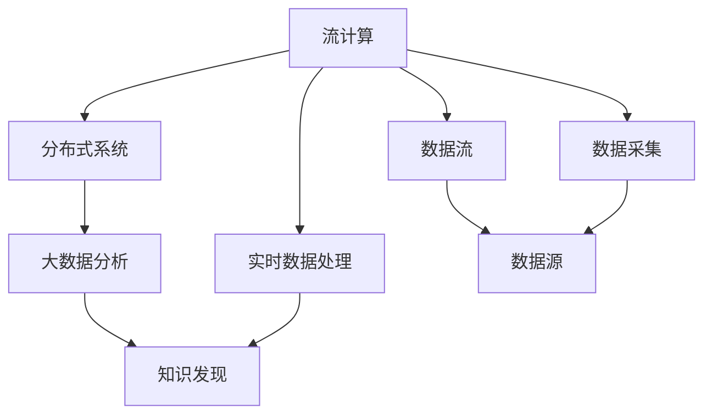

                 

# 知识发现引擎的实时数据处理技术

> 关键词：知识发现引擎, 实时数据处理, 流计算, 分布式系统, 大数据分析

## 1. 背景介绍

### 1.1 问题由来
随着互联网和物联网的迅猛发展，数据量呈指数级增长。如何从海量数据中快速提取有价值的信息，成为了当前信息科技领域的核心挑战。知识发现引擎(Knowledge Discovery Engine, KDE)正是在这种背景下孕育而生的一种强大的数据处理工具，能够从原始数据中挖掘出潜在的知识，为决策制定提供依据。

然而，传统的知识发现引擎在处理大数据和实时数据时，往往效率低下，响应缓慢。这些缺点在当今信息社会的高速发展下，已逐渐无法满足用户的需求。为了解决这一问题，实时数据处理技术应运而生，利用流计算和大数据技术，能够在数据生成后及时进行处理和分析，实现实时、高效的知识发现。

### 1.2 问题核心关键点
实时数据处理技术通过流计算和大数据技术，对海量数据进行实时分析，提取有价值的信息。其核心目标包括：
1. **高吞吐量**：处理速度达到每秒千百万条以上，能够应对海量数据的实时输入。
2. **低延迟**：处理时间在毫秒级，满足用户对实时响应的需求。
3. **高可用性**：系统设计为分布式、冗余架构，确保系统稳定运行。
4. **高性能**：采用并行处理、内存计算等技术，提升系统整体性能。

## 2. 核心概念与联系

### 2.1 核心概念概述

为更好地理解实时数据处理技术，本节将介绍几个密切相关的核心概念：

- **流计算(Stream Computing)**：一种数据处理范式，针对实时数据流进行计算和分析，以实时、动态的方式更新计算结果。
- **分布式系统(Distributed System)**：由多个计算机节点组成，通过网络协同工作，以实现高性能和可扩展性。
- **大数据分析(Big Data Analytics)**：对海量数据进行清洗、处理、分析，提取出有价值的信息和知识。
- **知识发现(Knowledge Discovery)**：从数据中挖掘出潜在的模式、规律和知识，辅助决策制定。
- **实时数据处理(Real-time Data Processing)**：针对实时数据流进行实时分析，快速提取有价值的信息。

这些核心概念之间的逻辑关系可以通过以下Mermaid流程图来展示：



这个流程图展示了的核心概念及其之间的关系：

1. 实时数据处理技术通过流计算框架处理实时数据流。
2. 分布式系统提供高性能计算能力，支持大规模数据处理。
3. 大数据分析在数据流上提取有价值的信息和知识。
4. 知识发现引擎将挖掘出的知识用于决策支持。

这些概念共同构成了实时数据处理技术的核心框架，使其能够高效、实时地处理和分析数据。

## 3. 核心算法原理 & 具体操作步骤

### 3.1 算法原理概述

实时数据处理技术的核心算法原理可以概括为：通过流计算框架，对实时数据流进行并行处理，利用大数据分析技术从数据流中提取有价值的信息，最终由知识发现引擎将信息转化为知识，辅助决策制定。

具体来说，实时数据处理过程包括以下几个步骤：
1. **数据采集**：通过传感器、网络监控等手段，实时获取数据流。
2. **数据预处理**：对数据流进行清洗、去重、转换等操作，准备后续分析。
3. **实时分析**：利用流计算框架对数据流进行实时分析，提取有价值的信息。
4. **知识发现**：通过大数据分析技术，从实时分析结果中挖掘出知识。
5. **结果反馈**：将知识发现结果应用于实际业务决策，形成闭环反馈机制。

### 3.2 算法步骤详解

以下是实时数据处理技术的详细步骤：

**Step 1: 数据采集**
- 设计数据采集模块，选择合适的数据源（如传感器、网络监控设备）。
- 利用API或SDK获取实时数据，转化为统一的格式（如JSON、CSV）。

**Step 2: 数据预处理**
- 清洗数据，去除无效、异常、重复数据。
- 数据转换，将数据转换为流计算框架所需的格式。
- 分块分割，将数据流划分为多个小块，每个小块单独处理。

**Step 3: 实时分析**
- 选择合适的流计算框架（如Apache Flink、Apache Kafka Streams等）。
- 编写流计算程序，定义数据流的处理逻辑。
- 利用并行处理技术，提升计算效率。

**Step 4: 知识发现**
- 选择合适的大数据分析工具（如Hadoop、Spark等）。
- 定义大数据分析流程，提取数据流中的关键信息。
- 应用机器学习、数据挖掘等技术，挖掘出潜在的知识和规律。

**Step 5: 结果反馈**
- 将知识发现结果应用于实际业务决策。
- 形成闭环反馈机制，实时调整数据采集和分析策略。

### 3.3 算法优缺点

实时数据处理技术具有以下优点：
1. **高效性**：能够实时处理数据流，及时发现问题。
2. **灵活性**：能够灵活应对不同类型的数据源和分析需求。
3. **实时性**：数据处理结果实时产生，满足用户对实时响应的需求。
4. **可扩展性**：通过分布式计算，能够处理大规模数据流。

同时，该技术也存在一定的局限性：
1. **数据质量要求高**：数据采集和预处理环节对数据质量要求较高，容易出现数据偏差。
2. **系统复杂度高**：实时数据处理涉及多个环节和工具，系统复杂度高。
3. **资源消耗大**：实时处理需要高性能的硬件设备和网络带宽。
4. **维护成本高**：系统维护和升级需要大量技术资源。

尽管存在这些局限性，但实时数据处理技术在应对大数据和实时数据处理方面，仍然具有不可替代的优势。未来相关研究的重点在于如何进一步降低系统复杂度，提升实时处理的稳定性和可靠性，以及降低系统资源消耗和维护成本。

### 3.4 算法应用领域

实时数据处理技术在多个领域都有广泛应用，以下是一些典型的应用场景：

- **金融风控**：实时监控交易数据，检测异常交易行为，及时预警风险。
- **网络安全**：实时分析网络流量，检测入侵行为，及时阻断攻击。
- **智能制造**：实时监控生产线数据，优化生产流程，提升生产效率。
- **智慧城市**：实时监控城市运行数据，优化交通、能源、环境等系统，提升城市管理效率。
- **医疗健康**：实时监控患者数据，提供个性化医疗服务，提升医疗质量。

此外，实时数据处理技术还广泛应用于工业控制、供应链管理、智慧农业等多个领域，为各行各业提供实时数据支持，推动智能化转型。

## 4. 数学模型和公式 & 详细讲解 & 举例说明（备注：数学公式请使用latex格式，latex嵌入文中独立段落使用 $$，段落内使用 $)
### 4.1 数学模型构建

实时数据处理技术的数学模型构建主要涉及流计算、大数据分析、机器学习等领域的知识。下面以机器学习中的回归模型为例，介绍实时数据处理技术的数学模型构建过程。

假设我们要从实时数据流中预测某项指标（如股票价格），可以定义一个回归模型：

$$
y = \beta_0 + \beta_1 x_1 + \beta_2 x_2 + \ldots + \beta_n x_n + \epsilon
$$

其中，$y$ 为预测指标，$x_1, x_2, \ldots, x_n$ 为输入特征，$\beta_0, \beta_1, \ldots, \beta_n$ 为模型参数，$\epsilon$ 为误差项。

通过实时数据流，我们可以不断更新输入特征 $x$，并利用流计算框架，实时更新模型参数 $\beta$，从而得到预测结果 $y_t$：

$$
y_t = \beta_t^T x_t + \epsilon_t
$$

其中，$\beta_t$ 为时间 $t$ 时的模型参数，$x_t$ 为时间 $t$ 的输入特征，$\epsilon_t$ 为时间 $t$ 的误差项。

### 4.2 公式推导过程

根据上述回归模型，我们可以通过最小二乘法来优化模型参数 $\beta$：

$$
\beta_t = \mathop{\arg\min}_{\beta} \sum_{i=1}^t (y_i - \beta^T x_i)^2
$$

对上述公式求导，得到：

$$
\frac{\partial}{\partial \beta} \sum_{i=1}^t (y_i - \beta^T x_i)^2 = 2 \sum_{i=1}^t (x_i - y_i) x_i
$$

解上述方程，得到：

$$
\beta_t = \left( \sum_{i=1}^t x_i x_i^T \right)^{-1} \sum_{i=1}^t x_i y_i
$$

将 $\beta_t$ 代入预测公式，得到：

$$
y_t = \left( \sum_{i=1}^t x_i x_i^T \right)^{-1} \sum_{i=1}^t x_i y_i + \epsilon_t
$$

在实时数据流中，我们可以通过连续更新 $x_t$ 和 $y_t$，不断优化模型参数 $\beta_t$，实现实时预测。

### 4.3 案例分析与讲解

假设我们要从实时流量数据中检测异常行为，可以利用实时数据处理技术进行实时分析。

首先，设计数据采集模块，通过网络监控设备获取实时流量数据。然后，进行数据预处理，清洗数据，去除无效、异常数据。接着，利用流计算框架（如Apache Flink）编写数据流处理程序，实时分析流量数据，提取关键特征。最后，通过大数据分析工具（如Hadoop），挖掘出潜在异常行为。

例如，假设我们检测到某IP地址的访问量异常增加，可以触发告警，并记录日志。通过不断优化数据采集和分析流程，实时监控网络行为，及时发现和处理异常。

## 5. 项目实践：代码实例和详细解释说明
### 5.1 开发环境搭建

在进行实时数据处理实践前，我们需要准备好开发环境。以下是使用Python进行Apache Flink开发的環境配置流程：

1. 安装Apache Flink：从官网下载并安装Apache Flink，根据操作系统选择合适的版本。
2. 安装Python SDK：安装Apache Flink的Python SDK，用于开发Flink应用程序。
3. 安装依赖库：安装必要的依赖库，如Pandas、NumPy等，用于数据处理和分析。

完成上述步骤后，即可在Flink环境中开始实时数据处理实践。

### 5.2 源代码详细实现

下面我们以实时流处理为例，给出使用Apache Flink进行流处理的数据流示例代码。

首先，定义Flink数据流处理函数：

```python
from pyflink.datastream import StreamExecutionEnvironment
from pyflink.table import StreamTableEnvironment, DataTypes

env = StreamExecutionEnvironment.get_execution_environment()
t_env = StreamTableEnvironment.create(env)

# 定义数据流
def process_data(data):
    return data.map(lambda x: (x['timestamp'], x['value']))

t_env.from_elements([(1, 10), (2, 20), (3, 30)], schema=DataTypes.ROW([DataTypes.FIELD('timestamp', DataTypes.BIGINT()), DataTypes.FIELD('value', DataTypes.INT())]).build()) \
    .map(process_data) \
    .output().print()

t_env.execute("Flink Streaming Job")
```

然后，定义数据流处理逻辑：

```python
def process_data(data):
    return data.map(lambda x: (x['timestamp'], x['value']))

t_env.from_elements([(1, 10), (2, 20), (3, 30)], schema=DataTypes.ROW([DataTypes.FIELD('timestamp', DataTypes.BIGINT()), DataTypes.FIELD('value', DataTypes.INT())]).build()) \
    .map(process_data) \
    .output().print()

t_env.execute("Flink Streaming Job")
```

最后，启动Flink作业并输出处理结果：

```python
t_env.execute("Flink Streaming Job")
```

以上就是使用Apache Flink进行流处理的基本代码实现。可以看到，Flink提供了简洁的API接口，使得数据流处理变得非常简单。

### 5.3 代码解读与分析

让我们再详细解读一下关键代码的实现细节：

**StreamExecutionEnvironment类**：
- `get_execution_environment()`方法：获取执行环境，用于创建数据流处理对象。
- `create()`方法：创建表环境，用于定义数据流表结构。

**StreamTableEnvironment类**：
- `from_elements()`方法：从元组列表中创建数据流表。
- `map()`方法：对数据流表进行映射处理。
- `output()`方法：将处理结果输出到控制台。
- `execute()`方法：执行数据流处理作业。

**process_data函数**：
- `map()`方法：对数据流表进行映射处理，返回新的数据流表。
- `lambda`函数：定义映射处理逻辑，返回新的元组列表。

**t_env.execute("Flink Streaming Job")**：
- `execute()`方法：执行数据流处理作业，并输出处理结果。
- `"Flink Streaming Job"`：指定作业名称。

通过上述代码，我们可以实时处理数据流，并进行简单的映射处理。在实际应用中，还需要根据具体需求，对数据流处理逻辑进行优化和扩展，以满足更复杂的数据处理需求。

## 6. 实际应用场景
### 6.1 智能制造

在智能制造领域，实时数据处理技术可以应用于生产线的实时监控和优化。通过实时采集生产数据，利用流计算和大数据分析技术，可以及时发现生产异常，优化生产流程，提升生产效率。

例如，假设我们要监控某条生产线的设备状态，可以设计实时数据流处理系统，从设备传感器获取实时数据，进行数据预处理和流计算，提取设备状态特征。然后，通过大数据分析，挖掘设备异常行为，及时发出告警，并采取相应措施。

### 6.2 智慧城市

在智慧城市领域，实时数据处理技术可以应用于交通、能源、环境等系统的实时监控和优化。通过实时采集城市运行数据，利用流计算和大数据分析技术，可以及时发现系统异常，优化城市管理，提升城市运行效率。

例如，假设我们要监控某座城市的交通状况，可以设计实时数据流处理系统，从交通监控设备获取实时数据，进行数据预处理和流计算，提取交通流量特征。然后，通过大数据分析，挖掘交通异常行为，及时发出告警，并调整交通信号灯，优化交通流量。

### 6.3 智能医疗

在智能医疗领域，实时数据处理技术可以应用于患者的实时监控和诊断。通过实时采集患者的生理数据，利用流计算和大数据分析技术，可以及时发现健康异常，辅助医生进行诊断和治疗。

例如，假设我们要实时监控某位患者的健康状况，可以设计实时数据流处理系统，从健康监测设备获取实时数据，进行数据预处理和流计算，提取健康特征。然后，通过大数据分析，挖掘健康异常行为，及时发出告警，并辅助医生进行诊断和治疗。

### 6.4 未来应用展望

随着实时数据处理技术的不断演进，未来将在更多领域得到应用，为各行各业带来变革性影响。

在智慧农业领域，实时数据处理技术可以应用于土壤、气象等数据的实时监控和分析，指导农业生产，提升农业效率。

在智能交通领域，实时数据处理技术可以应用于车流量、路况等数据的实时监控和分析，优化交通规划，提升交通效率。

在金融领域，实时数据处理技术可以应用于交易数据的实时监控和分析，检测异常交易，防范金融风险。

此外，在医疗健康、环境保护、智能制造等众多领域，实时数据处理技术也将不断涌现，为各行各业提供实时数据支持，推动智能化转型。

## 7. 工具和资源推荐
### 7.1 学习资源推荐

为了帮助开发者系统掌握实时数据处理技术，这里推荐一些优质的学习资源：

1. Apache Flink官方文档：Flink官方提供的详细文档，包括API接口、数据流处理示例、性能调优等。
2. PyFlink官方文档：PyFlink官方提供的详细文档，包括API接口、数据流处理示例、Python SDK使用指南等。
3. Apache Kafka官方文档：Kafka官方提供的详细文档，包括API接口、数据流处理示例、部署指南等。
4. 《大数据流处理技术与应用》书籍：详细介绍了流计算和大数据技术，适合入门学习。
5. 《Apache Spark实战》书籍：介绍了Spark在大数据处理中的应用，包括实时数据处理、大数据分析等。

通过对这些资源的学习实践，相信你一定能够快速掌握实时数据处理技术的精髓，并用于解决实际的NLP问题。

### 7.2 开发工具推荐

高效的开发离不开优秀的工具支持。以下是几款用于实时数据处理开发的常用工具：

1. Apache Flink：开源的流计算框架，支持分布式计算、容错机制、状态管理等。
2. Apache Kafka：开源的消息队列系统，支持高吞吐量、高可用性、高可扩展性。
3. Apache Spark：开源的大数据处理框架，支持分布式计算、内存计算、机器学习等。
4. PyFlink：Flink的Python SDK，提供简洁的API接口，支持Python开发。
5. Hadoop：开源的大数据处理平台，支持分布式计算、存储、分析等。

合理利用这些工具，可以显著提升实时数据处理任务的开发效率，加快创新迭代的步伐。

### 7.3 相关论文推荐

实时数据处理技术的发展源于学界的持续研究。以下是几篇奠基性的相关论文，推荐阅读：

1. "Streaming Algorithms"（期刊论文）：介绍了流计算的算法设计和实现。
2. "MapReduce: Simplified Data Processing on Large Clusters"（期刊论文）：介绍了MapReduce框架，支持分布式数据处理。
3. "A Survey on the Design and Implementation of Parallel and Distributed Algorithms for Real-time Data Stream Processing"（期刊论文）：总结了流计算和实时数据处理的研究现状和方向。
4. "Flink: A Framework for Distributed Stream Processing"（会议论文）：介绍了Apache Flink框架的设计和实现。
5. "Stream Processing with Apache Spark"（会议论文）：介绍了Spark在流计算中的应用。

这些论文代表了大数据和实时数据处理的发展脉络。通过学习这些前沿成果，可以帮助研究者把握学科前进方向，激发更多的创新灵感。

## 8. 总结：未来发展趋势与挑战

### 8.1 总结

本文对实时数据处理技术的核心概念、算法原理、操作步骤进行了全面系统的介绍。首先阐述了实时数据处理技术在应对大数据和实时数据处理方面的独特优势。其次，从原理到实践，详细讲解了实时数据处理技术的数学模型和关键步骤，给出了实时数据处理任务开发的完整代码实例。同时，本文还广泛探讨了实时数据处理技术在智能制造、智慧城市、智能医疗等多个行业领域的应用前景，展示了实时数据处理技术的巨大潜力。此外，本文精选了实时数据处理技术的各类学习资源，力求为读者提供全方位的技术指引。

通过本文的系统梳理，可以看到，实时数据处理技术正在成为大数据和实时数据处理的重要范式，极大地拓展了数据处理应用的边界，催生了更多的落地场景。得益于流计算和大数据技术的不断进步，实时数据处理技术必将在更广阔的应用领域大放异彩，深刻影响各行各业的数字化转型。

### 8.2 未来发展趋势

展望未来，实时数据处理技术将呈现以下几个发展趋势：

1. **技术融合**：实时数据处理技术将与人工智能、物联网、区块链等新兴技术深度融合，形成更加智能化的数据处理系统。
2. **边缘计算**：实时数据处理将越来越多地利用边缘计算技术，提升数据处理的实时性和效率。
3. **数据湖技术**：实时数据处理将越来越多地与数据湖技术结合，形成数据融合和数据服务的生态系统。
4. **自适应算法**：实时数据处理将应用更多自适应算法，根据数据特征动态调整处理策略。
5. **安全与隐私**：实时数据处理将更加注重数据安全和隐私保护，确保数据处理的合规性和安全性。

这些趋势凸显了实时数据处理技术的广阔前景。这些方向的探索发展，必将进一步提升实时数据处理系统的性能和应用范围，为各行各业提供更加智能、高效、安全的数据处理支持。

### 8.3 面临的挑战

尽管实时数据处理技术已经取得了瞩目成就，但在迈向更加智能化、普适化应用的过程中，它仍面临着诸多挑战：

1. **数据质量问题**：实时数据处理对数据质量要求较高，数据采集和预处理环节容易出现数据偏差和噪音。
2. **系统复杂性**：实时数据处理涉及多个环节和工具，系统设计复杂度高，容易出现出错和故障。
3. **资源消耗问题**：实时数据处理需要高性能的硬件设备和网络带宽，资源消耗大。
4. **隐私与安全**：实时数据处理涉及大量敏感数据，需要考虑数据隐私和安全问题。
5. **模型维护与更新**：实时数据处理模型需要定期更新和维护，以适应数据特征的变化。

这些挑战需要在未来的研究中不断突破，以进一步提升实时数据处理技术的可靠性和可扩展性，确保其在实际应用中的稳定性和高效性。

### 8.4 研究展望

面对实时数据处理技术所面临的挑战，未来的研究需要在以下几个方面寻求新的突破：

1. **数据质量保障**：开发更加健壮的数据采集和预处理机制，提升数据质量和数据完整性。
2. **系统优化与简化**：通过分布式计算和数据流管理技术，优化实时数据处理系统，降低系统复杂性。
3. **资源优化**：通过资源管理、任务调度等技术，优化资源配置，降低资源消耗。
4. **隐私与安全**：引入隐私保护技术，如差分隐私、联邦学习等，确保数据隐私和安全。
5. **模型优化与学习**：引入自适应算法和知识图谱技术，提升实时数据处理模型的适应性和泛化能力。

这些研究方向将推动实时数据处理技术不断成熟，为各行各业提供更加智能、高效、安全的数据处理支持，助力智能化转型。总之，实时数据处理技术需要在多个维度进行创新和突破，才能更好地适应数字化时代的需求，推动人工智能技术的普及和应用。

## 9. 附录：常见问题与解答

**Q1：实时数据处理技术如何处理数据流？**

A: 实时数据处理技术通过流计算框架，对数据流进行并行处理。具体来说，数据流经过数据采集、预处理、实时分析和知识发现等步骤，最终生成有价值的信息和知识。

**Q2：实时数据处理技术如何保证数据质量？**

A: 实时数据处理技术在数据采集和预处理环节，通过数据清洗、去重、转换等操作，提升数据质量和数据完整性。同时，通过数据验证和异常检测技术，及时发现和纠正数据偏差和噪音。

**Q3：实时数据处理技术面临哪些资源消耗问题？**

A: 实时数据处理技术需要高性能的硬件设备和网络带宽，资源消耗较大。为解决这一问题，可以采用资源管理、任务调度等技术，优化资源配置，降低资源消耗。

**Q4：实时数据处理技术如何确保数据隐私和安全？**

A: 实时数据处理技术引入隐私保护技术，如差分隐私、联邦学习等，确保数据隐私和安全。同时，通过访问控制、数据脱敏等措施，保护敏感数据。

**Q5：实时数据处理技术如何优化模型性能？**

A: 实时数据处理技术引入自适应算法和知识图谱技术，提升实时数据处理模型的适应性和泛化能力。同时，通过模型压缩、稀疏化存储等技术，优化模型性能。

这些解答将帮助读者更好地理解实时数据处理技术，并应用于实际场景中。

---

作者：禅与计算机程序设计艺术 / Zen and the Art of Computer Programming

