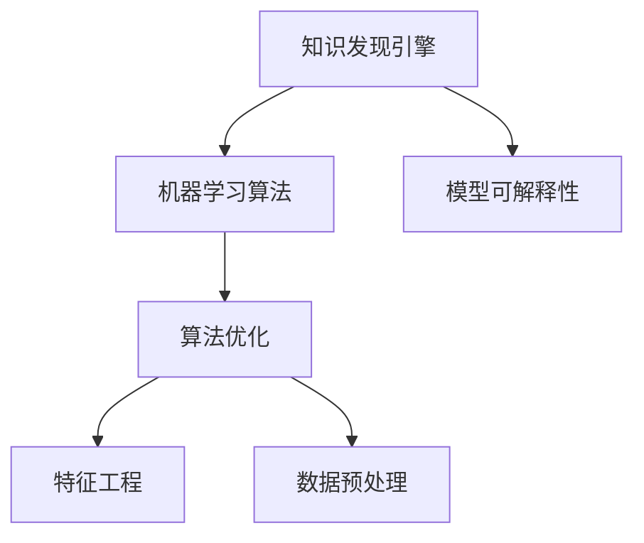

                 

# 知识发现引擎的机器学习算法优化

## 1. 背景介绍

### 1.1 问题由来
随着互联网和数据技术的快速发展，信息爆炸已经成为我们这个时代的重要特征。海量的数据资源为各行各业带来了前所未有的机遇和挑战。在业务决策、客户分析、市场预测、产品推荐等领域，如何从大规模数据中挖掘有价值的信息，成为亟待解决的问题。知识发现(Knowledge Discovery)应运而生，它通过机器学习算法从海量数据中自动提取模式和规律，为业务决策提供支持。

### 1.2 问题核心关键点
知识发现引擎通常依赖于复杂的机器学习算法，这些算法通过不断迭代优化，从数据中提取出潜在的知识模式。然而，在实际应用中，这些算法的性能往往受到多种因素的影响，如数据质量、算法复杂度、模型可解释性等。因此，如何优化知识发现引擎的机器学习算法，使其在保证性能的同时，具备更高的可解释性、可扩展性和鲁棒性，成为了知识发现领域的研究热点。

### 1.3 问题研究意义
优化知识发现引擎的机器学习算法，对于提升信息提取的准确性和实用性，降低业务决策风险，具有重要意义：

1. 提升数据洞察力。优化算法可以更准确地从数据中挖掘出有价值的知识模式，提升数据洞察力，辅助业务决策。
2. 提高模型可解释性。优化算法可以使得模型的预测过程更加透明，增强其可解释性，帮助理解模型的决策逻辑。
3. 扩展算法应用范围。优化算法可以更好地适应各种数据类型和业务场景，提升模型的泛化能力和应用范围。
4. 增强模型鲁棒性。优化算法可以减少对异常数据的敏感性，提高模型的鲁棒性，降低误判风险。
5. 加速模型训练和推理。优化算法可以通过算法简化和并行优化，提高模型的训练和推理效率，缩短实际应用中的响应时间。

## 2. 核心概念与联系

### 2.1 核心概念概述

为了更好地理解知识发现引擎的机器学习算法优化，本节将介绍几个密切相关的核心概念：

- 知识发现引擎(Knowledge Discovery Engine, KDE)：基于机器学习、数据挖掘技术，从海量数据中自动提取模式和规律的系统。
- 机器学习算法：通过数据训练模型，使其具备预测、分类、聚类等能力，常用的算法包括决策树、随机森林、神经网络等。
- 算法优化：通过改进算法模型、调整参数设置、引入正则化等手段，提升算法性能的过程。
- 特征工程：在模型训练前，通过选择、处理、构建特征来提高模型效果，是机器学习算法优化的重要环节。
- 数据预处理：包括数据清洗、标准化、归一化等，保证数据质量，提高模型训练效果。
- 模型可解释性：指模型的预测过程和决策逻辑是否能够被理解和解释，有助于提升用户信任度。

这些核心概念之间的逻辑关系可以通过以下Mermaid流程图来展示：



这个流程图展示的知识发现引擎核心概念及其之间的关系：

1. 知识发现引擎通过机器学习算法进行模式提取。
2. 算法优化提升算法性能，增强模型的泛化能力。
3. 特征工程和数据预处理提高数据质量，增强模型效果。
4. 模型可解释性帮助用户理解模型决策过程，提升信任度。

这些概念共同构成了知识发现引擎的基本框架，为其高效、准确地从数据中提取知识提供了重要支撑。

## 3. 核心算法原理 & 具体操作步骤
### 3.1 算法原理概述

知识发现引擎的机器学习算法优化，本质上是一个多目标优化问题。其核心思想是：在保证算法泛化能力的同时，通过优化算法模型、参数设置和特征选择，提升模型的性能、可解释性和鲁棒性。

形式化地，假设知识发现引擎的训练集为 $D=\{(x_i,y_i)\}_{i=1}^N$，其中 $x_i$ 为输入特征向量，$y_i$ 为标签。优化目标为：

$$
\min_{\theta} \mathcal{L}(\theta) + \lambda \mathcal{R}(\theta)
$$

其中，$\mathcal{L}(\theta)$ 为损失函数，$\mathcal{R}(\theta)$ 为正则化函数，$\lambda$ 为正则化系数。

优化算法通过不断调整参数 $\theta$，最小化损失函数 $\mathcal{L}(\theta)$ 和正则化函数 $\mathcal{R}(\theta)$，使得模型在训练集和测试集上都具备较好的性能。

### 3.2 算法步骤详解

知识发现引擎的机器学习算法优化一般包括以下几个关键步骤：

**Step 1: 准备数据集**
- 收集业务领域的数据集 $D$，确保数据集的质量和多样性。
- 划分为训练集、验证集和测试集。通常训练集用于模型训练，验证集用于调参，测试集用于评估模型性能。

**Step 2: 选择算法模型**
- 根据业务场景和数据特点，选择合适的机器学习算法，如决策树、随机森林、神经网络等。
- 考虑算法的复杂度和可解释性，以及应用领域的相关研究进展。

**Step 3: 优化算法模型**
- 对选择好的算法模型进行优化，如调整超参数、引入正则化、引入特征选择等。
- 使用交叉验证等技术，避免过拟合，提高模型泛化能力。
- 通过Grid Search、Random Search等方法，搜索最优的超参数组合。

**Step 4: 特征工程**
- 对原始数据进行特征选择和构造，提高特征质量和数据表达能力。
- 包括缺失值处理、标准化、归一化、特征提取等操作。
- 引入领域知识，构建更具业务意义的特征。

**Step 5: 模型训练与评估**
- 使用训练集对模型进行训练，并在验证集上进行调参。
- 在测试集上评估模型性能，如准确率、召回率、F1-score等指标。
- 根据评估结果，进一步优化算法模型和特征工程策略。

**Step 6: 模型部署与应用**
- 将训练好的模型部署到实际业务系统中，进行实时预测和分析。
- 持续收集新数据，定期重新训练模型，以适应数据分布的变化。

以上是知识发现引擎的机器学习算法优化的一般流程。在实际应用中，还需要根据具体业务场景和数据特点，对优化过程的各个环节进行优化设计，如改进损失函数、引入对抗训练等，以进一步提升模型性能。

### 3.3 算法优缺点

知识发现引擎的机器学习算法优化方法具有以下优点：
1. 提升模型性能。通过优化算法模型和参数设置，可以显著提升模型的泛化能力和性能表现。
2. 增强模型可解释性。优化算法可以使得模型的预测过程更加透明，增强其可解释性。
3. 扩展算法应用范围。优化算法可以更好地适应各种数据类型和业务场景，提升模型的泛化能力和应用范围。
4. 增强模型鲁棒性。优化算法可以减少对异常数据的敏感性，提高模型的鲁棒性。
5. 提高模型训练和推理效率。优化算法可以通过算法简化和并行优化，提高模型的训练和推理效率。

同时，该方法也存在一定的局限性：
1. 依赖数据质量。优化算法的性能很大程度上取决于数据的质量和多样性。
2. 优化过程复杂。算法优化涉及到超参数调整、特征选择等多个环节，过程较为复杂。
3. 计算资源需求高。大规模数据和复杂模型的训练推理，对计算资源需求较高。
4. 可解释性不足。优化后的模型往往较为复杂，其内部工作机制和决策逻辑难以理解。
5. 对异常数据敏感。优化算法可能对异常数据敏感，导致模型预测不准确。

尽管存在这些局限性，但就目前而言，算法优化仍是知识发现引擎的重要手段，在提升模型性能和应用范围方面具有重要价值。

### 3.4 算法应用领域

知识发现引擎的机器学习算法优化方法在多个领域中得到了广泛应用，例如：

- 金融风控：通过优化机器学习算法，从客户交易数据中挖掘潜在的风险因素，进行信用评估和风险预警。
- 零售营销：优化推荐算法，提升客户个性化推荐效果，增加销售额和客户满意度。
- 医疗诊断：通过优化分类算法，从患者病历中挖掘出潜在病症，辅助医生进行诊断和治疗。
- 舆情分析：优化情感分析算法，从社交媒体数据中提取用户情绪，辅助市场监测和舆情预测。
- 智能制造：优化聚类算法，从设备运行数据中识别异常模式，提升生产效率和设备维护。
- 灾害预警：优化预测算法，从气象数据中挖掘出潜在灾害信号，进行灾害预警。

除了上述这些经典应用外，知识发现引擎在智慧城市、智能交通、环境监测等领域也有广泛应用，为各行各业带来了新的业务价值。

## 4. 数学模型和公式 & 详细讲解  
### 4.1 数学模型构建

本节将使用数学语言对知识发现引擎的机器学习算法优化过程进行更加严格的刻画。

记知识发现引擎的训练集为 $D=\{(x_i,y_i)\}_{i=1}^N$，其中 $x_i$ 为输入特征向量，$y_i$ 为标签。假设优化算法为 $f(\theta)$，优化目标为：

$$
\min_{\theta} \mathcal{L}(f(\theta), D) + \lambda \mathcal{R}(f(\theta))
$$

其中，$\mathcal{L}(f(\theta), D)$ 为损失函数，$\mathcal{R}(f(\theta))$ 为正则化函数，$\lambda$ 为正则化系数。

常用的损失函数包括交叉熵损失、均方误差损失等，常用的正则化函数包括L1正则、L2正则等。

在优化过程中，通过梯度下降等优化算法，不断更新参数 $\theta$，最小化损失函数 $\mathcal{L}(f(\theta), D)$ 和正则化函数 $\mathcal{R}(f(\theta))$，使得模型在训练集和测试集上都具备较好的性能。

### 4.2 公式推导过程

以下我们以二分类任务为例，推导优化过程的数学公式。

假设优化算法为 $f(\theta) = \sigma(\mathbf{W}^T \mathbf{x} + b)$，其中 $\sigma$ 为激活函数，$\mathbf{W}$ 为权重矩阵，$\mathbf{x}$ 为输入特征向量，$b$ 为偏置项。损失函数为交叉熵损失，正则化函数为L2正则，优化目标为：

$$
\min_{\mathbf{W},b} \mathcal{L}(f(\theta), D) + \lambda \|\mathbf{W}\|^2
$$

其中，$\mathcal{L}(f(\theta), D)$ 为交叉熵损失，$\|\mathbf{W}\|^2$ 为L2正则化项，$\lambda$ 为正则化系数。

根据梯度下降法，每次迭代更新参数 $\mathbf{W}$ 和 $b$：

$$
\mathbf{W} \leftarrow \mathbf{W} - \eta \nabla_{\mathbf{W}}\mathcal{L}(f(\theta), D) - \eta \lambda \mathbf{W}
$$
$$
b \leftarrow b - \eta \nabla_{b}\mathcal{L}(f(\theta), D)
$$

其中，$\eta$ 为学习率，$\nabla_{\mathbf{W}}\mathcal{L}(f(\theta), D)$ 和 $\nabla_{b}\mathcal{L}(f(\theta), D)$ 为损失函数对权重和偏置的梯度。

在得到损失函数的梯度后，即可带入优化公式，完成模型的迭代优化。重复上述过程直至收敛，最终得到适应业务场景的最优模型参数 $\theta^*$。

## 5. 项目实践：代码实例和详细解释说明
### 5.1 开发环境搭建

在进行机器学习算法优化实践前，我们需要准备好开发环境。以下是使用Python进行Scikit-learn开发的环境配置流程：

1. 安装Anaconda：从官网下载并安装Anaconda，用于创建独立的Python环境。

2. 创建并激活虚拟环境：
```bash
conda create -n scikit-learn-env python=3.8 
conda activate scikit-learn-env
```

3. 安装Scikit-learn和其他依赖包：
```bash
conda install scikit-learn pandas numpy matplotlib sklearn tqdm jupyter notebook ipython
```

4. 安装各类工具包：
```bash
pip install numpy pandas scikit-learn matplotlib tqdm jupyter notebook ipython
```

完成上述步骤后，即可在`scikit-learn-env`环境中开始机器学习算法优化的实践。

### 5.2 源代码详细实现

下面我们以金融风控为例，给出使用Scikit-learn对决策树算法进行优化的Python代码实现。

首先，定义数据处理函数：

```python
from sklearn.model_selection import train_test_split
from sklearn.preprocessing import StandardScaler
from sklearn.ensemble import RandomForestClassifier
from sklearn.metrics import accuracy_score

def load_data():
    # 加载数据集
    df = pd.read_csv('financial_data.csv')
    # 分割数据集
    X = df.drop('label', axis=1)
    y = df['label']
    # 标准化数据
    scaler = StandardScaler()
    X = scaler.fit_transform(X)
    # 分割数据集
    X_train, X_test, y_train, y_test = train_test_split(X, y, test_size=0.2, random_state=42)
    return X_train, X_test, y_train, y_test

# 加载数据集
X_train, X_test, y_train, y_test = load_data()
```

然后，定义模型和优化器：

```python
from sklearn.ensemble import GradientBoostingClassifier
from sklearn.model_selection import GridSearchCV

# 初始化模型
model = GradientBoostingClassifier()

# 定义超参数范围
param_grid = {
    'n_estimators': [100, 200, 300],
    'learning_rate': [0.1, 0.01, 0.001],
    'max_depth': [3, 4, 5],
    'min_samples_split': [2, 3, 4],
    'min_samples_leaf': [1, 2, 3]
}

# 定义优化器
grid_search = GridSearchCV(model, param_grid, cv=5, scoring='accuracy')
```

接着，执行梯度训练：

```python
# 训练模型
grid_search.fit(X_train, y_train)

# 打印最优参数
print('Best parameters:', grid_search.best_params_)

# 打印最优模型
print('Best model:', grid_search.best_estimator_)
```

最后，测试和评估：

```python
# 在测试集上评估模型
y_pred = grid_search.predict(X_test)
accuracy = accuracy_score(y_test, y_pred)
print('Accuracy:', accuracy)

# 输出混淆矩阵
print('Confusion matrix:', confusion_matrix(y_test, y_pred))
```

以上就是使用Scikit-learn对决策树算法进行优化的完整代码实现。可以看到，通过Grid Search等优化方法，我们可以自动搜索最优的超参数组合，快速构建高性能的决策树模型。

### 5.3 代码解读与分析

让我们再详细解读一下关键代码的实现细节：

**load_data函数**：
- 读取数据集，并使用Pandas处理数据，分割数据集。
- 对数据进行标准化处理，保证数据质量。
- 划分训练集和测试集。

**GridSearchCV**：
- 定义超参数搜索范围，包括决策树的数量、学习率、最大深度等。
- 使用5折交叉验证，评估不同超参数组合的性能。
- 根据验证集上的准确率选择最优参数组合。

**训练和评估**：
- 在训练集上训练模型，并使用测试集进行验证。
- 计算模型在测试集上的准确率，并输出混淆矩阵。

通过Scikit-learn等工具，开发者可以快速实现机器学习算法的优化过程，并评估其性能。

## 6. 实际应用场景
### 6.1 金融风控

在金融风控领域，知识发现引擎可以应用于客户信用评估、欺诈检测等任务。通过优化机器学习算法，可以从客户交易数据中挖掘出潜在的风险因素，进行信用评估和风险预警。

在技术实现上，可以收集客户的交易记录、信用报告、社交网络信息等，构建特征向量，将客户分为高风险和低风险两类。通过优化算法，可以更准确地识别出高风险客户，从而降低信用风险和欺诈损失。

### 6.2 零售营销

在零售营销领域，知识发现引擎可以应用于个性化推荐、营销活动优化等任务。通过优化推荐算法，可以从用户的历史行为数据中挖掘出其偏好和兴趣，进行个性化推荐，提高用户满意度。

在技术实现上，可以收集用户的历史购买记录、浏览行为、评价数据等，构建特征向量。通过优化推荐算法，可以实现用户画像的精准刻画，推荐更多用户感兴趣的商品，增加销售额和客户忠诚度。

### 6.3 医疗诊断

在医疗诊断领域，知识发现引擎可以应用于疾病诊断、病情预测等任务。通过优化分类算法，可以从患者的病历数据中挖掘出潜在的病情，辅助医生进行诊断和治疗。

在技术实现上，可以收集患者的病历数据、实验室检查结果、影像数据等，构建特征向量。通过优化分类算法，可以更准确地识别出病情，提高诊断的准确性和效率。

### 6.4 舆情分析

在舆情分析领域，知识发现引擎可以应用于情感分析、话题识别等任务。通过优化情感分析算法，可以从社交媒体数据中提取用户情绪，辅助市场监测和舆情预测。

在技术实现上，可以收集社交媒体数据、新闻报道、评论数据等，构建特征向量。通过优化情感分析算法，可以更准确地识别出用户情绪和话题，辅助舆情预警和危机管理。

### 6.5 智能制造

在智能制造领域，知识发现引擎可以应用于设备故障预测、生产调度优化等任务。通过优化聚类算法，可以从设备运行数据中识别出异常模式，提升生产效率和设备维护。

在技术实现上，可以收集设备的运行数据、维护记录、传感器数据等，构建特征向量。通过优化聚类算法，可以更准确地识别出设备故障模式，及时进行维修和保养，减少生产停机时间。

### 6.6 灾害预警

在灾害预警领域，知识发现引擎可以应用于地震预测、气象预警等任务。通过优化预测算法，可以从气象数据中挖掘出潜在灾害信号，进行灾害预警。

在技术实现上，可以收集气象数据、地质数据、历史灾害数据等，构建特征向量。通过优化预测算法，可以更准确地识别出潜在灾害，及时进行预警，减少灾害损失。

## 7. 工具和资源推荐
### 7.1 学习资源推荐

为了帮助开发者系统掌握机器学习算法优化的理论基础和实践技巧，这里推荐一些优质的学习资源：

1. 《机器学习实战》系列书籍：由李航等知名专家撰写，系统介绍了机器学习算法的基本概念、实现方法和应用案例。

2. 《Python机器学习》书籍：由Sebastian Raschka等撰写，全面介绍了机器学习算法的Python实现，包含各种经典算法和优化技巧。

3. 《深度学习》课程：由吴恩达等人主讲，介绍了深度学习算法的基本原理和实现方法，适合有一定编程基础的学习者。

4. Scikit-learn官方文档：包含Scikit-learn库的详细文档和示例代码，是进行机器学习优化的重要参考资料。

5. Kaggle平台：提供了大量的机器学习竞赛和数据集，可以锻炼算法优化能力，检验算法性能。

通过这些资源的学习实践，相信你一定能够快速掌握机器学习算法优化的精髓，并用于解决实际的业务问题。

### 7.2 开发工具推荐

高效的开发离不开优秀的工具支持。以下是几款用于机器学习算法优化的常用工具：

1. Scikit-learn：基于Python的开源机器学习库，包含丰富的算法实现和优化方法，易于上手使用。

2. TensorFlow：由Google主导开发的开源深度学习框架，支持分布式训练和优化，适合大规模工程应用。

3. PyTorch：由Facebook主导开发的开源深度学习框架，支持动态计算图，适合快速迭代研究。

4. Keras：基于Python的高层次深度学习框架，封装了TensorFlow和Theano等底层库，适合快速搭建模型。

5. Jupyter Notebook：开源的交互式编程环境，支持代码运行、数据可视化、文档编辑等多种功能，方便调试和分享代码。

6. Anacodna：提供Python虚拟环境管理功能，支持创建和管理独立的环境，方便代码管理。

合理利用这些工具，可以显著提升机器学习算法优化的开发效率，加快创新迭代的步伐。

### 7.3 相关论文推荐

机器学习算法优化的研究源于学界的持续研究。以下是几篇奠基性的相关论文，推荐阅读：

1. Bagging and Boosting：介绍了Bagging和Boosting算法的基本思想和实现方法，对机器学习算法优化具有重要意义。

2. Random Forest：提出了随机森林算法，通过集成学习提高模型的泛化能力和性能。

3. Gradient Boosting Machines：介绍了梯度提升机算法，通过迭代优化逐步提升模型性能。

4. Gradient Boosting Machines：介绍了梯度提升机算法，通过迭代优化逐步提升模型性能。

5. XGBoost：提出了XGBoost算法，结合梯度提升机和特征选择技术，实现高效优化的机器学习算法。

6. LightGBM：提出了LightGBM算法，通过加速迭代和特征压缩等技术，提升模型训练和推理效率。

这些论文代表了大规模数据下的机器学习算法优化方法的研究进展，通过学习这些前沿成果，可以帮助研究者把握学科前进方向，激发更多的创新灵感。

## 8. 总结：未来发展趋势与挑战

### 8.1 总结

本文对知识发现引擎的机器学习算法优化方法进行了全面系统的介绍。首先阐述了机器学习算法优化的背景和意义，明确了其在提升模型性能、可解释性和鲁棒性方面的独特价值。其次，从原理到实践，详细讲解了机器学习算法优化的数学原理和关键步骤，给出了机器学习算法优化的完整代码实例。同时，本文还广泛探讨了机器学习算法优化在金融风控、零售营销、医疗诊断、舆情分析等多个行业领域的应用前景，展示了算法优化的巨大潜力。此外，本文精选了机器学习算法优化的各类学习资源，力求为读者提供全方位的技术指引。

通过本文的系统梳理，可以看到，机器学习算法优化方法在提升模型性能、可解释性和鲁棒性方面具有重要价值。这些方法在实际应用中，已经被广泛应用于各行各业，成为数据分析和业务决策的重要手段。未来，伴随机器学习技术的不断发展，算法优化将进一步推动人工智能技术在垂直行业的落地应用，为经济社会发展注入新的动力。

### 8.2 未来发展趋势

展望未来，机器学习算法优化的发展趋势如下：

1. 自动化和智能化：随着AI技术的进步，自动化和智能化将成为算法优化的主要方向。通过自动化超参数搜索、智能特征选择等手段，进一步提升算法优化效率。

2. 跨领域融合：未来，算法优化将更加注重跨领域知识融合，将视觉、语音、自然语言等多模态数据进行协同优化，提升综合性能。

3. 联邦学习：通过分布式优化技术，将多台设备或数据源的数据进行协同优化，避免数据泄露，提升算法优化效果。

4. 自适应学习：通过动态调整算法模型和超参数，实现对数据分布变化的适应性优化，增强模型的泛化能力。

5. 迁移学习：将已有算法优化经验迁移到新的领域和任务，快速构建高性能模型，加速模型开发进程。

6. 自监督学习：通过自监督学习任务，提升算法的泛化能力和性能表现，减少对标注数据的依赖。

以上趋势凸显了机器学习算法优化的广阔前景。这些方向的探索发展，必将进一步提升算法的性能和应用范围，为人工智能技术的产业化发展提供新的驱动力。

### 8.3 面临的挑战

尽管机器学习算法优化已经取得了显著进展，但在迈向更加智能化、普适化应用的过程中，仍然面临诸多挑战：

1. 数据质量和多样性。机器学习算法的性能很大程度上依赖于数据的质量和多样性，数据获取和预处理环节需要充分考虑。

2. 算法复杂度和计算成本。大规模数据和复杂算法的训练和推理，对计算资源和计算时间提出了较高要求。

3. 模型可解释性。优化后的模型往往较为复杂，其内部工作机制和决策逻辑难以理解，模型可解释性问题亟需解决。

4. 鲁棒性和泛化能力。优化算法可能对异常数据敏感，导致模型预测不准确，模型鲁棒性和泛化能力有待提高。

5. 安全和隐私保护。优化算法的训练和推理过程需要严格控制，避免数据泄露和模型滥用，隐私保护和安全问题需要引起高度重视。

6. 持续优化和模型更新。知识发现引擎需要持续优化和模型更新，以适应数据分布的变化，保持性能的稳定性和可靠性。

正视这些挑战，积极应对并寻求突破，将是机器学习算法优化技术走向成熟的必由之路。相信随着学界和产业界的共同努力，这些挑战终将一一被克服，机器学习算法优化必将在构建安全、可靠、可解释、可控的智能系统方面发挥重要作用。

### 8.4 研究展望

面对机器学习算法优化所面临的挑战，未来的研究需要在以下几个方面寻求新的突破：

1. 引入更多先验知识。将符号化的先验知识，如知识图谱、逻辑规则等，与神经网络模型进行巧妙融合，引导算法优化过程学习更准确、合理的知识表示。

2. 探索无监督和半监督优化方法。摆脱对大规模标注数据的依赖，利用自监督学习、主动学习等无监督和半监督范式，最大限度利用非结构化数据，实现更加灵活高效的算法优化。

3. 融合因果分析和博弈论工具。将因果分析方法引入算法优化，识别出优化过程中的关键特征，增强模型的因果关系和决策逻辑。借助博弈论工具刻画人机交互过程，主动探索并规避算法的脆弱点，提高系统稳定性。

4. 纳入伦理道德约束。在算法优化目标中引入伦理导向的评估指标，过滤和惩罚有害的输出倾向，确保算法的公平性和道德性。

5. 结合领域专家知识。将领域专家的知识与算法优化相结合，构建更全面、准确的知识模型，提升算法优化效果。

这些研究方向的探索，必将引领机器学习算法优化技术迈向更高的台阶，为构建安全、可靠、可解释、可控的智能系统铺平道路。面向未来，机器学习算法优化技术还需要与其他人工智能技术进行更深入的融合，如知识表示、因果推理、强化学习等，多路径协同发力，共同推动人工智能技术在垂直行业的落地应用。只有勇于创新、敢于突破，才能不断拓展机器学习算法优化的边界，让智能技术更好地造福人类社会。

## 9. 附录：常见问题与解答

**Q1：机器学习算法优化是否适用于所有数据类型和业务场景？**

A: 机器学习算法优化通常适用于结构化、半结构化和非结构化数据，但对于一些非典型数据类型，如视频、图像等，可能需要进行预处理和特征提取。同时，对于某些特殊业务场景，如实时数据流、高维数据等，优化算法也需要相应调整。

**Q2：如何选择最优的超参数组合？**

A: 超参数优化通常通过网格搜索、随机搜索等方法进行。网格搜索适用于超参数较少的情况，随机搜索适用于超参数较多的情况。同时，也可以使用贝叶斯优化、遗传算法等高级方法，寻找最优的超参数组合。

**Q3：如何提高机器学习算法的可解释性？**

A: 提高机器学习算法的可解释性，可以从以下几个方面入手：
1. 选择可解释性较强的算法模型，如决策树、逻辑回归等。
2. 使用特征选择方法，简化特征空间，提高模型的可解释性。
3. 引入模型解释工具，如LIME、SHAP等，辅助理解和解释模型的预测过程。
4. 构建可视化的决策树、热力图等，直观展示模型的决策逻辑。

**Q4：机器学习算法优化过程中需要注意哪些问题？**

A: 机器学习算法优化过程中需要注意以下问题：
1. 数据质量：保证数据质量，避免噪声和异常值的影响。
2. 超参数调整：选择合适的超参数调整方法，避免过拟合和欠拟合。
3. 正则化：引入正则化技术，避免模型过拟合，增强泛化能力。
4. 计算资源：合理利用计算资源，避免资源浪费和效率低下。
5. 模型性能：持续评估模型性能，及时调整算法模型和超参数。

**Q5：机器学习算法优化在实际应用中需要注意哪些问题？**

A: 机器学习算法优化在实际应用中需要注意以下问题：
1. 数据预处理：对数据进行标准化、归一化等处理，保证数据质量。
2. 模型部署：将优化后的模型部署到实际系统中，进行实时预测和分析。
3. 持续优化：持续收集新数据，定期重新训练模型，适应数据分布的变化。
4. 模型监控：实时监控模型性能，及时发现和解决问题，确保系统稳定。

机器学习算法优化方法具有广阔的应用前景和巨大的潜力，通过不断优化算法模型和参数设置，提升模型的性能和应用范围，将在未来的信息化建设中发挥重要作用。相信随着研究的不断深入和技术的不断进步，机器学习算法优化必将成为人工智能技术的重要组成部分，推动各行各业的发展和进步。

