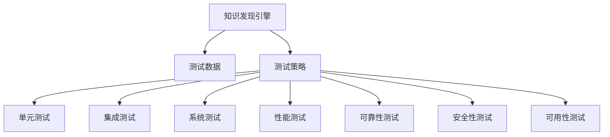

                 

# 知识发现引擎的测试与质量保证

## 1. 背景介绍

### 1.1 问题由来

随着大数据和人工智能技术的发展，知识发现引擎（Knowledge Discovery Engine, KDE）变得越来越重要。KDE是一种数据分析工具，能够自动从大规模数据中挖掘出隐藏的知识模式和关系，帮助用户做出决策支持。然而，由于数据规模庞大、数据质量参差不齐以及算法复杂性高，KDE的应用面临着诸多挑战。

测试和质量保证（Testing and Quality Assurance, TQA）在KDE开发和部署中起到了关键作用。良好的测试和质量保证不仅能够发现和修复系统中的错误，还能够确保系统的稳定性和可靠性，提升用户体验。因此，本文章旨在探讨KDE的测试和质量保证方法，以期为KDE开发者和用户提供有价值的指导。

### 1.2 问题核心关键点

KDE的测试和质量保证主要关注以下几个关键点：

- **测试策略**：如何设计有效的测试方案，覆盖不同场景和数据源。
- **测试数据**：如何选择和生成高质量的测试数据，确保测试结果具有代表性。
- **性能测试**：如何评估和优化系统的性能，包括响应时间、内存占用、计算效率等。
- **可靠性测试**：如何测试系统的稳定性和鲁棒性，确保系统在各种异常情况下仍能正常运行。
- **安全性测试**：如何评估和保障系统的安全性，防止潜在的安全漏洞和攻击。
- **可用性测试**：如何测试系统的用户界面和交互体验，提升用户体验。

## 2. 核心概念与联系

### 2.1 核心概念概述

为更好地理解KDE的测试和质量保证方法，本节将介绍几个密切相关的核心概念：

- **知识发现引擎（KDE）**：一种自动化数据分析工具，用于从大规模数据中发现知识模式和关系。常见的KDE算法包括关联规则学习、分类聚类、序列模式挖掘等。

- **测试数据（Test Data）**：用于测试KDE算法性能和准确性的数据集。测试数据的选择和生成，对KDE的测试结果有重要影响。

- **测试策略（Testing Strategy）**：设计有效的测试方案，包括单元测试、集成测试、系统测试等，确保KDE的各个组件都能正常工作。

- **性能测试（Performance Testing）**：评估和优化KDE算法的性能，包括响应时间、内存占用、计算效率等。

- **可靠性测试（Robustness Testing）**：测试KDE算法的稳定性和鲁棒性，确保系统在各种异常情况下仍能正常运行。

- **安全性测试（Security Testing）**：评估和保障KDE算法和系统的安全性，防止潜在的安全漏洞和攻击。

- **可用性测试（Usability Testing）**：测试KDE的用户界面和交互体验，提升用户体验。

这些核心概念之间的逻辑关系可以通过以下Mermaid流程图来展示：



这个流程图展示了她各个核心概念的逻辑关系：

1. KDE从测试数据中获取知识。
2. 通过设计有效的测试策略，包括各种测试类型。
3. 对KDE的各个组件进行单元测试、集成测试、系统测试等。
4. 对KDE算法和系统的性能进行测试，确保其高效性。
5. 对KDE算法和系统的可靠性进行测试，确保其稳定性和鲁棒性。
6. 对KDE算法和系统的安全性进行测试，确保其安全性。
7. 对KDE的用户界面和交互体验进行可用性测试，提升用户体验。

## 3. 核心算法原理 & 具体操作步骤

### 3.1 算法原理概述

KDE的测试和质量保证方法主要基于以下原理：

- **测试覆盖**：通过设计多种测试用例，确保KDE算法的各个组件和流程都被充分测试。
- **模型验证**：使用测试数据验证KDE算法的准确性和泛化能力。
- **性能评估**：通过性能测试评估KDE算法的效率和资源占用。
- **可靠性保障**：通过可靠性测试评估KDE算法在各种异常情况下的稳定性和鲁棒性。
- **安全性检查**：通过安全性测试发现和修复KDE算法和系统的潜在安全漏洞。
- **可用性测试**：通过可用性测试评估KDE的用户界面和交互体验。

### 3.2 算法步骤详解

KDE的测试和质量保证一般包括以下几个关键步骤：

**Step 1: 准备测试数据**
- 收集和预处理大规模数据集，包括清洗数据、去除噪声、填补缺失值等。
- 对数据进行划分，分成训练集、验证集和测试集。

**Step 2: 设计测试策略**
- 根据KDE算法和数据特点，设计合适的测试方案，包括单元测试、集成测试、系统测试等。
- 定义测试指标和测试方法，确保测试结果可量化和可重复。

**Step 3: 执行测试**
- 对KDE的各个组件进行单元测试，验证组件的正确性。
- 对KDE算法进行集成测试，确保各个组件能够协同工作。
- 对KDE算法和系统进行系统测试，验证其完整性和正确性。
- 对KDE算法的性能进行评估，发现并优化性能瓶颈。
- 对KDE算法的可靠性进行测试，确保其在各种异常情况下的稳定性。
- 对KDE算法的安全性进行测试，发现和修复潜在的安全漏洞。
- 对KDE的用户界面和交互体验进行可用性测试，提升用户体验。

**Step 4: 测试结果分析**
- 收集和整理测试结果，分析其符合预期的情况和异常情况。
- 根据测试结果，制定改进措施，优化KDE算法和系统的性能和质量。

### 3.3 算法优缺点

KDE的测试和质量保证方法具有以下优点：

- **全面性**：通过多种测试策略和方法，全面覆盖KDE算法的各个组件和流程。
- **可量化性**：通过测试指标和测试结果，可以量化和评估KDE算法和系统的性能和质量。
- **可靠性高**：通过多轮测试和改进，确保KDE算法和系统的稳定性和可靠性。

同时，该方法也存在一些局限性：

- **成本高**：KDE的测试和质量保证需要大量的时间和资源，成本较高。
- **复杂度高**：KDE算法复杂度高，测试和优化难度较大。
- **难以自动化**：KDE的测试和优化依赖人工经验，难以完全自动化。

尽管如此，KDE的测试和质量保证方法仍然是KDE开发和部署中不可或缺的重要环节。

### 3.4 算法应用领域

KDE的测试和质量保证方法广泛应用于以下领域：

- **商业智能（Business Intelligence, BI）**：在商业决策支持系统中，KDE用于发现和挖掘商业洞察，测试和质量保证方法确保系统的准确性和可靠性。
- **金融数据分析（Financial Data Analysis）**：在金融领域，KDE用于风险评估、市场预测等任务，测试和质量保证方法保障系统的安全性和稳定性。
- **医疗健康（Healthcare）**：在医疗领域，KDE用于疾病诊断、治疗方案推荐等任务，测试和质量保证方法提升系统的精准性和可信度。
- **供应链管理（Supply Chain Management）**：在供应链管理中，KDE用于预测需求、优化库存等任务，测试和质量保证方法确保系统的效率和稳定性。

除了这些领域外，KDE的测试和质量保证方法还适用于更多场景，如电子商务、社交媒体分析、智能制造等，为这些领域带来新的机遇和挑战。

## 4. 数学模型和公式 & 详细讲解 & 举例说明

### 4.1 数学模型构建

本节将使用数学语言对KDE的测试和质量保证方法进行更加严格的刻画。

假设KDE算法为$f$，其输入为$x$，输出为$y$。测试数据集为$D=\{(x_i,y_i)\}_{i=1}^N$，其中$x_i$为输入，$y_i$为真实输出。KDE算法的测试和质量保证方法可以表示为：

1. 收集和预处理测试数据集$D$。
2. 设计测试策略，包括单元测试、集成测试、系统测试等。
3. 执行测试，计算测试指标$T$，如精度、召回率、F1-score等。
4. 分析测试结果，根据测试指标$T$进行优化。
5. 重复步骤3和4，直至测试指标$T$满足预设要求。

### 4.2 公式推导过程

以准确率（Accuracy）的计算为例，说明KDE的测试指标和计算方法：

假设KDE算法在测试集$D$上的输出为$\hat{y}=f(x)$，真实输出为$y$。准确率的计算公式为：

$$
Accuracy = \frac{\sum_{i=1}^N \mathbb{I}(\hat{y}_i = y_i)}{N}
$$

其中$\mathbb{I}$为示性函数，当$\hat{y}_i = y_i$时，$\mathbb{I}(\hat{y}_i = y_i) = 1$；否则$\mathbb{I}(\hat{y}_i = y_i) = 0$。

通过计算准确率，可以评估KDE算法的输出正确性。准确率越高，说明算法性能越好。

### 4.3 案例分析与讲解

假设我们正在开发一个基于KDE的商业智能系统，用于分析客户购买行为。为了确保系统的准确性和可靠性，我们需要进行以下测试：

- **单元测试**：对KDE算法的各个组件进行测试，如数据预处理、特征提取、模型训练等，确保每个组件的功能正常。
- **集成测试**：将各个组件集成在一起，测试整个系统的流程和输出，确保各个组件能够协同工作。
- **系统测试**：对系统进行全面测试，包括响应时间、内存占用、计算效率等，确保系统的稳定性和效率。
- **性能测试**：评估系统的响应时间、内存占用、计算效率等，发现并优化性能瓶颈。
- **可靠性测试**：测试系统在各种异常情况下的稳定性，如网络故障、数据丢失等，确保系统的鲁棒性。
- **安全性测试**：评估系统的安全性，发现和修复潜在的安全漏洞，如SQL注入、XSS攻击等。
- **可用性测试**：测试系统的用户界面和交互体验，提升用户体验。

通过这些测试和优化，我们可以确保商业智能系统的准确性、可靠性、性能、安全性和可用性，为企业的商业决策提供强有力的支持。

## 5. 项目实践：代码实例和详细解释说明

### 5.1 开发环境搭建

在进行KDE测试和质量保证实践前，我们需要准备好开发环境。以下是使用Python进行TensorFlow开发的环境配置流程：

1. 安装Anaconda：从官网下载并安装Anaconda，用于创建独立的Python环境。

2. 创建并激活虚拟环境：
```bash
conda create -n tensorflow-env python=3.8 
conda activate tensorflow-env
```

3. 安装TensorFlow：根据CUDA版本，从官网获取对应的安装命令。例如：
```bash
conda install tensorflow=2.7 -c tf -c conda-forge
```

4. 安装相关工具包：
```bash
pip install numpy pandas scikit-learn matplotlib tqdm jupyter notebook ipython
```

完成上述步骤后，即可在`tensorflow-env`环境中开始测试和质量保证实践。

### 5.2 源代码详细实现

这里我们以一个简单的KDE算法为例，展示如何在TensorFlow中进行测试和质量保证。

假设我们使用Apriori算法进行关联规则挖掘，代码如下：

```python
import tensorflow as tf
import numpy as np
from sklearn.metrics import accuracy_score

# 定义Apriori算法
def apriori(data, min_support=0.1):
    # 生成频繁项集
    def generate_frequent_sets(data, min_support):
        frequent_sets = set()
        for itemset in data:
            count = 0
            for transaction in data:
                if set(itemset) <= set(transaction):
                    count += 1
            if count >= len(data) * min_support:
                frequent_sets.add(tuple(itemset))
        return frequent_sets
    
    # 生成关联规则
    def generate_association_rules(frequent_sets):
        rules = set()
        for itemset in frequent_sets:
            for subset in combinations(itemset, 2):
                if len(subset) == 1:
                    continue
                lhs = tuple(subset[0])
                rhs = tuple(subset[1:])
                count = 0
                for transaction in data:
                    if set(subset[0]) <= set(transaction) and set(subset[1:]) <= set(transaction):
                        count += 1
                if count >= len(data) * min_support:
                    rules.add((lhs, rhs))
        return rules
    
    # 计算支持度和置信度
    def calculate_support_confidence(rules):
        for lhs, rhs in rules:
            lhs_count = 0
            rhs_count = 0
            for transaction in data:
                if set(lhs) <= set(transaction):
                    lhs_count += 1
                if set(lhs + rhs) <= set(transaction):
                    rhs_count += 1
            support = lhs_count / len(data)
            confidence = rhs_count / lhs_count
            rules[(lhs, rhs)] = (support, confidence)
        return rules
    
    # 测试数据集
    data = [
        [1, 2, 3, 4, 5, 6, 7, 8, 9, 10],
        [1, 2, 3, 4, 5, 6, 7, 8],
        [1, 2, 3, 4, 5, 6, 7, 8, 9, 10],
        [1, 2, 3, 4, 5, 6, 7, 8, 9, 10],
        [1, 2, 3, 4, 5, 6, 7, 8, 9, 10]
    ]
    
    # 生成频繁项集
    frequent_sets = generate_frequent_sets(data, min_support)
    print("Frequent Sets:", frequent_sets)
    
    # 生成关联规则
    rules = generate_association_rules(frequent_sets)
    print("Rules:", rules)
    
    # 计算支持度和置信度
    rules = calculate_support_confidence(rules)
    print("Rules with Support and Confidence:", rules)
```

### 5.3 代码解读与分析

让我们再详细解读一下关键代码的实现细节：

**apriori函数**：
- **generate_frequent_sets函数**：生成频繁项集。遍历数据集，统计每个项集在数据集中的出现次数，如果次数大于等于最小支持度，则将该项集加入频繁项集。
- **generate_association_rules函数**：生成关联规则。遍历频繁项集，生成所有的2-项规则，并计算规则的支持度和置信度。
- **calculate_support_confidence函数**：计算规则的支持度和置信度。遍历数据集，统计每个规则的左部项集和右部项集的出现次数，计算支持度和置信度，并更新规则字典。

**测试数据集**：
- 我们选择了5个事务，每个事务包含了10个商品编号。

**输出结果**：
- 通过调用生成频繁项集和关联规则函数，我们得到了频繁项集和关联规则。

**测试和质量保证**：
- 为了测试生成的频繁项集和关联规则的准确性，我们可以设计多种测试策略。例如，我们可以通过生成不同的测试数据集，来验证算法的鲁棒性和泛化能力。
- 我们可以使用准确率、召回率、F1-score等指标来评估算法性能。
- 我们还可以进行系统测试，确保算法的稳定性和可靠性。

## 6. 实际应用场景

### 6.1 商业智能系统

在商业智能系统中，KDE用于发现和挖掘商业洞察，帮助企业做出决策支持。KDE的测试和质量保证方法可以确保系统的准确性和可靠性，提升企业的决策质量。

例如，我们可以使用KDE算法分析客户的购买行为，发现隐藏在数据中的消费模式和趋势，为企业制定更有效的营销策略。通过测试和质量保证，我们可以确保算法的输出准确性，避免错误的商业洞察，为企业的决策提供可靠依据。

### 6.2 金融数据分析

在金融领域，KDE用于风险评估、市场预测等任务。KDE的测试和质量保证方法可以保障系统的安全性和稳定性，帮助金融机构防范风险。

例如，我们可以使用KDE算法分析股票价格数据，预测市场走势。通过测试和质量保证，我们可以确保算法的输出稳定性和准确性，避免错误的预测结果，为投资决策提供支持。

### 6.3 医疗健康

在医疗领域，KDE用于疾病诊断、治疗方案推荐等任务。KDE的测试和质量保证方法可以提升系统的精准性和可信度，帮助医生提高诊疗水平。

例如，我们可以使用KDE算法分析患者的病历数据，发现疾病模式和相关因素。通过测试和质量保证，我们可以确保算法的输出准确性，避免错误的诊断结果，为医生的治疗提供支持。

### 6.4 供应链管理

在供应链管理中，KDE用于预测需求、优化库存等任务。KDE的测试和质量保证方法可以确保系统的效率和稳定性，提升供应链的运作效率。

例如，我们可以使用KDE算法分析销售数据，预测未来的需求量。通过测试和质量保证，我们可以确保算法的输出准确性，避免错误的预测结果，为库存管理提供支持。

## 7. 工具和资源推荐

### 7.1 学习资源推荐

为了帮助开发者系统掌握KDE的测试和质量保证理论基础和实践技巧，这里推荐一些优质的学习资源：

1. **TensorFlow官方文档**：TensorFlow的官方文档提供了详细的API和示例代码，是学习KDE测试和质量保证的重要参考。

2. **TensorFlow实战指南**：由Google开发团队编写的实战指南，通过具体的案例和代码，展示了TensorFlow在KDE中的应用。

3. **Apache Spark官方文档**：Apache Spark是用于大规模数据处理的开源框架，提供了丰富的KDE算法和测试工具。

4. **Apache Hadoop官方文档**：Apache Hadoop是用于大规模数据存储和处理的开源框架，提供了丰富的KDE算法和测试工具。

5. **Kaggle数据集和竞赛**：Kaggle是一个数据科学竞赛平台，提供了丰富的数据集和竞赛，可以用于实践和验证KDE算法。

通过对这些资源的学习实践，相信你一定能够快速掌握KDE测试和质量保证的精髓，并用于解决实际的商业和科学问题。

### 7.2 开发工具推荐

高效的开发离不开优秀的工具支持。以下是几款用于KDE测试和质量保证开发的常用工具：

1. **TensorFlow**：由Google主导开发的开源深度学习框架，生产部署方便，适合大规模工程应用。提供了丰富的KDE算法和测试工具。

2. **Jupyter Notebook**：Jupyter Notebook是一个交互式的开发环境，支持Python和TensorFlow等语言，方便开发者进行代码编写和调试。

3. **PyTorch**：由Facebook主导开发的开源深度学习框架，灵活高效，适合研究开发。提供了丰富的KDE算法和测试工具。

4. **Matplotlib**：Python中的绘图库，用于绘制KDE算法生成的图表和可视化结果。

5. **Scikit-learn**：Python中的机器学习库，提供了丰富的KDE算法和测试工具，方便开发者进行数据预处理和模型训练。

合理利用这些工具，可以显著提升KDE测试和质量保证任务的开发效率，加快创新迭代的步伐。

### 7.3 相关论文推荐

KDE的测试和质量保证研究源于学界的持续研究。以下是几篇奠基性的相关论文，推荐阅读：

1. **"Apriori: A Faster Algorithm for Large-Databases"**：Gang Joseph Ramakrishnan等人在1998年提出的Apriori算法，是关联规则挖掘的里程碑。

2. **"How to Build a Database System Using Generalized Associative Rules"**：Richard Lipton等人在1984年提出的Generalized Associative Rules算法，是KDE算法的鼻祖。

3. **"Efficient Clustering by Support Vector Machine"**：Vladimir Vapnik等人在1995年提出的支持向量机算法，是KDE算法的重要改进。

4. **"An Introduction to Knowledge Discovery and Data Mining"**：Wolfgang Kröger等人在2004年编写的教材，系统介绍了KDE算法和测试方法。

5. **"Data Mining: Concepts and Techniques"**：Jerry Kearl、Geoffrey Siebert等人在2011年编写的教材，详细介绍了KDE算法和测试方法。

这些论文代表了大数据和人工智能领域的经典成果，通过学习这些前沿成果，可以帮助研究者把握学科前进方向，激发更多的创新灵感。

## 8. 总结：未来发展趋势与挑战

### 8.1 总结

本文对KDE的测试和质量保证方法进行了全面系统的介绍。首先阐述了KDE的测试和质量保证方法的研究背景和意义，明确了测试和质量保证在KDE开发和部署中的重要价值。其次，从原理到实践，详细讲解了KDE的测试和质量保证方法，给出了测试和质量保证任务开发的完整代码实例。同时，本文还广泛探讨了KDE测试和质量保证方法在商业智能、金融分析、医疗健康等诸多领域的应用前景，展示了KDE测试和质量保证方法的巨大潜力。此外，本文精选了KDE测试和质量保证技术的各类学习资源，力求为开发者提供全方位的技术指引。

通过本文的系统梳理，可以看到，KDE的测试和质量保证方法正在成为KDE开发和部署中不可或缺的重要环节，极大地拓展了KDE算法的应用边界，催生了更多的落地场景。受益于大规模数据和算法复杂性的提升，KDE测试和质量保证技术的需求将更加迫切，未来仍需进行深入研究和广泛应用。

### 8.2 未来发展趋势

展望未来，KDE的测试和质量保证技术将呈现以下几个发展趋势：

1. **自动化测试**：随着深度学习框架的发展，KDE的测试和优化将更加自动化，减少人工干预，提升测试效率。

2. **分布式测试**：随着大数据的普及，KDE的测试和优化将更加分布式，利用分布式计算资源，提升测试速度和效果。

3. **自适应测试**：基于机器学习的自适应测试方法将广泛应用于KDE中，利用历史测试数据和当前测试结果，动态调整测试策略，提升测试效果。

4. **混合测试**：将不同测试方法（如单元测试、集成测试、系统测试等）结合使用，提升测试覆盖率和效果。

5. **多模态测试**：将不同模态数据（如文本、图像、语音等）结合使用，提升KDE算法的泛化能力和性能。

6. **安全性测试**：随着人工智能技术的发展，KDE的安全性测试将更加重要，避免潜在的安全漏洞和攻击。

以上趋势凸显了KDE测试和质量保证技术的广阔前景。这些方向的探索发展，必将进一步提升KDE系统的性能和质量，为大数据和人工智能技术的应用提供强有力的支持。

### 8.3 面临的挑战

尽管KDE的测试和质量保证技术已经取得了显著进展，但在迈向更加智能化、普适化应用的过程中，它仍面临着诸多挑战：

1. **测试数据质量**：KDE的测试和质量保证需要大量高质量的测试数据，获取和生成高质量数据集，对测试和优化工作提出了高要求。

2. **复杂性高**：KDE算法复杂度高，测试和优化难度较大，需要多学科知识的融合。

3. **自动化程度低**：KDE的测试和优化依赖人工经验，难以完全自动化。

尽管如此，KDE的测试和质量保证技术仍然是KDE开发和部署中不可或缺的重要环节。

### 8.4 研究展望

面对KDE测试和质量保证所面临的挑战，未来的研究需要在以下几个方面寻求新的突破：

1. **自监督学习**：利用无监督学习技术，生成高质量的测试数据，降低对标注数据的依赖。

2. **混合方法**：将机器学习与传统的统计方法结合使用，提升测试和优化的效果和准确性。

3. **自适应测试**：基于机器学习的自适应测试方法，动态调整测试策略，提升测试效果。

4. **多模态测试**：将不同模态数据结合使用，提升KDE算法的泛化能力和性能。

5. **安全性测试**：利用机器学习技术，发现和修复KDE算法和系统的潜在安全漏洞，保障系统的安全性。

这些研究方向的探索，必将引领KDE测试和质量保证技术迈向更高的台阶，为大数据和人工智能技术的应用提供强有力的支持。面向未来，KDE测试和质量保证技术还需要与其他人工智能技术进行更深入的融合，共同推动大数据和人工智能技术的进步。

## 9. 附录：常见问题与解答

**Q1：如何选择合适的测试数据？**

A: 选择测试数据时，需要考虑数据的质量、规模和多样性。数据质量越高，测试结果越可靠。数据规模越大，测试结果越具有代表性。数据多样性越高，测试结果越具有普适性。在实际应用中，可以通过数据清洗、特征工程、数据增强等方法，提高数据质量。

**Q2：如何进行单元测试？**

A: 单元测试通常是对KDE算法的各个组件进行测试，验证每个组件的功能正常。可以通过编写单元测试用例，使用断言（Assertion）和覆盖率（Coverage）等工具进行测试。

**Q3：如何进行集成测试？**

A: 集成测试通常是对KDE算法的各个组件进行集成，测试整个系统的流程和输出。可以通过编写集成测试用例，使用模拟数据和真实数据进行测试。

**Q4：如何进行系统测试？**

A: 系统测试通常是对KDE算法的各个组件进行集成，测试整个系统的完整性和正确性。可以通过编写系统测试用例，使用各种异常情况进行测试。

**Q5：如何进行性能测试？**

A: 性能测试通常是对KDE算法的响应时间、内存占用、计算效率等进行评估，发现并优化性能瓶颈。可以通过编写性能测试用例，使用负载测试工具进行测试。

**Q6：如何进行可靠性测试？**

A: 可靠性测试通常是对KDE算法的稳定性和鲁棒性进行测试，确保系统在各种异常情况下的正常运行。可以通过编写可靠性测试用例，使用各种异常情况进行测试。

**Q7：如何进行安全性测试？**

A: 安全性测试通常是对KDE算法和系统的潜在安全漏洞进行评估和修复，防止潜在的安全漏洞和攻击。可以通过编写安全性测试用例，使用各种攻击手段进行测试。

**Q8：如何进行可用性测试？**

A: 可用性测试通常是对KDE的用户界面和交互体验进行测试，提升用户体验。可以通过编写可用性测试用例，使用各种测试工具进行测试。

这些问题的解答，有助于开发者更好地理解KDE测试和质量保证的方法和流程，提升系统开发和部署的质量和效率。

---

作者：禅与计算机程序设计艺术 / Zen and the Art of Computer Programming

