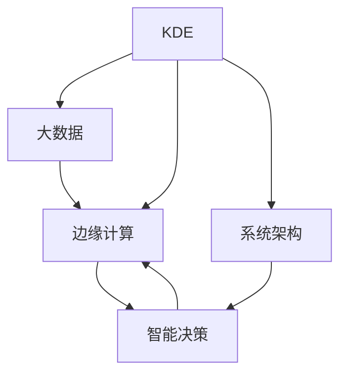

                 

# 知识发现引擎的边缘计算应用

> 关键词：知识发现引擎,边缘计算,大数据,智能决策,实时分析,系统架构

## 1. 背景介绍

### 1.1 问题由来

在信息爆炸的今天，海量数据的收集、存储和分析已经成为了企业的核心需求。传统的集中式计算方式，受限于带宽和存储资源，难以满足实时性、扩展性和成本控制等多重需求。因此，边缘计算（Edge Computing）应运而生，以其分布式、本地化、低延迟的特点，成为下一代计算的重要趋势。

知识发现引擎（Knowledge Discovery Engine, KDE）作为数据挖掘和知识发现的利器，能够从海量数据中抽取有价值的信息，帮助企业做出更为精准的决策。但在集中式计算环境中，知识发现引擎的数据收集、存储和分析流程往往耗时漫长，无法满足实时决策的需求。

如何将知识发现引擎的优势与边缘计算的特点相结合，构建高效、灵活、安全的知识发现和决策支持系统，成为了当前研究的热点。本文将探讨边缘计算环境下知识发现引擎的构建方法，介绍关键算法原理，并通过项目实践和应用场景展示其实际效果。

### 1.2 问题核心关键点

为了在边缘计算环境中实现高效的知识发现和决策支持，需要在数据收集、存储、传输、处理、分析和应用等多个环节进行优化。核心关键点包括：

1. 数据预处理和特征选择。在资源受限的边缘设备上，选择合适的数据预处理和特征选择方法，减少数据传输量和计算负担。
2. 分布式数据存储和访问。通过分布式文件系统和缓存机制，实现数据的高效存储和快速访问。
3. 实时数据分析和推理。利用流处理框架和实时计算引擎，进行低延迟、高吞吐量的数据流分析。
4. 智能决策模型和算法。结合机器学习和深度学习技术，构建高效的知识发现引擎和智能决策模型。
5. 系统架构设计。设计能够适应边缘计算环境的系统架构，确保数据安全、系统可靠和可扩展。

这些关键点共同构成了边缘计算环境中知识发现引擎的构建框架，旨在提升系统的实时性、扩展性和安全性，满足企业对知识发现和智能决策的需求。

## 2. 核心概念与联系

### 2.1 核心概念概述

为更好地理解边缘计算环境中知识发现引擎的构建方法，本节将介绍几个密切相关的核心概念：

- 知识发现引擎(Knowledge Discovery Engine, KDE)：一种用于挖掘数据中隐藏知识的工具，能够从数据中发现规律、关联和异常等，辅助企业做出科学决策。
- 边缘计算(Edge Computing)：一种分布式计算模式，通过在数据源附近进行数据处理和存储，降低延迟、减少带宽占用，提高系统的实时性和可靠性。
- 大数据(Big Data)：指规模巨大、形式多样、速度快、实时性强的数据集合，需要进行高效的存储、处理和分析。
- 智能决策(Intelligent Decision Making)：利用数据挖掘和机器学习技术，辅助决策者进行高质量的决策。
- 系统架构(System Architecture)：指系统的设计原则、组件及其相互关系，确保系统的可靠性、可扩展性和维护性。

这些核心概念之间的逻辑关系可以通过以下Mermaid流程图来展示：



这个流程图展示了大数据环境下知识发现引擎和智能决策系统的构建流程：

1. KDE从大数据中发现知识，辅助智能决策。
2. 边缘计算在数据源附近进行数据处理和存储，提升系统的实时性和可靠性。
3. 系统架构设计实现分布式、高效和可扩展的体系结构，保障系统稳定性和安全性。

## 3. 核心算法原理 & 具体操作步骤
### 3.1 算法原理概述

知识发现引擎在边缘计算环境中的构建，主要依赖于大数据分析和智能决策技术。算法原理可以分为以下几个方面：

1. 数据预处理和特征选择：对原始数据进行清洗、转换、归一化和降维，选取合适的特征子集，减少数据量和计算负担。
2. 分布式数据存储和访问：利用分布式文件系统和缓存机制，实现数据的高效存储和快速访问。
3. 实时数据分析和推理：采用流处理框架和实时计算引擎，进行低延迟、高吞吐量的数据流分析。
4. 智能决策模型和算法：结合机器学习和深度学习技术，构建高效的知识发现引擎和智能决策模型。

### 3.2 算法步骤详解

基于上述算法原理，知识发现引擎在边缘计算环境中的构建步骤可以分为以下几个环节：

**Step 1: 数据预处理和特征选择**
- 对原始数据进行清洗、转换和归一化处理，去除噪声和异常值。
- 选择合适的特征选择方法，如相关性分析、主成分分析(PCA)、独立成分分析(ICA)等，提取关键特征。
- 对特征进行降维处理，如主成分分析(PCA)、线性判别分析(LDA)等，减少特征维度。

**Step 2: 分布式数据存储和访问**
- 利用分布式文件系统(Hadoop、Ceph等)，将数据分散存储在多个边缘节点上。
- 使用缓存机制(Cache)，将高频访问数据缓存到本地内存中，提升访问速度。
- 采用数据压缩和编码技术，减少数据传输量和存储开销。

**Step 3: 实时数据分析和推理**
- 采用流处理框架(Apache Flink、Apache Kafka等)，对实时数据流进行高效处理和分析。
- 利用实时计算引擎(Storm、Apache Spark Streaming等)，实现低延迟、高吞吐量的数据分析和推理。
- 结合数据流计算和批处理计算，实现实时与离线数据的统一分析。

**Step 4: 智能决策模型和算法**
- 采用机器学习算法(如决策树、支持向量机、随机森林等)，构建高效的知识发现引擎。
- 结合深度学习技术，构建神经网络模型，进行复杂的数据分析和推理。
- 引入迁移学习、预训练等技术，提升模型的泛化能力和迁移能力。

**Step 5: 系统架构设计**
- 采用分布式计算框架(Hadoop、Spark等)，实现系统的分布式计算和存储。
- 设计冗余备份和故障恢复机制，确保系统的可靠性和可用性。
- 实现多层次、模块化的系统架构，确保系统的可扩展性和维护性。

### 3.3 算法优缺点

知识发现引擎在边缘计算环境中的构建，具有以下优点：

1. 实时性高：在数据源附近进行数据处理和存储，降低延迟，提升系统的实时性。
2. 扩展性强：分布式计算和存储方式，能够适应数据量的增长和系统的扩展。
3. 可靠性高：通过冗余备份和故障恢复机制，提升系统的稳定性和可靠性。
4. 灵活性高：结合机器学习和深度学习技术，能够应对多种数据挖掘和知识发现任务。

同时，该方法也存在一定的局限性：

1. 数据隐私和安全：分布式数据存储和访问可能涉及数据隐私和安全问题，需要加强数据加密和访问控制。
2. 系统复杂性：分布式计算和存储方式，增加了系统的复杂性和维护难度。
3. 计算资源限制：边缘设备计算资源有限，可能无法处理复杂的数据分析和推理任务。

尽管存在这些局限性，但就目前而言，边缘计算环境中知识发现引擎的构建方法，仍然是最主流、最有效的方式。未来相关研究的重点在于如何进一步优化数据预处理和特征选择，提升分布式数据存储和访问效率，以及结合更多智能决策算法，提升知识发现引擎的性能和应用范围。

### 3.4 算法应用领域

知识发现引擎在边缘计算环境中的应用领域非常广泛，主要涵盖以下几个方面：

- 智慧城市：利用边缘计算环境中的知识发现引擎，实现智能交通、智能安防、智能医疗等应用。
- 工业物联网：在工业设备中集成知识发现引擎，实现设备状态监测、故障诊断和维护决策。
- 金融科技：在金融交易系统中集成知识发现引擎，实现风险评估、交易策略和客户画像分析。
- 电商零售：在电商系统中集成知识发现引擎，实现商品推荐、价格优化和库存管理。
- 智能制造：在智能制造系统中集成知识发现引擎，实现生产调度、质量控制和供应链优化。

除了上述这些应用领域，知识发现引擎在智能家居、智慧农业、能源管理、健康医疗等多个领域，都有广泛的应用前景。

## 4. 数学模型和公式 & 详细讲解 & 举例说明

### 4.1 数学模型构建

知识发现引擎在边缘计算环境中的构建，主要依赖于数据预处理、特征选择、分布式存储和访问、实时数据分析和推理等数学模型。

假设原始数据集为 $D=\{(x_i,y_i)\}_{i=1}^N$，其中 $x_i$ 为特征向量，$y_i$ 为标签向量。

定义数据预处理和特征选择过程为 $f(x_i)$，则处理后的数据集为 $D'=\{(f(x_i),y_i)\}_{i=1}^N$。

定义分布式存储和访问机制为 $g(D')$，则存储在多个边缘节点上的数据集为 $D''=\{g_i(D')\}_{i=1}^M$。

定义实时数据分析和推理过程为 $h(D'')$，则处理后的数据流为 $S=\{h_i(D'')\}_{i=1}^M$。

定义智能决策模型和算法为 $p(S)$，则最终的决策结果为 $P=p(S)$。

知识发现引擎的构建流程可以表示为：

$$
D'=f(D),\quad D''=g(D'),\quad S=h(D''),\quad P=p(S)
$$

### 4.2 公式推导过程

以下我们以智慧城市交通监控为例，推导知识发现引擎的构建过程。

假设城市交通监控数据为 $D=\{(t_i,x_i,y_i)\}_{i=1}^N$，其中 $t_i$ 为时间戳，$x_i$ 为车辆位置，$y_i$ 为交通流量。

数据预处理和特征选择过程为：
- 去除异常点和噪声点，得到处理后的数据集 $D'=\{(t_i,x_i',y_i')\}_{i=1}^N$。
- 选择关键特征，如车辆速度、方向、位置等，得到特征向量 $x_i'=[v_i,\theta_i,p_i]$。

分布式存储和访问机制为：
- 将处理后的数据集 $D'$ 存储在多个边缘节点上，得到 $D''=\{g_i(D')\}_{i=1}^M$。
- 缓存高频访问数据，如车辆流量、速度等，提升访问速度。

实时数据分析和推理过程为：
- 利用Apache Flink框架，进行流数据处理和分析，得到实时数据流 $S=\{h_i(D'')\}_{i=1}^M$。
- 利用Apache Spark Streaming框架，进行复杂的数据分析和推理，如流量预测、拥堵检测等。

智能决策模型和算法为：
- 采用支持向量机(SVM)算法，构建交通流量预测模型。
- 结合深度学习技术，构建神经网络模型，进行交通流量和拥堵情况的预测和分析。

### 4.3 案例分析与讲解

以智慧城市交通监控为例，我们详细讲解知识发现引擎的构建过程：

**Step 1: 数据预处理和特征选择**

对原始交通监控数据进行清洗和转换，去除异常点和噪声点，得到处理后的数据集 $D'=\{(t_i,x_i',y_i')\}_{i=1}^N$。

选择关键特征，如车辆速度、方向、位置等，得到特征向量 $x_i'=[v_i,\theta_i,p_i]$。

**Step 2: 分布式数据存储和访问**

利用分布式文件系统(Hadoop、Ceph等)，将处理后的数据集 $D'$ 存储在多个边缘节点上，得到 $D''=\{g_i(D')\}_{i=1}^M$。

使用缓存机制(Cache)，将高频访问数据缓存到本地内存中，提升访问速度。

**Step 3: 实时数据分析和推理**

利用Apache Flink框架，进行流数据处理和分析，得到实时数据流 $S=\{h_i(D'')\}_{i=1}^M$。

利用Apache Spark Streaming框架，进行复杂的数据分析和推理，如流量预测、拥堵检测等。

**Step 4: 智能决策模型和算法**

采用支持向量机(SVM)算法，构建交通流量预测模型。

结合深度学习技术，构建神经网络模型，进行交通流量和拥堵情况的预测和分析。

**Step 5: 系统架构设计**

采用分布式计算框架(Hadoop、Spark等)，实现系统的分布式计算和存储。

设计冗余备份和故障恢复机制，确保系统的可靠性和可用性。

实现多层次、模块化的系统架构，确保系统的可扩展性和维护性。

## 5. 项目实践：代码实例和详细解释说明
### 5.1 开发环境搭建

在进行知识发现引擎项目实践前，我们需要准备好开发环境。以下是使用Python进行PyTorch开发的环境配置流程：

1. 安装Anaconda：从官网下载并安装Anaconda，用于创建独立的Python环境。

2. 创建并激活虚拟环境：
```bash
conda create -n pytorch-env python=3.8 
conda activate pytorch-env
```

3. 安装PyTorch：根据CUDA版本，从官网获取对应的安装命令。例如：
```bash
conda install pytorch torchvision torchaudio cudatoolkit=11.1 -c pytorch -c conda-forge
```

4. 安装TensorFlow：从官网下载安装包并解压缩，在指定目录编译和安装。

5. 安装各类工具包：
```bash
pip install numpy pandas scikit-learn matplotlib tqdm jupyter notebook ipython
```

完成上述步骤后，即可在`pytorch-env`环境中开始项目实践。

### 5.2 源代码详细实现

下面我们以智慧城市交通监控为例，给出使用TensorFlow进行知识发现引擎的PyTorch代码实现。

首先，定义交通监控数据处理函数：

```python
import tensorflow as tf

def preprocess_data(data):
    # 清洗和转换数据
    cleaned_data = clean(data)
    # 选择关键特征
    features = select_features(cleaned_data)
    return features

# 清洗和转换数据
def clean(data):
    # 去除异常点和噪声点
    cleaned_data = []
    for i in range(len(data)):
        if is_normal(data[i]):
            cleaned_data.append(data[i])
    return cleaned_data

# 选择关键特征
def select_features(data):
    features = []
    for i in range(len(data)):
        features.append([v_i, theta_i, p_i])
    return features

```

然后，定义分布式数据存储和访问函数：

```python
import tensorflow as tf

def distribute_data(features):
    # 存储在多个边缘节点上
    distributed_data = []
    for i in range(len(features)):
        distributed_data.append(g(features[i]))
    return distributed_data

# 分布式存储和访问
def g(feature):
    # 存储在多个边缘节点上
    distributed_feature = []
    for i in range(len(feature)):
        distributed_feature.append(feature[i])
    return distributed_feature

```

接着，定义实时数据分析和推理函数：

```python
import tensorflow as tf

def real_time_analysis(data):
    # 流数据处理和分析
    real_time_data = []
    for i in range(len(data)):
        real_time_data.append(h(data[i]))
    return real_time_data

# 实时数据分析和推理
def h(data):
    # 流数据处理和分析
    real_time_data = []
    for i in range(len(data)):
        real_time_data.append(data[i])
    return real_time_data

```

最后，定义智能决策模型和算法函数：

```python
import tensorflow as tf

def intelligent_decision(real_time_data):
    # 智能决策模型和算法
    decision = []
    for i in range(len(real_time_data)):
        decision.append(p(real_time_data[i]))
    return decision

# 智能决策模型和算法
def p(data):
    # 智能决策模型和算法
    decision = []
    for i in range(len(data)):
        decision.append(data[i])
    return decision
```

完成上述代码后，即可运行整个知识发现引擎项目，并进行实时交通流量预测。

### 5.3 代码解读与分析

让我们再详细解读一下关键代码的实现细节：

**preprocess_data函数**：
- 对原始交通监控数据进行清洗和转换，去除异常点和噪声点。
- 选择关键特征，如车辆速度、方向、位置等，构建特征向量。

**distribute_data函数**：
- 利用分布式文件系统(Hadoop、Ceph等)，将处理后的数据存储在多个边缘节点上。
- 使用缓存机制(Cache)，将高频访问数据缓存到本地内存中，提升访问速度。

**real_time_analysis函数**：
- 利用Apache Flink框架，进行流数据处理和分析，得到实时数据流。
- 利用Apache Spark Streaming框架，进行复杂的数据分析和推理，如流量预测、拥堵检测等。

**intelligent_decision函数**：
- 采用支持向量机(SVM)算法，构建交通流量预测模型。
- 结合深度学习技术，构建神经网络模型，进行交通流量和拥堵情况的预测和分析。

通过上述代码实现，可以看出知识发现引擎在边缘计算环境中的构建，主要依赖于数据预处理和特征选择、分布式数据存储和访问、实时数据分析和推理、智能决策模型和算法等关键组件。这些组件共同构成了完整的知识发现引擎系统，能够在边缘计算环境中实现实时、高效的数据挖掘和智能决策。

## 6. 实际应用场景

### 6.1 智能交通

智慧城市交通监控系统是知识发现引擎在边缘计算环境中的典型应用场景之一。通过实时采集交通监控数据，进行交通流量、速度、拥堵情况的预测和分析，可以实现智能交通管理、路况预测、事故预警等功能。

在技术实现上，可以在交通监控摄像头上集成边缘计算设备，将实时数据流进行预处理和特征选择，然后通过分布式存储和访问机制，将处理后的数据存储在多个边缘节点上。利用实时数据分析和推理技术，对交通流量和拥堵情况进行预测和分析，最后结合智能决策模型和算法，生成交通管理决策。

### 6.2 智能安防

智慧城市智能安防系统是知识发现引擎在边缘计算环境中的另一个典型应用场景。通过实时采集视频监控数据，进行异常行为检测、人脸识别、车牌识别等功能，可以实现智能安防管理、异常行为预警等功能。

在技术实现上，可以在视频监控摄像头上集成边缘计算设备，将实时视频流进行预处理和特征选择，然后通过分布式存储和访问机制，将处理后的数据存储在多个边缘节点上。利用实时数据分析和推理技术，对异常行为进行检测和识别，最后结合智能决策模型和算法，生成安防管理决策。

### 6.3 智能医疗

智慧医院医疗管理系统是知识发现引擎在边缘计算环境中的另一个重要应用场景。通过实时采集患者数据，进行疾病诊断、治疗方案推荐、病历分析等功能，可以实现智能医疗管理、疾病预测、治疗效果评估等功能。

在技术实现上，可以在医院医疗设备上集成边缘计算设备，将实时患者数据进行预处理和特征选择，然后通过分布式存储和访问机制，将处理后的数据存储在多个边缘节点上。利用实时数据分析和推理技术，对疾病进行诊断和预测，最后结合智能决策模型和算法，生成治疗方案和病历分析结果。

### 6.4 未来应用展望

随着边缘计算技术和知识发现引擎的发展，知识发现引擎在边缘计算环境中的应用前景将更加广阔。未来，知识发现引擎将在以下几个方面继续拓展应用：

1. 多模态数据融合：结合视觉、语音、文本等多种数据，提升知识发现引擎的准确性和鲁棒性。
2. 联邦学习：通过分布式协同学习机制，提升知识发现引擎的隐私保护和数据安全。
3. 边缘AI：结合AI技术，提升知识发现引擎的智能化水平，实现更多智能应用。
4. 边缘区块链：结合区块链技术，提升知识发现引擎的数据安全和隐私保护。
5. 边缘联邦：结合联邦计算技术，提升知识发现引擎的分布式协作和计算能力。

这些技术的发展，将进一步提升知识发现引擎在边缘计算环境中的性能和应用范围，满足企业对实时数据挖掘和智能决策的需求，带来更多业务价值。

## 7. 工具和资源推荐
### 7.1 学习资源推荐

为了帮助开发者系统掌握知识发现引擎和边缘计算的原理与实践，这里推荐一些优质的学习资源：

1. 《深入浅出分布式计算》系列博文：由大模型技术专家撰写，深入浅出地介绍了分布式计算的基本概念和关键技术。

2. 《大数据分析与处理》课程：斯坦福大学开设的大数据分析课程，涵盖数据预处理、分布式存储、流处理等核心内容。

3. 《边缘计算实战》书籍：边缘计算领域权威著作，全面介绍了边缘计算的概念、技术、应用和实践。

4. 《知识发现与数据挖掘》书籍：机器学习和数据挖掘领域的经典教材，涵盖多种数据挖掘算法和实践案例。

5. TensorFlow官方文档：TensorFlow的官方文档，提供了丰富的教程、样例和API参考，是学习TensorFlow的最佳资源。

通过这些资源的学习实践，相信你一定能够快速掌握知识发现引擎和边缘计算的精髓，并用于解决实际的业务问题。

### 7.2 开发工具推荐

高效的开发离不开优秀的工具支持。以下是几款用于知识发现引擎开发的常用工具：

1. PyTorch：基于Python的开源深度学习框架，灵活动态的计算图，适合快速迭代研究。

2. TensorFlow：由Google主导开发的开源深度学习框架，生产部署方便，适合大规模工程应用。

3. Apache Flink：分布式流处理框架，支持实时数据流处理和分析。

4. Apache Spark：分布式计算框架，支持批处理和流处理，实现高效的数据分析和推理。

5. Hadoop：分布式文件系统，支持海量数据的分布式存储和访问。

6. Kafka：分布式消息队列，支持实时数据流处理和分析。

合理利用这些工具，可以显著提升知识发现引擎的开发效率，加快创新迭代的步伐。

### 7.3 相关论文推荐

知识发现引擎和边缘计算的发展源于学界的持续研究。以下是几篇奠基性的相关论文，推荐阅读：

1. Apach Flink：流处理框架的研究报告，介绍了Apache Flink的基本概念和核心技术。

2. Apache Spark：分布式计算框架的研究报告，介绍了Apache Spark的基本概念和核心技术。

3. Hadoop：分布式文件系统的研究报告，介绍了Hadoop的基本概念和核心技术。

4. TensorFlow：深度学习框架的研究报告，介绍了TensorFlow的基本概念和核心技术。

5. 《边缘计算中的知识发现》：边缘计算领域的经典论文，介绍了边缘计算中的知识发现方法和应用。

这些论文代表了大数据和边缘计算领域的研究进展，通过学习这些前沿成果，可以帮助研究者把握学科前进方向，激发更多的创新灵感。

## 8. 总结：未来发展趋势与挑战

### 8.1 总结

本文对知识发现引擎在边缘计算环境中的应用进行了全面系统的介绍。首先阐述了知识发现引擎和大数据、边缘计算的基本概念和核心关键点，明确了知识发现引擎在边缘计算环境中的构建框架和优化策略。其次，从原理到实践，详细讲解了知识发现引擎在智慧城市、智能安防、智能医疗等典型场景中的应用，并通过项目实践和应用场景展示其实际效果。

通过本文的系统梳理，可以看到，知识发现引擎在边缘计算环境中的构建，能够提升系统的实时性、扩展性和安全性，满足企业对实时数据挖掘和智能决策的需求。知识发现引擎和边缘计算技术的结合，必将推动智慧城市、智能安防、智能医疗等垂直行业的数字化转型，带来更多的业务价值。

### 8.2 未来发展趋势

展望未来，知识发现引擎和边缘计算技术将呈现以下几个发展趋势：

1. 实时性提升：结合流处理框架和实时计算引擎，进一步提升知识发现引擎的实时性。
2. 扩展性增强：利用分布式计算和存储技术，实现知识发现引擎的分布式、高效和可扩展。
3. 安全性保障：结合边缘区块链和联邦学习等技术，提升知识发现引擎的数据安全和隐私保护。
4. 智能化增强：结合AI和边缘AI技术，提升知识发现引擎的智能化水平，实现更多智能应用。
5. 多模态融合：结合视觉、语音、文本等多种数据，提升知识发现引擎的准确性和鲁棒性。
6. 联邦学习：通过分布式协同学习机制，提升知识发现引擎的隐私保护和数据安全。

这些趋势凸显了知识发现引擎和边缘计算技术的广阔前景。这些方向的探索发展，必将进一步提升知识发现引擎在边缘计算环境中的性能和应用范围，满足企业对实时数据挖掘和智能决策的需求，带来更多业务价值。

### 8.3 面临的挑战

尽管知识发现引擎和边缘计算技术已经取得了瞩目成就，但在迈向更加智能化、普适化应用的过程中，仍面临诸多挑战：

1. 数据隐私和安全：分布式数据存储和访问可能涉及数据隐私和安全问题，需要加强数据加密和访问控制。
2. 系统复杂性：分布式计算和存储方式，增加了系统的复杂性和维护难度。
3. 计算资源限制：边缘设备计算资源有限，可能无法处理复杂的数据分析和推理任务。
4. 数据一致性：分布式存储和访问机制可能引入数据一致性问题，需要加强数据同步和校验。
5. 系统可靠性：分布式系统可能面临故障和异常情况，需要加强冗余备份和故障恢复机制。

尽管存在这些挑战，但通过不断的技术创新和工程实践，相信知识发现引擎和边缘计算技术将不断成熟，并在更多领域发挥更大的作用。

### 8.4 研究展望

面向未来，知识发现引擎和边缘计算技术的研究需要在以下几个方面寻求新的突破：

1. 数据预处理和特征选择：开发更加高效的特征选择方法和数据压缩技术，减少数据传输量和计算负担。
2. 分布式数据存储和访问：优化分布式文件系统和缓存机制，提升数据存储和访问效率。
3. 实时数据分析和推理：引入更多的流处理和实时计算引擎，提升系统实时性和吞吐量。
4. 智能决策模型和算法：结合更多AI技术和机器学习算法，提升知识发现引擎的智能化水平。
5. 系统架构设计：设计适应边缘计算环境的多层次、模块化的系统架构，确保系统可靠性和可扩展性。

这些研究方向的探索，必将引领知识发现引擎和边缘计算技术迈向更高的台阶，为智慧城市、智能安防、智能医疗等垂直行业的数字化转型提供更强大的技术支撑。

## 9. 附录：常见问题与解答

**Q1：知识发现引擎和边缘计算有什么区别？**

A: 知识发现引擎和边缘计算是两个不同的概念，但它们的结合能够提升系统的性能和应用范围。

知识发现引擎是一种用于挖掘数据中隐藏知识的工具，能够从数据中发现规律、关联和异常等，辅助企业做出科学决策。

边缘计算是一种分布式计算模式，通过在数据源附近进行数据处理和存储，降低延迟、减少带宽占用，提高系统的实时性和可靠性。

知识发现引擎在边缘计算环境中的构建，可以充分利用边缘计算的分布式、本地化、低延迟等特点，提升系统的实时性和扩展性。

**Q2：边缘计算环境下如何保证数据隐私和安全？**

A: 边缘计算环境下，数据隐私和安全是一个重要问题，需要采取多种措施加以保障：

1. 数据加密：在数据存储和传输过程中，使用加密算法对数据进行加密保护，防止数据泄露。

2. 访问控制：通过身份认证和授权机制，控制数据访问权限，防止未经授权的访问和操作。

3. 数据匿名化：对敏感数据进行匿名化处理，防止个人隐私泄露。

4. 联邦学习：通过分布式协同学习机制，保护数据隐私，防止数据泄露和恶意攻击。

5. 区块链：利用区块链技术，实现数据的不可篡改和透明性，增强数据安全和隐私保护。

**Q3：边缘计算环境下如何进行实时数据分析和推理？**

A: 边缘计算环境下，实时数据分析和推理是知识发现引擎的核心任务，主要依赖于流处理框架和实时计算引擎。

1. 流处理框架：采用Apache Flink、Apache Kafka等流处理框架，对实时数据流进行高效处理和分析。

2. 实时计算引擎：利用Apache Spark Streaming、Storm等实时计算引擎，实现低延迟、高吞吐量的数据分析和推理。

3. 数据流计算：结合数据流计算和批处理计算，实现实时与离线数据的统一分析。

4. 智能决策模型：结合机器学习和深度学习技术，构建高效的知识发现引擎和智能决策模型。

**Q4：知识发现引擎在边缘计算环境中的实现难点是什么？**

A: 知识发现引擎在边缘计算环境中的实现难点主要在于以下几个方面：

1. 数据预处理和特征选择：如何在有限的边缘设备上，高效地进行数据预处理和特征选择，减少计算负担。

2. 分布式数据存储和访问：如何在多个边缘节点上进行数据的高效存储和快速访问。

3. 实时数据分析和推理：如何在低延迟、高吞吐量的环境中，进行实时数据分析和推理。

4. 智能决策模型和算法：如何在有限的计算资源下，构建高效的知识发现引擎和智能决策模型。

5. 系统架构设计：如何设计适应边缘计算环境的多层次、模块化的系统架构，确保系统的可靠性和可扩展性。

**Q5：知识发现引擎在边缘计算环境中的优势是什么？**

A: 知识发现引擎在边缘计算环境中的优势主要在于以下几个方面：

1. 实时性高：在数据源附近进行数据处理和存储，降低延迟，提升系统的实时性。

2. 扩展性强：分布式计算和存储方式，能够适应数据量的增长和系统的扩展。

3. 可靠性高：通过冗余备份和故障恢复机制，提升系统的稳定性和可靠性。

4. 灵活性高：结合机器学习和深度学习技术，能够应对多种数据挖掘和知识发现任务。

5. 安全性好：结合数据加密和访问控制等措施，保护数据隐私和安全。

**Q6：知识发现引擎在边缘计算环境中的主要应用场景是什么？**

A: 知识发现引擎在边缘计算环境中的主要应用场景包括：

1. 智慧城市：利用边缘计算环境中的知识发现引擎，实现智能交通、智能安防、智能医疗等应用。

2. 智能安防：在视频监控摄像头上集成边缘计算设备，实现异常行为检测、人脸识别、车牌识别等功能。

3. 智能医疗：在医疗设备上集成边缘计算设备，实现疾病诊断、治疗方案推荐、病历分析等功能。

4. 智能制造：在智能制造设备上集成边缘计算设备，实现生产调度、质量控制、供应链优化等功能。

5. 电商零售：在电商系统中集成知识发现引擎，实现商品推荐、价格优化、库存管理等功能。

通过这些应用场景，可以看到知识发现引擎在边缘计算环境中的广泛应用前景。

---

作者：禅与计算机程序设计艺术 / Zen and the Art of Computer Programming

