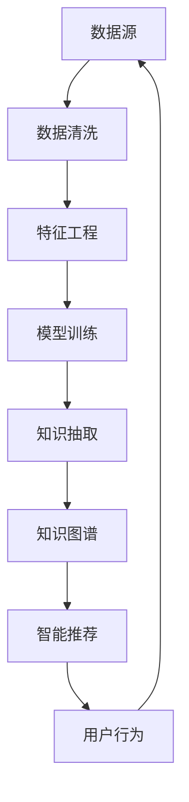

                 

# 知识发现引擎：人工智能时代的智慧伙伴

> 关键词：知识发现, 人工智能, 大数据, 机器学习, 自然语言处理(NLP), 推荐系统, 知识图谱, 深度学习

## 1. 背景介绍

### 1.1 问题由来

在信息爆炸的今天，人类每天面临海量的信息与数据，如何从中提取有用知识，成为科技公司与学术界亟需解决的问题。传统的数据分析方法往往需要高度专业知识和经验，难以快速推广应用。

随着人工智能技术的不断进步，知识发现引擎(Knowledge Discovery Engine, KDE)应运而生，成为人工智能时代的智慧伙伴。它以机器学习算法为核心，从海量数据中挖掘知识、提取模式，为人们提供精确的信息检索、知识推荐、智能决策支持等智能服务。

近年来，知识发现引擎的技术架构和应用场景不断丰富，逐步发展出数据挖掘、信息抽取、实体关系抽取、推荐系统、自然语言处理等多个技术方向，并在金融、医疗、电商、社交网络等众多行业得到广泛应用。

本文将从知识发现引擎的核心概念出发，探讨其在人工智能时代的意义与价值。通过对其原理、算法、应用场景等进行深入分析，希望能为知识发现引擎的实践提供有价值的参考。

## 2. 核心概念与联系

### 2.1 核心概念概述

知识发现引擎是指利用机器学习算法，自动从大规模数据中发现并提取知识、模式、规律的过程。其核心包括以下几个关键概念：

- **知识图谱(Knowledge Graph)**：一种用于表示实体及其之间关系的图形结构，用于存储和组织结构化知识。
- **自然语言处理(Natural Language Processing, NLP)**：使计算机理解、处理、生成人类自然语言的技术，如文本分类、命名实体识别、情感分析等。
- **推荐系统(Recommendation System)**：根据用户行为和物品属性，智能推荐最符合用户兴趣的物品或信息。
- **数据挖掘(Data Mining)**：从大规模数据中挖掘出有价值的模式、规则、关联等。

这些概念共同构成了知识发现引擎的基础架构，通过它们之间的紧密联系，实现对数据的高效处理与知识发现。

### 2.2 核心概念原理和架构的 Mermaid 流程图(Mermaid 流程节点中不要有括号、逗号等特殊字符)



以上流程图示意了知识发现引擎的核心工作流程：从数据源开始，通过数据清洗、特征工程、模型训练等步骤，抽取并存储知识，构建知识图谱，并最终实现智能推荐等功能。

## 3. 核心算法原理 & 具体操作步骤
### 3.1 算法原理概述

知识发现引擎的核心算法基于机器学习和数据挖掘技术。以知识图谱构建为例，主要算法包括：

- **知识抽取**：从文本、图像、音频等数据中抽取出实体及其关系。
- **实体关系抽取**：识别出文本中提及的实体及其关系，形成知识图谱中的节点和边。
- **图神经网络(Graph Neural Network, GNN)**：一种用于处理图结构数据（如知识图谱）的深度学习算法，通过消息传递机制学习节点和边的表示。

### 3.2 算法步骤详解

**步骤一：数据预处理**

- **数据收集**：从不同来源收集数据，如日志、文档、图片、社交网络数据等。
- **数据清洗**：去除噪声、无关数据，填补缺失值，标准化数据格式。

**步骤二：特征提取**

- **特征选择**：选择与任务相关的特征，如词频、TF-IDF、文本长度等。
- **特征变换**：进行特征缩放、归一化等处理，将特征转化为适合机器学习模型的输入。

**步骤三：模型训练**

- **选择模型**：根据任务需求选择合适的机器学习模型，如SVM、决策树、随机森林、深度学习等。
- **数据分割**：将数据集划分为训练集、验证集和测试集。
- **训练模型**：在训练集上训练模型，优化参数，避免过拟合。
- **验证评估**：在验证集上评估模型性能，调整模型参数。
- **测试预测**：在测试集上测试模型性能，预测新数据。

**步骤四：知识抽取**

- **实体识别**：从文本中识别出命名实体，如人名、地名、组织名等。
- **关系抽取**：识别出实体之间的语义关系，如“居住于”、“工作于”等。

**步骤五：知识图谱构建**

- **知识存储**：将抽取出的实体和关系存储在知识图谱中。
- **图神经网络训练**：使用图神经网络算法训练知识图谱，提升节点和边的表示能力。

**步骤六：智能推荐**

- **用户画像**：根据用户行为和属性构建用户画像。
- **物品匹配**：从知识图谱中获取与用户画像最相关的物品。
- **推荐算法**：使用协同过滤、矩阵分解等算法，推荐物品给用户。

### 3.3 算法优缺点

**优点**

- **高效自动化**：无需人工干预，自动化处理海量数据，提升效率。
- **精度高**：基于机器学习算法的知识抽取和推荐，具有较高的准确性和泛化能力。
- **应用广泛**：适用于多种应用场景，如智能客服、智能推荐、智能投顾等。

**缺点**

- **数据质量依赖**：知识抽取和推荐系统的效果很大程度上依赖于输入数据的准确性。
- **模型复杂**：深度学习模型往往具有较高的时间空间复杂度，需要高性能计算资源。
- **可解释性不足**：黑盒模型难以解释其内部工作机制和推理过程。

### 3.4 算法应用领域

知识发现引擎广泛应用于以下领域：

- **金融领域**：利用推荐系统和知识图谱，构建智能投顾、风险评估、信用评分等应用。
- **电商领域**：通过个性化推荐，提升用户购物体验和转化率。
- **医疗领域**：利用自然语言处理和知识抽取技术，提取病历信息，辅助医生诊断。
- **社交网络**：通过知识发现，发现用户之间的关系网络，提升社交互动质量。
- **新闻推荐**：从海量新闻中抽取信息，智能推荐给用户。
- **智能客服**：构建知识图谱，实现智能问答、智能推荐、情感分析等功能。

这些应用场景展示了知识发现引擎在各个领域中的强大潜力，为各行各业带来了新的发展机遇。

## 4. 数学模型和公式 & 详细讲解 & 举例说明

### 4.1 数学模型构建

知识发现引擎的核心数学模型包括知识图谱和推荐系统的模型。下面以推荐系统为例，介绍其主要数学模型和公式。

推荐系统基于协同过滤算法，利用用户行为数据和物品属性，预测用户对物品的评分或兴趣度，从而实现智能推荐。设用户集合为 $U$，物品集合为 $V$，用户对物品的评分矩阵为 $R \in \mathbb{R}^{n \times m}$，其中 $n$ 为用户数，$m$ 为物品数。推荐系统的目标是在评分矩阵 $R$ 上训练一个评分预测模型 $f_{\theta}$，使得对于任意用户 $u$ 和物品 $v$，有 $f_{\theta}(u,v) \approx R(u,v)$。

### 4.2 公式推导过程

假设推荐系统采用矩阵分解的算法，目标是最小化损失函数：

$$
\min_{\theta} \frac{1}{2N} \sum_{(u,v) \in U \times V} ||R_{uv} - f_{\theta}(u,v)||^2
$$

其中 $N$ 为样本数量，$||\cdot||$ 为欧几里得范数。通过求解上述优化问题，得到用户 $u$ 对物品 $v$ 的评分预测 $f_{\theta}(u,v)$。

### 4.3 案例分析与讲解

以协同过滤算法中的基于邻域的用户协同过滤为例，其步骤如下：

1. 计算用户 $u$ 的邻域 $N(u)$，即与 $u$ 有共同评分物品的用户集合。
2. 对 $N(u)$ 中的每个用户 $v$，计算 $v$ 的评分向量 $x_v$，$x_v$ 中的每个元素 $x_{vi}$ 表示 $v$ 对物品 $i$ 的评分。
3. 利用 $x_v$ 计算用户 $u$ 对物品 $v$ 的评分预测 $f_{\theta}(u,v)$，公式如下：

$$
f_{\theta}(u,v) = \sum_{i \in N(v)} x_{vi} R_{ui}
$$

其中 $R_{ui}$ 为已知评分。

## 5. 项目实践：代码实例和详细解释说明

### 5.1 开发环境搭建

- **Python环境**：使用Anaconda创建虚拟环境，安装必要的依赖库，如Pandas、NumPy、Scikit-learn、TensorFlow等。
- **数据集准备**：从公开数据集如Amazon商品评论数据、LastFM音乐评分数据等下载数据，并进行初步处理和清洗。

### 5.2 源代码详细实现

以下是一个基于TensorFlow的协同过滤推荐系统实现示例：

```python
import tensorflow as tf
import numpy as np

# 读取数据集
users, items, ratings = load_data()

# 构建用户-物品评分矩阵
R = np.array(ratings)

# 设置超参数
latent_dim = 10
learning_rate = 0.01
epochs = 100

# 定义模型
model = tf.keras.Sequential([
    tf.keras.layers.Dense(latent_dim, activation='relu', input_shape=(1,)),
    tf.keras.layers.Dense(1)
])

# 定义损失函数
def loss_fn(y_true, y_pred):
    return tf.reduce_mean(tf.square(y_true - y_pred))

# 编译模型
model.compile(optimizer=tf.keras.optimizers.Adam(learning_rate), loss=loss_fn)

# 训练模型
model.fit(np.array(R), R, epochs=epochs, batch_size=1024)

# 预测评分
user_index = 0
item_index = 1
user_ratings = model.predict(np.expand_dims(R[user_index], axis=0))[0]
predicted_item_score = user_ratings[item_index]
print(f"User {user_index} predicts item {item_index} with score {predicted_item_score}")
```

### 5.3 代码解读与分析

以上代码实现了一个简单的协同过滤推荐系统，通过矩阵分解算法对用户-物品评分矩阵进行模型训练和评分预测。具体解读如下：

- **数据准备**：从数据集加载用户、物品和评分，构建用户-物品评分矩阵。
- **模型定义**：使用TensorFlow构建一个简单的两层的神经网络，第一层使用ReLU激活函数，第二层输出评分预测。
- **损失函数**：使用均方误差作为损失函数，衡量预测评分与实际评分之间的差距。
- **模型编译**：设置优化器为Adam，指定损失函数。
- **模型训练**：使用训练集数据进行模型训练，并设置训练轮数和批次大小。
- **评分预测**：使用模型对新用户-物品组合进行评分预测，并输出结果。

### 5.4 运行结果展示

训练结束后，可以通过调用 `model.predict()` 函数对新用户-物品组合进行评分预测，输出预测评分结果。

## 6. 实际应用场景

### 6.1 金融领域

知识发现引擎在金融领域的应用非常广泛，如智能投顾、风险评估、信用评分等。例如，通过知识图谱和推荐系统，可以构建智能投顾系统，根据用户行为和市场数据，推荐合适的投资策略和产品，降低投资风险。

### 6.2 电商领域

电商领域可以利用知识发现引擎进行商品推荐、用户画像分析、智能客服等。例如，通过协同过滤算法，推荐系统可以为用户推荐与他们浏览和购买历史相似的商品，提升用户体验和转化率。

### 6.3 医疗领域

在医疗领域，知识发现引擎可以用于病历信息抽取、患者风险评估、诊断辅助等。例如，通过命名实体识别和关系抽取，可以从电子病历中抽取病人信息，辅助医生进行诊断和决策。

### 6.4 未来应用展望

未来，知识发现引擎将更加深入地融入各个行业，实现更加智能化的决策支持。例如：

- **智慧医疗**：利用知识图谱和推荐系统，实现医疗信息共享、智能诊断、个性化治疗。
- **智能城市**：通过智能推荐和大数据分析，优化交通、能源、环境等城市管理。
- **金融科技**：构建智能投顾、智能风控、智能合规等金融科技应用。
- **智能客服**：利用自然语言处理和知识抽取技术，提升客户服务质量。

## 7. 工具和资源推荐

### 7.1 学习资源推荐

- **《Python数据分析实战》**：介绍Python在数据预处理、特征工程、模型训练等方面的应用。
- **Coursera《机器学习》**：由斯坦福大学Andrew Ng教授主讲，涵盖机器学习基础和算法实现。
- **Kaggle竞赛平台**：提供大量开源数据集和竞赛任务，训练和验证知识发现算法的有效性。

### 7.2 开发工具推荐

- **Anaconda**：创建和管理虚拟环境，快速安装和更新依赖库。
- **TensorFlow**：深度学习框架，支持分布式计算和模型优化。
- **Pandas**：数据处理和分析工具，支持大规模数据集操作。
- **Scikit-learn**：机器学习库，提供多种经典算法的实现和评估。

### 7.3 相关论文推荐

- **SVM: Pattern Recognition and Ranking**：支持向量机算法，用于分类和回归任务。
- **Random Forest**：随机森林算法，用于特征选择和集成学习。
- **Deep Learning**：深度学习理论和技术，涵盖多层神经网络、卷积神经网络、循环神经网络等。

## 8. 总结：未来发展趋势与挑战

### 8.1 研究成果总结

知识发现引擎在人工智能领域取得了显著的成果，主要体现在以下几个方面：

1. **自动化处理**：通过机器学习算法，实现对海量数据的自动化处理，提升效率。
2. **智能推荐**：基于用户行为数据和物品属性，实现个性化推荐，提升用户体验。
3. **知识抽取**：从文本、图像、音频等数据中抽取出实体及其关系，构建知识图谱。
4. **多模态融合**：结合文本、图像、语音等多种模态数据，提升知识发现的效果。

### 8.2 未来发展趋势

未来知识发现引擎的发展趋势包括：

1. **多模态融合**：结合多种模态数据，提升知识发现的全面性和准确性。
2. **深度学习**：利用深度学习算法，提升知识抽取和推荐的精度。
3. **实时性**：通过增量学习等技术，实现知识发现的实时更新。
4. **可解释性**：引入可解释性算法，提高模型决策的透明度和可信度。

### 8.3 面临的挑战

知识发现引擎面临的挑战包括：

1. **数据质量**：知识抽取和推荐系统的效果很大程度上依赖于输入数据的准确性。
2. **模型复杂度**：深度学习模型往往具有较高的时间空间复杂度，需要高性能计算资源。
3. **可解释性**：黑盒模型难以解释其内部工作机制和推理过程。

### 8.4 研究展望

未来的研究可以在以下几个方向进行探索：

1. **多模态知识发现**：结合多种数据模态，提升知识发现的全面性和准确性。
2. **模型优化**：通过模型剪枝、量化等技术，降低知识发现引擎的计算资源消耗。
3. **智能决策**：结合领域知识，构建更加智能化的决策支持系统。

## 9. 附录：常见问题与解答

**Q1：知识发现引擎与数据挖掘有何不同？**

A: 知识发现引擎是基于机器学习和数据挖掘技术，自动从大规模数据中发现并提取知识、模式、规律的过程。与数据挖掘不同，知识发现引擎更加注重知识的表达、应用和理解，而数据挖掘主要关注数据的统计特征和模式。

**Q2：知识图谱的构建有哪些关键步骤？**

A: 知识图谱的构建主要包括实体识别、关系抽取和图神经网络训练三个步骤。实体识别通过命名实体识别和词性标注等技术，识别出文本中提及的实体；关系抽取通过句法分析、语义分析等技术，识别出实体之间的关系；图神经网络训练通过消息传递机制，学习节点和边的表示。

**Q3：协同过滤推荐算法有哪些优点和缺点？**

A: 协同过滤算法的优点是无需物品属性信息，适用于稀疏数据，能够处理用户兴趣的多样性。缺点是推荐结果依赖于用户的历史行为数据，难以处理冷启动问题，容易过拟合训练数据。

**Q4：知识发现引擎在医疗领域有哪些应用？**

A: 知识发现引擎在医疗领域可以用于病历信息抽取、患者风险评估、诊断辅助等。例如，通过命名实体识别和关系抽取，可以从电子病历中抽取病人信息，辅助医生进行诊断和决策。

**Q5：知识发现引擎的开发需要哪些关键技术？**

A: 知识发现引擎的开发需要掌握数据预处理、特征工程、模型训练、知识抽取、知识图谱构建、智能推荐等多种关键技术。此外，还需要熟悉相关领域的应用场景和实际需求。

---

作者：禅与计算机程序设计艺术 / Zen and the Art of Computer Programming

