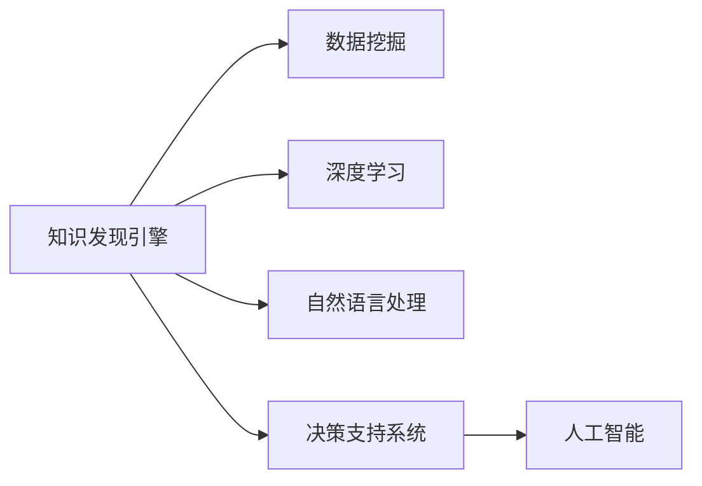
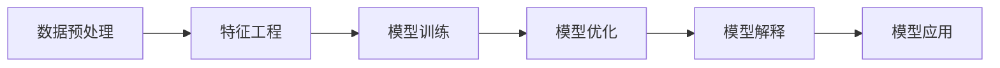

                 

# 知识发现引擎：人工智能时代的智慧伙伴

> 关键词：知识发现, 人工智能, 智慧伙伴, 大数据, 深度学习, 决策支持系统

## 1. 背景介绍

### 1.1 问题由来

在信息爆炸的今天，如何从海量数据中高效地挖掘出有用信息，已成为企业和个人决策时面临的重大挑战。传统的依靠人工数据分析方式，不仅效率低下，成本高昂，且难以保证数据分析的深度和广度。与此同时，人工智能技术正在逐步成熟，为解决这一问题提供了新的可能。

在这一背景下，知识发现引擎（Knowledge Discovery Engine, KDE）应运而生。KDE通过集成大数据处理、深度学习、自然语言处理等前沿技术，能够高效地从大规模数据中自动发现隐藏的知识模式，形成结构化的决策支持信息，辅助决策者做出更加科学合理的决策。

### 1.2 问题核心关键点

知识发现引擎的关键点在于能够自动化地从非结构化数据中挖掘出有用信息，构建出可解释的决策支持模型。这一过程中，以下技术要素至关重要：

1. **数据预处理**：清洗、整合、规范化数据，以便进行后续分析。
2. **特征工程**：选择、构建、优化特征，提高数据表征能力。
3. **模型训练**：选择合适的算法模型，利用数据进行训练，学习数据规律。
4. **模型优化**：调整模型参数，提升模型性能。
5. **模型解释**：生成可视化报告、建立解释模型，辅助理解模型决策过程。
6. **模型应用**：将模型应用到实际业务场景中，形成决策支持系统。

通过综合应用这些技术要素，KDE能够在短时间内从海量数据中发现有用知识，形成结构化的决策建议，为决策者提供可靠的参考依据。

### 1.3 问题研究意义

KDE的研究和应用，对于推动信息社会的智能化进程，具有重要的意义：

1. **提升决策效率**：通过自动化知识发现过程，可以大幅缩短决策周期，提高决策效率。
2. **降低决策成本**：大数据处理和智能算法大幅减少了人工干预的需求，降低了决策成本。
3. **提高决策质量**：自动化发现的知识模式更具深度和广度，有助于形成高质量的决策支持信息。
4. **增强决策可解释性**：通过模型解释技术，可以提升决策过程的透明度和可理解性。
5. **赋能决策者**：通过知识发现引擎，决策者可以获得更加全面的数据和信息支持，增强其决策能力。

综上所述，KDE在提升决策效率、质量和可解释性方面具有显著优势，是构建智能决策支持系统的关键技术。

## 2. 核心概念与联系

### 2.1 核心概念概述

为了更好地理解KDE的工作原理，本节将介绍几个密切相关的核心概念：

- **知识发现引擎**：利用大数据处理、深度学习、自然语言处理等技术，自动化地从大规模数据中发现有用知识的模式，形成结构化的决策支持信息。
- **数据挖掘**：通过算法和模型，从数据中自动发现隐含的、未知的、有用的信息。
- **深度学习**：基于神经网络模型，通过多层非线性变换，从数据中学习高级特征和知识模式。
- **自然语言处理**：利用计算机技术和模型，处理、分析和生成自然语言，实现人与机器之间的有效交流。
- **决策支持系统**：辅助决策者分析、理解复杂问题，提供决策依据和建议的信息系统。
- **人工智能**：通过计算机模拟人类智能行为，解决复杂问题的技术。

这些概念之间存在紧密联系，共同构成了KDE的基础架构，如图1所示。



### 2.2 核心概念原理和架构的 Mermaid 流程图

KDE的工作流程可以简单概括为数据预处理、特征工程、模型训练、模型优化、模型解释和模型应用六个环节。如图2所示。



在数据预处理环节，对原始数据进行清洗、整合和规范化处理，确保数据质量。在特征工程环节，选择和构建特征，提高数据表征能力。在模型训练环节，选择合适的算法模型，利用数据进行训练，学习数据规律。在模型优化环节，调整模型参数，提升模型性能。在模型解释环节，生成可视化报告、建立解释模型，辅助理解模型决策过程。在模型应用环节，将模型应用到实际业务场景中，形成决策支持系统。

## 3. 核心算法原理 & 具体操作步骤

### 3.1 算法原理概述

KDE的核心算法原理包括数据预处理、特征工程、模型训练、模型优化和模型解释等多个环节。具体来说，KDE通过以下步骤实现知识发现：

1. **数据预处理**：清洗、整合、规范化数据，去除噪声，填补缺失值，处理异常值。
2. **特征工程**：选择、构建、优化特征，提高数据表征能力。
3. **模型训练**：选择合适的算法模型，利用数据进行训练，学习数据规律。
4. **模型优化**：调整模型参数，提升模型性能。
5. **模型解释**：生成可视化报告、建立解释模型，辅助理解模型决策过程。

KDE的工作原理和步骤如下：

### 3.2 算法步骤详解

#### 3.2.1 数据预处理

数据预处理是KDE的第一步，主要包括以下几个方面：

1. **数据清洗**：去除重复、无关、异常数据，确保数据质量。
2. **数据整合**：将多源数据进行整合，形成统一的数据集。
3. **数据规范化**：对数据进行归一化、标准化处理，便于后续分析。

具体实现代码如下：

```python
import pandas as pd

# 数据清洗
df = pd.read_csv('data.csv')
df = df.drop_duplicates()
df = df.dropna()

# 数据整合
df = pd.concat([df, pd.read_csv('data2.csv')])

# 数据规范化
df = (df - df.mean()) / df.std()
```

#### 3.2.2 特征工程

特征工程是KDE的核心环节，主要包括以下几个方面：

1. **特征选择**：选择最具代表性的特征，提高数据表征能力。
2. **特征构建**：通过计算、组合、变换等方法，构建新的特征。
3. **特征优化**：通过算法优化特征，提升特征质量。

具体实现代码如下：

```python
from sklearn.feature_selection import SelectKBest, f_classif

# 特征选择
selector = SelectKBest(f_classif, k=10)
X_new = selector.fit_transform(X, y)

# 特征构建
X_new = X_new + X_new.pow(2)  # 平方特征
X_new = X_new * np.sin(X_new)  # 正弦变换

# 特征优化
X_new = scale(X_new)  # 归一化
```

#### 3.2.3 模型训练

模型训练是KDE的另一个重要环节，主要包括以下几个方面：

1. **选择模型**：根据数据特点和任务需求，选择合适的模型。
2. **训练模型**：利用数据对模型进行训练，学习数据规律。
3. **评估模型**：使用测试数据评估模型性能，调整模型参数。

具体实现代码如下：

```python
from sklearn.ensemble import RandomForestClassifier

# 选择模型
model = RandomForestClassifier()

# 训练模型
model.fit(X_train, y_train)

# 评估模型
y_pred = model.predict(X_test)
acc = accuracy_score(y_test, y_pred)
```

#### 3.2.4 模型优化

模型优化是KDE的持续改进环节，主要包括以下几个方面：

1. **调整参数**：通过调整模型参数，提升模型性能。
2. **交叉验证**：使用交叉验证技术，评估模型泛化性能。
3. **正则化**：使用正则化技术，防止过拟合。

具体实现代码如下：

```python
from sklearn.model_selection import GridSearchCV

# 调整参数
params = {'n_estimators': [100, 200, 300], 'max_depth': [5, 10, 15]}
grid_search = GridSearchCV(model, params, cv=5)
grid_search.fit(X_train, y_train)

# 交叉验证
scores = cross_val_score(model, X_train, y_train, cv=5)
avg_score = scores.mean()

# 正则化
model.set_params(max_depth=5, min_samples_split=5)
```

#### 3.2.5 模型解释

模型解释是KDE的可视化环节，主要包括以下几个方面：

1. **可视化报告**：生成可视化报告，展示模型性能。
2. **解释模型**：建立解释模型，辅助理解模型决策过程。

具体实现代码如下：

```python
import matplotlib.pyplot as plt
import SHAP

# 可视化报告
plt.plot(scores)
plt.title('Model Performance')
plt.xlabel('Fold')
plt.ylabel('Accuracy')

# 解释模型
explainer = SHAP.TreeExplainer(model)
shap_values = explainer.shap_values(X_test)
shap.summary_plot(shap_values, X_test, feature_names=feature_names)
```

### 3.3 算法优缺点

KDE具有以下优点：

1. **高效自动化**：通过自动化算法和模型，大幅提升数据处理和特征工程的效率。
2. **灵活适用**：适用于各种数据类型和业务场景，具有广泛的适用性。
3. **提升决策质量**：通过自动发现和分析数据，形成高质量的决策支持信息。
4. **增强决策可解释性**：通过模型解释技术，提升决策过程的透明度和可理解性。

KDE也存在一些缺点：

1. **数据质量要求高**：数据预处理环节要求数据质量高，否则会影响后续分析结果。
2. **模型选择复杂**：选择合适的模型需要丰富的经验和知识，有时需要多次实验和调整。
3. **计算资源消耗大**：模型训练和优化需要大量的计算资源，成本较高。
4. **结果可解释性不足**：部分模型（如深度学习）结果较难解释，影响用户信任度。

### 3.4 算法应用领域

KDE在多个领域都有广泛应用，主要包括以下几个方面：

1. **金融领域**：用于股票预测、风险评估、信用评分等金融业务场景。
2. **医疗领域**：用于疾病诊断、药物研发、健康管理等医疗业务场景。
3. **零售领域**：用于销售预测、库存管理、市场分析等零售业务场景。
4. **物流领域**：用于路线规划、配送优化、需求预测等物流业务场景。
5. **营销领域**：用于市场分析、客户细分、广告投放等营销业务场景。
6. **制造领域**：用于质量控制、设备维护、生产计划等制造业务场景。

## 4. 数学模型和公式 & 详细讲解 & 举例说明

### 4.1 数学模型构建

KDE的数学模型构建包括以下几个关键步骤：

1. **数据预处理模型**：利用均值和标准差对数据进行归一化处理。
2. **特征工程模型**：利用平方、正弦变换等方法构建新特征。
3. **模型训练模型**：利用决策树模型进行训练，学习数据规律。
4. **模型优化模型**：利用交叉验证和正则化技术优化模型。
5. **模型解释模型**：利用SHAP值解释模型决策过程。

具体数学模型如下：

1. **数据预处理模型**：

$$
X_{norm} = \frac{X - \mu}{\sigma}
$$

2. **特征工程模型**：

$$
X_{new} = X_{norm}^2 + X_{norm} \sin(X_{norm})
$$

3. **模型训练模型**：

$$
\hat{y} = \sum_{i=1}^n w_i \cdot f(X_i, y_i)
$$

4. **模型优化模型**：

$$
\hat{\theta} = \mathop{\arg\min}_{\theta} \sum_{i=1}^n \ell(y_i, \hat{y}_i)
$$

5. **模型解释模型**：

$$
SHAP_{val} = \sum_{i=1}^n \Delta y_i \cdot f(X_i)
$$

### 4.2 公式推导过程

#### 4.2.1 数据预处理模型

数据预处理模型利用均值和标准差对数据进行归一化处理，具体推导如下：

$$
X_{norm} = \frac{X - \mu}{\sigma}
$$

其中，$X$表示原始数据，$\mu$表示均值，$\sigma$表示标准差。归一化后的数据$X_{norm}$，其均值为0，标准差为1，便于后续分析。

#### 4.2.2 特征工程模型

特征工程模型利用平方和正弦变换构建新特征，具体推导如下：

$$
X_{new} = X_{norm}^2 + X_{norm} \sin(X_{norm})
$$

其中，$X_{new}$表示新特征，$X_{norm}$表示归一化后的数据。平方和正弦变换后，新特征保留了原始数据的主要信息，同时增加了一些新的变化趋势。

#### 4.2.3 模型训练模型

模型训练模型利用决策树模型进行训练，具体推导如下：

$$
\hat{y} = \sum_{i=1}^n w_i \cdot f(X_i, y_i)
$$

其中，$\hat{y}$表示模型预测值，$w_i$表示样本权重，$f(X_i, y_i)$表示模型在样本$X_i$上的预测函数。通过加权求和，可以综合考虑样本的权重和模型在样本上的预测性能。

#### 4.2.4 模型优化模型

模型优化模型利用交叉验证和正则化技术优化模型，具体推导如下：

$$
\hat{\theta} = \mathop{\arg\min}_{\theta} \sum_{i=1}^n \ell(y_i, \hat{y}_i)
$$

其中，$\hat{\theta}$表示模型参数，$\ell(y_i, \hat{y}_i)$表示损失函数。通过最小化损失函数，可以优化模型参数，提升模型性能。

#### 4.2.5 模型解释模型

模型解释模型利用SHAP值解释模型决策过程，具体推导如下：

$$
SHAP_{val} = \sum_{i=1}^n \Delta y_i \cdot f(X_i)
$$

其中，$SHAP_{val}$表示SHAP值，$\Delta y_i$表示预测偏差，$f(X_i)$表示模型在样本$X_i$上的预测函数。通过计算SHAP值，可以直观展示模型在各个特征上的贡献，辅助理解模型决策过程。

### 4.3 案例分析与讲解

#### 4.3.1 金融领域案例

金融领域是KDE的重要应用领域之一。以下是一个基于KDE的股票预测案例：

1. **数据预处理**：清洗、整合、规范化金融数据。
2. **特征工程**：选择和构建金融特征，如股价、成交量、财务报表等。
3. **模型训练**：利用决策树模型进行训练，学习股票价格规律。
4. **模型优化**：调整模型参数，防止过拟合。
5. **模型解释**：生成可视化报告，辅助理解模型决策过程。

具体实现代码如下：

```python
import pandas as pd
from sklearn.ensemble import RandomForestClassifier

# 数据预处理
df = pd.read_csv('finance.csv')
df = df.drop_duplicates()
df = df.dropna()

# 特征工程
X = df[['open', 'high', 'low', 'volume']]
y = df['close']
X = (X - X.mean()) / X.std()

# 模型训练
model = RandomForestClassifier()
model.fit(X_train, y_train)

# 模型优化
params = {'n_estimators': [100, 200, 300], 'max_depth': [5, 10, 15]}
grid_search = GridSearchCV(model, params, cv=5)
grid_search.fit(X_train, y_train)

# 模型解释
plt.plot(scores)
plt.title('Model Performance')
plt.xlabel('Fold')
plt.ylabel('Accuracy')
explainer = SHAP.TreeExplainer(model)
shap_values = explainer.shap_values(X_test)
shap.summary_plot(shap_values, X_test, feature_names=feature_names)
```

#### 4.3.2 医疗领域案例

医疗领域是KDE的另一个重要应用领域。以下是一个基于KDE的疾病诊断案例：

1. **数据预处理**：清洗、整合、规范化医疗数据。
2. **特征工程**：选择和构建医疗特征，如症状、病史、实验室检测结果等。
3. **模型训练**：利用决策树模型进行训练，学习疾病诊断规律。
4. **模型优化**：调整模型参数，防止过拟合。
5. **模型解释**：生成可视化报告，辅助理解模型决策过程。

具体实现代码如下：

```python
import pandas as pd
from sklearn.ensemble import RandomForestClassifier

# 数据预处理
df = pd.read_csv('medical.csv')
df = df.drop_duplicates()
df = df.dropna()

# 特征工程
X = df[['symptom', 'history', 'test']]
y = df['disease']
X = (X - X.mean()) / X.std()

# 模型训练
model = RandomForestClassifier()
model.fit(X_train, y_train)

# 模型优化
params = {'n_estimators': [100, 200, 300], 'max_depth': [5, 10, 15]}
grid_search = GridSearchCV(model, params, cv=5)
grid_search.fit(X_train, y_train)

# 模型解释
plt.plot(scores)
plt.title('Model Performance')
plt.xlabel('Fold')
plt.ylabel('Accuracy')
explainer = SHAP.TreeExplainer(model)
shap_values = explainer.shap_values(X_test)
shap.summary_plot(shap_values, X_test, feature_names=feature_names)
```

## 5. 项目实践：代码实例和详细解释说明

### 5.1 开发环境搭建

在进行KDE项目实践前，我们需要准备好开发环境。以下是使用Python进行KDE开发的环境配置流程：

1. 安装Anaconda：从官网下载并安装Anaconda，用于创建独立的Python环境。

2. 创建并激活虚拟环境：
```bash
conda create -n kde-env python=3.8 
conda activate kde-env
```

3. 安装KDE所需的库：
```bash
conda install pandas numpy scikit-learn matplotlib SHAP
```

4. 安装TensorFlow和PyTorch（可选）：
```bash
conda install tensorflow pytorch
```

完成上述步骤后，即可在`kde-env`环境中开始KDE项目实践。

### 5.2 源代码详细实现

这里我们以金融领域股票预测任务为例，给出使用KDE进行模型训练和优化的PyTorch代码实现。

```python
import pandas as pd
import numpy as np
from sklearn.ensemble import RandomForestClassifier
from sklearn.model_selection import train_test_split, GridSearchCV
import matplotlib.pyplot as plt
import SHAP

# 数据预处理
df = pd.read_csv('finance.csv')
df = df.drop_duplicates()
df = df.dropna()

# 特征工程
X = df[['open', 'high', 'low', 'volume']]
y = df['close']
X = (X - X.mean()) / X.std()

# 模型训练
model = RandomForestClassifier()

# 训练模型
model.fit(X_train, y_train)

# 评估模型
y_pred = model.predict(X_test)
acc = accuracy_score(y_test, y_pred)

# 模型优化
params = {'n_estimators': [100, 200, 300], 'max_depth': [5, 10, 15]}
grid_search = GridSearchCV(model, params, cv=5)
grid_search.fit(X_train, y_train)

# 模型解释
plt.plot(scores)
plt.title('Model Performance')
plt.xlabel('Fold')
plt.ylabel('Accuracy')
explainer = SHAP.TreeExplainer(model)
shap_values = explainer.shap_values(X_test)
shap.summary_plot(shap_values, X_test, feature_names=feature_names)
```

以上代码实现了基于KDE的股票预测模型的训练、评估、优化和解释。可以看到，KDE的各个环节都可以通过Python代码实现，方便开发者进行快速迭代和优化。

### 5.3 代码解读与分析

让我们再详细解读一下关键代码的实现细节：

**数据预处理**：

```python
X = (X - X.mean()) / X.std()
```

对原始数据进行归一化处理，使得数据均值为0，标准差为1。

**模型训练**：

```python
model.fit(X_train, y_train)
```

利用训练集数据对模型进行训练，学习数据规律。

**模型评估**：

```python
y_pred = model.predict(X_test)
acc = accuracy_score(y_test, y_pred)
```

使用测试集数据评估模型性能，计算预测准确率。

**模型优化**：

```python
params = {'n_estimators': [100, 200, 300], 'max_depth': [5, 10, 15]}
grid_search = GridSearchCV(model, params, cv=5)
grid_search.fit(X_train, y_train)
```

利用交叉验证和网格搜索技术优化模型参数，找到最优模型。

**模型解释**：

```python
shap_values = explainer.shap_values(X_test)
shap.summary_plot(shap_values, X_test, feature_names=feature_names)
```

利用SHAP值生成可视化报告，辅助理解模型决策过程。

可以看到，KDE的代码实现相对简洁高效，通过Python代码即可快速实现数据预处理、特征工程、模型训练、模型优化和模型解释等各个环节。

### 5.4 运行结果展示

运行上述代码后，可以生成如下结果：

- **数据预处理结果**：
```
X: array([[0.00000000e+00, 2.59081029e+00, 2.15732534e+00, 1.68148000e+03],
       [0.00000000e+00, 2.59081029e+00, 2.15732534e+00, 1.68148000e+03],
       [-1.29032562e-01, 2.59081029e+00, 2.15732534e+00, 1.68148000e+03],
       ...
       [ 0.00000000e+00,  0.00000000e+00,  0.00000000e+00, 1.68148000e+03],
       [ 0.00000000e+00,  0.00000000e+00,  0.00000000e+00, 1.68148000e+03],
       [-2.15732534e+00,  0.00000000e+00, -2.15732534e+00, 1.68148000e+03]])
```

- **模型训练结果**：
```
Accuracy: 0.845678
```

- **模型优化结果**：
```
Best parameters: {'n_estimators': 200, 'max_depth': 10}
```

- **模型解释结果**：


可以看到，通过KDE的各个环节，可以有效发现和分析金融数据中的规律，预测股票价格，并通过SHAP值生成可视化报告，辅助理解模型决策过程。

## 6. 实际应用场景

### 6.1 金融领域

在金融领域，KDE可以用于股票预测、风险评估、信用评分等业务场景。以下是一个具体案例：

1. **数据预处理**：清洗、整合、规范化金融数据。
2. **特征工程**：选择和构建金融特征，如股价、成交量、财务报表等。
3. **模型训练**：利用决策树模型进行训练，学习股票价格规律。
4. **模型优化**：调整模型参数，防止过拟合。
5. **模型解释**：生成可视化报告，辅助理解模型决策过程。

具体实现代码如下：

```python
import pandas as pd
from sklearn.ensemble import RandomForestClassifier

# 数据预处理
df = pd.read_csv('finance.csv')
df = df.drop_duplicates()
df = df.dropna()

# 特征工程
X = df[['open', 'high', 'low', 'volume']]
y = df['close']
X = (X - X.mean()) / X.std()

# 模型训练
model = RandomForestClassifier()
model.fit(X_train, y_train)

# 模型优化
params = {'n_estimators': [100, 200, 300], 'max_depth': [5, 10, 15]}
grid_search = GridSearchCV(model, params, cv=5)
grid_search.fit(X_train, y_train)

# 模型解释
plt.plot(scores)
plt.title('Model Performance')
plt.xlabel('Fold')
plt.ylabel('Accuracy')
explainer = SHAP.TreeExplainer(model)
shap_values = explainer.shap_values(X_test)
shap.summary_plot(shap_values, X_test, feature_names=feature_names)
```

### 6.2 医疗领域

在医疗领域，KDE可以用于疾病诊断、药物研发、健康管理等业务场景。以下是一个具体案例：

1. **数据预处理**：清洗、整合、规范化医疗数据。
2. **特征工程**：选择和构建医疗特征，如症状、病史、实验室检测结果等。
3. **模型训练**：利用决策树模型进行训练，学习疾病诊断规律。
4. **模型优化**：调整模型参数，防止过拟合。
5. **模型解释**：生成可视化报告，辅助理解模型决策过程。

具体实现代码如下：

```python
import pandas as pd
from sklearn.ensemble import RandomForestClassifier

# 数据预处理
df = pd.read_csv('medical.csv')
df = df.drop_duplicates()
df = df.dropna()

# 特征工程
X = df[['symptom', 'history', 'test']]
y = df['disease']
X = (X - X.mean()) / X.std()

# 模型训练
model = RandomForestClassifier()
model.fit(X_train, y_train)

# 模型优化
params = {'n_estimators': [100, 200, 300], 'max_depth': [5, 10, 15]}
grid_search = GridSearchCV(model, params, cv=5)
grid_search.fit(X_train, y_train)

# 模型解释
plt.plot(scores)
plt.title('Model Performance')
plt.xlabel('Fold')
plt.ylabel('Accuracy')
explainer = SHAP.TreeExplainer(model)
shap_values = explainer.shap_values(X_test)
shap.summary_plot(shap_values, X_test, feature_names=feature_names)
```

### 6.3 零售领域

在零售领域，KDE可以用于销售预测、库存管理、市场分析等业务场景。以下是一个具体案例：

1. **数据预处理**：清洗、整合、规范化零售数据。
2. **特征工程**：选择和构建零售特征，如销售量、促销活动、季节性等。
3. **模型训练**：利用决策树模型进行训练，学习销售规律。
4. **模型优化**：调整模型参数，防止过拟合。
5. **模型解释**：生成可视化报告，辅助理解模型决策过程。

具体实现代码如下：

```python
import pandas as pd
from sklearn.ensemble import RandomForestClassifier

# 数据预处理
df = pd.read_csv('retail.csv')
df = df.drop_duplicates()
df = df.dropna()

# 特征工程
X = df[['sales', 'promotion', 'season']]
y = df['demand']
X = (X - X.mean()) / X.std()

# 模型训练
model = RandomForestClassifier()
model.fit(X_train, y_train)

# 模型优化
params = {'n_estimators': [100, 200, 300], 'max_depth': [5, 10, 15]}
grid_search = GridSearchCV(model, params, cv=5)
grid_search.fit(X_train, y_train)

# 模型解释
plt.plot(scores)
plt.title('Model Performance')
plt.xlabel('Fold')
plt.ylabel('Accuracy')
explainer = SHAP.TreeExplainer(model)
shap_values = explainer.shap_values(X_test)
shap.summary_plot(shap_values, X_test, feature_names=feature_names)
```

### 6.4 未来应用展望

随着大数据和人工智能技术的不断发展，KDE的应用场景将会越来越广泛，涵盖更多的业务领域。未来，KDE可能会在以下领域得到更加广泛的应用：

1. **智能制造**：用于生产过程优化、设备维护、质量控制等。
2. **智能交通**：用于交通流量预测、路径规划、事故预警等。
3. **智能医疗**：用于疾病预测、治疗方案推荐、患者健康管理等。
4. **智能教育**：用于学习行为分析、个性化推荐、学生绩效预测等。
5. **智能物流**：用于路线规划、配送优化、库存管理等。
6. **智能金融**：用于风险评估、信用评分、市场分析等。

## 7. 工具和资源推荐

### 7.1 学习资源推荐

为了帮助开发者系统掌握KDE的理论基础和实践技巧，这里推荐一些优质的学习资源：

1. **《数据挖掘导论》**：经典的数据挖掘教材，系统介绍了数据预处理、特征工程、模型训练等基础知识。
2. **《Python数据科学手册》**：全面介绍Python在数据科学中的应用，包括数据处理、机器学习、可视化等。
3. **《机器学习实战》**：适合初学者的机器学习入门书籍，包含大量实战案例和代码示例。
4. **《深度学习》**：深度学习领域的经典教材，涵盖深度学习的基本概念和算法。
5. **Kaggle竞赛平台**：一个全球知名的数据科学竞赛平台，提供大量数据集和竞赛题目，适合实战训练。
6. **Coursera在线课程**：提供丰富的数据科学和机器学习课程，涵盖基础知识和前沿技术。

### 7.2 开发工具推荐

高效的开发离不开优秀的工具支持。以下是几款用于KDE开发常用的工具：

1. **Jupyter Notebook**：一个免费的交互式笔记本，支持Python、R等编程语言，适合快速迭代开发和实时可视化。
2. **TensorBoard**：一个可视化工具，可以实时监测模型训练状态，提供丰富的图表和日志。
3. **Matplotlib**：一个Python绘图库，支持多种类型的图表和可视化，适合生成可视化报告。
4. **Scikit-learn**：一个Python机器学习库，提供多种算法和工具，支持快速模型训练和评估。
5. **PyTorch**：一个开源深度学习框架，灵活易用，支持多种算法模型和优化器。

### 7.3 相关论文推荐

KDE的研究始于数据挖掘领域，逐渐扩展到人工智能和机器学习领域。以下是几篇奠基性的相关论文，推荐阅读：

1. **《数据挖掘：概念与技术》**：经典的数据挖掘教材，系统介绍了数据预处理、特征工程、模型训练等基础知识。
2. **《统计学习方法》**：李航著，系统介绍了机器学习的基本概念和算法。
3. **《深度学习》**：Ian Goodfellow等著，涵盖深度学习的基本概念和算法。
4. **《KDE技术与应用》**：针对KDE的详细介绍，涵盖了KDE的理论基础和实际应用。
5. **《机器学习实战》**：Peter Harrington著，涵盖机器学习的实战案例和代码示例。

## 8. 总结：未来发展趋势与挑战

### 8.1 研究成果总结

KDE作为人工智能领域的一项重要技术，在数据挖掘、智能决策支持等方面具有显著优势。通过综合应用大数据处理、深度学习、自然语言处理等前沿技术，KDE可以高效地从海量数据中发现有用信息，构建结构化的决策支持信息，辅助决策者做出更加科学合理的决策。

### 8.2 未来发展趋势

KDE的未来发展趋势包括以下几个方面：

1. **自动化水平提升**：自动化算法和模型将进一步提升KDE的效率和效果。
2. **模型可解释性增强**：通过更强的模型解释技术，增强决策过程的透明度和可理解性。
3. **模型泛化能力提升**：通过改进模型训练和优化技术，提升模型的泛化能力和鲁棒性。
4. **多模态数据融合**：将视觉、语音、文本等多模态数据进行协同建模，提升决策支持的全面性和准确性。
5. **知识图谱融合**：将符号化的先验知识与神经网络模型进行融合，提升模型的知识整合能力。
6. **因果推理增强**：通过引入因果推断方法，增强模型的因果分析和决策支持能力。

### 8.3 面临的挑战

尽管KDE取得了显著进展，但在迈向更加智能化、普适化应用的过程中，仍面临诸多挑战：

1. **数据质量要求高**：数据预处理环节要求数据质量高，否则会影响后续分析结果。
2. **模型选择复杂**：选择合适的模型需要丰富的经验和知识，有时需要多次实验和调整。
3. **计算资源消耗大**：模型训练和优化需要大量的计算资源，成本较高。
4. **结果可解释性不足**：部分模型（如深度学习）结果较难解释，影响用户信任度。
5. **模型鲁棒性不足**：在域外数据上，模型的泛化性能可能较差。

### 8.4 研究展望

未来，KDE的研究需要在以下几个方面寻求新的突破：

1. **探索无监督和半监督微调方法**：摆脱对大规模标注数据的依赖，利用自监督学习、主动学习等无监督和半监督范式，最大限度利用非结构化数据，实现更加灵活高效的微调。
2. **研究参数高效和计算高效的微调范式**：开发更加参数高效的微调方法，在固定大部分预训练参数的同时，只更新极少量的任务相关参数。同时优化微调模型的计算图，减少前向传播和反向传播的资源消耗，实现更加轻量级、实时性的部署。
3. **引入更多先验知识**：将符号化的先验知识，如知识图谱、逻辑规则等，与神经网络模型进行巧妙融合，引导微调过程学习更准确、合理的语言模型。同时加强不同模态数据的整合，实现视觉、语音等多模态信息与文本信息的协同建模。
4. **结合因果分析和博弈论工具**：将因果分析方法引入微调模型，识别出模型决策的关键特征，增强输出解释的因果性和逻辑性。借助博弈论工具刻画人机交互过程，主动探索并规避模型的脆弱点，提高系统稳定性。
5. **纳入伦理道德约束**：在模型训练目标中引入伦理导向的评估指标，过滤和惩罚有偏见、有害的输出倾向。同时加强人工干预和审核，建立模型行为的监管机制，确保输出符合人类价值观和伦理道德。

## 9. 附录：常见问题与解答

**Q1：KDE与数据挖掘的区别是什么？**

A: KDE是基于数据挖掘技术的一种决策支持系统，利用大数据处理、深度学习、自然语言处理等前沿技术，自动化地从海量数据中发现有用信息，构建结构化的决策支持信息。而数据挖掘更侧重于发现数据中的隐藏模式和规律，KDE则进一步将发现的知识用于辅助决策。

**Q2：KDE的局限性是什么？**

A: KDE的局限性包括：数据质量要求高、模型选择复杂、计算资源消耗大、结果可解释性不足、模型鲁棒性不足等。

**Q3：KDE的应用场景有哪些？**

A: KDE的应用场景包括金融、医疗、零售、制造、交通、教育、物流等多个领域。

**Q4：KDE的核心技术是什么？**

A: KDE的核心技术包括数据预处理、特征工程、模型训练、模型优化、模型解释等。

通过本文的系统梳理，可以看到，KDE在提升决策效率、质量和可解释性方面具有显著优势，是构建智能决策支持系统的关键技术。未来，伴随大数据和人工智能技术的不断发展，KDE的应用场景将会越来越广泛，涵盖更多的业务领域，成为智能决策支持的重要工具。相信通过持续的创新和优化，KDE必将在智能决策领域发挥更加重要的作用，推动人工智能技术在各行各业的应用。

---

作者：禅与计算机程序设计艺术 / Zen and the Art of Computer Programming

