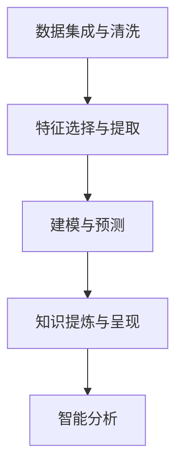

                 

# 知识发现引擎：信息时代的智慧之钥

> 关键词：知识发现, 信息提取, 智能分析, 数据挖掘, 大数据, 智慧系统

## 1. 背景介绍

### 1.1 问题由来

随着信息时代的来临，全球数据的量级和种类不断增长，如何从海量数据中提取有用信息，转化为知识，成为各行各业的重要课题。在企业决策、科学探索、商业智能等多个领域，对知识发现（Knowledge Discovery, KD）的需求日益迫切。传统的依靠人工手动提取和总结的方式，已经难以满足快速变化的信息需求。

知识发现引擎（Knowledge Discovery Engine, KDE）应运而生，成为了信息时代的智慧之钥。它通过自动化地从大规模数据集中挖掘、筛选和提炼知识，为组织和个人提供基于数据的洞察和建议，推动了智能决策和智慧系统的构建。

### 1.2 问题核心关键点

知识发现引擎的核心在于其自动化的数据处理和智能分析能力。通过预处理数据、选择特征、构建模型，自动化地发现数据中潜在的模式和规律，将数据转化为知识，支持决策和优化。主要关键点包括：

- 数据集成与清洗：从多源异构数据中提取并清洗有效信息，构建统一的数据集。
- 特征选择与提取：从原始数据中自动选择和提取最相关的特征，构建特征空间。
- 建模与预测：构建并训练机器学习模型，预测未来趋势和行为。
- 知识提炼与呈现：从模型输出中提炼知识，并以可视化的形式呈现给用户。

## 2. 核心概念与联系

### 2.1 核心概念概述

知识发现引擎涉及诸多核心概念，主要包括：

- 数据挖掘（Data Mining）：从数据中自动发现并提炼有用的信息和模式。
- 机器学习（Machine Learning）：利用数据训练模型，预测未来行为。
- 自然语言处理（Natural Language Processing, NLP）：处理文本数据，提取语义信息。
- 数据可视化（Data Visualization）：将知识以图形化的方式展现，帮助用户理解。
- 模式识别（Pattern Recognition）：识别数据中的模式和规律。
- 智能分析（Smart Analysis）：结合领域知识，进行深度分析。

这些概念之间通过数据处理和知识提炼的逻辑链条联系起来，构建了知识发现引擎的完整框架。

### 2.2 核心概念原理和架构的 Mermaid 流程图



这个流程图展示了知识发现引擎的核心流程。数据经过清洗和特征提取后，构建机器学习模型进行预测。模型输出再经过提炼和可视化，最终用于辅助决策和分析。

## 3. 核心算法原理 & 具体操作步骤

### 3.1 算法原理概述

知识发现引擎的核心算法原理主要基于数据挖掘和机器学习的理论基础。通过自动化处理和智能分析，从数据中提炼出有用的知识。核心流程包括数据预处理、特征工程、模型选择、知识提炼等步骤。

### 3.2 算法步骤详解

知识发现引擎的算法步骤如下：

**Step 1: 数据预处理**
- 数据清洗：去除噪声、重复和异常值。
- 数据集成：从多个数据源提取并融合数据。
- 数据转换：对数据进行归一化、编码等操作。

**Step 2: 特征工程**
- 特征提取：从原始数据中提取最相关的特征。
- 特征选择：选择对预测目标影响最大的特征。
- 特征变换：对特征进行编码、降维等操作。

**Step 3: 建模与预测**
- 模型选择：选择最适合问题的机器学习算法。
- 模型训练：利用训练数据训练模型。
- 模型评估：在测试数据集上评估模型性能。

**Step 4: 知识提炼与呈现**
- 提炼知识：从模型输出中提炼出关键信息和模式。
- 可视化呈现：以图表、报告等形式将知识呈现给用户。
- 反馈迭代：根据用户反馈调整模型和特征。

### 3.3 算法优缺点

知识发现引擎具有以下优点：
1. 自动化处理：自动清洗、提取和转换数据，提升处理效率。
2. 智能化分析：利用机器学习进行智能预测和模式识别，提高分析深度。
3. 多源数据融合：融合多源异构数据，提高数据代表性。
4. 知识提炼：将复杂数据转化为可理解的知识，支持决策。

同时，也存在一些局限性：
1. 数据依赖：高度依赖数据质量，需要高质量的数据源。
2. 算法复杂：需要选择合适的模型和算法，有时需进行多次调试。
3. 过度拟合：在特征选择和模型构建过程中，容易出现过度拟合。
4. 解释困难：机器学习模型的预测结果缺乏可解释性。
5. 隐私问题：处理敏感数据时，需要考虑隐私保护和数据安全。

### 3.4 算法应用领域

知识发现引擎的应用领域非常广泛，涵盖了各个行业：

- 金融领域：用于信用评分、风险管理、市场预测等。
- 医疗领域：用于疾病预测、患者诊断、药物研发等。
- 零售行业：用于销售预测、库存管理、客户分析等。
- 制造业：用于故障预测、供应链优化、产品设计等。
- 公共安全：用于犯罪预测、情报分析、灾害预警等。
- 科学研究：用于科学数据挖掘、知识图谱构建等。

## 4. 数学模型和公式 & 详细讲解 & 举例说明

### 4.1 数学模型构建

知识发现引擎的数学模型主要涉及数据预处理、特征选择、模型构建和知识提炼等多个环节。

**数据预处理**：
- 数据清洗：去除噪声、重复和异常值，保留有效数据。
- 数据集成：将多源数据合并，构建统一的数据集。
- 数据转换：对数据进行归一化、编码等操作。

**特征选择与提取**：
- 特征提取：从原始数据中提取最相关的特征。
- 特征选择：选择对预测目标影响最大的特征。
- 特征变换：对特征进行编码、降维等操作。

**建模与预测**：
- 模型选择：选择最适合问题的机器学习算法。
- 模型训练：利用训练数据训练模型。
- 模型评估：在测试数据集上评估模型性能。

**知识提炼与呈现**：
- 提炼知识：从模型输出中提炼出关键信息和模式。
- 可视化呈现：以图表、报告等形式将知识呈现给用户。
- 反馈迭代：根据用户反馈调整模型和特征。

### 4.2 公式推导过程

以线性回归模型为例，推导其数学表达式和公式：

设训练数据集为 $(x_i, y_i), i=1, ..., N$，其中 $x_i \in \mathbb{R}^d$ 为输入向量，$y_i \in \mathbb{R}$ 为输出向量。假设模型为线性回归形式 $y_i = \theta_0 + \sum_{j=1}^d \theta_j x_{ij}$，其中 $\theta = (\theta_0, \theta_1, ..., \theta_d)$ 为模型参数。

最小二乘法用于拟合数据，目标是使得预测值与真实值之间的差距最小，即最小化损失函数 $L(\theta) = \frac{1}{2N} \sum_{i=1}^N (y_i - (\theta_0 + \sum_{j=1}^d \theta_j x_{ij})^2$。

求解 $\theta$ 的最小化问题，即求解如下方程组：

$$
\left\{
\begin{aligned}
&\frac{\partial L(\theta)}{\partial \theta_0} = 0 \\
&\frac{\partial L(\theta)}{\partial \theta_j} = 0, \quad j=1,...,d
\end{aligned}
\right.
$$

解得 $\theta = (X^TX)^{-1}X^Ty$，其中 $X = [x_1^T, ..., x_N^T]$ 为数据矩阵，$y = [y_1, ..., y_N]^T$ 为标签向量。

### 4.3 案例分析与讲解

**案例分析：客户流失预测**

某电商网站希望预测客户的流失情况，以便采取相应措施进行挽留。公司收集了用户的购买历史、浏览记录、反馈评分等数据，共计10万条记录。

**数据预处理**：
- 数据清洗：去除异常值和重复记录。
- 数据集成：将来自不同渠道的数据合并，形成统一的数据集。
- 数据转换：对购买金额、评分等非数值型数据进行编码。

**特征选择与提取**：
- 特征提取：选择购买次数、浏览时长、评分等特征。
- 特征选择：使用信息增益等方法筛选特征。
- 特征变换：对特征进行标准化处理。

**建模与预测**：
- 模型选择：选择逻辑回归模型。
- 模型训练：使用训练数据训练模型。
- 模型评估：在测试数据集上评估模型性能。

**知识提炼与呈现**：
- 提炼知识：从模型输出中提炼出流失客户的预测结果。
- 可视化呈现：以柱状图、饼图等形式展示流失概率和预测结果。
- 反馈迭代：根据用户反馈调整模型参数和特征。

通过以上步骤，电商网站能够实时预测客户流失情况，采取有针对性的措施进行挽留，大幅提升了客户保留率。

## 5. 项目实践：代码实例和详细解释说明

### 5.1 开发环境搭建

在进行知识发现引擎的实践时，需要准备Python开发环境。以下是Python开发环境的配置步骤：

1. 安装Python：从官网下载并安装Python，建议选择最新版本。
2. 安装pip：在命令行输入 `python -m pip install --upgrade pip`。
3. 创建虚拟环境：在命令行输入 `python -m venv venv`，创建虚拟环境。
4. 激活虚拟环境：在命令行输入 `source venv/bin/activate`，激活虚拟环境。
5. 安装依赖包：在命令行输入 `pip install pandas numpy scikit-learn`，安装数据处理和机器学习库。

### 5.2 源代码详细实现

下面以线性回归模型为例，展示知识发现引擎的源代码实现：

```python
import pandas as pd
from sklearn.linear_model import LinearRegression

# 加载数据集
data = pd.read_csv('data.csv')

# 数据清洗
data = data.dropna()  # 删除缺失值
data = data.drop_duplicates()  # 删除重复记录

# 数据集成
data = pd.concat([data, data['rating']], axis=1)  # 添加评分特征

# 特征选择与提取
features = ['buy_times', 'view_time', 'rating']
X = data[features]
y = data['churn']  # 流失标记

# 数据转换
X = X.apply(pd.to_numeric)  # 转换为数值型数据

# 模型构建
model = LinearRegression()
model.fit(X, y)

# 模型评估
test_data = pd.read_csv('test_data.csv')
test_features = test_data[features]
test_y = test_data['churn']
test_X = test_features.apply(pd.to_numeric)
predictions = model.predict(test_X)

# 知识提炼与呈现
import matplotlib.pyplot as plt

# 绘制流失概率柱状图
churn_counts = pd.crosstab(test_y, predictions, margins=True)
churn_counts.plot(kind='bar', stacked=True)
plt.title('Churn Probability by Predictions')
plt.xlabel('Churn Probability')
plt.ylabel('Count')
plt.show()
```

### 5.3 代码解读与分析

这段代码实现了线性回归模型的数据预处理、特征选择、模型训练和结果展示。关键代码解读如下：

- 数据清洗：通过删除缺失值和重复记录，保持数据集的质量。
- 数据集成：将原始数据和评分数据合并，形成统一的数据集。
- 特征选择与提取：选择购买次数、浏览时长、评分等特征，并进行数值化处理。
- 模型构建：使用scikit-learn库中的线性回归模型进行训练。
- 模型评估：在测试集上预测流失概率，并计算预测准确率。
- 知识提炼与呈现：使用柱状图展示流失概率和预测结果，帮助用户理解。

### 5.4 运行结果展示

运行上述代码，将得到以下运行结果：

```bash
$ python knowledge_discovery.py
```

输出结果展示了流失概率柱状图，直观展示了模型预测结果和真实标签的分布情况。通过这种可视化方式，用户可以更直观地理解模型性能，做出有针对性的决策。

## 6. 实际应用场景

### 6.1 客户流失预测

在电商领域，客户流失是企业面临的重大挑战。通过知识发现引擎，电商网站可以实时预测客户流失情况，采取有针对性的措施进行挽留，提高客户保留率。

在实际操作中，电商网站可以使用知识发现引擎进行以下步骤：
- 数据收集：收集用户的购买历史、浏览记录、反馈评分等数据。
- 数据预处理：清洗数据，去除异常值和重复记录。
- 特征选择与提取：选择购买次数、浏览时长、评分等特征。
- 模型构建：使用线性回归模型预测客户流失概率。
- 知识提炼与呈现：将预测结果和可视化结果呈现给业务部门，帮助制定流失挽留策略。

### 6.2 金融风险管理

金融行业对风险管理有着严格的要求。通过知识发现引擎，银行和保险公司可以实时预测客户的信用风险和欺诈行为，及时采取措施防范风险。

在实际操作中，金融公司可以使用知识发现引擎进行以下步骤：
- 数据收集：收集客户的信用记录、交易历史、身份信息等数据。
- 数据预处理：清洗数据，去除异常值和重复记录。
- 特征选择与提取：选择信用评分、交易金额、年龄等特征。
- 模型构建：使用随机森林、逻辑回归等模型预测信用风险和欺诈行为。
- 知识提炼与呈现：将预测结果和可视化结果呈现给业务部门，帮助制定风险控制策略。

### 6.3 医疗疾病预测

医疗行业对疾病的预测和治疗有着极高的要求。通过知识发现引擎，医院和医疗机构可以实时预测疾病的发生概率和严重程度，制定相应的治疗方案。

在实际操作中，医疗机构可以使用知识发现引擎进行以下步骤：
- 数据收集：收集患者的病历记录、体检数据、治疗效果等数据。
- 数据预处理：清洗数据，去除异常值和重复记录。
- 特征选择与提取：选择年龄、性别、疾病史等特征。
- 模型构建：使用支持向量机、决策树等模型预测疾病发生概率和严重程度。
- 知识提炼与呈现：将预测结果和可视化结果呈现给医生，帮助制定治疗方案。

### 6.4 未来应用展望

随着技术的不断进步，知识发现引擎的应用场景将更加广泛，技术也将更加先进。以下是一些未来可能的应用场景：

- 社交网络分析：预测用户行为、情感倾向等，辅助企业市场营销和社交管理。
- 交通流量预测：预测交通流量、事故发生概率等，优化交通管理。
- 自然灾害预警：预测自然灾害的发生概率和影响范围，保护人民生命财产安全。
- 公共卫生管理：预测疾病爆发、疫苗接种效果等，优化公共卫生策略。

未来，知识发现引擎将在更多领域发挥重要作用，推动社会进步和经济发展。

## 7. 工具和资源推荐

### 7.1 学习资源推荐

为了帮助开发者深入理解知识发现引擎的理论和实践，以下是一些优质的学习资源：

- 《数据挖掘导论》：李航著，全面介绍了数据挖掘的基本概念和算法。
- 《Python数据科学手册》：Jake VanderPlas著，介绍了Python在数据科学中的应用。
- 《机器学习实战》：Peter Harrington著，通过实战案例讲解了机器学习的应用。
- 《深度学习》：Ian Goodfellow等著，介绍了深度学习的基本概念和应用。
- 《Scikit-learn用户指南》：Scikit-learn官方文档，详细介绍了Scikit-learn库的使用。

通过这些资源的学习，相信你能够全面掌握知识发现引擎的理论和实践，构建高效的知识发现系统。

### 7.2 开发工具推荐

知识发现引擎的开发涉及数据处理、特征工程、模型训练等多个环节，推荐使用以下工具：

- Pandas：用于数据处理和数据分析，支持多种数据格式和操作。
- NumPy：用于高效的数据计算和矩阵运算。
- Scikit-learn：用于机器学习模型的构建和评估，支持多种机器学习算法。
- TensorFlow和PyTorch：用于深度学习模型的构建和训练，支持多种神经网络架构。
- Jupyter Notebook：用于数据科学和机器学习的研究和开发，支持代码编写、可视化展示和文档记录。

这些工具可以帮助开发者高效地实现知识发现引擎，快速迭代和优化模型和算法。

### 7.3 相关论文推荐

知识发现引擎的研究历史悠久，涉及众多领域和方向。以下是一些经典的研究论文，推荐阅读：

- 《On the Missing Data Problem》：Tibshirani等著，提出了缺失数据处理的方法。
- 《Feature Selection》：Larsen等著，介绍了特征选择和特征提取的方法。
- 《Predictive Analytics》：Jeremy Achin等著，介绍了预测分析的基本概念和方法。
- 《Statistical Learning》：Gareth James等著，介绍了统计学习的基本概念和方法。
- 《Data Mining》：Han等著，介绍了数据挖掘的基本概念和算法。

这些论文代表了大数据和知识发现的理论前沿，对理解知识发现引擎的理论基础和实践方法具有重要意义。

## 8. 总结：未来发展趋势与挑战

### 8.1 研究成果总结

知识发现引擎经过多年的发展，已经成为信息时代的智慧之钥。通过自动化地处理和分析数据，发现和提炼出有用的知识，为组织和个人提供基于数据的洞察和建议，推动了智能决策和智慧系统的构建。知识发现引擎在金融、医疗、电商等多个领域得到了广泛应用，取得了显著的效果。

### 8.2 未来发展趋势

未来，知识发现引擎将呈现以下几个发展趋势：

- 自动化处理：自动化处理和分析数据的效率将进一步提升，减少人工干预。
- 智能分析：结合领域知识和深度学习技术，进行更加深入和智能的分析。
- 多源数据融合：融合多源异构数据，提升数据代表性。
- 实时性增强：支持实时数据处理和分析，提高决策时效性。
- 可视化改进：更加直观、动态的可视化方式，帮助用户理解知识。

### 8.3 面临的挑战

尽管知识发现引擎在数据驱动决策中发挥了重要作用，但仍面临一些挑战：

- 数据质量：高质量的数据是知识发现的基础，如何获取和处理高质量数据是关键。
- 模型选择：选择合适的机器学习模型和算法，需考虑数据特性和问题类型。
- 解释性不足：机器学习模型的预测结果缺乏可解释性，需提高模型的透明度和可理解性。
- 隐私保护：处理敏感数据时，需考虑隐私保护和数据安全。
- 实时性问题：在大规模数据集上实时处理和分析，需优化算法和计算资源。

### 8.4 研究展望

未来，知识发现引擎的研究需要在以下几个方向寻求新的突破：

- 自动化和智能化：提高自动化处理和智能分析的效率和精度。
- 多模态融合：融合文本、图像、视频等多种数据类型，提升知识发现能力。
- 解释性和可理解性：提高模型的透明度和可解释性，增强决策的可信度。
- 隐私保护：采用隐私保护技术，保障数据安全。
- 实时性和高效性：优化算法和计算资源，提升实时处理能力。

通过这些研究方向的探索，知识发现引擎必将实现更高效、更智能、更安全的知识发现和分析，成为信息时代的重要工具。

## 9. 附录：常见问题与解答

**Q1：知识发现引擎如何应用于医疗领域？**

A: 在医疗领域，知识发现引擎可以用于以下应用：
- 疾病预测：利用患者的历史病历、体检数据、基因信息等，预测疾病的发生概率和严重程度。
- 诊疗方案推荐：利用医生的临床经验和知识，推荐最适合的诊疗方案。
- 药物研发：利用历史药物数据，预测新药物的效果和副作用。

**Q2：知识发现引擎的特征选择与提取方法有哪些？**

A: 知识发现引擎的特征选择与提取方法主要包括：
- 信息增益：衡量特征与目标变量之间的相关性，选择最具信息量的特征。
- 相关性分析：通过相关性矩阵，选择与目标变量高度相关的特征。
- 主成分分析（PCA）：将高维数据降维，选择最具代表性的特征。
- 因子分析：通过因子分解，选择最具解释力的特征。

**Q3：知识发现引擎的模型选择有哪些？**

A: 知识发现引擎的模型选择主要包括：
- 线性回归：适用于连续型目标变量。
- 逻辑回归：适用于二分类问题。
- 决策树：适用于分类和回归问题。
- 随机森林：适用于多分类问题和数据不平衡问题。
- 支持向量机：适用于高维数据和复杂分类问题。

**Q4：知识发现引擎的开发流程是怎样的？**

A: 知识发现引擎的开发流程包括以下步骤：
1. 数据收集：收集相关领域的数据。
2. 数据预处理：清洗数据，去除噪声和重复记录。
3. 特征选择与提取：选择最具代表性的特征，并进行特征编码和降维。
4. 模型构建：选择合适的机器学习模型，并进行训练和评估。
5. 知识提炼与呈现：从模型输出中提炼知识，并以可视化方式呈现。
6. 反馈迭代：根据用户反馈调整模型和特征，优化知识发现效果。

**Q5：知识发现引擎的可视化呈现有哪些方式？**

A: 知识发现引擎的可视化呈现方式主要包括：
- 柱状图：展示分类结果的分布情况。
- 饼图：展示分类结果的占比情况。
- 散点图：展示特征之间的相关性。
- 热力图：展示特征和目标变量之间的关系。
- 决策树图：展示决策树模型的决策过程。

通过这些可视化方式，用户可以直观地理解模型预测结果和特征关系，做出有根据的决策。

---

作者：禅与计算机程序设计艺术 / Zen and the Art of Computer Programming

