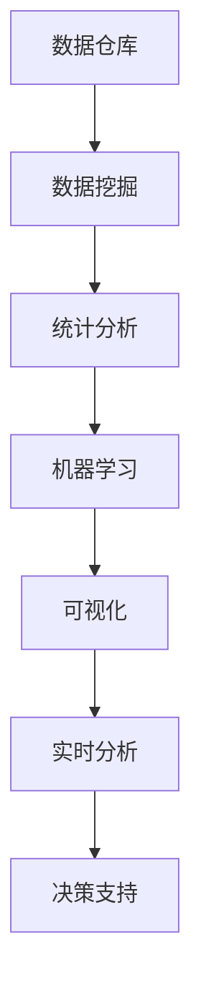

                 

# 知识发现引擎：助力企业决策的战略伙伴

## 1. 背景介绍

在信息爆炸的时代，企业需要从海量数据中快速挖掘出有价值的知识，以支持决策和优化运营。传统的决策方式依赖于经验、直觉和人工分析，往往难以应对数据密集和快速变化的市场环境。知识发现引擎(Knowledge Discovery Engine, KDE)通过自动化地挖掘数据中的知识和模式，成为了现代企业决策的战略伙伴。

### 1.1 问题由来

知识发现引擎的应用源于大数据时代的必然需求。企业运营中产生了大量数据，如销售记录、客户反馈、市场调研等，如何从中提炼有价值的信息，优化业务流程，提升决策效率，是企业亟需解决的问题。传统的数据分析和报告生成方式，往往需要耗费大量人力和时间，且难以发现隐含的关联和规律。而知识发现引擎，通过自动化地分析数据，可以找出潜在的市场趋势、用户偏好、业务风险等信息，大大提高决策的科学性和时效性。

### 1.2 问题核心关键点

知识发现引擎的核心在于其能够从数据中自动抽取知识，提炼出决策所需的信息。与传统的决策方式相比，其关键点在于：

- 自动化数据处理：能够自动清洗、归一化和转换数据，确保数据的质量和一致性。
- 知识自动化抽取：能够自动化地从数据中发现关联、模式和规律，抽取有用的知识。
- 实时决策支持：能够实时分析新数据，为决策提供及时的支持。

因此，知识发现引擎不仅仅是一个技术工具，更是一个帮助企业优化决策流程、提高决策质量的重要战略伙伴。

## 2. 核心概念与联系

### 2.1 核心概念概述

知识发现引擎融合了数据挖掘、统计分析、机器学习等技术，通过自动化地分析数据，从中提取和提炼有价值的知识。其核心概念包括：

- 数据仓库：收集和管理企业运营数据，是知识发现的基础。
- 数据挖掘算法：自动化地分析数据，提取有价值的信息和知识。
- 统计分析：使用统计方法对数据进行分析和验证，增强知识发现结果的可靠性。
- 机器学习：应用算法从数据中学习模式和规律，提高知识发现的精度。
- 实时分析：对实时数据进行分析，提供即时的决策支持。
- 可视化：将复杂的数据和知识结果转化为易于理解的图形和报告，辅助决策。

这些核心概念共同构成了一个全面的知识发现系统，使企业能够从数据中提取知识，优化决策。

### 2.2 核心概念原理和架构的 Mermaid 流程图



这个流程图展示了知识发现引擎的主要工作流程：

1. **数据仓库**：收集和管理企业运营数据，为知识发现提供数据基础。
2. **数据挖掘**：自动化地从数据中抽取知识，提取关联和规律。
3. **统计分析**：使用统计方法验证知识发现结果，提高可信度。
4. **机器学习**：通过算法学习数据中的模式和规律，增强知识发现的精度。
5. **可视化**：将复杂的知识结果转化为易于理解的图形和报告。
6. **实时分析**：对实时数据进行分析，提供即时的决策支持。

## 3. 核心算法原理 & 具体操作步骤

### 3.1 算法原理概述

知识发现引擎的核心算法包括数据挖掘、统计分析、机器学习等。以下将详细讲解这些算法的原理和具体操作步骤。

### 3.2 算法步骤详解

#### 3.2.1 数据预处理

数据预处理是知识发现的首要步骤，包括数据清洗、归一化、转换等操作，确保数据的完整性和一致性。

1. **数据清洗**：识别并处理数据中的错误、缺失、异常值等，确保数据质量。
2. **数据归一化**：将不同来源和格式的数据统一到一个标准格式，便于后续分析。
3. **数据转换**：将原始数据转换为适合分析的格式，如时间序列、离散化等。

#### 3.2.2 数据挖掘

数据挖掘是知识发现的核心环节，使用各种算法从数据中自动抽取知识，包括关联规则挖掘、分类、聚类等。

1. **关联规则挖掘**：找出数据中不同变量之间的关联规则，如购物篮分析。
2. **分类**：将数据分为不同的类别，如客户分群。
3. **聚类**：将数据分为不同的群组，发现数据的内在结构。

#### 3.2.3 统计分析

统计分析使用各种统计方法对数据进行验证和分析，增强知识发现结果的可靠性。

1. **描述性统计**：使用均值、方差、标准差等指标描述数据的特征。
2. **假设检验**：使用t检验、卡方检验等方法验证发现的知识和规律。
3. **相关性分析**：使用皮尔逊相关系数、斯皮尔曼相关系数等方法分析变量之间的关系。

#### 3.2.4 机器学习

机器学习通过各种算法从数据中学习模式和规律，提高知识发现的精度。

1. **监督学习**：使用已标注的数据进行训练，预测新数据的结果，如分类、回归等。
2. **无监督学习**：从无标注的数据中学习模式和规律，如聚类、降维等。
3. **增强学习**：通过与环境互动学习最优策略，如推荐系统。

#### 3.2.5 可视化

可视化将复杂的知识结果转化为易于理解的图形和报告，辅助决策。

1. **散点图**：展示变量之间的关系。
2. **柱状图**：展示数据的分布情况。
3. **折线图**：展示数据的趋势变化。
4. **热力图**：展示数据的密度和分布。

#### 3.2.6 实时分析

实时分析对实时数据进行分析，提供即时的决策支持。

1. **流数据处理**：对实时数据进行流式处理，快速分析。
2. **数据流管理**：管理数据流的流向和处理节点。
3. **实时报告**：实时生成报告，辅助决策。

### 3.3 算法优缺点

知识发现引擎具有以下优点：

1. **自动化程度高**：能够自动化地分析数据，减少人工干预，提高效率。
2. **数据处理能力强**：能够处理海量数据，发现数据中的隐含关联和规律。
3. **决策支持及时**：能够实时分析新数据，提供即时的决策支持。

但同时，知识发现引擎也存在一些缺点：

1. **数据依赖性强**：依赖高质量的数据，数据清洗和归一化工作量大。
2. **算法复杂度高**：需要使用复杂的算法和模型，计算资源消耗大。
3. **结果解释困难**：知识发现结果往往是黑箱，难以解释其背后的逻辑和机制。

### 3.4 算法应用领域

知识发现引擎广泛应用于各个行业，以下是其主要应用领域：

1. **零售行业**：通过购物篮分析、客户分群等技术，优化销售策略，提升用户体验。
2. **金融行业**：使用分类、聚类等技术，识别潜在风险，进行信用评估和投资组合优化。
3. **医疗行业**：通过数据挖掘和机器学习技术，预测疾病风险，辅助诊断和治疗。
4. **制造业**：使用预测模型和异常检测技术，优化生产流程，降低运营成本。
5. **物流行业**：通过聚类和路径优化技术，提高配送效率，降低运输成本。
6. **媒体行业**：使用文本挖掘和情感分析技术，分析用户反馈，优化内容推荐。

## 4. 数学模型和公式 & 详细讲解 & 举例说明

### 4.1 数学模型构建

知识发现引擎的数学模型构建涉及多个环节，包括数据预处理、数据挖掘、统计分析和机器学习等。以下将详细介绍每个环节的数学模型。

#### 4.1.1 数据预处理

数据预处理的数学模型主要涉及数据清洗、归一化和转换等步骤。

1. **数据清洗**：
   - 缺失值处理：使用均值、中位数等填补缺失值。
   - 异常值处理：使用IQR、Z-score等方法识别和处理异常值。
2. **数据归一化**：
   - 最小-最大归一化：将数据映射到[0,1]区间。
   - Z-score归一化：将数据标准化为均值为0，方差为1的正态分布。
3. **数据转换**：
   - 时间序列转换：将时间戳数据转换为日期和时间格式。
   - 离散化：将连续数据转换为离散数据。

#### 4.1.2 数据挖掘

数据挖掘的数学模型主要涉及关联规则挖掘、分类和聚类等算法。

1. **关联规则挖掘**：
   - Apriori算法：找出数据集中的频繁项集和关联规则。
2. **分类**：
   - 决策树：构建决策树模型，预测新数据属于哪个类别。
3. **聚类**：
   - K-means算法：将数据分为K个聚类。

#### 4.1.3 统计分析

统计分析的数学模型主要涉及描述性统计、假设检验和相关性分析等方法。

1. **描述性统计**：
   - 均值：
     \[
     \mu = \frac{1}{n} \sum_{i=1}^n x_i
     \]
   - 方差：
     \[
     \sigma^2 = \frac{1}{n} \sum_{i=1}^n (x_i - \mu)^2
     \]
2. **假设检验**：
   - t检验：
     \[
     t = \frac{\bar{x} - \mu_0}{s / \sqrt{n}}
     \]
   - 卡方检验：
     \[
     \chi^2 = \sum_{i=1}^n \frac{(x_i - e_i)^2}{e_i}
     \]
3. **相关性分析**：
   - 皮尔逊相关系数：
     \[
     r = \frac{\sum_{i=1}^n (x_i - \bar{x})(y_i - \bar{y})}{\sqrt{\sum_{i=1}^n (x_i - \bar{x})^2 \sum_{i=1}^n (y_i - \bar{y})^2}
     \]

#### 4.1.4 机器学习

机器学习的数学模型主要涉及监督学习、无监督学习和增强学习等算法。

1. **监督学习**：
   - 线性回归：
     \[
     y = \theta_0 + \theta_1 x_1 + \theta_2 x_2 + \cdots + \theta_n x_n
     \]
2. **无监督学习**：
   - K-means算法：
     \[
     \min \sum_{i=1}^k \sum_{x_j \in C_i} ||x_j - \mu_i||^2
     \]
3. **增强学习**：
   - Q-learning：
     \[
     Q(s, a) = r + \gamma \max Q(s', a')
     \]

### 4.2 公式推导过程

以下将详细介绍各算法的公式推导过程。

#### 4.2.1 数据清洗

数据清洗的公式推导主要涉及缺失值处理和异常值处理。

1. **缺失值处理**：
   - 均值填补：
     \[
     x_{i, \text{cleaned}} = \begin{cases}
     x_i & \text{if } x_i \text{ is not missing} \\
     \bar{x} & \text{otherwise}
     \end{cases}
     \]
2. **异常值处理**：
   - IQR方法：
     \[
     IQR = Q3 - Q1
     \]
     \[
     \text{if } x_i < Q1 - k \times IQR \text{ or } x_i > Q3 + k \times IQR, \text{ then remove } x_i
     \]

#### 4.2.2 数据归一化

数据归一化的公式推导主要涉及最小-最大归一化和Z-score归一化。

1. **最小-最大归一化**：
   \[
   x_{\text{normalized}} = \frac{x - x_{\min}}{x_{\max} - x_{\min}}
   \]
2. **Z-score归一化**：
   \[
   x_{\text{normalized}} = \frac{x - \mu}{\sigma}
   \]

#### 4.2.3 数据转换

数据转换的公式推导主要涉及时间序列转换和离散化。

1. **时间序列转换**：
   \[
   \text{date} = \text{time} / 86400
   \]
2. **离散化**：
   - 等宽离散化：
     \[
     d = \frac{x_i - x_j}{\Delta x}
     \]
     \[
     d = \begin{cases}
     \lfloor d \rfloor & \text{if } d \geq 0 \\
     \lceil d \rceil & \text{otherwise}
     \end{cases}
     \]

#### 4.2.4 关联规则挖掘

关联规则挖掘的公式推导主要涉及Apriori算法。

1. **Apriori算法**：
   - 频繁项集：
     \[
     L_k = \bigcup_{i=1}^k L_i
     \]
   - 关联规则：
     \[
     R_k = \{ (X, Y) | X \in L_k, Y \in L_k, X \cap Y = \emptyset \}
     \]

#### 4.2.5 分类

分类的公式推导主要涉及决策树算法。

1. **决策树**：
   \[
   \min_{\text{tree}} \sum_{i=1}^n \text{cost}(\text{tree}, x_i)
   \]
   其中，cost表示误差，可以使用均方误差或分类误差。

#### 4.2.6 聚类

聚类的公式推导主要涉及K-means算法。

1. **K-means算法**：
   \[
   \min_{C} \sum_{i=1}^k \sum_{x_j \in C_i} ||x_j - \mu_i||^2
   \]
   其中，C表示聚类，k表示聚类数，\(\mu_i\)表示聚类中心。

### 4.3 案例分析与讲解

#### 4.3.1 零售行业

某零售公司利用知识发现引擎进行销售数据分析和客户分群。

1. **数据预处理**：清洗原始销售数据，处理缺失值和异常值。
2. **数据挖掘**：使用Apriori算法挖掘购物篮数据，找出关联规则。
3. **统计分析**：使用均值和方差分析客户购买行为，验证关联规则。
4. **机器学习**：使用决策树模型预测客户是否会购买某商品。
5. **可视化**：使用散点图和柱状图展示关联规则和分类结果。

#### 4.3.2 金融行业

某金融公司利用知识发现引擎进行信用评估和投资组合优化。

1. **数据预处理**：清洗客户信用数据，处理缺失值和异常值。
2. **数据挖掘**：使用K-means算法对客户进行分群，识别高风险客户。
3. **统计分析**：使用卡方检验验证分群的有效性，使用相关性分析评估变量之间的关系。
4. **机器学习**：使用线性回归模型预测客户信用评分。
5. **可视化**：使用热力图和折线图展示客户分群和信用评分结果。

## 5. 项目实践：代码实例和详细解释说明

### 5.1 开发环境搭建

知识发现引擎的开发环境搭建主要涉及Python和相关数据处理库的安装。

1. **Python环境搭建**：
   - 安装Anaconda：从官网下载并安装Anaconda，用于创建独立的Python环境。
   - 创建并激活虚拟环境：
     ```bash
     conda create -n kde-env python=3.8 
     conda activate kde-env
     ```
2. **数据处理库安装**：
   - 安装pandas：
     ```bash
     pip install pandas
     ```
   - 安装numpy：
     ```bash
     pip install numpy
     ```
   - 安装scikit-learn：
     ```bash
     pip install scikit-learn
     ```

### 5.2 源代码详细实现

以下是使用Python进行知识发现引擎开发的代码实现。

```python
import pandas as pd
from sklearn.preprocessing import StandardScaler
from sklearn.cluster import KMeans
from sklearn.ensemble import DecisionTreeClassifier
from sklearn.metrics import accuracy_score

# 数据预处理
def data_cleaning(data):
    # 处理缺失值和异常值
    data.fillna(method='ffill', inplace=True)
    data.dropna(inplace=True)
    return data

# 数据归一化
def data_normalization(data):
    scaler = StandardScaler()
    data_normalized = scaler.fit_transform(data)
    return data_normalized

# 数据转换
def data_conversion(data):
    # 时间序列转换
    data['date'] = pd.to_datetime(data['timestamp']).dt.strftime('%Y-%m-%d')
    # 离散化
    data['category'] = pd.cut(data['category'], bins=5, labels=False)
    return data

# 关联规则挖掘
def association_rule_mining(data):
    from mlxtend.frequent_patterns import apriori
    freq_itemsets = apriori(data, min_support=0.01)
    rules = []
    for itemset in freq_itemsets:
        rules.append(itemset)
    return rules

# 分类
def classification(data):
    X = data.drop('label', axis=1)
    y = data['label']
    clf = DecisionTreeClassifier()
    clf.fit(X, y)
    return clf

# 聚类
def clustering(data):
    kmeans = KMeans(n_clusters=3)
    kmeans.fit(data)
    return kmeans.labels_

# 评估
def evaluate(clf, X_test, y_test):
    y_pred = clf.predict(X_test)
    accuracy = accuracy_score(y_test, y_pred)
    return accuracy

# 主函数
if __name__ == '__main__':
    # 读取数据
    data = pd.read_csv('sales_data.csv')
    # 数据预处理
    data_cleaned = data_cleaning(data)
    # 数据归一化
    data_normalized = data_normalization(data_cleaned)
    # 数据转换
    data_converted = data_conversion(data_normalized)
    # 关联规则挖掘
    rules = association_rule_mining(data_converted)
    # 分类
    clf = classification(data_converted)
    # 聚类
    labels = clustering(data_converted)
    # 评估
    accuracy = evaluate(clf, data_converted, labels)
    print(f'Accuracy: {accuracy}')
```

### 5.3 代码解读与分析

让我们再详细解读一下关键代码的实现细节：

**data_cleaning函数**：
- 使用ffill方法填充缺失值，dropna方法删除缺失值。

**data_normalization函数**：
- 使用StandardScaler对数据进行标准化处理。

**data_conversion函数**：
- 将时间戳转换为日期格式，使用cut方法进行离散化。

**association_rule_mining函数**：
- 使用Apriori算法进行关联规则挖掘，返回频繁项集。

**classification函数**：
- 使用决策树分类器进行分类，返回模型。

**clustering函数**：
- 使用K-means算法进行聚类，返回聚类标签。

**evaluate函数**：
- 使用准确率评估分类模型，返回准确率。

**主函数**：
- 依次对数据进行预处理、归一化、转换、挖掘、分类和聚类，最后评估模型。

## 6. 实际应用场景

### 6.1 智能客服系统

知识发现引擎可以应用于智能客服系统的构建，提升客户服务效率和体验。

1. **客户分群**：根据客户历史数据，使用聚类算法进行客户分群，提供个性化服务。
2. **问题分类**：使用关联规则挖掘技术，找出常见问题及其关联变量，实现自动化分类。
3. **情感分析**：使用机器学习模型分析客户情感，优化客服策略。
4. **预测模型**：使用预测模型预测客户需求，提前进行服务准备。

### 6.2 金融舆情监测

知识发现引擎可以应用于金融舆情监测，帮助企业快速了解市场动态。

1. **舆情分析**：使用文本挖掘技术，从新闻、评论中提取舆情信息，识别市场趋势。
2. **情感分析**：使用情感分析技术，评估市场情绪，辅助投资决策。
3. **异常检测**：使用异常检测技术，识别异常交易，预防风险。
4. **实时预警**：实时分析舆情数据，提供实时预警，保护企业利益。

### 6.3 个性化推荐系统

知识发现引擎可以应用于个性化推荐系统，提升用户体验。

1. **用户分群**：使用聚类算法对用户进行分群，提供个性化推荐。
2. **物品推荐**：使用关联规则挖掘技术，找出用户和物品的关联规则，进行推荐。
3. **行为分析**：使用机器学习模型分析用户行为，优化推荐策略。
4. **实时推荐**：实时分析用户行为，提供即时推荐，提升用户体验。

### 6.4 未来应用展望

未来，知识发现引擎将在更多领域得到应用，为传统行业带来变革性影响。

1. **智慧医疗**：利用知识发现引擎进行疾病预测、药物研发等，提升医疗服务智能化水平。
2. **智能教育**：使用知识发现引擎进行学情分析、知识推荐等，因材施教，提高教育质量。
3. **智慧城市**：使用知识发现引擎进行城市事件监测、舆情分析等，提升城市治理水平。
4. **智慧制造**：利用知识发现引擎进行生产流程优化、质量控制等，提升制造业效率。
5. **智能物流**：使用知识发现引擎进行路径优化、需求预测等，提升物流效率。
6. **智能营销**：使用知识发现引擎进行客户分群、市场分析等，提升营销效果。

## 7. 工具和资源推荐

### 7.1 学习资源推荐

为了帮助开发者系统掌握知识发现引擎的理论基础和实践技巧，这里推荐一些优质的学习资源：

1. **《数据挖掘与统计学习》书籍**：深入介绍数据挖掘和统计学习的原理和算法。
2. **Coursera《数据科学导论》课程**：斯坦福大学开设的入门课程，涵盖数据预处理、数据挖掘、机器学习等基本概念。
3. **Kaggle平台**：提供大量数据集和竞赛，锻炼数据处理和模型构建能力。
4. **Scikit-learn官方文档**：Scikit-learn库的详细文档，提供丰富的算法实现和应用案例。
5. **KMeans Clustering笔记**：详细讲解K-means算法及其应用案例。

通过对这些资源的学习实践，相信你一定能够快速掌握知识发现引擎的核心技能，并用于解决实际的NLP问题。

### 7.2 开发工具推荐

高效的开发离不开优秀的工具支持。以下是几款用于知识发现引擎开发的常用工具：

1. **Python**：开源、灵活的编程语言，支持丰富的数据处理和机器学习库。
2. **Pandas**：数据处理和分析库，提供数据清洗、归一化、转换等功能。
3. **Scikit-learn**：机器学习库，提供多种算法和模型。
4. **TensorFlow**：开源深度学习框架，支持复杂的神经网络模型。
5. **Wealth & Biases**：模型训练的实验跟踪工具，记录和可视化模型训练过程中的各项指标。
6. **Google Colab**：免费的Jupyter Notebook环境，提供GPU/TPU算力。

合理利用这些工具，可以显著提升知识发现引擎的开发效率，加快创新迭代的步伐。

### 7.3 相关论文推荐

知识发现引擎的研究源于学界的持续研究。以下是几篇奠基性的相关论文，推荐阅读：

1. **"Knowledge Discovery in Databases"**：KDD领域的开创性论文，介绍了知识发现的定义、方法和应用。
2. **"Association Rules in Large Databases"**：关联规则挖掘领域的经典论文，介绍了Apriori算法。
3. **"Clustering Algorithms for Statistical Data Analysis"**：聚类算法的经典论文，介绍了K-means算法。
4. **"Decision Trees for Data Discovery"**：决策树算法的经典论文，介绍了决策树模型。
5. **"Text Mining: Concepts, Methodologies and Techniques"**：文本挖掘领域的经典书籍，涵盖多种文本挖掘技术和方法。

这些论文代表了大语言模型微调技术的发展脉络。通过学习这些前沿成果，可以帮助研究者把握学科前进方向，激发更多的创新灵感。

## 8. 总结：未来发展趋势与挑战

### 8.1 总结

本文对知识发现引擎进行了全面系统的介绍。首先阐述了知识发现引擎在信息爆炸时代的必然需求和应用前景。其次，从原理到实践，详细讲解了知识发现引擎的各个关键环节，包括数据预处理、数据挖掘、统计分析、机器学习等，给出了知识发现引擎开发的完整代码实例。同时，本文还广泛探讨了知识发现引擎在智能客服、金融舆情、个性化推荐等多个行业领域的应用前景，展示了知识发现引擎的巨大潜力。

通过本文的系统梳理，可以看到，知识发现引擎不仅仅是一个技术工具，更是一个帮助企业优化决策流程、提高决策质量的重要战略伙伴。其在零售、金融、医疗、制造、物流、媒体等多个行业的应用，展示了其强大的数据处理能力和决策支持能力。未来，伴随知识发现引擎的持续演进，必将进一步拓展其应用边界，提升企业的智能化水平。

### 8.2 未来发展趋势

展望未来，知识发现引擎将呈现以下几个发展趋势：

1. **自动化程度提高**：随着AI技术的发展，知识发现引擎将更加自动化，减少人工干预，提高效率。
2. **数据处理能力增强**：知识发现引擎将处理更加复杂和多样化的数据类型，如图像、视频、音频等。
3. **实时分析能力提升**：知识发现引擎将实时处理海量数据，提供即时的决策支持。
4. **多模态融合技术发展**：知识发现引擎将融合不同模态的数据，进行多模态分析。
5. **模型解释性增强**：知识发现引擎将提供更强的模型解释能力，增强决策的可解释性和可信度。
6. **跨领域应用扩展**：知识发现引擎将在更多领域得到应用，如智慧农业、智能交通等。

### 8.3 面临的挑战

尽管知识发现引擎已经取得了显著成就，但在迈向更加智能化、普适化应用的过程中，它仍面临着诸多挑战：

1. **数据质量问题**：高质量的数据是知识发现的前提，但获取高质量数据成本高、难度大。
2. **计算资源消耗大**：知识发现引擎涉及复杂的算法和模型，计算资源消耗大，成本高。
3. **模型解释困难**：知识发现引擎的模型通常是黑箱，难以解释其背后的逻辑和机制。
4. **鲁棒性和泛化能力不足**：知识发现引擎在不同领域、不同数据集上的泛化能力有待提升。
5. **隐私和安全性问题**：知识发现引擎涉及大量敏感数据，数据隐私和安全性问题需要得到解决。

### 8.4 研究展望

面对知识发现引擎所面临的挑战，未来的研究需要在以下几个方面寻求新的突破：

1. **自动化数据处理技术**：开发自动化数据清洗、归一化和转换技术，减少人工干预。
2. **高效计算资源利用**：优化算法和模型，提高计算效率，降低计算成本。
3. **模型可解释性研究**：开发模型解释工具，增强模型的可解释性和可信度。
4. **多模态数据融合技术**：开发多模态数据融合技术，提高数据处理能力。
5. **鲁棒性和泛化能力提升**：研究鲁棒性和泛化能力，提升模型在不同场景下的表现。
6. **隐私和安全保护**：开发隐私保护和数据安全技术，确保数据隐私和安全。

这些研究方向的探索，必将引领知识发现引擎技术迈向更高的台阶，为构建安全、可靠、可解释、可控的智能系统铺平道路。面向未来，知识发现引擎还需要与其他人工智能技术进行更深入的融合，如知识图谱、逻辑推理、强化学习等，多路径协同发力，共同推动自然语言理解和智能交互系统的进步。只有勇于创新、敢于突破，才能不断拓展知识发现引擎的边界，让智能技术更好地造福人类社会。

## 9. 附录：常见问题与解答

**Q1：知识发现引擎与数据挖掘有什么区别？**

A: 知识发现引擎是数据挖掘的一种高级形式，其目标是发现数据中的知识并用于决策支持。数据挖掘更侧重于从数据中发现模式和规律，而知识发现引擎不仅限于发现模式，还能发现知识，提供决策支持。

**Q2：知识发现引擎的主要应用领域有哪些？**

A: 知识发现引擎广泛应用于零售、金融、医疗、制造、物流、媒体等多个行业，帮助企业从数据中提取有价值的知识，优化决策流程，提高决策质量。

**Q3：知识发现引擎开发过程中需要注意哪些问题？**

A: 知识发现引擎开发过程中需要注意数据质量、计算资源、模型可解释性、鲁棒性和泛化能力、隐私和安全等问题。需要根据具体应用场景，灵活设计算法和模型，进行全面优化。

**Q4：知识发现引擎的未来发展方向是什么？**

A: 知识发现引擎的未来发展方向包括自动化程度提高、数据处理能力增强、实时分析能力提升、多模态融合技术发展、模型解释性增强和跨领域应用扩展等。

**Q5：知识发现引擎在实际应用中如何处理大数据？**

A: 知识发现引擎处理大数据时，通常采用流数据处理、分布式计算等技术，提升数据处理效率。

---

作者：禅与计算机程序设计艺术 / Zen and the Art of Computer Programming

