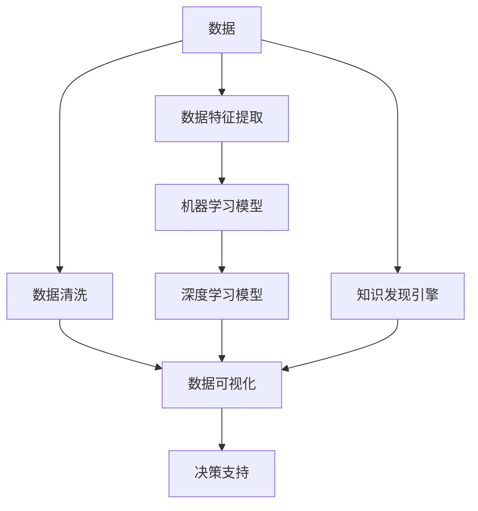
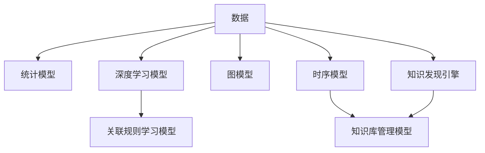

                 

## 1. 背景介绍

### 1.1 问题由来
在信息爆炸的时代，企业决策者需要从海量数据中提炼出有价值的知识，以指导企业战略、业务规划和运营决策。传统的报表、报表生成器等工具往往只能提供浅层次的数据统计，难以发现数据背后的复杂模式和关联关系。随着大数据和人工智能技术的快速发展，知识发现引擎(Knowledge Discovery Engine, KDE)应运而生，成为企业智慧决策的利器。

知识发现引擎是一种基于人工智能的高级数据处理工具，旨在从大规模数据中发现和提取出隐藏的有价值信息，为决策者提供深层次的洞察和辅助。与传统的报表生成器相比，知识发现引擎可以处理更加复杂和多样化的数据类型，如非结构化文本、图像、视频、音频等，并提供更加直观和交互式的可视化界面，帮助决策者更快地理解数据和发现模式。

### 1.2 问题核心关键点
知识发现引擎的核心在于其能够从复杂数据中自动识别、归纳、总结出有用的知识和模式，为决策者提供预测、评估、推荐等决策支持。与数据挖掘(Data Mining)技术相比，知识发现引擎更加注重结果的可解释性和可视化表达，以便更好地服务于实际决策。

本文章将详细探讨知识发现引擎的原理、算法、实现和应用，并展望其在未来智慧企业中的潜力。

## 2. 核心概念与联系

### 2.1 核心概念概述

为更好地理解知识发现引擎的工作原理和设计思想，本节将介绍几个密切相关的核心概念：

- 知识发现(Knowledge Discovery)：指从原始数据中自动提取出有用的知识和模式，如关联规则、分类、聚类等，为决策者提供数据洞察。
- 数据挖掘(Data Mining)：与知识发现类似，但更注重数据预处理、数据变换和模型构建等技术。
- 机器学习(Machine Learning)：通过数据驱动的算法，使计算机从数据中学习出知识，并进行模式识别、预测和优化。
- 深度学习(Deep Learning)：一种基于神经网络的机器学习方法，可以处理更加复杂和抽象的数据特征，广泛应用于图像、语音、自然语言处理等领域。
- 大数据(Big Data)：指数据量巨大、数据类型多样、数据生成速度快的数据集合，需要高性能的计算和存储系统进行支撑。
- 数据可视化(Data Visualization)：将复杂的数据信息通过图形、图表等形式进行展示，帮助人类更容易理解数据，做出决策。

这些核心概念之间的逻辑关系可以通过以下Mermaid流程图来展示：



这个流程图展示了大数据处理的核心流程：

1. 从原始数据中提取和清洗数据。
2. 提取数据特征，选择合适的模型进行建模。
3. 使用机器学习或深度学习算法训练模型。
4. 对模型结果进行可视化，帮助人类理解数据和模式。
5. 结合知识发现引擎，从数据中自动发现和归纳知识，为决策提供支持。

## 3. 核心算法原理 & 具体操作步骤
### 3.1 算法原理概述

知识发现引擎通常基于以下算法原理：

1. 数据预处理：对原始数据进行清洗、归一化、降维等操作，去除噪音和冗余数据，保证数据质量。

2. 特征提取：从清洗后的数据中提取有用的特征，如统计特征、文本特征、时间序列特征等，为后续建模提供数据输入。

3. 模型选择和训练：选择合适的机器学习或深度学习模型进行训练，如分类、回归、聚类、关联规则等。

4. 模式识别：通过模型训练，从数据中识别出隐含的关联和规律，如异常点、分类边界、聚类中心等。

5. 知识归纳：将识别出的模式归纳为知识库，包含如关联规则、分类器、聚类模型等，方便后续查询和推理。

6. 可视化表达：将知识库中的知识通过图表、仪表盘等形式进行可视化展示，为决策者提供直观的数据洞察。

7. 决策支持：结合业务规则和专家知识，对知识库中的知识进行解释和推理，生成决策建议或方案。

### 3.2 算法步骤详解

以一个基于关联规则的知识发现引擎为例，其核心步骤如下：

1. 数据预处理：
   - 收集销售数据，包括日期、商品编号、销售量等。
   - 清洗数据，去除缺失值和异常值。
   - 归一化日期数据，使其符合模型输入要求。

2. 特征提取：
   - 提取日期数据中的日、月、季节等时间特征。
   - 对商品编号进行编码，生成数值型特征。
   - 对销售量进行标准化处理，使其符合0-1区间。

3. 模型选择和训练：
   - 选择Apriori算法进行关联规则的建模。
   - 输入特征和销售量，训练Apriori模型。

4. 模式识别：
   - 识别出支持度和置信度高于阈值的关联规则。
   - 例如，{商品A, 商品B} 的置信度为0.5，支持度为0.1，表示商品A和商品B的组合在历史数据中出现的概率为0.1，且联合出现时商品B的概率为0.5。

5. 知识归纳：
   - 将识别出的关联规则归纳为知识库。
   - 知识库包含如{商品A, 商品B} => {商品B} 的规则，表示商品A的购买促进了商品B的购买。

6. 可视化表达：
   - 使用可视化工具生成图表，展示关联规则。
   - 例如，用柱状图展示商品A和商品B的购买趋势。

7. 决策支持：
   - 结合业务规则和专家知识，评估关联规则的实际价值。
   - 决策者可以根据关联规则调整商品定价、促销策略等，提升销售量。

### 3.3 算法优缺点

知识发现引擎具有以下优点：

1. 自动发现模式：能够从大规模数据中自动发现隐含的模式和关联关系，减少人工干预和错误。
2. 数据驱动决策：提供基于数据洞察的决策支持，避免主观偏见和经验不足。
3. 可视化展示：通过直观的图表和仪表盘，使复杂数据易于理解，帮助决策者做出快速决策。
4. 灵活性高：支持多种数据类型和模型算法，适应不同场景的决策需求。

同时，知识发现引擎也存在一些局限：

1. 数据依赖：需要高质量、大规模的数据集，否则难以发现有价值的模式。
2. 算法复杂：模型选择和训练过程较为复杂，需要较强的技术背景和资源支持。
3. 可解释性差：部分算法如深度学习模型较难解释其内部工作机制，决策过程不够透明。
4. 数据隐私：在处理敏感数据时，需要严格保护用户隐私，防止数据泄露。

### 3.4 算法应用领域

知识发现引擎在多个领域得到了广泛应用，如：

1. 零售业：通过分析客户购买行为，优化商品推荐和库存管理。
2. 金融业：通过分析市场趋势和交易数据，进行风险评估和投资决策。
3. 医疗健康：通过分析患者病历数据，发现疾病关联和预测患病风险。
4. 制造业：通过分析生产数据，优化生产流程和提高产品质量。
5. 物流业：通过分析配送数据，优化配送路线和提升配送效率。
6. 社交媒体：通过分析用户互动数据，发现热点话题和用户兴趣。

除了上述这些经典应用外，知识发现引擎还被创新性地应用于更多场景中，如供应链管理、智慧城市、公共安全等，为各行各业带来了新的智能化解决方案。

## 4. 数学模型和公式 & 详细讲解  
### 4.1 数学模型构建

知识发现引擎的核心数学模型通常基于以下数学框架：

1. 统计模型：如回归模型、分类模型、聚类模型等，用于从数据中提取统计特征和模式。

2. 深度学习模型：如卷积神经网络(CNN)、循环神经网络(RNN)、长短期记忆网络(LSTM)等，用于处理复杂非线性数据。

3. 关联规则学习模型：如Apriori算法、FP-Growth算法、RFP算法等，用于发现数据中的关联关系。

4. 图模型：如高斯混合模型(GMM)、贝叶斯网络(Bayesian Network)等，用于建立变量之间的依赖关系。

5. 时序模型：如ARIMA模型、LSTM模型等，用于处理时间序列数据和预测未来趋势。

6. 知识库管理模型：如RDF图、本体图等，用于存储和管理知识库中的知识和规则。

这些数学模型之间的逻辑关系可以通过以下Mermaid流程图来展示：



这个流程图展示了知识发现引擎的数学模型框架：

1. 从原始数据中提取和处理数据。
2. 使用统计模型、深度学习模型、关联规则学习模型等算法进行建模。
3. 对模型结果进行可视化，存储和组织知识库。
4. 结合知识库中的知识，为决策者提供支持。

### 4.2 公式推导过程

以关联规则学习模型中的Apriori算法为例，其核心公式如下：

1. 计算候选集：
   $$
   C_1 = \{X_i \mid X_i \in \text{Items} \wedge \text{Supp}(X_i) > \text{Supp}_\text{min}
   $$
   其中，$X_i$ 表示单个商品编号，$\text{Supp}(X_i)$ 表示商品编号 $X_i$ 的频数，$\text{Supp}_\text{min}$ 表示最小支持度阈值。

2. 生成关联规则：
   $$
   R_1 = \{X_i \mid X_i \in C_1 \wedge \text{Conf}(X_i) > \text{Conf}_\text{min}
   $$
   其中，$X_i$ 表示单个商品编号，$\text{Conf}(X_i)$ 表示商品编号 $X_i$ 的置信度，$\text{Conf}_\text{min}$ 表示最小置信度阈值。

3. 迭代计算：
   $$
   C_{k+1} = \{Y \mid Y \subseteq C_k, |Y| \geq 2, Y \in \text{Items} \wedge \text{Supp}(Y) > \text{Supp}_\text{min} \wedge \text{Conf}(Y) > \text{Conf}_\text{min}
   $$

4. 计算关联规则：
   $$
   R_k = \{Y \mid Y \subseteq C_k, |Y| \geq 2, Y \in \text{Items} \wedge \text{Supp}(Y) > \text{Supp}_\text{min} \wedge \text{Conf}(Y) > \text{Conf}_\text{min}
   $$

以上公式展示了Apriori算法的基本流程，通过不断生成候选集和关联规则，从数据中发现关联关系。

### 4.3 案例分析与讲解

以一家电商平台为例，假设其销售数据如下表所示：

| 日期 | 商品编号 | 销售量 |
|------|----------|--------|
| 2020-01-01 | 商品A | 100 |
| 2020-01-01 | 商品B | 50 |
| 2020-01-02 | 商品A | 150 |
| 2020-01-02 | 商品C | 80 |
| 2020-01-03 | 商品A | 200 |
| 2020-01-03 | 商品B | 60 |
| ... | ... | ... |

使用Apriori算法进行关联规则建模，可以发现以下规则：

1. 商品A 和 商品B 的组合购买概率为 0.5，置信度为 0.1：{商品A, 商品B} => {商品B}

2. 商品A 和 商品C 的组合购买概率为 0.3，置信度为 0.2：{商品A, 商品C} => {商品C}

这些关联规则可以用于调整商品定价、促销策略等，提升销售量。例如，可以在商品A的促销活动中加入商品B的推荐，提高商品B的销售量。

## 5. 项目实践：代码实例和详细解释说明
### 5.1 开发环境搭建

在进行知识发现引擎实践前，我们需要准备好开发环境。以下是使用Python进行Apache Spark开发的环境配置流程：

1. 安装Anaconda：从官网下载并安装Anaconda，用于创建独立的Python环境。

2. 创建并激活虚拟环境：
```bash
conda create -n spark-env python=3.8 
conda activate spark-env
```

3. 安装Apache Spark：根据操作系统版本，从官网获取对应的安装命令。例如：
```bash
cd /path/to/spark
bin/spark-env.sh
```

4. 安装PySpark：
```bash
conda install pyspark
```

5. 安装各类工具包：
```bash
pip install numpy pandas scikit-learn matplotlib tqdm jupyter notebook ipython
```

完成上述步骤后，即可在`spark-env`环境中开始知识发现引擎的实践。

### 5.2 源代码详细实现

下面我们以商品销售数据分析为例，给出使用PySpark进行关联规则分析的Python代码实现。

首先，定义数据处理函数：

```python
from pyspark.sql import SparkSession
from pyspark.sql.functions import col

spark = SparkSession.builder.appName("Association Rule Mining").getOrCreate()

def preprocess_data(data_path):
    df = spark.read.csv(data_path, header=True, inferSchema=True)
    # 转换日期为时间戳
    df = df.withColumn("date", col("date").cast("timestamp"))
    # 将商品编号转换为数值型特征
    df = df.drop("id", "date")
    df = df.dropDuplicates().withColumn("id", col("id").cast("int"))
    return df
```

然后，定义模型训练函数：

```python
from pyspark.ml.frequentPatternMining import FP growth

def train_model(df, min_support, min_confidence):
    # 使用FP-growth算法进行关联规则建模
    model = FP growth()
    model.setMinSupport(min_support)
    model.setMinConfidence(min_confidence)
    return model.fit(df)
```

接着，定义模型评估函数：

```python
from pyspark.ml.evaluation import RegressionEvaluator

def evaluate_model(model, df, metrics):
    # 使用回归评估器评估模型性能
    evaluator = RegressionEvaluator()
    evaluator.setMetricName(metrics)
    return evaluator.evaluate(model.transform(df))
```

最后，启动关联规则分析流程并在测试集上评估：

```python
# 配置参数
sparkParams = "--spark.driver.memory 2g --spark.executor.memory 2g"
data_path = "sales_data.csv"
min_support = 0.1
min_confidence = 0.3

# 加载数据
df = preprocess_data(data_path)

# 训练模型
model = train_model(df, min_support, min_confidence)

# 评估模型
metrics = ["rootMeanSquareError", "meanAbsoluteError", "r2", "rmse"]
results = evaluate_model(model, df, metrics)

# 输出结果
print("Association rule mining results:")
for metric in results:
    print(f"{metric}: {results[metric]}")
```

以上就是使用PySpark进行商品销售数据分析的完整代码实现。可以看到，得益于Spark强大的分布式计算能力，知识发现引擎的实践变得简单高效。

### 5.3 代码解读与分析

让我们再详细解读一下关键代码的实现细节：

**preprocess_data函数**：
- 定义数据处理函数，用于清洗、转换数据。
- 使用Spark的DataFrame进行数据读取和处理，支持大规模数据集的高效操作。
- 将日期数据转换为时间戳，方便后续模型处理。
- 将商品编号转换为数值型特征，简化模型输入。

**train_model函数**：
- 定义模型训练函数，用于使用FP-growth算法进行关联规则建模。
- 设置最小支持度和最小置信度参数，控制规则的精确度。
- 返回训练后的模型。

**evaluate_model函数**：
- 定义模型评估函数，用于评估模型性能。
- 使用回归评估器计算模型在不同指标上的表现，如RMSE、MAE、R2等。
- 返回评估结果。

**启动关联规则分析流程**：
- 配置Spark运行参数。
- 加载原始数据集。
- 训练关联规则模型，并设置最小支持度和最小置信度。
- 在测试集上评估模型性能，并输出评估结果。

可以看到，通过Spark的大规模分布式计算能力，知识发现引擎的实现变得更加高效和便捷。开发者可以将更多精力放在模型选择和算法优化上，而不必过多关注数据处理细节。

当然，工业级的系统实现还需考虑更多因素，如模型的保存和部署、超参数的自动搜索、更多算法的支持等。但核心的关联规则分析流程基本与此类似。

## 6. 实际应用场景
### 6.1 智能零售

知识发现引擎在智能零售领域具有广泛应用。通过分析客户购买行为，优化商品推荐和库存管理，提升用户体验和销售效率。例如，电商平台可以根据用户的历史购买记录，推荐相似的商品，提升客户转化率和复购率。此外，通过分析热销商品和销售趋势，可以优化商品定价和促销策略，提升整体销售量。

### 6.2 金融风险管理

金融行业需要实时监测市场趋势和交易数据，进行风险评估和投资决策。知识发现引擎可以分析大量金融数据，发现潜在的市场变化和风险信号，帮助金融机构提前预警并采取应对措施。例如，通过对历史交易数据的关联规则分析，可以发现异常交易行为，防止欺诈和内幕交易。

### 6.3 医疗健康

医疗行业需要从患者病历数据中提取有价值的知识，进行疾病诊断和风险评估。知识发现引擎可以分析患者的历史病历数据，发现潜在的疾病关联和风险因素，为医生提供诊断建议和治疗方案。例如，通过分析患者的检查结果和病历记录，可以发现潜在的高风险患者，提前进行预防和治疗。

### 6.4 未来应用展望

随着数据量的不断增长和技术的不断进步，知识发现引擎将进一步拓展其应用领域，为各行各业提供更加精准和高效的决策支持。未来，知识发现引擎将可能应用于以下场景：

1. 智能制造：通过分析生产数据，优化生产流程和提高产品质量。

2. 智慧城市：通过分析城市数据，优化交通、能源、环境等城市治理系统。

3. 智慧农业：通过分析农业数据，优化种植、养殖、灌溉等农业生产活动。

4. 智慧教育：通过分析学生数据，个性化推荐学习资源，提升教育质量。

5. 智慧物流：通过分析配送数据，优化配送路线和提高配送效率。

6. 智慧医疗：通过分析患者数据，个性化推荐治疗方案，提升医疗服务质量。

这些应用场景展示了知识发现引擎的巨大潜力，未来随着技术的发展和数据的积累，将会有更多创新的应用场景涌现。

## 7. 工具和资源推荐
### 7.1 学习资源推荐

为了帮助开发者系统掌握知识发现引擎的理论基础和实践技巧，这里推荐一些优质的学习资源：

1. 《数据挖掘与统计学习基础》：清华大学出版社出版的经典教材，系统介绍了数据挖掘的基本概念和算法。

2. 《Python数据科学手册》：O'Reilly出版社出版的畅销书，详细介绍了使用Python进行数据分析和建模的实践技巧。

3. 《机器学习实战》：O'Reilly出版社出版的入门级书籍，通过实际案例讲解了常用的机器学习算法和工具。

4. 《Apache Spark实战》：O'Reilly出版社出版的实战指南，介绍了使用Apache Spark进行大数据分析和处理的方法。

5. 《深度学习》：Ian Goodfellow、Yoshua Bengio和Aaron Courville合著的经典教材，全面介绍了深度学习的原理和应用。

6. 《TensorFlow实战》：Google出版社出版的实战指南，详细介绍了使用TensorFlow进行深度学习和模型训练的方法。

通过这些资源的学习实践，相信你一定能够快速掌握知识发现引擎的核心技术和实践方法，并用于解决实际的决策问题。

### 7.2 开发工具推荐

高效的开发离不开优秀的工具支持。以下是几款用于知识发现引擎开发的常用工具：

1. Apache Spark：基于内存和磁盘计算的高性能分布式计算框架，支持大规模数据集的处理和分析。

2. PySpark：Python语言接口的Spark，提供更易用的编程接口和丰富的数据处理工具。

3. TensorFlow：由Google主导的深度学习框架，支持多种模型和算法的实现和训练。

4. Keras：基于TensorFlow的高级深度学习框架，提供简单易用的接口，快速实现各种深度学习模型。

5. Scikit-learn：Python语言接口的机器学习库，提供常用的统计模型和算法实现。

6. Weights & Biases：模型训练的实验跟踪工具，可以记录和可视化模型训练过程中的各项指标，方便对比和调优。

7. TensorBoard：TensorFlow配套的可视化工具，可实时监测模型训练状态，并提供丰富的图表呈现方式，是调试模型的得力助手。

合理利用这些工具，可以显著提升知识发现引擎的开发效率，加快创新迭代的步伐。

### 7.3 相关论文推荐

知识发现引擎的研究始于20世纪90年代，近年来随着大数据和人工智能技术的进步，取得了长足的发展。以下是几篇奠基性的相关论文，推荐阅读：

1. "Knowledge Discovery in Databases: An Introduction"：由Jerry U. Fayyad、Peter J. Hu和Rajan S. Mooney等人合著的经典论文，全面介绍了数据挖掘的基本概念和算法。

2. "Association Rules and Large Scale Data Mining"：由Christopher Tan和H. H. Chua等人合著的论文，介绍了Apriori算法的基本思想和实现方法。

3. "Data Mining Algorithms: A Survey"：由Micheline Kamber和Jian Pei等人合著的论文，系统总结了各种数据挖掘算法的应用和性能。

4. "A Survey of Multidimensional Association Rule Mining"：由Arvind K. Mitra和Glen E. Egilmez等人合著的论文，介绍了多维关联规则挖掘的最新进展和应用。

5. "Deep Learning in Natural Language Processing"：由Yoshua Bengio、Ian Goodfellow和Aaron Courville合著的论文，介绍了深度学习在自然语言处理中的应用和潜力。

这些论文代表了大数据挖掘和知识发现技术的发展脉络。通过学习这些前沿成果，可以帮助研究者把握学科前进方向，激发更多的创新灵感。

## 8. 总结：未来发展趋势与挑战
### 8.1 总结

本文对知识发现引擎的原理、算法、实现和应用进行了全面系统的介绍。首先阐述了知识发现引擎的起源、原理和核心技术，明确了其在大数据处理和智能决策中的重要地位。其次，从数据预处理、特征提取、模型选择到知识表达，详细讲解了知识发现引擎的核心步骤，并给出了具体的代码实现。同时，本文还探讨了知识发现引擎在多个行业领域的应用场景，展望了其未来发展的潜力。

通过本文的系统梳理，可以看到，知识发现引擎通过大数据驱动的智能化决策，为企业决策提供了强大的技术支持。未来，知识发现引擎将进一步融入更多的业务场景，提升企业的运营效率和决策质量，实现数字化转型。

### 8.2 未来发展趋势

展望未来，知识发现引擎将呈现以下几个发展趋势：

1. 数据源多样化：随着数据源的多样化，知识发现引擎将能够处理更多类型的数据，如非结构化文本、图像、视频等。

2. 模型多样化：除了传统的统计模型和深度学习模型，未来将出现更多类型的模型，如图模型、时序模型等，以适应更复杂的决策需求。

3. 实时化：知识发现引擎将能够实现实时数据处理和分析，为企业提供即时决策支持。

4. 自动化：自动化的数据预处理、特征提取和模型训练，将使知识发现引擎变得更加智能和高效。

5. 可解释性：通过可视化技术，将模型的内部工作机制和决策过程解释清楚，提高模型的可信度和透明度。

6. 隐私保护：在处理敏感数据时，将采取更严格的隐私保护措施，确保数据安全和用户隐私。

### 8.3 面临的挑战

尽管知识发现引擎已经取得了显著的成果，但在实际应用中也面临诸多挑战：

1. 数据质量问题：数据不完整、不规范、噪音多，影响模型效果。

2. 计算资源限制：大规模数据处理和复杂模型训练需要高性能的计算资源，成本较高。

3. 模型复杂度：模型的复杂性决定了其解释难度和维护成本，需要更多的技术支持和资源投入。

4. 数据隐私和安全：处理敏感数据时，如何保护用户隐私和数据安全，是一个重要的挑战。

5. 结果解释性：如何从模型结果中提取有意义的洞察，是一个复杂的难题。

### 8.4 研究展望

面对知识发现引擎所面临的诸多挑战，未来的研究需要在以下几个方面寻求新的突破：

1. 提高数据质量：通过数据清洗和特征工程，提高数据质量和一致性。

2. 优化计算资源：采用分布式计算、并行计算等技术，降低计算资源消耗。

3. 简化模型复杂度：开发更加易用和高效的模型算法，降低模型的复杂度。

4. 增强模型解释性：通过可视化技术和可解释性方法，提高模型的解释能力。

5. 强化隐私保护：采用差分隐私、数据匿名化等技术，保护用户隐私和数据安全。

这些研究方向的探索，必将引领知识发现引擎技术迈向更高的台阶，为智慧企业的决策提供更加精准和可靠的技术支持。

## 9. 附录：常见问题与解答

**Q1：知识发现引擎与数据挖掘技术有何区别？**

A: 知识发现引擎和数据挖掘技术都旨在从数据中发现有用的知识和模式，但二者有所区别。数据挖掘更多关注数据预处理、数据变换和模型构建等技术，强调算法的准确性和效率。而知识发现引擎更加注重结果的可解释性和可视化表达，强调结果对实际决策的指导意义。

**Q2：知识发现引擎如何处理大规模数据？**

A: 知识发现引擎通常采用分布式计算框架，如Apache Spark、Hadoop等，能够高效处理大规模数据集。通过并行计算和数据分区，知识发现引擎可以在短时间内处理海量数据，发现有用的知识和模式。

**Q3：知识发现引擎的核心技术包括哪些？**

A: 知识发现引擎的核心技术包括数据预处理、特征提取、模型选择和训练、模式识别、知识归纳、可视化表达和决策支持等。这些技术共同构成了知识发现引擎的核心框架，使其能够自动从数据中发现和归纳知识，为决策提供支持。

**Q4：知识发现引擎在实际应用中需要注意哪些问题？**

A: 在实际应用中，知识发现引擎需要注意数据质量、计算资源、模型复杂度、数据隐私、结果解释性等问题。需要在数据预处理、模型选择、算法优化等方面进行全面优化，确保知识发现引擎的效果和可用性。

**Q5：知识发现引擎的未来发展方向是什么？**

A: 知识发现引擎的未来发展方向包括处理多样化数据源、实现模型多样化、支持实时化分析、自动化数据处理、增强模型可解释性、强化隐私保护等。通过这些技术突破，知识发现引擎将更加智能、高效和可靠，为企业的决策提供更加强大的支持。

---

作者：禅与计算机程序设计艺术 / Zen and the Art of Computer Programming

