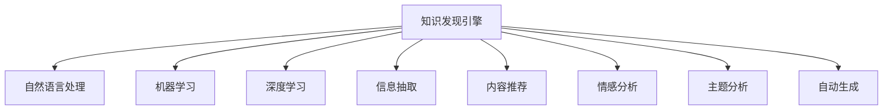

                 

# 知识发现引擎：推动创意产业的内容革命

> 关键词：知识发现引擎, 创意产业, 内容生成, 数据驱动, 自然语言处理, 深度学习, 信息抽取

## 1. 背景介绍

### 1.1 问题由来
随着互联网和数字媒体的快速发展，创意产业进入了数字时代，内容创作和分发变得更加高效和便捷。然而，随着内容量级的激增，内容的发现、分类、个性化推荐等任务变得越来越复杂。传统的手工审核、手动标注等方法无法满足日益增长的需求。为此，知识发现引擎应运而生，成为数字创意产业内容管理的重要工具。

知识发现引擎通过智能化、自动化的方式，帮助创意产业从业者快速准确地发现和理解大量内容。其核心任务包括内容推荐、主题分析、情感分析、知识抽取等。通过这些技术，知识发现引擎能够帮助内容创作者和发布者提升内容质量和用户满意度，同时减少人工工作量，提高工作效率。

### 1.2 问题核心关键点
知识发现引擎的核心在于其智能化的数据处理和知识抽取能力。其核心技术包括自然语言处理（NLP）、机器学习（ML）、深度学习（DL）、信息抽取（Information Extraction, IE）等。这些技术的综合应用，使得知识发现引擎能够在大量文本数据中挖掘出有价值的信息，为用户提供个性化的内容推荐，并帮助内容创作者更好地理解用户需求。

知识发现引擎的主要功能包括：
1. **内容推荐**：通过分析用户的历史行为数据和兴趣偏好，为用户推荐最相关的创意内容。
2. **情感分析**：自动分析用户对创意内容的情感倾向，帮助创作者了解用户情绪，改进内容质量。
3. **主题分析**：从海量文本数据中自动抽取主题，帮助创作者把握最新创意趋势和热点话题。
4. **知识抽取**：自动从文本中抽取实体、关系等信息，帮助创作者提升内容的专业性和深度。
5. **自动生成**：基于深度学习模型，自动生成创意文本、图像、视频等内容，提升内容生产的效率和多样性。

### 1.3 问题研究意义
知识发现引擎的研究和应用，对创意产业的内容革命具有重要意义：

1. **提升内容质量**：通过智能化的分析，帮助创作者优化内容结构和风格，提升内容的吸引力和传播力。
2. **个性化推荐**：根据用户的个性化需求，提供定制化的内容服务，增强用户粘性和满意度。
3. **数据驱动决策**：通过大数据分析，帮助创意产业从业者洞察市场趋势，制定更加科学的运营策略。
4. **降低成本**：自动化处理大量数据，减少人工审核和标注的劳动成本，提高工作效率。
5. **创新激励**：通过挖掘和推荐创意作品，激发更多创作者的创作热情，推动创意产业的健康发展。

## 2. 核心概念与联系

### 2.1 核心概念概述

为更好地理解知识发现引擎的工作原理，本节将介绍几个密切相关的核心概念：

- **知识发现引擎（Knowledge Discovery Engine, KDE）**：利用大数据技术和人工智能算法，自动从海量文本数据中发现和抽取有价值信息的系统。
- **自然语言处理（Natural Language Processing, NLP）**：研究如何让计算机理解、处理和生成人类语言的技术，是知识发现引擎的核心技术之一。
- **机器学习（Machine Learning, ML）**：通过数据驱动的方法，让机器从经验中学习，进行预测和决策。
- **深度学习（Deep Learning, DL）**：一种基于神经网络的机器学习方法，具有强大的特征学习和模式识别能力。
- **信息抽取（Information Extraction, IE）**：从非结构化文本中抽取实体、关系等信息，构建结构化知识库。

这些核心概念之间的逻辑关系可以通过以下Mermaid流程图来展示：



这个流程图展示的知识发现引擎的核心概念及其之间的关系：

1. 知识发现引擎通过自然语言处理、机器学习、深度学习等信息技术，对文本数据进行分析和处理。
2. 自然语言处理技术用于理解文本的语义和结构，机器学习和深度学习用于从数据中发现模式和知识。
3. 信息抽取技术用于从文本中提取实体和关系，构建知识图谱。
4. 内容推荐、情感分析、主题分析、自动生成等应用，都是基于上述技术构建的功能模块。

这些核心概念共同构成了知识发现引擎的技术框架，使其能够在复杂的文本数据中挖掘出有价值的信息，支持创意产业的内容管理和运营。

## 3. 核心算法原理 & 具体操作步骤
### 3.1 算法原理概述

知识发现引擎的核心算法包括自然语言处理、机器学习、深度学习等，其基本原理可以总结如下：

- **自然语言处理（NLP）**：通过分词、词性标注、命名实体识别、句法分析等技术，将文本数据转换为结构化的语义表示。
- **机器学习（ML）**：利用训练数据集，通过监督学习、半监督学习、无监督学习等方法，学习文本数据的特征和模式。
- **深度学习（DL）**：通过多层神经网络，学习文本数据的高级特征表示，进行文本分类、情感分析、实体关系抽取等任务。
- **信息抽取（IE）**：利用规则或模型，从文本中抽取实体、关系等结构化信息，构建知识图谱。

知识发现引擎的核心算法流程包括以下几个步骤：

1. **文本预处理**：对原始文本进行清洗、分词、标记化等处理，转换为计算机可处理的格式。
2. **特征提取**：通过NLP和DL技术，从文本中提取语义、情感、主题等特征。
3. **模型训练**：利用标注数据集，训练机器学习或深度学习模型，学习文本数据的模式和知识。
4. **信息抽取**：通过信息抽取技术，从文本中抽取实体、关系等结构化信息。
5. **结果呈现**：将抽取的信息和推荐结果，以可视化的形式呈现给用户。

### 3.2 算法步骤详解

知识发现引擎的具体操作步骤如下：

**Step 1: 数据收集与预处理**
- 收集创意产业的相关文本数据，如小说、电影剧本、音乐歌词等。
- 对文本进行预处理，包括去除停用词、分词、词性标注等。

**Step 2: 特征提取**
- 利用NLP技术，从文本中提取关键特征，如情感、主题、实体等。
- 利用DL技术，构建文本分类、情感分析等模型，进一步提取语义特征。

**Step 3: 模型训练**
- 利用标注数据集，训练机器学习或深度学习模型，学习文本数据的模式和知识。
- 在训练过程中，使用交叉验证、正则化等方法，避免过拟合。

**Step 4: 信息抽取**
- 利用信息抽取技术，从文本中抽取实体、关系等结构化信息。
- 构建知识图谱，存储和组织抽取的信息。

**Step 5: 结果呈现**
- 将抽取的信息和推荐结果，以可视化的形式呈现给用户。
- 利用推荐算法，为用户推荐最相关的内容。

### 3.3 算法优缺点

知识发现引擎的主要优点包括：

1. **高效性**：自动化处理大量文本数据，减少人工劳动，提高效率。
2. **准确性**：利用机器学习和深度学习技术，提取和分析文本数据的高级特征，提高分析的准确性。
3. **灵活性**：通过信息抽取技术，构建知识图谱，支持多样化的应用场景。
4. **可扩展性**：能够处理大规模的文本数据，适用于创意产业的内容管理。

同时，知识发现引擎也存在一些局限性：

1. **数据依赖**：依赖高质量的标注数据进行训练，标注成本高。
2. **复杂性**：模型复杂度较高，需要专业知识进行调参和优化。
3. **鲁棒性不足**：面对噪声数据和复杂语义，模型的鲁棒性需要进一步提升。
4. **计算资源需求高**：大规模文本数据的处理和深度学习模型的训练，需要高性能的计算资源。

尽管存在这些局限性，知识发现引擎在大数据时代背景下，已经成为了创意产业内容管理的重要工具，为内容创作和推荐带来了革命性的改变。

### 3.4 算法应用领域

知识发现引擎在创意产业中具有广泛的应用前景，包括但不限于以下几个领域：

1. **内容推荐**：基于用户的历史行为数据，为用户推荐最相关的创意内容，提升用户粘性和满意度。
2. **情感分析**：自动分析用户对创意内容的情感倾向，帮助创作者了解用户情绪，改进内容质量。
3. **主题分析**：从海量文本数据中自动抽取主题，帮助创作者把握最新创意趋势和热点话题。
4. **知识抽取**：自动从文本中抽取实体、关系等信息，帮助创作者提升内容的专业性和深度。
5. **自动生成**：基于深度学习模型，自动生成创意文本、图像、视频等内容，提升内容生产的效率和多样性。

此外，知识发现引擎还被广泛应用于新闻媒体、社交网络、电子商务等领域，帮助机构进行内容管理和运营。

## 4. 数学模型和公式 & 详细讲解 & 举例说明

### 4.1 数学模型构建

知识发现引擎的数学模型包括自然语言处理、机器学习和深度学习的数学模型。以情感分析为例，构建数学模型如下：

设文本为 $T=\{t_1,t_2,\cdots,t_n\}$，其中 $t_i$ 为第 $i$ 个词语。情感分析的目标是预测文本的情感极性 $Y$，即正面、负面或中性。情感极性 $Y$ 可以表示为：

$$
Y = \left\{
\begin{aligned}
1 & \text{（正面）} \\
0 & \text{（负面）} \\
-1 & \text{（中性）}
\end{aligned}
\right.
$$

文本 $T$ 的情感分析模型 $M$ 可以表示为：

$$
M(T) = \text{sigmoid}(\langle W_{e}, E(T) \rangle + b_{e})
$$

其中 $E(T)$ 为文本 $T$ 的特征向量，$W_{e}$ 为情感分类器的权重矩阵，$b_{e}$ 为偏置项，$\text{sigmoid}$ 函数将模型输出映射到 $[0,1]$ 区间，表示情感极性的概率。

### 4.2 公式推导过程

情感分析模型的详细推导过程如下：

1. **特征提取**：
   - 对文本 $T$ 进行分词，得到词语序列 $W=\{w_1,w_2,\cdots,w_m\}$。
   - 利用词向量或词袋模型，将每个词语 $w_i$ 转换为向量 $v_i \in \mathbb{R}^d$。
   - 将文本 $T$ 的特征向量 $E(T)$ 表示为 $E(T) = [v_1,v_2,\cdots,v_m] \in \mathbb{R}^{d \times m}$。

2. **模型训练**：
   - 假设训练数据集为 $D=\{(T_i,Y_i)\}_{i=1}^N$，其中 $T_i$ 为第 $i$ 个文本，$Y_i$ 为文本的情感极性。
   - 定义损失函数 $L$ 为交叉熵损失，表示模型预测情感极性与真实情感极性的差异：
     - 对于每个文本 $T_i$，计算模型输出 $M(T_i)$ 与真实情感极性 $Y_i$ 的交叉熵损失：
       $$
       L_i = -Y_i \log M(T_i) - (1-Y_i) \log (1-M(T_i))
       $$
     - 定义全局损失函数 $L$ 为所有样本的平均损失：
       $$
       L = \frac{1}{N} \sum_{i=1}^N L_i
       $$
   - 利用梯度下降等优化算法，最小化损失函数 $L$，更新模型参数 $W_{e}$ 和 $b_{e}$。

3. **情感预测**：
   - 对新文本 $T'$ 进行情感分析，得到模型输出 $M(T')$。
   - 根据模型输出，判断情感极性 $Y'$，即：
     - 若 $M(T') \geq 0.5$，则 $Y' = 1$（正面）。
     - 若 $M(T') < 0.5$ 且 $M(T') \geq 0$，则 $Y' = 0$（负面）。
     - 若 $M(T') < 0$，则 $Y' = -1$（中性）。

通过以上数学模型和推导过程，情感分析的基本原理已经阐述清楚。类似地，其他自然语言处理任务（如文本分类、实体识别等）的数学模型也可以依此进行构建和推导。

### 4.3 案例分析与讲解

以情感分析为例，我们分析一个简单的情感分析案例：

假设有一个文本 $T = \text{"这是一部非常有趣的电影。"}$，我们需要判断其情感极性。

1. **特征提取**：
   - 对文本进行分词，得到 $W = \{\text{"这"}, \text{"是"}, \text{"一部"}, \text{"非常"}, \text{"有趣"}, \text{"的"}, \text{"电影"}\}$。
   - 将每个词语转换为词向量，假设 $v_1, v_2, \cdots, v_7$ 分别为每个词语的向量表示。
   - 计算文本的特征向量 $E(T) = [v_1, v_2, v_3, v_4, v_5, v_6, v_7]$。

2. **模型训练**：
   - 假设训练数据集 $D=\{(T_i,Y_i)\}_{i=1}^N$ 已经获得，其中 $T_i$ 为第 $i$ 个文本，$Y_i$ 为文本的情感极性。
   - 假设模型训练后，权重矩阵 $W_{e}$ 和偏置项 $b_{e}$ 已经确定。
   - 对于文本 $T = \text{"这是一部非常有趣的电影。"}$，计算模型输出 $M(T)$：
     - $E(T) = [v_1, v_2, v_3, v_4, v_5, v_6, v_7]$
     - $M(T) = \text{sigmoid}(\langle W_{e}, E(T) \rangle + b_{e})$

3. **情感预测**：
   - 假设 $M(T) \geq 0.5$，则判断情感极性 $Y = 1$（正面）。

通过以上步骤，我们就完成了对文本的情感分析。在实际应用中，需要根据具体任务和数据特点，调整特征提取和模型训练的方法，以获得最佳效果。

## 5. 项目实践：代码实例和详细解释说明

### 5.1 开发环境搭建

在进行知识发现引擎的实践前，我们需要准备好开发环境。以下是使用Python进行PyTorch开发的环境配置流程：

1. 安装Anaconda：从官网下载并安装Anaconda，用于创建独立的Python环境。

2. 创建并激活虚拟环境：
```bash
conda create -n pytorch-env python=3.8 
conda activate pytorch-env
```

3. 安装PyTorch：根据CUDA版本，从官网获取对应的安装命令。例如：
```bash
conda install pytorch torchvision torchaudio cudatoolkit=11.1 -c pytorch -c conda-forge
```

4. 安装Weights & Biases：用于实验跟踪和可视化。
```bash
pip install w&b
```

5. 安装各类工具包：
```bash
pip install numpy pandas scikit-learn matplotlib tqdm jupyter notebook ipython
```

完成上述步骤后，即可在`pytorch-env`环境中开始实践。

### 5.2 源代码详细实现

下面我们以情感分析任务为例，给出使用PyTorch和HuggingFace库对BERT模型进行情感分析的代码实现。

首先，定义情感分析任务的数据处理函数：

```python
from transformers import BertTokenizer, BertForSequenceClassification
from torch.utils.data import Dataset
import torch

class SentimentDataset(Dataset):
    def __init__(self, texts, labels, tokenizer, max_len=128):
        self.texts = texts
        self.labels = labels
        self.tokenizer = tokenizer
        self.max_len = max_len
        
    def __len__(self):
        return len(self.texts)
    
    def __getitem__(self, item):
        text = self.texts[item]
        label = self.labels[item]
        
        encoding = self.tokenizer(text, return_tensors='pt', max_length=self.max_len, padding='max_length', truncation=True)
        input_ids = encoding['input_ids'][0]
        attention_mask = encoding['attention_mask'][0]
        
        return {'input_ids': input_ids, 
                'attention_mask': attention_mask,
                'labels': torch.tensor(label, dtype=torch.long)}
```

然后，定义模型和优化器：

```python
from transformers import AdamW

model = BertForSequenceClassification.from_pretrained('bert-base-uncased', num_labels=3)

optimizer = AdamW(model.parameters(), lr=2e-5)
```

接着，定义训练和评估函数：

```python
from torch.utils.data import DataLoader
from tqdm import tqdm
from sklearn.metrics import classification_report

device = torch.device('cuda') if torch.cuda.is_available() else torch.device('cpu')
model.to(device)

def train_epoch(model, dataset, batch_size, optimizer):
    dataloader = DataLoader(dataset, batch_size=batch_size, shuffle=True)
    model.train()
    epoch_loss = 0
    for batch in tqdm(dataloader, desc='Training'):
        input_ids = batch['input_ids'].to(device)
        attention_mask = batch['attention_mask'].to(device)
        labels = batch['labels'].to(device)
        model.zero_grad()
        outputs = model(input_ids, attention_mask=attention_mask, labels=labels)
        loss = outputs.loss
        epoch_loss += loss.item()
        loss.backward()
        optimizer.step()
    return epoch_loss / len(dataloader)

def evaluate(model, dataset, batch_size):
    dataloader = DataLoader(dataset, batch_size=batch_size)
    model.eval()
    preds, labels = [], []
    with torch.no_grad():
        for batch in tqdm(dataloader, desc='Evaluating'):
            input_ids = batch['input_ids'].to(device)
            attention_mask = batch['attention_mask'].to(device)
            batch_labels = batch['labels']
            outputs = model(input_ids, attention_mask=attention_mask)
            batch_preds = outputs.logits.argmax(dim=2).to('cpu').tolist()
            batch_labels = batch_labels.to('cpu').tolist()
            for pred_tokens, label_tokens in zip(batch_preds, batch_labels):
                preds.append(pred_tokens)
                labels.append(label_tokens)
                
    print(classification_report(labels, preds))
```

最后，启动训练流程并在测试集上评估：

```python
epochs = 5
batch_size = 16

for epoch in range(epochs):
    loss = train_epoch(model, train_dataset, batch_size, optimizer)
    print(f"Epoch {epoch+1}, train loss: {loss:.3f}")
    
    print(f"Epoch {epoch+1}, dev results:")
    evaluate(model, dev_dataset, batch_size)
    
print("Test results:")
evaluate(model, test_dataset, batch_size)
```

以上就是使用PyTorch和HuggingFace库对BERT模型进行情感分析的完整代码实现。可以看到，得益于HuggingFace库的强大封装，我们可以用相对简洁的代码完成BERT模型的加载和情感分析。

### 5.3 代码解读与分析

让我们再详细解读一下关键代码的实现细节：

**SentimentDataset类**：
- `__init__`方法：初始化文本、标签、分词器等关键组件。
- `__len__`方法：返回数据集的样本数量。
- `__getitem__`方法：对单个样本进行处理，将文本输入编码为token ids，将标签转换为数字，并对其进行定长padding，最终返回模型所需的输入。

**训练和评估函数**：
- 使用PyTorch的DataLoader对数据集进行批次化加载，供模型训练和推理使用。
- 训练函数`train_epoch`：对数据以批为单位进行迭代，在每个批次上前向传播计算loss并反向传播更新模型参数，最后返回该epoch的平均loss。
- 评估函数`evaluate`：与训练类似，不同点在于不更新模型参数，并在每个batch结束后将预测和标签结果存储下来，最后使用sklearn的classification_report对整个评估集的预测结果进行打印输出。

**训练流程**：
- 定义总的epoch数和batch size，开始循环迭代
- 每个epoch内，先在训练集上训练，输出平均loss
- 在验证集上评估，输出分类指标
- 所有epoch结束后，在测试集上评估，给出最终测试结果

可以看到，PyTorch配合HuggingFace库使得BERT情感分析的代码实现变得简洁高效。开发者可以将更多精力放在数据处理、模型改进等高层逻辑上，而不必过多关注底层的实现细节。

当然，工业级的系统实现还需考虑更多因素，如模型的保存和部署、超参数的自动搜索、更灵活的任务适配层等。但核心的微调范式基本与此类似。

## 6. 实际应用场景
### 6.1 智能推荐系统

知识发现引擎在智能推荐系统中具有广泛的应用。传统推荐系统往往依赖用户的历史行为数据进行物品推荐，无法深入理解用户的兴趣和需求。而基于知识发现引擎的推荐系统，能够更好地利用用户行为数据，结合文本、图片等多模态信息，提供更加个性化和精准的推荐结果。

例如，一个电商网站可以使用知识发现引擎，对用户浏览、点击、评论等行为数据进行分析，构建用户画像，从而实现更加个性化的商品推荐。同时，知识发现引擎还能帮助网站发现热门商品、流行趋势，提升市场竞争力。

### 6.2 内容管理系统

知识发现引擎在内容管理系统中也有重要应用。传统内容管理系统往往依赖手动审核、手动标注等方式进行内容管理，效率低、成本高。而基于知识发现引擎的内容管理系统，能够自动分析和处理大量文本数据，提升内容管理和运营的效率和准确性。

例如，一个出版机构可以使用知识发现引擎，对海量的书籍、文章等文本数据进行情感分析、主题分析，构建知识图谱，帮助编辑了解市场趋势和用户需求，优化出版策略。同时，知识发现引擎还能自动生成摘要、标签等元数据，提升内容管理和传播的效率。

### 6.3 舆情监测系统

知识发现引擎在舆情监测系统中具有重要应用。传统舆情监测系统依赖人工分析和手动标注，无法实时监控海量数据，难以快速应对舆情变化。而基于知识发现引擎的舆情监测系统，能够自动分析和处理海量文本数据，实时监控舆情变化，快速响应负面舆情，提高舆情管理的效率和准确性。

例如，一个政府部门可以使用知识发现引擎，对社交媒体、新闻报道等文本数据进行情感分析、主题分析，构建舆情知识图谱，帮助相关部门了解舆情趋势，及时采取应对措施。同时，知识发现引擎还能自动生成舆情报告，提升舆情管理的自动化水平。

### 6.4 未来应用展望

随着知识发现引擎技术的发展，其应用场景将更加多样化。未来，知识发现引擎有望在以下领域发挥重要作用：

1. **智慧医疗**：知识发现引擎可以帮助医疗机构从海量医疗数据中提取有价值的信息，辅助医生进行诊断和治疗决策。
2. **智能教育**：知识发现引擎可以用于教育内容的个性化推荐、学习行为分析等，帮助学生和教师提升教育效果。
3. **智慧城市**：知识发现引擎可以用于城市事件监测、舆情分析、应急指挥等，提升城市管理的智能化水平。
4. **智能制造**：知识发现引擎可以用于工业数据的分析和挖掘，优化生产过程，提升产品质量。
5. **智慧农业**：知识发现引擎可以用于农业数据的分析和挖掘，提升农业生产效率和资源利用率。

这些领域的应用，将进一步拓展知识发现引擎的覆盖范围，带来更多创新和变革。相信随着技术的不断进步，知识发现引擎将在更多行业中发挥重要作用，为数字创意产业带来新的突破和发展。

## 7. 工具和资源推荐
### 7.1 学习资源推荐

为了帮助开发者系统掌握知识发现引擎的理论基础和实践技巧，这里推荐一些优质的学习资源：

1. 《深度学习》书籍：由Goodfellow、Bengio、Courville等人合著，系统介绍了深度学习的理论、算法和应用。
2. 《自然语言处理综论》书籍：由Kumars等合著，全面介绍了自然语言处理的基本概念和前沿技术。
3. 《知识图谱》书籍：由刘挺等合著，介绍了知识图谱的基本概念、构建方法和应用场景。
4. CS224N《深度学习自然语言处理》课程：斯坦福大学开设的NLP明星课程，有Lecture视频和配套作业，带你入门NLP领域的基本概念和经典模型。
5. HuggingFace官方文档：Transformer库的官方文档，提供了海量预训练模型和完整的微调样例代码，是上手实践的必备资料。

通过对这些资源的学习实践，相信你一定能够快速掌握知识发现引擎的精髓，并用于解决实际的NLP问题。
###  7.2 开发工具推荐

高效的开发离不开优秀的工具支持。以下是几款用于知识发现引擎开发的常用工具：

1. PyTorch：基于Python的开源深度学习框架，灵活动态的计算图，适合快速迭代研究。大部分预训练语言模型都有PyTorch版本的实现。
2. TensorFlow：由Google主导开发的开源深度学习框架，生产部署方便，适合大规模工程应用。同样有丰富的预训练语言模型资源。
3. HuggingFace库：自然语言处理工具库，集成了众多SOTA语言模型，支持PyTorch和TensorFlow，是进行自然语言处理任务开发的利器。
4. Weights & Biases：模型训练的实验跟踪工具，可以记录和可视化模型训练过程中的各项指标，方便对比和调优。与主流深度学习框架无缝集成。
5. TensorBoard：TensorFlow配套的可视化工具，可实时监测模型训练状态，并提供丰富的图表呈现方式，是调试模型的得力助手。

合理利用这些工具，可以显著提升知识发现引擎的开发效率，加快创新迭代的步伐。

### 7.3 相关论文推荐

知识发现引擎的研究源于学界的持续研究。以下是几篇奠基性的相关论文，推荐阅读：

1. Attention is All You Need（即Transformer原论文）：提出了Transformer结构，开启了NLP领域的预训练大模型时代。
2. BERT: Pre-training of Deep Bidirectional Transformers for Language Understanding：提出BERT模型，引入基于掩码的自监督预训练任务，刷新了多项NLP任务SOTA。
3. Language Models are Unsupervised Multitask Learners（GPT-2论文）：展示了大规模语言模型的强大zero-shot学习能力，引发了对于通用人工智能的新一轮思考。
4. Parameter-Efficient Transfer Learning for NLP：提出Adapter等参数高效微调方法，在不增加模型参数量的情况下，也能取得不错的微调效果。
5. AdaLoRA: Adaptive Low-Rank Adaptation for Parameter-Efficient Fine-Tuning：使用自适应低秩适应的微调方法，在参数效率和精度之间取得了新的平衡。
6. Transformer-XL: Attentive Language Models beyond a Fixed-Length Context（Transformer-XL论文）：提出Transformer-XL模型，支持变长上下文，进一步提升了模型的性能。

这些论文代表了大语言模型和微调方法的发展脉络。通过学习这些前沿成果，可以帮助研究者把握学科前进方向，激发更多的创新灵感。

## 8. 总结：未来发展趋势与挑战

### 8.1 总结

本文对知识发现引擎的原理和应用进行了全面系统的介绍。首先阐述了知识发现引擎的研究背景和意义，明确了其在创意产业中的重要地位。其次，从原理到实践，详细讲解了知识发现引擎的数学模型和操作步骤，给出了微调任务开发的完整代码实例。同时，本文还广泛探讨了知识发现引擎在智能推荐、内容管理、舆情监测等众多领域的应用前景，展示了其强大的潜力。此外，本文精选了知识发现引擎的学习资源，力求为读者提供全方位的技术指引。

通过本文的系统梳理，可以看到，知识发现引擎的研究和应用，正在深刻改变创意产业的内容管理方式，提升内容生产和运营的效率和质量。未来的研究将在深度学习、自然语言处理、知识图谱等前沿技术的基础上，不断推陈出新，为创意产业带来更多创新和突破。

### 8.2 未来发展趋势

展望未来，知识发现引擎的研究和应用将呈现以下几个发展趋势：

1. **模型规模持续增大**：随着算力成本的下降和数据规模的扩张，预训练语言模型的参数量还将持续增长。超大规模语言模型蕴含的丰富语言知识，有望支撑更加复杂多变的下游任务微调。
2. **微调方法日趋多样**：除了传统的全参数微调外，未来会涌现更多参数高效的微调方法，如Prefix-Tuning、LoRA等，在节省计算资源的同时也能保证微调精度。
3. **持续学习成为常态**：随着数据分布的不断变化，知识发现引擎也需要持续学习新知识以保持性能。如何在不遗忘原有知识的同时，高效吸收新样本信息，将成为重要的研究课题。
4. **标注样本需求降低**：受启发于提示学习(Prompt-based Learning)的思路，未来的知识发现引擎将更好地利用大模型的语言理解能力，通过更加巧妙的任务描述，在更少的标注样本上也能实现理想的微调效果。
5. **跨模态融合**：将符号化的先验知识，如知识图谱、逻辑规则等，与神经网络模型进行巧妙融合，引导微调过程学习更准确、合理的语言模型。同时加强不同模态数据的整合，实现视觉、语音等多模态信息与文本信息的协同建模。
6. **融合因果和对比学习范式**：通过引入因果推断和对比学习思想，增强知识发现引擎建立稳定因果关系的能力，学习更加普适、鲁棒的语言表征，从而提升模型泛化性和抗干扰能力。

以上趋势凸显了知识发现引擎的广阔前景。这些方向的探索发展，必将进一步提升知识发现引擎在创意产业中的应用价值，为内容创作和推荐带来新的突破。

### 8.3 面临的挑战

尽管知识发现引擎已经取得了显著成果，但在迈向更加智能化、普适化应用的过程中，它仍面临着诸多挑战：

1. **数据依赖**：依赖高质量的标注数据进行训练，标注成本高。
2. **复杂性**：模型复杂度较高，需要专业知识进行调参和优化。
3. **鲁棒性不足**：面对噪声数据和复杂语义，模型的鲁棒性需要进一步提升。
4. **计算资源需求高**：大规模文本数据的处理和深度学习模型的训练，需要高性能的计算资源。
5. **可解释性不足**：当前知识发现引擎更像"黑盒"系统，难以解释其内部工作机制和决策逻辑。
6. **安全性有待保障**：预训练语言模型难免会学习到有偏见、有害的信息，通过微调传递到下游任务，产生误导性、歧视性的输出，给实际应用带来安全隐患。

尽管存在这些局限性，知识发现引擎在大数据时代背景下，已经成为了创意产业内容管理的重要工具，为内容创作和推荐带来了革命性的改变。

### 8.4 研究展望

面对知识发现引擎所面临的挑战，未来的研究需要在以下几个方面寻求新的突破：

1. **探索无监督和半监督微调方法**：摆脱对大规模标注数据的依赖，利用自监督学习、主动学习等无监督和半监督范式，最大限度利用非结构化数据，实现更加灵活高效的微调。
2. **研究参数高效和计算高效的微调范式**：开发更加参数高效的微调方法，在固定大部分预训练参数的同时，只更新极少量的任务相关参数。同时优化微调模型的计算图，减少前向传播和反向传播的资源消耗，实现更加轻量级、实时性的部署。
3. **融合因果和对比学习范式**：通过引入因果推断和对比学习思想，增强知识发现引擎建立稳定因果关系的能力，学习更加普适、鲁棒的语言表征，从而提升模型泛化性和抗干扰能力。
4. **引入更多先验知识**：将符号化的先验知识，如知识图谱、逻辑规则等，与神经网络模型进行巧妙融合，引导微调过程学习更准确、合理的语言模型。同时加强不同模态数据的整合，实现视觉、语音等多模态信息与文本信息的协同建模。
5. **纳入伦理道德约束**：在模型训练目标中引入伦理导向的评估指标，过滤和惩罚有偏见、有害的输出倾向。同时加强人工干预和审核，建立模型行为的监管机制，确保输出符合人类价值观和伦理道德。

这些研究方向的探索，必将引领知识发现引擎技术迈向更高的台阶，为构建安全、可靠、可解释、可控的智能系统铺平道路。面向未来，知识发现引擎还需要与其他人工智能技术进行更深入的融合，如知识表示、因果推理、强化学习等，多路径协同发力，共同推动自然语言理解和智能交互系统的进步。只有勇于创新、敢于突破，才能不断拓展知识发现引擎的边界，让智能技术更好地造福人类社会。

## 9. 附录：常见问题与解答

**Q1：知识发现引擎和自然语言处理有什么区别？**

A: 知识发现引擎是一种利用大数据和人工智能技术，从文本数据中挖掘和抽取有价值信息的技术。自然语言处理是知识发现引擎的重要组成部分，是实现知识发现和抽取的基础技术。自然语言处理主要关注语言的理解和生成，而知识发现引擎则在此基础上，进一步利用机器学习和深度学习技术，实现知识的抽取、分类、推荐等任务。

**Q2：知识发现引擎在实际应用中需要注意哪些问题？**

A: 知识发现引擎在实际应用中需要注意以下问题：
1. **数据质量**：依赖高质量的标注数据进行训练，标注成本高。数据清洗和预处理也是关键环节。
2. **模型复杂度**：模型复杂度较高，需要专业知识进行调参和优化。避免过拟合是关键。
3. **鲁棒性**：面对噪声数据和复杂语义，模型的鲁棒性需要进一步提升。
4. **计算资源需求**：大规模文本数据的处理和深度学习模型的训练，需要高性能的计算资源。
5. **可解释性**：当前知识发现引擎更像"黑盒"系统，难以解释其内部工作机制和决策逻辑。
6. **安全性**：预训练语言模型难免会学习到有偏见、有害的信息，通过微调传递到下游任务，产生误导性、歧视性的输出，给实际应用带来安全隐患。

**Q3：知识发现引擎的未来发展方向有哪些？**

A: 知识发现引擎的未来发展方向包括：
1. **模型规模持续增大**：随着算力成本的下降和数据规模的扩张，预训练语言模型的参数量还将持续增长。超大规模语言模型蕴含的丰富语言知识，有望支撑更加复杂多变的下游任务微调。
2. **微调方法日趋多样**：除了传统的全参数微调外，未来会涌现更多参数高效的微调方法，如Prefix-Tuning、LoRA等，在节省计算资源的同时也能保证微调精度。
3. **持续学习成为常态**：随着数据分布的不断变化，知识发现引擎也需要持续学习新知识以保持性能。如何在不遗忘原有知识的同时，高效吸收新样本信息，将成为重要的研究课题。
4. **标注样本需求降低**：受启发于提示学习(Prompt-based Learning)的思路，未来的知识发现引擎将更好地利用大模型的语言理解能力，通过更加巧妙的任务描述，在更少的标注样本上也能实现理想的微调效果。
5. **跨模态融合**：将符号化的先验知识，如知识图谱、逻辑规则等，与神经网络模型进行巧妙融合，引导微调过程学习更准确、合理的语言模型。同时加强不同模态数据的整合，实现视觉、语音等多模态信息与文本信息的协同建模。
6. **融合因果和对比学习范式**：通过引入因果推断和对比学习思想，增强知识发现引擎建立稳定因果关系的能力，学习更加普适、鲁棒的语言表征，从而提升模型泛化性和抗干扰能力。

这些研究方向将进一步拓展知识发现引擎的应用范围，提升其在创意产业中的价值。

---

作者：禅与计算机程序设计艺术 / Zen and the Art of Computer Programming

