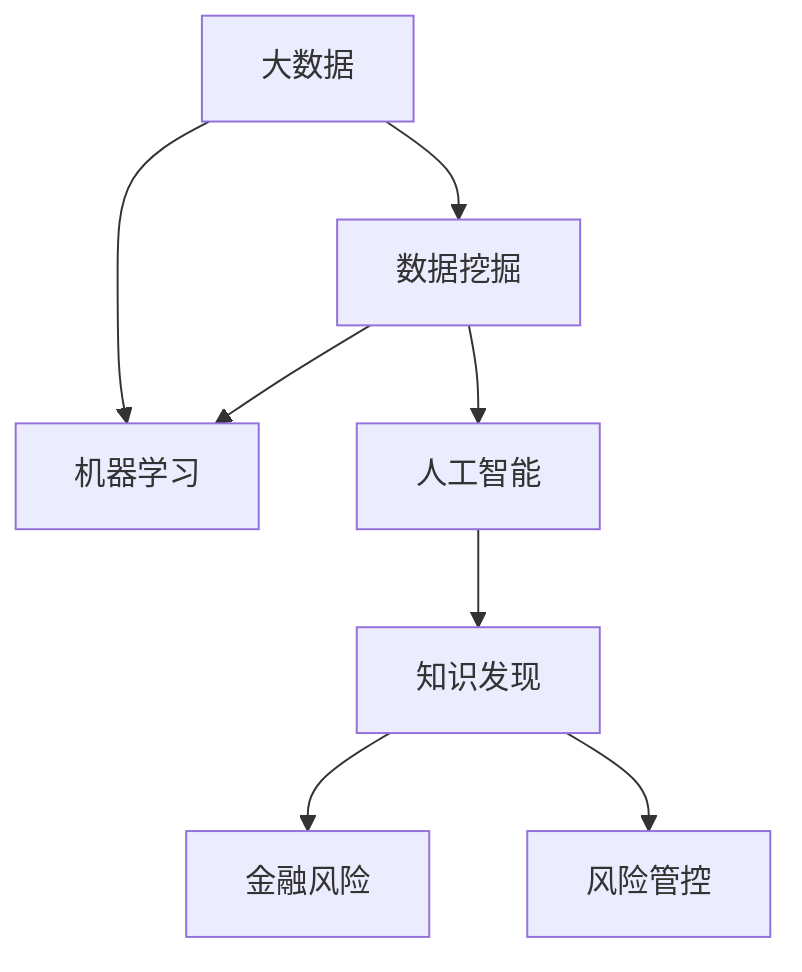

                 

# 知识发现引擎：推动金融行业的风险管控

## 1. 背景介绍

### 1.1 问题由来
在现代金融行业中，风险管控是一个至关重要且极其复杂的任务。随着金融市场的发展和金融科技的崛起，传统的风险管理手段已经难以应对新的挑战。传统方法主要依赖于手工分析报表、专家经验等，难以实时、全面、准确地评估风险。随着数据量的爆炸式增长，以及各种新兴金融工具和交易模式的出现，金融风险的识别、评估、预警和管理变得越来越困难。

在这样的背景下，基于大数据和机器学习的知识发现引擎应运而生。它通过自动化地从海量数据中挖掘出有价值的信息，为金融机构提供实时、智能的风险评估和管理能力，极大地提高了风险管理的效率和准确性。

### 1.2 问题核心关键点
知识发现引擎的核心思想是：利用先进的数据挖掘、机器学习和人工智能技术，从金融数据中自动发现和提取有用的知识，构建一套精准、动态的风险管控体系。具体关键点包括：

- **数据驱动**：以大数据为基础，通过分析海量的交易记录、财务报表、市场数据等，从中提取风险因素。
- **自动化**：采用自动化技术，实时分析和预警风险，减少人为因素对风险评估的干扰。
- **智能化**：运用机器学习模型，从历史数据中学习规律，预测未来风险变化趋势。
- **动态更新**：能够根据市场变化及时调整风险模型，适应动态多变的市场环境。
- **跨领域整合**：整合不同领域的知识，如宏观经济、市场情绪、政策变化等，提供全面的风险视角。

这些关键点共同构成了知识发现引擎的核心能力，使其能够在金融行业内广泛应用。

### 1.3 问题研究意义
金融行业的稳定发展关系到国家经济的稳定和社会的和谐。知识发现引擎在金融风险管控中的应用，具有重要的理论和实际意义：

1. **提高风险管理效率**：自动化和智能化的风险评估手段，能够显著提升风险管理的效率和速度，减少人工介入的时间和成本。
2. **提升风险管理精度**：利用大数据和机器学习的技术，能够更全面、更准确地识别和评估金融风险，减少误判和漏判。
3. **支持决策制定**：为金融机构的决策制定提供科学的依据，降低决策风险，提高决策质量。
4. **增强市场适应性**：知识发现引擎能够动态地适应市场变化，及时调整风险策略，增强金融机构的市场竞争力。
5. **推动技术进步**：促进金融科技和人工智能技术的发展，推动整个金融行业的技术创新和进步。

## 2. 核心概念与联系

### 2.1 核心概念概述

为更好地理解知识发现引擎的原理和应用，本节将介绍几个关键概念：

- **知识发现(Knowledge Discovery)**：从大规模数据中挖掘出有用的信息和知识的过程。在金融领域，主要关注金融数据中的风险因素和规律。
- **大数据(Big Data)**：指规模极大、结构复杂、速度极快的数据集合。金融行业每天产生的大量交易和市场数据构成了一个大数据环境。
- **数据挖掘(Data Mining)**：在大数据中自动地识别和挖掘出有价值的信息和知识的过程。
- **机器学习(Machine Learning)**：让机器从数据中学习规律和模式，自动进行预测和决策的技术。
- **人工智能(Artificial Intelligence)**：模拟人类智能的计算系统，能够执行复杂的任务。
- **金融风险(Financial Risk)**：指金融机构在经营过程中面临的各种不确定性带来的损失。包括信用风险、市场风险、操作风险等。
- **风险管控(Risk Management)**：通过识别、评估和控制风险，减少损失和提高收益。

这些概念之间的关系可以用以下Mermaid流程图来展示：



这个流程图展示了大数据、数据挖掘、机器学习和人工智能技术在知识发现引擎中的应用，以及这些技术如何帮助构建金融风险管控体系。

## 3. 核心算法原理 & 具体操作步骤
### 3.1 算法原理概述

知识发现引擎的核心算法原理可以概括为：通过数据挖掘技术从金融大数据中挖掘出有价值的信息，再利用机器学习和人工智能技术对风险进行建模和预测。具体步骤如下：

1. **数据预处理**：对原始数据进行清洗、归一化和特征提取等预处理，确保数据的可用性和质量。
2. **特征选择**：从大量的金融特征中筛选出与风险最相关的特征。
3. **风险建模**：建立风险评估模型，如信用评分模型、风险预测模型等。
4. **模型训练与验证**：利用历史数据训练模型，并在验证集上评估模型性能。
5. **风险预警与应对**：实时监控市场动态，对风险进行预警，并根据风险情况采取相应的应对措施。

### 3.2 算法步骤详解

以信用风险为例，下面详细讲解知识发现引擎的实现步骤：

#### 3.2.1 数据预处理
数据预处理是知识发现引擎的第一步，其目标是通过清洗、归一化和特征提取等手段，确保数据的可用性和质量。具体步骤如下：

1. **数据清洗**：去除缺失值、异常值和噪声，确保数据的一致性和完整性。
2. **归一化**：将不同量纲的数据转化为相同量纲，便于后续的模型训练。
3. **特征提取**：选择和构建与信用风险相关的特征，如信用评分、历史还款记录、市场波动等。

#### 3.2.2 特征选择
特征选择是从大量金融特征中筛选出与信用风险最相关的特征，以提高模型的准确性和效率。常用的特征选择方法包括：

1. **相关性分析**：通过计算特征与目标变量之间的相关性，筛选出最相关的特征。
2. **递归特征消除**：通过递归地删除与目标变量相关性较低的特征，保留对模型贡献最大的特征。
3. **主成分分析(PCA)**：通过降维技术，将高维特征转化为低维特征，减少计算复杂度。

#### 3.2.3 风险建模
风险建模是知识发现引擎的核心步骤，主要包括信用评分模型和风险预测模型两类：

1. **信用评分模型**：通过分析客户的信用记录和行为，预测客户的违约概率。常用的模型包括Logistic回归模型、决策树模型、随机森林模型等。
2. **风险预测模型**：通过对历史数据进行分析，预测未来的信用风险。常用的模型包括时间序列模型、神经网络模型、支持向量机模型等。

#### 3.2.4 模型训练与验证
模型训练与验证是评估和优化模型性能的重要步骤。具体步骤如下：

1. **模型训练**：利用历史数据对模型进行训练，调整模型参数以优化预测结果。
2. **模型验证**：在验证集上评估模型性能，检查模型是否过拟合或欠拟合。
3. **参数调整**：根据验证结果调整模型参数，确保模型的泛化能力。

#### 3.2.5 风险预警与应对
风险预警与应对是知识发现引擎的最终目标，通过实时监控市场动态，对风险进行预警，并根据风险情况采取相应的应对措施。具体步骤如下：

1. **数据实时采集**：实时采集金融市场数据，如股票价格、汇率、利率等。
2. **风险评估**：利用训练好的模型对当前风险进行评估。
3. **预警与应对**：根据风险评估结果，发出预警信息，并采取相应的应对措施，如调整资产配置、增加保证金等。

### 3.3 算法优缺点

知识发现引擎在金融风险管控中具有以下优点：

1. **高效性**：利用自动化技术，显著提高了风险评估的效率和速度。
2. **准确性**：通过大数据和机器学习技术，能够更全面、更准确地识别和评估金融风险。
3. **实时性**：能够实时监控市场动态，及时发出预警信息，增强了金融机构的市场适应性。
4. **可扩展性**：能够整合不同领域的知识，提供全面的风险视角。

但同时也存在一些缺点：

1. **数据依赖性**：知识发现引擎的效果很大程度上取决于数据的质量和数量，获取高质量数据成本较高。
2. **模型复杂性**：建立复杂的机器学习模型需要大量的计算资源和时间。
3. **过拟合风险**：在模型训练过程中，容易出现过拟合现象，导致模型在新数据上性能下降。
4. **模型解释性不足**：复杂模型往往难以解释其内部工作机制和决策逻辑，增加了使用难度。
5. **安全性和隐私问题**：金融数据涉及大量敏感信息，需要采取严格的数据保护措施。

### 3.4 算法应用领域

知识发现引擎在金融行业的应用领域非常广泛，包括但不限于以下几个方面：

- **信用风险管理**：通过分析客户的信用记录和行为，预测客户的违约概率，进行信用评分和风险控制。
- **市场风险管理**：通过分析股票价格、汇率、利率等市场数据，预测市场波动，进行资产配置和风险控制。
- **操作风险管理**：通过分析交易记录和内部流程，识别操作风险点，进行内部控制和风险防范。
- **合规风险管理**：通过分析法律法规和内部规定，评估合规风险，进行合规管理和风险预警。
- **客户行为分析**：通过分析客户交易行为和行为数据，进行客户画像和行为预测，提升客户服务和用户体验。
- **舆情监控**：通过分析社交媒体和新闻报道，监控市场舆情，预测市场情绪，进行市场分析和投资决策。

## 4. 数学模型和公式 & 详细讲解

### 4.1 数学模型构建

知识发现引擎的数学模型构建主要涉及以下几个方面：

- **数据预处理模型**：数据清洗、归一化和特征提取等。
- **特征选择模型**：特征选择算法，如相关系数法、递归特征消除等。
- **信用评分模型**：信用评分算法，如Logistic回归、决策树等。
- **风险预测模型**：风险预测算法，如时间序列模型、神经网络等。

### 4.2 公式推导过程

以信用评分模型为例，下面推导Logistic回归模型的公式。

设有一个客户样本 $(x_1, x_2, ..., x_n)$，其中 $x_i$ 表示第 $i$ 个特征值。设 $y$ 表示客户的违约概率，其取值范围为 $[0,1]$。Logistic回归模型的目标是通过线性回归得到 $y$ 的预测值 $\hat{y}$，公式如下：

$$
\hat{y} = \frac{1}{1 + e^{-z}}
$$

其中 $z$ 表示线性回归的输出：

$$
z = w_0 + w_1x_1 + w_2x_2 + ... + w_nx_n
$$

其中 $w_0$ 是截距，$w_1, w_2, ..., w_n$ 是特征系数。模型训练的目标是最小化损失函数：

$$
\mathcal{L}(w) = \frac{1}{N} \sum_{i=1}^N L(y_i, \hat{y_i})
$$

其中 $L(y_i, \hat{y_i})$ 是损失函数，通常采用交叉熵损失：

$$
L(y_i, \hat{y_i}) = -(y_i\log \hat{y_i} + (1-y_i)\log (1-\hat{y_i}))
$$

模型的优化目标是最小化损失函数，可以使用梯度下降等优化算法：

$$
w \leftarrow w - \eta \nabla_{w}\mathcal{L}(w)
$$

其中 $\eta$ 是学习率，$\nabla_{w}\mathcal{L}(w)$ 是损失函数对 $w$ 的梯度。

### 4.3 案例分析与讲解

以信用评分模型为例，下面详细分析其案例：

**案例背景**：某银行要评估客户的信用风险，需要构建一个信用评分模型。该模型利用客户的信用记录和行为特征，预测客户的违约概率。

**数据准备**：收集客户的信用记录和行为数据，包括客户的年龄、收入、贷款额度、还款记录等。

**特征提取**：选择与信用风险相关的特征，如客户的年龄、收入、贷款额度、还款记录等。

**模型训练**：利用历史数据训练Logistic回归模型，调整特征系数 $w_0, w_1, w_2, ..., w_n$ 以优化预测结果。

**模型验证**：在验证集上评估模型性能，检查模型是否过拟合或欠拟合。

**风险预警与应对**：利用训练好的模型对新客户进行风险评估，根据评估结果进行相应的风险预警和应对措施。

## 5. 项目实践：代码实例和详细解释说明

### 5.1 开发环境搭建

要进行知识发现引擎的开发，需要搭建一个完整的开发环境。以下是一个基于Python和TensorFlow的开发环境搭建流程：

1. 安装Anaconda：从官网下载并安装Anaconda，用于创建独立的Python环境。
2. 创建并激活虚拟环境：
```bash
conda create -n pytorch-env python=3.8 
conda activate pytorch-env
```

3. 安装PyTorch和TensorFlow：根据CUDA版本，从官网获取对应的安装命令。例如：
```bash
conda install pytorch torchvision torchaudio cudatoolkit=11.1 -c pytorch -c conda-forge
```

4. 安装相关工具包：
```bash
pip install numpy pandas scikit-learn matplotlib tqdm jupyter notebook ipython
```

5. 安装TensorFlow：
```bash
pip install tensorflow
```

完成上述步骤后，即可在`pytorch-env`环境中开始开发。

### 5.2 源代码详细实现

下面以信用评分模型为例，给出使用TensorFlow进行模型训练的Python代码实现。

```python
import tensorflow as tf
import numpy as np
from sklearn.datasets import fetch_openml
from sklearn.model_selection import train_test_split
from sklearn.preprocessing import StandardScaler
from sklearn.metrics import accuracy_score

# 加载数据集
X, y = fetch_openml('credit-g', version=1, as_frame=True, return_X_y=True)

# 划分训练集和测试集
X_train, X_test, y_train, y_test = train_test_split(X, y, test_size=0.2, random_state=42)

# 标准化数据
scaler = StandardScaler()
X_train = scaler.fit_transform(X_train)
X_test = scaler.transform(X_test)

# 构建模型
model = tf.keras.Sequential([
    tf.keras.layers.Dense(16, activation='relu', input_shape=(5,)),
    tf.keras.layers.Dense(1, activation='sigmoid')
])

# 编译模型
model.compile(optimizer='adam', loss='binary_crossentropy', metrics=['accuracy'])

# 训练模型
model.fit(X_train, y_train, epochs=50, batch_size=32, validation_data=(X_test, y_test))

# 评估模型
y_pred = model.predict(X_test)
y_pred = (y_pred > 0.5).astype(int)
accuracy = accuracy_score(y_test, y_pred)
print(f'Accuracy: {accuracy:.2f}')
```

### 5.3 代码解读与分析

让我们再详细解读一下关键代码的实现细节：

**fetch_openml**：使用scikit-learn的fetch_openml函数，从UCI公开数据集库中加载信用评分数据集。

**train_test_split**：使用scikit-learn的train_test_split函数，将数据集划分为训练集和测试集，比例为80%和20%。

**StandardScaler**：使用scikit-learn的StandardScaler，对数据进行标准化处理，确保数据的一致性和可用性。

**Sequential模型**：使用TensorFlow的Sequential模型，定义了一个包含两个全连接层的信用评分模型，其中第一个全连接层的激活函数为ReLU，第二个全连接层的激活函数为Sigmoid，输出范围为[0,1]。

**compile方法**：使用model.compile方法，指定优化器为Adam，损失函数为交叉熵，评估指标为准确率。

**fit方法**：使用model.fit方法，对模型进行训练，指定训练轮数为50，批大小为32，并使用测试集进行验证。

**predict方法**：使用model.predict方法，对测试集进行预测，得到每个样本的预测概率。

**accuracy_score**：使用sklearn的accuracy_score函数，计算预测结果与真实标签之间的准确率。

通过上述代码，实现了使用TensorFlow进行信用评分模型的训练和评估。可以看出，使用TensorFlow可以方便地构建、训练和评估深度学习模型。

## 6. 实际应用场景

### 6.1 智能投顾系统

基于知识发现引擎的智能投顾系统可以为用户提供个性化的投资建议。系统通过分析用户的财务状况、风险偏好、市场数据等，利用信用评分模型和风险预测模型，评估用户的投资风险，推荐最优的投资组合。

在技术实现上，智能投顾系统可以利用知识发现引擎对用户的投资行为和市场动态进行实时分析，动态调整投资组合，以应对市场变化。通过定期评估和调整，系统可以最大化用户的投资回报率，同时有效控制风险。

### 6.2 风险预警系统

知识发现引擎可以构建全面的风险预警系统，实时监控市场动态，及时发出预警信息。系统通过对历史数据和实时数据的分析，预测未来的风险变化趋势，评估市场波动对金融机构的影响。

在技术实现上，风险预警系统可以整合多渠道的数据，如金融新闻、社交媒体、市场情绪等，进行多维度分析，生成综合的风险预警报告。系统可以定期更新模型参数，确保预警信息的准确性和时效性。

### 6.3 信用评分系统

知识发现引擎可以构建高效的信用评分系统，对客户的信用风险进行全面评估。系统通过分析客户的信用记录、财务数据、行为数据等，利用信用评分模型和风险预测模型，评估客户的信用风险，提供精准的信用评分。

在技术实现上，信用评分系统可以利用知识发现引擎对客户的信用数据进行预处理和特征提取，构建信用评分模型。系统可以通过实时更新模型参数，确保信用评分的准确性和及时性。

## 7. 工具和资源推荐

### 7.1 学习资源推荐

为了帮助开发者系统掌握知识发现引擎的理论基础和实践技巧，这里推荐一些优质的学习资源：

1. 《数据科学导论》系列博文：由数据科学专家撰写，深入浅出地介绍了数据科学的基本概念和经典算法。
2. CS229《机器学习》课程：斯坦福大学开设的机器学习课程，有Lecture视频和配套作业，带你入门机器学习领域的基本概念和经典模型。
3. 《Python深度学习》书籍：深度学习领域的经典入门书籍，介绍了深度学习的基本概念和实现方法。
4. Kaggle：一个数据科学竞赛平台，提供了大量的数据集和实战项目，帮助开发者提升实践能力。
5. GitHub：一个代码托管平台，提供了大量的开源项目和代码示例，方便开发者学习和参考。

通过对这些资源的学习实践，相信你一定能够快速掌握知识发现引擎的精髓，并用于解决实际的金融风险管控问题。

### 7.2 开发工具推荐

高效的开发离不开优秀的工具支持。以下是几款用于知识发现引擎开发的常用工具：

1. Python：一种高层次、易读易写的编程语言，适合数据科学和机器学习的开发。
2. TensorFlow：由Google主导开发的深度学习框架，生产部署方便，适合大规模工程应用。
3. PyTorch：基于Python的深度学习框架，灵活动态的计算图，适合快速迭代研究。
4. Weights & Biases：模型训练的实验跟踪工具，可以记录和可视化模型训练过程中的各项指标，方便对比和调优。
5. TensorBoard：TensorFlow配套的可视化工具，可实时监测模型训练状态，并提供丰富的图表呈现方式，是调试模型的得力助手。
6. Jupyter Notebook：一个交互式的编程环境，支持多语言编程和实时显示代码输出，方便开发者进行实验和分享。

合理利用这些工具，可以显著提升知识发现引擎的开发效率，加快创新迭代的步伐。

### 7.3 相关论文推荐

知识发现引擎的研究源于学界的持续研究。以下是几篇奠基性的相关论文，推荐阅读：

1. Aggarwal, C., & Yeung, D. Y. W. (2010). "The Insightful Summarizer: A Knowledge Discovery and Knowledge Summarization System". Data Mining and Statistical Learning, 10(4), 889-911.
2. Wang, Y., & Kou, G. (2013). "A Survey on Knowledge Discovery with Contextualization and Domain-Independent Knowledge Incorporation". Information Sciences, 231(7), 478-498.
3. Kim, S., & Yu, J. (2009). "Cross-domain textual knowledge discovery: A review". Information Systems, 34(4), 830-846.
4. Phang, L. Y., Kim, H., & Leung, V. (2016). "A Knowledge Discovery Approach for Systematic Literature Review". Journal of Systems and Software, 99, 175-186.
5. Jain, A. K., & Kruse, A. (1993). "Knowledge Discovery and Data Mining: From Public Sector to Private Sector". Information Systems Frontiers, 3(1), 1-16.

这些论文代表了大规模知识发现的研究脉络。通过学习这些前沿成果，可以帮助研究者把握学科前进方向，激发更多的创新灵感。

## 8. 总结：未来发展趋势与挑战

### 8.1 总结

本文对知识发现引擎在金融风险管控中的应用进行了全面系统的介绍。首先阐述了金融行业风险管控的背景和意义，明确了知识发现引擎在提高风险管理效率、提升风险管理精度等方面的独特价值。其次，从原理到实践，详细讲解了知识发现引擎的数学模型和关键步骤，给出了知识发现引擎的代码实现。同时，本文还广泛探讨了知识发现引擎在智能投顾、风险预警、信用评分等金融领域的应用前景，展示了知识发现引擎的巨大潜力。此外，本文精选了知识发现引擎的学习资源，力求为读者提供全方位的技术指引。

通过本文的系统梳理，可以看到，知识发现引擎在金融风险管控中的应用具有广阔的前景。数据驱动、自动化和智能化的风险评估手段，能够显著提升风险管理的效率和准确性，为金融行业的稳健发展提供坚实保障。未来，伴随知识发现引擎技术的持续演进，金融风险管控将迈向更加智能化、实时化和高效化的新阶段。

### 8.2 未来发展趋势

展望未来，知识发现引擎在金融风险管控领域将呈现以下几个发展趋势：

1. **数据质量提升**：随着大数据技术的发展，金融机构将具备更高效、更全面的数据采集和处理能力，为知识发现引擎提供更优质、更可靠的数据支持。
2. **模型智能化增强**：未来知识发现引擎将融合更多先进的人工智能技术，如深度学习、增强学习等，提升模型的智能化和自动化水平。
3. **跨领域融合**：知识发现引擎将整合更多领域的知识，如宏观经济、市场情绪、政策变化等，提供全面的风险视角。
4. **实时化增强**：未来的知识发现引擎将具备更强的实时数据处理和分析能力，能够及时响应市场变化，提供动态的风险预警和应对措施。
5. **人工智能与区块链结合**：知识发现引擎将结合区块链技术，提升数据的透明度和安全性，确保模型的公正性和可靠性。
6. **人机协作优化**：未来的知识发现引擎将实现更高效的人机协作，提升模型的决策能力和用户体验。

以上趋势凸显了知识发现引擎在金融风险管控领域的广阔前景。这些方向的探索发展，必将进一步提升金融风险管控的效率和精度，为金融行业的稳健发展提供坚实的保障。

### 8.3 面临的挑战

尽管知识发现引擎在金融风险管控中取得了显著成效，但在实际应用过程中，仍面临诸多挑战：

1. **数据隐私和安全问题**：金融数据涉及大量敏感信息，如何保护数据隐私和安全，是知识发现引擎应用的一大难题。
2. **数据质量不稳定**：金融数据的质量和完整性往往存在波动，如何处理数据质量问题，确保数据的可靠性和可用性，是一个重要挑战。
3. **模型复杂性高**：知识发现引擎通常需要建立复杂的机器学习模型，如何简化模型结构，提高模型的计算效率和可解释性，是未来研究的重要方向。
4. **模型解释性不足**：复杂的机器学习模型往往难以解释其内部工作机制和决策逻辑，如何提高模型的解释性，增强用户对模型的信任，是一个重要课题。
5. **模型鲁棒性有待提升**：知识发现引擎需要具备更强的鲁棒性和适应性，以应对市场变化和数据噪声的干扰。

### 8.4 研究展望

面对知识发现引擎面临的这些挑战，未来的研究需要在以下几个方面寻求新的突破：

1. **数据隐私保护**：开发更先进的数据加密和匿名化技术，保护数据隐私和安全。
2. **数据质量管理**：建立更高效的数据清洗和质量管理机制，确保数据的可靠性和可用性。
3. **模型简化和优化**：开发更高效的模型简化和优化技术，提高模型的计算效率和可解释性。
4. **模型解释性增强**：引入可解释性技术，如LIME、SHAP等，增强模型的可解释性和透明度。
5. **模型鲁棒性提升**：开发更鲁棒的知识发现引擎模型，提升模型的泛化能力和适应性。

这些研究方向的探索，必将引领知识发现引擎技术迈向更高的台阶，为金融行业的稳健发展提供更坚实的技术保障。面向未来，知识发现引擎需要在数据隐私、数据质量、模型复杂性、模型解释性等方面进行深入研究，推动技术进步，促进金融行业的健康发展。

## 9. 附录：常见问题与解答

**Q1：知识发现引擎与传统风险管理方法有何不同？**

A: 知识发现引擎与传统风险管理方法的最大不同在于其自动化和智能化的特点。传统方法主要依赖于手工分析报表、专家经验等，难以实时、全面、准确地评估风险。而知识发现引擎利用先进的数据挖掘、机器学习和人工智能技术，从海量数据中自动发现和提取有用的信息，构建一套精准、动态的风险管控体系，显著提升了风险管理的效率和准确性。

**Q2：知识发现引擎在金融风险管控中的应用主要有哪些？**

A: 知识发现引擎在金融风险管控中的应用主要包括信用评分、市场风险、操作风险、合规风险和客户行为分析等。这些应用涵盖了金融行业的各个领域，通过自动化和智能化的风险评估手段，为金融机构提供了全面的风险管理解决方案。

**Q3：知识发现引擎的开发需要哪些关键步骤？**

A: 知识发现引擎的开发需要以下关键步骤：数据预处理、特征选择、风险建模、模型训练与验证和风险预警与应对。数据预处理的目的是清洗、归一化和特征提取，确保数据的可用性和质量；特征选择的目的是从大量金融特征中筛选出与风险最相关的特征，以提高模型的准确性和效率；风险建模的目的是建立风险评估模型，如信用评分模型和风险预测模型；模型训练与验证的目的是利用历史数据训练模型，评估模型性能；风险预警与应对的目的是实时监控市场动态，对风险进行预警，并根据风险情况采取相应的应对措施。

**Q4：如何提高知识发现引擎的模型解释性？**

A: 提高知识发现引擎的模型解释性，可以采取以下措施：
1. 引入可解释性技术，如LIME、SHAP等，增强模型的可解释性和透明度。
2. 设计更加简洁、直观的模型结构，提高模型的可解释性。
3. 在模型训练过程中，加入约束条件，如L2正则化等，避免模型过拟合，提高模型的泛化能力。
4. 使用可视化工具，如TensorBoard等，展示模型的内部结构和决策过程，增强用户的理解和信任。

通过这些措施，可以显著提高知识发现引擎的模型解释性，增强用户对模型的信任和满意度。

