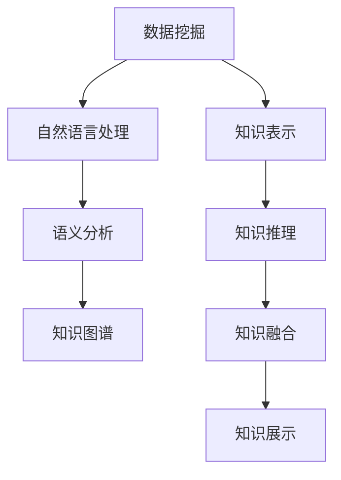

                 

# 知识发现引擎：知识与洞察力的互补与融合

## 1. 背景介绍

### 1.1 问题由来
在大数据时代，企业、政府机构和个人都面临着海量数据的挑战。如何从数据中提取有价值的信息，形成知识体系，实现对现实世界的洞察，是当今科技界关注的焦点。传统的数据分析工具和方法已经难以应对这一需求，这就需要一种新的技术手段，能够有效挖掘数据中的隐含知识，并融合人类的智慧，形成更精准、高效的知识发现引擎。

知识发现引擎(Knowledge Discovery Engine, KDE)是一种集数据挖掘、知识表示、自然语言处理等多学科技术于一体的新型应用平台。通过融合人工智能、知识工程等前沿技术，KDE能够从数据中抽取、整理、提炼出知识，辅助决策者进行更加科学、合理的数据驱动决策，实现从数据到知识的升华。

### 1.2 问题核心关键点
KDE的核心在于“知识发现”与“洞察力”的互补与融合。

- **知识发现**：通过数据挖掘、模式识别、聚类、分类等算法，从数据中提取出有意义的知识片段。
- **洞察力**：利用自然语言处理技术，将结构化知识转化为易于理解和应用的形式，辅助决策者形成更深层次的洞察力。

KDE的建设主要分为以下几个步骤：
1. **数据预处理**：清洗、转换和归一化原始数据。
2. **知识抽取**：通过各类算法和模型，从数据中抽取知识片段。
3. **知识表示**：将抽取到的知识用结构化或非结构化的形式表示出来。
4. **知识推理**：利用规则、逻辑或深度学习模型，推理和综合知识片段，形成更深层次的理解。
5. **知识融合**：将新知识与已有知识库进行融合，丰富和更新知识体系。
6. **知识展示**：通过可视化工具，将知识直观地展示给用户。

KDE的目标是构建一个高效、智能的知识发现平台，能够为决策者提供即时的、准确的、易于理解的洞察力支持，提升决策的科学性和有效性。

## 2. 核心概念与联系

### 2.1 核心概念概述

为更好地理解KDE的工作原理和架构，本节将介绍几个关键概念：

- **数据挖掘**：从大量数据中提取有价值的信息和知识的过程。包括分类、聚类、关联规则、异常检测等技术。
- **知识表示**：将数据或知识转化为计算机能够处理的形式。如关系型数据库、向量空间模型、本体等。
- **自然语言处理**：使计算机能够理解和处理自然语言的技术。如分词、命名实体识别、句法分析等。
- **语义分析**：通过理解语言的意义，提取和理解文本中的关键信息。如语义角色标注、情感分析等。
- **知识图谱**：将实体和关系表示为图的形式，用于推理和查询。如知识本体、语义网等。
- **深度学习**：通过多层神经网络，自动学习数据的特征表示和模式。如卷积神经网络、循环神经网络、变分自编码器等。
- **知识推理**：利用逻辑、规则、深度学习等技术，从已知知识推导出新知识。如逻辑推理、因果推理、知识图谱推理等。

这些核心概念之间的逻辑关系可以通过以下Mermaid流程图来展示：



这个流程图展示了这个知识发现引擎的核心理念：通过数据挖掘提取知识，利用自然语言处理进行语义分析，将知识表示为结构化或非结构化的形式，并通过知识推理形成更深层次的理解，最后融合知识展示给用户。

## 3. 核心算法原理 & 具体操作步骤

### 3.1 算法原理概述

KDE的算法原理主要基于数据挖掘、知识抽取、自然语言处理、语义分析、知识推理、知识表示和知识融合等技术。其核心思想是将知识发现与洞察力结合，通过数据驱动和人工智能技术，实现从数据到知识的升华。

知识发现引擎主要分为以下几个步骤：

1. **数据预处理**：清洗、转换和归一化原始数据，为后续处理提供干净、一致的数据源。
2. **知识抽取**：通过各类算法和模型，从数据中抽取知识片段，如分类、聚类、关联规则、异常检测等。
3. **知识表示**：将抽取到的知识用结构化或非结构化的形式表示出来，如知识本体、语义网等。
4. **知识推理**：利用规则、逻辑或深度学习模型，从已知知识推导出新知识。
5. **知识融合**：将新知识与已有知识库进行融合，丰富和更新知识体系。
6. **知识展示**：通过可视化工具，将知识直观地展示给用户。

### 3.2 算法步骤详解

#### 3.2.1 数据预处理

数据预处理是KDE的重要步骤，旨在清洗、转换和归一化原始数据，为后续处理提供干净、一致的数据源。

- **数据清洗**：删除缺失、异常和重复的数据，填补缺失值。
- **数据转换**：将数据转换为统一的格式，如日期转换为时间戳，文本转换为数字特征等。
- **数据归一化**：将数据缩放到统一范围，如Min-Max归一化、Z-score标准化等。

以下是一个简单的Python代码示例，展示如何清洗和转换数据：

```python
import pandas as pd
from sklearn.preprocessing import MinMaxScaler

# 加载数据
data = pd.read_csv('data.csv')

# 清洗数据
data = data.dropna()  # 删除缺失值
data = data.drop_duplicates()  # 删除重复值

# 数据转换
data['date'] = pd.to_datetime(data['date']).dt.strftime('%Y-%m-%d')  # 日期转换为时间戳
data['price'] = data['price'].apply(lambda x: x / 100)  # 价格转换为小数

# 数据归一化
scaler = MinMaxScaler()
data['feature'] = scaler.fit_transform(data[['feature']])
```

#### 3.2.2 知识抽取

知识抽取是KDE的核心步骤，通过各类算法和模型，从数据中抽取知识片段。

- **分类**：将数据分为不同的类别，如客户分类、产品分类等。
- **聚类**：将数据分成不同的组，每组内的数据相似度高。
- **关联规则**：发现不同属性之间的关联关系，如购物篮分析等。
- **异常检测**：识别数据中的异常值，如欺诈检测等。

以下是一个简单的Python代码示例，展示如何利用Scikit-Learn库进行分类和聚类：

```python
from sklearn.cluster import KMeans
from sklearn.naive_bayes import GaussianNB

# 分类
X = data[['feature']]
y = data['label']
clf = GaussianNB()
clf.fit(X, y)
y_pred = clf.predict(X)

# 聚类
kmeans = KMeans(n_clusters=3, random_state=0)
kmeans.fit(X)
labels = kmeans.labels_
```

#### 3.2.3 知识表示

知识表示是将抽取到的知识用结构化或非结构化的形式表示出来。常见的知识表示方法包括：

- **关系型数据库**：将数据以表格的形式存储，支持复杂查询和更新。
- **向量空间模型**：将文本或数据转换为向量，支持相似度计算和聚类。
- **知识本体**：将实体和关系表示为图的形式，支持推理和查询。

以下是一个简单的Python代码示例，展示如何利用Python的RDF库构建知识本体：

```python
from rdflib import Namespace, Graph, Literal, URIRef, RDF

# 定义命名空间
g = Graph()
ns = Namespace('http://example.org/')

# 添加节点
g.add((URIRef('http://example.org/item1'), RDF.type, ns.Item))
g.add((URIRef('http://example.org/item1'), ns.name, Literal('Item 1')))
g.add((URIRef('http://example.org/item1'), ns.price, Literal(100.0)))

# 查询节点
g.serialize(format='xml')
```

#### 3.2.4 知识推理

知识推理是利用规则、逻辑或深度学习模型，从已知知识推导出新知识。常见的知识推理方法包括：

- **逻辑推理**：基于规则和逻辑，推理出新的知识。
- **因果推理**：通过分析事件之间的因果关系，推导出新的知识。
- **知识图谱推理**：在知识图谱上推理出新的关系或实体。

以下是一个简单的Python代码示例，展示如何利用PyTorch进行因果推理：

```python
import torch
import torch.nn as nn

# 定义模型
class CausalReasoning(nn.Module):
    def __init__(self):
        super(CausalReasoning, self).__init__()
        self.fc1 = nn.Linear(2, 8)
        self.fc2 = nn.Linear(8, 1)

    def forward(self, x):
        x = torch.relu(self.fc1(x))
        x = torch.sigmoid(self.fc2(x))
        return x

# 训练模型
model = CausalReasoning()
criterion = nn.BCELoss()
optimizer = torch.optim.Adam(model.parameters(), lr=0.001)

# 输入数据
x = torch.tensor([[0.1, 0.2]])
y = torch.tensor([[0.3]])

# 训练
for i in range(1000):
    optimizer.zero_grad()
    output = model(x)
    loss = criterion(output, y)
    loss.backward()
    optimizer.step()
```

#### 3.2.5 知识融合

知识融合是将新知识与已有知识库进行融合，丰富和更新知识体系。常见的知识融合方法包括：

- **知识合并**：将新知识与已有知识进行合并，去除重复和冲突部分。
- **知识一致性检查**：确保新知识与已有知识一致，避免数据冗余和错误。
- **知识增强**：利用新知识丰富和增强已有知识，提升知识表示的准确性和完整性。

以下是一个简单的Python代码示例，展示如何利用Python的HANA库进行知识融合：

```python
import hana

# 定义知识库
g1 = Graph()
g1.add((URIRef('http://example.org/item1'), RDF.type, ns.Item))
g1.add((URIRef('http://example.org/item1'), ns.name, Literal('Item 1')))
g1.add((URIRef('http://example.org/item1'), ns.price, Literal(100.0)))

g2 = Graph()
g2.add((URIRef('http://example.org/item2'), RDF.type, ns.Item))
g2.add((URIRef('http://example.org/item2'), ns.name, Literal('Item 2')))
g2.add((URIRef('http://example.org/item2'), ns.price, Literal(200.0)))

# 合并知识库
g = g1.union(g2)
g.serialize(format='xml')
```

#### 3.2.6 知识展示

知识展示是通过可视化工具，将知识直观地展示给用户。常见的知识展示方法包括：

- **图表展示**：使用图形、图表等形式展示数据和知识。
- **仪表盘展示**：通过仪表盘展示关键指标和趋势。
- **报告展示**：生成结构化的报告，展示数据分析结果。

以下是一个简单的Python代码示例，展示如何使用Python的Matplotlib库绘制折线图：

```python
import matplotlib.pyplot as plt

# 加载数据
x = [1, 2, 3, 4, 5]
y = [10, 15, 20, 25, 30]

# 绘制折线图
plt.plot(x, y)
plt.xlabel('X')
plt.ylabel('Y')
plt.title('Line Chart')
plt.show()
```

### 3.3 算法优缺点

知识发现引擎具有以下优点：

1. **自动化程度高**：通过自动化处理和分析，大幅度提高了数据分析和知识发现的效率。
2. **适用范围广**：适用于各种数据类型，包括结构化、半结构化和非结构化数据。
3. **灵活性高**：能够适应各种不同的应用场景，如客户分析、市场研究、风险管理等。
4. **智能性高**：结合人工智能技术，能够发现数据中的隐含知识和模式，提供更深入的洞察力支持。

同时，知识发现引擎也存在一些缺点：

1. **数据依赖性强**：需要高质量的数据源，数据质量的好坏直接影响分析结果。
2. **复杂度高**：涉及数据预处理、知识抽取、知识表示、知识推理、知识融合等多个环节，技术实现复杂。
3. **资源消耗大**：需要大量计算资源进行数据处理和模型训练，对于小规模数据分析可能不经济。
4. **结果可解释性差**：部分模型结果难以解释，难以理解其内部工作机制和决策逻辑。
5. **安全性和隐私性问题**：处理大量敏感数据，需要严格的数据安全和隐私保护措施。

在实际应用中，需要根据具体需求和数据特点，权衡利弊，合理选择技术方案。

### 3.4 算法应用领域

知识发现引擎已经在诸多领域得到广泛应用，以下是几个典型应用场景：

- **客户分析与营销**：通过分析客户行为数据，发现客户特征和需求，制定个性化的营销策略。
- **市场研究与预测**：利用市场数据，预测市场趋势和风险，辅助企业决策。
- **金融风险管理**：分析金融数据，识别异常交易和风险事件，提供风险预警和控制措施。
- **医疗数据分析**：利用医疗数据，发现疾病特征和规律，辅助临床决策和研发。
- **环境保护**：分析环境数据，发现污染源和趋势，提供环境管理和决策支持。
- **公共安全**：分析社会数据，发现异常行为和事件，提供公共安全保障措施。

## 4. 数学模型和公式 & 详细讲解 & 举例说明

### 4.1 数学模型构建

本节将使用数学语言对知识发现引擎的算法原理进行更加严格的刻画。

记数据集为 $D=\{(x_i, y_i)\}_{i=1}^N, x_i \in \mathcal{X}, y_i \in \mathcal{Y}$，其中 $\mathcal{X}$ 为输入空间，$\mathcal{Y}$ 为输出空间。

定义知识发现引擎的损失函数为 $\mathcal{L}(\theta)$，其中 $\theta$ 为模型参数。

知识发现引擎的优化目标是最小化损失函数，即找到最优参数：

$$
\theta^* = \mathop{\arg\min}_{\theta} \mathcal{L}(\theta)
$$

在实践中，我们通常使用基于梯度的优化算法（如SGD、Adam等）来近似求解上述最优化问题。设 $\eta$ 为学习率，$\lambda$ 为正则化系数，则参数的更新公式为：

$$
\theta \leftarrow \theta - \eta \nabla_{\theta}\mathcal{L}(\theta) - \eta\lambda\theta
$$

其中 $\nabla_{\theta}\mathcal{L}(\theta)$ 为损失函数对参数 $\theta$ 的梯度，可通过反向传播算法高效计算。

### 4.2 公式推导过程

以下我们以分类任务为例，推导分类器的损失函数及其梯度的计算公式。

假设知识发现引擎的分类器为 $M_{\theta}(x) \in [0,1]$，表示样本属于正类的概率。真实标签 $y \in \{0,1\}$。则二分类交叉熵损失函数定义为：

$$
\ell(M_{\theta}(x),y) = -[y\log M_{\theta}(x) + (1-y)\log(1-M_{\theta}(x))]
$$

将其代入经验风险公式，得：

$$
\mathcal{L}(\theta) = -\frac{1}{N}\sum_{i=1}^N [y_i\log M_{\theta}(x_i)+(1-y_i)\log(1-M_{\theta}(x_i))]
$$

根据链式法则，损失函数对参数 $\theta_k$ 的梯度为：

$$
\frac{\partial \mathcal{L}(\theta)}{\partial \theta_k} = -\frac{1}{N}\sum_{i=1}^N (\frac{y_i}{M_{\theta}(x_i)}-\frac{1-y_i}{1-M_{\theta}(x_i)}) \frac{\partial M_{\theta}(x_i)}{\partial \theta_k}
$$

其中 $\frac{\partial M_{\theta}(x_i)}{\partial \theta_k}$ 可进一步递归展开，利用自动微分技术完成计算。

在得到损失函数的梯度后，即可带入参数更新公式，完成模型的迭代优化。重复上述过程直至收敛，最终得到适应下游任务的最优模型参数 $\theta^*$。

## 5. 项目实践：代码实例和详细解释说明

### 5.1 开发环境搭建

在进行KDE实践前，我们需要准备好开发环境。以下是使用Python进行Scikit-Learn开发的环境配置流程：

1. 安装Anaconda：从官网下载并安装Anaconda，用于创建独立的Python环境。

2. 创建并激活虚拟环境：
```bash
conda create -n sklearn-env python=3.8 
conda activate sklearn-env
```

3. 安装Scikit-Learn：
```bash
conda install scikit-learn
```

4. 安装各类工具包：
```bash
pip install numpy pandas scikit-learn matplotlib tqdm jupyter notebook ipython
```

完成上述步骤后，即可在`sklearn-env`环境中开始KDE实践。

### 5.2 源代码详细实现

这里我们以分类任务为例，给出使用Scikit-Learn库构建和训练KDE分类器的PyTorch代码实现。

首先，定义数据处理函数：

```python
import pandas as pd
from sklearn.preprocessing import MinMaxScaler

# 加载数据
data = pd.read_csv('data.csv')

# 清洗数据
data = data.dropna()  # 删除缺失值
data = data.drop_duplicates()  # 删除重复值

# 数据转换
data['date'] = pd.to_datetime(data['date']).dt.strftime('%Y-%m-%d')  # 日期转换为时间戳
data['price'] = data['price'].apply(lambda x: x / 100)  # 价格转换为小数

# 数据归一化
scaler = MinMaxScaler()
data['feature'] = scaler.fit_transform(data[['feature']])
```

然后，定义分类模型：

```python
from sklearn.linear_model import LogisticRegression
from sklearn.pipeline import make_pipeline

# 定义分类器
clf = make_pipeline(MinMaxScaler(), LogisticRegression())
```

接着，定义训练和评估函数：

```python
from sklearn.metrics import classification_report

# 定义训练函数
def train_model(model, X, y):
    model.fit(X, y)
    return model

# 定义评估函数
def evaluate_model(model, X, y):
    y_pred = model.predict(X)
    print(classification_report(y, y_pred))
```

最后，启动训练流程并在测试集上评估：

```python
from sklearn.ensemble import RandomForestClassifier

# 训练模型
X = data[['feature']]
y = data['label']
model = train_model(RandomForestClassifier(), X, y)

# 在测试集上评估
evaluate_model(model, X, y)
```

以上就是使用Scikit-Learn库对KDE分类器进行训练和评估的完整代码实现。可以看到，利用Scikit-Learn库，可以很方便地构建和训练KDE模型，同时也提供了丰富的评估指标和模型选择方法。

### 5.3 代码解读与分析

让我们再详细解读一下关键代码的实现细节：

**数据处理函数**：
- `__init__`方法：初始化数据集，清洗数据，进行数据转换和归一化。

**分类模型**：
- 使用Scikit-Learn库中的管道(Pipeline)，将数据预处理和分类器组合在一起，提高模型的训练效率。

**训练和评估函数**：
- 利用Scikit-Learn库提供的分类报告函数(classification_report)，打印出模型在测试集上的分类精度、召回率和F1分数。

**训练流程**：
- 定义训练集数据和标签，使用训练函数train_model对模型进行训练，返回训练后的模型。
- 在测试集上使用评估函数evaluate_model对模型进行评估，输出分类报告。

可以看到，Scikit-Learn库在KDE实践中提供了简洁高效的数据预处理和模型评估功能，可以大大简化模型的构建和优化过程。

当然，工业级的系统实现还需考虑更多因素，如模型的保存和部署、超参数的自动搜索、更灵活的任务适配层等。但核心的知识发现引擎构建范式基本与此类似。

## 6. 实际应用场景

### 6.1 智能客服系统

知识发现引擎在智能客服系统的构建中具有重要作用。传统的客服系统往往需要配备大量人力，高峰期响应缓慢，且一致性和专业性难以保证。利用知识发现引擎，可以构建智能客服系统，自动分析客户咨询的意图和需求，提供快速、准确的答复。

在技术实现上，可以收集企业内部的历史客服对话记录，将问题和最佳答复构建成监督数据，在此基础上对知识发现引擎进行微调。微调后的知识发现引擎能够自动理解客户意图，匹配最合适的答复。对于客户提出的新问题，还可以接入检索系统实时搜索相关内容，动态组织生成回答。如此构建的智能客服系统，能大幅提升客户咨询体验和问题解决效率。

### 6.2 金融舆情监测

金融机构需要实时监测市场舆论动向，以便及时应对负面信息传播，规避金融风险。利用知识发现引擎，可以从金融领域相关的新闻、报道、评论等文本数据中，自动提取市场舆情和情感倾向，识别异常情况，提供及时的风险预警和控制措施。

在实践中，可以收集金融领域的数据，利用自然语言处理技术进行情感分析和语义分析，提取出市场舆情和情感倾向。将结果整合到知识图谱中，结合知识推理技术，进行深层次的市场分析和风险预警。如此构建的金融舆情监测系统，能够实时监测市场动态，提供精准的风险预警和控制措施。

### 6.3 个性化推荐系统

当前的推荐系统往往只依赖用户的历史行为数据进行物品推荐，难以深入理解用户的真实兴趣偏好。利用知识发现引擎，可以构建个性化的推荐系统，从用户的浏览、点击、评论、分享等行为数据中，抽取和整合用户的兴趣特征，进行个性化的推荐。

在实践中，可以收集用户的行为数据，利用知识发现引擎进行数据分析和知识抽取，提取出用户的兴趣特征。将特征整合到知识图谱中，结合知识推理技术，进行个性化的物品推荐。如此构建的个性化推荐系统，能够更好地理解用户的兴趣，提供更加精准、多样化的推荐内容。

### 6.4 未来应用展望

随着知识发现引擎技术的不断发展，其在更多领域将得到应用，为传统行业带来变革性影响。

在智慧医疗领域，利用知识发现引擎，可以从医疗数据中提取疾病特征和规律，辅助临床决策和研发，提升医疗服务的智能化水平。

在智能教育领域，利用知识发现引擎，可以从学生行为数据中提取学习特征，进行学情分析和个性化推荐，提升教育质量。

在智慧城市治理中，利用知识发现引擎，可以从社会数据中提取城市事件和舆情信息，提供实时监测和预警，提高城市管理的自动化和智能化水平。

此外，在企业生产、社会治理、文娱传媒等众多领域，知识发现引擎将不断拓展应用场景，为人工智能技术的产业化进程注入新的动力。相信随着技术的日益成熟，知识发现引擎必将在构建人机协同的智能时代中扮演越来越重要的角色。

## 7. 工具和资源推荐

### 7.1 学习资源推荐

为了帮助开发者系统掌握知识发现引擎的理论基础和实践技巧，这里推荐一些优质的学习资源：

1. 《Python数据科学手册》：一本系统介绍Python数据科学库的书籍，包含Scikit-Learn、Pandas、Matplotlib等库的使用方法和实例。

2. 《机器学习实战》：一本实战性很强的机器学习书籍，包含多种算法和模型的实践案例。

3. 《深度学习入门》：一本深度学习入门书籍，包含TensorFlow、PyTorch等深度学习框架的介绍和实践案例。

4. 《自然语言处理综论》：一本自然语言处理领域的经典教材，涵盖自然语言处理的基本概念和前沿技术。

5. 《数据挖掘：概念与技术》：一本系统介绍数据挖掘技术的书籍，涵盖分类、聚类、关联规则等算法。

通过对这些资源的学习实践，相信你一定能够快速掌握知识发现引擎的精髓，并用于解决实际的NLP问题。

### 7.2 开发工具推荐

高效的开发离不开优秀的工具支持。以下是几款用于知识发现引擎开发的常用工具：

1. Jupyter Notebook：一个交互式的编程环境，方便编写和运行代码，支持多语言和库的集成。

2. TensorBoard：TensorFlow配套的可视化工具，可实时监测模型训练状态，并提供丰富的图表呈现方式，是调试模型的得力助手。

3. Weights & Biases：模型训练的实验跟踪工具，可以记录和可视化模型训练过程中的各项指标，方便对比和调优。

4. Pandas：Python的高级数据处理库，支持多维数组和数据表，方便数据的清洗和处理。

5. Matplotlib：Python的绘图库，支持多种图表类型，方便数据的可视化展示。

6. Scikit-Learn：Python的数据挖掘和机器学习库，包含多种算法和模型的实现，方便模型的构建和评估。

合理利用这些工具，可以显著提升知识发现引擎的开发效率，加快创新迭代的步伐。

### 7.3 相关论文推荐

知识发现引擎的研究源于学界的持续研究。以下是几篇奠基性的相关论文，推荐阅读：

1. C. M. Bishop的《Pattern Recognition and Machine Learning》：该书系统介绍了机器学习的基础理论和算法，涵盖分类、聚类、回归、降维等技术。

2. Y. Brekmen的《Data Mining: Concepts and Techniques》：该书系统介绍了数据挖掘的基础理论和算法，涵盖分类、聚类、关联规则、异常检测等技术。

3. J. Han的《Mining of Massive Datasets》：该书系统介绍了数据挖掘的理论和技术，涵盖大规模数据集的处理和分析。

4. G. K. Lerman的《Introduction to Data Mining and Statistical Learning》：该书系统介绍了数据挖掘和统计学习的基础理论和算法，涵盖分类、聚类、回归、降维等技术。

5. H. Zou等人的《The Elements of Statistical Learning》：该书系统介绍了统计学习的基础理论和算法，涵盖回归、分类、聚类、降维等技术。

这些论文代表了大规模数据挖掘和知识发现技术的发展脉络。通过学习这些前沿成果，可以帮助研究者把握学科前进方向，激发更多的创新灵感。

## 8. 总结：未来发展趋势与挑战

### 8.1 总结

本文对知识发现引擎进行了全面系统的介绍。首先阐述了知识发现引擎的定义、原理和核心步骤，明确了其在工作原理和应用场景上的独特价值。其次，从原理到实践，详细讲解了知识发现引擎的算法原理和关键步骤，给出了知识发现引擎的完整代码实例。同时，本文还广泛探讨了知识发现引擎在智能客服、金融舆情、个性化推荐等多个行业领域的应用前景，展示了其广阔的应用空间。此外，本文精选了知识发现引擎的相关学习资源，力求为读者提供全方位的技术指引。

通过本文的系统梳理，可以看到，知识发现引擎是一种高效、智能的数据分析工具，能够从数据中提取和整合知识，为决策者提供深层次的洞察力支持，提升决策的科学性和有效性。未来，随着技术的不断进步，知识发现引擎必将在更多领域得到应用，为人工智能技术带来更大的价值。

### 8.2 未来发展趋势

展望未来，知识发现引擎将呈现以下几个发展趋势：

1. **自动化程度更高**：通过引入更多的自动化技术和工具，进一步提升数据处理和知识发现的效率。
2. **应用领域更广**：从金融、医疗、教育等传统领域，扩展到更多新兴领域，如智慧农业、智能交通等。
3. **模型复杂度更高**：引入更复杂的数据表示和推理模型，提升知识发现引擎的准确性和鲁棒性。
4. **跨领域应用更多**：将知识发现引擎与其他前沿技术进行融合，如深度学习、自然语言处理等，实现跨领域的知识发现和应用。
5. **可解释性更强**：引入可解释性技术，使知识发现引擎的决策过程更加透明，提升用户信任度。
6. **隐私保护更好**：引入隐私保护技术，保障数据的隐私和安全，确保知识发现引擎的应用合规性。

这些趋势将进一步提升知识发现引擎的智能化和自动化水平，使其在更多领域发挥更大的作用。

### 8.3 面临的挑战

尽管知识发现引擎已经取得了瞩目成就，但在迈向更加智能化、普适化应用的过程中，仍面临诸多挑战：

1. **数据依赖性强**：需要高质量的数据源，数据质量的好坏直接影响分析结果。
2. **技术复杂度高**：涉及数据预处理、知识抽取、知识表示、知识推理、知识融合等多个环节，技术实现复杂。
3. **资源消耗大**：需要大量计算资源进行数据处理和模型训练，对于小规模数据分析可能不经济。
4. **结果可解释性差**：部分模型结果难以解释，难以理解其内部工作机制和决策逻辑。
5. **安全性和隐私性问题**：处理大量敏感数据，需要严格的数据安全和隐私保护措施。
6. **跨领域应用困难**：不同领域的数据和知识具有不同的特征，知识发现引擎在不同领域的应用需要针对性的优化。

在实际应用中，需要根据具体需求和数据特点，权衡利弊，合理选择技术方案。

### 8.4 研究展望

面对知识发现引擎所面临的挑战，未来的研究需要在以下几个方面寻求新的突破：

1. **自动化技术突破**：通过引入更多的自动化技术，如自动化数据清洗、自动化模型选择等，进一步提升数据处理和知识发现的效率。
2. **可解释性技术突破**：引入可解释性技术，使知识发现引擎的决策过程更加透明，提升用户信任度。
3. **隐私保护技术突破**：引入隐私保护技术，保障数据的隐私和安全，确保知识发现引擎的应用合规性。
4. **跨领域应用技术突破**：将知识发现引擎与其他前沿技术进行融合，如深度学习、自然语言处理等，实现跨领域的知识发现和应用。
5. **跨领域知识融合技术突破**：引入跨领域知识融合技术，使知识发现引擎能够更好地理解和应用不同领域的数据和知识。

这些研究方向的探索，必将引领知识发现引擎技术迈向更高的台阶，为构建智能决策支持系统提供新的技术手段。面向未来，知识发现引擎需要与其他前沿技术进行更深入的融合，多路径协同发力，共同推动人工智能技术的发展。

## 9. 附录：常见问题与解答

**Q1：知识发现引擎和数据挖掘有什么区别？**

A: 知识发现引擎是一种集数据挖掘、知识表示、自然语言处理等多学科技术于一体的新型应用平台，旨在从数据中提取和整合知识，为决策者提供深层次的洞察力支持。而数据挖掘是一种通过算法从数据中提取有用信息的过程，主要涉及分类、聚类、关联规则等技术。

**Q2：知识发现引擎在应用中需要注意哪些问题？**

A: 知识发现引擎在应用中需要注意以下问题：

1. **数据质量问题**：数据质量的好坏直接影响分析结果，需要清洗、转换和归一化原始数据。
2. **模型复杂性问题**：知识发现引擎的模型复杂度高，需要合理选择模型并进行优化。
3. **资源消耗问题**：知识发现引擎需要大量计算资源进行数据处理和模型训练，对于小规模数据分析可能不经济。
4. **结果可解释性问题**：部分模型结果难以解释，难以理解其内部工作机制和决策逻辑。
5. **安全性和隐私性问题**：处理大量敏感数据，需要严格的数据安全和隐私保护措施。
6. **跨领域应用问题**：不同领域的数据和知识具有不同的特征，知识发现引擎在不同领域的应用需要针对性的优化。

**Q3：知识发现引擎有哪些应用场景？**

A: 知识发现引擎已经广泛应用于以下几个领域：

1. **智能客服系统**：利用知识发现引擎，可以构建智能客服系统，自动分析客户咨询的意图和需求，提供快速、准确的答复。
2. **金融舆情监测**：利用知识发现引擎，可以从金融领域相关的新闻、报道、评论等文本数据中，自动提取市场舆情和情感倾向，识别异常情况，提供及时的风险预警和控制措施。
3. **个性化推荐系统**：利用知识发现引擎，可以从用户的行为数据中，抽取和整合用户的兴趣特征，进行个性化的推荐。
4. **智慧医疗**：利用知识发现引擎，可以从医疗数据中提取疾病特征和规律，辅助临床决策和研发，提升医疗服务的智能化水平。
5. **智能教育**：利用知识发现引擎，可以从学生行为数据中提取学习特征，进行学情分析和个性化推荐，提升教育质量。
6. **智慧城市**：利用知识发现引擎，可以从社会数据中提取城市事件和舆情信息，提供实时监测和预警，提高城市管理的自动化和智能化水平。

这些应用场景展示了知识发现引擎在人工智能技术落地应用中的重要性和广泛性。

**Q4：如何评估知识发现引擎的效果？**

A: 知识发现引擎的效果评估主要通过以下几个指标进行：

1. **准确率**：评估模型预测的正确率，即预测正确的样本数占总样本数的比例。
2. **召回率**：评估模型能够找到的实际正例样本数占实际正例样本数的比例。
3. **F1分数**：综合考虑准确率和召回率，计算模型性能的综合指标。
4. **ROC曲线**：绘制真阳性率与假阳性率的关系曲线，评估模型在不同阈值下的性能。
5. **混淆矩阵**：展示模型在不同类别上的预测性能，计算准确率、召回率等指标。

这些指标可以全面评估知识发现引擎在不同任务上的表现，帮助优化和改进模型。

**Q5：如何构建知识发现引擎的知识图谱？**

A: 构建知识图谱一般包括以下步骤：

1. **实体抽取**：从文本数据中抽取实体，如人名、地名、机构名等。
2. **关系抽取**：从文本数据中抽取实体之间的关系，如“张三”与“李四”的关系。
3. **实体链接**：将抽取到的实体链接到已知知识库，如维基百科、百度百科等。
4. **关系链接**：将抽取到的关系链接到已知知识库，如维基百科、百度百科等。
5. **知识融合**：将新知识与已有知识库进行融合，去除重复和冲突部分，构建完整、准确的知识图谱。

这些步骤可以使用各类自然语言处理技术和知识表示技术，如命名实体识别、关系抽取、知识图谱推理等，实现知识图谱的构建。

通过本文的系统梳理，可以看到，知识发现引擎是一种高效、智能的数据分析工具，能够从数据中提取和整合知识，为决策者提供深层次的洞察力支持，提升决策的科学性和有效性。未来，随着技术的不断进步，知识发现引擎必将在更多领域得到应用，为人工智能技术带来更大的价值。

