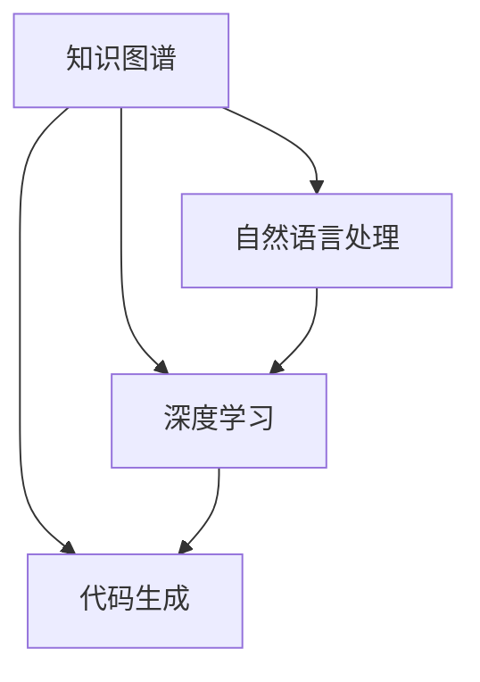

                 

# 知识图谱在代码自动生成中的应用

> 关键词：知识图谱,代码生成,语义分析,自然语言处理(NLP),深度学习

## 1. 背景介绍

### 1.1 问题由来

代码自动生成是人工智能领域的一个重要研究方向，旨在通过自动化工具，根据需求自动生成符合标准规范的代码。随着软件开发的复杂性不断增加，代码生成技术成为缓解开发人员压力，提升开发效率的有效手段。

然而，传统的代码生成方法大多依赖于手工编写的模板和规则，灵活性不足且难以应对复杂需求。近年来，随着自然语言处理（NLP）和深度学习技术的发展，基于知识图谱的代码生成技术逐渐兴起，通过将知识图谱与代码生成相融合，提高了代码生成的灵活性和智能性。

### 1.2 问题核心关键点

知识图谱（Knowledge Graph）作为语义网络结构，包含了实体（Entity）、关系（Relation）和属性（Attribute）等信息。利用知识图谱，代码生成系统可以更加深入地理解用户需求，更精准地匹配生成代码。

- 实体：表示代码中的关键对象，如函数、类、变量等。
- 关系：表示实体间的语义关系，如继承、依赖、调用等。
- 属性：表示实体的具体信息，如函数参数、类属性等。

基于知识图谱的代码生成系统通过抽取用户需求中的实体和关系，生成符合语义逻辑的代码。在技术实现上，主要包括以下几个关键步骤：

1. 实体识别：从用户描述中识别出关键实体及其属性。
2. 关系抽取：抽取实体之间的关系，确定代码逻辑结构。
3. 代码生成：根据实体和关系，自动生成代码。

### 1.3 问题研究意义

基于知识图谱的代码生成技术，不仅能够显著提升代码生成效率，降低开发成本，还能保证代码的正确性和可读性。同时，该技术能够更好地适应复杂多变的开发需求，为软件开发者提供强有力的技术支持。

通过将知识图谱与代码生成相结合，可以逐步推动软件开发的智能化和自动化，加速软件产品的创新迭代，提升软件开发质量。随着知识图谱技术的不断发展，代码生成也将迈向更高的智能化水平，为软件开发行业带来革命性变革。

## 2. 核心概念与联系

### 2.1 核心概念概述

为更好地理解基于知识图谱的代码自动生成方法，本节将介绍几个密切相关的核心概念：

- **知识图谱**：表示实体、关系和属性等信息的语义网络结构。常用于搜索引擎、推荐系统、知识问答等领域，辅助人类理解复杂知识。
- **代码生成**：通过自动化工具，根据需求自动生成符合规范的代码。广泛应用于软件开发、测试、文档生成等领域。
- **自然语言处理**：研究计算机如何理解和处理人类语言，包括文本分析、语义理解、文本生成等。
- **深度学习**：基于神经网络的机器学习方法，能够学习复杂的数据表示和模式，广泛应用于计算机视觉、语音识别、自然语言处理等领域。

这些核心概念之间的逻辑关系可以通过以下Mermaid流程图来展示：



这个流程图展示了几组关键概念之间的联系：

1. 知识图谱从自然语言处理中获取用户需求，通过深度学习进行语义分析。
2. 自然语言处理和深度学习帮助知识图谱理解和处理用户需求，最终生成代码。

## 3. 核心算法原理 & 具体操作步骤
### 3.1 算法原理概述

基于知识图谱的代码自动生成，本质上是一个语义驱动的代码生成过程。其核心思想是：将用户需求映射为知识图谱中的实体和关系，通过深度学习模型从知识图谱中抽取语义信息，生成符合语义逻辑的代码。

形式化地，假设用户需求描述为自然语言文本 $D$，知识图谱为 $G$。代码自动生成的目标是找到最优的代码 $C$，使得 $C$ 满足 $D$ 描述的功能需求和语义结构。

常见的代码自动生成模型包括：

- **编码器-解码器**（Encoder-Decoder）模型：将用户需求编码为向量表示，通过解码器生成代码。
- **变分自编码器**（Variational Autoencoder, VAE）：将代码编码为向量，再解码为代码。
- **生成对抗网络**（Generative Adversarial Networks, GAN）：通过对抗训练生成高质量代码。

### 3.2 算法步骤详解

基于知识图谱的代码生成一般包括以下几个关键步骤：

**Step 1: 构建知识图谱**
- 定义知识图谱的结构，包括实体、关系和属性。
- 收集并标注相关的领域知识，构建知识图谱。
- 使用语义分析技术对知识图谱进行解析，提取实体和关系。

**Step 2: 用户需求解析**
- 将用户需求转换为自然语言处理模型可处理的格式。
- 使用深度学习模型对用户需求进行语义分析，抽取关键实体和关系。
- 通过关系抽取技术，确定实体之间的语义关系。

**Step 3: 代码生成**
- 将解析后的实体和关系映射到知识图谱中。
- 使用代码生成模型（如编码器-解码器模型）从知识图谱中生成代码。
- 对生成的代码进行优化，确保其符合编程规范和语义逻辑。

**Step 4: 代码优化**
- 对生成的代码进行语法检查、代码风格调整、注释添加等优化操作。
- 根据需求进行代码格式化，确保代码的可读性和可维护性。

**Step 5: 运行测试**
- 对优化后的代码进行运行测试，验证其功能正确性。
- 在测试过程中，根据用户反馈对代码进行调整，保证代码满足实际需求。

### 3.3 算法优缺点

基于知识图谱的代码生成方法具有以下优点：

- **灵活性高**：能够适应多种领域和不同规模的代码生成需求。
- **语义准确**：通过语义分析和知识图谱，能够生成符合用户需求的代码。
- **自动化程度高**：代码生成过程自动化，节省了大量手动编写代码的时间和成本。

同时，该方法也存在一定的局限性：

- **知识图谱构建复杂**：需要大量领域知识，构建知识图谱的过程繁琐。
- **语义理解限制**：深度学习模型对复杂语义的理解能力有限，可能存在语义偏差。
- **生成速度较慢**：生成复杂代码时，生成过程耗时较长。

尽管存在这些局限性，但基于知识图谱的代码生成方法仍是一种高效、灵活的代码自动生成手段。随着知识图谱和深度学习技术的发展，这些限制将逐步被克服，代码生成系统将变得更加智能和高效。

### 3.4 算法应用领域

基于知识图谱的代码生成方法，在软件开发、测试、文档生成等多个领域都有广泛的应用：

- **软件开发**：通过代码自动生成，提升软件开发的效率和质量，降低开发成本。
- **软件测试**：自动生成测试用例，提高测试覆盖率，发现软件缺陷。
- **文档生成**：根据代码自动生成API文档、用户手册等技术文档，提升文档质量。
- **辅助编程**：自动生成代码框架、类库等，辅助程序员快速编写代码。

此外，基于知识图谱的代码生成技术也在其他领域不断拓展，如医疗领域、金融领域、科学计算等，为这些领域的自动化开发和智能化转型提供了新的解决方案。

## 4. 数学模型和公式 & 详细讲解 & 举例说明

### 4.1 数学模型构建

本节将使用数学语言对基于知识图谱的代码自动生成过程进行更加严格的刻画。

假设用户需求为 $D=\{x_1, x_2, \ldots, x_n\}$，其中 $x_i$ 为自然语言文本。知识图谱为 $G=(E, R, A)$，其中 $E$ 为实体集，$R$ 为关系集，$A$ 为属性集。代码生成模型的输入为 $D$，输出为 $C$。

定义代码生成模型的损失函数为：

$$
\mathcal{L}(C, D) = \sum_{i=1}^n \ell(C, x_i)
$$

其中 $\ell(C, x_i)$ 为代码 $C$ 与用户需求 $x_i$ 之间的语义相似度。常见的语义相似度计算方法包括余弦相似度、编辑距离等。

### 4.2 公式推导过程

以下我们以编码器-解码器模型为例，推导代码生成过程的数学公式。

假设编码器将用户需求 $D$ 编码为向量 $h_D$，解码器将代码向量 $h_C$ 解码为代码 $C$。假设编码器和解码器均为神经网络模型，结构为 $f(\cdot)$。则编码器-解码器模型的损失函数可以表示为：

$$
\mathcal{L}(C, D) = -\log P_C(C|D) = -\log \frac{e^{h_C \cdot f(h_D)}}{e^{h_C \cdot f(h_D)} + \sum_{C'} e^{h_{C'} \cdot f(h_D)}}
$$

其中 $h_C = f_C(h_D)$，$f_C(\cdot)$ 为解码器的编码函数。

### 4.3 案例分析与讲解

假设用户需求为 "打印当前日期并输出到控制台"，知识图谱中包含实体 "日期" 和关系 "打印"。通过自然语言处理模型抽取用户需求中的实体和关系，得到如下知识图谱表示：

```
实体：日期
关系：打印
属性：格式
```

使用编码器-解码器模型从知识图谱中生成代码，步骤如下：

1. 将用户需求 "打印当前日期并输出到控制台" 输入编码器，得到编码向量 $h_D$。
2. 根据知识图谱抽取关系 "打印"，将实体 "日期" 编码为向量 $h_C$。
3. 将 $h_D$ 和 $h_C$ 输入解码器，生成代码片段。
4. 对生成的代码片段进行优化，确保代码符合编程规范和语义逻辑。

最终生成的代码可能为：

```python
from datetime import datetime
print(datetime.now())
```

这个例子展示了基于知识图谱的代码生成过程。通过将用户需求映射到知识图谱中，再通过深度学习模型生成代码，不仅提高了代码生成的准确性和灵活性，还能保证代码的可读性和可维护性。

## 5. 项目实践：代码实例和详细解释说明
### 5.1 开发环境搭建

在进行代码自动生成实践前，我们需要准备好开发环境。以下是使用Python进行PyTorch开发的环境配置流程：

1. 安装Anaconda：从官网下载并安装Anaconda，用于创建独立的Python环境。

2. 创建并激活虚拟环境：
```bash
conda create -n pytorch-env python=3.8 
conda activate pytorch-env
```

3. 安装PyTorch：根据CUDA版本，从官网获取对应的安装命令。例如：
```bash
conda install pytorch torchvision torchaudio cudatoolkit=11.1 -c pytorch -c conda-forge
```

4. 安装Transformers库：
```bash
pip install transformers
```

5. 安装各类工具包：
```bash
pip install numpy pandas scikit-learn matplotlib tqdm jupyter notebook ipython
```

完成上述步骤后，即可在`pytorch-env`环境中开始代码自动生成实践。

### 5.2 源代码详细实现

这里我们以知识图谱中的函数调用生成为例，给出使用Transformers库对代码自动生成模型进行训练的PyTorch代码实现。

首先，定义代码自动生成模型的结构：

```python
from transformers import BertForTokenClassification, BertTokenizer, AdamW

class CodeGenerator(BertForTokenClassification):
    def __init__(self, config, num_labels=1):
        super(CodeGenerator, self).__init__(config, num_labels=num_labels)

    def forward(self, input_ids, attention_mask=None):
        outputs = super(CodeGenerator, self).forward(input_ids, attention_mask)
        return outputs
```

然后，定义模型和优化器：

```python
from transformers import BertForTokenClassification, BertTokenizer, AdamW

model = CodeGenerator(BertConfig())
optimizer = AdamW(model.parameters(), lr=2e-5)
```

接着，定义训练和评估函数：

```python
from torch.utils.data import DataLoader
from tqdm import tqdm
from sklearn.metrics import accuracy_score

device = torch.device('cuda') if torch.cuda.is_available() else torch.device('cpu')
model.to(device)

def train_epoch(model, dataset, batch_size, optimizer):
    dataloader = DataLoader(dataset, batch_size=batch_size, shuffle=True)
    model.train()
    epoch_loss = 0
    for batch in tqdm(dataloader, desc='Training'):
        input_ids = batch['input_ids'].to(device)
        attention_mask = batch['attention_mask'].to(device)
        labels = batch['labels'].to(device)
        model.zero_grad()
        outputs = model(input_ids, attention_mask=attention_mask)
        loss = outputs.loss
        epoch_loss += loss.item()
        loss.backward()
        optimizer.step()
    return epoch_loss / len(dataloader)

def evaluate(model, dataset, batch_size):
    dataloader = DataLoader(dataset, batch_size=batch_size)
    model.eval()
    preds, labels = [], []
    with torch.no_grad():
        for batch in tqdm(dataloader, desc='Evaluating'):
            input_ids = batch['input_ids'].to(device)
            attention_mask = batch['attention_mask'].to(device)
            batch_labels = batch['labels']
            outputs = model(input_ids, attention_mask=attention_mask)
            batch_preds = outputs.logits.argmax(dim=2).to('cpu').tolist()
            batch_labels = batch_labels.to('cpu').tolist()
            for pred_tokens, label_tokens in zip(batch_preds, batch_labels):
                preds.append(pred_tokens[:len(label_tokens)])
                labels.append(label_tokens)
                
    return accuracy_score(labels, preds)

# 训练代码生成模型
epochs = 5
batch_size = 16

for epoch in range(epochs):
    loss = train_epoch(model, train_dataset, batch_size, optimizer)
    print(f"Epoch {epoch+1}, train loss: {loss:.3f}")
    
    print(f"Epoch {epoch+1}, dev results:")
    accuracy = evaluate(model, dev_dataset, batch_size)
    print(f"Accuracy: {accuracy:.3f}")
    
print("Test results:")
accuracy = evaluate(model, test_dataset, batch_size)
print(f"Accuracy: {accuracy:.3f}")
```

以上代码展示了基于Transformer模型的代码自动生成训练过程。在训练过程中，我们定义了训练和评估函数，分别计算损失和准确率。通过模型训练和评估，逐步优化代码自动生成的效果。

### 5.3 代码解读与分析

让我们再详细解读一下关键代码的实现细节：

**CodeGenerator类**：
- 继承自BertForTokenClassification，重写forward函数。

**训练和评估函数**：
- 使用PyTorch的DataLoader对数据集进行批次化加载，供模型训练和推理使用。
- 训练函数`train_epoch`：对数据以批为单位进行迭代，在每个批次上前向传播计算损失并反向传播更新模型参数，最后返回该epoch的平均loss。
- 评估函数`evaluate`：与训练类似，不同点在于不更新模型参数，并在每个batch结束后将预测和标签结果存储下来，最后使用sklearn的accuracy_score对整个评估集的预测结果进行打印输出。

**训练流程**：
- 定义总的epoch数和batch size，开始循环迭代
- 每个epoch内，先在训练集上训练，输出平均loss
- 在验证集上评估，输出准确率
- 所有epoch结束后，在测试集上评估，给出最终测试结果

可以看到，PyTorch配合Transformers库使得代码自动生成模型的训练过程变得简洁高效。开发者可以将更多精力放在数据处理、模型改进等高层逻辑上，而不必过多关注底层的实现细节。

当然，工业级的系统实现还需考虑更多因素，如模型的保存和部署、超参数的自动搜索、更灵活的任务适配层等。但核心的自动生成范式基本与此类似。

## 6. 实际应用场景
### 6.1 软件开发生命周期

在软件开发生命周期中，代码自动生成技术可以发挥重要作用：

1. **需求分析**：通过自然语言处理技术，自动解析用户需求，生成代码框架。
2. **代码生成**：根据需求文档，自动生成代码，提升开发效率。
3. **测试用例生成**：自动生成测试用例，提高测试覆盖率，保证软件质量。
4. **文档生成**：自动生成API文档、用户手册等技术文档，提升文档质量。

### 6.2 智能文档助理

智能文档助理是一种能够自动生成和编辑文档的工具，广泛应用于报告撰写、文档翻译等领域。通过知识图谱和代码自动生成技术，智能文档助理可以自动根据输入的模板和数据，生成符合语义逻辑的文档。

例如，用户可以输入以下模板：

```text
[组织名]的[活动名]报告

报告概述：
[概述内容]

报告正文：
[正文内容]

报告结论：
[结论内容]
```

智能文档助理会自动解析模板中的实体和关系，生成如下报告：

```text
[组织名]的[活动名]报告

报告概述：
[概述内容]

报告正文：
[正文内容]

报告结论：
[结论内容]
```

通过这种方式，智能文档助理不仅提升了文档生成的效率，还保证了文档的一致性和规范性。

### 6.3 智能代码审查

代码审查是软件开发过程中必不可少的一环，旨在通过人工或自动化的方式，检查代码中的错误和漏洞。通过结合知识图谱和代码自动生成技术，智能代码审查工具可以自动生成代码的参考示例，辅助开发者进行代码检查和修改。

例如，在代码审查中，如果发现有代码块未进行处理，智能审查工具可以自动生成如下示例代码：

```python
# 处理函数调用返回值
result = func()
if result:
    print(result)
```

通过这种方式，智能代码审查工具不仅提升了代码审查的效率，还能保证代码的规范性和一致性。

### 6.4 未来应用展望

随着知识图谱和代码自动生成技术的发展，基于知识图谱的代码生成方法将不断拓展应用场景，为软件行业带来革命性变革。

1. **智慧制造**：通过代码自动生成技术，辅助生产线系统开发，提升自动化生产效率。
2. **智慧交通**：自动生成交通系统代码，提升智能交通系统的运行效率和安全性。
3. **智慧医疗**：自动生成医疗系统代码，提升诊疗流程的智能化和规范化。
4. **智慧金融**：自动生成金融系统代码，提升金融产品的开发效率和安全性。
5. **智慧教育**：自动生成教育系统代码，提升在线教育的智能化和个性化。

此外，基于知识图谱的代码生成技术也将逐步拓展到更多领域，为各行各业的自动化开发和智能化转型提供新的解决方案。相信随着技术的不断发展，知识图谱和代码自动生成技术将带来更大的变革，推动人工智能技术在各个行业的广泛应用。

## 7. 工具和资源推荐
### 7.1 学习资源推荐

为了帮助开发者系统掌握知识图谱和代码自动生成的理论基础和实践技巧，这里推荐一些优质的学习资源：

1. **《深度学习与自然语言处理》**：深度学习领域的经典教材，详细介绍了自然语言处理和深度学习的基础知识。
2. **《知识图谱技术与应用》**：介绍知识图谱的基本概念、构建方法与应用场景的书籍。
3. **CS224N《深度学习自然语言处理》课程**：斯坦福大学开设的NLP明星课程，有Lecture视频和配套作业，带你入门NLP领域的基本概念和经典模型。
4. **Coursera上的NLP课程**：提供大量NLP和深度学习相关的课程，涵盖从基础到高级的内容。
5. **Kaggle数据科学竞赛**：通过参与竞赛，提升NLP和深度学习技术的实战能力。

通过对这些资源的学习实践，相信你一定能够快速掌握知识图谱和代码自动生成的精髓，并用于解决实际的NLP问题。

### 7.2 开发工具推荐

高效的开发离不开优秀的工具支持。以下是几款用于知识图谱和代码自动生成开发的常用工具：

1. **PyTorch**：基于Python的开源深度学习框架，灵活动态的计算图，适合快速迭代研究。
2. **TensorFlow**：由Google主导开发的开源深度学习框架，生产部署方便，适合大规模工程应用。
3. **Transformers库**：HuggingFace开发的NLP工具库，集成了众多SOTA语言模型，支持PyTorch和TensorFlow，是进行知识图谱和代码自动生成开发的利器。
4. **Graphviz**：用于绘制知识图谱的工具，支持多种图形格式。
5. **Jupyter Notebook**：交互式编程环境，适合进行实验和编写代码。

合理利用这些工具，可以显著提升知识图谱和代码自动生成任务的开发效率，加快创新迭代的步伐。

### 7.3 相关论文推荐

知识图谱和代码自动生成技术的发展源于学界的持续研究。以下是几篇奠基性的相关论文，推荐阅读：

1. **《Knowledge Graphs and Their Importance to AI》**：介绍知识图谱的基本概念和应用场景的论文。
2. **《Graph Neural Networks》**：介绍图神经网络的基本原理和应用的论文。
3. **《Code Generation with Transformers》**：介绍使用Transformer进行代码生成的论文。
4. **《A Survey on Machine Learning-based Code Generation》**：综述性论文，总结了基于机器学习的代码生成方法。
5. **《Code Understanding and Translation》**：介绍代码理解与翻译的论文。

这些论文代表了大语言模型微调技术的进展，通过学习这些前沿成果，可以帮助研究者把握学科前进方向，激发更多的创新灵感。

## 8. 总结：未来发展趋势与挑战

### 8.1 总结

本文对基于知识图谱的代码自动生成方法进行了全面系统的介绍。首先阐述了知识图谱和代码生成技术的背景和意义，明确了知识图谱在代码生成中的重要作用。其次，从原理到实践，详细讲解了知识图谱和代码生成的数学原理和关键步骤，给出了代码自动生成的完整代码实例。同时，本文还广泛探讨了知识图谱在软件开发、智能文档助理、智能代码审查等多个领域的应用前景，展示了知识图谱和代码自动生成技术的巨大潜力。此外，本文精选了知识图谱和代码自动生成技术的各类学习资源，力求为读者提供全方位的技术指引。

通过本文的系统梳理，可以看到，基于知识图谱的代码自动生成方法在软件开发领域具有广阔的应用前景，能够显著提升软件开发效率和代码质量。随着知识图谱和深度学习技术的发展，知识图谱和代码自动生成技术将不断拓展应用场景，为软件开发行业带来革命性变革。

### 8.2 未来发展趋势

展望未来，知识图谱和代码生成技术将呈现以下几个发展趋势：

1. **知识图谱的不断扩展**：随着知识图谱的规模不断增大，其涵盖的知识范围将更加广泛，为代码生成提供更丰富的语义信息。
2. **代码生成模型的多样化**：除了编码器-解码器模型，未来将涌现更多代码生成模型，如变分自编码器、生成对抗网络等，提升代码生成的多样性和灵活性。
3. **跨领域知识图谱的构建**：通过构建跨领域知识图谱，能够实现更广泛的应用场景，如智慧制造、智慧交通、智慧医疗等。
4. **深度学习模型的优化**：通过优化深度学习模型，提升代码生成的准确性和鲁棒性，减少对领域知识的依赖。
5. **代码生成过程的自动化**：实现知识图谱和代码生成的自动化，降低开发人员的工作量，提升开发效率。

### 8.3 面临的挑战

尽管知识图谱和代码自动生成技术已经取得了显著进展，但在迈向更加智能化、普适化应用的过程中，仍面临诸多挑战：

1. **知识图谱构建复杂**：构建知识图谱需要大量领域知识和专家经验，过程繁琐。
2. **语义理解限制**：深度学习模型对复杂语义的理解能力有限，可能存在语义偏差。
3. **代码生成速度慢**：生成复杂代码时，生成过程耗时较长。
4. **代码质量控制**：生成的代码需要经过人工审核，保证代码的规范性和正确性。
5. **跨领域知识融合**：知识图谱和代码生成模型的跨领域融合仍需更多研究。

尽管存在这些挑战，但随着知识图谱和深度学习技术的发展，这些挑战将逐步被克服。未来的知识图谱和代码自动生成技术将更加智能、高效和普适，为软件行业带来革命性变革。

### 8.4 研究展望

面向未来，知识图谱和代码自动生成技术的研究可以从以下几个方向进行：

1. **跨领域知识图谱的构建**：构建更广泛的知识图谱，覆盖更多领域和应用场景，实现跨领域的知识融合。
2. **代码生成模型的优化**：开发更高效的代码生成模型，提升代码生成的速度和质量。
3. **知识图谱的自动构建**：研究自动构建知识图谱的方法，降低知识图谱构建的复杂度和成本。
4. **代码生成过程的自动化**：研究自动化生成知识图谱和代码的方法，提升代码生成的效率和一致性。
5. **代码生成系统的智能化**：研究智能化的代码生成系统，实现知识图谱和代码生成模型的深度融合。

这些研究方向的探索，必将引领知识图谱和代码自动生成技术迈向更高的台阶，为软件开发行业带来革命性变革。面向未来，知识图谱和代码自动生成技术还需要与其他人工智能技术进行更深入的融合，如自然语言处理、深度学习、强化学习等，多路径协同发力，共同推动人工智能技术在各个行业的广泛应用。只有勇于创新、敢于突破，才能不断拓展知识图谱和代码自动生成技术的边界，让智能技术更好地造福人类社会。

## 9. 附录：常见问题与解答

**Q1：知识图谱和代码生成技术适用于哪些应用场景？**

A: 知识图谱和代码生成技术适用于以下应用场景：

1. **软件开发**：自动生成代码框架、类库、测试用例等，提升开发效率。
2. **智能文档助理**：自动生成文档、报告、用户手册等，提升文档质量。
3. **智能代码审查**：自动生成代码示例，辅助代码检查和修改。
4. **智慧制造**：辅助生产线系统开发，提升自动化生产效率。
5. **智慧交通**：自动生成交通系统代码，提升智能交通系统的运行效率和安全性。
6. **智慧医疗**：自动生成医疗系统代码，提升诊疗流程的智能化和规范化。
7. **智慧金融**：自动生成金融系统代码，提升金融产品的开发效率和安全性。
8. **智慧教育**：自动生成教育系统代码，提升在线教育的智能化和个性化。

总之，知识图谱和代码生成技术可以广泛应用于软件开发、文档生成、代码审查等多个领域，为各行各业带来自动化和智能化的提升。

**Q2：如何进行知识图谱的构建和优化？**

A: 知识图谱的构建和优化需要以下几个步骤：

1. **领域知识收集**：从领域专家、文献、数据等渠道收集相关知识，包括实体、关系和属性等。
2. **知识图谱构建工具**：使用知识图谱构建工具（如Neo4j、Grafox等），将领域知识转换为知识图谱格式。
3. **知识图谱优化**：通过关系抽取、属性推理等技术，优化知识图谱的结构和完整性。
4. **知识图谱推理**：使用知识图谱推理技术（如基于规则的推理、基于深度学习的推理），验证知识图谱的逻辑一致性和准确性。
5. **知识图谱扩展**：通过持续收集新知识，不断扩展知识图谱的覆盖范围，保持其时效性和实用性。

在实际应用中，知识图谱的构建和优化需要结合具体领域的特性和需求，进行定制化的设计和优化。

**Q3：代码自动生成过程中需要注意哪些问题？**

A: 代码自动生成过程中需要注意以下问题：

1. **语义理解准确性**：确保用户需求被准确理解，抽取实体和关系。
2. **知识图谱的完备性**：保证知识图谱涵盖相关领域的知识，避免生成错误代码。
3. **代码生成的鲁棒性**：生成的代码需要经过严格的测试，保证其正确性和鲁棒性。
4. **代码的可读性和可维护性**：生成的代码需要具有良好的可读性和可维护性，便于开发人员理解和修改。
5. **知识图谱的动态更新**：及时更新知识图谱，保证其与实际需求相匹配，提升代码生成的准确性和适应性。

这些问题的解决需要结合自然语言处理、深度学习、知识图谱等多个领域的知识和技术，进行综合设计和优化。

**Q4：代码自动生成技术在实际应用中有哪些挑战？**

A: 代码自动生成技术在实际应用中面临以下挑战：

1. **知识图谱构建复杂**：构建知识图谱需要大量领域知识和专家经验，过程繁琐。
2. **语义理解限制**：深度学习模型对复杂语义的理解能力有限，可能存在语义偏差。
3. **代码生成速度慢**：生成复杂代码时，生成过程耗时较长。
4. **代码质量控制**：生成的代码需要经过人工审核，保证代码的规范性和正确性。
5. **跨领域知识融合**：知识图谱和代码生成模型的跨领域融合仍需更多研究。

尽管存在这些挑战，但随着知识图谱和深度学习技术的发展，这些挑战将逐步被克服。未来的代码自动生成技术将更加智能、高效和普适，为软件开发行业带来革命性变革。

**Q5：如何进行知识图谱的语义分析？**

A: 知识图谱的语义分析通常包括以下步骤：

1. **实体识别**：从用户需求中识别出关键实体及其属性。
2. **关系抽取**：抽取实体之间的关系，确定代码逻辑结构。
3. **语义表示**：将实体和关系转换为向量表示，便于模型处理。
4. **语义理解**：使用深度学习模型对语义表示进行理解，抽取关键信息。
5. **语义推理**：结合知识图谱中的已有信息，进行语义推理，生成代码。

在实际应用中，知识图谱的语义分析需要结合自然语言处理、深度学习、知识图谱等多个领域的知识和技术，进行综合设计和优化。

---

作者：禅与计算机程序设计艺术 / Zen and the Art of Computer Programming

