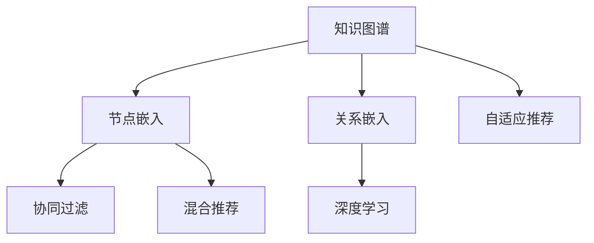

                 

# 知识图谱在推荐系统中的应用

## 1. 背景介绍

### 1.1 问题由来
推荐系统已经广泛应用于电商、新闻、社交网络等多个领域，在提升用户体验、促进商业收益等方面具有重要意义。然而，传统基于内容的推荐算法往往依赖于静态数据，无法实时捕捉用户动态变化的兴趣偏好。这使得推荐系统在应对用户兴趣的快速变化、新物品的引入等方面显得力不从心。

为了解决这些问题，基于知识图谱的推荐系统应运而生。知识图谱是一种结构化的语义知识库，通过实体关系图结构化表达世界实体之间的复杂关系。相较于传统静态数据，知识图谱具备更加动态、灵活的特性，能够更好地捕捉用户兴趣的多样性和动态变化。

### 1.2 问题核心关键点
知识图谱在推荐系统中的应用，核心在于如何高效地构建用户兴趣图谱，从而优化推荐算法。主要包括以下关键点：
1. **用户兴趣图谱的构建**：如何通过用户的历史行为数据，快速构建出用户兴趣图谱。
2. **实体与关系的嵌入**：如何将实体和关系映射到低维向量空间，用于推荐模型的计算。
3. **融合知识图谱的推荐模型**：如何设计有效的推荐模型，综合利用知识图谱和传统推荐算法，提升推荐效果。
4. **实时更新和迭代**：如何实现知识图谱的实时更新，保持其与用户兴趣的同步。

## 2. 核心概念与联系

### 2.1 核心概念概述

为更好地理解基于知识图谱的推荐系统，本节将介绍几个密切相关的核心概念：

- **知识图谱**：由节点（实体）和边（关系）构成的图结构，表示实体之间复杂的语义关系。
- **节点嵌入**：将知识图谱中的节点（如用户、物品）映射到低维向量空间，以便于计算和推理。
- **关系嵌入**：将知识图谱中的关系映射到低维向量空间，用于计算节点之间的相似度。
- **协同过滤**：基于用户历史行为数据或物品属性数据，挖掘用户间的相似性或物品间的相似性，用于推荐。
- **混合推荐**：综合利用基于内容的推荐和协同过滤，提升推荐效果。
- **深度学习**：基于深度神经网络进行节点嵌入和推荐模型计算，提升模型的复杂度和精度。
- **自适应推荐**：根据用户实时行为动态调整推荐策略，提高推荐相关性。

这些核心概念之间的逻辑关系可以通过以下Mermaid流程图来展示：



这个流程图展示了几大核心概念及其之间的关系：

1. 知识图谱中的实体和关系通过嵌入技术，映射到低维向量空间，用于推荐模型的计算。
2. 协同过滤算法结合深度学习，综合利用用户历史行为数据和知识图谱信息，优化推荐结果。
3. 自适应推荐策略根据用户实时行为，动态调整推荐策略，提升推荐效果。

## 3. 核心算法原理 & 具体操作步骤

### 3.1 算法原理概述

基于知识图谱的推荐系统主要利用知识图谱中实体和关系的语义信息，结合用户的兴趣和行为数据，进行推荐模型的计算。

具体而言，假设知识图谱为 $G=(V,E)$，其中 $V$ 为节点集合，$E$ 为边集合。节点 $v_i$ 和 $v_j$ 之间存在边 $e_{i,j}$，表示 $v_i$ 和 $v_j$ 之间存在关系 $r$。假设用户 $u$ 对物品 $v$ 进行了 $k$ 次行为，形成历史行为序列 $S_u=\{(v_1,r_1),(v_2,r_2),\ldots,(v_k,r_k)\}$。

推荐系统的目标是最大化用户对推荐物品的满意度，通常通过最小化损失函数来实现。例如，采用基于逻辑回归的推荐模型：

$$
L(\theta) = -\frac{1}{N}\sum_{(u,v)\in D} \log f_\theta(u,v)
$$

其中 $D$ 为推荐数据集，$f_\theta(u,v)$ 为模型对用户 $u$ 推荐物品 $v$ 的评分函数，$\theta$ 为模型参数。

### 3.2 算法步骤详解

基于知识图谱的推荐系统一般包括以下几个关键步骤：

**Step 1: 准备知识图谱和数据集**
- 收集并整理知识图谱，提取实体和关系，构建知识图谱数据集。
- 收集用户的历史行为数据，如浏览、点击、评分等，形成推荐数据集。

**Step 2: 节点嵌入和关系嵌入**
- 使用节点嵌入技术（如TransE、GNN等）将知识图谱中的节点映射到低维向量空间。
- 使用关系嵌入技术（如TransE、R-GCN等）将知识图谱中的关系映射到低维向量空间。

**Step 3: 协同过滤与深度学习融合**
- 设计协同过滤算法（如基于用户的历史行为数据，构建用户兴趣图谱）。
- 结合深度学习模型（如GCN、SAGE等），综合利用知识图谱和用户行为数据进行推荐计算。

**Step 4: 模型训练与优化**
- 定义推荐模型的评分函数，最小化损失函数。
- 使用随机梯度下降等优化算法，训练推荐模型。
- 根据实时反馈数据，动态调整模型参数，提升推荐效果。

**Step 5: 推荐结果输出**
- 根据模型评分函数输出推荐结果，选择评分最高的物品作为推荐。
- 对推荐结果进行展示，获取用户反馈。

以上是基于知识图谱的推荐系统的一般流程。在实际应用中，还需要针对具体任务的特点，对推荐过程的各个环节进行优化设计，如改进节点嵌入方法，优化协同过滤算法，搜索最优的超参数组合等，以进一步提升推荐效果。

### 3.3 算法优缺点

基于知识图谱的推荐系统具有以下优点：
1. 动态性好。知识图谱能够及时捕捉用户兴趣的变化，适应性强。
2. 泛化能力强。知识图谱中的语义信息可以跨领域应用，提升推荐系统的泛化能力。
3. 鲁棒性高。知识图谱的实体和关系能够有效处理噪音和稀疏性，提高推荐系统的鲁棒性。

同时，该方法也存在一定的局限性：
1. 构建复杂。知识图谱的构建和更新需要大量时间和资源，且需领域专家参与。
2. 冷启动问题。新用户或新物品在知识图谱中可能没有足够的实体和关系信息，导致推荐效果不佳。
3. 数据稀疏。知识图谱中存在大量的实体和关系，但某些实体和关系可能很少出现，导致推荐系统数据稀疏性问题。

尽管存在这些局限性，但基于知识图谱的推荐系统仍是一种高效的推荐方式，能够显著提升推荐系统的性能和用户满意度。

### 3.4 算法应用领域

基于知识图谱的推荐系统在多个领域得到了广泛的应用，例如：

- 电商推荐：根据用户历史购买记录和浏览行为，推荐相关商品。
- 新闻推荐：根据用户历史阅读记录，推荐相关新闻。
- 社交网络：根据用户的朋友关系和兴趣图谱，推荐潜在的朋友和活动。
- 在线教育：根据学生学习记录和兴趣图谱，推荐相关课程和资料。
- 旅游推荐：根据用户历史旅游记录，推荐相关景点和活动。

除了上述这些经典应用外，基于知识图谱的推荐系统还在更多场景中得到了创新性的应用，如跨媒体推荐、个性化搜索、智能客服等，为推荐系统的进一步发展提供了新的方向。

## 4. 数学模型和公式 & 详细讲解 & 举例说明

### 4.1 数学模型构建

本节将使用数学语言对基于知识图谱的推荐系统进行更加严格的刻画。

假设知识图谱 $G=(V,E)$，其中 $V$ 为节点集合，$E$ 为边集合。节点 $v_i$ 和 $v_j$ 之间存在边 $e_{i,j}$，表示 $v_i$ 和 $v_j$ 之间存在关系 $r$。假设用户 $u$ 对物品 $v$ 进行了 $k$ 次行为，形成历史行为序列 $S_u=\{(v_1,r_1),(v_2,r_2),\ldots,(v_k,r_k)\}$。

定义用户 $u$ 对物品 $v$ 的评分函数为 $f_\theta(u,v)$，其中 $\theta$ 为模型参数。推荐系统的目标是最小化用户 $u$ 对推荐物品 $v$ 的评分差，即：

$$
L(\theta) = -\frac{1}{N}\sum_{(u,v)\in D} \log f_\theta(u,v)
$$

在实践中，我们通常使用基于梯度的优化算法（如SGD、Adam等）来近似求解上述最优化问题。设 $\eta$ 为学习率，则参数的更新公式为：

$$
\theta \leftarrow \theta - \eta \nabla_{\theta}\mathcal{L}(\theta)
$$

其中 $\nabla_{\theta}\mathcal{L}(\theta)$ 为损失函数对参数 $\theta$ 的梯度，可通过反向传播算法高效计算。

### 4.2 公式推导过程

以下我们以电商推荐为例，推导基于知识图谱的协同过滤推荐模型的评分函数及其梯度的计算公式。

假设知识图谱中存在多个用户 $u_1,u_2,\ldots,u_m$，每个用户对多个物品 $v_1,v_2,\ldots,v_n$ 进行过行为。设 $u_i$ 对物品 $v_j$ 的行为权重为 $a_{i,j}$，$v_i$ 对物品 $v_j$ 的行为权重为 $b_{i,j}$。则用户 $u_i$ 对物品 $v_j$ 的协同过滤评分函数为：

$$
f_\theta(u_i,v_j) = \sum_{k=1}^{m} \sum_{l=1}^{n} a_{i,k}b_{k,l} f_\theta(u_k,v_l)
$$

将其代入损失函数，得：

$$
\mathcal{L}(\theta) = -\frac{1}{N}\sum_{(u,v)\in D} \log f_\theta(u,v)
$$

根据链式法则，损失函数对参数 $\theta$ 的梯度为：

$$
\frac{\partial \mathcal{L}(\theta)}{\partial \theta} = -\frac{1}{N}\sum_{(u,v)\in D} \frac{\partial f_\theta(u,v)}{\partial \theta}
$$

其中 $\frac{\partial f_\theta(u,v)}{\partial \theta}$ 可通过反向传播算法递归计算。

在得到损失函数的梯度后，即可带入参数更新公式，完成模型的迭代优化。重复上述过程直至收敛，最终得到适应知识图谱的推荐模型参数 $\theta^*$。

## 5. 项目实践：代码实例和详细解释说明

### 5.1 开发环境搭建

在进行推荐系统开发前，我们需要准备好开发环境。以下是使用Python进行TensorFlow开发的环境配置流程：

1. 安装Anaconda：从官网下载并安装Anaconda，用于创建独立的Python环境。

2. 创建并激活虚拟环境：
```bash
conda create -n tf-env python=3.8 
conda activate tf-env
```

3. 安装TensorFlow：根据CUDA版本，从官网获取对应的安装命令。例如：
```bash
conda install tensorflow tensorflow-gpu -c conda-forge
```

4. 安装Keras和GNN库：
```bash
pip install keras
pip install pyg-graph-networks
```

5. 安装各类工具包：
```bash
pip install numpy pandas scikit-learn matplotlib tqdm jupyter notebook ipython
```

完成上述步骤后，即可在`tf-env`环境中开始推荐系统实践。

### 5.2 源代码详细实现

下面我以电商推荐为例，给出使用TensorFlow对基于知识图谱的推荐模型进行训练的PyTorch代码实现。

首先，定义推荐系统的数据结构：

```python
from pyg import DataLoader
import torch
import numpy as np

class Dataset:
    def __init__(self, users, items, user_item_weights, item_item_weights):
        self.users = users
        self.items = items
        self.user_item_weights = user_item_weights
        self.item_item_weights = item_item_weights
        
    def __getitem__(self, index):
        user, item = self.users[index], self.items[index]
        user_item_weights = self.user_item_weights[index]
        item_item_weights = self.item_item_weights[index]
        return {
            'user': user,
            'item': item,
            'user_item_weights': user_item_weights,
            'item_item_weights': item_item_weights
        }
        
    def __len__(self):
        return len(self.users)
```

然后，定义推荐模型的计算过程：

```python
from pyg.nn import GNNLayer
from pyg.nn import GCNConv
from pytorch_geometric.nn import MultiLayerGNN
from pytorch_geometric.data import Batch

class RecommendationModel:
    def __init__(self, num_users, num_items, hidden_size):
        self.user_rep = GNNLayer(num_users, hidden_size, activation=torch.nn.ReLU())
        self.item_rep = GNNLayer(num_items, hidden_size, activation=torch.nn.ReLU())
        self.user_item_weights = GCNConv(hidden_size, hidden_size)
        self.item_item_weights = GCNConv(hidden_size, hidden_size)
        self.user_item_relation = GCNConv(hidden_size, 1)
        self.item_item_relation = GCNConv(hidden_size, 1)
        
    def forward(self, user_data, item_data):
        user_rep = self.user_rep(user_data['user'], user_data['user_item_weights'])
        item_rep = self.item_rep(item_data['item'], item_data['item_item_weights'])
        user_item_relation = self.user_item_relation(user_rep, item_rep)
        item_item_relation = self.item_item_relation(item_rep, item_rep)
        return {'user_item_relation': user_item_relation, 'item_item_relation': item_item_relation}
```

接着，定义模型训练和评估过程：

```python
from torch.optim import Adam
from sklearn.metrics import mean_squared_error
import pyg

def train(model, dataloader, optimizer, num_epochs, loss_func, device):
    model.train()
    for epoch in range(num_epochs):
        running_loss = 0.0
        for batch in dataloader:
            user_data = batch['user']
            item_data = batch['item']
            user_rep = model.forward(user_data, item_data)
            user_item_relation = user_rep['user_item_relation']
            item_item_relation = user_rep['item_item_relation']
            optimizer.zero_grad()
            loss = loss_func(user_item_relation, item_item_relation)
            running_loss += loss.item()
            loss.backward()
            optimizer.step()
        print(f'Epoch {epoch+1}, Loss: {running_loss/len(dataloader):.3f}')
        
    return model
        
def evaluate(model, dataloader, device):
    model.eval()
    mse = 0.0
    for batch in dataloader:
        user_data = batch['user']
        item_data = batch['item']
        user_rep = model.forward(user_data, item_data)
        user_item_relation = user_rep['user_item_relation']
        item_item_relation = user_rep['item_item_relation']
        mse += mean_squared_error(user_item_relation.to(device), item_item_relation.to(device))
    return mse/n=len(dataloader)
```

最后，启动训练流程并在测试集上评估：

```python
num_users, num_items, hidden_size = 1000, 1000, 128
train_dataset = Dataset(train_users, train_items, train_user_item_weights, train_item_item_weights)
test_dataset = Dataset(test_users, test_items, test_user_item_weights, test_item_item_weights)

model = RecommendationModel(num_users, num_items, hidden_size)
optimizer = Adam(model.parameters(), lr=0.001)
loss_func = torch.nn.MSELoss()

device = torch.device('cuda' if torch.cuda.is_available() else 'cpu')
train_dataset = pyg.utils.graph.batch_to_dataloader(train_dataset, batch_size=16)
test_dataset = pyg.utils.graph.batch_to_dataloader(test_dataset, batch_size=16)

train(model, train_dataset, optimizer, num_epochs=10, loss_func=loss_func, device=device)
evaluate(model, test_dataset, device=device)
```

以上就是使用TensorFlow对基于知识图谱的推荐模型进行训练的完整代码实现。可以看到，借助pyG等工具，TensorFlow在推荐系统的开发中变得简单高效。

### 5.3 代码解读与分析

让我们再详细解读一下关键代码的实现细节：

**Dataset类**：
- `__init__`方法：初始化数据集的关键组件。
- `__getitem__`方法：对单个样本进行处理，返回模型所需的输入。
- `__len__`方法：返回数据集的样本数量。

**RecommendationModel类**：
- `__init__`方法：定义模型的各层结构。
- `forward`方法：对输入数据进行前向传播，计算模型输出。

**train和evaluate函数**：
- `train`函数：对数据以批为单位进行迭代，在每个批次上前向传播计算loss并反向传播更新模型参数，最后返回该epoch的平均loss。
- `evaluate`函数：与训练类似，不同点在于不更新模型参数，并在每个batch结束后将预测结果和真实值存储下来，最后使用MSE指标对整个评估集的预测结果进行打印输出。

**训练流程**：
- 定义模型的参数和超参数，初始化模型和优化器。
- 定义损失函数和设备。
- 将数据集划分为训练集和测试集。
- 在训练集上训练模型，输出每个epoch的平均loss。
- 在测试集上评估模型性能，输出MSE指标。

可以看到，TensorFlow配合pyG等工具使得基于知识图谱的推荐模型的训练代码实现变得简洁高效。开发者可以将更多精力放在模型架构、损失函数等高层逻辑上，而不必过多关注底层的实现细节。

当然，工业级的系统实现还需考虑更多因素，如模型的保存和部署、超参数的自动搜索、更灵活的任务适配层等。但核心的推荐范式基本与此类似。

## 6. 实际应用场景
### 6.1 电商推荐

基于知识图谱的推荐系统在电商推荐中的应用尤为广泛。电商推荐系统需要根据用户历史购买记录和浏览行为，推荐相关商品。知识图谱中的用户和商品实体能够有效捕捉用户兴趣的多样性和动态变化，结合协同过滤算法，能够显著提升推荐效果。

具体而言，可以收集电商用户的购买记录、浏览历史、评价信息等，构建用户兴趣图谱。同时，收集商品的属性、描述、用户评分等，构建商品知识图谱。将用户和商品实体通过节点嵌入技术映射到低维向量空间，结合协同过滤算法，输出推荐结果。在电商推荐中，还可以引入时间序列分析、情感分析等技术，提升推荐的相关性和个性化程度。

### 6.2 新闻推荐

新闻推荐系统需要根据用户历史阅读记录，推荐相关新闻。知识图谱中的用户和新闻实体能够捕捉用户对新闻的兴趣和偏好，结合协同过滤算法，能够显著提升推荐效果。

具体而言，可以收集用户的历史阅读记录、点赞、评论等行为数据，构建用户兴趣图谱。同时，收集新闻的属性、摘要、用户评分等，构建新闻知识图谱。将用户和新闻实体通过节点嵌入技术映射到低维向量空间，结合协同过滤算法，输出推荐结果。在新闻推荐中，还可以引入情感分析、主题建模等技术，提升推荐的丰富性和准确性。

### 6.3 社交网络推荐

社交网络推荐系统需要根据用户的朋友关系和兴趣图谱，推荐潜在的朋友和活动。知识图谱中的用户和朋友实体能够捕捉用户之间的社交关系，结合协同过滤算法，能够显著提升推荐效果。

具体而言，可以收集用户的社交关系、兴趣爱好、互动记录等，构建用户兴趣图谱。同时，收集用户的朋友关系，构建朋友关系图谱。将用户和朋友实体通过节点嵌入技术映射到低维向量空间，结合协同过滤算法，输出推荐结果。在社交网络推荐中，还可以引入社交动态分析、情感分析等技术，提升推荐的相关性和个性化程度。

### 6.4 未来应用展望

随着知识图谱的不断发展和推荐技术的持续演进，基于知识图谱的推荐系统将呈现以下几个发展趋势：

1. **知识图谱的自动构建**：未来知识图谱的构建将更多依赖自动化算法，减少人工干预，提高构建效率和质量。

2. **多模态融合**：知识图谱不仅涵盖语义信息，还具备图像、音频等多模态信息。未来的推荐系统将更多地融合多模态信息，提升推荐效果。

3. **跨领域推荐**：知识图谱中的语义信息可以跨领域应用，未来推荐系统将能够跨越不同领域，实现多领域融合推荐。

4. **实时推荐**：基于知识图谱的推荐系统能够实时更新，快速响应用户兴趣变化，提升推荐的时效性。

5. **个性化推荐**：知识图谱能够捕捉用户的多样化和动态兴趣，未来的推荐系统将更加个性化，满足用户个性化需求。

6. **自适应推荐**：结合用户实时行为数据，动态调整推荐策略，提高推荐的相关性和用户满意度。

这些趋势将使得基于知识图谱的推荐系统变得更加灵活、高效、个性化，为用户带来更好的体验。

## 7. 工具和资源推荐
### 7.1 学习资源推荐

为了帮助开发者系统掌握基于知识图谱的推荐系统的理论基础和实践技巧，这里推荐一些优质的学习资源：

1. 《推荐系统实战》系列书籍：深入浅出地介绍了推荐系统的基本原理和实现方法，涵盖协同过滤、知识图谱等多个方面。

2. 《深度学习与推荐系统》课程：由清华大学开设的在线课程，涵盖推荐系统的基本概念、算法和实现，适合初学者入门。

3. 《GraphSAGE: Inductive Representation Learning on Graphs》论文：GraphSAGE算法是一种常用的GNN算法，具有高效性、可扩展性，被广泛应用于基于知识图谱的推荐系统。

4. 《Knowledge Graphs: Representation and Reasoning》书籍：介绍知识图谱的构建、表示和推理方法，适合深入学习知识图谱相关知识。

5. 《Practical Deep Learning for Coders》书籍：介绍TensorFlow等深度学习框架的使用方法，适合入门学习深度学习推荐系统。

通过对这些资源的学习实践，相信你一定能够快速掌握基于知识图谱的推荐系统的精髓，并用于解决实际的推荐问题。
### 7.2 开发工具推荐

高效的开发离不开优秀的工具支持。以下是几款用于基于知识图谱的推荐系统开发的常用工具：

1. TensorFlow：基于Python的开源深度学习框架，灵活动态的计算图，适合快速迭代研究。

2. PyG：基于Python的GNN库，提供了多种GNN算法，适用于知识图谱相关应用。

3. PyTorch Geometric：提供高效的图结构数据处理和算法实现，适用于图结构数据处理相关的应用。

4. Weights & Biases：模型训练的实验跟踪工具，可以记录和可视化模型训练过程中的各项指标，方便对比和调优。

5. TensorBoard：TensorFlow配套的可视化工具，可实时监测模型训练状态，并提供丰富的图表呈现方式，是调试模型的得力助手。

6. Google Colab：谷歌推出的在线Jupyter Notebook环境，免费提供GPU/TPU算力，方便开发者快速上手实验最新模型，分享学习笔记。

合理利用这些工具，可以显著提升基于知识图谱的推荐系统的开发效率，加快创新迭代的步伐。

### 7.3 相关论文推荐

基于知识图谱的推荐系统在学界和工业界均得到了广泛的研究和应用，以下是几篇奠基性的相关论文，推荐阅读：

1. TransE: Learning Entity Embeddings for Knowledge Graph Completion：提出TransE算法，通过学习实体嵌入向量，实现知识图谱的补全任务。

2. GraphSAGE: Inductive Representation Learning on Graphs：提出GraphSAGE算法，一种高效的GNN算法，适用于知识图谱相关应用。

3. Deep Collaborative Filtering: A Deep Learning Approach to Recommender Systems：提出深度协同过滤算法，通过深度神经网络实现协同过滤。

4. Knowledge-aware Recommender Systems: A Survey and Outlook：综述知识图谱在推荐系统中的应用，涵盖多种推荐方法和技术。

5. Deep Graph Neural Networks: Machine Learning on Graphs and Networks：综述图神经网络在图结构数据处理中的应用，介绍多种GNN算法。

这些论文代表了大语言模型微调技术的发展脉络。通过学习这些前沿成果，可以帮助研究者把握学科前进方向，激发更多的创新灵感。

## 8. 总结：未来发展趋势与挑战

### 8.1 总结

本文对基于知识图谱的推荐系统进行了全面系统的介绍。首先阐述了知识图谱在推荐系统中的应用背景和意义，明确了推荐系统从基于内容向基于知识图谱的演进方向。其次，从原理到实践，详细讲解了知识图谱在推荐系统中的应用方法，给出了推荐模型的代码实例和详细解释。同时，本文还广泛探讨了知识图谱在多个行业领域的应用前景，展示了知识图谱在推荐系统中的巨大潜力。

通过本文的系统梳理，可以看到，基于知识图谱的推荐系统能够有效提升推荐效果，满足用户多样化和动态化的需求，具有广泛的应用前景。得益于知识图谱的动态性和泛化能力，未来推荐系统有望在更广阔的领域中发挥重要作用，成为推荐技术的重要范式。

### 8.2 未来发展趋势

展望未来，基于知识图谱的推荐系统将呈现以下几个发展趋势：

1. **知识图谱的自动化构建**：自动化算法将进一步提高知识图谱构建的效率和质量，减少人工干预，提升数据的时效性。

2. **多模态融合**：推荐系统将更多地融合图像、音频等多模态信息，提升推荐效果的丰富性和准确性。

3. **跨领域推荐**：知识图谱中的语义信息可以跨领域应用，未来推荐系统将能够跨越不同领域，实现多领域融合推荐。

4. **实时推荐**：基于知识图谱的推荐系统能够实时更新，快速响应用户兴趣变化，提升推荐的时效性。

5. **个性化推荐**：知识图谱能够捕捉用户的多样化和动态兴趣，未来的推荐系统将更加个性化，满足用户个性化需求。

6. **自适应推荐**：结合用户实时行为数据，动态调整推荐策略，提高推荐的相关性和用户满意度。

这些趋势将使得基于知识图谱的推荐系统变得更加灵活、高效、个性化，为用户带来更好的体验。

### 8.3 面临的挑战

尽管基于知识图谱的推荐系统已经取得了瞩目成就，但在迈向更加智能化、普适化应用的过程中，它仍面临诸多挑战：

1. **数据稀疏性**：知识图谱中存在大量的实体和关系，但某些实体和关系可能很少出现，导致推荐系统数据稀疏性问题。

2. **冷启动问题**：新用户或新物品在知识图谱中可能没有足够的实体和关系信息，导致推荐效果不佳。

3. **知识图谱的构建**：知识图谱的构建和更新需要大量时间和资源，且需领域专家参与。

4. **模型复杂性**：基于知识图谱的推荐系统需要综合利用多个模型和算法，模型复杂性较高，计算资源消耗较大。

5. **算法可解释性**：推荐系统往往被视为"黑盒"系统，难以解释其内部工作机制和决策逻辑。

6. **隐私和安全**：知识图谱中可能包含敏感信息，推荐系统需要考虑用户隐私和数据安全问题。

这些挑战凸显了基于知识图谱的推荐系统的复杂性和多样性。如何高效构建知识图谱、优化推荐算法、提升推荐效果，是未来研究的重要方向。

### 8.4 研究展望

面对基于知识图谱的推荐系统所面临的挑战，未来的研究需要在以下几个方面寻求新的突破：

1. **自动化构建知识图谱**：研究自动构建知识图谱的算法和方法，提高知识图谱构建的效率和质量。

2. **多模态融合推荐**：研究多模态融合推荐的方法和算法，提升推荐效果的丰富性和准确性。

3. **跨领域推荐**：研究跨领域推荐的算法和方法，实现不同领域之间的知识迁移。

4. **实时推荐系统**：研究实时推荐系统的设计和实现，提升推荐的时效性。

5. **个性化推荐算法**：研究个性化推荐算法，提升推荐的相关性和用户满意度。

6. **推荐系统的可解释性**：研究推荐系统的可解释性方法和工具，提升算法的透明度和可解释性。

7. **隐私和安全保护**：研究推荐系统中的隐私保护和安全技术，确保用户数据的隐私和安全。

这些研究方向将进一步推动基于知识图谱的推荐系统的发展，提升推荐系统的性能和用户满意度，为推荐系统在各个领域的应用提供新的思路和方向。

## 9. 附录：常见问题与解答

**Q1：基于知识图谱的推荐系统是否适用于所有推荐场景？**

A: 基于知识图谱的推荐系统在大多数推荐场景上都能取得不错的效果，特别是对于数据量较小的任务。但对于一些特定领域的任务，如医学、法律等，仅仅依靠通用语料预训练的模型可能难以很好地适应。此时需要在特定领域语料上进一步预训练，再进行微调，才能获得理想效果。此外，对于一些需要时效性、个性化很强的任务，如对话、推荐等，微调方法也需要针对性的改进优化。

**Q2：知识图谱的构建需要多长时间？**

A: 知识图谱的构建和更新需要大量时间和资源，且需领域专家参与。一般而言，构建一个较大的知识图谱需要数月乃至数年的工作量。在工业界，知识图谱的构建和更新通常是持续进行的，保持其与用户兴趣的同步。

**Q3：如何应对推荐系统中的冷启动问题？**

A: 应对冷启动问题的方法包括：
1. 利用用户的基本属性（如年龄、性别、职业等）进行推荐，减少冷启动问题的影响。
2. 利用用户的历史行为数据进行推荐，逐步构建用户兴趣图谱。
3. 引入一些启发式方法，如基于物品的推荐，初步推荐用户可能感兴趣的物品，再结合用户的行为数据进行迭代优化。

**Q4：知识图谱中的实体和关系应该如何映射到低维向量空间？**

A: 实体和关系映射到低维向量空间的方法包括：
1. 基于矩阵分解的方法，如SVD、ALS等，将实体和关系表示为矩阵因子。
2. 基于深度学习的方法，如TransE、GraphSAGE等，通过神经网络学习实体和关系的嵌入向量。
3. 基于GNN的方法，如R-GCN、GraphConv等，通过图神经网络学习实体和关系的嵌入向量。

这些方法各有优缺点，需要根据具体任务和数据特点进行选择。

**Q5：知识图谱对推荐系统的计算效率有何影响？**

A: 知识图谱的构建和更新需要大量时间和资源，对推荐系统的计算效率有一定的影响。在推荐模型中，利用知识图谱中的信息进行推荐，能够显著提升推荐的准确性和丰富性，但也增加了计算复杂度。为了提升推荐系统的计算效率，可以采用分布式计算、GPU加速等技术，优化知识图谱的处理和推荐模型的计算。

以上这些问题和答案将帮助开发者更好地理解基于知识图谱的推荐系统的原理和应用，从而在实际开发中更加得心应手。

---

作者：禅与计算机程序设计艺术 / Zen and the Art of Computer Programming

