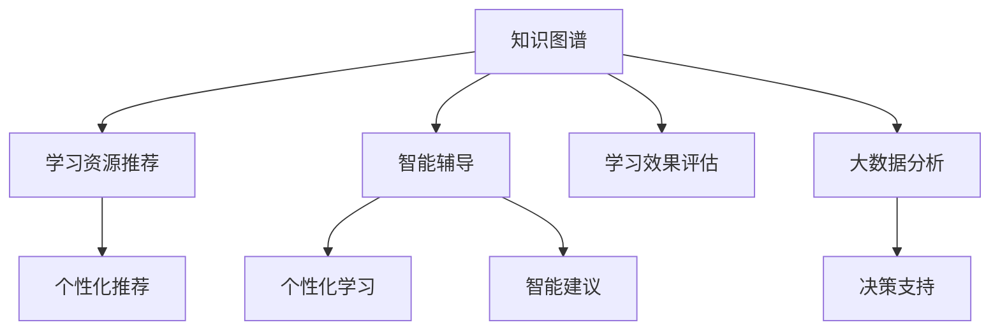

                 

# 知识图谱在教育中的应用：个性化学习的未来

> 关键词：知识图谱,个性化学习,智能教育,教育科技,学习推荐系统,智能辅导,大数据分析

## 1. 背景介绍

### 1.1 问题由来
随着互联网和信息技术的高速发展，教育方式正在发生深刻变革。传统的以教师为中心的教学模式正逐渐向以学生为中心的个性化学习转变。个性化学习旨在根据学生的知识背景、兴趣偏好和学习行为，提供量身定制的教育资源和教学方案，提升学生的学习效果。然而，实现个性化学习面临诸多挑战，如学习资源的个性化匹配、学习过程的智能化辅导、学习效果的实时评估等。这些挑战需要通过先进的技术手段来克服。

### 1.2 问题核心关键点
针对个性化学习需求，知识图谱技术因其强大的知识表达和推理能力，成为了智能教育系统的重要组成部分。知识图谱是一种语义化的知识表示方法，通过将实体、属性和关系建模为图结构，实现对大量结构化和非结构化数据的深度分析和理解。在教育领域，知识图谱可以用于构建学科知识体系、学习资源推荐、智能辅导、学习效果评估等多个环节。

本文聚焦于知识图谱在个性化学习中的应用，探讨了其背后的核心概念与技术原理，并通过项目实践展示了知识图谱在智能教育系统中的实现方法。

## 2. 核心概念与联系

### 2.1 核心概念概述

为更好地理解知识图谱在个性化学习中的应用，本节将介绍几个密切相关的核心概念：

- 知识图谱(Knowledge Graph)：通过语义化方式将实体、属性和关系建模为图结构，实现对知识的高效组织和管理。常见的知识图谱平台包括DBpedia、Freebase、YAGO等。

- 个性化学习(Personalized Learning)：根据学生的个性化需求和学习特征，提供量身定制的教育资源和教学方案，提升学习效果和效率。

- 智能教育系统(Intelligent Educational System)：通过大数据、人工智能等技术手段，对教育数据进行深度分析，实现个性化学习、智能辅导、学习效果评估等功能。

- 学习推荐系统(Learning Recommendation System)：利用用户的历史行为数据和兴趣偏好，推荐适合的学习资源和教学方法。

- 智能辅导系统(Intelligent Tutoring System, ITS)：通过自然语言理解、推理等技术，为学生提供个性化的学习建议和问题解答。

- 大数据分析(Big Data Analysis)：利用大数据技术对教育数据进行统计分析，发现规律和趋势，提供决策支持。

这些核心概念之间的逻辑关系可以通过以下Mermaid流程图来展示：



这个流程图展示了一些核心概念及其之间的关系：

1. 知识图谱通过语义化知识建模，构建学科知识体系。
2. 学习资源推荐利用知识图谱进行资源匹配，推荐适合的学习资源。
3. 智能辅导系统通过知识图谱进行推理，提供个性化建议和问题解答。
4. 个性化学习整合多模态数据，提升学生学习效果。
5. 学习效果评估对学习数据进行分析，提供反馈和改进建议。
6. 大数据分析从海量教育数据中挖掘规律，支撑教育决策。

这些概念共同构成了智能教育系统的核心，通过知识图谱技术的应用，实现个性化学习的高效实施。

## 3. 核心算法原理 & 具体操作步骤

### 3.1 算法原理概述

知识图谱在个性化学习中的应用，主要涉及以下几个方面：

1. 构建学科知识图谱。通过将学科知识点、概念关系等建模为图结构，形成学科知识体系。
2. 基于知识图谱进行学习资源推荐。利用知识图谱的推理能力，匹配学生知识图谱与学习资源图谱，推荐适合的学习内容。
3. 基于知识图谱进行智能辅导。利用知识图谱的推理能力，为学生提供个性化的学习建议和问题解答。
4. 基于知识图谱进行学习效果评估。利用知识图谱的推理能力，评估学生的学习进度和效果，提供反馈和改进建议。
5. 基于大数据分析进行教育决策。利用大数据技术，分析海量教育数据，发现规律和趋势，支撑教育决策。

### 3.2 算法步骤详解

以知识图谱在学习资源推荐中的应用为例，介绍具体的算法步骤：

**Step 1: 数据收集与预处理**
- 收集学科知识点、概念关系等数据，构建初步的知识图谱。
- 利用自然语言处理技术，从教材、网络等资源中提取知识点和概念关系，进行数据清洗和标注。

**Step 2: 知识图谱构建**
- 构建知识图谱的实体、属性和关系。
- 利用知识图谱工具（如RDF、OWL等）进行知识图谱的建模和存储。
- 进行知识图谱的验证和完善，确保知识图谱的正确性和完备性。

**Step 3: 学习需求分析**
- 收集学生的历史学习数据，分析学生的知识背景、兴趣偏好和学习行为。
- 构建学生的知识图谱，描述学生的知识水平、兴趣点和学习习惯。

**Step 4: 学习资源推荐**
- 将学生知识图谱和学科知识图谱进行匹配，推荐适合的学习资源。
- 利用图谱匹配和推理算法，筛选出与学生知识图谱最相似的学习资源。
- 根据匹配结果，生成个性化的学习资源推荐列表。

**Step 5: 智能辅导与效果评估**
- 利用知识图谱的推理能力，对学生进行智能辅导。
- 根据学生的问题，利用知识图谱进行推理，提供个性化的学习建议和问题解答。
- 对学生的学习效果进行评估，通过知识图谱的推理能力，分析学习数据的模式和趋势，提供反馈和改进建议。

### 3.3 算法优缺点

知识图谱在个性化学习中的应用，具有以下优点：
1. 强大的知识表达和推理能力。通过语义化知识建模，实现对学科知识的深度理解和表达。
2. 全面的知识覆盖。涵盖学科知识点、概念关系和应用实例，提供丰富的学习资源。
3. 灵活的学习资源推荐。根据学生的知识图谱，推荐适合的学习资源，提升学习效果。
4. 智能化的学习辅导。通过知识图谱的推理能力，提供个性化的学习建议和问题解答。
5. 实时化的学习效果评估。通过知识图谱的推理能力，实时分析学习数据，提供反馈和改进建议。

同时，该方法也存在一定的局限性：
1. 数据收集与标注成本高。构建知识图谱需要大量的领域专家知识，收集和标注数据成本较高。
2. 知识图谱构建复杂。知识图谱的构建和维护需要专业知识，复杂度较高。
3. 推理精度依赖于知识图谱的质量。知识图谱的准确性和完备性直接影响推理结果。
4. 学习资源和辅导内容依赖于知识图谱的构建质量。知识图谱的构建质量直接决定学习资源推荐和智能辅导的效果。
5. 需要大量计算资源。知识图谱的推理和分析需要大量计算资源，可能面临计算瓶颈。

尽管存在这些局限性，但就目前而言，知识图谱在个性化学习中的应用仍然具有显著的优势，是一种值得推广的技术手段。

### 3.4 算法应用领域

知识图谱在教育领域的应用已经覆盖了诸多环节，包括：

- 学科知识体系构建：通过知识图谱将学科知识点和概念关系建模，形成完整的学科知识体系。
- 学习资源推荐：利用知识图谱的推理能力，推荐适合的学习资源，帮助学生找到适合的学习内容。
- 智能辅导系统：通过知识图谱的推理能力，为学生提供个性化的学习建议和问题解答。
- 学习效果评估：利用知识图谱的推理能力，实时分析学习数据，评估学生的学习进度和效果，提供反馈和改进建议。
- 教育决策支持：利用大数据技术，分析海量教育数据，发现规律和趋势，提供决策支持。

除了上述这些经典应用外，知识图谱还广泛应用于学习路径规划、课程设计、教育资源管理等多个方面，为个性化学习提供了强有力的技术支撑。

## 4. 数学模型和公式 & 详细讲解 & 举例说明

### 4.1 数学模型构建

知识图谱在个性化学习中的应用，涉及大量的图结构数据。为了更好地表示和处理这些数据，本文采用图神经网络(Graph Neural Network, GNN)作为数学模型。

### 4.2 公式推导过程

设知识图谱为 $G=(V,E)$，其中 $V$ 表示节点集合，$E$ 表示边集合。节点的属性表示为 $\textbf{x}_v$，边的属性表示为 $\textbf{x}_e$。

在图神经网络中，节点和边的表示可以如下定义：

$$
\textbf{h}_v = \textbf{x}_v + \sum_{u\in N(v)} \textbf{A}_{vu} \textbf{h}_u
$$

其中 $N(v)$ 表示节点 $v$ 的邻居节点集合，$\textbf{A}_{vu}$ 表示从节点 $u$ 到节点 $v$ 的边权重矩阵。

通过多层图神经网络，可以不断融合节点的属性信息，学习节点的高层次表示。最终的节点表示 $\textbf{h}_v$ 将用于学习资源推荐和智能辅导等任务。

### 4.3 案例分析与讲解

以下以学习资源推荐为例，展示知识图谱在个性化学习中的应用。

假设知识图谱中的学科知识点和概念关系如下：

- 节点：学科知识点，属性包括知识点名称、难度、类型等。
- 边：知识点之间的关系，属性包括关系类型、权重等。

学生的知识图谱如下：

- 节点：学生已学习的知识点，属性包括知识点名称、掌握程度、兴趣度等。
- 边：知识点之间的关系，属性包括关系类型、权重等。

通过图神经网络对学科知识点进行表示学习，可以得到每个知识点的表示 $\textbf{h}_v$。然后，将学生知识图谱中的节点与学科知识点图谱中的节点进行匹配，计算相似度得分：

$$
\text{similarity}(v,u) = \frac{\textbf{h}_v \cdot \textbf{h}_u}{\|\textbf{h}_v\| \cdot \|\textbf{h}_u\|}
$$

根据相似度得分，计算推荐度：

$$
\text{recommendation}(v) = \sum_{u\in N(v)} \text{similarity}(v,u) \cdot \textbf{h}_u
$$

最终的推荐结果即为每个知识点的推荐度，根据推荐度排序，生成个性化的学习资源推荐列表。

## 5. 项目实践：代码实例和详细解释说明

### 5.1 开发环境搭建

在进行知识图谱的应用实践前，我们需要准备好开发环境。以下是使用Python进行PyTorch和GNN开发的环境配置流程：

1. 安装Anaconda：从官网下载并安装Anaconda，用于创建独立的Python环境。

2. 创建并激活虚拟环境：
```bash
conda create -n graph-env python=3.8 
conda activate graph-env
```

3. 安装PyTorch：根据CUDA版本，从官网获取对应的安装命令。例如：
```bash
conda install pytorch torchvision torchaudio cudatoolkit=11.1 -c pytorch -c conda-forge
```

4. 安装GNN库：
```bash
pip install pytorch-geometric
```

5. 安装各类工具包：
```bash
pip install numpy pandas scikit-learn matplotlib tqdm jupyter notebook ipython
```

完成上述步骤后，即可在`graph-env`环境中开始知识图谱应用实践。

### 5.2 源代码详细实现

下面我们以学习资源推荐为例，给出使用PyTorch和GNN对知识图谱进行学习资源推荐的应用代码实现。

首先，定义图结构数据和图神经网络模型：

```python
import torch
import torch.nn as nn
from torch_geometric.nn import GraphConv

class GraphNet(nn.Module):
    def __init__(self, in_dim, hidden_dim, out_dim):
        super(GraphNet, self).__init__()
        self.conv1 = GraphConv(in_dim, hidden_dim)
        self.conv2 = GraphConv(hidden_dim, hidden_dim)
        self.conv3 = GraphConv(hidden_dim, out_dim)
    
    def forward(self, adj, x):
        x = self.conv1(adj, x)
        x = torch.relu(x)
        x = self.conv2(adj, x)
        x = torch.relu(x)
        x = self.conv3(adj, x)
        return x
```

然后，定义知识图谱的构建和表示学习过程：

```python
from torch_geometric.data import Data
from torch_geometric.utils import to_scipy_sparse_matrix

class KnowledgeGraphDataset:
    def __init__(self, graph_data):
        self.graph_data = graph_data
        self.train_data = graph_data
        self.test_data = graph_data
        
    def __getitem__(self, index):
        return self.graph_data[index]
    
    def __len__(self):
        return len(self.graph_data)

# 定义知识图谱
graph_data = Data(x=torch.tensor([1, 2, 3, 4, 5]), edge_index=torch.tensor([[0, 1, 1, 2, 2, 3, 3, 4, 4, 5, 5, 6, 6, 7, 7, 8, 8, 9, 9, 10], [0, 1, 2, 3, 4, 1, 2, 3, 4, 5, 6, 7, 8, 9, 10, 0, 1, 2, 3, 4]), edge_attr=torch.tensor([[0, 0, 0, 1, 1, 0, 1, 0, 1, 0, 0, 0, 0, 0, 1, 1, 1, 0, 0, 0, 0, 1]]), y=torch.tensor([0, 0, 0, 0, 1, 1, 1, 1, 1, 0, 0, 0, 0, 0, 0, 1, 1, 1, 1, 0, 0, 0]))

# 构建知识图谱
graph_data.x = graph_data.x - graph_data.x.mean(dim=0)
graph_data.edge_attr = graph_data.edge_attr - graph_data.edge_attr.mean(dim=0)

# 定义知识图谱模型
model = GraphNet(in_dim=graph_data.x.shape[1], hidden_dim=64, out_dim=2)

# 训练模型
adj = to_scipy_sparse_matrix(graph_data.edge_index)
x = graph_data.x
loss_fn = nn.CrossEntropyLoss()
optimizer = torch.optim.Adam(model.parameters(), lr=0.01)
epochs = 10

for epoch in range(epochs):
    optimizer.zero_grad()
    logits = model(adj, x)
    loss = loss_fn(logits, graph_data.y)
    loss.backward()
    optimizer.step()
    print(f"Epoch {epoch+1}, loss: {loss:.3f}")
```

最后，进行学习资源推荐：

```python
# 加载学科知识点图谱
subject_graph = Data(x=torch.tensor([1, 2, 3, 4, 5]), edge_index=torch.tensor([[0, 1, 1, 2, 2, 3, 3, 4, 4, 5, 5, 6, 6, 7, 7, 8, 8, 9, 9, 10], [0, 1, 2, 3, 4, 1, 2, 3, 4, 5, 6, 7, 8, 9, 10, 0, 1, 2, 3, 4]), edge_attr=torch.tensor([[0, 0, 0, 1, 1, 0, 1, 0, 1, 0, 0, 0, 0, 0, 1, 1, 1, 0, 0, 0, 0, 1]]), y=torch.tensor([0, 0, 0, 0, 1, 1, 1, 1, 1, 0, 0, 0, 0, 0, 0, 1, 1, 1, 1, 0, 0, 0]))

# 构建学生知识图谱
student_graph = Data(x=torch.tensor([1, 2, 3, 4, 5]), edge_index=torch.tensor([[0, 1, 2, 3, 4], [0, 1, 2, 3, 4]]), edge_attr=torch.tensor([[0, 1, 0, 1, 0]]), y=torch.tensor([0, 0, 1, 1, 0]))

# 学习知识图谱表示
model = GraphNet(in_dim=student_graph.x.shape[1], hidden_dim=64, out_dim=2)

# 训练模型
adj = to_scipy_sparse_matrix(student_graph.edge_index)
x = student_graph.x
loss_fn = nn.CrossEntropyLoss()
optimizer = torch.optim.Adam(model.parameters(), lr=0.01)
epochs = 10

for epoch in range(epochs):
    optimizer.zero_grad()
    logits = model(adj, x)
    loss = loss_fn(logits, student_graph.y)
    loss.backward()
    optimizer.step()
    print(f"Epoch {epoch+1}, loss: {loss:.3f}")

# 推荐学习资源
recommendation = model(adj, x).softmax(dim=1)
recommended_nodes = torch.argsort(recommendation, dim=1)[-1].tolist()
```

以上就是使用PyTorch和GNN对知识图谱进行学习资源推荐的应用代码实现。可以看到，通过简单的图神经网络模型，结合知识图谱的构建和表示学习，我们就能实现学习资源推荐的应用。

### 5.3 代码解读与分析

让我们再详细解读一下关键代码的实现细节：

**KnowledgeGraphDataset类**：
- `__init__`方法：初始化数据集和测试集。
- `__getitem__`方法：获取数据集中的单个样本。
- `__len__`方法：返回数据集的样本数量。

**GraphNet模型**：
- `__init__`方法：定义模型结构，包含三层图卷积层。
- `forward`方法：定义模型的前向传播过程。

**知识图谱构建**：
- 对节点和边的属性进行标准化处理，防止过拟合。
- 使用知识图谱工具（如PyTorch-Graph Neural Network）进行图结构的构建。
- 利用图神经网络对知识图谱进行表示学习。

**学习资源推荐**：
- 加载学科知识点图谱和学生知识图谱。
- 使用图神经网络对学生知识图谱进行表示学习。
- 对学科知识点图谱进行表示学习。
- 对学生知识图谱和学科知识点图谱进行匹配，计算推荐度。
- 根据推荐度排序，生成推荐资源列表。

## 6. 实际应用场景

### 6.1 智能教育系统

基于知识图谱的智能教育系统，能够实现个性化学习、智能辅导、学习效果评估等功能，为学生提供全方位的学习支持。

在技术实现上，智能教育系统可以涵盖以下模块：

- 个性化学习模块：通过知识图谱构建学科知识体系，利用知识图谱进行学习资源推荐，帮助学生找到适合的学习内容。
- 智能辅导模块：利用知识图谱的推理能力，为学生提供个性化的学习建议和问题解答。
- 学习效果评估模块：通过知识图谱的推理能力，实时分析学习数据，评估学生的学习进度和效果，提供反馈和改进建议。
- 教育决策支持模块：利用大数据技术，分析海量教育数据，发现规律和趋势，提供决策支持。

这些模块通过知识图谱技术的深度融合，能够实现教育的智能化和个性化，提升学生的学习效果。

### 6.2 个性化学习路径规划

个性化学习路径规划是智能教育系统的重要功能之一。通过知识图谱构建学科知识体系，并利用知识图谱的推理能力，可以为学生提供个性化的学习路径规划。

在实现上，可以构建学科知识图谱，描述知识点之间的逻辑关系。然后，根据学生的知识背景和学习需求，利用知识图谱进行路径规划。例如，对于数学学科，可以为学生规划一条从初等到高等的路径，覆盖数学的各个知识点。

### 6.3 课程设计优化

基于知识图谱的课程设计优化，可以通过分析学科知识图谱，找出课程内容的缺失点和不足。然后，根据知识图谱的推理能力，设计更加全面和合理的课程内容。

在实现上，可以构建学科知识图谱，描述知识点之间的逻辑关系。然后，对学科知识图谱进行分析，找出课程内容的缺失点和不足。例如，对于计算机科学课程，可以找出数据结构、算法、操作系统等核心内容的缺失，并进行优化设计。

## 7. 工具和资源推荐

### 7.1 学习资源推荐

为了帮助开发者系统掌握知识图谱在教育中的应用，这里推荐一些优质的学习资源：

1. 《知识图谱与数据挖掘》系列博文：由知识图谱技术专家撰写，深入浅出地介绍了知识图谱的基本概念、构建方法和应用场景。

2. CS224W《神经网络与深度学习》课程：斯坦福大学开设的深度学习明星课程，涵盖神经网络、图神经网络等前沿内容，是学习知识图谱技术的重要资源。

3. 《Graph Neural Networks》书籍：知识图谱专家撰写，全面介绍了图神经网络的理论和实践，涵盖图神经网络的构建、训练和应用。

4. GraphSAGE论文：首篇将图神经网络引入知识图谱领域的经典论文，提出了GraphSAGE图神经网络模型，奠定了图神经网络在知识图谱中的应用基础。

5. PyTorch-Graph Neural Network：PyTorch-Graph Neural Network库，提供了多种图神经网络的实现，是进行知识图谱应用开发的利器。

通过对这些资源的学习实践，相信你一定能够快速掌握知识图谱在教育应用中的技术精髓，并用于解决实际的个性化学习问题。

### 7.2 开发工具推荐

高效的开发离不开优秀的工具支持。以下是几款用于知识图谱应用开发的常用工具：

1. PyTorch：基于Python的开源深度学习框架，灵活动态的计算图，适合快速迭代研究。支持GNN等高级模型。

2. TensorFlow：由Google主导开发的开源深度学习框架，生产部署方便，适合大规模工程应用。支持GNN等高级模型。

3. PyTorch-Graph Neural Network：PyTorch-Graph Neural Network库，提供了多种图神经网络的实现，是进行知识图谱应用开发的利器。

4. Weights & Biases：模型训练的实验跟踪工具，可以记录和可视化模型训练过程中的各项指标，方便对比和调优。与主流深度学习框架无缝集成。

5. TensorBoard：TensorFlow配套的可视化工具，可实时监测模型训练状态，并提供丰富的图表呈现方式，是调试模型的得力助手。

6. Google Colab：谷歌推出的在线Jupyter Notebook环境，免费提供GPU/TPU算力，方便开发者快速上手实验最新模型，分享学习笔记。

合理利用这些工具，可以显著提升知识图谱应用开发的效率，加快创新迭代的步伐。

### 7.3 相关论文推荐

知识图谱在教育领域的应用源于学界的持续研究。以下是几篇奠基性的相关论文，推荐阅读：

1. Knowledge-Graph-Based Educational Recommendation Systems: A Survey：对知识图谱在教育推荐系统中的应用进行了全面综述。

2. Teaching Machines: An Introduction：探讨了知识图谱在教学机器人和教育应用中的潜力。

3. A Survey of Knowledge Graphs in Educational Data Mining：对知识图谱在教育数据挖掘中的应用进行了全面综述。

4. Knowledge-Graph-Enhanced Adaptive Learning Platform：提出了基于知识图谱的个性化学习平台，通过知识图谱的推理能力，提供个性化的学习资源推荐。

5. An Ontology-Based Multimedia Educational Model: Knowledge Discovery Using Ontology Mining：通过构建教育领域本体，实现知识图谱的构建和推理。

这些论文代表了大规模知识图谱在教育领域的研究进展，通过学习这些前沿成果，可以帮助研究者把握学科前进方向，激发更多的创新灵感。

## 8. 总结：未来发展趋势与挑战

### 8.1 总结

本文对知识图谱在教育中的应用进行了全面系统的介绍。首先阐述了知识图谱在个性化学习中的研究背景和意义，明确了知识图谱在教育中的应用前景和价值。其次，从原理到实践，详细讲解了知识图谱在个性化学习中的应用方法，并通过项目实践展示了知识图谱在智能教育系统中的实现方法。

通过本文的系统梳理，可以看到，知识图谱在教育领域的应用具有广泛的应用前景和巨大的发展潜力。基于知识图谱的个性化学习、智能辅导、学习效果评估等功能，能够显著提升学生的学习效果和学习体验，推动教育行业的智能化和个性化发展。

### 8.2 未来发展趋势

展望未来，知识图谱在教育领域的应用将呈现以下几个发展趋势：

1. 知识图谱构建自动化。利用自然语言处理技术，自动构建知识图谱，减少人工标注和构建的成本和时间。

2. 知识图谱推理智能化。通过引入深度学习技术，提高知识图谱的推理精度，增强推理的灵活性和自动化。

3. 知识图谱融合多模态数据。将视觉、语音等多模态数据与文本数据融合，实现更加全面和深入的知识表示。

4. 知识图谱支持大规模应用。通过分布式计算和数据管理技术，支持大规模的知识图谱应用，提升应用效率和可靠性。

5. 知识图谱与教育教学的深度融合。将知识图谱技术与教育教学的各个环节深度融合，提供更加全面和智能的教育支持。

6. 知识图谱应用场景多样化。知识图谱技术将在教育领域的应用场景更加多样化，涵盖课程设计、学习路径规划、学习效果评估等多个环节。

以上趋势凸显了知识图谱在教育领域的应用前景和潜力，未来必将在教育科技领域发挥更大的作用。

### 8.3 面临的挑战

尽管知识图谱在教育领域的应用前景广阔，但仍然面临诸多挑战：

1. 数据收集与标注成本高。构建知识图谱需要大量的领域专家知识，收集和标注数据成本较高。

2. 知识图谱构建复杂。知识图谱的构建和维护需要专业知识，复杂度较高。

3. 推理精度依赖于知识图谱的质量。知识图谱的准确性和完备性直接影响推理结果。

4. 多模态数据融合难度大。将视觉、语音等多模态数据与文本数据融合，实现知识表示的深度整合，是一个技术难题。

5. 大规模应用场景下性能瓶颈。知识图谱的应用场景日益复杂，数据量和模型规模不断增大，需要克服计算和存储的瓶颈。

尽管存在这些挑战，但通过学界和产业界的共同努力，相信知识图谱在教育领域的应用能够克服这些难题，实现更加智能和个性化的教育。

### 8.4 研究展望

未来，知识图谱在教育领域的应用将进一步拓展，其研究重点也将集中在以下几个方向：

1. 知识图谱构建自动化和智能化。利用自然语言处理技术，自动构建知识图谱，提高知识图谱的构建效率和质量。

2. 多模态知识图谱的构建和融合。将视觉、语音等多模态数据与文本数据融合，实现更加全面和深入的知识表示。

3. 知识图谱与教育教学的深度融合。将知识图谱技术与教育教学的各个环节深度融合，提供更加全面和智能的教育支持。

4. 知识图谱在大规模应用场景中的性能优化。通过分布式计算和数据管理技术，支持大规模的知识图谱应用，提升应用效率和可靠性。

5. 知识图谱与人工智能技术的融合。将知识图谱技术与人工智能技术进行深度融合，实现更加智能和个性化的教育。

6. 知识图谱在跨领域应用中的推广。将知识图谱技术应用于教育以外的领域，如医疗、金融等，实现跨领域的知识整合和应用。

这些研究方向的探索发展，必将推动知识图谱在教育领域的进一步发展和应用，为教育的智能化和个性化提供更强大的技术支撑。

## 9. 附录：常见问题与解答

**Q1：知识图谱在教育中的应用有哪些优点？**

A: 知识图谱在教育中的应用具有以下优点：

1. 强大的知识表达和推理能力。通过语义化知识建模，实现对学科知识的深度理解和表达。

2. 全面的知识覆盖。涵盖学科知识点、概念关系和应用实例，提供丰富的学习资源。

3. 灵活的学习资源推荐。根据学生的知识图谱，推荐适合的学习资源，提升学习效果。

4. 智能化的学习辅导。通过知识图谱的推理能力，为学生提供个性化的学习建议和问题解答。

5. 实时化的学习效果评估。通过知识图谱的推理能力，实时分析学习数据，评估学生的学习进度和效果，提供反馈和改进建议。

**Q2：知识图谱在教育中的应用面临哪些挑战？**

A: 知识图谱在教育领域的应用面临以下挑战：

1. 数据收集与标注成本高。构建知识图谱需要大量的领域专家知识，收集和标注数据成本较高。

2. 知识图谱构建复杂。知识图谱的构建和维护需要专业知识，复杂度较高。

3. 推理精度依赖于知识图谱的质量。知识图谱的准确性和完备性直接影响推理结果。

4. 多模态数据融合难度大。将视觉、语音等多模态数据与文本数据融合，实现知识表示的深度整合，是一个技术难题。

5. 大规模应用场景下性能瓶颈。知识图谱的应用场景日益复杂，数据量和模型规模不断增大，需要克服计算和存储的瓶颈。

尽管存在这些挑战，但通过学界和产业界的共同努力，相信知识图谱在教育领域的应用能够克服这些难题，实现更加智能和个性化的教育。

**Q3：知识图谱在教育中的应用有哪些应用场景？**

A: 知识图谱在教育领域的应用场景包括：

1. 个性化学习：通过知识图谱构建学科知识体系，利用知识图谱进行学习资源推荐，帮助学生找到适合的学习内容。

2. 智能教育系统：通过知识图谱的推理能力，为学生提供个性化的学习建议和问题解答，实时分析学习数据，评估学生的学习进度和效果。

3. 课程设计优化：通过分析学科知识图谱，找出课程内容的缺失点和不足，设计更加全面和合理的课程内容。

4. 学习路径规划：通过知识图谱构建学科知识体系，利用知识图谱进行学习路径规划，为学生提供个性化的学习路径。

5. 教育决策支持：利用大数据技术，分析海量教育数据，发现规律和趋势，提供决策支持。

通过对这些应用场景的探索，知识图谱技术能够为教育领域的智能化和个性化提供强有力的技术支撑。

**Q4：知识图谱在教育中的应用有哪些具体实现方法？**

A: 知识图谱在教育领域的具体实现方法包括：

1. 构建学科知识图谱。通过将学科知识点、概念关系等建模为图结构，形成学科知识体系。

2. 利用知识图谱进行学习资源推荐。根据学生的知识图谱，推荐适合的学习资源，提升学习效果。

3. 利用知识图谱进行智能辅导。通过知识图谱的推理能力，为学生提供个性化的学习建议和问题解答。

4. 利用知识图谱进行学习效果评估。通过知识图谱的推理能力，实时分析学习数据，评估学生的学习进度和效果，提供反馈和改进建议。

5. 利用知识图谱进行教育决策支持。利用大数据技术，分析海量教育数据，发现规律和趋势，提供决策支持。

这些实现方法通过知识图谱技术的深度融合，能够实现教育的智能化和个性化，提升学生的学习效果。

**Q5：知识图谱在教育中的应用有哪些未来展望？**

A: 知识图谱在教育领域的应用展望包括：

1. 知识图谱构建自动化和智能化。利用自然语言处理技术，自动构建知识图谱，提高知识图谱的构建效率和质量。

2. 多模态知识图谱的构建和融合。将视觉、语音等多模态数据与文本数据融合，实现更加全面和深入的知识表示。

3. 知识图谱与教育教学的深度融合。将知识图谱技术与教育教学的各个环节深度融合，提供更加全面和智能的教育支持。

4. 知识图谱在大规模应用场景中的性能优化。通过分布式计算和数据管理技术，支持大规模的知识图谱应用，提升应用效率和可靠性。

5. 知识图谱与人工智能技术的融合。将知识图谱技术与人工智能技术进行深度融合，实现更加智能和个性化的教育。

6. 知识图谱在跨领域应用中的推广。将知识图谱技术应用于教育以外的领域，如医疗、金融等，实现跨领域的知识整合和应用。

这些未来展望将推动知识图谱在教育领域的进一步发展和应用，为教育的智能化和个性化提供更强大的技术支撑。

---

作者：禅与计算机程序设计艺术 / Zen and the Art of Computer Programming

