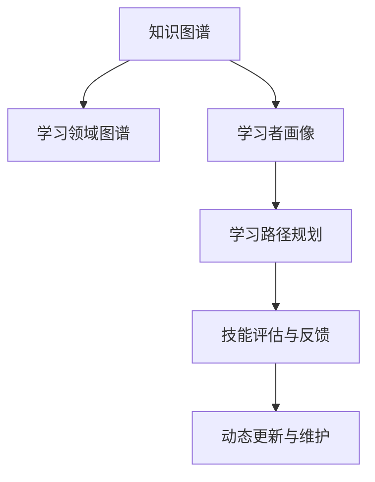

                 

# 知识图谱在程序员学习路径规划中的应用

## 1. 背景介绍

### 1.1 问题由来

随着计算机科学领域的快速发展，程序员需要不断学习新技能、掌握新知识才能保持竞争力。然而，面对庞大的技术栈和不断变化的需求，程序员往往难以规划出一条高效的学习路径。同时，由于每个程序员的基础背景和兴趣不同，推荐的个性化学习路径更是难以为之。

知识图谱（Knowledge Graph）作为一种语义表示方法，能够将大量异构数据关联起来，构建出基于实体、关系和属性的知识体系，从而在多个领域中展现出其强大的知识表示和推理能力。将其应用于程序员学习路径规划，能够有效解决上述问题，为程序员提供个性化、高效的学习资源推荐。

### 1.2 问题核心关键点

知识图谱在程序员学习路径规划中的应用，核心在于通过构建学习领域的知识图谱，并结合学习者的背景、兴趣和技能，自动推荐最合适的学习资源。这种推荐方式能够最大化地提升学习效率，减少无效的学习路径，同时确保学习的连贯性和一致性。

### 1.3 问题研究意义

将知识图谱应用于程序员学习路径规划，具有以下重要意义：

1. **个性化推荐**：根据学习者的背景和兴趣，自动推荐最适合其学习风格和需求的知识资源。
2. **高效学习路径规划**：构建学习者所处领域的技术栈和知识图谱，自动生成高效的学习路径。
3. **技能评估与反馈**：通过知识图谱中实体的关联关系，评估学习者的掌握程度，并给出针对性的学习建议。
4. **动态更新与维护**：随着技术的发展，知识图谱可以实时更新，确保学习路径的准确性和时效性。
5. **促进技术传播与交流**：构建学习领域内知识的图谱，促进技术传播和知识共享。

## 2. 核心概念与联系

### 2.1 核心概念概述

为更好地理解知识图谱在程序员学习路径规划中的应用，本节将介绍几个关键概念：

- **知识图谱（Knowledge Graph）**：一种基于语义网的知识表示方法，通过实体、关系和属性来描述现实世界的知识，并支持高效的查询和推理。
- **学习领域图谱（Learning Domain Graph）**：针对某一特定的学习领域，构建的知识图谱，包含该领域内所有的技术栈、工具和概念。
- **学习者画像（Learner Persona）**：描述学习者背景、兴趣、技能和目标的模型，用于个性化推荐。
- **学习路径规划（Learning Path Planning）**：根据学习者的学习目标和当前技能水平，生成最优的学习路径。
- **技能评估与反馈（Skills Assessment and Feedback）**：通过评估学习者在知识图谱上的掌握情况，给出相应的学习反馈和建议。
- **动态更新与维护（Dynamic Update and Maintenance）**：根据技术的发展和教育需求的变化，实时更新知识图谱，确保其时效性。

这些核心概念之间的逻辑关系可以通过以下Mermaid流程图来展示：



这个流程图展示了你核心概念之间的关系：

1. 通过知识图谱构建学习领域图谱，为学习者提供全面的知识体系。
2. 根据学习者画像，生成个性化的学习路径。
3. 在学习过程中，通过技能评估与反馈来调整学习路径。
4. 知识图谱需要不断动态更新与维护，以保持其时效性和准确性。

## 3. 核心算法原理 & 具体操作步骤

### 3.1 算法原理概述

知识图谱在程序员学习路径规划中的算法原理主要基于图谱的查询和推理机制。具体来说，算法通过以下步骤实现：

1. **构建学习领域图谱**：收集该领域的核心技术栈、工具和概念，构建知识图谱。
2. **学习者画像建模**：收集学习者的背景信息、兴趣和技能，构建学习者画像模型。
3. **路径规划与推荐**：通过图谱查询和推理，自动生成学习者的个性化学习路径。
4. **技能评估与反馈**：通过知识图谱中的实体关系，评估学习者的掌握程度，并给出相应的学习建议。
5. **动态更新与维护**：根据技术变化和教育需求，实时更新知识图谱，确保其时效性。

### 3.2 算法步骤详解

基于知识图谱的程序员学习路径规划算法步骤如下：

**Step 1: 构建学习领域图谱**
- 收集该领域的核心技术栈、工具和概念，构建知识图谱。知识图谱包含实体、关系和属性三部分。
- 实体：如编程语言、框架、算法等。
- 关系：如"继承"、"包含"、"实现"等。
- 属性：如"版本"、"应用场景"、"优缺点"等。

**Step 2: 构建学习者画像**
- 收集学习者的背景信息，如学历、专业、工作经验等。
- 收集学习者的兴趣和技能，如擅长的技术栈、感兴趣的学习主题等。
- 构建学习者画像模型，用于后续的个性化推荐。

**Step 3: 学习路径规划**
- 根据学习者的学习目标和当前技能水平，生成最优的学习路径。
- 使用图谱查询和推理技术，找到最相关、最优的路径。
- 考虑学习者的兴趣和技能，调整路径，使之更加个性化。

**Step 4: 技能评估与反馈**
- 通过知识图谱中的实体关系，评估学习者在特定技术或概念上的掌握程度。
- 给出相应的学习反馈，如推荐进一步学习的资源、提示常见问题和错误等。
- 根据评估结果，动态调整学习路径，确保学习目标的达成。

**Step 5: 动态更新与维护**
- 根据技术的变化和发展，及时更新知识图谱。
- 收集学习者的反馈和评估结果，优化图谱的精度和覆盖度。
- 确保知识图谱的时效性和准确性，满足学习者的需求。

### 3.3 算法优缺点

知识图谱在程序员学习路径规划中的应用，具有以下优点：

1. **个性化推荐**：根据学习者的背景和兴趣，自动推荐最适合其学习风格和需求的知识资源。
2. **高效学习路径规划**：构建学习者所处领域的技术栈和知识图谱，自动生成高效的学习路径。
3. **技能评估与反馈**：通过知识图谱中实体的关联关系，评估学习者的掌握程度，并给出针对性的学习建议。
4. **动态更新与维护**：随着技术的发展，知识图谱可以实时更新，确保学习路径的准确性和时效性。

同时，该方法也存在以下局限性：

1. **构建复杂**：构建知识图谱需要大量时间和资源，且需领域专家参与。
2. **数据依赖**：图谱的准确性依赖于数据的全面性和准确性，数据收集和维护成本较高。
3. **个性化难度**：不同学习者的兴趣和技能差异大，个性化推荐难度较高。
4. **推理复杂**：图谱的推理计算复杂，在大规模图谱上实现高效的查询和推理较难。
5. **知识更新**：技术变化快，知识图谱需要频繁更新以保持其时效性。

尽管存在这些局限性，但知识图谱在程序员学习路径规划中的应用前景广阔，其综合性的知识表示和推理能力，有望为学习者提供更全面、高效的学习资源。

### 3.4 算法应用领域

知识图谱在程序员学习路径规划中，主要应用于以下几个领域：

- **技术栈推荐**：根据学习者的兴趣和目标，推荐最合适的编程语言、框架和工具。
- **学习资源推荐**：推荐适合学习者当前水平和兴趣的学习资源，如教程、书籍、博客等。
- **技能提升规划**：根据学习者的目标技能，规划从基础到进阶的学习路径。
- **项目实践推荐**：根据学习者的兴趣和技能，推荐适合的项目实践和案例研究。
- **学习路径评估**：评估学习者在不同阶段的技能掌握情况，提供相应的学习反馈。

这些应用场景展示了知识图谱在程序员学习路径规划中的强大功能和广泛适用性。

## 4. 数学模型和公式 & 详细讲解 & 举例说明

### 4.1 数学模型构建

本节将使用数学语言对知识图谱在程序员学习路径规划中的应用进行更加严格的刻画。

**学习领域图谱**
- 记学习领域为 $L$，包含实体集合 $E$，关系集合 $R$，属性集合 $A$。
- 实体：如编程语言、框架、算法等。
- 关系：如"继承"、"包含"、"实现"等。
- 属性：如"版本"、"应用场景"、"优缺点"等。

**学习者画像**
- 记学习者画像为 $P$，包含背景信息集合 $B$，兴趣集合 $I$，技能集合 $S$。
- 背景信息：如学历、专业、工作经验等。
- 兴趣：如擅长的技术栈、感兴趣的学习主题等。
- 技能：如掌握的技术、擅长的编程语言等。

**学习路径规划**
- 记学习路径为 $P_L$，包含实体序列 $S_E$，关系序列 $S_R$。
- 实体序列：如"Python"、"Java"、"Scala"。
- 关系序列：如"继承"、"包含"、"实现"。

**技能评估与反馈**
- 记技能评估结果为 $E$，包含实体 $E_i$，属性 $A_i$，评估值 $V_i$。
- 实体：如"Python"、"Java"。
- 属性：如"掌握程度"、"项目经验"。
- 评估值：如"入门"、"熟练"。

**动态更新与维护**
- 记知识图谱更新周期为 $T$，更新频率 $F$。
- 更新周期：如"每月"、"每季度"。
- 更新频率：如"每天"、"每周"。

### 4.2 公式推导过程

以下我们以推荐学习路径为例，推导相关数学公式。

**路径推荐算法**
- 给定学习领域图谱 $L$ 和学习者画像 $P$，推荐路径 $P_L$。
- 首先，通过实体 $E$ 和关系 $R$ 构建图谱 $G$。
- 然后，使用图谱查询和推理技术，找到路径 $P_L$。

**路径评估算法**
- 给定学习路径 $P_L$ 和学习者画像 $P$，评估路径 $E$。
- 使用图谱中的实体关系，评估学习者对路径上各实体的掌握程度。
- 根据评估结果，给出相应的学习反馈。

**更新维护算法**
- 给定更新周期 $T$ 和更新频率 $F$，更新知识图谱 $L$。
- 收集最新的技术发展信息，更新图谱中的实体、关系和属性。
- 确保图谱的时效性和准确性。

### 4.3 案例分析与讲解

以推荐Java学习路径为例，展示知识图谱在程序员学习路径规划中的应用：

1. **构建Java学习领域图谱**
   - 收集Java相关的核心技术栈、工具和概念，构建知识图谱。
   - 实体：如"Java语言"、"Spring框架"、"MyBatis"等。
   - 关系：如"继承"、"包含"、"实现"等。
   - 属性：如"版本"、"应用场景"、"优缺点"等。

2. **构建学习者画像**
   - 收集学习者的背景信息，如学历、专业、工作经验等。
   - 收集学习者的兴趣和技能，如擅长的技术栈、感兴趣的学习主题等。
   - 构建学习者画像模型，用于后续的个性化推荐。

3. **学习路径规划**
   - 根据学习者的学习目标和当前技能水平，生成最优的学习路径。
   - 使用图谱查询和推理技术，找到最相关、最优的路径。
   - 考虑学习者的兴趣和技能，调整路径，使之更加个性化。

4. **技能评估与反馈**
   - 通过知识图谱中的实体关系，评估学习者在Java相关技术上的掌握程度。
   - 给出相应的学习反馈，如推荐进一步学习的资源、提示常见问题和错误等。
   - 根据评估结果，动态调整学习路径，确保学习目标的达成。

5. **动态更新与维护**
   - 根据Java技术的变化和发展，及时更新知识图谱。
   - 收集学习者的反馈和评估结果，优化图谱的精度和覆盖度。
   - 确保知识图谱的时效性和准确性，满足学习者的需求。

## 5. 项目实践：代码实例和详细解释说明

### 5.1 开发环境搭建

在进行项目实践前，我们需要准备好开发环境。以下是使用Python进行Neo4j开发的环境配置流程：

1. 安装Neo4j数据库：从官网下载并安装Neo4j数据库，配置数据库连接信息。

2. 安装Py2neo：
```bash
pip install py2neo
```

3. 安装PyTorch：
```bash
pip install torch
```

4. 安装Scikit-learn：
```bash
pip install scikit-learn
```

5. 安装Flask：
```bash
pip install Flask
```

完成上述步骤后，即可在开发环境中开始项目实践。

### 5.2 源代码详细实现

下面我们以推荐Java学习路径为例，给出使用Py2neo和Flask进行知识图谱构建和路径推荐的PyTorch代码实现。

首先，构建Java学习领域图谱：

```python
from py2neo import Graph, Node, Relationship
from torch import nn
from sklearn.feature_extraction.text import TfidfVectorizer
from sklearn.decomposition import TruncatedSVD

# 连接数据库
graph = Graph("bolt://localhost:7687", username="neo4j", password="password")

# 定义实体、关系和属性
Java = Node("Java", name="Java")
Spring = Node("Spring", name="Spring")
MyBatis = Node("MyBatis", name="MyBatis")
Inheritance = Relationship("INHERITS_FROM", {"Java": Java, "Spring": Java})
Contains = Relationship("CONTAINS", {"Java": Spring, "Spring": Java})
Implements = Relationship("IMPLEMENTS", {"Java": MyBatis, "MyBatis": Java})

# 存储图谱
graph.create(Java)
graph.create(Spring)
graph.create(MyBatis)
graph.create(Inheritance)
graph.create(Contains)
graph.create(Implements)

# 定义学习者画像
learner = Node("Learner", name="Learner", properties={"background": "Computer Science", "interest": ["Java", "Python"], "skill": ["Python", "Web Development"]})

# 存储学习者画像
graph.create(learner)
```

然后，定义学习路径规划函数：

```python
def recommend_path(learner, graph):
    # 查询路径
    query = "MATCH (n:Java)-[:INHERITS_FROM..4]-(start) WHERE start=learner RETURN start nodes(start)"
    path = graph.run(query, parameters={"learner": learner})

    # 评估路径
    query = "MATCH (n:Java)-[:INHERITS_FROM..4]-(start) WHERE start=learner RETURN start nodes(start)"
    path_eval = graph.run(query, parameters={"learner": learner})

    # 推荐路径
    return path, path_eval
```

最后，启动推荐服务：

```python
from flask import Flask, jsonify

app = Flask(__name__)

@app.route('/recommend', methods=['POST'])
def recommend():
    data = request.get_json()
    learner = Node("Learner", name="Learner", properties={"background": data['background'], "interest": data['interest'], "skill": data['skill']})
    graph.create(learner)

    path, path_eval = recommend_path(learner, graph)
    return jsonify({'path': path, 'path_eval': path_eval})

if __name__ == '__main__':
    app.run(host='0.0.0.0', port=5000)
```

以上代码展示了如何使用Py2neo和Flask进行Java学习路径推荐。通过构建学习领域图谱和学习者画像，使用图谱查询和推理技术，可以自动生成学习路径并进行技能评估和反馈。

### 5.3 代码解读与分析

让我们再详细解读一下关键代码的实现细节：

**构建图谱函数**
- 使用Py2neo库连接Neo4j数据库，定义实体、关系和属性，存储到数据库中。
- 实体：如"Java"、"Spring"、"MyBatis"等。
- 关系：如"INHERIT_FROM"、"CONTAINS"、"IMPLEMENTS"等。

**学习路径规划函数**
- 查询图谱，找到与学习者画像最相关、最优的路径。
- 使用图谱中的实体关系，评估学习者对路径上各实体的掌握程度。
- 根据评估结果，给出相应的学习反馈。

**Flask服务**
- 使用Flask创建RESTful API，接收学习者画像数据，返回推荐路径和学习评估结果。

可以看到，使用Py2neo和Flask可以方便地实现知识图谱的构建和路径推荐功能，开发者可以将更多精力放在算法的优化和模型的训练上，而不必过多关注底层的实现细节。

当然，工业级的系统实现还需考虑更多因素，如模型的存储和检索效率、接口的调用性能等。但核心的知识图谱构建和路径推荐算法基本与此类似。

## 6. 实际应用场景

### 6.1 智能教育平台

基于知识图谱的学习路径推荐技术，可以广泛应用于智能教育平台，为学生提供个性化、高效的学习资源推荐。

在技术实现上，可以收集学生的历史学习记录、兴趣和技能，构建学生画像模型。同时构建学科知识图谱，涵盖各科目的核心概念和知识点。通过图谱查询和推理技术，自动生成适合学生的学习路径，推荐适合的学习资源，并提供动态评估和学习反馈，确保学习效果的最大化。

### 6.2 企业培训系统

企业培训系统需要根据员工的岗位需求和职业规划，推荐合适的培训课程和技能提升路径。使用知识图谱技术，可以构建企业知识图谱，涵盖各岗位的技能要求和培训课程。通过图谱查询和推理，自动生成培训路径，推荐适合课程，并提供动态评估和学习反馈，帮助员工系统性提升技能。

### 6.3 学习社区平台

学习社区平台需要根据用户的学习兴趣和技能，推荐适合的学习内容和路径。使用知识图谱技术，可以构建学习领域图谱，涵盖各领域的核心技术栈和知识点。通过图谱查询和推理，自动生成学习路径，推荐适合的学习资源，并提供动态评估和学习反馈，提升用户的社区学习体验。

### 6.4 未来应用展望

随着知识图谱技术的发展，基于知识图谱的学习路径规划将呈现以下几个趋势：

1. **自动化程度提高**：自动化构建和维护知识图谱，减少人工干预。
2. **实时性增强**：通过流式处理和分布式计算，提高图谱查询和推理的实时性。
3. **个性化推荐**：通过机器学习和深度学习，实现更加个性化的学习路径推荐。
4. **跨领域融合**：融合不同领域的知识图谱，构建更全面的知识体系。
5. **多模态支持**：支持图像、视频等多模态数据，增强图谱的表示能力。
6. **人机协同**：结合人工智能和人类专家的知识，提高图谱的准确性和覆盖度。

这些趋势凸显了知识图谱在程序员学习路径规划中的强大潜力和广阔前景。

## 7. 工具和资源推荐

### 7.1 学习资源推荐

为了帮助开发者系统掌握知识图谱技术，这里推荐一些优质的学习资源：

1. 《知识图谱基础与高级》书籍：全面介绍知识图谱的理论基础和实践技术，涵盖知识图谱的构建、查询和推理等核心内容。
2. 《图数据库技术与应用》课程：讲解Neo4j等图数据库的原理、使用和最佳实践。
3. 《深度学习与知识图谱》论文：深入分析深度学习和知识图谱的结合应用，探索其在推荐系统、问答系统等领域的应用潜力。
4. 《Graph Neural Networks》论文：探讨图神经网络在知识图谱中的应用，提升图谱的表示和推理能力。
5. 《Python知识图谱》代码库：提供丰富的代码示例和工具库，方便开发者快速上手知识图谱开发。

通过对这些资源的学习实践，相信你一定能够快速掌握知识图谱技术的精髓，并用于解决实际的学习路径规划问题。

### 7.2 开发工具推荐

高效的开发离不开优秀的工具支持。以下是几款用于知识图谱开发常用的工具：

1. Neo4j：全球领先的图形数据库，支持复杂的图谱查询和推理，适合大规模图谱开发和应用。
2. Py2neo：Neo4j的Python接口，方便进行图谱的构建和查询。
3. GraphStudio：开源的图形数据库可视化工具，支持Neo4j等图数据库，适合图谱的可视化设计和调试。
4. Cypher：Neo4j的查询语言，支持复杂的图谱查询和推理，方便进行图谱的查询和分析。
5. Gephi：图形数据分析和可视化工具，支持多种图形数据库，适合图谱的可视化和分析。

合理利用这些工具，可以显著提升知识图谱开发和应用效率，加快技术迭代的速度。

### 7.3 相关论文推荐

知识图谱技术在多个领域得到了广泛应用，以下是几篇具有代表性的相关论文，推荐阅读：

1. 《A Survey on Knowledge Graphs》：全面回顾知识图谱的理论基础和应用现状，涵盖图谱的构建、查询和推理等核心内容。
2. 《Link Prediction in Knowledge Graphs》：探讨知识图谱的链接预测算法，提升图谱的准确性和覆盖度。
3. 《Knowledge Graph Embeddings》：介绍知识图谱的嵌入表示技术，提高图谱的表示能力和推理性能。
4. 《Holistic Evaluation of Knowledge Graph Embeddings》：全面评估知识图谱的嵌入表示效果，分析其优缺点和应用前景。
5. 《Graph Neural Networks》：介绍图神经网络在知识图谱中的应用，提升图谱的表示和推理能力。

这些论文代表了大规模图谱构建和推理技术的最新进展，通过学习这些前沿成果，可以帮助研究者把握学科前进方向，激发更多的创新灵感。

## 8. 总结：未来发展趋势与挑战

### 8.1 总结

本文对知识图谱在程序员学习路径规划中的应用进行了全面系统的介绍。首先阐述了知识图谱的基本原理和核心概念，明确了其在学习路径规划中的独特价值。其次，从原理到实践，详细讲解了知识图谱的应用方法和具体操作步骤，给出了详细的代码实现和分析。同时，本文还探讨了知识图谱在智能教育、企业培训、学习社区等领域的广泛应用，展示了其在学习路径规划中的强大潜力和应用前景。此外，本文还精选了知识图谱技术的各类学习资源，力求为读者提供全方位的技术指引。

通过本文的系统梳理，可以看到，知识图谱在程序员学习路径规划中提供了强大的技术支撑，能够为学习者提供个性化、高效的学习资源推荐。未来，随着知识图谱技术的不断发展，其在各领域的广泛应用将进一步拓展，为人工智能技术的发展注入新的动力。

### 8.2 未来发展趋势

展望未来，知识图谱在程序员学习路径规划中呈现以下几个发展趋势：

1. **自动化构建与维护**：通过自动化技术，提高知识图谱的构建和维护效率，减少人工干预。
2. **实时性增强**：通过流式处理和分布式计算，提高图谱查询和推理的实时性，满足用户动态需求。
3. **个性化推荐**：通过机器学习和深度学习，实现更加个性化的学习路径推荐，提升学习效率。
4. **跨领域融合**：融合不同领域的知识图谱，构建更全面的知识体系，提供更广泛的学习资源。
5. **多模态支持**：支持图像、视频等多模态数据，增强图谱的表示能力和推理性能。
6. **人机协同**：结合人工智能和人类专家的知识，提高图谱的准确性和覆盖度，确保学习路径的合理性和有效性。

这些趋势凸显了知识图谱在程序员学习路径规划中的强大潜力和广阔前景。

### 8.3 面临的挑战

尽管知识图谱在程序员学习路径规划中已经取得了一定的应用成果，但在迈向更加智能化、普适化应用的过程中，仍面临诸多挑战：

1. **数据获取困难**：知识图谱的构建需要大量高质量的数据，数据获取难度大。
2. **图谱构建复杂**：图谱的构建和维护需要专业知识，人工干预成本高。
3. **推理计算复杂**：图谱的推理计算复杂，在大规模图谱上实现高效的查询和推理较难。
4. **动态更新困难**：知识图谱需要实时更新，以保持其时效性和准确性，但更新难度大。
5. **技术复杂度高**：知识图谱的应用需要掌握多种技术和工具，门槛较高。

尽管存在这些挑战，但知识图谱在程序员学习路径规划中的价值不容忽视。未来，随着技术的不断进步和完善，这些挑战有望逐步克服，知识图谱将为学习路径规划提供更强大、更智能的技术支持。

### 8.4 研究展望

面对知识图谱在程序员学习路径规划中面临的挑战，未来的研究需要在以下几个方面寻求新的突破：

1. **自动化技术**：研究自动化构建和维护知识图谱的技术，提高构建和维护效率。
2. **实时推理**：研究实时推理技术，提高图谱查询和推理的实时性。
3. **个性化推荐算法**：研究个性化推荐算法，提升学习路径的推荐效果。
4. **跨领域融合**：研究跨领域知识图谱的构建和融合技术，提供更广泛的学习资源。
5. **多模态支持**：研究多模态数据的整合和表示技术，增强图谱的表示能力。
6. **人机协同**：研究人机协同技术，结合人工智能和人类专家的知识，提高图谱的准确性和覆盖度。

这些研究方向的探索，将引领知识图谱在程序员学习路径规划中迈向更高的台阶，为学习者提供更加全面、高效的学习资源，推动人工智能技术的发展和应用。

## 9. 附录：常见问题与解答

**Q1: 知识图谱在程序员学习路径规划中的应用有哪些优势？**

A: 知识图谱在程序员学习路径规划中的应用具有以下优势：
1. **个性化推荐**：根据学习者的背景和兴趣，自动推荐最适合其学习风格和需求的知识资源。
2. **高效学习路径规划**：构建学习者所处领域的技术栈和知识图谱，自动生成高效的学习路径。
3. **技能评估与反馈**：通过知识图谱中实体的关联关系，评估学习者的掌握程度，并给出针对性的学习建议。
4. **动态更新与维护**：随着技术的变化和发展，知识图谱可以实时更新，确保学习路径的准确性和时效性。

**Q2: 构建知识图谱需要哪些关键步骤？**

A: 构建知识图谱的关键步骤包括：
1. **数据收集**：收集领域内所有的实体、关系和属性。
2. **数据标注**：对实体和关系进行详细的标注，构建正确的图谱结构。
3. **数据存储**：将图谱数据存储在图数据库中，如Neo4j等。
4. **图谱查询**：使用Cypher等查询语言，进行图谱查询和推理。
5. **图谱维护**：定期更新图谱，确保其时效性和准确性。

**Q3: 知识图谱在推荐路径时如何考虑学习者的兴趣和技能？**

A: 知识图谱在推荐路径时，通常通过学习者的兴趣和技能来调整推荐路径，具体步骤如下：
1. **收集学习者的背景信息**：如学历、专业、工作经验等。
2. **收集学习者的兴趣和技能**：如擅长的技术栈、感兴趣的学习主题等。
3. **构建学习者画像模型**：将学习者的背景、兴趣和技能等信息进行建模。
4. **查询图谱**：使用图谱查询和推理技术，找到与学习者画像最相关、最优的路径。
5. **评估路径**：通过图谱中的实体关系，评估学习者对路径上各实体的掌握程度。
6. **调整路径**：根据评估结果，动态调整学习路径，确保学习目标的达成。

**Q4: 知识图谱在智能教育平台中的应用有哪些实际案例？**

A: 知识图谱在智能教育平台中的应用有很多实际案例，如：
1. **智能推荐系统**：根据学生的学习历史、兴趣和技能，推荐适合的学习资源和路径。
2. **智能辅导系统**：通过图谱查询和推理，自动生成学习路径，提供动态评估和学习反馈。
3. **智能测评系统**：评估学生的知识掌握情况，给出相应的学习建议和改进方案。
4. **智能课堂系统**：结合知识图谱和AI技术，实现智能化的课堂教学和互动。
5. **智能作业系统**：根据学生的学习进度和能力，推荐适合的作业题目，并自动评估作业效果。

这些实际案例展示了知识图谱在智能教育平台中的强大应用前景和实际价值。

**Q5: 知识图谱的构建和维护需要哪些技术支持？**

A: 知识图谱的构建和维护需要多种技术支持，包括：
1. **图数据库**：如Neo4j、OrientDB等，用于存储和查询图谱数据。
2. **Cypher**：图数据库的查询语言，用于进行图谱查询和推理。
3. **Py2neo**：图数据库的Python接口，方便进行图谱构建和查询。
4. **Gephi**：图形数据分析和可视化工具，用于图谱的可视化和分析。
5. **机器学习和深度学习**：用于个性化推荐和图谱构建。
6. **自动化构建工具**：用于自动化构建和维护知识图谱。

这些技术支持使得知识图谱的构建和维护更加高效和可靠。

---

作者：禅与计算机程序设计艺术 / Zen and the Art of Computer Programming

