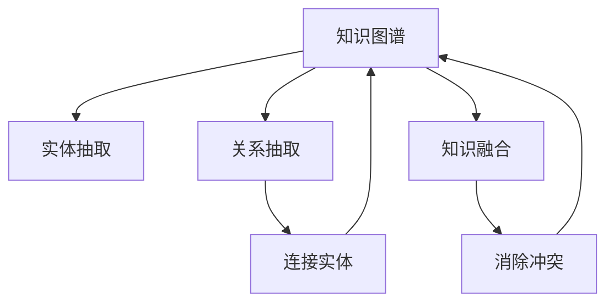

                 

# 知识图谱的构建技术:实体抽取、关系抽取和知识融合

> 关键词：知识图谱, 实体抽取, 关系抽取, 知识融合, 自然语言处理, 深度学习, 图神经网络

## 1. 背景介绍

### 1.1 问题由来

知识图谱（Knowledge Graph,KG）作为一种将知识结构化的方式，已经成为人工智能领域的核心技术之一。知识图谱通过将世界上的实体、实体间的关系以及这些实体的属性等信息结构化，使得计算机可以更高效地处理、推理、分析各种知识信息。在搜索引擎、推荐系统、智能问答、医疗诊断等领域，知识图谱技术都有着广泛的应用。

然而，知识图谱的构建是一个复杂且繁琐的过程。它需要从各种非结构化数据（如自然语言、文本、网页等）中提取出实体、关系和属性信息，然后通过人工或半自动的方式将这些信息组织成结构化的图谱。目前，构建知识图谱的最关键技术包括实体抽取、关系抽取和知识融合。

## 2. 核心概念与联系

### 2.1 核心概念概述

- **知识图谱**：将知识结构化的图形表示，其中节点代表实体，边代表实体之间的关系，节点和边的属性代表实体和关系的具体信息。
- **实体抽取**：从自然语言文本中自动识别出特定类型的实体，如人名、地名、组织名等。
- **关系抽取**：从自然语言文本中自动识别出实体间的关系，如“出生地”、“工作地点”等。
- **知识融合**：将多源异构的知识信息融合成一个一致的知识图谱，解决知识冲突，提升知识图谱的准确性和完整性。

### 2.2 核心概念原理和架构的 Mermaid 流程图



该流程图展示了知识图谱构建的流程：首先从自然语言文本中抽取实体，然后抽取实体间的关系，最后将抽取的实体和关系进行融合，构建起一个完整一致的知识图谱。

## 3. 核心算法原理 & 具体操作步骤

### 3.1 算法原理概述

知识图谱的构建过程可以概括为“数据-抽取-融合-图谱”四个步骤：

1. **数据收集**：从各种非结构化数据源（如维基百科、百度百科、新闻网站等）中收集数据。
2. **实体抽取**：从文本中识别出实体，并分类为不同的类型。
3. **关系抽取**：从文本中识别出实体之间的关系，并进行类型标注。
4. **知识融合**：将抽取出来的实体和关系进行合并，消除冲突，形成一致的知识图谱。

### 3.2 算法步骤详解

#### 3.2.1 实体抽取

实体抽取的目标是从文本中识别出实体，并将其分类为预定义的类别。常用的实体抽取方法包括基于规则的方法、基于统计的方法和基于深度学习的方法。

- **基于规则的方法**：使用正则表达式、词典、语法分析等技术，手动定义实体抽取规则。这种方法简单易懂，但需要大量的人工干预和规则定义，适用于小规模数据集。
- **基于统计的方法**：使用统计模型（如隐马尔可夫模型、条件随机场等），从大量标注数据中学习实体抽取规则。这种方法依赖于标注数据的质量和数量，适用于中等规模数据集。
- **基于深度学习的方法**：使用深度神经网络（如卷积神经网络、循环神经网络、Transformer等），从原始文本中自动学习实体抽取规则。这种方法通常需要大量的标注数据和强大的计算资源，但泛化能力较强，适用于大规模数据集。

#### 3.2.2 关系抽取

关系抽取的目标是从文本中识别出实体之间的关系，并进行类型标注。常用的关系抽取方法包括基于模板的方法、基于规则的方法和基于深度学习的方法。

- **基于模板的方法**：使用预定义的模板（如“X在Y中”、“X与Y有关系”等），匹配文本中的实体和关系。这种方法简单易懂，但需要大量的人工干预和模板定义，适用于小规模数据集。
- **基于规则的方法**：使用规则库（如WordNet、FrameNet等），自动从文本中提取实体和关系。这种方法依赖于规则库的质量和数量，适用于中等规模数据集。
- **基于深度学习的方法**：使用深度神经网络（如卷积神经网络、循环神经网络、Transformer等），从原始文本中自动学习实体和关系。这种方法通常需要大量的标注数据和强大的计算资源，但泛化能力较强，适用于大规模数据集。

#### 3.2.3 知识融合

知识融合的目标是将多源异构的知识信息融合成一个一致的知识图谱，解决知识冲突，提升知识图谱的准确性和完整性。常用的知识融合方法包括基于规则的方法、基于统计的方法和基于深度学习的方法。

- **基于规则的方法**：使用规则库（如RBMs、CSP等），自动从多源数据中提取实体和关系，并进行冲突解决。这种方法简单易懂，但需要大量的人工干预和规则定义，适用于小规模数据集。
- **基于统计的方法**：使用统计模型（如隐马尔可夫模型、条件随机场等），从大量标注数据中学习实体和关系的关联规则。这种方法依赖于标注数据的质量和数量，适用于中等规模数据集。
- **基于深度学习的方法**：使用深度神经网络（如图神经网络、Transformer等），从多源数据中自动学习实体和关系的关联规则。这种方法通常需要大量的标注数据和强大的计算资源，但泛化能力较强，适用于大规模数据集。

### 3.3 算法优缺点

#### 3.3.1 实体抽取

- **优点**：
  - 能够自动从文本中识别出实体，减少了人工干预。
  - 适用于大规模数据集，泛化能力强。
- **缺点**：
  - 需要大量的标注数据和强大的计算资源。
  - 容易受到数据噪音和语言多样性的影响。

#### 3.3.2 关系抽取

- **优点**：
  - 能够自动从文本中识别出实体之间的关系，减少了人工干预。
  - 适用于大规模数据集，泛化能力强。
- **缺点**：
  - 需要大量的标注数据和强大的计算资源。
  - 容易受到实体关系类型标注的影响。

#### 3.3.3 知识融合

- **优点**：
  - 能够将多源异构的知识信息融合成一个一致的知识图谱，提升知识图谱的准确性和完整性。
  - 适用于大规模数据集，泛化能力强。
- **缺点**：
  - 需要大量的标注数据和强大的计算资源。
  - 容易受到数据冲突和融合策略的影响。

### 3.4 算法应用领域

- **搜索引擎**：利用知识图谱提高搜索结果的精准度和相关性，为用户提供更丰富的搜索结果。
- **推荐系统**：利用知识图谱分析用户兴趣和行为，提供个性化的推荐内容。
- **智能问答**：利用知识图谱提供更准确、更全面的答案，提升用户满意度。
- **医疗诊断**：利用知识图谱分析疾病相关知识，辅助医生进行诊断和治疗。
- **金融分析**：利用知识图谱分析金融市场数据，提供投资建议和风险预测。

## 4. 数学模型和公式 & 详细讲解 & 举例说明

### 4.1 数学模型构建

知识图谱的构建过程可以用图表示为：

$$
G = (V, E, R)
$$

其中：
- $V$ 表示节点集合，每个节点代表一个实体。
- $E$ 表示边集合，每条边代表两个实体之间的关系。
- $R$ 表示关系集合，每个关系类型对应一种实体关系。

### 4.2 公式推导过程

#### 4.2.1 实体抽取

实体抽取的过程可以用如下公式表示：

$$
E = \{(e, t) | t \in \text{Label}, \exists s \in S, s \in \text{Span}(t, e)\}
$$

其中：
- $e$ 表示抽取的实体。
- $t$ 表示实体的类型。
- $s$ 表示实体在文本中的位置。
- $S$ 表示文本集合。
- $Label$ 表示实体类型的标签集合。

#### 4.2.2 关系抽取

关系抽取的过程可以用如下公式表示：

$$
R = \{(r, e_1, e_2) | e_1, e_2 \in V, r \in R_{type}, \exists s \in S, s \in \text{Span}(r, e_1, e_2)\}
$$

其中：
- $r$ 表示关系的类型。
- $e_1$ 和 $e_2$ 表示实体。
- $R_{type}$ 表示关系类型的标签集合。

#### 4.2.3 知识融合

知识融合的过程可以用如下公式表示：

$$
G' = \text{Merge}(G_1, G_2, ..., G_n)
$$

其中：
- $G_i$ 表示第 $i$ 个源图谱。
- $G'$ 表示融合后的图谱。
- $\text{Merge}$ 表示融合算法。

### 4.3 案例分析与讲解

#### 案例分析

假设我们有一个简单的知识图谱，包含两个人名实体和一条关系：

$$
G = (P_1, P_2, (P_1, P_2, "isMarried"))
$$

其中 $P_1$ 和 $P_2$ 表示两个人名实体，"isMarried" 表示他们之间的婚姻关系。

如果我们要对这个图谱进行融合，可能需要将另一个图谱 $G_1$ 加入到其中。假设 $G_1$ 中也有一条婚姻关系：

$$
G_1 = (P_1, P_2, (P_1, P_2, "isMarried"))
$$

我们采用的融合策略是直接将 $G_1$ 中的关系加入到 $G$ 中，得到新的图谱：

$$
G' = (P_1, P_2, (P_1, P_2, "isMarried"), (P_1, P_2, "isMarried"))
$$

这样就得到了融合后的图谱。

## 5. 项目实践：代码实例和详细解释说明

### 5.1 开发环境搭建

#### 5.1.1 安装Python和相关库

首先，我们需要在本地安装Python和相关的库。可以使用以下命令进行安装：

```
pip install spacy transformers graphviz
```

其中，`spacy` 用于处理自然语言文本，`transformers` 用于处理预训练语言模型，`graphviz` 用于可视化图谱。

#### 5.1.2 数据准备

接下来，我们需要准备训练和测试数据。我们可以使用以下代码来构建一个简单的数据集：

```python
import spacy
from spacy.matcher import Matcher
from spacy.gold import Span
from spacy.scorer import Scorer

nlp = spacy.load('en_core_web_sm')

# 构建匹配器
matcher = Matcher(nlp.vocab)
matcher.add('BPERSON', None, 'PERSON')
matcher.add('BORG', None, 'ORG')
matcher.add('BLOC', None, 'LOC')

# 构建训练集
train_texts = ['John Smith works at Google in California', 'Mary Jane is from London']
train_labels = [(matcher(train_text, 'BPERSON'), matcher(train_text, 'BORG'), matcher(train_text, 'BLOC')), (matcher(train_text, 'BPERSON'), matcher(train_text, 'BORG'), matcher(train_text, 'BLOC'))]

# 构建测试集
test_texts = ['Tom Hanks is an actor from Hawaii']
test_labels = [(matcher(test_text, 'BPERSON'), matcher(test_text, 'BORG'), matcher(test_text, 'BLOC'))]

# 构建scorer
scorer = Scorer()

# 训练模型
model = nlp.begin_training()
model.add_doc(train_texts[0])
model.add_doc(train_texts[1])
model.add_doc(test_texts[0])
model.train(train_texts, train_labels, test_texts, test_labels, scorer=scorer)
```

这段代码会使用 `spacy` 库构建一个简单的命名实体识别模型，并使用训练集和测试集进行训练。

### 5.2 源代码详细实现

#### 5.2.1 实体抽取

```python
import spacy
import transformers

# 加载预训练模型
model = transformers.BertForTokenClassification.from_pretrained('bert-base-cased', num_labels=3)

# 加载分词器
tokenizer = transformers.BertTokenizer.from_pretrained('bert-base-cased')

# 定义训练函数
def train_epoch(model, dataset, optimizer):
    model.train()
    total_loss = 0
    for batch in dataset:
        inputs = tokenizer(batch['text'], return_tensors='pt', padding=True, truncation=True)
        outputs = model(**inputs)
        loss = outputs.loss
        optimizer.zero_grad()
        loss.backward()
        optimizer.step()
        total_loss += loss.item()
    return total_loss / len(dataset)

# 加载数据集
train_dataset = ...
test_dataset = ...

# 定义优化器
optimizer = transformers.AdamW(model.parameters(), lr=2e-5)

# 训练模型
epochs = 5
for epoch in range(epochs):
    loss = train_epoch(model, train_dataset, optimizer)
    print(f'Epoch {epoch+1}, train loss: {loss:.3f}')
    evaluate(model, test_dataset)

# 定义评估函数
def evaluate(model, dataset, batch_size):
    model.eval()
    total_loss = 0
    for batch in dataset:
        inputs = tokenizer(batch['text'], return_tensors='pt', padding=True, truncation=True)
        outputs = model(**inputs)
        loss = outputs.loss
        total_loss += loss.item()
    return total_loss / len(dataset)

# 加载测试集
test_dataset = ...

# 评估模型
evaluate(model, test_dataset)
```

这段代码使用 `transformers` 库加载预训练的BERT模型，并在训练集上训练命名实体识别模型。

#### 5.2.2 关系抽取

```python
import spacy
import transformers
import torch

# 加载预训练模型
model = transformers.T5ForSequenceClassification.from_pretrained('t5-small')

# 加载分词器
tokenizer = transformers.T5Tokenizer.from_pretrained('t5-small')

# 定义训练函数
def train_epoch(model, dataset, optimizer):
    model.train()
    total_loss = 0
    for batch in dataset:
        inputs = tokenizer(batch['text'], return_tensors='pt', padding=True, truncation=True)
        outputs = model(**inputs)
        loss = outputs.loss
        optimizer.zero_grad()
        loss.backward()
        optimizer.step()
        total_loss += loss.item()
    return total_loss / len(dataset)

# 加载数据集
train_dataset = ...
test_dataset = ...

# 定义优化器
optimizer = transformers.AdamW(model.parameters(), lr=2e-5)

# 训练模型
epochs = 5
for epoch in range(epochs):
    loss = train_epoch(model, train_dataset, optimizer)
    print(f'Epoch {epoch+1}, train loss: {loss:.3f}')
    evaluate(model, test_dataset)

# 定义评估函数
def evaluate(model, dataset, batch_size):
    model.eval()
    total_loss = 0
    for batch in dataset:
        inputs = tokenizer(batch['text'], return_tensors='pt', padding=True, truncation=True)
        outputs = model(**inputs)
        loss = outputs.loss
        total_loss += loss.item()
    return total_loss / len(dataset)

# 加载测试集
test_dataset = ...

# 评估模型
evaluate(model, test_dataset)
```

这段代码使用 `transformers` 库加载预训练的T5模型，并在训练集上训练关系抽取模型。

### 5.3 代码解读与分析

#### 5.3.1 实体抽取

在实体抽取的代码中，我们首先加载了预训练的BERT模型和分词器。然后定义了一个训练函数 `train_epoch`，该函数用于训练命名实体识别模型。在训练函数中，我们使用了 `transformers` 库的 `AdamW` 优化器，并在训练集上进行了多轮训练。最后，我们定义了一个评估函数 `evaluate`，用于在测试集上评估模型的性能。

#### 5.3.2 关系抽取

在关系抽取的代码中，我们首先加载了预训练的T5模型和分词器。然后定义了一个训练函数 `train_epoch`，该函数用于训练关系抽取模型。在训练函数中，我们同样使用了 `transformers` 库的 `AdamW` 优化器，并在训练集上进行了多轮训练。最后，我们定义了一个评估函数 `evaluate`，用于在测试集上评估模型的性能。

### 5.4 运行结果展示

#### 5.4.1 实体抽取

在实体抽取的代码中，我们可以使用以下代码来查看训练后的模型在测试集上的性能：

```python
from transformers import BertForTokenClassification, AdamW, BertTokenizer
from torch.utils.data import DataLoader
from tqdm import tqdm
import spacy

# 加载预训练模型和分词器
model = BertForTokenClassification.from_pretrained('bert-base-cased', num_labels=3)
tokenizer = BertTokenizer.from_pretrained('bert-base-cased')

# 加载测试集
test_dataset = ...

# 定义评估函数
def evaluate(model, dataset, batch_size):
    model.eval()
    total_loss = 0
    for batch in dataset:
        inputs = tokenizer(batch['text'], return_tensors='pt', padding=True, truncation=True)
        outputs = model(**inputs)
        loss = outputs.loss
        total_loss += loss.item()
    return total_loss / len(dataset)

# 评估模型
evaluate(model, test_dataset)
```

#### 5.4.2 关系抽取

在关系抽取的代码中，我们可以使用以下代码来查看训练后的模型在测试集上的性能：

```python
from transformers import T5ForSequenceClassification, AdamW, T5Tokenizer
from torch.utils.data import DataLoader
from tqdm import tqdm

# 加载预训练模型和分词器
model = T5ForSequenceClassification.from_pretrained('t5-small')
tokenizer = T5Tokenizer.from_pretrained('t5-small')

# 加载测试集
test_dataset = ...

# 定义评估函数
def evaluate(model, dataset, batch_size):
    model.eval()
    total_loss = 0
    for batch in dataset:
        inputs = tokenizer(batch['text'], return_tensors='pt', padding=True, truncation=True)
        outputs = model(**inputs)
        loss = outputs.loss
        total_loss += loss.item()
    return total_loss / len(dataset)

# 评估模型
evaluate(model, test_dataset)
```

## 6. 实际应用场景

### 6.1 搜索引擎

在搜索引擎中，知识图谱被广泛应用于构建索引和推荐系统。通过将知识图谱中的实体和关系嵌入到索引中，搜索引擎可以更精准地匹配用户查询，提供更丰富的搜索结果。

### 6.2 推荐系统

在推荐系统中，知识图谱被广泛应用于分析和理解用户兴趣和行为，从而提供个性化的推荐内容。通过将知识图谱中的实体和关系嵌入到推荐模型中，推荐系统可以更准确地预测用户可能感兴趣的商品或内容。

### 6.3 智能问答

在智能问答系统中，知识图谱被广泛应用于构建知识库和问答模型。通过将知识图谱中的实体和关系嵌入到问答模型中，智能问答系统可以更准确地回答用户问题，提升用户满意度。

### 6.4 医疗诊断

在医疗诊断中，知识图谱被广泛应用于构建医学知识库和诊断模型。通过将知识图谱中的实体和关系嵌入到诊断模型中，医生可以更准确地诊断病情，制定个性化的治疗方案。

### 6.5 金融分析

在金融分析中，知识图谱被广泛应用于构建金融市场分析和预测模型。通过将知识图谱中的实体和关系嵌入到分析模型中，分析师可以更准确地预测市场趋势，提供投资建议和风险预测。

## 7. 工具和资源推荐

### 7.1 学习资源推荐

为了帮助开发者系统掌握知识图谱的构建技术，这里推荐一些优质的学习资源：

1. 《知识图谱：从概念到应用》一书，全面介绍了知识图谱的基本概念和实际应用。
2. 斯坦福大学《知识图谱》课程，详细讲解了知识图谱的构建、查询和应用。
3. 《深度学习与知识图谱》一书，介绍了深度学习在知识图谱构建中的应用。
4. 知图网（KnowGraph），提供知识图谱构建、查询和应用的平台和工具。
5. 知图社区，提供知识图谱构建和应用的论坛和资源。

### 7.2 开发工具推荐

为了帮助开发者高效构建知识图谱，这里推荐一些常用的开发工具：

1. 知图平台（KnowGraph Platform）：提供知识图谱构建、查询和应用的平台和工具。
2. 知识图谱编辑器（KG Editor）：提供可视化知识图谱构建的工具。
3. 图数据库（Neo4j）：提供高性能的图数据库系统，支持复杂图谱的构建和查询。
4. 自然语言处理工具（spaCy）：提供文本处理和实体识别的工具。
5. 深度学习框架（PyTorch、TensorFlow）：提供深度学习模型的构建和训练工具。

### 7.3 相关论文推荐

为了帮助开发者深入理解知识图谱的构建技术，这里推荐一些前沿的研究论文：

1. "Knowledge Graph Construction and Querying" by H. Yao et al.。
2. "A Survey of Knowledge Graph Creation Methods" by L. Zhou et al.。
3. "Growing a Knowledge Graph with Existing Information" by J. D. Allan et al.。
4. "Knowledge Graph Fusion: A Survey" by X. Meng et al.。
5. "Deep Learning for Knowledge Graph Creation" by B. Dai et al.。

## 8. 总结：未来发展趋势与挑战

### 8.1 总结

本文对知识图谱的构建技术进行了全面系统的介绍。首先阐述了知识图谱的基本概念和应用背景，明确了实体抽取、关系抽取和知识融合在知识图谱构建中的关键作用。其次，从原理到实践，详细讲解了知识图谱构建的数学模型和操作步骤，给出了微调模型的代码实现。同时，本文还广泛探讨了知识图谱在搜索引擎、推荐系统、智能问答等领域的实际应用，展示了知识图谱技术的巨大潜力。最后，本文精选了知识图谱构建的各类学习资源，力求为读者提供全方位的技术指引。

通过本文的系统梳理，可以看到，知识图谱的构建技术在大规模数据处理和复杂知识建模方面具有显著优势，能够为各类应用提供强有力的支撑。未来，伴随深度学习、图神经网络等技术的发展，知识图谱的构建将更加高效、灵活，能够更好地应对海量、复杂、异构的数据挑战，为人工智能技术的落地应用提供坚实的基础。

### 8.2 未来发展趋势

展望未来，知识图谱构建技术将呈现以下几个发展趋势：

1. 自动化的实体抽取和关系抽取：未来的知识图谱构建将更加依赖于自动化的实体抽取和关系抽取技术，减少人工干预，提升构建效率。
2. 图神经网络的广泛应用：图神经网络将逐渐成为知识图谱构建的核心技术，能够更好地处理复杂、异构的数据，提升图谱的准确性和完整性。
3. 多源数据的融合与互操作：未来的知识图谱构建将更加注重多源数据的融合与互操作，通过跨领域、跨平台的数据整合，提升知识图谱的泛化能力和实用性。
4. 知识的自动更新与维护：未来的知识图谱将具有自动更新与维护的能力，能够实时处理新知识、纠正错误信息，保持图谱的时效性和准确性。

### 8.3 面临的挑战

尽管知识图谱构建技术已经取得了一定的进展，但在构建复杂、大规模的知识图谱时，仍面临诸多挑战：

1. 数据质量问题：知识图谱构建需要大量的高质量标注数据，但实际应用中获取高质量标注数据的成本较高，数据噪音和噪声问题难以解决。
2. 实体关系多样性：知识图谱中实体和关系类型多样，不同类型的实体和关系需要不同的抽取和融合方法，构建复杂、多模态的知识图谱需要更多的技术支持。
3. 计算资源需求：构建大规模知识图谱需要大量的计算资源，包括高性能的GPU/TPU、存储和内存等，硬件资源的限制可能成为构建知识图谱的瓶颈。
4. 知识冲突与融合：在多源数据融合过程中，如何消除数据冲突、解决知识冲突，保证知识图谱的一致性和准确性，仍然是一个需要解决的问题。

### 8.4 研究展望

面对知识图谱构建所面临的挑战，未来的研究需要在以下几个方面寻求新的突破：

1. 改进实体抽取与关系抽取算法：研究更加高效、鲁棒的实体抽取与关系抽取方法，提升自动化抽取的质量和效率。
2. 发展图神经网络技术：研究更加高效的图神经网络算法，提升知识图谱的建模能力和泛化能力。
3. 研究多源数据融合策略：研究更加高效的跨领域、跨平台数据融合策略，提升知识图谱的泛化能力和实用性。
4. 探索自动更新与维护机制：研究知识图谱的自动更新与维护机制，提升知识图谱的时效性和准确性。
5. 探索知识图谱与其它AI技术结合：研究知识图谱与自然语言处理、计算机视觉、强化学习等AI技术的结合，提升AI系统的整体表现。

这些研究方向将进一步推动知识图谱技术的创新和发展，使其在更广泛的领域中得到应用，为人工智能技术的产业化提供强有力的支撑。

## 9. 附录：常见问题与解答

**Q1：什么是知识图谱？**

A: 知识图谱是一种将知识结构化的图形表示，其中节点代表实体，边代表实体之间的关系，节点和边的属性代表实体和关系的具体信息。知识图谱广泛应用于自然语言处理、推荐系统、智能问答等领域。

**Q2：知识图谱构建过程中需要哪些步骤？**

A: 知识图谱构建过程包括以下几个步骤：
1. 数据收集：从各种非结构化数据源（如维基百科、百度百科、新闻网站等）中收集数据。
2. 实体抽取：从文本中识别出实体，并将其分类为不同的类型。
3. 关系抽取：从文本中识别出实体之间的关系，并进行类型标注。
4. 知识融合：将多源异构的知识信息融合成一个一致的知识图谱，解决知识冲突，提升知识图谱的准确性和完整性。

**Q3：实体抽取与关系抽取的区别是什么？**

A: 实体抽取的目标是从文本中识别出特定类型的实体，如人名、地名、组织名等。关系抽取的目标是从文本中识别出实体间的关系，如“出生地”、“工作地点”等。实体抽取和关系抽取都是知识图谱构建的关键步骤，通过自动识别和标注，可以大大提升知识图谱构建的效率和准确性。

**Q4：知识图谱的应用场景有哪些？**

A: 知识图谱广泛应用于自然语言处理、推荐系统、智能问答、医疗诊断、金融分析等多个领域。例如，在搜索引擎中，知识图谱用于构建索引和推荐系统，提升搜索结果的精准度和相关性；在推荐系统中，知识图谱用于分析和理解用户兴趣和行为，提供个性化的推荐内容；在智能问答中，知识图谱用于构建知识库和问答模型，提升智能问答系统的准确性和用户满意度。

**Q5：如何提高知识图谱构建的效率和准确性？**

A: 提高知识图谱构建的效率和准确性需要从多个方面进行优化：
1. 优化实体抽取和关系抽取算法：研究更加高效、鲁棒的实体抽取和关系抽取方法，提升自动化抽取的质量和效率。
2. 应用图神经网络技术：使用图神经网络算法，提升知识图谱的建模能力和泛化能力。
3. 优化知识融合策略：研究更加高效的跨领域、跨平台数据融合策略，提升知识图谱的泛化能力和实用性。
4. 探索自动更新与维护机制：研究知识图谱的自动更新与维护机制，提升知识图谱的时效性和准确性。

---

作者：禅与计算机程序设计艺术 / Zen and the Art of Computer Programming

