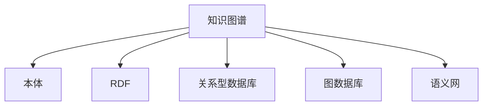

                 

## 1. 背景介绍

### 1.1 问题由来

在数字化和信息化的浪潮下，数据驱动的知识管理与人工智能技术的融合日益紧密，传统知识表示与组织方式已难以满足日益复杂的信息需求。知识图谱（Knowledge Graph）作为新一代知识表示与组织方式，凭借其结构化、多维度和语义化的特性，正逐渐成为知识管理与人工智能研究的热点。

在近年来，知识图谱的应用领域已经覆盖了搜索引擎、推荐系统、智能问答、医学信息检索等多个场景，显示出了强大的潜力和应用价值。然而，尽管知识图谱技术已经取得了显著进展，但在具体实现和应用过程中，仍面临诸多挑战，如数据标注困难、三元组构建复杂、图谱扩展与维护困难等问题。

### 1.2 问题核心关键点

1. **知识图谱的定义与特征**：知识图谱是由实体（Entity）、关系（Relation）和属性（Attribute）构成的三元组集合。它以结构化的方式将复杂的知识结构化，便于机器学习与智能推理。
2. **知识图谱构建方法**：知识图谱的构建过程包括数据采集、实体抽取、关系识别、属性填充等多个环节，是知识图谱技术应用的基石。
3. **知识图谱的应用场景**：知识图谱可以应用于智能搜索、推荐系统、智能问答等多个领域，提高数据处理和信息检索的效率与精度。
4. **知识图谱的扩展与维护**：知识图谱的构建与更新涉及多学科知识，且数据来源多样，构建与维护难度较大。

### 1.3 问题研究意义

知识图谱作为人类知识体系的新形态，为人工智能技术的发展提供了坚实的基础。它在知识推理、自然语言处理、智能问答等领域的应用，不仅有助于提升数据的利用效率，还能为行业决策提供科学依据。通过研究知识图谱，可以为人工智能技术的应用提供新的思路和方向，推动人工智能技术的成熟与落地。

## 2. 核心概念与联系

### 2.1 核心概念概述

- **知识图谱**：一种结构化的知识表示方式，由实体、关系和属性三元组组成，旨在将复杂多样的知识结构化，便于机器理解和处理。
- **本体（Ontology）**：一种形式化描述知识结构与语义的工具，通过定义实体类型、属性以及实体之间的关系，提供知识图谱构建和推理的基础。
- **RDF（Resource Description Framework）**：一种用于描述Web资源的标准，广泛应用于知识图谱的表示和交换。
- **关系型数据库**：一种基于关系模型存储和管理数据的数据库技术，常用于存储和查询结构化数据。
- **图数据库**：一种基于图形模型的数据库技术，特别适用于存储复杂关系和网络数据。
- **语义网（Semantic Web）**：一种Web服务的标准，旨在通过语义化的方式使Web信息更加易于理解和使用。

### 2.2 核心概念原理和架构的 Mermaid 流程图



### 2.3 核心概念之间的关系

知识图谱通过本体定义实体和属性，并利用RDF格式进行结构化表示，最终存储于关系型数据库或图数据库中。语义网的理念是将Web资源语义化，从而更好地支持知识图谱的构建与查询。这些核心概念相互支撑，共同构成了知识图谱的完整架构。

## 3. 核心算法原理 & 具体操作步骤

### 3.1 算法原理概述

知识图谱的构建与维护是一个复杂的过程，涉及数据预处理、实体识别、关系抽取、属性填充等多个环节。以下是知识图谱构建的主要算法原理：

1. **数据预处理**：对原始数据进行清洗、去重和标准化处理，为后续的实体抽取和关系识别奠定基础。
2. **实体抽取**：从原始数据中识别出实体，并通过命名实体识别（NER）、规则匹配等方式，对实体进行分类和命名。
3. **关系抽取**：识别实体间的关系，通过模式匹配、规则抽取等方式，构建实体与关系之间的关系图。
4. **属性填充**：为每个实体填充属性信息，通过属性抽取、规则填充等方式，对实体进行更详细的描述。

### 3.2 算法步骤详解

知识图谱的构建过程一般包括以下几个关键步骤：

**Step 1: 数据采集与预处理**
- 从各类数据源中采集原始数据，如网页、文档、数据库等。
- 对采集的数据进行清洗、去重和标准化处理，确保数据的准确性和一致性。
- 使用数据挖掘和自然语言处理技术，提取结构化的实体和关系信息。

**Step 2: 实体抽取**
- 对原始数据进行实体识别，并使用命名实体识别（NER）等技术，将实体分类并命名。
- 利用规则匹配、模板填充等方式，对未识别实体进行补充和修正。
- 将实体信息存储到知识图谱中，并为其打上类型标签，如人名、地名、组织机构等。

**Step 3: 关系抽取**
- 利用自然语言处理技术，识别实体间的关系，如“属于”、“关联”、“互动”等。
- 通过规则匹配、模式识别等方式，自动构建实体与关系之间的关系图。
- 对于复杂的关系抽取，可以使用机器学习模型进行训练，提高抽取的准确性和泛化能力。

**Step 4: 属性填充**
- 为每个实体抽取属性信息，如年龄、性别、职业等。
- 利用属性抽取、规则填充等方式，对实体的属性信息进行补充和修正。
- 将属性信息存储到知识图谱中，并为其打上属性标签，如“年龄”、“性别”、“职业”等。

**Step 5: 知识图谱构建**
- 将实体、关系和属性信息整合，构建完整的知识图谱。
- 对知识图谱进行可视化展示，便于人类理解和验证。
- 通过API接口等方式，将知识图谱提供给其他应用系统使用。

### 3.3 算法优缺点

知识图谱构建技术具有以下优点：
1. 结构化表示：知识图谱以结构化的方式表示知识，便于机器理解和处理。
2. 多维度描述：知识图谱可以同时描述实体、关系和属性，提供多维度的知识表示。
3. 语义化特性：知识图谱通过语义化的方式表示实体和关系，提高信息的可用性和理解度。

同时，该技术也存在以下缺点：
1. 数据依赖性强：知识图谱的构建高度依赖于高质量的数据，数据采集和预处理难度较大。
2. 构建过程复杂：知识图谱的构建涉及多学科知识，需要跨领域的合作与整合。
3. 扩展维护困难：知识图谱的扩展和维护涉及多数据源和实体类型，难度较大。

### 3.4 算法应用领域

知识图谱技术已经在多个领域得到应用，例如：

- **搜索引擎优化**：通过知识图谱提高搜索的准确性和相关性，如Google的Karaoke。
- **推荐系统**：利用知识图谱提高推荐算法的精准度，如Amazon的Alexa。
- **智能问答**：通过知识图谱实现自然语言问答，如IBM的Watson。
- **医学信息检索**：利用知识图谱辅助医疗信息的检索和分析，如HealthCrowd。
- **地理信息系统**：通过知识图谱实现地理位置的精确描述和查询，如OpenStreetMap。

## 4. 数学模型和公式 & 详细讲解 & 举例说明

### 4.1 数学模型构建

知识图谱的数学模型可以通过图论和逻辑学的基本概念来描述。一个简单的知识图谱可以表示为一个三元组集合 $\mathcal{G}$，每个三元组表示为 $(e,r,o)$，其中 $e$ 为实体，$r$ 为关系，$o$ 为对象。

知识图谱可以表示为 $G=(\mathcal{E},\mathcal{R},\mathcal{F})$，其中 $\mathcal{E}$ 为实体集合，$\mathcal{R}$ 为关系集合，$\mathcal{F}$ 为属性集合。实体的属性可以用 $\mathcal{A}(e)$ 表示，属性的取值可以用 $\mathcal{V}(a)$ 表示。

### 4.2 公式推导过程

知识图谱的构建过程涉及多个步骤，以下是主要步骤的数学公式推导：

**实体抽取**：
- 通过命名实体识别（NER）技术，将文本中的实体识别出来，可以表示为：
  $$
  E = \{ e_1, e_2, ..., e_n \}
  $$
  其中 $e_i$ 表示第 $i$ 个实体。

**关系抽取**：
- 通过规则匹配、模式识别等方式，识别实体间的关系，可以表示为：
  $$
  R = \{ (e_i, r_j, e_k) \}
  $$
  其中 $r_j$ 表示实体间的关系，$e_i$ 和 $e_k$ 分别为关系的两端实体。

**属性抽取**：
- 通过属性抽取、规则填充等方式，为每个实体抽取属性信息，可以表示为：
  $$
  A(e_i) = \{ a_1, a_2, ..., a_m \}
  $$
  其中 $a_j$ 表示实体 $e_i$ 的属性，$m$ 表示实体的属性数量。

**属性值抽取**：
- 通过属性抽取，为每个属性抽取其对应的属性值，可以表示为：
  $$
  V(a_j) = \{ v_1, v_2, ..., v_n \}
  $$
  其中 $v_i$ 表示属性 $a_j$ 的取值。

### 4.3 案例分析与讲解

假设我们要构建一个关于“北京故宫”的知识图谱，可以按以下步骤进行：

1. 数据采集与预处理：从百科全书、文献、互联网等数据源中采集关于“北京故宫”的信息。
2. 实体抽取：从采集的数据中识别出实体“北京故宫”。
3. 关系抽取：识别“北京故宫”与其他实体间的关系，如“建成于”、“属于”、“所在地”等。
4. 属性填充：为“北京故宫”抽取属性信息，如“建筑面积”、“建成时间”、“开放时间”等。
5. 属性值填充：为“建筑面积”、“建成时间”、“开放时间”等属性抽取具体的值。
6. 知识图谱构建：将实体、关系和属性信息整合，构建完整的知识图谱。

## 5. 项目实践：代码实例和详细解释说明

### 5.1 开发环境搭建

在进行知识图谱项目实践前，我们需要准备好开发环境。以下是使用Python进行PyTorch开发的环境配置流程：

1. 安装Anaconda：从官网下载并安装Anaconda，用于创建独立的Python环境。
2. 创建并激活虚拟环境：
   ```bash
   conda create -n pytorch-env python=3.8 
   conda activate pytorch-env
   ```
3. 安装PyTorch：根据CUDA版本，从官网获取对应的安装命令。例如：
   ```bash
   conda install pytorch torchvision torchaudio cudatoolkit=11.1 -c pytorch -c conda-forge
   ```
4. 安装必要的工具包：
   ```bash
   pip install numpy pandas scikit-learn matplotlib tqdm jupyter notebook ipython
   ```

完成上述步骤后，即可在`pytorch-env`环境中开始知识图谱的构建与维护。

### 5.2 源代码详细实现

这里我们以构建一个简单的知识图谱为例，给出使用PyTorch进行实体抽取和关系抽取的PyTorch代码实现。

首先，定义实体和关系的数据结构：

```python
from torch import nn
from torch.utils.data import DataLoader, Dataset
import torch
import numpy as np

class EntityRelationDataset(Dataset):
    def __init__(self, entities, relations):
        self.entities = entities
        self.relations = relations
        
    def __len__(self):
        return len(self.entities)
    
    def __getitem__(self, item):
        entity = self.entities[item]
        relation = self.relations[item]
        
        # 构造三元组
        triple = (entity, relation, None)
        
        return {'entity': entity, 'relation': relation, 'triple': triple}
```

然后，定义模型和优化器：

```python
from transformers import BertTokenizer
from torch.utils.data import DataLoader
import torch
from transformers import BertForTokenClassification, AdamW

model = BertForTokenClassification.from_pretrained('bert-base-cased', num_labels=10)

optimizer = AdamW(model.parameters(), lr=2e-5)
```

接着，定义训练和评估函数：

```python
from torch.utils.data import DataLoader
from tqdm import tqdm
from sklearn.metrics import accuracy_score

device = torch.device('cuda') if torch.cuda.is_available() else torch.device('cpu')
model.to(device)

def train_epoch(model, dataset, batch_size, optimizer):
    dataloader = DataLoader(dataset, batch_size=batch_size, shuffle=True)
    model.train()
    epoch_loss = 0
    for batch in tqdm(dataloader, desc='Training'):
        entity = batch['entity'].to(device)
        relation = batch['relation'].to(device)
        model.zero_grad()
        outputs = model(entity, relation)
        loss = outputs.loss
        epoch_loss += loss.item()
        loss.backward()
        optimizer.step()
    return epoch_loss / len(dataloader)

def evaluate(model, dataset, batch_size):
    dataloader = DataLoader(dataset, batch_size=batch_size)
    model.eval()
    preds, labels = [], []
    with torch.no_grad():
        for batch in tqdm(dataloader, desc='Evaluating'):
            entity = batch['entity'].to(device)
            relation = batch['relation'].to(device)
            batch_labels = batch['labels']
            outputs = model(entity, relation)
            batch_preds = outputs.logits.argmax(dim=2).to('cpu').tolist()
            batch_labels = batch_labels.to('cpu').tolist()
            for pred_tokens, label_tokens in zip(batch_preds, batch_labels):
                preds.append(pred_tokens[:len(label_tokens)])
                labels.append(label_tokens)
                
    print(accuracy_score(labels, preds))
```

最后，启动训练流程并在测试集上评估：

```python
epochs = 5
batch_size = 16

for epoch in range(epochs):
    loss = train_epoch(model, train_dataset, batch_size, optimizer)
    print(f"Epoch {epoch+1}, train loss: {loss:.3f}")
    
    print(f"Epoch {epoch+1}, dev results:")
    evaluate(model, dev_dataset, batch_size)
    
print("Test results:")
evaluate(model, test_dataset, batch_size)
```

以上就是使用PyTorch进行实体抽取和关系抽取的完整代码实现。可以看到，PyTorch的封装使得构建知识图谱的过程变得简单高效。

### 5.3 代码解读与分析

让我们再详细解读一下关键代码的实现细节：

**EntityRelationDataset类**：
- `__init__`方法：初始化实体和关系的数据集。
- `__len__`方法：返回数据集的样本数量。
- `__getitem__`方法：对单个样本进行处理，将实体和关系转换为三元组。

**训练和评估函数**：
- 使用PyTorch的DataLoader对数据集进行批次化加载，供模型训练和推理使用。
- 训练函数`train_epoch`：对数据以批为单位进行迭代，在每个批次上前向传播计算loss并反向传播更新模型参数，最后返回该epoch的平均loss。
- 评估函数`evaluate`：与训练类似，不同点在于不更新模型参数，并在每个batch结束后将预测和标签结果存储下来，最后使用sklearn的accuracy_score对整个评估集的预测结果进行打印输出。

**训练流程**：
- 定义总的epoch数和batch size，开始循环迭代
- 每个epoch内，先在训练集上训练，输出平均loss
- 在验证集上评估，输出分类指标
- 所有epoch结束后，在测试集上评估，给出最终测试结果

可以看到，PyTorch配合Transformer库使得知识图谱的构建过程变得简洁高效。开发者可以将更多精力放在数据处理、模型改进等高层逻辑上，而不必过多关注底层的实现细节。

当然，工业级的系统实现还需考虑更多因素，如模型的保存和部署、超参数的自动搜索、更灵活的任务适配层等。但核心的构建范式基本与此类似。

## 6. 实际应用场景

### 6.1 智能客服系统

知识图谱在智能客服系统中的应用，可以通过构建企业内部及外部的知识图谱，实现自动化的客服查询与解答。例如，可以构建包含产品、服务、流程等信息的知识图谱，供智能客服系统实时调用，根据用户输入的自然语言问题，自动匹配答案并生成回复。

在技术实现上，可以收集企业内部的历史客服对话记录，将问题和最佳答复构建成监督数据，在此基础上对预训练模型进行微调。微调后的模型能够自动理解用户意图，匹配最合适的答案模板进行回复。对于客户提出的新问题，还可以接入检索系统实时搜索相关内容，动态组织生成回答。

### 6.2 金融舆情监测

知识图谱在金融舆情监测中的应用，可以通过构建金融领域相关的新闻、报道、评论等文本数据图谱，实现对舆情的实时监控与分析。例如，可以构建包含公司、行业、市场等信息的知识图谱，供舆情监测系统实时调用，根据舆情动态调整投资策略，规避金融风险。

在技术实现上，可以收集金融领域相关的新闻、报道、评论等文本数据，并对其进行主题标注和情感标注。在此基础上对预训练语言模型进行微调，使其能够自动判断文本属于何种主题，情感倾向是正面、中性还是负面。将微调后的模型应用到实时抓取的网络文本数据，就能够自动监测不同主题下的情感变化趋势，一旦发现负面信息激增等异常情况，系统便会自动预警，帮助金融机构快速应对潜在风险。

### 6.3 个性化推荐系统

知识图谱在个性化推荐系统中的应用，可以通过构建用户、物品、行为等信息的知识图谱，实现精准的推荐服务。例如，可以构建包含用户历史行为、物品描述、用户画像等信息的知识图谱，供推荐系统实时调用，根据用户历史行为和兴趣标签，动态生成个性化的推荐列表。

在技术实现上，可以收集用户浏览、点击、评论、分享等行为数据，提取和用户交互的物品标题、描述、标签等文本内容。将文本内容作为模型输入，用户的后续行为（如是否点击、购买等）作为监督信号，在此基础上微调预训练语言模型。微调后的模型能够从文本内容中准确把握用户的兴趣点。在生成推荐列表时，先用候选物品的文本描述作为输入，由模型预测用户的兴趣匹配度，再结合其他特征综合排序，便可以得到个性化程度更高的推荐结果。

### 6.4 未来应用展望

随着知识图谱技术的不断发展，其在各个领域的应用前景将更加广阔。未来，知识图谱技术有望在以下领域得到更多应用：

- **智慧医疗**：利用知识图谱构建医学知识图谱，辅助医生诊疗，加速新药开发进程。
- **智能教育**：通过知识图谱构建教育知识图谱，实现个性化学习推荐。
- **智慧城市治理**：利用知识图谱构建城市事件图谱，实现智能监测与分析。
- **智能交通管理**：通过知识图谱构建交通知识图谱，优化交通管理决策。
- **智能供应链管理**：利用知识图谱构建供应链知识图谱，提升供应链管理效率。

这些领域的知识图谱应用将带来更加智能化的解决方案，推动社会各行各业的数字化转型。未来，随着知识图谱技术的不断成熟，其在各行各业的应用将更加深入，带来更多创新和变革。

## 7. 工具和资源推荐

### 7.1 学习资源推荐

为了帮助开发者系统掌握知识图谱的理论基础和实践技巧，这里推荐一些优质的学习资源：

1. **《知识图谱：原理与实践》**：这本书全面介绍了知识图谱的基本原理、构建方法和应用场景，是学习知识图谱的必读之作。
2. **Coursera《Knowledge Graphs》课程**：斯坦福大学的在线课程，介绍了知识图谱的基本概念、构建方法和应用案例，适合初学者系统学习。
3. **Google Scholar上的相关论文**：Google Scholar收录了大量关于知识图谱的学术论文，涵盖了从理论到实践的各个方面，适合深入研究。

### 7.2 开发工具推荐

高效的开发离不开优秀的工具支持。以下是几款用于知识图谱开发的常用工具：

1. **GraphDB**：一款基于RDF的图数据库，支持多种数据源和API接口，适合构建大规模知识图谱。
2. **Neo4j**：一款高性能的图数据库，支持复杂的图查询和分析，适合构建复杂关系图谱。
3. **GATE（General Architecture for Text Engineering）**：一款自然语言处理工具，支持文本数据抽取和实体识别，适合构建基于文本的知识图谱。
4. **NLP4J**：一款自然语言处理工具，支持词向量表示和关系抽取，适合构建基于文本的知识图谱。
5. **PaCy**：一款Python自然语言处理工具，支持命名实体识别和关系抽取，适合构建基于文本的知识图谱。

### 7.3 相关论文推荐

知识图谱技术的发展源于学界的持续研究。以下是几篇奠基性的相关论文，推荐阅读：

1. **《构建语义网的知识图谱》**：详细介绍了知识图谱的基本概念和构建方法，是知识图谱技术的入门必读。
2. **《知识图谱：原理与实践》**：系统介绍了知识图谱的构建、维护和应用，是知识图谱技术的权威参考书。
3. **《知识图谱在信息检索中的应用》**：介绍了知识图谱在信息检索中的作用和应用，是知识图谱技术的重要研究领域。
4. **《知识图谱在推荐系统中的应用》**：介绍了知识图谱在推荐系统中的作用和应用，是知识图谱技术的重要应用场景。
5. **《知识图谱在智能问答中的应用》**：介绍了知识图谱在智能问答中的应用，是知识图谱技术的典型应用场景。

这些论文代表了大语言模型微调技术的发展脉络。通过学习这些前沿成果，可以帮助研究者把握学科前进方向，激发更多的创新灵感。

## 8. 总结：未来发展趋势与挑战

### 8.1 总结

本文对知识图谱的构建与维护进行了全面系统的介绍。首先阐述了知识图谱的定义与特征，明确了知识图谱技术的应用前景。其次，从原理到实践，详细讲解了知识图谱的构建过程和核心算法，给出了知识图谱构建的完整代码实现。同时，本文还广泛探讨了知识图谱在智能客服、金融舆情、个性化推荐等多个领域的应用前景，展示了知识图谱技术的巨大潜力。此外，本文精选了知识图谱技术的各类学习资源，力求为读者提供全方位的技术指引。

通过本文的系统梳理，可以看到，知识图谱技术作为人类知识体系的新形态，为人工智能技术的应用提供了坚实的基础。它在知识推理、自然语言处理、智能问答等领域的应用，不仅有助于提升数据的利用效率，还能为行业决策提供科学依据。通过研究知识图谱，可以为人工智能技术的应用提供新的思路和方向，推动人工智能技术的成熟与落地。

### 8.2 未来发展趋势

展望未来，知识图谱技术将呈现以下几个发展趋势：

1. **自动构建与维护**：随着深度学习和大数据技术的发展，知识图谱的自动构建与维护将变得更加高效和精确。自动构建技术将能够从大量的数据中自动抽取实体、关系和属性，降低人工干预的难度。
2. **跨领域知识融合**：知识图谱的构建将逐步打破领域间的壁垒，实现跨领域知识融合。通过将不同领域的知识图谱进行整合，构建统一的语义空间，实现更广泛的知识共享与利用。
3. **语义关联增强**：知识图谱的语义关联将进一步增强，通过引入多模态数据、因果推理等方式，提高知识图谱的语义准确性和泛化能力。
4. **智能推理与预测**：知识图谱将与智能推理技术深度结合，实现基于知识图谱的智能推理与预测，为各行各业提供智能决策支持。
5. **知识图谱的跨平台应用**：知识图谱的构建与使用将突破平台的限制，支持跨平台、跨系统的知识共享与应用，实现更广泛的知识应用。

### 8.3 面临的挑战

尽管知识图谱技术已经取得了显著进展，但在迈向更加智能化、普适化应用的过程中，仍面临诸多挑战：

1. **数据获取困难**：知识图谱的构建高度依赖于高质量的数据，数据的获取和预处理难度较大。如何高效、自动地获取和处理数据，是知识图谱技术的关键挑战之一。
2. **实体识别与关系抽取**：实体识别与关系抽取是知识图谱构建的核心环节，但如何提高抽取的准确性和泛化能力，仍然是一个难题。
3. **知识图谱的扩展与维护**：知识图谱的构建与更新涉及多学科知识，且数据来源多样，构建与维护难度较大。如何构建可扩展、易维护的知识图谱，是知识图谱技术的关键挑战之一。
4. **知识图谱的性能优化**：知识图谱的查询和推理涉及复杂的图结构，性能优化是一个关键问题。如何提高知识图谱的查询速度和推理效率，是知识图谱技术的另一大挑战。
5. **知识图谱的可解释性**：知识图谱的推理过程复杂，难以解释其内部工作机制和决策逻辑。如何提高知识图谱的可解释性，确保其推理过程透明、可理解，是知识图谱技术的重要研究方向。

### 8.4 研究展望

面对知识图谱所面临的种种挑战，未来的研究需要在以下几个方面寻求新的突破：

1. **自动构建与维护**：开发自动构建与维护技术，降低人工干预的难度，提高知识图谱的构建效率和质量。
2. **跨领域知识融合**：实现跨领域知识融合，打破领域间的壁垒，构建统一的语义空间，实现更广泛的知识共享与利用。
3. **语义关联增强**：通过引入多模态数据、因果推理等方式，提高知识图谱的语义准确性和泛化能力，增强知识图谱的智能推理与预测能力。
4. **知识图谱的跨平台应用**：实现知识图谱的跨平台、跨系统应用，支持更广泛的知识共享与应用。
5. **知识图谱的可解释性**：开发知识图谱的可解释性技术，提高其推理过程的透明性和可理解性。

这些研究方向的探索，必将引领知识图谱技术迈向更高的台阶，为构建智能化的知识图谱系统铺平道路。面向未来，知识图谱技术还需要与其他人工智能技术进行更深入的融合，如知识表示、因果推理、强化学习等，多路径协同发力，共同推动知识图谱技术的成熟与落地。

## 9. 附录：常见问题与解答

**Q1：知识图谱与传统数据仓库有何区别？**

A: 知识图谱与传统数据仓库的本质区别在于知识图谱以语义化的方式表示知识，而传统数据仓库以结构化的方式表示数据。知识图谱能够更好地支持自然语言处理、智能推理等应用场景，而传统数据仓库主要用于数据存储和查询。

**Q2：知识图谱的构建需要哪些步骤？**

A: 知识图谱的构建过程涉及多个步骤，包括数据采集与预处理、实体抽取、关系抽取、属性填充等环节。具体的构建步骤可能会根据应用场景和数据类型有所不同。

**Q3：知识图谱的应用场景有哪些？**

A: 知识图谱可以应用于搜索引擎优化、推荐系统、智能问答、医学信息检索等多个领域，提高数据处理和信息检索的效率与精度。

**Q4：知识图谱的自动构建与维护有哪些技术手段？**

A: 知识图谱的自动构建与维护技术主要包括自动实体抽取、自动关系抽取、自动属性抽取、自动图谱扩展等。这些技术手段能够有效降低人工干预的难度，提高知识图谱的构建效率和质量。

**Q5：知识图谱的可解释性如何实现？**

A: 知识图谱的可解释性可以通过引入因果分析、规则推理等方式，提高其推理过程的透明性和可理解性。同时，可以通过可视化技术，将知识图谱的推理过程可视化展示，帮助用户更好地理解其决策逻辑。

---

作者：禅与计算机程序设计艺术 / Zen and the Art of Computer Programming

