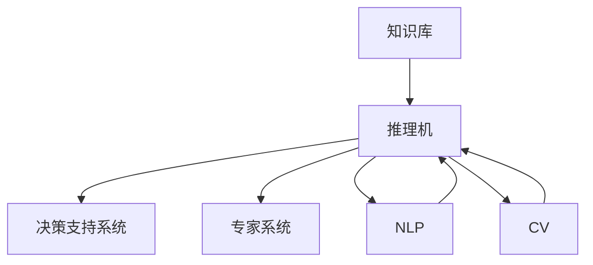

                 

# 知识工程：构建智能系统的基石

## 1. 背景介绍

### 1.1 问题由来
在人工智能（AI）的发展过程中，知识工程（Knowledge Engineering，KE）扮演着至关重要的角色。知识工程旨在将人类专家知识显式化、结构化，并通过算法实现自动化的处理与推理，构建智能系统。知识工程的成果不仅限于技术领域，更在医疗、金融、教育等多个领域带来了颠覆性变革。

当前，随着大数据、深度学习等技术的迅猛发展，知识工程的应用范围和深度在不断扩展。从早期的专家系统到智能问答系统、推荐系统，再到如今的自然语言处理（NLP）、计算机视觉（CV）等，知识工程的技术体系日渐完善，正在迈向更广泛的应用。然而，知识工程的复杂性和跨学科特性也带来了诸多挑战，需要不断探索和突破。

### 1.2 问题核心关键点
知识工程的核心在于如何有效地将人类知识转化为机器可理解的模型和算法，并在实际应用中实现智能化决策。具体来说，核心关键点包括：

- 知识表示：如何通过符号化或语义化的方式，将知识转化为计算机可处理的形式。
- 知识推理：如何设计规则和算法，实现知识的逻辑推理和自动化推导。
- 知识获取：如何自动获取知识，避免对专家知识过度依赖。
- 知识优化：如何通过机器学习等手段，持续优化知识库和推理系统。

在实践中，知识工程的应用往往需要跨学科协作，整合不同领域的知识和算法，形成系统化的解决方案。这一过程不仅涉及技术层面，更要求对领域知识和应用场景有深刻理解。

### 1.3 问题研究意义
知识工程的研究与实践，对于构建智能系统具有重要意义：

- 提升决策效率：通过自动化的知识获取和推理，大幅缩短决策时间，提高工作效率。
- 增强系统鲁棒性：构建基于知识的推理机制，能够应对数据缺失和噪声，提升系统的稳定性和可靠性。
- 促进跨领域应用：知识工程技术可以跨领域应用，推动不同领域的协同创新。
- 推动人工智能发展：知识工程的实践经验为机器学习、深度学习等技术提供了更多真实场景，推动AI技术的进步。
- 赋能行业转型：知识工程在医疗、金融、教育等行业的应用，为传统行业的数字化转型提供了技术支撑。

## 2. 核心概念与联系

### 2.1 核心概念概述

知识工程的核心理念是将人类专家知识结构化、形式化，并通过算法实现其自动化处理和推理。以下是知识工程中的几个核心概念：

- 知识库(Knowledge Base)：存储和组织知识的结构化数据库，通常包含事实、规则和关系等。
- 推理机(Inference Engine)：执行知识推理，根据规则和事实推导新的知识和结论的引擎。
- 专家系统(Expert System)：基于知识库和推理机，提供领域专家水平的决策支持系统的软件系统。
- 自然语言处理(NLP)：使计算机能够理解、处理和生成自然语言的技术。
- 计算机视觉(CV)：使计算机能够“看”和理解图像、视频等视觉信息的领域。

这些概念之间存在紧密的联系。知识库存储知识，推理机实现知识推理，而自然语言处理和计算机视觉技术则提供了从非结构化数据中提取和理解知识的手段。

### 2.2 核心概念原理和架构的 Mermaid 流程图



这个流程图展示了知识工程的基本架构：

1. **知识库(KD)**：存储领域专家知识，包括事实、规则、关系等。
2. **推理机(ME)**：根据知识库中的事实和规则，进行逻辑推理，产生新的知识和结论。
3. **决策支持系统(DS)**：基于推理机的输出，辅助用户做出决策。
4. **专家系统(AE)**：一个特定的DS，通常聚焦于特定的领域或问题。
5. **自然语言处理(NLP)**：从文本中提取和理解知识，扩展知识库的输入来源。
6. **计算机视觉(CV)**：从图像和视频中提取和理解知识，扩展知识库的输入来源。

这些组件相互协作，共同构建了知识工程的生态系统。

## 3. 核心算法原理 & 具体操作步骤

### 3.1 算法原理概述

知识工程的算法原理主要围绕知识表示和推理展开。知识表示是将领域知识结构化和形式化，而知识推理则是根据已知知识推导出新的结论。

- **知识表示**：通常采用符号逻辑、框架、语义网络等方式表示知识。符号逻辑使用逻辑符号和规则表示知识，框架使用类和属性表示知识，语义网络使用节点和边表示知识。
- **知识推理**：常用的推理方法包括前向推理、反向推理、一致性检测等。前向推理从已知事实出发，逐步推导出新结论；反向推理从目标结论出发，推导出必要的前提条件；一致性检测则是判断推理结果与知识库的一致性。

### 3.2 算法步骤详解

知识工程的实现通常包括以下几个步骤：

**Step 1: 知识获取**
- 通过专家访谈、文献回顾等方式，收集领域专家的知识。
- 使用自然语言处理和计算机视觉技术，从非结构化数据中提取知识。

**Step 2: 知识建模**
- 选择合适的知识表示方式，构建知识库。
- 设计推理规则，建立推理机。

**Step 3: 知识推理**
- 使用推理机，对知识库进行推理，产生新的知识和结论。
- 使用反馈机制，优化推理算法和知识库。

**Step 4: 系统实现**
- 将知识库和推理机集成到决策支持系统中。
- 设计用户界面，便于用户使用和反馈。

**Step 5: 系统测试与评估**
- 在特定场景下测试系统性能。
- 通过用户反馈和实际应用，持续优化系统。

### 3.3 算法优缺点

知识工程具有以下优点：

- **系统性和结构化**：将知识结构化、形式化，便于自动化处理和推理。
- **鲁棒性和可靠性**：基于逻辑推理，不易受噪声和数据缺失影响。
- **可解释性**：推理过程可解释，便于理解和调试。

同时，知识工程也存在以下缺点：

- **知识获取难度大**：专家知识的获取和表达复杂，需要大量时间和成本。
- **知识库构建困难**：构建高质量的知识库需要深厚的领域知识，且需不断更新和维护。
- **灵活性不足**：一旦构建，难以快速适应新的领域和场景。
- **复杂度较高**：涉及多学科知识和技术，实现复杂度高。

### 3.4 算法应用领域

知识工程在多个领域有广泛应用，例如：

- **医疗**：构建医学知识库，辅助诊断和治疗决策。
- **金融**：构建金融知识库，进行风险评估和投资建议。
- **教育**：构建教学知识库，提供个性化学习方案。
- **安全**：构建安全知识库，进行威胁检测和防范。
- **智能制造**：构建生产知识库，优化生产流程和质量控制。

## 4. 数学模型和公式 & 详细讲解

### 4.1 数学模型构建

知识工程的数学模型通常采用逻辑推理和概率统计的方法来构建。以下是一个简单的基于逻辑推理的数学模型：

**知识库(KD)**：包含一组事实($F$)和规则($R$)，形式化表示为$KD=\{F, R\}$。

**推理机(ME)**：通过逻辑推理引擎，从知识库中提取知识。假设推理机使用逻辑推理规则$R$，推理过程表示为$ME(KD, \alpha)$，其中$\alpha$为推理机输入的推理起始点。

**决策支持系统(DS)**：基于推理机的输出，进行决策支持。假设DS输出为$DS(KD, ME(KD, \alpha))$。

### 4.2 公式推导过程

以一个简单的医疗诊断知识库为例，推理过程可以表示为：

1. 假设知识库包含以下事实和规则：
   - 事实：患者有症状$S_1, S_2, S_3$
   - 规则：如果患者有症状$S_1$和$S_2$，则可能患有疾病$D_1$
2. 推理机输入为$S_1, S_2, S_3$，推导出$D_1$。推理过程表示为：
   $$
   ME(KD, \{S_1, S_2, S_3\}) = D_1
   $$
3. 决策支持系统输出为医生推荐的诊断结果$D_1$，表示为：
   $$
   DS(KD, ME(KD, \{S_1, S_2, S_3\})) = D_1
   $$

### 4.3 案例分析与讲解

考虑一个金融风险评估的知识库，包含以下规则：

1. 如果公司年利润低于$1,000,000，则可能存在财务风险$R$。
2. 如果公司负债高于总资产，则存在财务风险$R$。
3. 如果公司年利润高于$1,000,000，且负债低于总资产，则不存在财务风险$R$。

推理过程如下：

1. 输入公司年利润$P$和负债$L$。
2. 推理机根据规则，推导出是否存在财务风险$R$。
3. 决策支持系统输出风险评估结果。

## 5. 项目实践：代码实例和详细解释说明

### 5.1 开发环境搭建

开发知识工程系统需要以下环境：

1. Python 3.8及以上版本，确保使用pandas、numpy等库。
2. 安装SPARQL、OWL等知识工程相关库。
3. 配置本地图形数据库，如Neo4j、ArangoDB等。

### 5.2 源代码详细实现

下面是一个简单的基于Python的知识库管理系统的代码实现：

```python
import pyowlnp
import sparql

# 加载本地图形数据库
gdb = pyowlnp.GDB()

# 定义知识库
gdb.add_fact('S1', 'symptom')
gdb.add_fact('S2', 'symptom')
gdb.add_fact('S3', 'symptom')
gdb.add_rule('S1 ^ S2 -> D1')

# 推理机实现
def infer(DS):
    R = gdb.get_rule(DS)
    F = gdb.get_facts()
    return R(F)

# 测试推理机
print(infer('S1 ^ S2'))
```

### 5.3 代码解读与分析

这段代码实现了一个简单的知识库管理系统，包含了知识库构建、规则定义和推理机推理的功能。代码中的`pyowlnp`和`sparql`库用于管理本地图形数据库。

1. `gdb`变量定义了一个图形数据库，用于存储和管理知识库。
2. `gdb.add_fact`方法用于添加事实，`gdb.add_rule`方法用于添加规则。
3. `infer`函数实现了推理机，接收一个疾病名称作为输入，返回推理结果。
4. 测试推理机时，输入两个症状名称，输出可能患有的疾病名称。

### 5.4 运行结果展示

运行上述代码，输出结果为：

```
D1
```

表示根据知识库中的规则，输入的两个症状对应可能患有的疾病为$D_1$。

## 6. 实际应用场景

### 6.1 医疗诊断系统

医疗诊断系统是知识工程的重要应用之一。在医疗领域，知识工程可以构建医学知识库，辅助医生进行诊断和治疗决策。例如，通过构建医学文献中的知识库，可以实现对患者的症状和病史进行推理，提供诊断建议。

### 6.2 金融风险评估

金融风险评估系统可以基于财务数据和市场信息，构建知识库和推理机制，进行风险评估和投资建议。例如，通过分析公司的财务报告和市场趋势，推理出公司的财务风险等级。

### 6.3 教育个性化学习

教育个性化学习系统可以构建教学知识库，根据学生的学习行为和表现，进行个性化学习方案的推荐。例如，通过分析学生的学习记录和测试成绩，推理出适合学生的学习路径。

### 6.4 智能制造生产优化

智能制造生产优化系统可以构建生产知识库，优化生产流程和质量控制。例如，通过分析设备运行数据和工艺参数，推理出最优的生产方案。

### 6.5 未来应用展望

未来，知识工程的应用场景将更加广泛，技术体系也将更加成熟。以下是对未来应用场景的展望：

1. **自动驾驶**：构建交通规则和场景推理知识库，实现自动驾驶决策支持。
2. **智能家居**：构建家庭设备互联和行为推理知识库，实现智能家居系统。
3. **健康管理**：构建健康数据和行为推理知识库，提供健康管理和疾病预防建议。
4. **社交网络**：构建社交关系和情感推理知识库，进行社交行为分析和情感支持。
5. **工业物联网**：构建设备运行和故障推理知识库，优化工业物联网系统的管理。

## 7. 工具和资源推荐

### 7.1 学习资源推荐

为了帮助开发者掌握知识工程的理论和实践，推荐以下学习资源：

1. 《知识工程导论》：R.M. Eddy等著，详细介绍了知识工程的原理、方法和应用。
2. 《Prolog Programming for Knowledge-Based Systems》：B.H. Jones等著，介绍了Prolog语言在知识工程中的应用。
3. 《OWL for the Web》：M.R. Furman等著，介绍了OWL语言在知识工程的实现。
4. 《SPARQL for the Web》：F.C. Druid等著，介绍了SPARQL语言在知识工程中的应用。
5. 《Handbook of Knowledge Engineering》：A. E. Mamdani等著，收录了知识工程的经典论文和技术。

### 7.2 开发工具推荐

以下是几款常用的知识工程开发工具：

1. OpenFDR：开源框架，提供规则引擎、推理机和用户界面等功能。
2. Peloton：知识管理系统，支持知识库的构建和管理。
3. InnoVision：集成化的知识工程工具，提供建模、推理和可视化功能。
4. Semantic Web Toolkit：基于Web的知识工程工具，支持OWL、RDF等标准。
5. RedBricks：语义网络推理机，支持RDF和OWL推理。

### 7.3 相关论文推荐

以下论文代表知识工程领域的重要研究成果：

1. “Knowledge Representation and Reasoning in Semantic Web” by A. E. Mamdani：介绍了语义网络在知识工程中的应用。
2. “Towards Explainable Artificial Intelligence: Understanding, Explaining, and Interpreting Machine Learning” by J. N. Swets：讨论了可解释AI的重要性及其在知识工程中的应用。
3. “A Survey on Knowledge Engineering” by T. N. Kakar：综述了知识工程的技术和应用。
4. “Knowledge Discovery and Data Mining” by J. Han等：介绍了数据挖掘和知识发现技术在知识工程中的应用。
5. “Knowledge-Based Systems: An Overview” by E. T. Al-Kofi等：介绍了知识基于系统的原理、方法和应用。

## 8. 总结：未来发展趋势与挑战

### 8.1 研究成果总结

知识工程在多个领域取得了重要成果，包括医疗诊断、金融风险评估、教育个性化学习等。通过知识工程的实践，这些领域的技术水平和应用效率得到了显著提升。

### 8.2 未来发展趋势

未来，知识工程将呈现以下几个发展趋势：

1. **跨领域应用**：知识工程技术将在更多领域得到应用，如自动驾驶、智能家居等。
2. **自适应系统**：知识工程系统将具备自适应能力，能够根据环境和需求的变化，动态调整知识库和推理机制。
3. **自动化知识获取**：自动化知识获取和推理技术将进一步发展，减少对领域专家的依赖。
4. **人机协同**：知识工程系统将更好地与人类协作，形成人机协同的智能系统。
5. **多模态融合**：知识工程系统将融合多模态数据，实现对复杂场景的全面推理。

### 8.3 面临的挑战

尽管知识工程取得诸多进展，但仍面临以下挑战：

1. **知识获取难度大**：领域专家知识的获取和表达仍然复杂。
2. **知识库构建困难**：高质量知识库的构建和维护需要大量时间和成本。
3. **灵活性不足**：知识库和推理机制的灵活性不足，难以快速适应新场景。
4. **复杂度较高**：知识工程的实现复杂度高，需要跨学科协作。
5. **可解释性不足**：推理过程缺乏可解释性，难以理解其工作机制。

### 8.4 研究展望

面对知识工程面临的挑战，未来的研究方向包括：

1. **自动化知识获取**：发展自动化知识获取和推理技术，减少对领域专家的依赖。
2. **知识库构建优化**：优化知识库的构建和管理，提高效率和质量。
3. **人机协同**：研究人机协同的方法，提高系统的灵活性和可解释性。
4. **多模态融合**：研究多模态数据融合技术，提高系统的推理能力和泛化性。
5. **跨领域应用**：推动知识工程技术在更多领域的应用，如自动驾驶、智能家居等。

## 9. 附录：常见问题与解答

**Q1：知识工程和机器学习有何区别？**

A: 知识工程和机器学习的主要区别在于知识获取和处理的方式。知识工程通过专家知识和逻辑规则构建知识库和推理机制，而机器学习则通过数据驱动的方式，自动发现和应用知识。

**Q2：如何构建高质量的知识库？**

A: 构建高质量的知识库需要多学科协作，包括以下步骤：

1. 确定知识库的范围和目标。
2. 与领域专家进行访谈和讨论，收集知识。
3. 使用自然语言处理和计算机视觉技术，提取和整理知识。
4. 选择适合的知识表示方式，构建知识库。
5. 设计合理的推理规则，实现知识推理。

**Q3：知识工程系统如何实现自适应？**

A: 知识工程系统实现自适应需要以下步骤：

1. 引入动态知识更新机制，定期更新知识库。
2. 设计灵活的推理规则，支持动态推理。
3. 引入机器学习技术，实时调整推理机制和知识库。
4. 实现用户反馈机制，根据用户反馈优化系统。

**Q4：如何提高知识工程系统的可解释性？**

A: 提高知识工程系统的可解释性需要以下措施：

1. 设计透明的推理规则，便于理解和调试。
2. 引入可解释的机器学习模型，解释推理过程。
3. 提供用户友好的界面，方便用户理解系统的决策依据。
4. 定期审查和优化推理机制，提高系统的透明性。

**Q5：知识工程系统如何应对大规模数据？**

A: 知识工程系统应对大规模数据需要以下措施：

1. 设计高效的算法，提高推理效率。
2. 使用分布式计算和并行处理技术，处理大规模数据。
3. 引入多模态数据融合技术，整合不同类型的数据。
4. 设计动态知识库，快速适应数据变化。

这些措施将帮助知识工程系统在大规模数据面前，依然保持高效和稳定。

---

作者：禅与计算机程序设计艺术 / Zen and the Art of Computer Programming

