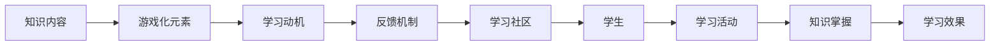
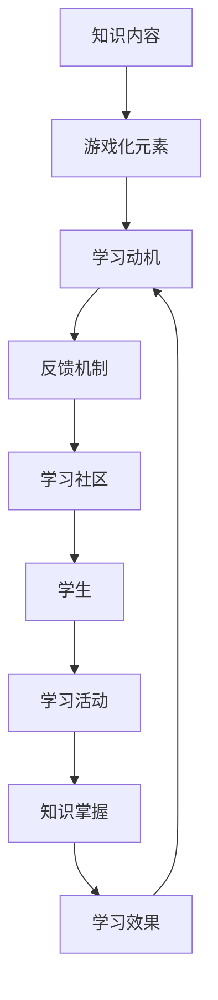

                 

# 知识的gamification：寓教于乐的学习革命

## 1. 背景介绍

在信息时代，知识获取变得越来越容易，但知识的有效传递和学习仍然是一个巨大的挑战。传统枯燥的课堂和书本教学方式已经无法满足现代人的学习需求。如何通过有趣、互动的方式激发学习兴趣，提升学习效果，成为教育技术领域的重要研究方向。本文将深入探讨知识gamification的概念及其在教育领域的应用，为企业培训、在线教育等提供实践参考。

## 2. 核心概念与联系

### 2.1 核心概念概述

知识gamification（知识游戏化）是指将知识学习过程设计成类似游戏的方式，通过游戏化的元素、规则和机制，激发学生的学习兴趣，提高学习效果。这种教育模式打破了传统教学的枯燥、被动，让学习变成一种主动参与、挑战自我的过程。

**核心概念：**

- **知识内容（Knowledge Content）：** 学习的核心内容，可以是课程、书籍、讲座等。
- **游戏化元素（Gamification Elements）：** 将知识内容嵌入游戏中的元素，如积分、排行榜、成就等。
- **学习动机（Motivation）：** 通过奖励、竞争、社交等手段，激发学生的内在动力。
- **反馈机制（Feedback Mechanism）：** 及时给予学生反馈，帮助他们了解自己的学习进展和不足。
- **学习社区（Learning Community）：** 构建一个充满互动和合作的学习环境，鼓励学生相互帮助。

### 2.2 核心概念原理和架构的 Mermaid 流程图



**解释：**
1. **A（知识内容）**： 教育内容的本体部分。
2. **B（游戏化元素）**： 将教育内容设计成游戏化的元素，使学习过程更加有趣。
3. **C（学习动机）**： 通过奖励和竞争机制，激发学生学习动机。
4. **D（反馈机制）**： 及时反馈学生学习情况，帮助其改进。
5. **E（学习社区）**： 构建学习者社区，通过互动和合作提升学习效果。
6. **F（学生）**： 学习活动的参与者，通过游戏化元素和反馈机制，提高学习动机。
7. **G（学习活动）**： 学生在各种游戏化活动中的学习行为。
8. **H（知识掌握）**： 学生通过游戏化活动掌握的知识点。
9. **I（学习效果）**： 学生通过游戏化学习所取得的学习成果。

### 2.3 核心概念间的联系

知识gamification是一个循环反馈过程，通过游戏化的学习方式，激发学生的学习兴趣，提升学习效果，进而影响其对知识内容的掌握和应用。以下是核心概念间的关系图：



**解释：**
1. **知识内容**是学习的基础。
2. **游戏化元素**增强学习的趣味性。
3. **学习动机**通过游戏元素和反馈机制激发。
4. **反馈机制**及时反馈学生学习进展。
5. **学习社区**通过互动和合作提升学习效果。
6. **学习活动**是学生参与的游戏化过程。
7. **知识掌握**是学生对知识内容的理解和应用。
8. **学习效果**是学习活动的最终成果。
9. **学习效果**反过来又影响学习动机，形成一个循环。

## 3. 核心算法原理 & 具体操作步骤

### 3.1 算法原理概述

知识gamification的算法原理主要基于行为心理学和游戏设计理论。通过设计合适的游戏化元素和机制，激发学生的内在动机，使其主动参与学习活动，从而提升学习效果。

**核心算法：**

- **动态积分系统（Dynamic Points System）：** 学生在学习过程中获得积分，积分可以兑换奖励，增加学习动力。
- **排行榜和成就系统（Leaderboard and Achievement System）：** 学生在社区内展示自己的学习成果，通过竞争激发内在动力。
- **随机任务和挑战（Random Tasks and Challenges）：** 通过随机生成的任务和挑战，增加学习的趣味性和不确定性。
- **即时反馈（Instant Feedback）：** 通过即时反馈，帮助学生及时了解自己的学习进展。

### 3.2 算法步骤详解

1. **需求分析**： 明确学习目标和受众特征，设计适合的gamification元素和规则。
2. **游戏化设计**： 将知识内容嵌入游戏化元素中，设计学习活动和反馈机制。
3. **系统开发**： 开发支撑游戏化学习的系统，包括积分系统、排行榜、即时反馈等功能。
4. **试点实施**： 在小范围内进行试点，收集反馈，调整优化gamification元素。
5. **全面推广**： 在大范围内推广，持续优化游戏化元素，提升学习效果。

### 3.3 算法优缺点

**优点：**

- **激发学习动机**： 通过游戏化元素和机制，激发学生的内在动机，提高学习兴趣。
- **提升学习效果**： 通过互动和反馈，帮助学生及时了解自己的学习进展，提升学习效果。
- **多样化的学习方式**： 游戏化元素丰富多样，适应不同学习者的需求。

**缺点：**

- **实施成本高**： 开发和维护gamification系统需要大量资源和技术支持。
- **过度依赖游戏机制**： 过度依赖积分、排行榜等游戏元素，可能影响学生对知识内容的深入理解。
- **需要持续优化**： 游戏化元素和机制需要不断调整优化，才能达到最佳效果。

### 3.4 算法应用领域

知识gamification不仅适用于传统教育领域，还可以应用于企业培训、在线教育等多个领域。

**教育领域**： 通过游戏化学习提升学生的学习兴趣，提高学习效果。

**企业培训**： 通过游戏化培训，提升员工的学习动机，提高培训效果。

**在线教育**： 通过游戏化元素，吸引学生参与在线课程，提高学习效果。

## 4. 数学模型和公式 & 详细讲解 & 举例说明

### 4.1 数学模型构建

知识gamification的数学模型主要关注如何通过游戏化元素和机制，提升学生的学习效果。

**数学模型**：

- **积分系统模型**：
  $$
  P_i = \alpha + \sum_{t=1}^{T} \beta_t \cdot F_t
  $$
  其中，$P_i$ 是学生 $i$ 在时间 $t$ 的积分，$\alpha$ 是初始积分，$F_t$ 是学习活动 $t$ 的积分，$\beta_t$ 是活动 $t$ 的积分系数。

- **排行榜模型**：
  $$
  R_j = \sum_{i=1}^{N} P_i
  $$
  其中，$R_j$ 是学生 $j$ 在排行榜上的得分，$N$ 是参与学习的总人数。

### 4.2 公式推导过程

**积分系统模型推导**：

$$
\frac{dP_i}{dt} = \beta_t \cdot F_t
$$

对上式积分，得到：

$$
P_i = \alpha + \int_{0}^{T} \beta_t \cdot F_t \, dt
$$

**排行榜模型推导**：

$$
R_j = \sum_{i=1}^{N} P_i
$$

### 4.3 案例分析与讲解

**案例：在线教育平台**

某在线教育平台采用知识gamification方式提升学生学习效果。学生在平台上完成学习任务后，可以获得积分，积分可以兑换课程优惠券、课程证书等奖励。同时，平台还提供排行榜，展示学生在课程中的排名。通过这些游戏化元素，学生的学习兴趣显著提升，学习效果也得到了显著改善。

## 5. 项目实践：代码实例和详细解释说明

### 5.1 开发环境搭建

1. **服务器配置**： 搭建高性能服务器，配置GPU、内存、存储等资源。
2. **数据库选择**： 选择合适的数据库，用于存储学生信息、学习行为数据等。
3. **前端技术选择**： 选择适合前端开发的框架和技术，开发互动界面。
4. **后端技术选择**： 选择适合后端开发的语言和框架，开发游戏化功能。

### 5.2 源代码详细实现

**前端代码实现**：

```javascript
// 积分系统
function积分系统() {
  this.player = {
    积分: 0,
    学习任务: []
  };
  
  this.addTask = function(task) {
    this.player.学习任务.push(task);
    this.player.积分 += task.积分系数;
  }
  
  this.update积分 = function() {
    this.player.积分 += 0.01;
  }
}

// 排行榜系统
function排行榜系统() {
  this.players = [];
  
  this.addPlayer = function(player) {
    this.players.push(player);
  }
  
  this.update排行榜 = function() {
    this.players.sort((a, b) => b.积分 - a.积分);
  }
}

// 学习系统
function学习系统() {
  this.integralSystem = new积分系统();
  this.rankSystem = new排行榜系统();
  
  this.start学习 = function() {
    this.integralSystem.addTask(task1);
    this.integralSystem.addTask(task2);
    this.rankSystem.addPlayer(this.player);
  }
  
  this.update学习状态 = function() {
    this.integralSystem.update积分();
    this.rankSystem.update排行榜();
  }
}
```

**后端代码实现**：

```python
# 积分系统
class积分系统:
  def __init__(self):
    self.player = {
      '积分': 0,
      '学习任务': []
    }
  
  def addTask(self, task):
    self.player['学习任务'].append(task)
    self.player['积分'] += task['积分系数']
  
  def update积分(self):
    self.player['积分'] += 0.01

# 排行榜系统
class排行榜系统:
  def __init__(self):
    self.players = []
  
  def addPlayer(self, player):
    self.players.append(player)
  
  def update排行榜(self):
    self.players.sort(key=lambda x: x['积分'], reverse=True)

# 学习系统
class学习系统:
  def __init__(self):
    self.integralSystem =积分系统()
    self.rankSystem =排行榜系统()
  
  def start学习(self):
    self.integralSystem.addTask(task1)
    self.integralSystem.addTask(task2)
    self.rankSystem.addPlayer(self.player)
  
  def update学习状态(self):
    self.integralSystem.update积分()
    self.rankSystem.update排行榜()
```

### 5.3 代码解读与分析

**前端代码解读**：

- **积分系统**： 管理学生的积分，提供积分计算和更新功能。
- **排行榜系统**： 管理学生的排行榜得分，提供排序功能。
- **学习系统**： 整合积分系统和排行榜系统，提供学习过程的管理。

**后端代码解读**：

- **积分系统**： 提供积分计算和更新功能。
- **排行榜系统**： 提供排行榜排序功能。
- **学习系统**： 整合积分系统和排行榜系统，提供学习过程的管理。

**运行结果展示**：

通过前端和后端代码的协同工作，学生可以在平台上完成学习任务，获得积分和排行榜得分，最终提升学习效果。

## 6. 实际应用场景

### 6.1 企业培训

某大型企业采用知识gamification方式提升员工培训效果。员工通过平台完成培训任务，获得积分和奖励，同时在排行榜上展示自己的成绩。通过这些游戏化元素，员工的学习动机显著提升，培训效果也得到了显著改善。

### 6.2 在线教育

某在线教育平台采用知识gamification方式提升学生学习效果。学生在平台上完成学习任务，获得积分和排行榜得分，同时在社区中互动交流，共同提升学习效果。通过这些游戏化元素，学生的学习兴趣显著提升，学习效果也得到了显著改善。

### 6.3 教育游戏

某教育游戏平台采用知识gamification方式提升学生的学习效果。学生在平台上完成各种游戏化任务，获得积分和排行榜得分，同时在社区中互动交流，共同提升学习效果。通过这些游戏化元素，学生的学习兴趣显著提升，学习效果也得到了显著改善。

### 6.4 未来应用展望

随着知识gamification技术的不断成熟，其在教育领域和企业培训中的应用前景广阔。未来，通过游戏化元素和机制，将彻底改变传统的教育方式，提升学习效果，实现寓教于乐的目标。

## 7. 工具和资源推荐

### 7.1 学习资源推荐

1. **《游戏设计心理学》（Game Design Psychology）**： 了解游戏设计的基本原则和心理学原理。
2. **《教育技术：将游戏融入教育》（Educational Technology: Integrating Games）**： 介绍将游戏融入教育的具体方法和案例。
3. **《学习设计：将学习经验设计成游戏》（Learning Design: Gamestorming）**： 介绍如何将学习经验设计成游戏化的方式。

### 7.2 开发工具推荐

1. **Unity3D**： 游戏开发引擎，支持开发各种类型的教育游戏。
2. **Unreal Engine**： 游戏开发引擎，支持开发各种类型的教育游戏。
3. **Tencent Game Platform**： 腾讯提供的游戏开发平台，支持开发各种类型的教育游戏。

### 7.3 相关论文推荐

1. **《知识游戏化在教育中的应用》（Knowledge Gamification in Education）**： 探讨知识游戏化在教育中的应用和效果。
2. **《基于知识游戏化的学习动机研究》（Research on Motivation Based on Knowledge Gamification）**： 研究知识游戏化对学习动机的影响。
3. **《知识游戏化与学习效果的关系研究》（Study on the Relationship between Knowledge Gamification and Learning Effectiveness）**： 研究知识游戏化与学习效果之间的关系。

## 8. 总结：未来发展趋势与挑战

### 8.1 研究成果总结

知识gamification作为教育技术的一个重要分支，已经展现出巨大的应用潜力。通过游戏化元素和机制，激发了学生的学习兴趣，提升了学习效果。未来，随着技术的不断发展，知识gamification将在更多的教育领域得到应用，成为教育技术的重要组成部分。

### 8.2 未来发展趋势

1. **个性化学习**： 通过游戏化元素和机制，提供个性化的学习体验，适应不同学生的学习需求。
2. **虚拟现实（VR）和增强现实（AR）**： 将VR和AR技术应用于知识gamification，提供沉浸式的学习体验。
3. **人工智能（AI）辅助**： 通过AI技术，提供智能化的游戏化辅助，提升学习效果。
4. **大数据分析**： 通过大数据分析，提供个性化的游戏化方案，提升学习效果。
5. **社区化学习**： 通过社区化学习，提供互动和合作的学习环境，提升学习效果。

### 8.3 面临的挑战

尽管知识gamification已经展现出巨大的应用潜力，但在实际应用中仍然面临诸多挑战：

1. **实施难度大**： 游戏化元素的开发和维护需要大量资源和技术支持。
2. **学习效果不均衡**： 过度依赖游戏元素，可能影响学生对知识内容的深入理解。
3. **学习动机依赖**： 过度依赖游戏化元素，可能导致学生的学习动机依赖。
4. **学习效果评估困难**： 游戏化元素和机制的效果评估难度较大，难以量化。

### 8.4 研究展望

未来，知识gamification的研究方向将集中在以下几个方面：

1. **游戏化元素的丰富化**： 设计更多的游戏化元素，提供多样化的学习体验。
2. **学习效果的评估**： 开发评估工具，量化游戏化元素的效果。
3. **个性化学习的设计**： 设计个性化的游戏化方案，适应不同学生的学习需求。
4. **社区化学习的构建**： 构建互动和合作的学习社区，提升学习效果。
5. **虚拟现实和增强现实的应用**： 将VR和AR技术应用于知识gamification，提供沉浸式的学习体验。

## 9. 附录：常见问题与解答

### 问题1：知识gamification是否适用于所有学科？

**回答**： 知识gamification适用于所有学科，但需要根据学科特点设计合适的游戏化元素和机制。例如，数学学科可以通过数学题目的游戏化设计，提高学生的学习兴趣和效果。

### 问题2：知识gamification对学生的学习效果是否有长期影响？

**回答**： 有研究表明，知识gamification对学生的学习效果有显著的长期影响。通过游戏化元素和机制，学生的学习动机和效果都有了显著提升。

### 问题3：知识gamification如何设计游戏化元素？

**回答**： 设计游戏化元素需要根据学科特点和学生特征，选择合适的游戏化元素和机制。例如，设计积分系统、排行榜、即时反馈等元素，激发学生的学习兴趣和动机。

### 问题4：知识gamification的实施成本如何？

**回答**： 实施知识gamification需要投入大量资源和技术支持，包括游戏化元素的开发、系统维护和数据收集等。但长期来看，其带来的学习效果提升和经济效益是非常显著的。

### 问题5：知识gamification是否适用于所有年龄段的学生？

**回答**： 知识gamification适用于所有年龄段的学生，但需要根据学生的年龄和认知特点，设计合适的游戏化元素和机制。例如，小学阶段的学生可以通过简单的积分和排行榜设计，提高学习兴趣。

---

作者：禅与计算机程序设计艺术 / Zen and the Art of Computer Programming

