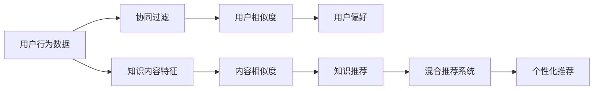

                 

# 知识的个性化推荐：AI辅助学习的未来

## 1. 背景介绍

在当前的教育背景下，随着在线学习平台的普及，知识的获取和传播变得前所未有的便捷，但同时也带来了知识推荐的挑战。如何有效地帮助用户在海量信息中找到对自己最有价值的内容，是知识推荐系统需要解决的关键问题。在过去的一段时间里，AI在个性化推荐算法方面取得了一些成果，但仍有诸多问题待解决。本文旨在探讨基于AI的个性化知识推荐系统的发展现状与未来方向，期望通过深入分析，为AI辅助学习的未来提供一些见解。

## 2. 核心概念与联系

### 2.1 核心概念概述

在介绍个性化知识推荐系统的原理之前，我们先回顾一下几个核心概念：

- **知识推荐系统**：旨在根据用户的行为和偏好，向用户推荐可能对其有用的知识。这些知识可以是文章、视频、图书、课程等。
- **协同过滤**：一种基于用户兴趣相似性的推荐算法，通过寻找兴趣相似的用户或项目，进行推荐。
- **内容推荐**：基于内容的推荐算法，通过分析知识的特征与用户特征的相似性，进行推荐。
- **混合推荐系统**：将协同过滤和内容推荐结合，综合用户历史行为和知识内容特征，进行推荐。
- **深度学习**：一种能够自动学习数据特征的机器学习方法，常用于构建个性化的推荐模型。

以上概念通过**Mermaid 流程图**连接起来，显示其工作原理和步骤：



## 3. 核心算法原理 & 具体操作步骤

### 3.1 算法原理概述

基于深度学习的个性化知识推荐系统主要包含两个部分：**特征提取**和**模型训练**。特征提取旨在从用户行为和知识内容中提取有用的特征，而模型训练则是利用这些特征训练出推荐模型，进而生成推荐结果。

**3.1.1 特征提取**

特征提取的目的是将用户行为和知识内容转换为机器学习算法可以处理的形式。常用的特征包括用户历史行为（浏览、点击、评分等）、知识内容的特征（文本特征、标签等）。例如，对于一篇文章，我们可以提取文章标题、作者、发布日期、标签、用户评分等特征。

**3.1.2 模型训练**

模型训练通常使用深度神经网络。最常见的模型是**深度神经网络**（DNN），它的结构类似于人类的神经系统，由多个层次组成。每个层次负责提取不同级别的特征，最终将用户行为和知识内容特征映射到推荐结果。

**3.1.3 模型评估**

模型训练完成后，需要对模型进行评估，以确保其能够产生高质量的推荐结果。常用的评估指标包括准确率、召回率、F1分数、AUC等。

### 3.2 算法步骤详解

以下是基于深度学习的个性化知识推荐系统的主要步骤：

**Step 1: 数据收集与预处理**

数据收集：收集用户行为数据和知识内容数据，通常采用爬虫的方式获取。

数据预处理：清洗和归一化数据，去除噪声和异常值。

**Step 2: 特征提取**

特征工程：根据领域知识选择合适的特征，并转化为机器学习算法可以处理的数值型特征。

**Step 3: 模型训练**

选择合适的深度神经网络结构，进行模型训练。训练时需要选择合适的网络层数、节点数、激活函数等超参数。

**Step 4: 模型评估与优化**

使用训练数据集和测试数据集对模型进行评估，调整超参数以优化模型性能。

**Step 5: 推荐生成**

使用训练好的模型对新用户和新知识进行推荐。

### 3.3 算法优缺点

基于深度学习的个性化知识推荐系统具有以下优点：

- **灵活性高**：深度学习模型具有较高的灵活性，可以适应不同领域的数据。
- **精度高**：深度学习模型能够自动提取数据中的高级特征，提升了推荐的精度。

但同时也存在一些缺点：

- **模型复杂**：深度学习模型结构复杂，训练和推理效率低。
- **数据需求高**：需要大量的数据进行训练，对数据的收集和处理要求较高。
- **可解释性差**：深度学习模型被视为"黑盒"，难以解释其推荐结果的来源。

### 3.4 算法应用领域

基于深度学习的个性化知识推荐系统在多个领域得到了应用，包括：

- 在线教育：根据用户学习行为和偏好推荐课程和教材。
- 电子商务：根据用户浏览和购买行为推荐商品。
- 媒体娱乐：根据用户观影记录和评分推荐影片和音乐。

## 4. 数学模型和公式 & 详细讲解

### 4.1 数学模型构建

以知识推荐为例，构建基于深度学习的推荐模型。

**4.1.1 输入**

- 用户行为序列：$x=(x_1,x_2,...,x_n)$，其中$x_i$表示用户第$i$个行为。
- 知识内容特征：$y=(y_1,y_2,...,y_m)$，其中$y_j$表示第$j$个知识内容的特征。

**4.1.2 输出**

- 推荐结果：$z=(z_1,z_2,...,z_k)$，其中$z_i$表示知识内容$y_i$的推荐结果。

### 4.2 公式推导过程

以全连接神经网络为例，推导推荐模型的基本结构：

$$
h_i = f(W^{[l]} h_{i-1} + b^{[l]})
$$

$$
z_i = f(W^{[k]} h_k + b^{[k]})
$$

其中，$h_i$表示第$i$层隐藏层的输出，$W^{[l]}$和$b^{[l]}$表示第$l$层的网络权重和偏置，$f$表示激活函数。

### 4.3 案例分析与讲解

以在线教育推荐为例，具体分析知识推荐系统的构建：

- 数据收集：通过爬虫获取在线学习平台的课程信息和学习行为数据。
- 数据预处理：清洗和归一化数据，去除噪声和异常值。
- 特征提取：提取课程的标题、作者、发布日期、标签、用户评分等特征。
- 模型训练：使用深度神经网络模型，训练推荐模型。
- 模型评估：使用准确率、召回率、F1分数、AUC等指标评估模型性能。
- 推荐生成：利用训练好的模型对新用户进行推荐。

## 5. 项目实践：代码实例和详细解释说明

### 5.1 开发环境搭建

**5.1.1 环境配置**

首先需要安装Python和相应的库，包括TensorFlow、Keras、Scikit-learn等。可以使用Anaconda或Miniconda来创建虚拟环境。

**5.1.2 数据准备**

收集用户行为数据和知识内容数据，清洗和归一化数据。

### 5.2 源代码详细实现

**5.2.1 数据读取**

```python
import pandas as pd

# 读取用户行为数据
user_data = pd.read_csv('user_behavior.csv')

# 读取知识内容数据
knowledge_data = pd.read_csv('knowledge_data.csv')
```

**5.2.2 数据预处理**

```python
from sklearn.preprocessing import StandardScaler
from sklearn.decomposition import PCA

# 用户行为数据预处理
user_data = user_data.dropna()
scaler = StandardScaler()
user_data_scaled = scaler.fit_transform(user_data)

# 知识内容数据预处理
knowledge_data = knowledge_data.dropna()
pca = PCA(n_components=10)
knowledge_data_pca = pca.fit_transform(knowledge_data)
```

**5.2.3 模型训练**

```python
from tensorflow.keras.models import Sequential
from tensorflow.keras.layers import Dense, Activation

# 定义模型结构
model = Sequential()
model.add(Dense(64, input_dim=10))
model.add(Activation('relu'))
model.add(Dense(64))
model.add(Activation('relu'))
model.add(Dense(10))
model.add(Activation('softmax'))

# 编译模型
model.compile(loss='categorical_crossentropy', optimizer='adam', metrics=['accuracy'])

# 训练模型
model.fit(user_data_scaled, knowledge_data_pca, epochs=100, batch_size=32)
```

**5.2.4 模型评估**

```python
from sklearn.metrics import accuracy_score, precision_score, recall_score, f1_score

# 评估模型
user_test_data = pd.read_csv('user_test_data.csv')
knowledge_test_data = pd.read_csv('knowledge_test_data.csv')
user_test_data_scaled = scaler.transform(user_test_data)
knowledge_test_data_pca = pca.transform(knowledge_test_data)

predictions = model.predict(user_test_data_scaled)
predictions = np.argmax(predictions, axis=1)
true_labels = knowledge_test_data['label'].values

accuracy = accuracy_score(true_labels, predictions)
precision = precision_score(true_labels, predictions, average='macro')
recall = recall_score(true_labels, predictions, average='macro')
f1 = f1_score(true_labels, predictions, average='macro')

print(f'Accuracy: {accuracy:.2f}, Precision: {precision:.2f}, Recall: {recall:.2f}, F1 Score: {f1:.2f}')
```

**5.2.5 推荐生成**

```python
new_user_data = pd.read_csv('new_user_data.csv')
new_user_data_scaled = scaler.transform(new_user_data)

new_user_predictions = model.predict(new_user_data_scaled)
new_user_predictions = np.argmax(new_user_predictions, axis=1)

recommendations = knowledge_data[知识内容特征].columns[new_user_predictions]
print(recommendations)
```

### 5.3 代码解读与分析

在上述代码中，我们首先使用Pandas读取用户行为数据和知识内容数据，并进行了数据清洗和归一化。然后，我们使用Keras定义了一个包含两个隐藏层的深度神经网络模型，并使用交叉熵损失函数和Adam优化器进行训练。最后，我们使用测试数据集评估了模型的性能，并生成了新用户的推荐结果。

## 6. 实际应用场景

### 6.1 在线教育推荐

在线教育平台可以利用知识推荐系统，根据用户的学习行为和偏好，推荐适合的学习内容和资源。通过个性化推荐，可以提高用户的满意度和学习效率。

### 6.2 电子商务推荐

电子商务平台可以利用知识推荐系统，根据用户的浏览和购买行为，推荐用户可能感兴趣的商品。通过个性化推荐，可以提高用户转化率和平台销售额。

### 6.3 媒体娱乐推荐

媒体平台可以利用知识推荐系统，根据用户的观影记录和评分，推荐用户可能喜欢的影片和音乐。通过个性化推荐，可以提高用户的观看率和平台用户粘性。

### 6.4 未来应用展望

未来的个性化知识推荐系统将更加智能化和个性化。利用深度学习和知识图谱等技术，可以实现更精准、更高效的推荐。同时，推荐系统还将融合更多的领域知识，提高推荐的多样性和准确性。

## 7. 工具和资源推荐

### 7.1 学习资源推荐

- **《深度学习》**：Ian Goodfellow等著，全面介绍了深度学习的基本原理和应用。
- **《推荐系统实战》**：刘江等著，介绍了推荐系统的设计、实现和优化。
- **Kaggle**：数据科学竞赛平台，可以获取大量真实数据和比赛项目。
- **Coursera**：在线课程平台，提供深度学习和推荐系统的相关课程。

### 7.2 开发工具推荐

- **TensorFlow**：Google开源的深度学习框架，支持大规模分布式计算。
- **Keras**：高层次的深度学习API，易于上手和调试。
- **Scikit-learn**：Python机器学习库，提供各种机器学习算法和工具。
- **Pandas**：数据处理库，支持多种数据格式和操作。

### 7.3 相关论文推荐

- **《深度学习推荐系统》**：由Deep Learning推荐系统研究的先驱之一Pavel Hristov等著，详细介绍了深度学习在推荐系统中的应用。
- **《基于知识图谱的推荐系统》**：利用知识图谱技术，提升推荐系统的精确度和多样性。
- **《推荐系统中的用户行为分析》**：通过分析用户行为数据，提高推荐系统的个性化水平。

## 8. 总结：未来发展趋势与挑战

### 8.1 研究成果总结

基于深度学习的个性化知识推荐系统已经在多个领域取得了显著成果。通过自动化特征提取和模型训练，推荐系统能够更好地满足用户的个性化需求，提高用户的满意度和使用体验。

### 8.2 未来发展趋势

未来的知识推荐系统将更加智能化和个性化，利用深度学习、知识图谱等技术，实现更精准、更高效的推荐。同时，推荐系统将融合更多的领域知识，提高推荐的多样性和准确性。

### 8.3 面临的挑战

虽然个性化知识推荐系统取得了一定的进展，但仍然存在一些挑战：

- **数据隐私和安全**：用户数据隐私保护是推荐系统面临的一个重要问题。如何保护用户隐私，防止数据泄露，是未来需要解决的关键问题。
- **可解释性和透明度**：推荐系统的决策过程往往缺乏可解释性，难以解释其推荐结果的来源，用户难以信任系统。
- **推荐多样性**：推荐系统容易陷入"过滤泡沫"，即用户只看到自己感兴趣的推荐内容，导致推荐结果单一。如何提高推荐多样性，是推荐系统需要改进的方向。
- **实时性**：推荐系统需要实时响应用户请求，处理海量数据，这对算法的实时性提出了很高的要求。

### 8.4 研究展望

未来的研究需要在以下几个方面进行改进：

- **隐私保护**：利用差分隐私、联邦学习等技术，保护用户数据隐私。
- **可解释性**：引入可解释性技术，增强推荐系统的透明度。
- **推荐多样性**：引入多样化推荐策略，打破过滤泡沫。
- **实时性**：优化算法和模型结构，提升推荐系统的实时性。

## 9. 附录：常见问题与解答

**Q1：如何优化推荐系统的性能？**

A: 优化推荐系统的性能主要从以下几个方面入手：
- **数据收集**：收集更多高质量的数据，覆盖更多领域。
- **特征工程**：选择合适的特征，并进行特征提取和选择。
- **模型选择**：选择合适的深度神经网络结构和优化算法，并进行调参。
- **模型评估**：使用多种评估指标，对模型进行全面评估和优化。

**Q2：推荐系统的推荐结果是否可信？**

A: 推荐系统的推荐结果具有一定的可信度，但存在一定的误差。推荐系统的推荐结果通常基于用户的已有行为数据，能够较好地反映用户的兴趣和需求。但用户的兴趣和需求可能会随时间变化，因此推荐系统的推荐结果也需要定期更新和调整。

**Q3：推荐系统能否推荐跨领域的内容？**

A: 推荐系统可以跨领域推荐内容，但需要引入领域相关特征和知识。例如，在在线教育推荐中，可以通过引入课程的学科、难度等信息，进行跨领域推荐。

**Q4：推荐系统是否需要人工干预？**

A: 推荐系统通常需要人工干预，尤其是在初期的用户行为数据较少时。通过人工干预，可以为推荐系统提供更多的用户行为数据，提高推荐系统的准确性和多样性。

**Q5：推荐系统的应用场景有哪些？**

A: 推荐系统的应用场景非常广泛，包括在线教育、电子商务、媒体娱乐、社交网络等。

---

作者：禅与计算机程序设计艺术 / Zen and the Art of Computer Programming

