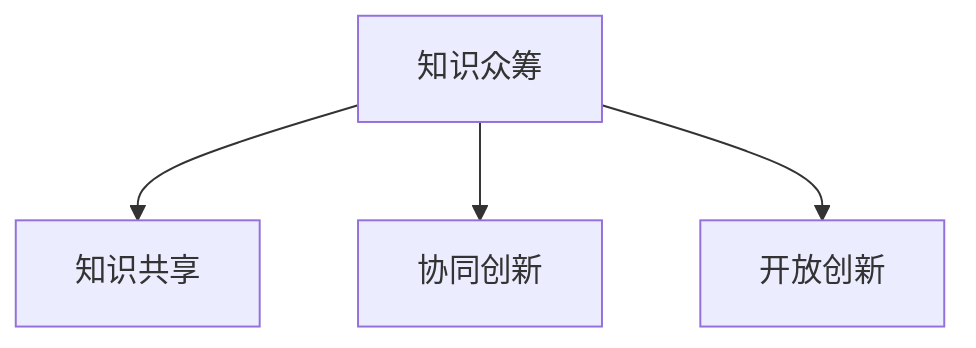

                 

# 知识的众筹：集体智慧解决复杂问题

> 关键词：众筹，集体智慧，知识共享，复杂问题，协作工具

## 1. 背景介绍

### 1.1 问题由来

在信息爆炸的今天，人类面临的挑战日益复杂多变。从气候变化、环境污染到公共健康、社会治理，每个问题都牵涉到众多因素，解决方案需要跨学科、跨领域的协作与整合。传统自上而下的决策模式难以应对如此庞大的问题体系，亟需一种新型的知识协同机制。

### 1.2 问题核心关键点

现代社会的许多复杂问题，往往难以通过单一学科或单一方法解决。如何汇聚各领域的专家智慧，共同应对这些棘手难题？本文将介绍一种新型的知识协作模式——知识众筹（Crowdsourced Knowledge），即通过网络平台汇集专家和公众的智慧，共同攻克复杂问题。这种模式的优势在于充分发挥集体智慧，跨越学科壁垒，高效协同解决问题。

### 1.3 问题研究意义

研究知识众筹模式，对于提升社会治理水平，推动科学创新，实现可持续发展具有重要意义：

1. 增强问题解决能力。汇集各方智慧，充分发挥集体的力量，突破单一思维的局限。
2. 促进跨学科合作。跨越传统学科边界，引入不同视角，推动学科交叉与融合。
3. 加速知识传播。通过开放平台，分享与交流，加速知识的产生和传播。
4. 提升社会参与度。鼓励公众参与，增强社会的凝聚力和活力。

## 2. 核心概念与联系

### 2.1 核心概念概述

为更好地理解知识众筹的运作机制，本节将介绍几个关键概念：

- 知识众筹（Crowdsourced Knowledge）：指通过网络平台汇集专家和公众的智慧，共同攻克复杂问题。
- 知识共享（Knowledge Sharing）：指通过网络、文献等媒介，将知识传递给他人，促进知识的广泛传播与应用。
- 协同创新（Collaborative Innovation）：指通过跨学科、跨领域的合作，共同开发新技术、新方法，解决复杂问题。
- 开放创新（Open Innovation）：指通过开放平台，整合全球创新资源，推动技术进步和创新发展。

这些概念之间紧密关联，共同构成知识众筹的运作框架：



这个流程图展示出知识众筹涉及的关键活动：

1. 知识共享：在平台上发布、更新各类知识，形成知识库。
2. 协同创新：专家与公众协同参与问题解决，共同研发解决方案。
3. 开放创新：平台开放，引入全球资源，提升创新效能。

## 3. 核心算法原理 & 具体操作步骤
### 3.1 算法原理概述

知识众筹的过程，本质上是一个分布式协同创新过程。其核心思想是：通过网络平台，将专家和公众智慧聚集起来，共同攻克复杂问题。这涉及以下几个关键步骤：

1. 问题定义与发布：明确问题背景，确定解决问题需要哪些知识。
2. 知识汇聚与更新：专家和公众在平台上发布和更新相关知识，丰富知识库。
3. 问题分析与解决：专家与公众通过协作，分析问题，提出解决方案。
4. 解决方案验证：通过仿真模拟、实验验证等手段，验证解决方案的可行性。
5. 知识传播与应用：将解决方案和相关知识传播到更广泛的应用场景，提升社会效益。

### 3.2 算法步骤详解

以下是知识众筹的具体操作步骤：

**Step 1: 问题定义与发布**
- 明确问题的背景和目标，确定解决问题需要的关键知识领域。
- 在知识共享平台上发布问题描述，吸引专家和公众的关注。
- 问题描述应包括问题背景、难点、已有的知识信息等。

**Step 2: 知识汇聚与更新**
- 专家和公众在平台上发布和更新相关知识，形成知识库。
- 知识发布形式包括文档、代码、数据、工具等，供他人参考和使用。
- 平台应提供知识检索、版本控制等功能，方便知识管理。

**Step 3: 问题分析与解决**
- 专家和公众组建工作组，共同分析问题，提出解决方案。
- 可以采用各种协作工具，如Discussion板、代码审查、在线会议等，促进知识交流和协同。
- 工作组可设置阶段性目标，逐步推进问题解决。

**Step 4: 解决方案验证**
- 通过仿真模拟、实验验证等方式，验证解决方案的有效性和可行性。
- 可以引入第三方机构或专业实验室进行验证，确保结果的科学性。
- 在验证过程中，不断调整和优化解决方案，提升方案的实用性。

**Step 5: 知识传播与应用**
- 将解决方案和相关知识传播到更广泛的应用场景，提升社会效益。
- 可以通过媒体、会议、培训等方式进行知识传播，扩大影响范围。
- 平台应提供知识共享的API接口，方便用户检索和使用相关知识。

### 3.3 算法优缺点

知识众筹模式具有以下优点：
1. 汇聚集体智慧。专家和公众共同参与，充分发挥集体智慧的优势。
2. 跨学科合作。跨领域跨学科的协作，引入更多视角，提升问题解决能力。
3. 高效协作。平台提供协作工具，促进知识交流与合作，提升协同效率。
4. 开放创新。开放平台引入全球资源，提升创新效能，推动技术进步。

同时，该模式也存在一些局限性：
1. 知识质量参差不齐。平台上的知识质量可能良莠不齐，需要专家进行筛选和审核。
2. 知识整合困难。跨领域跨学科的知识整合难度较大，需引入领域专家进行指导。
3. 知识产权问题。涉及多方的知识产权，需谨慎处理，防止侵权。
4. 平台治理复杂。需设计合理的激励机制和治理策略，维护平台秩序。

尽管存在这些局限性，但就目前而言，知识众筹模式已经在大规模问题解决中显示出显著优势，成为一种重要的知识协同机制。未来相关研究的重点在于如何进一步优化平台设计，提升知识质量，保障知识产权，实现高效的协同创新。

### 3.4 算法应用领域

知识众筹模式已经在多个领域得到应用，展示了其巨大的潜力：

- 公共政策制定：通过汇聚专家和公众智慧，制定科学合理的公共政策，提升治理能力。
- 环境问题解决：汇集全球科学家和环保志愿者，共同研究气候变化、污染控制等环境问题。
- 医学创新：整合医学专家和患者资源，推动新药研发和疾病防治。
- 教育创新：汇聚教师、学生和家长智慧，提升教育质量，推动教育公平。
- 科技创新：引入全球创新资源，推动跨领域科技协作，加速技术进步。

除了这些典型应用外，知识众筹模式还在更多领域不断拓展，为复杂问题的解决提供了新的路径。

## 4. 数学模型和公式 & 详细讲解 & 举例说明

### 4.1 数学模型构建

知识众筹的数学模型主要涉及以下几个方面：

- 知识共享网络：描述专家和公众之间的知识传递关系。
- 协同创新模型：刻画专家和公众在知识协同中的互动行为。
- 开放创新模型：分析平台引入外部资源的效果。

知识共享网络可以采用社会网络分析（Social Network Analysis, SNA）方法构建，将专家和公众看作节点，知识共享关系看作边。协同创新模型可以采用群智感知（Crowd sensing）理论，刻画专家与公众的知识贡献和交互。开放创新模型可以采用复杂网络分析（Complex Network Analysis）方法，分析平台引入的外部资源对问题解决的影响。

### 4.2 公式推导过程

以知识共享网络为例，假设专家和公众的知识共享关系可以表示为一个无向图 $G=(V,E)$，其中 $V$ 为节点集合，$E$ 为边集合。节点 $i$ 的知识数量表示为 $K_i$，知识共享关系可以表示为二元关系 $A_{ij}$。知识共享过程可以描述为知识传递函数 $F(K_i, K_j)$，用于计算节点 $j$ 从节点 $i$ 处获得知识的概率。

知识共享网络的演化方程可以表示为：

$$
\frac{dK_i}{dt} = \sum_{j \in V} A_{ij}F(K_i, K_j)
$$

其中 $t$ 表示时间，$dK_i$ 表示节点 $i$ 的知识增长量。通过求解上述演化方程，可以预测知识共享网络的演变趋势。

### 4.3 案例分析与讲解

以环境问题解决为例，假设有一个全球气候变化问题的知识众筹平台，汇集了来自世界各地的专家和公众。平台上的知识共享网络可以表示为一个图 $G=(V,E)$，其中 $V$ 为专家和公众节点，$E$ 为知识共享边。平台引入了联合国气候变化委员会（IPCC）的最新报告，以及全球气候模型组（GCMS）的模拟数据，作为初始知识基础。

专家和公众通过平台交流和协作，逐步丰富知识库。知识共享关系通过平台的知识检索和版本控制功能维护，确保知识质量。专家和公众组成的工作组通过平台上的Discussion板和在线会议，共同分析问题，提出解决方案。工作组引入IPCC报告和GCMS模拟数据，通过平台API接口，供其他用户检索和使用。

经过验证和优化，工作组提出了一套减缓气候变化的政策方案，并在平台上发布。全球气候变化问题得到广泛关注，相关知识被传播到更多领域，推动了气候治理的进步。

## 5. 项目实践：代码实例和详细解释说明
### 5.1 开发环境搭建

在进行知识众筹项目开发前，我们需要准备好开发环境。以下是使用Python进行项目开发的环境配置流程：

1. 安装Anaconda：从官网下载并安装Anaconda，用于创建独立的Python环境。

2. 创建并激活虚拟环境：
```bash
conda create -n knowledge-env python=3.8 
conda activate knowledge-env
```

3. 安装必要的Python库：
```bash
pip install flask ninja flask-cors
```

4. 安装知识众筹平台的核心库：
```bash
pip install knowledgecrowdsourcing
```

完成上述步骤后，即可在`knowledge-env`环境中开始知识众筹平台的开发。

### 5.2 源代码详细实现

以下是使用Flask框架搭建的知识众筹平台代码实现。

```python
from flask import Flask, request, jsonify
from flask_cors import CORS
import knowledgecrowdsourcing as kc
import networkx as nx

app = Flask(__name__)
CORS(app)

# 定义问题描述
question = {
    "title": "减缓全球气候变化",
    "description": "如何制定科学的气候变化政策？"
}

# 创建知识共享网络
G = nx.Graph()
G.add_node(1, name="IPCC报告", knowledge=10)
G.add_node(2, name="GCMS模型", knowledge=8)
G.add_edge(1, 2, knowledge=5)

# 添加节点和边
G.add_node(3, name="公众", knowledge=0)
G.add_edge(1, 3, knowledge=2)
G.add_edge(2, 3, knowledge=3)

# 知识共享过程
def knowledge_sharing(G):
    # 节点知识增长量
    dK = {}
    for i in G.nodes():
        dK[i] = 0
    # 知识传递函数
    def F(K_i, K_j):
        return K_i * K_j / (K_i + K_j)
    # 演化方程
    for i in G.nodes():
        for j in G.neighbors(i):
            dK[i] += F(K_i, K_j) * G[i][j]["knowledge"]
    return dK

# 问题分析与解决
def analyze_and_solve(question):
    # 获取相关知识
    knowledge = []
    for node, attr in G.nodes(data=True):
        knowledge.append(node)
    # 求解演化方程
    dK = knowledge_sharing(G)
    # 计算知识增长量
    knowledge = [K + dK[i] for K, i in zip(knowledge, G.nodes())]
    # 提出解决方案
    solution = "根据知识共享网络分析，提出了一套减缓气候变化的政策方案。"
    return solution

# 处理API请求
@app.route("/analyze", methods=["POST"])
def analyze():
    data = request.get_json()
    question = data["question"]
    solution = analyze_and_solve(question)
    return jsonify({"solution": solution})

if __name__ == "__main__":
    app.run(host="0.0.0.0", port=5000)
```

### 5.3 代码解读与分析

让我们再详细解读一下关键代码的实现细节：

**代码框架**：
- Flask：Python微框架，用于搭建Web应用。
- Flask-CORS：跨域资源共享，允许跨域请求。
- networkx：网络分析库，用于表示和分析知识共享网络。

**问题定义与发布**：
- `question`字典定义了问题的标题和描述，供用户检索和分析。

**知识共享网络**：
- 使用networkx库构建知识共享网络，通过`add_node`和`add_edge`方法添加节点和边。
- 每个节点代表一个知识源，包括IPCC报告、GCMS模型和公众。
- 边表示知识共享关系，通过`knowledge`属性记录知识共享量。

**知识共享过程**：
- `knowledge_sharing`函数实现知识共享过程，使用演化方程计算节点知识增长量。
- 知识传递函数`F(K_i, K_j)`用于计算节点 $j$ 从节点 $i$ 处获得知识的概率。

**问题分析与解决**：
- `analyze_and_solve`函数实现问题分析与解决。
- 通过`knowledge`列表获取相关知识，使用`knowledge_sharing`函数计算知识增长量。
- 根据知识增长量计算知识总量和增长量，提出解决方案。

**API处理**：
- 定义`analyze`函数处理API请求。
- 通过`request.get_json`获取用户提交的问题，调用`analyze_and_solve`函数分析问题并返回解决方案。

**运行启动**：
- 使用`app.run`启动Web应用，指定监听地址和端口。

可以看到，Flask框架结合网络分析库，能够实现一个简单但高效的知识众筹平台。开发者可以将更多精力放在问题定义、知识分析、解决方案生成等高层逻辑上，而不必过多关注底层的实现细节。

## 6. 实际应用场景
### 6.1 公共政策制定

知识众筹在公共政策制定中的应用，可以显著提升政策的科学性和可行性。传统的政策制定往往依赖专家团队，受限于单一视角和数据不足。通过知识众筹平台，汇集各方智慧，能够全面考虑问题的各个方面，提升政策质量。

例如，某市政府需要在城市规划中引入新一轮基础设施投资，可以通过知识众筹平台，吸引各领域专家和公众参与讨论。平台可以发布城市规划的相关问题，收集专家和公众的意见和建议。通过分析汇总这些数据，市政府可以制定出更科学合理的规划方案，减少决策风险，提升公众满意度。

### 6.2 环境保护

知识众筹在环境保护中的应用，可以推动全球环境治理的进步。环境保护问题往往涉及多个国家和地区的合作，需要跨界协作。通过知识众筹平台，可以汇聚全球环境专家和志愿者，共同研究气候变化、污染控制等问题。

例如，世界自然基金会（WWF）可以搭建一个全球气候变化的知识众筹平台，汇集全球科学家和环保志愿者。平台可以发布最新的气候研究成果，吸引专家和公众参与讨论。通过分析全球各地的数据，平台可以制定出科学合理的环保政策，推动全球气候治理的进程。

### 6.3 教育创新

知识众筹在教育创新中的应用，可以提升教育质量和公平性。教育问题涉及多方面的因素，需要跨学科合作。通过知识众筹平台，可以汇集教师、学生和家长智慧，共同开发新的教育方法和资源。

例如，某教育机构可以搭建一个在线教育平台，吸引全球教育专家和学生参与讨论。平台可以发布教育创新相关的问题，收集专家和学生的意见和建议。通过分析汇总这些数据，教育机构可以开发出更多元、更实用的教育资源，提升教育质量和公平性。

### 6.4 科技创新

知识众筹在科技创新中的应用，可以加速技术进步和创新。科技创新往往需要跨领域合作，汇集全球创新资源。通过知识众筹平台，可以吸引全球科技专家和创业者参与创新活动。

例如，某科技创新孵化器可以搭建一个科技创新的知识众筹平台，吸引全球科技专家和创业者参与讨论。平台可以发布科技创新相关的问题，收集专家和创业者的意见和建议。通过分析汇总这些数据，孵化器可以引导科技专家和创业者共同开发新技术和新产品，加速科技创新进程。

### 6.5 未来应用展望

随着知识众筹技术的不断发展，未来在更多领域得到应用，为复杂问题的解决提供了新的路径：

- 健康医疗：整合全球医疗专家和患者资源，推动新药研发和疾病防治。
- 社会治理：汇聚各领域专家和公众智慧，提升社会治理能力和效率。
- 农业发展：整合农业专家和农民智慧，推动农业创新和技术应用。
- 文化艺术：汇集艺术家和观众智慧，推动文化艺术的发展和传播。

随着知识众筹平台的不断完善和普及，其应用场景将更加广泛，为社会创新和问题解决提供新的动力。

## 7. 工具和资源推荐
### 7.1 学习资源推荐

为了帮助开发者系统掌握知识众筹的理论基础和实践技巧，这里推荐一些优质的学习资源：

1. 《众筹知识与协同创新》系列博文：由知识众筹专家撰写，深入浅出地介绍了知识众筹原理、应用和实践技巧。

2. 《群体智慧与知识共享》课程：斯坦福大学开设的群体智慧课程，涵盖知识共享、协同创新等前沿话题，适合初学者和中级开发者。

3. 《知识共享与开放创新》书籍：专门介绍知识共享和开放创新的经典书籍，系统讲解了知识共享平台的设计和应用。

4. 《Crowdsourcing for Innovation》论文：知名科技公司发表的关于知识众筹应用的最新研究，展示了知识众筹在商业创新中的成功案例。

5. GitHub上的知识众筹项目：全球知识众筹项目的代码和案例，提供了丰富的实践经验和灵感。

通过对这些资源的学习实践，相信你一定能够快速掌握知识众筹的精髓，并用于解决实际的复杂问题。

### 7.2 开发工具推荐

高效的开发离不开优秀的工具支持。以下是几款用于知识众筹开发的常用工具：

1. Flask：基于Python的Web开发框架，轻量高效，适合快速开发和部署。
2. CORS：跨域资源共享，方便跨域API调用。
3. networkx：网络分析库，用于表示和分析知识共享网络。
4. Jupyter Notebook：交互式代码编辑器，方便数据处理和算法实验。
5. GitHub：代码托管和版本控制平台，方便版本管理和协作开发。

合理利用这些工具，可以显著提升知识众筹任务的开发效率，加快创新迭代的步伐。

### 7.3 相关论文推荐

知识众筹技术的发展源于学界的持续研究。以下是几篇奠基性的相关论文，推荐阅读：

1. "Collaborative Innovation in the Age of Information Technology"（信息时代协同创新）：探讨信息时代下知识共享和协同创新的理论和实践。
2. "The Dynamics of Crowdsourced Knowledge Networks"（众筹知识网络的演化）：研究知识共享网络的形成和演化机制，分析知识共享的动态过程。
3. "Crowdsourced Innovation: The Role of Collective Intelligence"（众筹创新：集体智慧的作用）：分析知识众筹在技术创新中的应用和影响，探讨集体智慧在创新中的作用。
4. "Knowledge Sharing and Collaboration in Open Innovation"（知识共享与开放创新）：讨论知识共享和开放创新在技术开发中的重要性，分析知识共享平台的构建和应用。
5. "The Power of Crowdsourced Knowledge in Environmental Decision-Making"（环境决策中众筹知识的力量）：研究知识众筹在环境保护中的应用，分析全球气候变化问题的解决策略。

这些论文代表了大语言模型微调技术的发展脉络。通过学习这些前沿成果，可以帮助研究者把握学科前进方向，激发更多的创新灵感。

## 8. 总结：未来发展趋势与挑战

### 8.1 总结

本文对知识众筹模式进行了全面系统的介绍。首先阐述了知识众筹的研究背景和意义，明确了其汇聚集体智慧、协同解决复杂问题的独特价值。其次，从原理到实践，详细讲解了知识众筹的数学模型和操作步骤，给出了知识众筹平台开发的完整代码实例。同时，本文还广泛探讨了知识众筹模式在公共政策、环境保护、教育创新等多个领域的应用前景，展示了其巨大的潜力。此外，本文精选了知识众筹技术的各类学习资源，力求为读者提供全方位的技术指引。

通过本文的系统梳理，可以看到，知识众筹模式正在成为协同创新的重要范式，极大地提升了问题解决的能力和效率。借助网络平台的强大能力，知识众筹模式打破了传统学科和领域的界限，推动了跨学科合作和知识共享，为复杂问题的解决提供了新的路径。

### 8.2 未来发展趋势

展望未来，知识众筹技术将呈现以下几个发展趋势：

1. 平台功能不断完善。知识众筹平台将不断引入新功能，如任务管理、知识图谱、协作工具等，提升用户体验和协作效率。
2. 数据质量逐步提升。通过大数据分析、机器学习等技术，提升知识共享网络的质量和准确性。
3. 知识图谱建设。构建跨领域的知识图谱，实现知识的高效检索和整合，推动跨学科协作。
4. 人工智能引入。引入AI技术，实现自动化分析和知识推理，提升知识共享和问题解决的效率。
5. 跨界融合加强。知识众筹将与其他技术如区块链、物联网、大数据等进行融合，推动跨界创新。

以上趋势凸显了知识众筹模式的广阔前景。这些方向的探索发展，必将进一步提升知识众筹平台的性能和功能，为复杂问题的解决提供新的动力。

### 8.3 面临的挑战

尽管知识众筹技术已经取得了瞩目成就，但在迈向更加智能化、普适化应用的过程中，仍面临诸多挑战：

1. 平台治理复杂。知识众筹平台需要设计合理的激励机制和治理策略，防止侵权和滥用。
2. 知识质量参差不齐。平台上的知识质量可能良莠不齐，需要专家进行筛选和审核。
3. 协作效率低下。知识众筹平台需要提供高效的协作工具，促进知识交流和合作，提升协同效率。
4. 知识产权问题。涉及多方的知识产权，需谨慎处理，防止侵权。
5. 数据隐私保护。平台需要设计严格的数据保护措施，防止数据泄露和滥用。

尽管存在这些挑战，但通过不断优化平台设计、引入新技术、加强合作机制，知识众筹模式必将在更多领域得到应用，为复杂问题的解决提供新的路径。

### 8.4 未来突破

面对知识众筹面临的种种挑战，未来的研究需要在以下几个方面寻求新的突破：

1. 引入AI技术。引入AI技术，实现自动化分析和知识推理，提升知识共享和问题解决的效率。
2. 优化平台治理。设计合理的激励机制和治理策略，防止侵权和滥用，提升平台秩序和用户信任度。
3. 优化协作工具。提供高效的协作工具，促进知识交流和合作，提升协同效率。
4. 引入区块链技术。引入区块链技术，实现知识共享的透明和可信，保护知识产权和数据隐私。

这些研究方向的探索，必将引领知识众筹技术迈向更高的台阶，为协同创新和复杂问题解决提供新的动力。面向未来，知识众筹技术还需要与其他技术如AI、区块链、物联网等进行更深入的融合，推动跨界创新，共同推动社会进步。

## 9. 附录：常见问题与解答

**Q1：知识众筹和传统众包有什么区别？**

A: 知识众筹和传统众包的区别在于知识的质量和共享方式。知识众筹强调知识的高质量和跨学科的整合，而传统众包往往关注任务的完成速度和成本。

**Q2：如何保证知识共享网络的正确性？**

A: 知识共享网络的正确性可以通过以下方法保证：
1. 专家筛选：引入领域专家对知识进行审核和筛选，确保知识的质量。
2. 数据标注：对知识进行标注，记录其来源和可靠性。
3. 用户评价：用户可以对知识进行评价，标记出不正确或错误的信息。
4. 动态更新：知识共享网络应定期更新，修正错误信息，保持数据的准确性。

**Q3：知识众筹平台如何避免知识泄露？**

A: 知识众筹平台可以通过以下方法避免知识泄露：
1. 数据加密：对敏感数据进行加密存储和传输，防止数据泄露。
2. 访问控制：设置严格的访问权限，限制只有授权用户才能访问敏感信息。
3. 匿名处理：对涉及隐私的信息进行匿名化处理，保护用户隐私。
4. 数据备份：定期备份数据，防止数据丢失和损坏。

**Q4：知识众筹平台如何激励用户参与？**

A: 知识众筹平台可以通过以下方法激励用户参与：
1. 奖励机制：引入积分、奖金等奖励机制，激励用户积极参与知识共享和问题解决。
2. 荣誉展示：在平台上公开表彰优秀用户，提升其荣誉感。
3. 知识奖励：提供免费使用平台工具和资源的机会，鼓励用户分享知识。
4. 社交互动：建立用户社群，促进用户之间的交流和合作。

这些措施可以帮助平台吸引更多用户参与，提升平台的用户活跃度和协作效率。

**Q5：知识众筹平台如何实现跨学科协作？**

A: 知识众筹平台可以通过以下方法实现跨学科协作：
1. 跨学科团队：组建跨学科的团队，引入不同领域的专家和用户。
2. 平台集成：集成跨学科的工具和资源，方便用户进行跨领域协作。
3. 知识图谱：构建跨学科的知识图谱，实现知识的高效检索和整合。
4. 跨界融合：引入其他技术如AI、区块链、物联网等，推动跨界创新。

通过这些措施，知识众筹平台可以实现跨学科的协作和知识共享，提升问题解决的效率和质量。

通过本文的系统梳理，可以看到，知识众筹模式正在成为协同创新的重要范式，极大地提升了问题解决的能力和效率。借助网络平台的强大能力，知识众筹模式打破了传统学科和领域的界限，推动了跨学科合作和知识共享，为复杂问题的解决提供了新的路径。面对未来，知识众筹技术还需要与其他技术如AI、区块链、物联网等进行更深入的融合，共同推动社会进步。

---

作者：禅与计算机程序设计艺术 / Zen and the Art of Computer Programming

