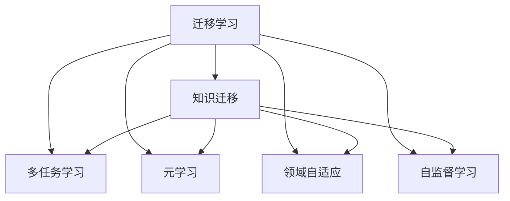

                 

# 知识的可迁移性：跨领域应用的技巧

> 关键词：跨领域学习,知识迁移,机器学习,深度学习,迁移学习

## 1. 背景介绍

在信息爆炸和知识多样化的今天，如何高效利用已有的知识资源，使其在多个领域和任务中发挥作用，已成为人工智能领域的一个重要课题。随着深度学习技术的飞速发展，模型在特定领域表现出了显著的性能，但这些模型往往难以泛化到新的领域，限制了其应用范围。因此，如何实现知识的可迁移性，使得一个领域的知识能够迁移到另一个领域，成为当前研究的热点问题。

知识的可迁移性（Knowledge Transfer）指的是将一个领域学到的知识迁移到另一个领域的过程。在AI领域，这个概念被广泛应用于迁移学习（Transfer Learning）中。迁移学习是机器学习的一种重要范式，通过在特定领域预训练一个模型，然后在另一个领域进行微调，以实现更好的性能。

## 2. 核心概念与联系

### 2.1 核心概念概述

为了更好地理解知识的可迁移性，首先需要明确几个核心概念：

- **迁移学习（Transfer Learning）**：指将一个领域学到的知识迁移到另一个领域的学习范式。通常，在一个领域预训练一个模型，然后在另一个领域进行微调，以提高模型在新任务上的性能。

- **知识迁移（Knowledge Transfer）**：指将一个领域学到的知识迁移到另一个领域的过程。这个过程可能包括特征提取、参数共享、模型微调等环节。

- **多任务学习（Multi-task Learning）**：指在一个模型中同时学习多个相关任务的过程。这些任务可以是同一领域的多个任务，也可以是不同领域但相关联的任务。

- **元学习（Meta-Learning）**：指学习如何快速适应新任务，即学习模型在新任务上的学习方式。元学习通常用于跨领域知识迁移。

- **领域自适应（Domain Adaptation）**：指将一个领域的模型适应到另一个领域，以提高在目标领域的性能。

- **自监督学习（Self-supervised Learning）**：指通过无标签数据训练模型，自动学习到数据的潜在结构，然后将其迁移到下游任务。

这些概念之间存在着密切的联系和相互作用。迁移学习是知识迁移的具体实践方式，多任务学习和元学习则是从理论层面对知识迁移进行建模。领域自适应和自监督学习为知识迁移提供了数据和模型上的支持。

### 2.2 核心概念原理和架构的 Mermaid 流程图



通过这个流程图，可以看出迁移学习的实现依赖于多个核心概念的协同工作。知识迁移作为迁移学习的主要手段，涉及到特征提取、参数共享和模型微调等多个环节。多任务学习和元学习提供了理论上的支持，而领域自适应和自监督学习则提供了数据和模型上的支持。

## 3. 核心算法原理 & 具体操作步骤

### 3.1 算法原理概述

知识迁移的本质是通过将一个领域学到的知识迁移到另一个领域，提高在新领域的性能。其核心思想是利用预训练模型在不同任务间的共性特征，通过微调等方式，让模型更好地适应新任务。

形式化地，假设在源领域 $S$ 上训练了一个模型 $M_S$，并将其应用于目标领域 $T$。设 $T$ 的标注数据集为 $D_T$，则目标领域的迁移学习任务可以表示为：

$$
\min_{\theta} \mathcal{L}(M_S, D_T)
$$

其中 $\theta$ 为模型参数，$\mathcal{L}$ 为目标领域的损失函数，表示模型在新数据上的预测结果与真实标签之间的差异。

通过梯度下降等优化算法，微调过程不断更新模型参数 $\theta$，最小化损失函数 $\mathcal{L}$，使得模型输出逼近真实标签。由于 $M_S$ 已经通过在源领域 $S$ 上训练获得了较好的初始化，因此即便在目标领域 $T$ 上数据量较小，也能较快收敛到理想的模型参数 $\hat{\theta}$。

### 3.2 算法步骤详解

迁移学习通常包括以下几个关键步骤：

**Step 1: 准备预训练模型和数据集**
- 选择合适的预训练模型 $M_S$ 作为初始化参数。
- 准备目标领域 $T$ 的标注数据集 $D_T$，划分为训练集、验证集和测试集。

**Step 2: 选择迁移策略**
- 选择合适的迁移策略，如微调、微调+迁移、自监督迁移等。

**Step 3: 添加任务适配层**
- 根据任务类型，在预训练模型的顶层设计合适的输出层和损失函数。

**Step 4: 设置迁移超参数**
- 选择合适的优化算法及其参数，如 AdamW、SGD 等。
- 设置学习率、批大小、迭代轮数等。
- 设置正则化技术及强度，包括权重衰减、Dropout、Early Stopping 等。

**Step 5: 执行梯度训练**
- 将训练集数据分批次输入模型，前向传播计算损失函数。
- 反向传播计算参数梯度，根据设定的优化算法和学习率更新模型参数。
- 周期性在验证集上评估模型性能，根据性能指标决定是否触发 Early Stopping。
- 重复上述步骤直到满足预设的迭代轮数或 Early Stopping 条件。

**Step 6: 测试和部署**
- 在测试集上评估迁移后模型 $M_{\hat{\theta}}$ 的性能，对比迁移前后的精度提升。
- 使用迁移后的模型对新样本进行推理预测，集成到实际的应用系统中。
- 持续收集新的数据，定期重新迁移模型，以适应数据分布的变化。

### 3.3 算法优缺点

迁移学习的优点包括：

1. **节省时间**：在目标领域的数据量较小或标注成本较高时，迁移学习可以显著减少从头训练所需的时间和资源。
2. **提高性能**：通过在源领域预训练模型，利用其学到的通用特征，迁移学习通常能够在目标领域获得更好的性能。
3. **泛化能力**：预训练模型往往具备较强的泛化能力，能够迁移到不同的领域和任务。

但迁移学习也存在一些缺点：

1. **数据迁移障碍**：目标领域的数据可能与源领域的数据存在较大的差异，这可能导致迁移学习的性能下降。
2. **任务对齐问题**：预训练模型在源领域学习到的特征可能不完全适用于目标领域的特定任务，需要进行微调或调整。
3. **模型过拟合**：如果预训练模型与目标领域的数据分布差异较大，或目标领域的数据量较小，模型可能会在目标领域过拟合，导致泛化能力下降。
4. **计算成本**：迁移学习通常需要较大的计算资源，包括高性能的GPU/TPU等硬件设备。

## 4. 数学模型和公式 & 详细讲解 & 举例说明

### 4.1 数学模型构建

在迁移学习中，通常使用监督学习框架来建模。假设在源领域 $S$ 上训练了一个模型 $M_S$，并将其应用于目标领域 $T$ 的标注数据集 $D_T$。设 $D_T$ 中的样本为 $(x_i, y_i)$，其中 $x_i$ 为输入，$y_i$ 为标签。迁移学习的目标是使 $M_S$ 在 $D_T$ 上的预测结果逼近真实标签 $y_i$。

目标领域的损失函数 $\mathcal{L}_T$ 通常为交叉熵损失函数，可以表示为：

$$
\mathcal{L}_T = -\frac{1}{N}\sum_{i=1}^N y_i\log M_S(x_i) + (1-y_i)\log(1-M_S(x_i))
$$

其中 $N$ 为样本数量，$M_S(x_i)$ 为模型在输入 $x_i$ 上的预测结果。

### 4.2 公式推导过程

在迁移学习中，优化目标是通过最小化损失函数 $\mathcal{L}_T$ 来更新模型参数 $\theta$，使得模型在新数据上的预测结果与真实标签更接近。通过梯度下降等优化算法，可以求得模型参数的更新公式为：

$$
\theta \leftarrow \theta - \eta \nabla_{\theta}\mathcal{L}_T
$$

其中 $\eta$ 为学习率。

以二分类任务为例，假设有 $M_S$ 在 $D_T$ 上的交叉熵损失函数为：

$$
\mathcal{L}_T = -\frac{1}{N}\sum_{i=1}^N y_i\log M_S(x_i) + (1-y_i)\log(1-M_S(x_i))
$$

将 $\mathcal{L}_T$ 对 $M_S(x_i)$ 求导，得：

$$
\frac{\partial \mathcal{L}_T}{\partial M_S(x_i)} = -y_i \frac{M_S(x_i)}{M_S(x_i)(1-M_S(x_i))} - (1-y_i) \frac{1-M_S(x_i)}{M_S(x_i)(1-M_S(x_i))}
$$

进一步整理可得：

$$
\frac{\partial \mathcal{L}_T}{\partial M_S(x_i)} = \frac{y_i - M_S(x_i)}{M_S(x_i)(1-M_S(x_i))}
$$

因此，模型参数的梯度为：

$$
\nabla_{\theta}\mathcal{L}_T = \frac{1}{N}\sum_{i=1}^N \frac{y_i - M_S(x_i)}{M_S(x_i)(1-M_S(x_i))} \frac{\partial M_S(x_i)}{\partial \theta}
$$

将梯度代入模型参数的更新公式中，得：

$$
\theta \leftarrow \theta - \eta \nabla_{\theta}\mathcal{L}_T
$$

通过上述过程，迁移学习模型 $M_S$ 在目标领域 $T$ 上进行微调，以提高在新数据上的性能。

### 4.3 案例分析与讲解

以下以自然语言处理（NLP）领域的应用为例，详细讲解迁移学习的实现。

**案例：情感分析**

假设在电影评论领域预训练了一个BERT模型 $M_S$，并将其应用于产品评价领域。设 $D_T$ 为产品评价领域的标注数据集，每个样本 $(x_i, y_i)$ 中 $x_i$ 为评价文本，$y_i$ 为情感标签（正面、负面、中性）。

1. **准备预训练模型和数据集**
   - 加载预训练的BERT模型 $M_S$，用于特征提取。
   - 收集产品评价领域的标注数据集 $D_T$，划分为训练集、验证集和测试集。

2. **添加任务适配层**
   - 在BERT模型顶层添加线性分类器，输出情感标签的概率分布。
   - 使用交叉熵损失函数作为目标领域的损失函数。

3. **设置迁移超参数**
   - 选择AdamW优化器，学习率设置为0.001。
   - 设置批大小为16，迭代轮数为10。
   - 使用权重衰减0.01，Dropout 0.5。

4. **执行梯度训练**
   - 将训练集数据分批次输入模型，前向传播计算损失函数。
   - 反向传播计算参数梯度，根据AdamW优化器和学习率更新模型参数。
   - 周期性在验证集上评估模型性能，触发Early Stopping。
   - 重复上述步骤直到满足迭代轮数或Early Stopping条件。

5. **测试和部署**
   - 在测试集上评估迁移后模型 $M_{\hat{\theta}}$ 的性能，对比迁移前后的精度提升。
   - 使用迁移后的模型对新样本进行情感分析，集成到实际的产品评价系统中。

通过上述过程，迁移学习使得在电影评论领域预训练的BERT模型能够迁移到产品评价领域，提高了在新数据上的情感分析性能。

## 5. 项目实践：代码实例和详细解释说明

### 5.1 开发环境搭建

在进行迁移学习项目实践前，需要准备好开发环境。以下是使用Python进行PyTorch开发的环境配置流程：

1. 安装Anaconda：从官网下载并安装Anaconda，用于创建独立的Python环境。

2. 创建并激活虚拟环境：
```bash
conda create -n pytorch-env python=3.8 
conda activate pytorch-env
```

3. 安装PyTorch：根据CUDA版本，从官网获取对应的安装命令。例如：
```bash
conda install pytorch torchvision torchaudio cudatoolkit=11.1 -c pytorch -c conda-forge
```

4. 安装Transformers库：
```bash
pip install transformers
```

5. 安装各类工具包：
```bash
pip install numpy pandas scikit-learn matplotlib tqdm jupyter notebook ipython
```

完成上述步骤后，即可在`pytorch-env`环境中开始迁移学习实践。

### 5.2 源代码详细实现

下面我们以迁移学习在情感分析任务中的应用为例，给出使用PyTorch和Transformers库的代码实现。

首先，定义数据处理函数：

```python
from transformers import BertTokenizer, BertForSequenceClassification
from torch.utils.data import Dataset, DataLoader
import torch

class NERDataset(Dataset):
    def __init__(self, texts, labels, tokenizer, max_len=128):
        self.texts = texts
        self.labels = labels
        self.tokenizer = tokenizer
        self.max_len = max_len
        
    def __len__(self):
        return len(self.texts)
    
    def __getitem__(self, item):
        text = self.texts[item]
        label = self.labels[item]
        
        encoding = self.tokenizer(text, return_tensors='pt', max_length=self.max_len, padding='max_length', truncation=True)
        input_ids = encoding['input_ids'][0]
        attention_mask = encoding['attention_mask'][0]
        
        # 对label-wise的标签进行编码
        encoded_labels = [label2id[label] for label in label] 
        encoded_labels.extend([label2id['O']] * (self.max_len - len(encoded_labels)))
        labels = torch.tensor(encoded_labels, dtype=torch.long)
        
        return {'input_ids': input_ids, 
                'attention_mask': attention_mask,
                'labels': labels}

# 标签与id的映射
label2id = {'O': 0, 'positive': 1, 'negative': 2, 'neutral': 3}
id2label = {v: k for k, v in label2id.items()}

# 创建dataset
tokenizer = BertTokenizer.from_pretrained('bert-base-cased')

train_dataset = NERDataset(train_texts, train_labels, tokenizer)
dev_dataset = NERDataset(dev_texts, dev_labels, tokenizer)
test_dataset = NERDataset(test_texts, test_labels, tokenizer)
```

然后，定义模型和优化器：

```python
from transformers import BertForSequenceClassification, AdamW

model = BertForSequenceClassification.from_pretrained('bert-base-cased', num_labels=len(label2id))

optimizer = AdamW(model.parameters(), lr=2e-5)
```

接着，定义训练和评估函数：

```python
from sklearn.metrics import accuracy_score

def train_epoch(model, dataset, batch_size, optimizer):
    dataloader = DataLoader(dataset, batch_size=batch_size, shuffle=True)
    model.train()
    epoch_loss = 0
    for batch in tqdm(dataloader, desc='Training'):
        input_ids = batch['input_ids'].to(device)
        attention_mask = batch['attention_mask'].to(device)
        labels = batch['labels'].to(device)
        model.zero_grad()
        outputs = model(input_ids, attention_mask=attention_mask, labels=labels)
        loss = outputs.loss
        epoch_loss += loss.item()
        loss.backward()
        optimizer.step()
    return epoch_loss / len(dataloader)

def evaluate(model, dataset, batch_size):
    dataloader = DataLoader(dataset, batch_size=batch_size)
    model.eval()
    preds, labels = [], []
    with torch.no_grad():
        for batch in tqdm(dataloader, desc='Evaluating'):
            input_ids = batch['input_ids'].to(device)
            attention_mask = batch['attention_mask'].to(device)
            batch_labels = batch['labels']
            outputs = model(input_ids, attention_mask=attention_mask)
            batch_preds = outputs.logits.argmax(dim=2).to('cpu').tolist()
            batch_labels = batch_labels.to('cpu').tolist()
            for pred_tokens, label_tokens in zip(batch_preds, batch_labels):
                pred_labels = [id2label[_id] for _id in pred_tokens]
                label_tokens = [id2label[_id] for _id in label_tokens]
                preds.append(pred_labels[:len(label_tokens)])
                labels.append(label_tokens)
                
    print('Accuracy:', accuracy_score(labels, preds))
```

最后，启动训练流程并在测试集上评估：

```python
epochs = 5
batch_size = 16

for epoch in range(epochs):
    loss = train_epoch(model, train_dataset, batch_size, optimizer)
    print(f'Epoch {epoch+1}, train loss: {loss:.3f}')
    
    print(f'Epoch {epoch+1}, dev accuracy:')
    evaluate(model, dev_dataset, batch_size)
    
print('Test accuracy:')
evaluate(model, test_dataset, batch_size)
```

以上就是使用PyTorch和Transformers库进行迁移学习情感分析的完整代码实现。可以看到，得益于Transformers库的强大封装，我们可以用相对简洁的代码完成迁移学习的实践。

### 5.3 代码解读与分析

让我们再详细解读一下关键代码的实现细节：

**NERDataset类**：
- `__init__`方法：初始化文本、标签、分词器等关键组件。
- `__len__`方法：返回数据集的样本数量。
- `__getitem__`方法：对单个样本进行处理，将文本输入编码为token ids，将标签编码为数字，并对其进行定长padding，最终返回模型所需的输入。

**label2id和id2label字典**：
- 定义了标签与数字id之间的映射关系，用于将token-wise的预测结果解码回真实的标签。

**训练和评估函数**：
- 使用PyTorch的DataLoader对数据集进行批次化加载，供模型训练和推理使用。
- 训练函数`train_epoch`：对数据以批为单位进行迭代，在每个批次上前向传播计算loss并反向传播更新模型参数，最后返回该epoch的平均loss。
- 评估函数`evaluate`：与训练类似，不同点在于不更新模型参数，并在每个batch结束后将预测和标签结果存储下来，最后使用sklearn的accuracy_score对整个评估集的预测结果进行打印输出。

**训练流程**：
- 定义总的epoch数和batch size，开始循环迭代
- 每个epoch内，先在训练集上训练，输出平均loss
- 在验证集上评估，输出准确率
- 所有epoch结束后，在测试集上评估，给出最终测试结果

可以看到，PyTorch配合Transformers库使得迁移学习的代码实现变得简洁高效。开发者可以将更多精力放在数据处理、模型改进等高层逻辑上，而不必过多关注底层的实现细节。

当然，工业级的系统实现还需考虑更多因素，如模型的保存和部署、超参数的自动搜索、更灵活的任务适配层等。但核心的迁移学习范式基本与此类似。

## 6. 实际应用场景

### 6.1 跨领域情感分析

情感分析是NLP领域的重要任务，广泛应用于产品评价、社交媒体、用户反馈等领域。通过迁移学习，可以将在一个领域预训练的模型应用于另一个领域的情感分析任务，实现跨领域知识迁移。

在技术实现上，可以收集不同领域的情感标注数据，如电影评论、电商评论、用户评论等，在此基础上对预训练模型进行迁移学习。迁移学习后的模型能够自动理解不同领域下的情感表达方式，快速适应新领域的情感分析任务。

### 6.2 跨领域文本分类

文本分类是NLP领域的经典任务，包括新闻分类、垃圾邮件识别、产品标签分类等。通过迁移学习，可以将在特定领域预训练的模型应用于其他领域的文本分类任务，实现跨领域知识迁移。

具体而言，可以收集不同领域的标注数据，如新闻、电商、法律等，在此基础上对预训练模型进行迁移学习。迁移学习后的模型能够自动学习不同领域下的文本分类模式，提升在新领域上的分类性能。

### 6.3 跨领域对话系统

对话系统是AI领域的重要应用，能够自动与用户进行自然语言交互。通过迁移学习，可以将在特定领域预训练的对话模型应用于其他领域的对话任务，实现跨领域知识迁移。

在技术实现上，可以收集不同领域的对话数据，如客服、医疗、金融等，在此基础上对预训练模型进行迁移学习。迁移学习后的模型能够自动学习不同领域下的对话模式，提升在新领域上的对话效果。

### 6.4 未来应用展望

随着迁移学习技术的发展，基于知识的可迁移性，将在更多领域和任务中得到应用，为各行各业带来变革性影响。

在智慧医疗领域，迁移学习可用于医学影像分析、疾病诊断等任务，提高医疗服务的智能化水平，辅助医生诊疗。

在智能教育领域，迁移学习可用于作业批改、学情分析、知识推荐等方面，因材施教，促进教育公平，提高教学质量。

在智慧城市治理中，迁移学习可用于城市事件监测、舆情分析、应急指挥等环节，提高城市管理的自动化和智能化水平，构建更安全、高效的未来城市。

此外，在企业生产、社会治理、文娱传媒等众多领域，迁移学习的应用也将不断涌现，为经济社会发展注入新的动力。相信随着技术的日益成熟，迁移学习必将在更广阔的应用领域大放异彩。

## 7. 工具和资源推荐

### 7.1 学习资源推荐

为了帮助开发者系统掌握迁移学习理论基础和实践技巧，这里推荐一些优质的学习资源：

1. 《迁移学习》系列博文：由大模型技术专家撰写，深入浅出地介绍了迁移学习原理、模型构建、算法优化等前沿话题。

2. CS231n《深度学习视觉识别》课程：斯坦福大学开设的计算机视觉明星课程，有Lecture视频和配套作业，带你入门深度学习的基础知识和模型构建。

3. 《Hands-On Transfer Learning》书籍：详细介绍了如何使用迁移学习解决实际问题，包括模型选择、数据预处理、模型微调等。

4. Kaggle迁移学习竞赛：参与迁移学习相关的竞赛，实战学习迁移学习的具体应用，积累项目经验。

5. TensorFlow官方文档：TensorFlow的官方文档，提供了丰富的迁移学习样例代码，是上手实践的必备资料。

通过对这些资源的学习实践，相信你一定能够快速掌握迁移学习的精髓，并用于解决实际的NLP问题。

### 7.2 开发工具推荐

高效的开发离不开优秀的工具支持。以下是几款用于迁移学习开发的常用工具：

1. PyTorch：基于Python的开源深度学习框架，灵活动态的计算图，适合快速迭代研究。支持迁移学习模型的构建和微调。

2. TensorFlow：由Google主导开发的开源深度学习框架，生产部署方便，适合大规模工程应用。支持迁移学习模型的构建和微调。

3. PyTorch Lightning：基于PyTorch的深度学习框架，提供了丰富的模型构建和优化工具，适合迁移学习的快速开发和部署。

4. Weights & Biases：模型训练的实验跟踪工具，可以记录和可视化模型训练过程中的各项指标，方便对比和调优。与主流深度学习框架无缝集成。

5. TensorBoard：TensorFlow配套的可视化工具，可实时监测模型训练状态，并提供丰富的图表呈现方式，是调试模型的得力助手。

6. Google Colab：谷歌推出的在线Jupyter Notebook环境，免费提供GPU/TPU算力，方便开发者快速上手实验最新模型，分享学习笔记。

合理利用这些工具，可以显著提升迁移学习任务的开发效率，加快创新迭代的步伐。

### 7.3 相关论文推荐

迁移学习技术的发展源于学界的持续研究。以下是几篇奠基性的相关论文，推荐阅读：

1. Transfer Learning for Natural Language Processing：提出了使用语言模型进行迁移学习的思想，利用在大量文本数据上预训练的模型，提升下游NLP任务的性能。

2. Fast Task-Specific Model Pruning：提出了一种参数高效的迁移学习范式，通过在预训练模型上增加一层微调层，实现少参数的迁移学习。

3. T5 for Interpretation of Image Descriptions：提出了一种视觉-语言迁移学习模型，利用语言模型对图像描述进行生成，提升图像理解能力。

4. Meta-Learning for Graph Neural Networks：提出了一种元学习的迁移学习范式，利用少量数据快速适应新图神经网络任务。

5. Adversarial Multitask Learning：提出了一种多任务学习的迁移学习模型，利用对抗样本提升模型在新任务上的泛化能力。

这些论文代表了大迁移学习技术的发展脉络。通过学习这些前沿成果，可以帮助研究者把握学科前进方向，激发更多的创新灵感。

## 8. 总结：未来发展趋势与挑战

### 8.1 总结

本文对知识的可迁移性及其在跨领域应用中的技巧进行了全面系统的介绍。首先阐述了迁移学习的背景和意义，明确了迁移学习在拓展预训练模型应用、提升下游任务性能方面的独特价值。其次，从原理到实践，详细讲解了迁移学习的数学原理和关键步骤，给出了迁移学习任务开发的完整代码实例。同时，本文还广泛探讨了迁移学习在多个领域的应用前景，展示了其巨大的应用潜力。最后，本文精选了迁移学习的各类学习资源，力求为读者提供全方位的技术指引。

通过本文的系统梳理，可以看到，知识迁移技术作为迁移学习的重要组成部分，正在成为NLP领域的重要范式，极大地拓展了预训练语言模型的应用边界，催生了更多的落地场景。受益于大规模语料的预训练，迁移学习模型以更低的时间和标注成本，在小样本条件下也能取得不错的效果，有力推动了NLP技术的产业化进程。未来，伴随迁移学习方法的不断演进，基于迁移学习范式，AI技术将在更广阔的应用领域大放异彩。

### 8.2 未来发展趋势

展望未来，迁移学习技术将呈现以下几个发展趋势：

1. **多模态迁移学习**：未来迁移学习将不再局限于单一模态的数据，而是能够实现多模态数据的迁移学习。如图像、语音、文本等多模态数据的联合迁移学习，将使得迁移学习模型具备更强的跨领域迁移能力。

2. **元学习与迁移学习结合**：元学习（Meta-Learning）与迁移学习的结合，使得迁移学习模型能够快速适应新任务，提高迁移学习的效果和泛化能力。

3. **知识图谱的利用**：未来迁移学习将更多地利用知识图谱等结构化数据，通过结构化数据的迁移学习，提升模型在特定领域的应用效果。

4. **跨领域自适应**：未来迁移学习将更多地关注跨领域自适应，即如何让迁移学习模型在不同领域间进行无缝迁移。

5. **预训练与迁移学习结合**：未来迁移学习将更多地与预训练模型结合，通过预训练模型在大规模数据上学习到的知识，提升迁移学习的效果。

6. **迁移学习框架的普及**：未来迁移学习框架将更加普及，更多开发者能够使用简单易用的框架进行迁移学习开发，加速技术的应用落地。

这些趋势凸显了迁移学习技术的广阔前景。这些方向的探索发展，必将进一步提升迁移学习模型的性能和应用范围，为构建人机协同的智能系统铺平道路。面向未来，迁移学习技术还需要与其他人工智能技术进行更深入的融合，如知识表示、因果推理、强化学习等，多路径协同发力，共同推动自然语言理解和智能交互系统的进步。

### 8.3 面临的挑战

尽管迁移学习技术已经取得了瞩目成就，但在迈向更加智能化、普适化应用的过程中，它仍面临着诸多挑战：

1. **数据迁移障碍**：目标领域的数据可能与源领域的数据存在较大的差异，这可能导致迁移学习的性能下降。

2. **模型泛化能力不足**：预训练模型在源领域学习到的特征可能不完全适用于目标领域的特定任务，需要进行微调或调整。

3. **模型过拟合**：如果预训练模型与目标领域的数据分布差异较大，或目标领域的数据量较小，模型可能会在目标领域过拟合，导致泛化能力下降。

4. **计算成本高**：迁移学习通常需要较大的计算资源，包括高性能的GPU/TPU等硬件设备。

5. **知识迁移的解释性不足**：迁移学习模型通常缺乏可解释性，难以解释其内部工作机制和决策逻辑。

6. **安全性和伦理问题**：预训练模型难免会学习到有偏见、有害的信息，通过迁移传递到下游任务，产生误导性、歧视性的输出，给实际应用带来安全隐患。

这些挑战凸显了迁移学习技术的不足和局限性。尽管如此，迁移学习仍在不断进步，研究人员正通过更高效的数据迁移、更鲁棒的模型设计、更灵活的微调策略等方式，寻求突破。相信未来，随着技术的日益成熟，迁移学习必将在更广阔的应用领域大放异彩。

### 8.4 研究展望

面向未来，迁移学习技术的研究方向包括：

1. **跨领域自适应**：研究如何通过跨领域自适应，提高迁移学习模型的泛化能力。

2. **元学习与迁移学习结合**：研究如何将元学习与迁移学习结合，使模型能够在少数样本下快速适应新任务。

3. **多模态迁移学习**：研究如何通过多模态数据的联合迁移学习，提升模型的跨领域迁移能力。

4. **知识图谱的利用**：研究如何通过结构化数据的迁移学习，提升模型在特定领域的应用效果。

5. **预训练与迁移学习结合**：研究如何将预训练模型与迁移学习结合，提升迁移学习的效果和泛化能力。

6. **模型解释性**：研究如何提高迁移学习模型的可解释性，使其更加透明和可信任。

这些研究方向将为迁移学习技术的发展带来新的突破，为构建更加智能、可靠、可解释的AI系统奠定基础。

## 9. 附录：常见问题与解答

**Q1：迁移学习是否适用于所有NLP任务？**

A: 迁移学习在大多数NLP任务上都能取得不错的效果，特别是对于数据量较小的任务。但对于一些特定领域的任务，如医学、法律等，仅仅依靠通用语料预训练的模型可能难以很好地适应。此时需要在特定领域语料上进一步预训练，再进行迁移，才能获得理想效果。此外，对于一些需要时效性、个性化很强的任务，如对话、推荐等，迁移方法也需要针对性的改进优化。

**Q2：迁移学习中如何选择迁移策略？**

A: 迁移策略的选择应根据具体任务和数据特点进行。常见的迁移策略包括微调、微调+迁移、自监督迁移等。微调通常适用于数据量较大、标注成本较低的情况；微调+迁移适用于数据量较小、标注成本较高的情况；自监督迁移适用于没有标注数据的情况。

**Q3：迁移学习中如何缓解过拟合问题？**

A: 过拟合是迁移学习面临的主要挑战之一。常见的缓解策略包括数据增强、正则化、对抗训练等。数据增强可以扩充训练集，对抗训练可以提高模型的鲁棒性。

**Q4：迁移学习在落地部署时需要注意哪些问题？**

A: 将迁移学习模型转化为实际应用，还需要考虑模型裁剪、量化加速、服务化封装、弹性伸缩、监控告警、安全防护等多个环节。合理利用这些工具，可以显著提升迁移学习任务的开发效率，加快创新迭代的步伐。

---

作者：禅与计算机程序设计艺术 / Zen and the Art of Computer Programming

