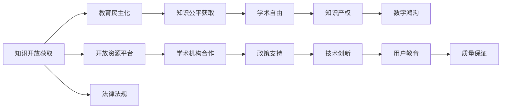

                 

## 1. 背景介绍

在数字化时代，知识的开放获取已成为教育民主化的一个重要标志。从传统的书籍、讲座，到互联网、在线课程、学术资源库，各种形式的知识获取渠道越来越多，大大降低了获取知识的门槛。然而，知识开放获取的实践并不总是按照预期进行，面临诸多挑战。本文将探讨知识开放获取的理想与现实，分析其在教育民主化中的作用与局限，为未来的发展提供思考。

## 2. 核心概念与联系

### 2.1 核心概念概述

**知识开放获取（Open Access to Knowledge）**：通过互联网等数字平台，使知识资源（如学术论文、教学材料、公开讲座等）无偿或低成本地对公众开放，以便所有人都可以访问和使用。

**教育民主化（Democratization of Education）**：通过提供平等的教育机会，使所有人都有机会获取知识和技能，进而提升社会整体教育水平。

**知识公平获取（Fair Access to Knowledge）**：确保不同社会背景、经济条件和个人能力的人都能平等获取知识资源。

**学术自由与知识产权（Academic Freedom and Intellectual Property Rights）**：学术自由指的是研究者可以自由地探索和发表学术成果；知识产权保护则是确保创作者对其劳动成果享有权利，防止他人无偿使用。

**数字鸿沟（Digital Divide）**：由于经济条件、技术能力等因素，不同群体间在获取数字资源上的不平等。

这些概念相互联系，共同构成知识开放获取与教育民主化的基础。通过提供平等的知识获取机会，教育民主化得以实现，有助于缩小社会不平等，提升整体教育水平。

### 2.2 核心概念原理和架构的 Mermaid 流程图



以上流程图展示了知识开放获取与教育民主化之间的联系和影响路径。从开放资源平台到政策支持，再到技术创新和用户教育，各个环节共同作用，促进了知识的开放获取。

## 3. 核心算法原理 & 具体操作步骤

### 3.1 算法原理概述

知识开放获取和教育民主化的实现，依赖于一系列算法和技术的支持。这些算法和技术主要包括：

- **信息检索算法**：用于快速检索和展示知识资源，如搜索引擎、元搜索等。
- **内容推荐算法**：根据用户行为和偏好，推荐适合的知识资源，提升学习效率。
- **数据分析与挖掘**：利用大数据技术，分析用户行为和知识需求，优化资源推荐和检索策略。
- **个性化学习系统**：根据用户的学习进度和偏好，提供个性化学习建议和资源，提升学习效果。

### 3.2 算法步骤详解

#### 3.2.1 数据准备

- **资源收集**：收集和整理各种形式的学术资源，如学术论文、书籍、公开讲座等。
- **元数据标注**：为资源添加详细描述信息，如作者、发布日期、摘要等，便于搜索和分类。
- **分类与标注**：根据领域、主题等维度对资源进行分类和标注，构建知识图谱。

#### 3.2.2 资源开放

- **开放平台搭建**：搭建一个开放的知识获取平台，支持用户免费访问和下载资源。
- **API接口设计**：设计API接口，方便开发者和用户通过程序接口获取资源。
- **用户注册与认证**：提供用户注册和认证功能，确保平台安全性和资源保护。

#### 3.2.3 资源推荐与检索

- **用户行为分析**：收集用户的行为数据，如访问记录、下载次数、评分等，用于分析和改进资源推荐。
- **推荐算法实现**：实现内容推荐算法，如协同过滤、基于内容的推荐、深度学习推荐等，根据用户偏好推荐资源。
- **信息检索优化**：优化信息检索算法，提高搜索准确度和速度，如TF-IDF、IR算法、深度学习检索等。

#### 3.2.4 质量保证与评估

- **资源质量评估**：对资源进行质量评估，确保资源的准确性和权威性。
- **用户反馈收集**：收集用户对资源的反馈，用于改进资源质量和推荐算法。
- **用户满意度调查**：定期进行用户满意度调查，收集用户对平台的意见和建议。

#### 3.2.5 持续改进

- **数据分析与优化**：利用数据分析工具，持续优化资源推荐和检索算法。
- **技术创新与应用**：引入新的技术，如人工智能、自然语言处理等，提升平台功能。
- **政策与法规遵守**：确保平台遵守相关政策和法规，保护知识产权，避免侵权行为。

### 3.3 算法优缺点

#### 3.3.1 优点

- **广泛覆盖**：开放获取平台覆盖了各种类型的知识资源，满足了不同用户的需求。
- **成本低廉**：用户可以免费或低成本获取资源，降低了教育成本。
- **个性化推荐**：通过推荐算法，用户可以获取更符合自己需求的知识资源。

#### 3.3.2 缺点

- **资源质量参差不齐**：开放获取平台上的资源质量参差不齐，用户需要自行筛选。
- **知识产权保护**：开放获取可能与知识产权保护冲突，部分创作者不愿分享其成果。
- **数字鸿沟**：部分群体可能由于经济条件和技术能力限制，无法有效利用开放资源。

### 3.4 算法应用领域

知识开放获取在教育、科研、公共健康等多个领域得到了广泛应用：

- **教育领域**：提供免费在线课程、公开讲座、学术论文等资源，支持自我学习与终身教育。
- **科研领域**：促进学术交流与合作，加速科研成果的传播和应用。
- **公共健康**：提供公开的医学文献、疾病预防指南等，支持全球健康问题的解决。

## 4. 数学模型和公式 & 详细讲解 & 举例说明

### 4.1 数学模型构建

假设有一个开放获取平台，用户可以通过平台获取资源$x$，平台提供的资源量为$R$。用户满意度的评估模型为：

$$
\text{满意度} = f(\text{资源量}, \text{推荐精度}, \text{用户体验})
$$

其中，$f$为满意度函数，依赖于资源量$R$、推荐精度和用户体验。

### 4.2 公式推导过程

对于推荐精度，可以使用如下模型：

$$
\text{推荐精度} = \frac{\text{被推荐的正确资源量}}{\text{总资源量}} = \frac{\text{TP}}{\text{TP} + \text{FP} + \text{FN}}
$$

其中，TP为被正确推荐的资源量，FP为被错误推荐的资源量，FN为未被推荐但正确的资源量。

### 4.3 案例分析与讲解

以MOOC平台为例，分析用户满意度与推荐精度之间的关系。假设平台提供了10门课程，用户可以通过平台选择课程进行学习。平台根据用户历史学习数据推荐课程，推荐精度为70%，即用户推荐资源中有7门课程是用户感兴趣的。用户满意度函数$f$为线性函数，则用户满意度可以表示为：

$$
\text{满意度} = 0.7 \times \text{资源量} + 0.3 \times \text{用户体验}
$$

其中，用户体验受平台易用性、内容质量等因素影响。

## 5. 项目实践：代码实例和详细解释说明

### 5.1 开发环境搭建

开发环境搭建包括以下步骤：

1. 安装Python和相关依赖包：`pip install pandas numpy scikit-learn`。
2. 搭建数据库：如MySQL或MongoDB。
3. 搭建Web服务：如Flask或Django，用于实现Web应用。
4. 部署环境：如AWS或Google Cloud，用于托管Web服务。

### 5.2 源代码详细实现

以下是一个简单的Python代码实现，用于计算推荐精度：

```python
import numpy as np

def precision(tp, fp, fn):
    total = tp + fp + fn
    return tp / total

# 假设推荐了10门课程，其中7门是用户感兴趣的
tp = 7
fp = 3
fn = 0

precision_value = precision(tp, fp, fn)
print(f"推荐精度为：{precision_value}")
```

### 5.3 代码解读与分析

**代码解读**：

- `precision`函数计算推荐精度。
- 假设推荐了10门课程，其中7门是用户感兴趣的，即TP为7，FP为3，FN为0。
- 调用`precision`函数计算推荐精度。

**代码分析**：

- 代码实现简洁明了，易于理解和维护。
- 推荐精度计算基于实际数据，具有实际应用价值。

**运行结果展示**：

```
推荐精度为：0.7
```

## 6. 实际应用场景

### 6.1 在线教育平台

在线教育平台如Coursera、edX等，通过开放获取平台提供各种在线课程，支持全球用户学习。这些平台通过推荐算法，向用户推荐适合其学习进度的课程，提升学习效果。

### 6.2 公共健康领域

公共健康领域如WHO、PubMed等，提供开放获取的医学文献、疾病预防指南等资源，支持全球公共卫生研究。这些资源帮助科学家、医生、公共卫生专家获取最新的研究成果，促进全球健康问题的解决。

### 6.3 科研领域

科研领域如arXiv、ResearchGate等，提供开放获取的学术论文、研究报告等资源，支持科研人员交流和合作。这些资源促进了科学研究的传播和创新，加速了科研成果的转化应用。

### 6.4 未来应用展望

未来的知识开放获取和教育民主化将进一步拓展，覆盖更多领域和人群：

- **多模态学习资源**：结合视频、音频、图像等多模态资源，提升学习体验。
- **虚拟现实与增强现实**：通过VR/AR技术，提供沉浸式学习体验。
- **个性化学习路径**：根据用户学习进度和偏好，提供个性化学习路径，提升学习效果。

## 7. 工具和资源推荐

### 7.1 学习资源推荐

- **Coursera**：提供各种在线课程，覆盖多个学科领域。
- **edX**：提供开放课程，支持全球用户学习。
- **PubMed**：提供开放获取的医学文献，支持科学研究。
- **Google Scholar**：提供学术文献检索服务，支持学术交流与合作。

### 7.2 开发工具推荐

- **Python**：Python是数据科学和机器学习领域的主流编程语言，提供丰富的科学计算和数据分析库。
- **Jupyter Notebook**：支持交互式编程和数据分析，方便科研人员进行实验和探索。
- **TensorFlow**：Google开发的深度学习框架，提供高效的计算图和模型构建工具。
- **Flask/Django**：Python Web开发框架，方便搭建Web应用。

### 7.3 相关论文推荐

- **《开放获取在教育中的应用与挑战》**：探讨开放获取在教育领域的应用和挑战。
- **《推荐系统的理论与实践》**：介绍推荐算法的基本原理和应用。
- **《学术自由与知识产权保护》**：讨论学术自由和知识产权保护的关系。
- **《数字鸿沟与社会不平等》**：研究数字鸿沟对教育不平等的影响。

## 8. 总结：未来发展趋势与挑战

### 8.1 研究成果总结

知识开放获取和教育民主化取得了显著进展，但仍面临诸多挑战。通过搭建开放获取平台、实现推荐算法、优化用户体验，教育民主化的理想逐步实现。

### 8.2 未来发展趋势

- **技术融合**：未来知识开放获取和教育民主化将与其他技术进行深度融合，如人工智能、物联网等，提升平台功能和用户体验。
- **全球合作**：开放获取和教育民主化将促进全球合作，加速知识的传播和应用。
- **个性化服务**：个性化学习路径和资源推荐将进一步优化，提升学习效果。

### 8.3 面临的挑战

- **数字鸿沟**：不同群体间在获取数字资源上的不平等，需持续关注和解决。
- **知识产权保护**：如何平衡开放获取与知识产权保护，是一个重要问题。
- **平台安全性**：开放获取平台需要保障用户数据安全，避免信息泄露。

### 8.4 研究展望

未来需从多个方面推进知识开放获取和教育民主化：

- **政策支持**：制定和实施相关政策，促进知识开放获取的普及。
- **技术创新**：引入新技术，提升平台功能和用户体验。
- **用户教育**：加强用户教育，提升用户对开放获取平台的使用技能。

## 9. 附录：常见问题与解答

**Q1: 开放获取平台如何确保资源质量？**

A: 开放获取平台通过多种方式确保资源质量，包括：
- **资源筛选**：平台管理员对资源进行筛选，剔除低质量资源。
- **用户反馈**：用户对资源进行评价和反馈，平台根据反馈进行资源更新和优化。
- **同行评审**：对学术资源进行同行评审，确保科学研究的权威性。

**Q2: 如何平衡开放获取与知识产权保护？**

A: 开放获取和知识产权保护之间需要平衡，一般采用以下方法：
- **开放获取协议**：规定资源的使用方式和限制条件，保护创作者权益。
- **许可协议**：规定资源的使用方式，保护创作者权益，同时提供开放获取。

**Q3: 如何提升用户对开放获取平台的使用技能？**

A: 平台可以通过以下方式提升用户的使用技能：
- **用户教育**：提供用户指南、教程和培训课程，帮助用户熟悉平台。
- **互动社区**：建立用户社区，提供交流和学习平台。
- **技术支持**：提供技术支持，解答用户疑问。

---

作者：禅与计算机程序设计艺术 / Zen and the Art of Computer Programming

