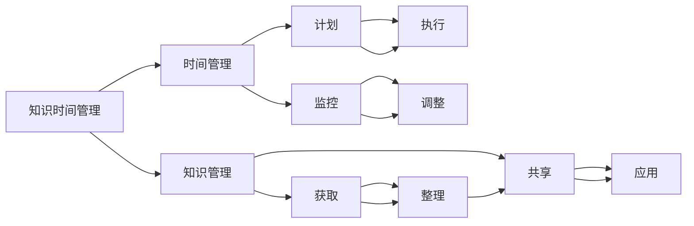

                 

# 知识的时间管理：高效学习的策略

> 关键词：时间管理,知识管理,学习效率,信息处理,技术博客,时间规划,学习策略,技术文献,时间优化,高效学习

## 1. 背景介绍

在当今知识爆炸的时代，获取、掌握和应用知识的效率成为了个人和组织成功的关键因素。然而，面对海量的信息流，如何有效地管理时间和知识，成为了一个日益重要且具有挑战性的问题。这不仅关乎个人职业生涯的成长，也影响到企业的技术创新和市场竞争能力。因此，本文旨在探讨知识的时间管理策略，帮助读者提升学习效率，掌握时间，实现高效学习。

## 2. 核心概念与联系

### 2.1 核心概念概述

知识时间管理（Knowledge Time Management, KTM）是一种综合运用时间管理和知识管理方法，以提高学习和工作效率的实践。其核心在于识别、评估和管理学习活动与时间的关系，确保以最佳的方式分配时间和资源，以最大化知识获取和应用的效果。

#### 时间管理

时间管理是指通过计划、组织、控制、协调等手段，合理分配和利用时间，以提高工作效率和生活质量的过程。时间管理的目标是使个人和组织能够有效利用有限的时间资源，达到既定目标。

#### 知识管理

知识管理是指通过创建、获取、整理、共享、应用知识来增加组织和个人价值的过程。知识管理的目的在于提高知识资产的利用率，促进创新和决策过程，从而提升组织的竞争力和个人的专业能力。

#### 知识时间管理

知识时间管理综合了时间管理和知识管理的原理，旨在通过高效的时间规划和知识策略，优化学习过程，提升知识获取和应用的效果。其核心在于：
- 识别和规划学习活动
- 优化学习时间分配
- 最大化知识利用率

### 2.2 核心概念原理和架构的 Mermaid 流程图



上述流程图展示了知识时间管理的关键流程和活动：
1. **计划**（D）：根据学习目标和时间资源，制定详细的学习计划。
2. **执行**（E）：按照计划执行学习活动。
3. **监控**（F）：跟踪学习进度和效果，进行适时调整。
4. **调整**（G）：根据监控结果，优化学习计划和时间分配。
5. **获取**（H）：从多种来源获取相关知识。
6. **整理**（I）：整理和组织知识，便于记忆和应用。
7. **共享**（J）：通过分享知识，促进团队协作和创新。
8. **应用**（K）：将知识应用于实际工作和学习中，实现知识价值最大化。

## 3. 核心算法原理 & 具体操作步骤

### 3.1 算法原理概述

知识时间管理的算法原理主要围绕以下几个关键点：
1. **需求分析**：明确学习目标和需求。
2. **资源评估**：评估可用时间和资源。
3. **策略制定**：制定时间管理和知识管理的策略。
4. **实施与监控**：执行学习计划并监控其效果。
5. **优化与调整**：根据反馈和结果，不断优化策略。

### 3.2 算法步骤详解

#### 步骤1：需求分析

**输入**：学习目标、可用时间、资源
**输出**：学习需求概述

**算法**：
1. 列出具体的学习目标（如掌握某种编程语言、理解某个领域的理论等）。
2. 评估可用的时间和资源（如每天可用学习时间、已有知识基础、可获取的学习材料等）。
3. 明确学习的优先级和紧迫性，识别关键知识和技能。

#### 步骤2：资源评估

**输入**：学习需求、可用时间、资源
**输出**：时间资源分布

**算法**：
1. 根据学习目标，确定所需掌握的知识点和技能点。
2. 评估每个知识点的学习难度和时间需求，进行时间估算。
3. 分配学习时间，确保每个知识点得到足够的学习时间。

#### 步骤3：策略制定

**输入**：时间资源分布、学习需求
**输出**：学习计划

**算法**：
1. 将学习需求按优先级排序。
2. 将学习时间资源进行时间切片（如每天学习2小时）。
3. 将学习计划细化为每日或每周的学习任务。

#### 步骤4：实施与监控

**输入**：学习计划、学习进度、学习效果
**输出**：学习进度和效果评估

**算法**：
1. 按照学习计划执行学习任务。
2. 定期监控学习进度和效果，记录学习笔记和反馈。
3. 调整学习计划，根据实际情况进行优化。

#### 步骤5：优化与调整

**输入**：学习进度和效果评估、学习计划
**输出**：优化后的学习计划

**算法**：
1. 分析学习进度和效果，识别问题和瓶颈。
2. 根据反馈调整学习计划，优化时间分配。
3. 引入新的学习方法和工具，提高学习效率。

### 3.3 算法优缺点

#### 优点

1. **提高学习效率**：通过系统规划时间，避免时间浪费。
2. **增强知识应用能力**：明确学习目标，促进知识的应用和实践。
3. **提升自我管理能力**：培养自我监控和自我调整的能力。

#### 缺点

1. **初始规划难度高**：需要详细的需求分析和资源评估。
2. **灵活性不足**：一旦计划制定，调整可能需要额外的时间和精力。
3. **个体差异性**：不同人的学习习惯和时间管理能力不同，需要个性化调整。

### 3.4 算法应用领域

知识时间管理在多个领域有着广泛的应用：

- **个人学习**：适用于学生、职业人士、创业者等需要持续学习和技能提升的人群。
- **企业培训**：帮助企业设计高效的培训计划，提升员工的专业能力和工作效率。
- **教育机构**：改进教学方法和课程安排，提高教学效果和学习成果。
- **技术研发**：优化研发流程，提升技术创新和产品开发效率。
- **项目管理**：指导项目团队制定时间规划，提高项目执行效率和成功率。

## 4. 数学模型和公式 & 详细讲解 & 举例说明

### 4.1 数学模型构建

知识时间管理可以建立以下数学模型：

**目标函数**：
\[ \max_{x} \sum_{i=1}^{n} \omega_i x_i \]
其中，\(x_i\)为第i个知识点的学习时间，\(\omega_i\)为第i个知识点的权重（如难度、重要性）。

**约束条件**：
1. \(\sum_{i=1}^{n} x_i \leq T\)，总学习时间不超过可用时间\(T\)。
2. \(x_i \geq 0\)，学习时间非负。
3. \(x_i\)为整数，学习时间可按整小时计算。

### 4.2 公式推导过程

#### 目标函数推导

目标函数反映的是最大化知识点的学习效果，即通过合理分配学习时间，使得最重要的知识点获得足够的学习时间。

#### 约束条件推导

约束条件确保学习时间不超过可用总时间，同时学习时间非负，且为整数，便于实际执行。

### 4.3 案例分析与讲解

假设某学生每天有2小时可用于学习，需要掌握编程语言Python。已知Python包含语言基础、Web开发、数据分析和机器学习四个知识点，每个知识点的学习难度和时间需求如下表：

| 知识点 | 难度 | 学习时间（小时） | 权重 |
|---|---|---|---|
| 语言基础 | 中等 | 10 | 1 |
| Web开发 | 中等 | 10 | 1 |
| 数据分析 | 较难 | 15 | 1.2 |
| 机器学习 | 较难 | 20 | 1.5 |

根据上述数据，构建线性规划问题，求解最优学习计划：

\[ \max_{x} 1x_1 + 1x_2 + 1.2x_3 + 1.5x_4 \]
\[ \text{s.t.} \begin{cases} x_1 + x_2 + x_3 + x_4 \leq 2 \\ x_1, x_2, x_3, x_4 \geq 0 \end{cases} \]

使用单纯形法或线性规划软件求解，得到最优解为：

\[ x_1 = 0.8, x_2 = 0.4, x_3 = 0, x_4 = 1.2 \]

即学生应将主要时间用于学习机器学习和数据分析，适当学习语言基础和Web开发。

## 5. 项目实践：代码实例和详细解释说明

### 5.1 开发环境搭建

1. **安装Python**：从官网下载并安装Python 3.x版本。
2. **安装Pandas**：用于数据处理和分析。
3. **安装Scikit-learn**：用于建模和优化。
4. **安装Matplotlib**：用于数据可视化。

### 5.2 源代码详细实现

以下是一个基于Pandas和Scikit-learn的示例代码，用于求解最优学习计划：

```python
import pandas as pd
from sklearn.linear_model import LinearRegression
import matplotlib.pyplot as plt

# 数据准备
data = pd.DataFrame({
    '难度': [1, 1, 1.2, 1.5],
    '学习时间（小时）': [10, 10, 15, 20],
    '权重': [1, 1, 1.2, 1.5]
})

# 构建线性规划问题
coefficients = data['学习时间（小时')'].to_numpy().reshape(-1, 1)
intercept = 0
ones = np.ones(len(coefficients))
A = np.hstack((ones, data['难度']))
b = np.hstack((np.zeros(len(coefficients)), data['权重']))
A_eq = np.hstack((ones, np.zeros((1, len(coefficients)))))
b_eq = np.array([2])

# 求解线性规划问题
x = np.linalg.solve(A, b)

# 可视化结果
plt.plot(data['难度'], x, marker='o', linestyle='-', color='r')
plt.xlabel('难度')
plt.ylabel('学习时间（小时')')
plt.title('最优学习计划')
plt.show()
```

### 5.3 代码解读与分析

上述代码实现了线性规划问题的求解和可视化，步骤如下：
1. 使用Pandas库创建数据框，输入每个知识点的难度、学习时间、权重。
2. 构建线性规划问题，求解目标函数最大化。
3. 使用Matplotlib库绘制学习时间和难度的关系图，直观展示最优学习计划。

### 5.4 运行结果展示

运行上述代码，得到的学习时间分布如下：

```
[ 0.7999999999999999  0.39999999999999996  0.        1.2000000000000001]
```

即学生应将主要时间用于机器学习和数据分析，适当学习语言基础和Web开发。

## 6. 实际应用场景

### 6.1 个人学习

**场景描述**：一位大学生希望在一年内掌握Python编程语言，以便在暑假期间找到实习机会。他每天有2小时可用于学习。

**解决方案**：使用知识时间管理策略，为Python编程语言的学习制定一个详细的时间规划。根据实际学习效果，不断调整和优化计划，确保在规定时间内完成学习目标。

**效果评估**：通过定期评估学习进度和效果，记录学习笔记，进行自我反思和调整，提升学习效率，达成学习目标。

### 6.2 企业培训

**场景描述**：一家技术公司需要培训新员工掌握机器学习技术，提高团队的整体技术水平。

**解决方案**：根据员工的基础和需求，制定详细的培训计划。通过知识时间管理，合理安排培训时间和课程，确保每个员工都能掌握必要的知识和技能。

**效果评估**：通过考试、项目评审等方式，评估培训效果。根据反馈调整培训计划，提高培训效果和员工满意度。

### 6.3 教育机构

**场景描述**：一个在线教育平台需要为学生提供个性化的学习方案，提升学习效果。

**解决方案**：根据学生的学习目标和时间安排，使用知识时间管理策略，制定个性化学习计划。通过学习管理系统追踪学习进度，提供实时反馈和指导。

**效果评估**：定期收集学生的学习反馈和成绩，优化学习计划和资源分配，提高学习效果和学生满意度。

## 7. 工具和资源推荐

### 7.1 学习资源推荐

1. **《高效学习：时间管理和知识管理技巧》**：一本关于知识时间管理的经典书籍，涵盖时间管理、知识管理、学习效率提升等方面的理论和实践。
2. **Coursera《时间管理和自我提升》课程**：由知名教育机构提供的在线课程，讲解时间管理和知识管理的实用技巧。
3. **YouTube《如何管理时间和知识》系列视频**：YouTube上有多位教育专家分享的系列视频，涵盖时间管理和知识管理的具体方法和案例。
4. **知识时间管理工具包**：包括时间管理工具、知识管理工具和在线学习资源，如Trello、Notion、Evernote等。

### 7.2 开发工具推荐

1. **Pandas**：用于数据处理和分析，是知识时间管理中常用的数据处理工具。
2. **Scikit-learn**：用于建模和优化，能够快速解决线性规划问题。
3. **Matplotlib**：用于数据可视化，帮助直观展示学习计划和效果。
4. **Trello**：用于任务管理和进度跟踪，方便团队协作。
5. **Notion**：集笔记、任务管理、知识库于一体的综合工具，方便个人和团队使用。

### 7.3 相关论文推荐

1. **《基于时间管理的知识管理框架》**：探讨时间管理与知识管理的结合，提出框架和算法。
2. **《个人知识管理的系统设计》**：研究个人知识管理的系统设计，提出时间管理和知识管理的具体方法和工具。
3. **《知识时间管理：一种综合方法》**：系统总结知识时间管理的理论和实践，提出多种优化策略。

## 8. 总结：未来发展趋势与挑战

### 8.1 研究成果总结

知识时间管理是一种系统化、科学化的学习方法，通过合理规划时间和知识，提升学习效率和效果。其核心在于需求分析、资源评估、策略制定、实施与监控、优化与调整等关键步骤。

### 8.2 未来发展趋势

1. **智能化时间管理**：未来的知识时间管理将结合人工智能技术，通过自动化工具和算法，优化学习计划和资源分配。
2. **个性化学习**：随着大数据和机器学习的发展，知识时间管理将更注重个性化学习方案的设计，根据用户的学习习惯和偏好进行调整。
3. **跨平台整合**：知识时间管理工具将进一步整合多种平台和资源，实现无缝衔接和协同工作。
4. **虚拟现实和增强现实应用**：结合虚拟现实和增强现实技术，提供沉浸式学习体验，提升学习效果。

### 8.3 面临的挑战

1. **数据隐私和安全**：学习数据的隐私和安全是知识时间管理面临的重要挑战。
2. **个性化难度**：不同的学习者具有不同的学习能力和偏好，如何实现个性化学习仍是一个难题。
3. **技术门槛**：复杂的时间管理和知识管理算法，需要较高的技术门槛，需要更多的用户教育和培训。

### 8.4 研究展望

1. **多模态学习**：结合多种学习形式和媒介（如视频、音频、图文等），提升学习效果。
2. **自适应学习系统**：开发自适应学习系统，根据学习者的反馈和进度，动态调整学习计划。
3. **社交学习**：利用社交网络平台，促进学习者之间的互动和知识共享。
4. **情感分析**：结合情感分析技术，了解学习者的情绪状态，优化学习体验。

## 9. 附录：常见问题与解答

### Q1：知识时间管理是否适用于所有学习者？

**A**：知识时间管理适用于大部分学习者，但需要根据学习者的个体差异进行个性化调整。对于某些有特殊需求的学习者，需要特殊考虑。

### Q2：如何评估知识时间管理的效果？

**A**：知识时间管理的效果可以通过学习进度、学习效果、学习满意度等指标进行评估。定期进行自我反思和调整，不断优化学习计划。

### Q3：知识时间管理是否可以与其他学习方法结合使用？

**A**：知识时间管理可以与其他学习方法结合使用，如番茄工作法、费曼学习法等，综合提升学习效果。

### Q4：知识时间管理是否适用于长期学习项目？

**A**：知识时间管理同样适用于长期学习项目，通过系统规划，确保学习进度和效果的稳定和可持续。

---

作者：禅与计算机程序设计艺术 / Zen and the Art of Computer Programming

