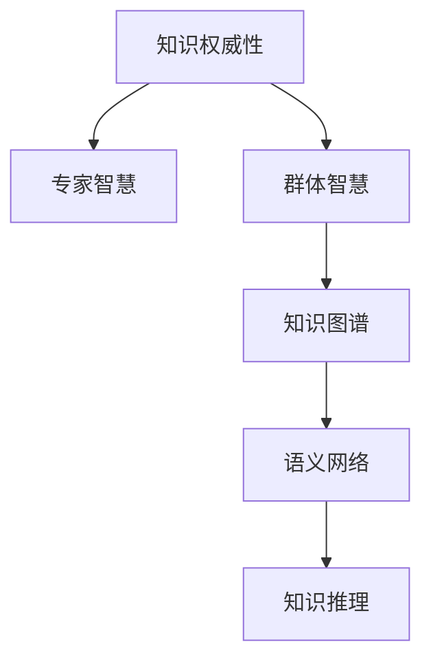

                 

# 知识的权威性：专家知识与群体智慧的平衡

> 关键词：知识权威性,专家智慧,群体智慧,知识图谱,语义网络,知识推理

## 1. 背景介绍

在信息爆炸的今天，知识获取已经不再是个体面对书籍或导师的挑战，而是通过各种智能工具和平台进行快速的搜索、筛选和获取。然而，知识权威性的问题却越来越成为困扰人们的一个难题。如何判断一个知识的正确性，一个观点是否具有权威性，成为了摆在每个人面前的挑战。

### 1.1 问题由来
随着互联网和社交媒体的普及，信息传播的速度和范围不断扩大，任何人都可以是信息的源头。然而，这些信息的质量却参差不齐，其中不乏错误、偏见、误导性的内容。这种信息的泛滥，使得人们在知识海洋中难以分辨真伪，导致误导决策、损害声誉甚至造成实际损失的情况屡见不鲜。

### 1.2 问题核心关键点
知识权威性问题涉及到了知识的可靠性和可信度，其核心在于如何判断和验证信息源的真实性和正确性。具体而言，有以下几个关键点：

1. **知识源的权威性**：选择权威、可信的知识源是判断信息正确性的基础。权威的知识源往往有严格的审查机制，内容准确可靠。
2. **知识内容的合理性**：即使来自权威源，信息内容的合理性和逻辑性也是需要评估的。错误的论证、逻辑漏洞、数据造假等问题，都会影响知识权威性。
3. **知识的更新频率**：知识的时效性是影响其权威性的重要因素。过时的信息可能导致误导，及时更新的知识更为可靠。
4. **知识的可验证性**：可重复验证的信息更具有权威性。有效的数据、实验记录、推理链条，都可以作为知识的权威性证据。

## 2. 核心概念与联系

### 2.1 核心概念概述

为更好地理解知识权威性的问题，本节将介绍几个密切相关的核心概念：

- **知识权威性**：指信息源的可靠性和知识内容的正确性，是判断知识可信度的基础。
- **专家智慧**：指领域专家基于长期学习和研究积累的知识和经验，具有较高的专业性和权威性。
- **群体智慧**：指来自普通用户或社区的知识集合，其多样性和丰富性可以补充专家智慧的不足。
- **知识图谱**：一种语义化、结构化的知识表示方式，通过实体、关系和属性来描述知识。
- **语义网络**：由实体节点和边组成的知识图谱，用于表示实体之间的语义关系。
- **知识推理**：基于知识图谱中的逻辑关系，进行推理和验证，以判断知识的权威性。

这些核心概念之间的逻辑关系可以通过以下Mermaid流程图来展示：



这个流程图展示了几者之间的联系：

1. 知识权威性基于专家智慧和群体智慧，通过知识图谱和语义网络进行验证。
2. 专家智慧和群体智慧都是构成知识权威性的重要来源。
3. 知识图谱和语义网络是知识推理的依据，用于判断知识的权威性。

## 3. 核心算法原理 & 具体操作步骤
### 3.1 算法原理概述

知识权威性的判断，可以通过构建和查询知识图谱来实现。其核心思想是：将知识表示为结构化的语义网络，通过推理和验证，评估知识的权威性。

形式化地，假设一个知识图谱 $G=(V,E)$，其中 $V$ 表示节点集合，$E$ 表示边集合，每个节点表示一个实体，每条边表示一个关系。知识推理的目的是：给定实体 $r$，通过推理算法 $P$，得到实体 $r$ 的权威性评估结果 $A(r)$，表示 $r$ 的权威性评分。

### 3.2 算法步骤详解

构建和查询知识图谱的具体步骤包括：

1. **知识图谱构建**：收集领域知识，构建语义网络。使用知识图谱的构建工具，如Neo4j、GraPhi等，将领域内的实体和关系映射到图谱中。
2. **实体权威性评估**：定义权威性评估函数 $A(r)$，根据实体 $r$ 的属性和关系，计算其权威性评分。
3. **关系权威性评估**：定义关系权威性评估函数 $A(e)$，根据关系 $e$ 的属性和连接实体的权威性评分，计算其权威性评分。
4. **权威性推理**：通过知识图谱中的推理算法 $P$，根据实体和关系的权威性评分，计算其他实体的权威性评分。
5. **结果验证**：对推理结果进行验证，通过交叉验证、专家审查等方式，保证推理结果的可靠性。

### 3.3 算法优缺点

基于知识图谱和语义网络的知识权威性评估方法，具有以下优点：

1. **全面性**：能够综合考虑多个实体的权威性，避免单一信息源的偏见。
2. **逻辑性**：通过推理链条和验证机制，保证评估过程的逻辑性和合理性。
3. **可扩展性**：知识图谱可以不断更新，适应知识的变化和更新。

但同时也存在一些局限性：

1. **构建复杂**：知识图谱的构建需要大量人力和时间，且对领域知识有较高要求。
2. **数据稀疏**：一些领域或概念可能缺乏足够的数据，难以构建完备的知识图谱。
3. **推理困难**：复杂的推理过程可能会遇到逻辑冲突或推理失败的问题。
4. **维护成本高**：知识图谱需要定期维护和更新，以保持其权威性。

### 3.4 算法应用领域

基于知识图谱和语义网络的知识权威性评估方法，可以应用于多个领域，例如：

- 金融风险评估：评估金融产品的风险，构建投资组合的权威性。
- 医疗诊断和治疗：基于医学知识图谱，评估诊疗方案的权威性。
- 法律咨询和纠纷解决：评估法律条文的权威性，提供法律建议。
- 教育评估和课程推荐：基于教育知识图谱，评估课程的权威性和推荐效果。
- 工业制造和供应链管理：评估生产工艺和供应链方案的权威性，优化生产流程。

## 4. 数学模型和公式 & 详细讲解 & 举例说明

### 4.1 数学模型构建

本节将使用数学语言对基于知识图谱和语义网络的知识权威性评估方法进行更加严格的刻画。

假设知识图谱 $G=(V,E)$，其中 $V=\{v_1, v_2, ..., v_n\}$ 为节点集合，$E=\{e_1, e_2, ..., e_m\}$ 为边集合，每个节点 $v_i$ 表示一个实体，每个边 $e_j$ 表示一个关系。实体 $v_i$ 的属性集合为 $A_i=\{a_{i1}, a_{i2}, ..., a_{ik}\}$，关系 $e_j$ 的属性集合为 $B_j=\{b_{j1}, b_{j2}, ..., b_{jn}\}$。

定义实体 $v_i$ 的权威性评分 $A_i$ 和关系 $e_j$ 的权威性评分 $A_j$，计算公式如下：

$$
A_i = f_i(A_{i1}, A_{i2}, ..., A_{ik})
$$

$$
A_j = f_j(A_{j1}, A_{j2}, ..., A_{jn}, A_{v_{i1}}, A_{v_{i2}}, ..., A_{v_{in}})
$$

其中 $f_i$ 和 $f_j$ 为权威性评估函数，具体形式根据领域和任务不同而不同。

### 4.2 公式推导过程

以下是几个典型权威性评估函数的推导过程：

**实体权威性评分 $A_i$**：
$$
A_i = \frac{\sum_{k=1}^{n} w_{ik} A_k}{\sum_{k=1}^{n} w_{ik}} = \frac{\sum_{k=1}^{n} w_{ik} A_k}{\sum_{k=1}^{n} w_{ik}}
$$

其中 $w_{ik}$ 为属性 $a_{ik}$ 的权重，可以根据领域知识或统计分析确定。

**关系权威性评分 $A_j$**：
$$
A_j = \frac{\sum_{n=1}^{m} w_{jn} A_n + \sum_{i=1}^{k} w_{ji} A_i}{\sum_{n=1}^{m} w_{jn} + \sum_{i=1}^{k} w_{ji}}
$$

其中 $w_{jn}$ 为关系 $e_j$ 的属性 $b_{jn}$ 的权重，$w_{ji}$ 为关系 $e_j$ 所连接实体 $v_i$ 的权重。

### 4.3 案例分析与讲解

**案例：医疗诊断和治疗的权威性评估**

假设我们构建了一个医疗知识图谱，其中包含各种疾病的症状、诊断方法、治疗方案等。每个节点表示一个实体，如“疾病”、“症状”、“诊断方法”、“治疗方案”等。每条边表示实体之间的关系，如“病因”、“诊断”、“治疗”等。

对于某个疾病的诊断方案，可以通过以下步骤进行权威性评估：

1. **收集数据**：从医学文献、临床指南、专家共识等来源收集数据，构建知识图谱。
2. **定义权威性评估函数**：根据领域知识，定义实体和关系的权威性评估函数。
3. **计算权威性评分**：根据收集到的数据，计算各个实体和关系的权威性评分。
4. **推理验证**：通过知识推理算法，计算出特定疾病的诊断方案的权威性评分，并进行验证。

## 5. 项目实践：代码实例和详细解释说明
### 5.1 开发环境搭建

在进行知识权威性评估的实践前，我们需要准备好开发环境。以下是使用Python进行Neo4j图谱开发的环境配置流程：

1. 安装Anaconda：从官网下载并安装Anaconda，用于创建独立的Python环境。

2. 创建并激活虚拟环境：
```bash
conda create -n graph-env python=3.8 
conda activate graph-env
```

3. 安装Neo4j驱动：
```bash
pip install neo4j
```

4. 安装其他工具包：
```bash
pip install pandas scikit-learn numpy matplotlib
```

完成上述步骤后，即可在`graph-env`环境中开始知识权威性评估的实践。

### 5.2 源代码详细实现

下面是一个基于Neo4j进行知识权威性评估的示例代码，该代码实现了从知识图谱中查询实体权威性评分的函数。

```python
from neo4j import GraphDatabase
import networkx as nx
import pandas as pd

# 连接Neo4j数据库
uri = "bolt://localhost:7687"
driver = GraphDatabase.driver(uri, auth=("neo4j", "password"))

# 查询知识图谱
query = "MATCH (n:Entity)-[r:RELATION]-(m:Entity) RETURN n,r,m"

result = driver.session().run(query)
graph = nx.Graph()
for row in result:
    graph.add_node(row["n"]["name"])
    graph.add_edge(row["n"]["name"], row["m"]["name"], label=row["r"]["name"])

# 计算节点权威性评分
def calculate_authority(graph, node):
    in_degrees = graph.in_degree(node)
    out_degrees = graph.out_degree(node)
    attributes = graph.nodes[node]["attributes"]
    weighted_in_degrees = sum([w*in_degree for in_degree, w in in_degrees])
    weighted_out_degrees = sum([w*out_degree for out_degree, w in out_degrees])
    authority_score = weighted_in_degrees / (weighted_in_degrees + weighted_out_degrees)
    return authority_score

# 计算节点的权威性评分
authority_scores = {}
for node in graph.nodes:
    authority_scores[node] = calculate_authority(graph, node)

# 输出权威性评分
print(pd.Series(authority_scores, index=graph.nodes))

# 关闭数据库连接
driver.close()
```

### 5.3 代码解读与分析

让我们再详细解读一下关键代码的实现细节：

**Neo4j连接和图谱构建**：
- 使用`neo4j`库连接Neo4j数据库，执行查询操作。
- 将查询结果导入网络图谱`graph`中，构建实体和关系之间的关系。

**实体权威性评分计算**：
- 定义`calculate_authority`函数，计算每个节点的权威性评分。
- 根据节点属性和边权重，计算输入和输出边的权重总和。
- 计算权威性评分，返回结果。

**节点权威性评分输出**：
- 将计算得到的权威性评分存储在字典`authority_scores`中。
- 使用`pandas`库将评分结果转换为DataFrame，并打印输出。

**数据库连接关闭**：
- 关闭数据库连接，释放资源。

可以看到，通过Neo4j库，我们可以快速构建和查询知识图谱，并计算实体权威性评分。开发者可以根据具体需求，进一步定制权威性评分计算函数，实现更复杂的知识推理过程。

## 6. 实际应用场景
### 6.1 智能医疗诊断

基于知识图谱和语义网络的知识权威性评估方法，可以广泛应用于智能医疗诊断系统。医疗领域具有高度专业性和复杂性，单靠医生难以全面准确地进行诊断。通过构建医疗知识图谱，结合专家知识，可以显著提升诊断的准确性和效率。

具体而言，可以将医疗知识图谱与电子病历、影像数据等结合，构建全面的诊断知识体系。通过推理算法，可以动态更新诊断方案的权威性评分，帮助医生在临床决策中快速参考最新的治疗建议。

### 6.2 金融风险管理

在金融领域，风险评估是核心业务之一。传统方法依赖人工分析，存在主观偏见和效率低下的问题。通过构建金融知识图谱，结合专家评估和群体智慧，可以实现更准确、高效的金融风险评估。

例如，在贷款审批中，可以构建包含贷款产品、借款人信息、还款能力等实体的知识图谱。通过推理算法，实时评估贷款产品的风险，帮助金融机构制定更精确的风险管理策略。

### 6.3 智能教育推荐

在教育领域，推荐系统是提高教学质量和个性化学习的重要手段。传统的推荐系统依赖学生的历史行为数据，难以捕捉学生的兴趣和偏好。通过构建教育知识图谱，结合专家智慧和群体智慧，可以实现更全面、准确的课程推荐。

例如，在在线教育平台中，可以构建包含课程、教师、学生等实体的知识图谱。通过推理算法，动态评估课程的权威性评分，为学生提供个性化的学习建议。

### 6.4 未来应用展望

随着知识图谱和语义网络的不断发展和应用，基于权威性评估的知识获取方式将越来越普遍。未来，以下趋势值得关注：

1. **知识图谱的标准化**：构建统一的知识图谱标准，提高不同领域之间的知识互操作性。
2. **自动构建知识图谱**：开发自动化的知识图谱构建工具，降低人工成本，加速知识图谱的构建和更新。
3. **跨领域知识融合**：将不同领域的知识图谱进行融合，构建跨领域知识体系，增强知识的广度和深度。
4. **实时知识推理**：开发实时推理算法，提高知识权威性评估的实时性和准确性。
5. **人机协同决策**：将知识权威性评估与人工智能决策系统结合，实现人机协同决策，提升决策的科学性和可解释性。

这些趋势将进一步推动知识权威性评估方法的普及和应用，为智能决策和信息获取提供坚实的基础。

## 7. 工具和资源推荐
### 7.1 学习资源推荐

为了帮助开发者系统掌握知识权威性的评估方法，这里推荐一些优质的学习资源：

1. 《知识图谱与语义网络》：介绍知识图谱的基本概念和构建方法，适合初学者入门。
2. 《深度学习与知识图谱》：深入探讨深度学习和知识图谱的结合，适合进阶学习。
3. 《语义网络分析与挖掘》：介绍语义网络的基本概念和分析方法，适合学术研究。
4. 《知识推理与自然语言处理》：结合自然语言处理技术，讨论知识推理的实际应用。
5. 《知识图谱构建工具与技术》：介绍知识图谱的构建工具和平台，如Neo4j、GraPhi等。

通过对这些资源的学习实践，相信你一定能够快速掌握知识权威性评估的精髓，并用于解决实际的NLP问题。
###  7.2 开发工具推荐

高效的开发离不开优秀的工具支持。以下是几款用于知识权威性评估开发的常用工具：

1. Neo4j：领先的图形数据库管理系统，支持复杂图谱的构建和查询。
2. Geph-Gui：图形界面的GraphViz工具，用于可视化知识图谱和推理结果。
3. Cypher Query Language：Neo4j的查询语言，用于构建复杂的图谱查询逻辑。
4. Jupyter Notebook：Python开发的交互式编程环境，支持代码和文档的联合编辑。
5. PyTorch：基于Python的深度学习框架，支持复杂图谱的推理计算。

合理利用这些工具，可以显著提升知识权威性评估任务的开发效率，加快创新迭代的步伐。

### 7.3 相关论文推荐

知识权威性评估的发展源于学界的持续研究。以下是几篇奠基性的相关论文，推荐阅读：

1. "A Survey on Knowledge Graphs"：对知识图谱的全面综述，涵盖构建、查询和推理等多个方面。
2. "Knowledge Graphs for Semantic Web Technologies"：介绍知识图谱在语义网中的应用，讨论其发展前景。
3. "Semantic Web Query Processing"：探讨语义网络查询处理的算法和优化技术。
4. "Knowledge Graphs and Big Data: From Knowledge to Insight"：讨论知识图谱与大数据结合的应用，如智能决策和推荐。
5. "Reasoning with Graphs"：介绍知识图谱推理的算法和理论，是知识图谱研究的重要基础。

这些论文代表了大语言模型微调技术的发展脉络。通过学习这些前沿成果，可以帮助研究者把握学科前进方向，激发更多的创新灵感。

## 8. 总结：未来发展趋势与挑战
### 8.1 总结

本文对基于知识图谱和语义网络的知识权威性评估方法进行了全面系统的介绍。首先阐述了知识权威性的概念和重要性，明确了知识权威性在判断信息可信性中的基础地位。其次，从原理到实践，详细讲解了知识权威性评估的数学模型和核心算法，给出了具体的应用场景和案例分析。最后，本文还推荐了相关学习资源、开发工具和论文，力求为读者提供全方位的技术指引。

通过本文的系统梳理，可以看到，知识权威性评估方法正在成为信息获取和智能决策的重要工具，极大地提升了知识的可靠性和可信度。未来，伴随知识图谱和语义网络技术的不断演进，知识权威性评估将更加普及和高效，为智能决策和信息获取提供坚实的理论基础和实践支持。

### 8.2 未来发展趋势

展望未来，知识权威性评估技术将呈现以下几个发展趋势：

1. **知识图谱的标准化**：构建统一的知识图谱标准，提高不同领域之间的知识互操作性。
2. **自动构建知识图谱**：开发自动化的知识图谱构建工具，降低人工成本，加速知识图谱的构建和更新。
3. **跨领域知识融合**：将不同领域的知识图谱进行融合，构建跨领域知识体系，增强知识的广度和深度。
4. **实时知识推理**：开发实时推理算法，提高知识权威性评估的实时性和准确性。
5. **人机协同决策**：将知识权威性评估与人工智能决策系统结合，实现人机协同决策，提升决策的科学性和可解释性。

这些趋势凸显了知识权威性评估技术的广阔前景。这些方向的探索发展，必将进一步提升知识的可靠性和可信度，为智能决策和信息获取提供坚实的基础。

### 8.3 面临的挑战

尽管知识权威性评估技术已经取得了一定的进展，但在迈向更加智能化、普适化应用的过程中，仍面临一些挑战：

1. **数据稀疏**：一些领域或概念可能缺乏足够的数据，难以构建完备的知识图谱。
2. **逻辑冲突**：复杂的推理过程可能会遇到逻辑冲突或推理失败的问题。
3. **推理困难**：推理链条过长可能导致推理效率低下，需要优化算法。
4. **更新频率**：知识图谱需要定期维护和更新，以保持其权威性。
5. **模型复杂度**：知识图谱的复杂度增加，推理过程也更加复杂，需要更高的计算资源。

### 8.4 研究展望

面对知识权威性评估所面临的种种挑战，未来的研究需要在以下几个方面寻求新的突破：

1. **自动知识发现**：开发自动化的知识图谱构建工具，从海量的文本数据中自动识别实体和关系，构建知识图谱。
2. **知识图谱压缩**：使用知识压缩技术，减少知识图谱的存储和计算成本，提高推理效率。
3. **混合推理方法**：结合传统逻辑推理和机器学习算法，提高知识推理的准确性和效率。
4. **多源知识融合**：将多个来源的知识图谱进行融合，增强知识的全面性和鲁棒性。
5. **元知识推理**：引入元知识推理，通过学习知识图谱的构建和推理规律，进一步提升知识权威性评估的准确性。

这些研究方向的探索，必将引领知识权威性评估技术迈向更高的台阶，为智能决策和信息获取提供更加坚实的理论基础和实践支持。

## 9. 附录：常见问题与解答

**Q1：如何构建一个全面的知识图谱？**

A: 构建一个全面的知识图谱需要综合考虑以下步骤：
1. 数据收集：收集领域内所有相关的文本、文档、数据库等数据。
2. 实体识别：使用实体识别工具，如Stanford NER、SpaCy等，识别并提取实体。
3. 关系抽取：使用关系抽取工具，如RDF2Vec、CAILIN等，抽取实体之间的关系。
4. 图谱构建：将实体和关系转换为知识图谱，使用工具如Neo4j、GraPhi等进行构建。
5. 图谱验证：使用自动验证工具，如GraphViz、Gephi等，对知识图谱进行验证和修正。

**Q2：如何评估知识图谱的质量？**

A: 评估知识图谱的质量可以从以下几个方面进行：
1. 完整性：知识图谱是否覆盖了领域内所有重要实体和关系。
2. 准确性：知识图谱中实体和关系的准确性如何。
3. 一致性：知识图谱中实体和关系的一致性如何，是否存在逻辑冲突。
4. 多样性：知识图谱中实体和关系的多样性如何，是否包含重要领域知识。
5. 时效性：知识图谱中实体和关系的时效性如何，是否包含最新信息。

**Q3：知识图谱在实际应用中存在哪些问题？**

A: 知识图谱在实际应用中存在以下问题：
1. 数据稀疏：一些领域或概念可能缺乏足够的数据，难以构建完备的知识图谱。
2. 推理困难：复杂的推理过程可能会遇到逻辑冲突或推理失败的问题。
3. 推理困难：推理链条过长可能导致推理效率低下，需要优化算法。
4. 更新频率：知识图谱需要定期维护和更新，以保持其权威性。
5. 模型复杂度：知识图谱的复杂度增加，推理过程也更加复杂，需要更高的计算资源。

**Q4：知识权威性评估对实际应用有什么帮助？**

A: 知识权威性评估对实际应用有以下帮助：
1. 提升信息可信度：通过权威性评估，可以判断信息的可靠性和可信度，避免误导决策。
2. 优化决策过程：在智能决策系统中，知识权威性评估可以辅助决策，提升决策的科学性和合理性。
3. 个性化推荐：在推荐系统中，权威性评估可以帮助推荐更准确、更有针对性的内容。
4. 提高知识利用效率：通过权威性评估，可以更高效地利用知识图谱中的信息，减少冗余和不必要的数据存储。

**Q5：知识权威性评估在技术实现上有哪些难点？**

A: 知识权威性评估在技术实现上存在以下难点：
1. 数据收集难度：构建知识图谱需要大量的领域数据，数据收集难度较大。
2. 知识表示复杂：知识图谱的构建和表示方法复杂，需要专业知识和技术支持。
3. 推理算法优化：知识推理过程复杂，推理算法需要优化以提高效率和准确性。
4. 模型维护困难：知识图谱需要定期维护和更新，维护工作量大且复杂。

**Q6：知识图谱在医疗领域的应用有哪些？**

A: 知识图谱在医疗领域的应用包括：
1. 诊断知识库：构建医疗知识图谱，涵盖各种疾病的症状、诊断方法、治疗方案等。
2. 临床决策支持：结合电子病历和影像数据，动态评估诊疗方案的权威性，辅助医生进行临床决策。
3. 药物研发：构建药物知识图谱，辅助药物研发和临床试验。
4. 健康管理：构建健康知识图谱，提供个性化健康建议和管理方案。

**Q7：知识图谱在金融领域的应用有哪些？**

A: 知识图谱在金融领域的应用包括：
1. 风险评估：构建金融知识图谱，评估贷款产品的风险，辅助金融机构制定风险管理策略。
2. 投资组合管理：构建投资知识图谱，优化投资组合，提升投资回报率。
3. 信用评估：构建信用知识图谱，评估借款人的信用等级，辅助贷款审批。
4. 市场分析：构建市场知识图谱，分析市场趋势和风险，辅助投资决策。

**Q8：知识图谱在教育领域的应用有哪些？**

A: 知识图谱在教育领域的应用包括：
1. 课程推荐：构建教育知识图谱，提供个性化学习建议和课程推荐。
2. 教师评估：构建教师知识图谱，评估教师的教学能力和效果。
3. 学生分析：构建学生知识图谱，分析学生的学习行为和表现。
4. 知识库建设：构建知识图谱，丰富教育资源库，提高教学质量。

**Q9：知识权威性评估对技术实现有什么要求？**

A: 知识权威性评估对技术实现有以下要求：
1. 高效推理算法：需要高效的推理算法，提高知识权威性评估的效率。
2. 数据管理工具：需要高效的数据管理工具，支持大规模数据的存储和查询。
3. 自动化工具：需要自动化的知识图谱构建和维护工具，降低人工成本。
4. 模型验证机制：需要完善的模型验证机制，确保知识权威性评估的准确性。

通过了解这些常见问题的解答，相信你对知识权威性评估有了更全面的认识，并能在实际应用中更好地发挥其作用。

---

作者：禅与计算机程序设计艺术 / Zen and the Art of Computer Programming

