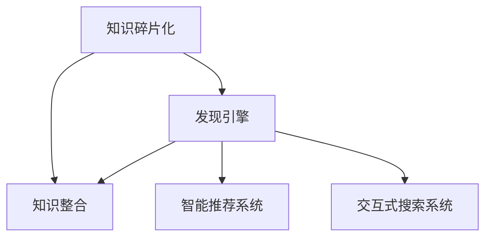
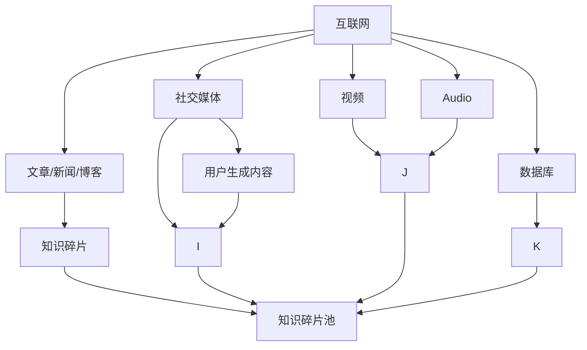
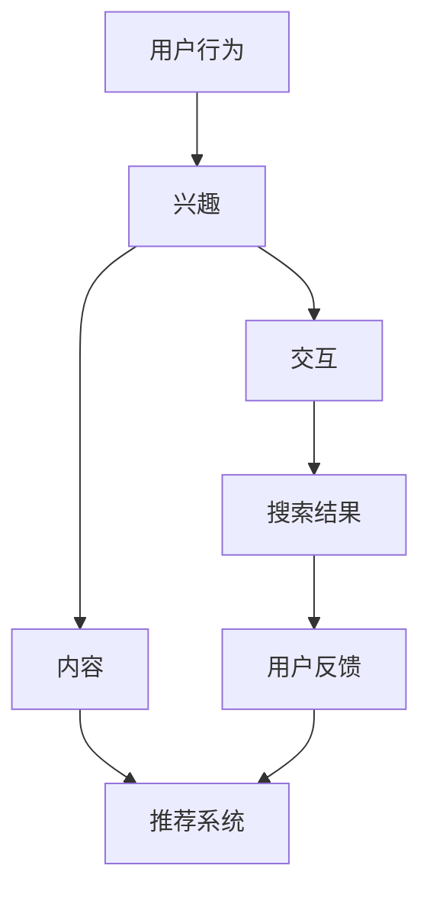
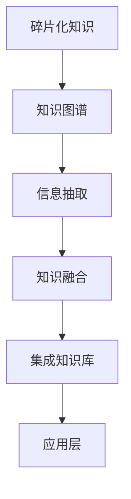
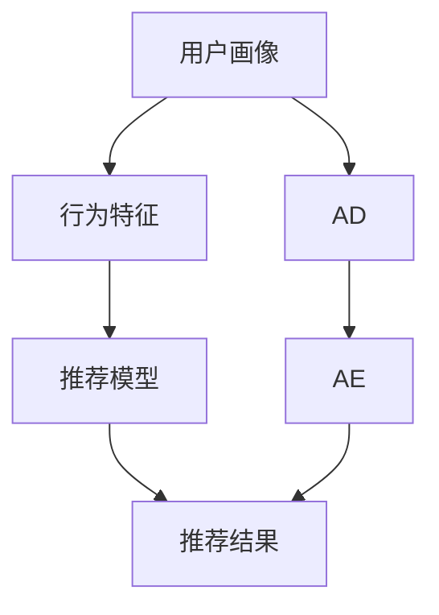
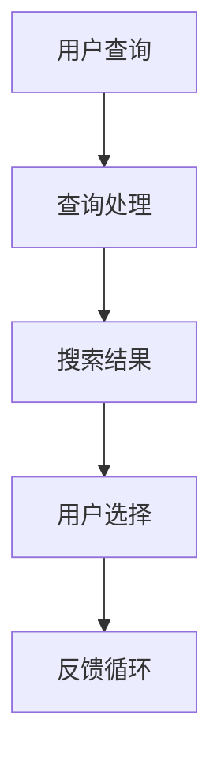

                 

# 知识的碎片化与整合：发现引擎的挑战与机遇

## 1. 背景介绍

在信息爆炸的今天，我们每天接触的数据和信息远远超过以往任何时代。这些数据和信息，无论是来自传统媒体还是互联网，都是知识碎片化的一种体现。发现引擎（Discovery Engine）作为一种帮助用户从大量信息中快速发现并整合有用知识的工具，正面临着前所未有的挑战。同时，它们也拥有着巨大的发展机遇。本文将探讨发现引擎所面临的核心问题，并提出解决方案，以期提升其对知识碎片化信息的整合能力。

## 2. 核心概念与联系

### 2.1 核心概念概述

为了理解发现引擎，首先需要明确几个核心概念：

- **知识碎片化(Fragmentation)**：指知识被分割成零碎的小块，无法直接被获取和应用。这种现象在互联网信息中尤为普遍，导致用户需要花费大量时间和精力来筛选和整合有用信息。

- **发现引擎(Discovery Engine)**：一种旨在帮助用户从大量数据中快速找到有用信息的工具或技术。它能够通过分析用户的行为、兴趣等，主动推荐相关的信息。

- **知识整合(Integration)**：将零散的知识碎片整合为一个有机的整体，使其能够被更高效地利用。发现引擎的核心任务之一就是实现知识的整合。

- **智能推荐系统(Intelligent Recommendation Systems)**：一种基于用户行为、兴趣等信息推荐有用内容的技术，与发现引擎密切相关。

- **交互式搜索系统(Interactive Search Systems)**：用户可以通过交互方式，逐步缩小搜索范围，找到所需信息。

这些概念之间的关系可以通过以下Mermaid流程图表示：



这个流程图展示了知识碎片化如何通过发现引擎整合为有用信息，并进一步通过智能推荐和交互式搜索为最终用户服务。

### 2.2 核心概念原理和架构的 Mermaid 流程图

#### A. 知识碎片化


#### B. 发现引擎


#### C. 知识整合


#### D. 智能推荐系统


#### E. 交互式搜索系统


通过这些流程图的直观展示，我们能够更清晰地理解知识碎片化、发现引擎、知识整合、智能推荐系统以及交互式搜索系统之间的关系和交互方式。

## 3. 核心算法原理 & 具体操作步骤

### 3.1 算法原理概述

发现引擎的核心算法包括自然语言处理(NLP)、机器学习(ML)、信息检索(IR)等。这些算法在处理大规模数据集时，需要高效地进行信息抽取、实体识别、关系抽取、语义分析和知识整合等步骤。

#### 3.1.1 自然语言处理(NLP)
自然语言处理是发现引擎的基础，通过语言模型、词向量、依存句法分析、情感分析等技术，发现引擎能够更好地理解用户的查询意图，提供更准确的搜索结果。

#### 3.1.2 机器学习(ML)
机器学习算法，如分类、回归、聚类等，用于构建推荐模型，预测用户行为，优化搜索结果。

#### 3.1.3 信息检索(IR)
信息检索算法用于快速检索和排序相关文档，提供高效的信息访问途径。

### 3.2 算法步骤详解

#### 3.2.1 用户行为分析
- **收集数据**：从用户的操作记录中，收集用户的行为数据，如浏览时间、点击频率、搜索关键词等。
- **行为建模**：使用机器学习算法，将用户行为数据建模为用户画像，预测用户兴趣。

#### 3.2.2 内容分析和推荐
- **内容预处理**：将原始内容转换为结构化数据，如提取关键词、摘要等。
- **特征提取**：从处理后的内容中，提取用户可能感兴趣的关键特征。
- **推荐模型构建**：基于用户的画像和内容特征，使用ML算法构建推荐模型，预测用户可能喜欢的内容。
- **结果排序**：根据预测结果，对内容进行排序，推荐给用户。

#### 3.2.3 交互式搜索
- **查询解析**：解析用户的查询语句，理解用户的查询意图。
- **搜索扩展**：根据查询结果，通过语义分析和扩展，提供更多相关的搜索结果。
- **用户反馈**：收集用户的反馈，不断优化搜索结果和推荐算法。

### 3.3 算法优缺点

#### 3.3.1 优点
- **高效性**：能够快速处理大量数据，提供实时搜索结果和推荐。
- **个性化**：根据用户行为和兴趣，提供个性化的搜索结果和推荐。
- **交互性**：通过交互式搜索，用户可以逐步缩小搜索范围，找到最相关的信息。

#### 3.3.2 缺点
- **数据依赖**：发现引擎的效果很大程度上依赖于数据的质量和多样性。
- **推荐算法复杂性**：推荐算法需要处理多种数据源和特征，算法复杂度高。
- **信息过载**：在处理海量信息时，容易陷入信息过载的困境。

### 3.4 算法应用领域

#### 3.4.1 内容推荐
- 基于用户的历史行为和兴趣，推荐相关文章、视频、音乐等。
- 应用于电商、新闻、娱乐等领域，提升用户体验。

#### 3.4.2 信息检索
- 通过用户的查询，提供相关的搜索结果，帮助用户快速获取信息。
- 应用于搜索引擎、图书馆、企业信息管理系统等。

#### 3.4.3 智能客服
- 通过分析用户查询，自动回答用户问题，提高客服效率。
- 应用于在线客服、智能助手等场景。

#### 3.4.4 新闻推荐
- 根据用户的行为和兴趣，推荐相关的新闻内容。
- 应用于新闻聚合、社交媒体等。

## 4. 数学模型和公式 & 详细讲解

### 4.1 数学模型构建

发现引擎的核心数学模型包括向量空间模型(Vector Space Model, VSM)、隐式语义索引(Latent Semantic Indexing, LSI)、逻辑回归(Logistic Regression)、协同过滤(Collaborative Filtering)等。这些模型在处理大规模数据集时，能够提供有效的解决方案。

#### 4.1.1 向量空间模型
向量空间模型将文本表示为向量，计算文本之间的相似度。形式化表示为：
$$ \mathbf{x} = \sum_{i=1}^n x_i \mathbf{v}_i $$
其中，$\mathbf{x}$ 为文本向量，$x_i$ 为文本中的词语频率，$\mathbf{v}_i$ 为词语向量。

#### 4.1.2 隐式语义索引
隐式语义索引通过对文本进行降维，将高维文本数据映射到低维空间，用于文本相似度计算。数学表达式为：
$$ \mathbf{U} \mathbf{v} = \mathbf{L} $$
其中，$\mathbf{U}$ 为语义矩阵，$\mathbf{v}$ 为文本向量，$\mathbf{L}$ 为降维后的文本向量。

#### 4.1.3 逻辑回归
逻辑回归用于分类任务，预测用户的行为，如点击、购买等。数学公式为：
$$ P(y|x) = \frac{1}{1 + e^{-\mathbf{w} \cdot \mathbf{x} + b}} $$
其中，$P(y|x)$ 为预测概率，$\mathbf{w}$ 为权重向量，$b$ 为偏置项。

#### 4.1.4 协同过滤
协同过滤算法用于推荐系统，通过用户行为数据，预测用户对未见内容的偏好。数学公式为：
$$ \mathbf{R} = \mathbf{U} \mathbf{V}^T $$
其中，$\mathbf{R}$ 为用户-内容评分矩阵，$\mathbf{U}$ 为用户特征矩阵，$\mathbf{V}$ 为内容特征矩阵。

### 4.2 公式推导过程

#### 4.2.1 向量空间模型
向量空间模型的核心是文本向量的表示和相似度计算。假设文本 $d_1$ 和 $d_2$ 包含相同的词语，且频率分别为 $f_1$ 和 $f_2$。则两个文本向量分别为：
$$ \mathbf{v}_1 = \langle f_1, 0, \ldots, 0 \rangle $$
$$ \mathbf{v}_2 = \langle f_2, 0, \ldots, 0 \rangle $$
文本 $d_1$ 和 $d_2$ 的相似度可以通过它们的向量内积表示：
$$ \mathbf{x}_1 \cdot \mathbf{x}_2 = (\sum_{i=1}^n f_{1,i}v_{1,i}) \times (\sum_{i=1}^n f_{2,i}v_{2,i}) $$

#### 4.2.2 隐式语义索引
隐式语义索引的数学推导基于奇异值分解(SVD)，假设文本矩阵 $\mathbf{X}$ 通过 SVD 分解为 $\mathbf{U} \mathbf{\Sigma} \mathbf{V}^T$。则文本向量 $\mathbf{v}$ 可以通过 $\mathbf{U}$ 和 $\mathbf{\Sigma}$ 计算得到：
$$ \mathbf{v} = \mathbf{U} \mathbf{\Sigma} \mathbf{L} $$

#### 4.2.3 逻辑回归
逻辑回归的推导基于最大似然估计，假设训练数据集中有 $N$ 个样本，每个样本的特征向量为 $\mathbf{x}_i$，标签为 $y_i \in \{0,1\}$。则最大似然估计的损失函数为：
$$ L(\mathbf{w}, b) = -\frac{1}{N} \sum_{i=1}^N [y_i \log P(y_i|\mathbf{x}_i) + (1-y_i) \log P(1-y_i|\mathbf{x}_i)] $$
其中，$P(y_i|\mathbf{x}_i)$ 为预测概率，$\mathbf{w}$ 为权重向量，$b$ 为偏置项。

#### 4.2.4 协同过滤
协同过滤的数学推导基于矩阵分解，假设用户-内容评分矩阵 $\mathbf{R}$ 分解为 $\mathbf{U} \mathbf{V}^T$。则用户 $u$ 对内容 $i$ 的评分可以通过 $\mathbf{U}$ 和 $\mathbf{V}$ 计算得到：
$$ r_{ui} = \sum_{j=1}^m u_{uj} v_{ij} $$

### 4.3 案例分析与讲解

#### 4.3.1 内容推荐系统
假设一个电商网站希望推荐用户可能喜欢的商品。用户的历史行为数据被收集并建模为用户画像。内容特征被提取，如商品名称、描述、用户评价等。通过逻辑回归模型，预测用户对未见商品的评分。最后，根据评分对商品进行排序，推荐给用户。

#### 4.3.2 信息检索系统
假设一个新闻聚合平台希望根据用户的搜索历史，推荐相关的文章。用户的历史查询被收集并建模为查询向量。每篇文章被提取关键词，并映射为向量。通过向量空间模型计算查询向量与文章向量的相似度，推荐最相关的文章。

## 5. 项目实践：代码实例和详细解释说明

### 5.1 开发环境搭建

发现引擎的开发环境搭建相对复杂，需要考虑多种技术和工具的集成。以下是一个基本的开发环境搭建步骤：

1. **安装Python**：从官网下载并安装Python，建议使用3.8或更高版本。

2. **安装相关库**：
   - **NLTK**：自然语言处理库，用于文本预处理和分析。
   - **Scikit-learn**：机器学习库，用于构建推荐模型。
   - **TensorFlow**：深度学习框架，用于构建协同过滤模型。
   - **Elasticsearch**：搜索引擎，用于信息检索。

3. **安装数据库**：如MySQL、PostgreSQL等，用于存储用户行为数据和内容数据。

4. **安装数据集**：如Amazon商品数据集、新闻文章数据集等。

5. **安装Web框架**：如Flask、Django等，用于构建Web应用。

完成上述步骤后，即可开始发现引擎的开发。

### 5.2 源代码详细实现

以下是一个简单的发现引擎代码示例，用于推荐系统。

#### 5.2.1 用户画像构建

```python
from sklearn.feature_extraction.text import TfidfVectorizer
from sklearn.linear_model import LogisticRegression

# 构建用户画像
user_profiles = {}
for user_id, behaviors in user_data.items():
    # 将用户行为转化为特征向量
    vectorizer = TfidfVectorizer()
    features = vectorizer.fit_transform(behaviors)
    # 训练逻辑回归模型
    clf = LogisticRegression()
    clf.fit(features, labels)
    # 存储用户画像
    user_profiles[user_id] = clf.coef_.T

```

#### 5.2.2 内容特征提取

```python
from sklearn.feature_extraction.text import TfidfVectorizer

# 提取内容特征
content_features = {}
for content_id, content in content_data.items():
    # 将内容转化为特征向量
    vectorizer = TfidfVectorizer()
    features = vectorizer.fit_transform([content])
    # 存储内容特征
    content_features[content_id] = features.toarray()[0]
```

#### 5.2.3 推荐模型构建

```python
from sklearn.linear_model import LogisticRegression

# 构建推荐模型
recommender = LogisticRegression()
recommender.fit(user_profiles, content_features)
```

#### 5.2.4 推荐结果生成

```python
def recommend(user_id, top_n=10):
    # 预测用户可能喜欢的内容
    predictions = recommender.predict_proba(user_profiles[user_id])
    # 对内容进行排序
    recommendations = [(content_id, score) for content_id, score in zip(content_features.keys(), predictions[0])]
    # 返回推荐结果
    return sorted(recommendations, key=lambda x: x[1], reverse=True)[:top_n]
```

#### 5.2.5 运行结果展示

```python
# 用户ID
user_id = "123456"
# 生成推荐结果
recommendations = recommend(user_id)
# 输出推荐结果
print("推荐内容：")
for content_id, score in recommendations:
    print(f"ID: {content_id}, 评分：{score}")
```

通过上述代码，我们实现了基于用户画像和内容特征的推荐系统。用户的行为数据被转化为特征向量，用于训练逻辑回归模型。模型预测用户对内容的评分，并根据评分对内容进行排序，生成推荐结果。

### 5.3 代码解读与分析

上述代码主要涉及用户画像构建、内容特征提取、推荐模型构建和推荐结果生成四个步骤。每一步都依赖于机器学习算法和数据处理技术，展示了发现引擎的核心流程。

#### 5.3.1 用户画像构建

用户画像的构建是发现引擎的重要步骤，通过分析用户的历史行为数据，生成用户画像，用于预测用户对新内容的兴趣。在此过程中，我们使用了TF-IDF向量化技术和逻辑回归算法，将用户行为数据转化为特征向量，并训练逻辑回归模型，预测用户对新内容的评分。

#### 5.3.2 内容特征提取

内容特征的提取是将原始文本转化为结构化数据的过程，用于计算文本之间的相似度。在此过程中，我们使用了TF-IDF向量化技术，将内容数据转化为特征向量。这些特征向量可以用于计算文本之间的相似度，用于信息检索和推荐。

#### 5.3.3 推荐模型构建

推荐模型的构建是发现引擎的核心任务，通过分析用户画像和内容特征，预测用户对新内容的评分。在此过程中，我们使用了逻辑回归算法，将用户画像和内容特征转化为评分预测模型。

#### 5.3.4 推荐结果生成

推荐结果的生成是将模型预测结果转化为可视化的推荐列表。在此过程中，我们根据用户画像和内容特征的评分，生成推荐列表，展示给用户。

## 6. 实际应用场景

### 6.4 未来应用展望

发现引擎的未来应用前景广阔，预计将在以下几个领域取得突破：

#### 6.4.1 个性化推荐
随着用户数据量的不断增加，发现引擎能够更准确地预测用户对新内容的兴趣，实现更加个性化的推荐。

#### 6.4.2 智能客服
通过分析用户查询意图，发现引擎能够自动回答用户问题，提高客服效率。

#### 6.4.3 信息检索
随着信息量的不断增加，发现引擎能够更高效地检索相关信息，提升信息获取效率。

#### 6.4.4 医疗诊断
通过分析患者的医疗记录和症状描述，发现引擎能够提供初步诊断建议，辅助医生诊断。

#### 6.4.5 金融风控
通过分析用户的交易行为和信用记录，发现引擎能够评估用户的信用风险，辅助金融机构做出决策。

## 7. 工具和资源推荐

### 7.1 学习资源推荐

为了帮助开发者系统掌握发现引擎的理论基础和实践技巧，这里推荐一些优质的学习资源：

1. **《信息检索与数据挖掘》课程**：斯坦福大学开设的高级课程，涵盖信息检索的原理、技术和应用，适合深入学习。

2. **《推荐系统：算法与实现》书籍**：全面介绍推荐系统的理论、算法和实践，适合入门学习。

3. **Kaggle竞赛**：Kaggle平台上举办的推荐系统和信息检索竞赛，通过实际项目练习，提升实战能力。

4. **ACL、SIGIR会议论文**：顶级会议上的最新研究成果，有助于了解领域前沿。

5. **Coursera课程**：提供广泛的在线课程，涵盖信息检索、推荐系统等多个方面，适合自学。

### 7.2 开发工具推荐

发现引擎的开发需要多种工具的集成，以下推荐一些常用的工具：

1. **NLTK**：自然语言处理库，用于文本预处理和分析。

2. **Scikit-learn**：机器学习库，用于构建推荐模型。

3. **TensorFlow**：深度学习框架，用于构建协同过滤模型。

4. **Elasticsearch**：搜索引擎，用于信息检索。

5. **Flask/Django**：Web框架，用于构建Web应用。

6. **PyTorch**：深度学习框架，用于构建更复杂的推荐系统。

### 7.3 相关论文推荐

发现引擎的研究源于学界的持续探索，以下是几篇奠基性的相关论文，推荐阅读：

1. **《隐式语义索引的数学基础》**：提出了隐式语义索引的数学模型，广泛应用于信息检索和推荐系统。

2. **《协同过滤推荐系统》**：介绍了协同过滤算法的原理和实现，是推荐系统的经典方法。

3. **《基于深度学习的推荐系统》**：讨论了深度学习在推荐系统中的应用，提供了新的推荐思路。

4. **《信息检索：技术与应用》**：全面介绍了信息检索的技术和应用，适合入门学习。

5. **《基于自然语言处理的推荐系统》**：探讨了自然语言处理在推荐系统中的应用，提供了新的研究方向。

通过这些资源的学习实践，相信你一定能够快速掌握发现引擎的理论基础和实践技巧，并用于解决实际的NLP问题。

## 8. 总结：未来发展趋势与挑战

### 8.1 研究成果总结

本文对发现引擎的核心算法和操作步骤进行了详细讲解，探讨了其在实际应用中的挑战和机遇。发现引擎在个性化推荐、智能客服、信息检索等方面具有广泛的应用前景，但同时也面临着数据依赖、算法复杂性和信息过载等挑战。未来，发现引擎需要结合最新研究成果，不断优化算法和提升系统性能，才能更好地服务用户。

### 8.2 未来发展趋势

#### 8.2.1 深度学习的应用
随着深度学习技术的发展，发现引擎将逐步引入深度学习模型，提升推荐和检索的精度和效果。

#### 8.2.2 多模态数据的融合
未来，发现引擎将结合视觉、语音、文本等多种模态数据，实现更加全面、准确的信息整合。

#### 8.2.3 跨领域应用的拓展
发现引擎将在更多领域，如医疗、金融、教育等，拓展应用，提升系统的通用性。

#### 8.2.4 自适应推荐算法
通过用户行为反馈，发现引擎将实现自适应推荐，不断优化推荐结果。

#### 8.2.5 实时性和个性化推荐
未来，发现引擎将实现实时推荐，提供更加个性化的用户体验。

### 8.3 面临的挑战

#### 8.3.1 数据质量和多样性
发现引擎的效果很大程度上依赖于数据的质量和多样性。如何获取高质量、多样化的数据，是一个重要的挑战。

#### 8.3.2 算法复杂度
推荐和检索算法需要处理多种数据源和特征，算法复杂度高。如何优化算法，提升计算效率，是一个重要的研究方向。

#### 8.3.3 信息过载
在处理海量信息时，容易陷入信息过载的困境。如何筛选和过滤无用信息，提升信息获取效率，是一个重要的挑战。

#### 8.3.4 可解释性
发现引擎的推荐结果需要具备可解释性，以便用户理解和信任。如何增强系统的可解释性，是一个重要的研究方向。

#### 8.3.5 隐私和安全
用户数据的安全和隐私保护是一个重要的挑战。如何设计安全的推荐系统，保护用户隐私，是一个重要的研究方向。

### 8.4 研究展望

面对发现引擎所面临的挑战，未来的研究需要在以下几个方面寻求新的突破：

#### 8.4.1 基于深度学习的推荐算法
引入深度学习模型，提升推荐系统的精度和效果。

#### 8.4.2 多模态数据的融合
结合视觉、语音、文本等多种模态数据，实现更加全面、准确的信息整合。

#### 8.4.3 自适应推荐算法
通过用户行为反馈，实现自适应推荐，不断优化推荐结果。

#### 8.4.4 实时性和个性化推荐
实现实时推荐，提供更加个性化的用户体验。

#### 8.4.5 可解释性和隐私保护
增强系统的可解释性，保护用户隐私，确保系统的可信度和安全性。

这些研究方向将推动发现引擎技术的不断进步，使其在更广泛的场景中发挥作用。

## 9. 附录：常见问题与解答

**Q1：发现引擎如何处理信息过载？**

A: 信息过载是发现引擎面临的主要挑战之一。解决信息过载问题需要多方面的努力：

1. **数据筛选**：通过关键词、类别等筛选信息，去除无用数据。

2. **用户反馈**：根据用户反馈，不断优化推荐模型，去除不相关的内容。

3. **多模态数据融合**：结合视觉、语音、文本等多种模态数据，提升信息的准确性和完整性。

4. **自适应算法**：根据用户行为和兴趣，动态调整推荐策略，提高推荐效果。

**Q2：发现引擎如何提升推荐精度？**

A: 提升推荐精度是发现引擎的关键任务之一。以下是一些有效的方法：

1. **深度学习**：引入深度学习模型，如神经网络、深度学习等，提升推荐系统的精度。

2. **多模态数据融合**：结合视觉、语音、文本等多种模态数据，提升推荐的全面性和准确性。

3. **协同过滤**：通过用户行为数据，构建协同过滤推荐模型，提升推荐效果。

4. **信息检索**：结合信息检索技术，提高推荐的相关性和覆盖率。

5. **用户画像构建**：通过用户行为数据，构建用户画像，提升推荐系统的个性化能力。

**Q3：发现引擎如何保护用户隐私？**

A: 保护用户隐私是发现引擎面临的重要挑战之一。以下是一些有效的方法：

1. **数据匿名化**：对用户数据进行匿名化处理，保护用户隐私。

2. **访问控制**：严格控制数据访问权限，防止数据泄露。

3. **差分隐私**：引入差分隐私技术，保护用户数据隐私。

4. **联邦学习**：在本地设备上训练模型，不将数据上传到服务器，保护用户隐私。

通过这些方法，发现引擎可以有效地保护用户隐私，提升系统的可信度和安全性。

---

作者：禅与计算机程序设计艺术 / Zen and the Art of Computer Programming

