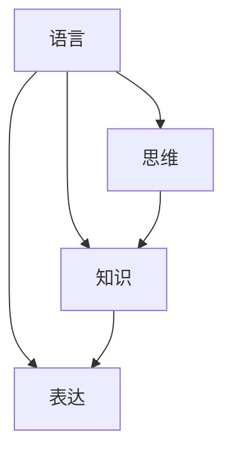

                 

# 知识的语言学基础：思维与表达的关系

## 1. 背景介绍

在人类文明的漫长演进中，语言始终扮演着至关重要的角色。作为沟通和表达的载体，语言不仅承载了丰富的文化历史信息，还是人类思维和知识的重要媒介。语言学的研究，旨在探究语言的本质、发展和应用，理解语言与思维、知识的关系，揭示语言在人类认知和交流中的深层机制。

本文明将深入探讨知识的语言学基础，从思维与表达的辩证关系出发，阐述语言在知识传播、理解与创造中的核心作用，为语言学和人工智能领域的研究提供新的视角和方向。

## 2. 核心概念与联系

### 2.1 核心概念概述

为理解语言与知识的关系，我们需明确以下核心概念：

- **语言(Language)**：人类用于交流的符号系统，包括词汇、语法、句法等。语言不仅用于日常对话，还是思维、知识表达的工具。

- **知识(Knowledge)**：人类对世界现象的认知和理解，通过观察、实验、推理等方式获得。知识是对自然和社会规律的总结，是人类智慧的结晶。

- **思维(Thought)**：人类大脑对信息进行加工、推理和决策的过程，是知识创造和应用的基础。

- **表达(Representation)**：将思维转化为语言符号的过程，通过词语、句子等表达思维内容。

这些概念之间相互联系、相互影响。语言不仅是思维的工具，也是知识的表达媒介；知识通过语言传递，思维通过语言体现。

### 2.2 核心概念原理和架构的 Mermaid 流程图



这个流程图展示了语言、知识、思维和表达之间的内在联系：

1. 语言是知识的载体，用于传递和积累知识。
2. 思维是知识的生成源泉，通过思考获得新的知识。
3. 表达是思维的输出形式，将思维内容转化为语言符号。
4. 语言和表达互为因果，表达依赖于语言规则，语言则通过表达呈现思维内容。

### 2.3 语言与思维、知识的互动关系

语言与思维、知识的关系是互动的。语言的形成和发展，深刻影响着思维和知识的形式和结构。同时，思维和知识的发展，又不断推动着语言的创新和演化。

- **语言促进思维**：通过词语、句子等符号，语言为思维提供了表达的工具。使用语言，人类能够更系统、更深入地思考问题，形成更复杂的概念和理论。
- **思维影响语言**：人类思维的复杂性不断提升，促使语言系统发展出新的词汇、语法结构，以适应新的思维需求。
- **知识丰富语言**：语言中蕴含着丰富的知识信息，人类通过语言积累和传递知识，使语言系统更为丰富和多样化。
- **语言传播知识**：语言是知识传播的重要工具，通过语言交流，知识得以跨越时间和空间的限制，广泛传播和应用。

## 3. 核心算法原理 & 具体操作步骤

### 3.1 算法原理概述

知识的语言学基础，可以通过语言学理论和技术手段来分析和理解。本节将介绍两种核心算法原理，分别基于语言学和认知科学。

1. **基于语言学的知识表达和推理**：通过语言学中的形式语义学、语用学等理论，分析语言的语义结构和语用规则，推导出知识的表达和推理形式。

2. **基于认知科学的知识表征和获取**：利用认知科学中的模型理论，通过知识表征和获取技术，将人类思维中的知识转化为语言表达形式，实现知识的自动获取和应用。

### 3.2 算法步骤详解

#### 3.2.1 基于语言学的知识表达和推理

**步骤一：语言符号化**  
将人类思维内容转化为语言符号，通过词汇、语法、句法等形式表达。

**步骤二：语义分析**  
通过语言学理论，分析语言符号的意义和关系，构建形式语义模型，将语言表达转换为逻辑表达式。

**步骤三：推理计算**  
利用逻辑代数等数学工具，对逻辑表达式进行推理计算，得出结论。

**步骤四：结果表达**  
将推理结果转换为语言表达，形成回答或结论。

#### 3.2.2 基于认知科学的知识表征和获取

**步骤一：知识表征**  
将人类思维中的知识转化为符号和结构化数据，如知识图谱、语义网络等形式。

**步骤二：知识获取**  
利用认知科学中的知识获取技术，通过机器学习、逻辑推理等方式，从数据中自动提取和构建知识模型。

**步骤三：知识表达**  
将知识模型转换为自然语言表达，形成回答或结论。

**步骤四：结果验证**  
对表达结果进行验证和修正，确保准确性。

### 3.3 算法优缺点

#### 3.3.1 基于语言学的知识表达和推理

**优点**：  
1. 语言学理论丰富，有完善的符号学、语义学等基础。
2. 推理过程严谨，结果可靠。

**缺点**：  
1. 过于依赖语言形式，对语言背后的思维过程分析不足。
2. 难以处理复杂和抽象的思维内容。

#### 3.3.2 基于认知科学的知识表征和获取

**优点**：  
1. 强调知识的内在结构和关系，更加符合思维本质。
2. 可以处理复杂和抽象的思维内容。

**缺点**：  
1. 技术复杂，对数据和模型的依赖较高。
2. 推理过程复杂，需要较强的计算资源。

### 3.4 算法应用领域

基于语言学和认知科学的知识表达和推理方法，在多个领域得到了广泛应用：

- **人工智能与机器学习**：用于构建知识驱动的模型和算法，提高机器学习的准确性和泛化能力。
- **自然语言处理(NLP)**：用于语言理解、生成、翻译等任务，实现人机交互。
- **知识工程**：用于知识表示、获取、推理和管理，支持专家系统、知识图谱等应用。
- **认知科学**：用于研究人类思维和认知过程，揭示语言与思维的深层关系。

## 4. 数学模型和公式 & 详细讲解 & 举例说明

### 4.1 数学模型构建

我们将基于认知科学的知识表征和获取方法，构建一个简单的数学模型，用于知识表达和推理。

**知识图谱(Knowledge Graph)**：  
知识图谱是一种结构化的知识表示形式，由节点和边组成。节点表示实体和属性，边表示实体之间的关系。

**数学表示**：  
$$
G=(V, E, R)
$$

其中：
- $V$ 表示节点集合，每个节点 $v_i$ 表示一个实体或属性。
- $E$ 表示边集合，每条边 $e_{ij}$ 表示实体 $v_i$ 和 $v_j$ 之间的关系。
- $R$ 表示关系集合，每种关系对应一种语义解释。

### 4.2 公式推导过程

**知识推理**：  
知识推理是利用已知知识进行推断的过程。对于知识图谱中的节点 $v_i$，其推理过程可以表示为：

$$
v_i \Rightarrow v_j \Leftrightarrow e_{ij} \in E
$$

表示节点 $v_i$ 通过边 $e_{ij}$ 与节点 $v_j$ 相关联。

**推理算法**：  
假设已知节点 $v_i$ 与 $v_j$ 之间存在关系 $r_k$，推理公式为：

$$
v_i \Rightarrow v_j \Leftrightarrow e_{ij} \in E \land r_k \in R
$$

推理过程为：
1. 查找节点 $v_i$ 的所有邻居节点。
2. 判断邻居节点 $v_j$ 是否与 $v_i$ 存在关系 $r_k$。
3. 如果存在关系 $r_k$，则推理成功；否则，继续查找。

### 4.3 案例分析与讲解

**案例一：推理名人关系**  
假设有一个知识图谱，包含人物、作品和关系等节点。已知某名人 $v_i$ 写了一部作品，其作者是 $v_j$。推理该作品的其他作者关系。

**推理过程**：  
1. 查找 $v_i$ 的邻居节点，找到作品节点 $v_j$。
2. 查找 $v_j$ 的邻居节点，找到所有其他作者节点 $v_k$。
3. 判断节点 $v_k$ 是否与 $v_i$ 存在“作者”关系 $r_{作者}$。
4. 如果存在，则推理成功；否则，继续查找。

**案例二：推理自然定律**  
假设有一个知识图谱，包含自然现象和自然定律等节点。已知某自然现象 $v_i$ 由某自然定律 $v_j$ 解释。推理该自然定律的适用范围。

**推理过程**：  
1. 查找 $v_i$ 的邻居节点，找到自然定律节点 $v_j$。
2. 查找 $v_j$ 的邻居节点，找到所有自然现象节点 $v_k$。
3. 判断节点 $v_k$ 是否与 $v_i$ 存在关系 $r_{解释}$。
4. 如果存在，则推理成功；否则，继续查找。

## 5. 项目实践：代码实例和详细解释说明

### 5.1 开发环境搭建

为了实践基于知识图谱的知识推理，我们需要搭建Python开发环境，并安装相关库。

**环境搭建**：
1. 安装Anaconda：从官网下载并安装Anaconda，用于创建独立的Python环境。
2. 创建并激活虚拟环境：
```bash
conda create -n kg-env python=3.8 
conda activate kg-env
```

3. 安装PyTorch、NetworkX等库：
```bash
conda install torch torchvision torchaudio networkx
```

4. 安装SpaCy库，用于自然语言处理：
```bash
pip install spacy
```

### 5.2 源代码详细实现

**知识图谱构建**：  
定义知识图谱的节点和关系，构建知识图谱。

```python
import networkx as nx

# 定义节点和关系
v1 = nx.Graph()
v1.add_node('爱因斯坦', 'Einstein', ['物理学家', '科学家'])
v1.add_node('相对论', 'Relativity', ['物理理论'])
v1.add_edge('爱因斯坦', '相对论', '提出')

v1.add_node('黑洞', 'BlackHole', ['天文现象'])
v1.add_edge('相对论', '黑洞', '解释')

# 打印知识图谱
print(v1.nodes(data=True))
print(v1.edges())
```

**知识推理**：  
在知识图谱中查找节点关系，进行推理。

```python
import spacy

# 初始化SpaCy
nlp = spacy.load('en_core_web_sm')

# 定义节点
doc = nlp('Einstein提出了相对论')
name = doc[0].text
theory = doc[2].text

# 查找节点
node_name = v1.nodes[name]['name']
node_theory = v1.nodes[theory]['name']

# 查找关系
relation = v1[(node_name, node_theory)]

# 输出推理结果
print(node_name, relation, node_theory)
```

### 5.3 代码解读与分析

**知识图谱构建**：  
代码中使用了NetworkX库来构建知识图谱。定义了节点和关系，并使用add_node和add_edge方法添加了节点和关系。

**知识推理**：  
代码中使用了SpaCy库进行自然语言处理。首先通过nlp()函数将输入的文本转换为文档对象。然后从文档中提取实体和关系，使用知识图谱中的节点和关系进行推理。

### 5.4 运行结果展示

通过上述代码，我们可以构建一个简单的知识图谱，并实现基本的知识推理。例如，对于“爱因斯坦提出了相对论”，可以推理出“爱因斯坦”是“相对论”的提出者，“相对论”可以解释“黑洞”等关系。

## 6. 实际应用场景

### 6.1 智能问答系统

智能问答系统是知识表达和推理的重要应用场景。系统通过构建知识图谱，将用户的查询转换为自然语言处理任务，自动从知识图谱中获取和推理答案。

**实现方式**：  
1. 收集领域知识，构建知识图谱。
2. 输入用户查询，进行自然语言处理。
3. 在知识图谱中查找节点和关系，进行推理。
4. 将推理结果转换为自然语言，形成回答。

**应用实例**：  
亚马逊Alexa、谷歌Assistant等智能问答系统，通过构建大规模的知识图谱，能够快速响应各类问题，提供准确的回答。

### 6.2 自动摘要生成

自动摘要生成是知识表达和推理的另一个重要应用。系统通过分析和推理文本内容，自动生成摘要，用于快速浏览和理解长文本。

**实现方式**：  
1. 输入文本，进行自然语言处理。
2. 在知识图谱中查找主题和相关关系。
3. 根据摘要要求，选择重要节点和关系，进行推理。
4. 将推理结果转换为自然语言，形成摘要。

**应用实例**：  
谷歌新闻、BBC新闻等自动摘要系统，能够自动提取文本中的关键信息，生成简洁明了的摘要。

### 6.3 文本情感分析

文本情感分析是情感表达和推理的应用。系统通过分析和推理文本中的情感信息，判断文本的情感倾向。

**实现方式**：  
1. 输入文本，进行自然语言处理。
2. 在知识图谱中查找情感节点和关系。
3. 根据情感信息，进行推理。
4. 将推理结果转换为情感标签。

**应用实例**：  
情感分析工具如IBM Watson、情感分析API等，能够自动分析用户评论、社交媒体内容，判断情感倾向。

### 6.4 未来应用展望

基于知识图谱和认知科学的语言学基础，未来的应用场景将更加广阔。例如：

- **多模态知识融合**：将文本、图像、音频等多模态信息进行融合，构建更加全面的知识图谱，用于更深入的知识推理和表达。
- **分布式知识推理**：利用分布式计算技术，进行大规模的知识推理和查询，提高系统的响应速度和处理能力。
- **自然语言生成**：利用知识图谱和语言生成技术，自动生成自然语言文本，用于智能对话、文本创作等任务。

## 7. 工具和资源推荐

### 7.1 学习资源推荐

为了深入学习知识表达和推理的相关知识，推荐以下学习资源：

1. **《知识工程与语义网》**：由巴塞尔大学信息学院教授编写，系统介绍了知识工程和语义网的基本概念和应用。
2. **《自然语言处理综论》**：斯坦福大学自然语言处理课程，涵盖语言学、认知科学等多个方面。
3. **《认知计算基础》**：麻省理工学院出版社，系统介绍了认知科学和计算语言学的基础知识。
4. **Kaggle竞赛**：参加知识图谱构建和推理的Kaggle竞赛，积累实践经验。

### 7.2 开发工具推荐

在知识表达和推理的实践中，推荐使用以下开发工具：

1. **PyTorch**：基于Python的深度学习框架，支持分布式计算和动态图。
2. **NetworkX**：Python网络分析库，支持构建、查询和分析网络图。
3. **SpaCy**：自然语言处理库，支持实体识别、词性标注等功能。
4. **Gurobi/CPLEX**：优化问题求解器，用于解决复杂的知识推理问题。

### 7.3 相关论文推荐

为了深入理解知识表达和推理的理论和方法，推荐以下相关论文：

1. **《知识图谱：语义网络和语义搜索》**：由斯坦福大学计算机科学系教授编写，系统介绍了知识图谱的基本概念和应用。
2. **《基于知识图谱的推荐系统》**：国际会议ACL 2017，介绍了利用知识图谱进行推荐系统的技术。
3. **《基于认知计算的知识获取和推理》**：期刊IEEE Transactions on Systems, Man, and Cybernetics, Part C: Applications and Reviews，介绍了认知计算在知识获取和推理中的应用。

## 8. 总结：未来发展趋势与挑战

### 8.1 研究成果总结

基于语言学和认知科学的知识表达和推理，已经在自然语言处理、知识工程等领域得到了广泛应用。未来的研究将在以下几个方面继续深入：

1. **知识图谱的构建和优化**：构建更全面、更准确的知识图谱，提高知识推理的准确性和效率。
2. **知识获取和推理技术**：开发更高效的算法和模型，提高知识推理的自动化和智能化水平。
3. **知识表达和生成技术**：发展更自然的知识表达和生成方法，提高人机交互的流畅性和智能性。

### 8.2 未来发展趋势

未来，基于语言学和认知科学的知识表达和推理方法将进一步发展，呈现出以下几个趋势：

1. **多模态知识融合**：将文本、图像、音频等多模态信息进行融合，构建更加全面的知识图谱，用于更深入的知识推理和表达。
2. **分布式知识推理**：利用分布式计算技术，进行大规模的知识推理和查询，提高系统的响应速度和处理能力。
3. **自然语言生成**：利用知识图谱和语言生成技术，自动生成自然语言文本，用于智能对话、文本创作等任务。
4. **智能问答和聊天机器人**：通过构建知识图谱，实现智能问答和聊天机器人，提供更自然、更智能的交互体验。

### 8.3 面临的挑战

尽管基于语言学和认知科学的知识表达和推理方法已经取得重要进展，但在实际应用中仍然面临诸多挑战：

1. **知识图谱的不完备性**：现有的知识图谱往往无法覆盖所有领域和现象，导致知识推理的准确性和全面性不足。
2. **知识推理的复杂性**：知识推理涉及多层次、多维度、多关系的信息处理，计算资源和技术难度较大。
3. **知识表达的自然性**：现有的知识表达方法较为抽象，难以直接转化为自然语言，人机交互的自然性有待提高。
4. **知识的动态性**：知识图谱和知识推理需要能够动态更新和适应新的信息，当前技术难以完全满足这一需求。

### 8.4 研究展望

为了克服这些挑战，未来的研究需要在以下几个方面进行突破：

1. **大规模知识图谱的构建**：通过多源数据融合和人工智能技术，构建更全面、更准确的知识图谱。
2. **高效的推理算法**：开发更高效的推理算法和模型，提高知识推理的自动化和智能化水平。
3. **自然语言表达技术**：发展更自然的知识表达和生成方法，提高人机交互的自然性。
4. **知识图谱的动态更新**：开发能够动态更新和适应的知识图谱和推理方法，确保知识的时效性和全面性。

## 9. 附录：常见问题与解答

**Q1：知识表达和推理的局限性有哪些？**

A: 知识表达和推理的局限性主要体现在以下几个方面：

1. **知识图谱的不完备性**：现有知识图谱往往无法覆盖所有领域和现象，导致知识推理的准确性和全面性不足。
2. **知识推理的复杂性**：知识推理涉及多层次、多维度、多关系的信息处理，计算资源和技术难度较大。
3. **知识表达的自然性**：现有的知识表达方法较为抽象，难以直接转化为自然语言，人机交互的自然性有待提高。
4. **知识的动态性**：知识图谱和知识推理需要能够动态更新和适应新的信息，当前技术难以完全满足这一需求。

**Q2：如何提高知识推理的准确性？**

A: 提高知识推理的准确性，主要通过以下几个方面：

1. **构建更全面、更准确的知识图谱**：通过多源数据融合和人工智能技术，构建更全面、更准确的知识图谱。
2. **开发更高效的推理算法和模型**：利用深度学习、逻辑推理等技术，提高知识推理的自动化和智能化水平。
3. **发展更自然的知识表达和生成方法**：将知识图谱转化为自然语言，提高人机交互的自然性。
4. **实现知识图谱的动态更新**：开发能够动态更新和适应的知识图谱和推理方法，确保知识的时效性和全面性。

**Q3：知识图谱构建的方法有哪些？**

A: 知识图谱的构建方法主要包括以下几种：

1. **人工构建**：由专家手动构建知识图谱，适用于小规模、结构化明确的知识领域。
2. **半自动构建**：结合人工和自动技术，通过自然语言处理、实体识别等方式自动构建知识图谱，适用于中规模、半结构化的知识领域。
3. **自动构建**：完全通过自动技术，从大规模数据中自动构建知识图谱，适用于大规模、非结构化的知识领域。

**Q4：知识图谱的查询和推理方法有哪些？**

A: 知识图谱的查询和推理方法主要包括以下几种：

1. **图遍历算法**：通过遍历图谱中的节点和关系，查找相关信息。
2. **推理算法**：利用逻辑代数、规则引擎等方法，进行知识推理。
3. **分布式计算**：利用分布式计算技术，提高知识推理的效率和处理能力。
4. **嵌入表示**：将知识图谱转化为向量表示，利用向量空间模型进行推理。

**Q5：知识表达和推理的应用场景有哪些？**

A: 知识表达和推理的应用场景主要包括以下几种：

1. **智能问答系统**：通过构建知识图谱，实现智能问答和聊天机器人，提供更自然、更智能的交互体验。
2. **自动摘要生成**：通过分析和推理文本内容，自动生成摘要，用于快速浏览和理解长文本。
3. **文本情感分析**：通过分析和推理文本中的情感信息，判断文本的情感倾向。
4. **推荐系统**：利用知识图谱进行推荐系统的开发，提高推荐的准确性和个性化水平。

**Q6：知识表达和推理的挑战有哪些？**

A: 知识表达和推理的挑战主要包括以下几个方面：

1. **知识图谱的不完备性**：现有知识图谱往往无法覆盖所有领域和现象，导致知识推理的准确性和全面性不足。
2. **知识推理的复杂性**：知识推理涉及多层次、多维度、多关系的信息处理，计算资源和技术难度较大。
3. **知识表达的自然性**：现有的知识表达方法较为抽象，难以直接转化为自然语言，人机交互的自然性有待提高。
4. **知识的动态性**：知识图谱和知识推理需要能够动态更新和适应新的信息，当前技术难以完全满足这一需求。

**Q7：知识表达和推理的未来方向有哪些？**

A: 知识表达和推理的未来方向主要包括以下几个方面：

1. **多模态知识融合**：将文本、图像、音频等多模态信息进行融合，构建更加全面的知识图谱，用于更深入的知识推理和表达。
2. **分布式知识推理**：利用分布式计算技术，进行大规模的知识推理和查询，提高系统的响应速度和处理能力。
3. **自然语言生成**：利用知识图谱和语言生成技术，自动生成自然语言文本，用于智能对话、文本创作等任务。
4. **智能问答和聊天机器人**：通过构建知识图谱，实现智能问答和聊天机器人，提供更自然、更智能的交互体验。

作者：禅与计算机程序设计艺术 / Zen and the Art of Computer Programming

