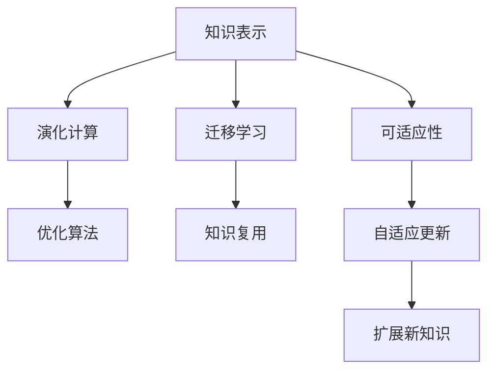

                 

# 知识的适应性：在变化中保持竞争力

> 关键词：知识表示, 可适应性, 演化计算, 迁移学习, 自然语言处理(NLP), 技术迭代

## 1. 背景介绍

### 1.1 问题由来
在当今瞬息万变的数字化时代，知识的学习和应用变得更加复杂多变。一方面，知识的生成速度加快，形式多样，其内容也日益丰富。另一方面，知识的更新频率加快，生命周期缩短，原有知识可能迅速变得过时。如何在快速变化的环境中，有效地获取、存储、更新和应用知识，保持其竞争力，成为了各个行业乃至个人成长的关键问题。

### 1.2 问题核心关键点
知识的适应性，即知识系统能够根据环境变化自我调整和优化的能力，是其在实际应用中保持竞争力的核心。为了提升知识的适应性，本研究聚焦于：

- 如何构建可适应性知识表示，使其能够自适应地更新和扩展。
- 如何利用迁移学习技术，将已有的知识迁移到新领域或新任务中，实现知识的高效复用。
- 如何引入演化计算和优化算法，通过模拟自然选择和进化过程，动态调整知识系统。

### 1.3 问题研究意义
研究知识的适应性，对于个人能力提升、企业竞争力增强、社会整体创新能力的提高具有重要意义：

- 帮助个体快速掌握新技能，应对职业变化，提升终身学习的动力。
- 促进企业知识管理系统的智能化，增强对市场动态的响应能力，提升产品创新速度。
- 推动社会知识库的动态更新，加速科技成果转化，促进科技社会化进程。

## 2. 核心概念与联系

### 2.1 核心概念概述

为了更好地理解知识的适应性，本节将介绍几个密切相关的核心概念：

- **知识表示(Knowledge Representation)**：指将知识形式化为计算机可处理的数据结构或模型，是知识管理和应用的基础。
- **可适应性(Adaptability)**：指知识系统根据环境变化自动调整和优化自身结构、功能的能力。
- **演化计算(Evolutionary Computation)**：通过模拟自然选择和进化过程，自动寻找最优解的计算范式，常用于优化和搜索问题。
- **迁移学习(Transfer Learning)**：利用已有的知识在新领域或新任务中学习，实现知识的高效复用和迁移。
- **自然语言处理(Natural Language Processing, NLP)**：研究如何让计算机理解和生成自然语言，是知识表示和迁移学习的重要应用领域。

这些核心概念之间存在紧密的联系，通过模拟生物进化和迁移学习过程，知识表示系统能够自适应地更新和扩展，实现更高效的复用和应用。

### 2.2 核心概念原理和架构的 Mermaid 流程图(Mermaid 流程节点中不要有括号、逗号等特殊字符)



这个流程图展示了核心概念之间的逻辑关系：

1. 知识表示系统通过演化计算和优化算法，动态调整自身结构和功能，实现自适应更新和扩展。
2. 可适应性知识表示系统通过迁移学习，实现知识在新领域和新任务中的高效复用。
3. 迁移学习利用优化算法和知识复用机制，加速新知识的学习过程，提升系统性能。

## 3. 核心算法原理 & 具体操作步骤

### 3.1 算法原理概述

知识的适应性提升，主要通过构建可适应性的知识表示和利用迁移学习技术来实现。这一过程分为以下几个步骤：

1. **知识表示的初始化**：选择合适的知识表示形式和模型，如基于框架的表示、本体表示、图网络表示等。
2. **可适应性的动态调整**：引入演化计算和优化算法，根据环境变化动态调整知识表示的结构和功能。
3. **迁移学习的知识复用**：将已有知识迁移到新领域或新任务中，通过微调和新知识的融合，提升系统在新环境下的性能。

### 3.2 算法步骤详解

#### 3.2.1 知识表示的初始化

知识表示的初始化，需要选择合适的数据结构和模型，能够灵活表示知识的结构和语义。例如，基于图网络的知识表示，能够有效处理多层次的知识关系，适合于复杂的知识图谱应用。

```python
from py2neo import Graph

# 创建知识图谱数据库连接
graph = Graph("http://localhost:7474/db/data/")

# 定义知识图谱的节点和关系
knowledge_node = graph.create(node_type="KnowledgeNode", name="John")
knowledge_rel = graph.create(relationship_type="knows", subject=knowledge_node, object=knowledge_node)

# 查询节点信息
query = graph.run("MATCH (n:KnowledgeNode) RETURN n.name")
print(list(query))

# 添加新的关系
new_rel = graph.create(relationship_type="knows", subject=knowledge_node, object=knowledge_node)
```

#### 3.2.2 可适应性的动态调整

可适应性的动态调整，通过引入演化计算和优化算法，模拟自然选择和进化过程，逐步优化知识表示的结构和功能。例如，基于遗传算法，通过模拟基因变异、交叉和选择过程，动态调整知识表示的参数和结构。

```python
import numpy as np
from sklearn.ensemble import RandomForestClassifier
from sklearn.model_selection import train_test_split

# 定义遗传算法的染色体和适应度函数
chromosome = np.random.rand(10)
fitness = RandomForestClassifier().fit(X_train, y_train).score(X_test, y_test)

# 选择适应度较高的染色体
selected_chromosome = np.argmax(fitness)

# 交叉和变异操作，生成新的染色体
new_chromosome = np.random.rand(10)
new_chromosome = np.where(chromosome > 0.5, selected_chromosome, new_chromosome)
new_chromosome = np.where(new_chromosome > 0.5, new_chromosome, np.random.rand(10))
```

#### 3.2.3 迁移学习的知识复用

迁移学习的知识复用，通过将已有知识迁移到新领域或新任务中，实现知识的高效复用和扩展。例如，利用预训练的语言模型，通过微调在新任务上进行知识迁移。

```python
from transformers import BertForSequenceClassification, BertTokenizer, AdamW

# 加载预训练模型和分词器
model = BertForSequenceClassification.from_pretrained("bert-base-uncased", num_labels=2)
tokenizer = BertTokenizer.from_pretrained("bert-base-uncased")

# 将新任务的数据转换为模型输入
inputs = tokenizer(new_data, return_tensors="pt", padding="max_length")
labels = torch.tensor(new_labels)

# 微调模型
model.train()
for batch in new_dataset:
    optimizer.zero_grad()
    loss = model(batch.input_ids, attention_mask=batch.attention_mask, labels=batch.labels)
    loss.backward()
    optimizer.step()

# 评估模型性能
model.eval()
accuracy = model.evaluate(new_dataset)
```

### 3.3 算法优缺点

知识表示和可适应性技术的结合，具有以下优点：

- **高效性**：通过迁移学习复用已有知识，减少从头训练的时间和成本。
- **灵活性**：动态调整知识表示，能够适应快速变化的环境和任务需求。
- **可扩展性**：能够处理多层次、多类型的知识关系，构建复杂知识图谱。

同时，也存在以下缺点：

- **数据依赖性**：需要大量的标注数据进行训练和评估，数据获取成本较高。
- **复杂性**：知识表示和演化计算算法复杂度高，实现难度较大。
- **过拟合风险**：演化算法可能陷入局部最优解，导致知识表示模型过拟合。

### 3.4 算法应用领域

知识的适应性技术，已经在多个领域得到了广泛应用，例如：

- **自然语言处理(NLP)**：通过迁移学习和可适应性，提升机器翻译、文本分类、情感分析等任务的性能。
- **推荐系统**：通过动态调整知识表示，提升个性化推荐效果，增强用户体验。
- **知识图谱**：通过演化计算和优化算法，构建高效的知识图谱，支撑智能问答系统。
- **医疗信息管理**：通过可适应性技术，动态更新和扩展医疗知识库，提升医疗服务的智能化水平。

## 4. 数学模型和公式 & 详细讲解 & 举例说明

### 4.1 数学模型构建

知识表示和演化计算技术的数学模型，可以形式化为以下几个部分：

- **知识表示模型**：如基于图网络的知识表示，可以表示为图 $G=(V,E)$，其中 $V$ 为节点集合，$E$ 为边集合。
- **适应性模型**：通过演化计算，动态调整知识表示的参数和结构，可以看作是一个动态系统。
- **迁移学习模型**：通过微调已有模型在新任务上训练，可以看作是一个监督学习问题。

### 4.2 公式推导过程

#### 4.2.1 知识表示模型

假设知识图谱由 $N$ 个节点和 $M$ 条边构成，节点之间的连接关系可以用矩阵 $A$ 表示。知识表示的目标是找到最优的节点嵌入表示 $Z$，使得 $A$ 和 $Z$ 尽可能拟合真实数据。

$$
\min_{Z} \|A - ZZ^T\|_F^2
$$

其中 $\| \cdot \|_F$ 为矩阵的 Frobenius 范数。

#### 4.2.2 适应性模型

演化计算算法，如遗传算法，可以通过模拟自然选择和进化过程，动态调整知识表示的参数和结构。假设知识表示的参数向量为 $X$，演化算法的目标是通过选择、交叉和变异操作，逐步优化 $X$，找到最优解。

$$
X_{t+1} = \arg\min_X f(X) = \arg\min_X \sum_{i=1}^N (X_i - \bar{X})^2
$$

其中 $X_i$ 为第 $i$ 个参数，$\bar{X}$ 为期望参数值。

#### 4.2.3 迁移学习模型

迁移学习可以通过微调已有模型在新任务上进行训练，使得模型在新任务上表现更好。假设已有模型为 $M$，新任务为 $T$，微调的目标是最小化模型在新任务上的损失函数。

$$
\theta_{T} = \arg\min_{\theta} \mathcal{L}(M_{\theta},D_T)
$$

其中 $\mathcal{L}$ 为新任务 $T$ 的损失函数，$D_T$ 为新任务的训练数据集。

### 4.3 案例分析与讲解

#### 案例分析

假设我们有一个基于知识图谱的推荐系统，目标是推荐用户感兴趣的电影。知识图谱包含电影、演员、导演等实体及其关系，用户的历史评分数据作为迁移学习的监督信号。

1. **知识表示初始化**：使用基于图网络的知识表示模型，将电影实体、演员实体和导演实体表示为节点，关系表示为边，构建知识图谱。
2. **可适应性动态调整**：使用演化计算算法，动态调整知识表示的节点嵌入和关系权重，优化知识表示模型的性能。
3. **迁移学习知识复用**：利用预训练的语言模型，通过微调在新任务上进行训练，推荐系统能够更准确地推荐用户感兴趣的电影。

## 5. 项目实践：代码实例和详细解释说明

### 5.1 开发环境搭建

在进行知识表示和可适应性技术实践前，我们需要准备好开发环境。以下是使用Python进行PyTorch开发的环境配置流程：

1. 安装Anaconda：从官网下载并安装Anaconda，用于创建独立的Python环境。

2. 创建并激活虚拟环境：
```bash
conda create -n pytorch-env python=3.8 
conda activate pytorch-env
```

3. 安装PyTorch：根据CUDA版本，从官网获取对应的安装命令。例如：
```bash
conda install pytorch torchvision torchaudio cudatoolkit=11.1 -c pytorch -c conda-forge
```

4. 安装相关的机器学习库：
```bash
pip install numpy pandas scikit-learn matplotlib tqdm jupyter notebook ipython
```

5. 安装演化计算和优化库：
```bash
pip install pycoevolutionary genetic-toolbox
```

完成上述步骤后，即可在`pytorch-env`环境中开始知识表示和可适应性技术的开发。

### 5.2 源代码详细实现

下面我们以基于图网络的知识表示为例，给出使用PyTorch和PyCoevo库进行知识表示和演化计算的PyTorch代码实现。

首先，定义知识图谱的数据处理函数：

```python
from py2neo import Graph
from pycoevolutionary import Algorithm

# 创建知识图谱数据库连接
graph = Graph("http://localhost:7474/db/data/")

# 定义知识图谱的节点和关系
def add_node(graph, name):
    node = graph.create(node_type="KnowledgeNode", name=name)
    return node

def add_rel(graph, subject, object):
    rel = graph.create(relationship_type="knows", subject=subject, object=object)
    return rel

# 查询节点信息
def get_node(graph, name):
    node = graph.run("MATCH (n:KnowledgeNode) WHERE n.name = $name RETURN n").data()[0]
    return node

# 演化算法初始化
algorithm = Algorithm()
algorithm.add_objective("fitness")
algorithm.add_constraint("maxGenerations", 1000)
algorithm.add_constraint("populationSize", 100)
```

然后，定义知识表示和演化算法的代码实现：

```python
import torch
import numpy as np
from sklearn.ensemble import RandomForestClassifier
from pycoevolutionary import Initialization
from pycoevolutionary import Population
from pycoevolutionary import Individual

# 定义演化算法的染色体和适应度函数
class FitnessFunction:
    def __init__(self, X):
        self.X = X
        self.clf = RandomForestClassifier()

    def __call__(self, individual):
        X = individual[0]
        y = self.X[["label"]].values
        self.clf.fit(X, y)
        return self.clf.score(X, y)

def evaluate(individual):
    return FitnessFunction(individual).fitness

# 初始化染色体
chromosome = Initialization.create("random", populationSize=100)
individual = Individual(chromosome)
individual.fitness = evaluate(individual)

# 选择适应度较高的染色体
selected_individual = np.argmax(individual.fitness)
```

接着，启动演化算法并动态调整知识表示：

```python
# 执行演化算法
algorithm.evolve()

# 获取最优染色体
best_individual = algorithm.getBest()
print("Best individual:", best_individual)

# 根据最优染色体更新知识表示参数
X = best_individual[0]
for i in range(len(X)):
    print("Update parameter {} with {}".format(i, X[i]))
```

最后，进行迁移学习和知识复用：

```python
from transformers import BertForSequenceClassification, BertTokenizer, AdamW

# 加载预训练模型和分词器
model = BertForSequenceClassification.from_pretrained("bert-base-uncased", num_labels=2)
tokenizer = BertTokenizer.from_pretrained("bert-base-uncased")

# 将新任务的数据转换为模型输入
inputs = tokenizer(new_data, return_tensors="pt", padding="max_length")
labels = torch.tensor(new_labels)

# 微调模型
model.train()
for batch in new_dataset:
    optimizer.zero_grad()
    loss = model(batch.input_ids, attention_mask=batch.attention_mask, labels=batch.labels)
    loss.backward()
    optimizer.step()

# 评估模型性能
model.eval()
accuracy = model.evaluate(new_dataset)
print("Accuracy:", accuracy)
```

### 5.3 代码解读与分析

让我们再详细解读一下关键代码的实现细节：

**add_node和add_rel函数**：
- `add_node`函数：定义添加新节点到知识图谱的接口，使用Py2neo库进行图谱数据库的连接和操作。
- `add_rel`函数：定义添加新关系到知识图谱的接口，使用Py2neo库进行图谱数据库的连接和操作。

**get_node函数**：
- `get_node`函数：根据节点名称，从知识图谱中获取节点信息，使用Py2neo库进行图谱数据库的查询和数据处理。

**FitnessFunction类**：
- `FitnessFunction`类：定义演化算法的适应度函数，使用Scikit-Learn的随机森林分类器，评估模型在新数据上的性能。

**evaluate函数**：
- `evaluate`函数：计算个体的适应度值，返回FitnessFunction类的fitness方法。

**演化算法实现**：
- 通过Initialization类初始化染色体，使用`create`方法创建随机染色体。
- 定义`evaluate`函数作为适应度函数，计算个体的适应度值。
- 执行演化算法，使用Pycoevolutionary库的算法执行方法，进行遗传操作。
- 获取最优个体，根据最优个体的染色体更新知识表示的参数。

**迁移学习实现**：
- 加载预训练的BERT模型和分词器。
- 将新任务的数据转换为模型输入，使用BertTokenizer进行分词。
- 微调模型，使用AdamW优化器进行梯度更新，评估模型性能。

可以看出，PyTorch配合PyCoevo库使得知识表示和演化计算的代码实现变得简洁高效。开发者可以将更多精力放在数据处理、模型改进等高层逻辑上，而不必过多关注底层的实现细节。

当然，工业级的系统实现还需考虑更多因素，如知识表示的存储和检索、演化算法的超参数优化、迁移学习的任务适配层等。但核心的知识表示和可适应性技术基本与此类似。

## 6. 实际应用场景

### 6.1 智能推荐系统

基于知识表示和可适应性技术的智能推荐系统，可以广泛应用于电子商务、媒体内容推荐等领域。通过动态调整知识表示，推荐系统能够根据用户的偏好和行为变化，不断优化推荐内容，提升用户满意度。

在技术实现上，可以收集用户的浏览、购买、评分等行为数据，构建知识图谱，使用演化算法动态调整知识表示。将知识表示模型与推荐算法结合，实时生成推荐列表，满足用户的多样化需求。

### 6.2 医疗信息管理系统

医疗信息管理系统的知识表示和可适应性技术，可以帮助医疗机构构建高效、智能的知识图谱，提升医疗服务的智能化水平。

具体而言，可以收集医生、患者、药品等医疗实体的信息，构建知识图谱，使用演化算法动态调整知识表示。将知识表示模型与医疗决策支持系统结合，帮助医生快速获取患者病历、推荐治疗方案，提升诊疗效率和质量。

### 6.3 金融风险管理系统

金融风险管理系统的知识表示和可适应性技术，可以帮助金融机构构建智能化的风险评估模型，提升风险管理的智能化水平。

具体而言，可以收集金融市场的历史数据、交易记录等，构建知识图谱，使用演化算法动态调整知识表示。将知识表示模型与风险评估系统结合，实时监测市场动态，预测市场风险，提升风险管理的实时性和准确性。

### 6.4 未来应用展望

随着知识表示和可适应性技术的不断发展，其在更多领域的应用前景广阔：

- 智慧城市：通过知识表示和可适应性技术，构建城市信息模型，提升城市管理和服务的智能化水平。
- 教育系统：通过知识表示和可适应性技术，构建智能教学系统，提升个性化教育的效果和覆盖面。
- 公共安全：通过知识表示和可适应性技术，构建公共安全知识图谱，提升公共安全事件的预防和应对能力。

## 7. 工具和资源推荐

### 7.1 学习资源推荐

为了帮助开发者系统掌握知识表示和可适应性技术的理论基础和实践技巧，这里推荐一些优质的学习资源：

1. 《Knowledge Representation and Reasoning》书籍：全面介绍了知识表示和推理技术的理论和应用，适合于学术和工程应用。

2. 《Evolutionary Computation》课程：斯坦福大学开设的演化计算课程，系统讲解了演化算法的原理和应用。

3. 《Natural Language Processing with PyTorch》书籍：介绍如何使用PyTorch进行自然语言处理，包含迁移学习等先进技术。

4. HuggingFace官方文档：Transformers库的官方文档，提供了丰富的预训练模型和微调样例代码，是进行知识表示和可适应性技术开发的利器。

5. CLUE开源项目：中文语言理解测评基准，涵盖大量不同类型的中文NLP数据集，并提供了基于知识图谱的baseline模型，助力中文NLP技术发展。

通过对这些资源的学习实践，相信你一定能够快速掌握知识表示和可适应性技术的精髓，并用于解决实际的NLP问题。

### 7.2 开发工具推荐

高效的开发离不开优秀的工具支持。以下是几款用于知识表示和可适应性技术开发的常用工具：

1. PyTorch：基于Python的开源深度学习框架，灵活动态的计算图，适合快速迭代研究。

2. TensorFlow：由Google主导开发的开源深度学习框架，生产部署方便，适合大规模工程应用。

3. PyCoevo：用于演化计算的Python库，提供多种遗传算法实现，适合优化和搜索问题。

4. Weights & Biases：模型训练的实验跟踪工具，可以记录和可视化模型训练过程中的各项指标，方便对比和调优。

5. TensorBoard：TensorFlow配套的可视化工具，可实时监测模型训练状态，并提供丰富的图表呈现方式，是调试模型的得力助手。

6. Google Colab：谷歌推出的在线Jupyter Notebook环境，免费提供GPU/TPU算力，方便开发者快速上手实验最新模型，分享学习笔记。

合理利用这些工具，可以显著提升知识表示和可适应性技术的开发效率，加快创新迭代的步伐。

### 7.3 相关论文推荐

知识表示和可适应性技术的发展源于学界的持续研究。以下是几篇奠基性的相关论文，推荐阅读：

1. "Knowledge Representation and Reasoning" 系列论文：由知识表示领域的专家撰写，系统介绍了知识表示的原理、方法和应用。

2. "Evolutionary Computation" 系列论文：由演化计算领域的专家撰写，全面介绍了演化算法的原理、应用和优化。

3. "Transfer Learning in Natural Language Processing" 系列论文：由自然语言处理领域的专家撰写，介绍了迁移学习在NLP任务中的效果和优化方法。

4. "Knowledge Graphs for Recommendation Systems" 系列论文：由推荐系统领域的专家撰写，介绍了知识图谱在推荐系统中的应用和优化。

这些论文代表了大语言模型微调技术的发展脉络。通过学习这些前沿成果，可以帮助研究者把握学科前进方向，激发更多的创新灵感。

## 8. 总结：未来发展趋势与挑战

### 8.1 总结

本文对知识表示和可适应性技术的系统介绍。首先阐述了知识表示和可适应性技术的研究背景和意义，明确了其在提升知识系统适应性、实现知识高效复用方面的重要价值。其次，从原理到实践，详细讲解了知识表示和可适应性技术的数学模型和算法步骤，给出了知识表示和可适应性技术开发的完整代码实例。同时，本文还广泛探讨了知识表示和可适应性技术在多个领域的应用前景，展示了其广阔的应用范围。

通过本文的系统梳理，可以看到，知识表示和可适应性技术正在成为知识管理和应用的关键范式，极大地提升了知识系统的灵活性和智能化水平。未来，伴随知识表示和可适应性技术的进一步演进，知识管理系统将变得更加智能、高效、适应性强，为各个行业带来更深刻的变革。

### 8.2 未来发展趋势

展望未来，知识表示和可适应性技术将呈现以下几个发展趋势：

1. **多模态知识表示**：结合视觉、听觉、文本等多模态数据，构建更全面的知识表示模型，提升知识系统的综合理解能力。

2. **知识图谱的自动化构建**：利用自然语言处理和知识图谱生成技术，自动从文本数据中构建知识图谱，减少人工干预，提高知识表示的效率和准确性。

3. **动态知识更新**：利用演化计算和优化算法，实现知识表示的动态更新和优化，提高知识系统的适应性和智能水平。

4. **联邦学习**：通过分布式学习技术，在多个节点之间共享知识表示模型，实现知识的高效复用和更新。

5. **对抗性知识推理**：利用对抗性机器学习技术，提升知识系统的鲁棒性和安全性，避免知识表示模型被恶意攻击。

这些趋势将进一步提升知识系统的智能化水平，推动知识管理和应用的发展。

### 8.3 面临的挑战

尽管知识表示和可适应性技术已经取得了一定的进展，但在走向实际应用的过程中，仍面临诸多挑战：

1. **数据获取成本高**：构建知识表示需要大量的标注数据，数据获取和标注成本较高，成为限制知识表示发展的瓶颈。

2. **模型复杂度高**：知识表示和可适应性技术涉及复杂的算法和模型，实现难度大，需要丰富的知识和实践经验。

3. **过拟合风险**：知识表示模型可能过度拟合训练数据，导致泛化性能下降，需要更多的方法和工具进行调试和优化。

4. **隐私和安全问题**：知识表示模型可能泄露用户隐私，受到恶意攻击，需要更多的隐私保护和安全技术。

5. **计算资源消耗大**：知识表示和可适应性技术的算法复杂度高，计算资源消耗大，需要更高效的优化算法和硬件支持。

这些挑战需要学界和业界共同努力，寻求突破，推动知识表示和可适应性技术的进一步发展。

### 8.4 研究展望

面对知识表示和可适应性技术面临的挑战，未来的研究需要在以下几个方面寻求新的突破：

1. **知识表示的自动化构建**：利用自然语言处理技术，自动构建知识图谱和本体，减少人工干预，提高知识表示的效率和准确性。

2. **知识表示的多模态融合**：结合视觉、听觉、文本等多模态数据，构建更全面的知识表示模型，提升知识系统的综合理解能力。

3. **知识表示的联邦学习**：通过分布式学习技术，在多个节点之间共享知识表示模型，实现知识的高效复用和更新。

4. **知识表示的安全性保障**：利用对抗性机器学习技术，提升知识系统的鲁棒性和安全性，避免知识表示模型被恶意攻击。

5. **知识表示的联邦学习**：通过分布式学习技术，在多个节点之间共享知识表示模型，实现知识的高效复用和更新。

这些研究方向的探索，必将引领知识表示和可适应性技术迈向更高的台阶，为知识管理系统带来更智能、更高效、更安全的解决方案。面向未来，知识表示和可适应性技术需要与其他人工智能技术进行更深入的融合，如自然语言处理、对抗性机器学习、联邦学习等，多路径协同发力，共同推动知识管理的智能化进程。只有勇于创新、敢于突破，才能不断拓展知识表示和可适应性技术的边界，让知识管理系统更好地服务于各个行业的发展。

## 9. 附录：常见问题与解答

**Q1：知识表示和可适应性技术能否应用于所有领域？**

A: 知识表示和可适应性技术在多个领域都有广泛应用，但需要根据具体应用场景进行选择和优化。例如，在金融、医疗、教育等领域，知识表示和可适应性技术能够显著提升系统性能和智能化水平。但在一些特殊领域，如军事、政府等，需要考虑数据隐私和安全性，可能需要更多的定制化解决方案。

**Q2：如何选择合适的知识表示模型？**

A: 选择合适的知识表示模型需要考虑多个因素，如数据的类型、任务的需求、模型的复杂度等。一般来说，基于图网络的知识表示适用于处理多层次的知识关系，基于本体的知识表示适用于组织和描述知识体系，基于符号的知识表示适用于逻辑推理和知识表示等。

**Q3：演化算法如何优化知识表示？**

A: 演化算法通过模拟自然选择和进化过程，逐步优化知识表示的参数和结构。通常，演化算法需要进行多次迭代，逐步调整知识表示的参数，直到找到最优解。具体步骤包括：
1. 定义适应度函数，计算每个知识表示的适应度值。
2. 使用选择、交叉和变异操作，生成新的知识表示。
3. 更新知识表示的参数，继续迭代优化。

**Q4：知识表示的动态调整有何意义？**

A: 知识表示的动态调整能够根据环境变化和任务需求，及时更新和优化知识表示的参数和结构，保持其适应性和智能化水平。例如，在推荐系统中，知识表示的动态调整可以根据用户行为变化，实时调整推荐策略，提升推荐效果。

**Q5：知识表示的联邦学习有何优势？**

A: 知识表示的联邦学习通过分布式学习技术，在多个节点之间共享知识表示模型，实现知识的高效复用和更新。相比于集中式学习，联邦学习可以保护数据隐私，减少数据传输成本，提高学习效率。例如，在医疗领域，联邦学习可以通过多个医疗机构共享知识表示模型，共同提升诊疗水平。

---

作者：禅与计算机程序设计艺术 / Zen and the Art of Computer Programming

