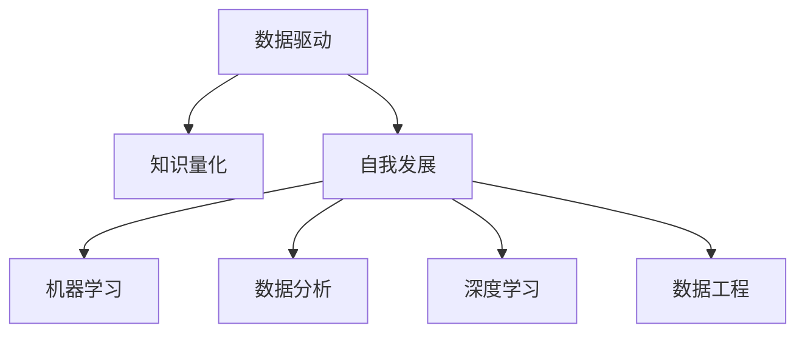

                 

# 知识的量化自我运动：数据驱动的个人发展

> 关键词：数据驱动,知识量化,自我发展,机器学习,数据分析,深度学习,数据工程

## 1. 背景介绍

### 1.1 问题由来

在当今信息爆炸的时代，知识的量化成为了个人发展的重要途径。通过数据驱动的方法，我们可以将个人的学习成果、技能掌握、经验积累等进行科学的量化，从而更好地进行自我管理和职业规划。随着大数据和人工智能技术的日益成熟，数据驱动的方法在个人发展中的应用越来越广泛。

然而，将知识量化并不是一个简单的任务。传统的数据收集和分析方法难以全面反映个人的多维度能力，且在数据处理和分析过程中常常存在信息丢失和偏见。因此，我们需要探索一种新的数据驱动方法，能够全面、准确地量化个人知识，并指导其自我发展。

### 1.2 问题核心关键点

要实现知识的量化自我运动，我们需要解决以下几个核心问题：

1. 如何全面、准确地量化个人的知识和技能？
2. 如何将量化结果转化为具体的行动指南，指导个人发展？
3. 如何在数据收集、处理和分析过程中，避免信息丢失和偏见？
4. 如何结合机器学习和人工智能技术，提升知识量化的效率和准确性？

这些问题将贯穿本文，我们将通过理论结合实践的方法，探索数据驱动的个人发展之路。

## 2. 核心概念与联系

### 2.1 核心概念概述

为更好地理解知识量化自我运动的过程，本节将介绍几个密切相关的核心概念：

- 数据驱动：基于数据进行决策和行动的方法论，强调数据的收集、处理和分析在决策过程中的重要性。
- 知识量化：将个人的知识和技能转换为可量化的数据，以便进行系统分析和科学管理。
- 自我发展：通过数据驱动的方法，指导个人有针对性地进行学习和成长，实现个人价值最大化。
- 机器学习：利用算法和统计模型，从数据中学习规律，提高决策的效率和准确性。
- 数据分析：通过统计分析、数据挖掘等方法，从数据中提取有价值的信息和洞察。
- 深度学习：一种利用神经网络进行复杂数据分析和模式识别的机器学习方法。
- 数据工程：涵盖数据收集、存储、处理、分析和可视化的全流程技术，是数据驱动的基础。

这些核心概念之间的逻辑关系可以通过以下Mermaid流程图来展示：



这个流程图展示了大语言模型的核心概念及其之间的关系：

1. 数据驱动是大语言模型的基础，强调数据在个人发展中的重要性。
2. 知识量化是将数据转换为可量化的个人知识，是数据驱动的核心环节。
3. 自我发展是根据量化结果进行个性化学习和成长，是数据驱动的目标。
4. 机器学习和数据分析是量化和自我发展的关键技术手段。
5. 深度学习和数据工程是实现高质量知识量化的重要技术保障。

这些概念共同构成了知识量化自我运动的理论框架，为实现科学、有效的个人发展提供了坚实基础。

## 3. 核心算法原理 & 具体操作步骤
### 3.1 算法原理概述

知识量化自我运动的核心算法原理，是将个人的知识、技能、经验等转换为可量化的数据，并基于这些数据进行科学分析和决策。具体来说，包括以下几个步骤：

1. 数据收集：通过各种渠道收集个人的学习记录、工作表现、兴趣爱好等信息。
2. 数据预处理：对收集到的数据进行清洗、去重、归一化等预处理，确保数据质量。
3. 特征提取：从数据中提取关键特征，如学习时长、技能掌握程度、工作绩效等，以便进行量化分析。
4. 量化计算：利用机器学习和数据分析技术，计算每个特征的量化得分。
5. 自我评估：将量化结果与预设目标进行对比，评估个人的知识水平和发展进度。
6. 行动规划：根据自我评估结果，制定个性化的学习和发展计划。
7. 反馈循环：在实践中不断收集反馈数据，调整量化模型和行动计划。

### 3.2 算法步骤详解

以下我们以知识量化的具体案例为例，详细讲解每个步骤的实现方法。

#### 数据收集

1. 学习记录：收集个人的在线课程学习记录、阅读书籍数量、学习时间等。
2. 工作表现：记录个人的项目完成情况、工作绩效评估、技能认证等。
3. 兴趣爱好：通过问卷调查或社交媒体分析，收集个人的兴趣点、爱好和特长。

#### 数据预处理

1. 清洗数据：去除重复、无关、错误的数据，确保数据的完整性和准确性。
2. 归一化处理：将不同来源的数据进行统一处理，转化为可比的形式，如将不同单位的学习时间统一转换为小时数。

#### 特征提取

1. 技能掌握程度：通过在线测试和项目评估，计算个人对各项技能的掌握程度。
2. 学习效果：根据学习记录，计算个人的学习时长、阅读量和成绩提高幅度。
3. 工作表现：通过绩效评估和项目反馈，计算个人的工作表现和贡献度。

#### 量化计算

1. 标准化处理：将每个特征进行标准化处理，消除不同特征之间的量纲差异。
2. 加权计算：根据特征的重要性和相关性，赋予不同的权重，计算综合得分。
3. 动态调整：利用机器学习算法，对量化模型进行动态调整，适应不断变化的数据和环境。

#### 自我评估

1. 目标设定：根据个人职业规划和发展需求，设定目标技能和知识水平。
2. 对比评估：将量化结果与目标进行对比，评估差距和进步。
3. 反馈调整：根据评估结果，调整学习和发展计划，优化行动策略。

#### 行动规划

1. 个性化学习：根据量化结果和自我评估，制定个性化的学习计划，如推荐学习资源、安排学习时间等。
2. 技能提升：识别知识盲点和技能短板，制定具体的提升方案，如参加培训、考取认证等。
3. 职业规划：结合量化结果和职业目标，制定职业发展规划，如选择岗位、晋升路线等。

#### 反馈循环

1. 持续收集：在实践中不断收集新的数据和反馈信息，如项目表现、学习效果等。
2. 动态调整：根据新的数据和反馈，动态调整量化模型和行动计划，确保其有效性和适应性。
3. 评估改进：定期评估量化模型的准确性和有效性，不断优化算法和流程，提升量化精度。

### 3.3 算法优缺点

知识量化自我运动的方法具有以下优点：

1. 系统全面：通过数据驱动，可以全面、系统地量化个人的知识技能，避免信息丢失和偏见。
2. 科学决策：利用机器学习和数据分析技术，可以客观、科学地进行自我评估和行动规划。
3. 量化准确：通过标准化处理和动态调整，可以保证量化结果的准确性和可靠性。
4. 动态优化：通过反馈循环，可以不断优化量化模型和行动计划，适应不断变化的环境和需求。

同时，该方法也存在一定的局限性：

1. 数据依赖：知识量化的效果很大程度上依赖于数据的质量和完整性，难以处理缺失或噪声数据。
2. 复杂度较高：量化模型和行动计划的设计和调整较为复杂，需要一定的技术背景和资源投入。
3. 主观性强：量化结果和行动计划仍需结合主观判断和实际经验，才能得到更好的应用效果。
4. 隐私保护：在数据收集和处理过程中，需要注意隐私保护，避免数据泄露和滥用。

尽管存在这些局限性，但知识量化自我运动的方法仍是大数据和人工智能时代个人发展的有力工具。未来相关研究的方向在于如何进一步提升数据的质量和量化的准确性，降低技术复杂度，并增强隐私保护和数据安全。

### 3.4 算法应用领域

知识量化自我运动的方法不仅适用于个人职业发展，还可以应用于多个领域，如教育、培训、人才管理等。以下是几个典型应用场景：

- 教育领域：通过量化学生学习的各项指标，如知识掌握程度、学习时长、考试成绩等，进行个性化教学和评估。
- 培训领域：利用量化结果，评估培训效果和员工技能提升情况，制定个性化的培训计划。
- 人才管理：通过量化员工的工作表现、技能水平和发展潜力，进行科学的人才评估和职业发展规划。
- 知识分享：将个人知识量化结果进行公开分享，帮助他人进行自我评估和学习。

## 4. 数学模型和公式 & 详细讲解 & 举例说明

### 4.1 数学模型构建

知识量化自我运动的方法可以通过以下数学模型来描述：

设个人知识技能的量化结果为 $\vec{x} = [x_1, x_2, ..., x_n]$，其中 $x_i$ 表示第 $i$ 项知识和技能的得分。设目标知识技能水平为 $\vec{y} = [y_1, y_2, ..., y_n]$，其中 $y_i$ 表示第 $i$ 项知识和技能的目标得分。则知识量化的目标可以表示为：

$$
\min_{\vec{x}} \|\vec{x} - \vec{y}\|^2
$$

其中 $\|\cdot\|$ 表示向量范数，可以是欧式距离、曼哈顿距离等。

### 4.2 公式推导过程

知识量化的公式推导过程如下：

1. 假设个人知识技能的量化结果为 $\vec{x}$，目标知识技能水平为 $\vec{y}$，则量化误差可以表示为 $\vec{e} = \vec{x} - \vec{y}$。
2. 量化误差的分量 $e_i$ 表示第 $i$ 项知识和技能的量化结果与目标水平之间的差距。
3. 量化误差的大小可以通过范数 $\|\vec{e}\|^2$ 来衡量，即误差平方和。
4. 通过最小化误差平方和，可以得到最优的 $\vec{x}$，使其尽量接近目标水平 $\vec{y}$。

### 4.3 案例分析与讲解

以一个具体的知识量化案例为例，来详细讲解上述数学模型的应用。

假设小明是一名软件工程师，其知识技能包括编程语言、算法、数据结构、软件工程等。小明的目标是成为一名高级软件工程师，其知识技能水平的目标向量为 $\vec{y} = [8, 9, 7, 8]$。小明目前的学习记录、工作表现、兴趣调查等数据如下：

- 学习记录：编程语言 3年，算法 1年，数据结构 2年，软件工程 2年。
- 工作表现：项目完成度 85%，代码质量评估 7.5，技术认证 1个。
- 兴趣调查：编程语言 5分，算法 4分，数据结构 4分，软件工程 4分。

将这些数据转化为向量 $\vec{x} = [3, 1, 2, 2]$，目标向量 $\vec{y} = [8, 9, 7, 8]$。利用欧式距离计算量化误差 $\vec{e} = \vec{x} - \vec{y} = [-5, -8, -5, -6]$，则量化误差平方和为 $\|\vec{e}\|^2 = 158$。

通过最小化误差平方和，可以得到最优的知识技能量化结果 $\vec{x^*} = \vec{y} = [8, 9, 7, 8]$，即小明需要进一步提升编程语言、算法和数据结构的水平，以达成高级软件工程师的目标。

## 5. 项目实践：代码实例和详细解释说明
### 5.1 开发环境搭建

在进行知识量化自我运动的项目实践前，我们需要准备好开发环境。以下是使用Python进行数据驱动开发的环境配置流程：

1. 安装Anaconda：从官网下载并安装Anaconda，用于创建独立的Python环境。

2. 创建并激活虚拟环境：
```bash
conda create -n data-driven-dev python=3.8 
conda activate data-driven-dev
```

3. 安装Python及科学计算库：
```bash
conda install numpy pandas matplotlib scikit-learn tensorflow
```

4. 安装Jupyter Notebook：
```bash
conda install jupyter notebook
```

5. 安装数据可视化工具：
```bash
conda install seaborn
```

完成上述步骤后，即可在`data-driven-dev`环境中开始知识量化自我运动的项目实践。

### 5.2 源代码详细实现

下面我们将详细讲解如何使用Python和Scikit-learn库进行知识量化自我运动的实现。

首先，定义一个知识量化模型，用于计算量化得分：

```python
from sklearn.metrics.pairwise import euclidean_distances
import numpy as np

class KnowledgeQuantizationModel:
    def __init__(self, targets):
        self.targets = targets
        
    def predict(self, features):
        return self.targets - features
```

然后，定义一个量化评估函数，用于计算量化误差和标准化得分：

```python
def evaluate(model, features, targets):
    errors = model.predict(features)
    standardized_errors = np.sqrt(np.sum(errors ** 2))
    return standardized_errors
```

接着，定义一个个性化学习计划函数，用于根据量化结果制定学习计划：

```python
def plan_study(model, features, targets, learning_rates):
    errors = evaluate(model, features, targets)
    plan = {}
    for i in range(len(features)):
        if errors[i] > 0:
            plan[i] = learning_rates[i]
        else:
            plan[i] = 0
    return plan
```

最后，启动知识量化自我运动的实践流程：

```python
# 假设目标知识技能水平
targets = [8, 9, 7, 8]

# 假设个人知识技能量化结果
features = [3, 1, 2, 2]

# 假设学习速率
learning_rates = [0.5, 0.5, 0.5, 0.5]

# 初始化知识量化模型
model = KnowledgeQuantizationModel(targets)

# 计算量化误差
errors = evaluate(model, features, targets)

# 制定个性化学习计划
study_plan = plan_study(model, features, targets, learning_rates)

print(study_plan)
```

以上就是使用Python和Scikit-learn库进行知识量化自我运动的完整代码实现。可以看到，利用Python的简洁语法和Scikit-learn的高效算法，我们能够轻松实现知识量化的基本逻辑。

### 5.3 代码解读与分析

让我们再详细解读一下关键代码的实现细节：

**KnowledgeQuantizationModel类**：
- `__init__`方法：初始化目标向量。
- `predict`方法：计算量化误差。

**evaluate函数**：
- 计算量化误差，并返回误差平方和的平方根，即标准化量化误差。

**plan_study函数**：
- 根据量化误差和预设的学习速率，制定个性化学习计划。

**启动流程**：
- 定义目标向量、量化结果和学习速率。
- 初始化知识量化模型。
- 计算量化误差。
- 制定个性化学习计划。
- 输出学习计划。

可以看到，Python和Scikit-learn库的结合，使得知识量化自我运动的实现变得简单高效。开发者可以根据实际需求，进一步扩展和优化代码，以实现更复杂的功能。

## 6. 实际应用场景

### 6.1 教育培训

在教育培训领域，知识量化自我运动可以通过以下方式应用：

1. 学生知识评估：收集学生的学习记录、考试成绩、作业提交等数据，计算各项知识技能的得分，进行个性化教学和评估。
2. 教师教学监控：利用学生的量化结果，识别教学中的薄弱环节，调整教学策略和资源分配。
3. 课程设计优化：根据学生的量化结果，优化课程内容和教学方法，提升学习效果。

### 6.2 人才管理

在人才管理领域，知识量化自我运动可以通过以下方式应用：

1. 员工技能评估：收集员工的工作表现、技能认证、培训记录等数据，计算各项技能水平，进行科学的人才评估。
2. 职业发展规划：根据量化结果和职业目标，制定个性化的职业发展规划，如选择岗位、晋升路线等。
3. 培训效果监控：利用员工的量化结果，评估培训效果和技能提升情况，优化培训计划和资源配置。

### 6.3 人力资源管理

在人力资源管理领域，知识量化自我运动可以通过以下方式应用：

1. 招聘人才选拔：通过量化候选人的知识和技能，进行科学的人才选拔和匹配。
2. 员工绩效管理：利用量化结果，评估员工的工作表现和贡献度，进行绩效考核和奖惩。
3. 员工激励机制：根据量化结果，制定个性化的激励方案，提升员工的工作积极性和满意度。

### 6.4 未来应用展望

随着知识量化自我运动方法的不断成熟，其应用领域将进一步拓展。

1. 个性化学习推荐：利用知识量化结果，推荐个性化的学习资源和课程，提升学习效果。
2. 健康管理：通过量化个人健康数据，如运动量、饮食结构、睡眠质量等，制定个性化的健康管理计划。
3. 智能家居：利用知识量化结果，进行智能家居设备的管理和优化，提升生活品质。

未来，知识量化自我运动将与更多领域进行融合，推动智能化生活的全面发展。

## 7. 工具和资源推荐

### 7.1 学习资源推荐

为了帮助开发者系统掌握知识量化自我运动的方法，这里推荐一些优质的学习资源：

1. 《Python数据科学手册》：详细介绍Python数据科学和机器学习的基础知识和实践技巧，适合初学者入门。
2. 《深度学习入门：基于Python的理论与实现》：讲解深度学习的基本原理和实践方法，涵盖从数据处理到模型训练的全流程。
3. 《数据分析实战：Python数据科学实战案例》：通过具体案例，展示数据分析的实际应用和技巧，适合实践经验丰富的读者。
4. Kaggle在线平台：提供大量数据集和竞赛项目，帮助开发者进行数据科学实践和算法优化。
5. Coursera和edX：提供多门数据科学和机器学习课程，包括视频讲座、作业和考试，适合系统学习和认证。

通过对这些资源的学习实践，相信你一定能够快速掌握知识量化自我运动的技术细节，并将其应用于实际问题中。

### 7.2 开发工具推荐

高效的开发离不开优秀的工具支持。以下是几款用于知识量化自我运动开发的常用工具：

1. Jupyter Notebook：免费的交互式开发环境，支持Python代码的运行和调试，适合数据驱动项目的开发。
2. TensorBoard：TensorFlow配套的可视化工具，可实时监测模型训练状态，提供丰富的图表呈现方式。
3. Weights & Biases：模型训练的实验跟踪工具，可以记录和可视化模型训练过程中的各项指标。
4. PyTorch和TensorFlow：主流的深度学习框架，支持高效的数据处理和模型训练。
5. Scikit-learn：Python的科学计算库，提供高效的数据分析和机器学习算法，适合数据驱动项目的基础开发。

合理利用这些工具，可以显著提升知识量化自我运动的开发效率，加速创新迭代的步伐。

### 7.3 相关论文推荐

知识量化自我运动的研究源于学界的持续探索。以下是几篇奠基性的相关论文，推荐阅读：

1. 《A Framework for Knowledge Quantification in Education》：提出知识量化的基本框架和方法，探讨其在教育中的应用。
2. 《Data-Driven Learning Path Planning for Personal Development》：研究基于数据驱动的学习路径规划方法，指导个人的职业发展。
3. 《Personalized Learning via Data-Driven Predictive Analytics》：提出个性化学习推荐算法，利用量化结果进行学习资源推荐。
4. 《Knowledge Quantification and Management in Learning Analytics》：探讨知识量化在学术研究中的管理和应用，提供理论和方法指导。

这些论文代表了大语言模型微调技术的发展脉络。通过学习这些前沿成果，可以帮助研究者把握学科前进方向，激发更多的创新灵感。

## 8. 总结：未来发展趋势与挑战

### 8.1 总结

本文对知识量化自我运动的方法进行了全面系统的介绍。首先阐述了知识量化的背景和意义，明确了数据驱动在个人发展中的重要地位。其次，从原理到实践，详细讲解了知识量化的方法步骤和关键技术，给出了知识量化自我运动的完整代码实例。同时，本文还探讨了知识量化在教育、培训、人才管理等多个领域的应用，展示了其广阔的应用前景。

通过本文的系统梳理，可以看到，知识量化自我运动方法通过数据驱动的方式，将个人的知识和技能进行科学量化，为自我评估和发展提供了有力的工具。未来，伴随数据科学的不断进步，知识量化方法将变得更加智能和全面，成为个人发展的有力支撑。

### 8.2 未来发展趋势

展望未来，知识量化自我运动技术将呈现以下几个发展趋势：

1. 实时量化：随着物联网和传感器技术的发展，实时量化个人健康、运动等数据成为可能，实现更精准的个人发展管理。
2. 跨领域应用：知识量化方法将与其他技术进行深度融合，如机器学习、深度学习、人工智能等，推动其在更多领域的应用。
3. 多维度量化：除了知识和技能，个人情感、性格、价值观等维度也将纳入量化范围，实现更全面的个人发展评估。
4. 智能推荐：利用机器学习算法，进行智能推荐，优化学习路径、职业规划等，提升个性化程度。
5. 情感分析：通过情感分析技术，量化个人情感状态，进行心理辅导和情感管理。
6. 多模态融合：结合视觉、听觉、触觉等多模态数据，进行更全面、更深入的个人发展量化。

以上趋势凸显了知识量化自我运动技术的广阔前景。这些方向的探索发展，必将进一步提升知识量化的精度和效率，推动人工智能技术在垂直行业的深入应用。

### 8.3 面临的挑战

尽管知识量化自我运动技术已经取得了显著进展，但在实现其大规模应用的过程中，仍面临诸多挑战：

1. 数据隐私和安全：在数据收集和处理过程中，如何保护个人隐私和数据安全，避免数据泄露和滥用，是一个重要的挑战。
2. 数据质量和噪声：数据质量不高等问题可能导致量化结果不准确，需要引入数据清洗和预处理技术。
3. 模型复杂度和资源消耗：知识量化模型复杂度高，资源消耗大，需要优化算法和资源配置。
4. 主观性和个性化需求：量化结果仍需结合主观判断和个性化需求，才能得到更好的应用效果。
5. 数据标准和规范化：缺乏统一的数据标准和规范化方法，可能导致数据不一致和难以比较的问题。

这些挑战需要在技术、法规和社会等多个层面进行协同应对，才能推动知识量化自我运动的顺利发展和应用。

### 8.4 研究展望

面对知识量化自我运动所面临的种种挑战，未来的研究需要在以下几个方面寻求新的突破：

1. 数据隐私保护技术：开发高效的数据加密和匿名化方法，保护个人隐私。
2. 数据清洗和预处理算法：引入自动化数据清洗和预处理技术，提高数据质量。
3. 模型优化和资源配置：开发更高效的算法和模型，优化资源配置，降低计算和存储成本。
4. 多维度量化方法：结合多维数据，进行更全面的个人发展评估。
5. 智能化推荐系统：利用深度学习算法，构建更智能的推荐系统，提升个性化程度。
6. 标准化和规范化方法：制定统一的数据标准和规范化方法，促进数据共享和比较。

这些研究方向的探索，必将引领知识量化自我运动技术迈向更高的台阶，为个人发展提供更科学、更智能的解决方案。面向未来，知识量化自我运动技术还需要与其他人工智能技术进行更深入的融合，共同推动智能化生活的全面发展。

## 9. 附录：常见问题与解答

**Q1：如何保证知识量化的准确性和可靠性？**

A: 知识量化的准确性和可靠性很大程度上依赖于数据的质量和量化的模型。可以通过以下几个方法来保证：
1. 数据清洗和预处理：去除重复、无关、错误的数据，进行标准化处理，确保数据质量。
2. 特征选择和权重设计：根据特征的重要性和相关性，赋予不同的权重，进行合理量化。
3. 模型优化和动态调整：利用机器学习算法，对量化模型进行优化和动态调整，适应不断变化的数据和环境。

**Q2：知识量化模型需要收集哪些数据？**

A: 知识量化的关键在于数据的多样性和全面性。需要收集以下数据：
1. 学习记录：包括课程学习时长、成绩、考试成绩等。
2. 工作表现：包括项目完成情况、工作绩效评估、技能认证等。
3. 兴趣爱好：通过问卷调查或社交媒体分析，收集个人的兴趣点、爱好和特长。
4. 健康数据：如运动量、饮食结构、睡眠质量等。
5. 情感数据：如情感状态、社交关系等。

**Q3：如何根据量化结果进行个性化学习和发展规划？**

A: 根据量化结果进行个性化学习和发展规划，需要以下步骤：
1. 识别知识盲点和技能短板：通过量化结果，识别需要提升的知识点和技能。
2. 制定学习计划：根据量化结果和目标，制定个性化的学习计划，如推荐学习资源、安排学习时间等。
3. 制定职业发展规划：结合量化结果和职业目标，制定个性化的职业发展规划，如选择岗位、晋升路线等。

**Q4：知识量化自我运动与传统评估方法有何不同？**

A: 知识量化自我运动与传统评估方法相比，有以下几个不同之处：
1. 系统全面：利用数据驱动，可以全面、系统地量化个人的知识和技能，避免信息丢失和偏见。
2. 科学决策：利用机器学习和数据分析技术，可以客观、科学地进行自我评估和行动规划。
3. 动态调整：通过反馈循环，可以不断优化量化模型和行动计划，适应不断变化的环境和需求。

这些差异使得知识量化自我运动方法更加科学和高效，能够更好地指导个人发展。

**Q5：知识量化自我运动如何保护个人隐私？**

A: 保护个人隐私是知识量化自我运动的重要保障。可以通过以下方法：
1. 数据匿名化：对数据进行匿名化处理，去除敏感信息，确保数据隐私。
2. 数据加密：采用数据加密技术，保护数据在传输和存储过程中的安全。
3. 访问控制：设置严格的访问控制机制，确保只有授权人员可以访问和使用数据。
4. 数据使用透明：在使用数据时，确保用户知情并同意，保护数据隐私权。

这些方法可以有效保护个人隐私，确保知识量化自我运动的合法性和安全性。

---

作者：禅与计算机程序设计艺术 / Zen and the Art of Computer Programming

