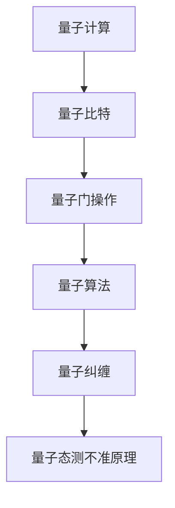

                 

# 知识的量子理论：信息处理的新范式

## 1. 背景介绍

### 1.1 问题由来

随着信息技术的飞速发展，数据量和复杂度呈指数级增长，传统的信息处理方法已难以适应当前需求。例如，在生物信息学、大数据分析、机器学习等领域，海量的数据需要高效的模型处理。而现有的处理方式往往基于经典的计算模型，无法同时兼顾计算速度、存储容量和处理精度。

面对这一挑战，量子计算成为解决信息处理难题的新方向。量子计算基于量子力学原理，通过量子位(即量子比特，或称qubits)进行信息处理，能够实现超越经典计算模型的突破性进展。

### 1.2 问题核心关键点

量子计算的核心在于量子位的叠加性和纠缠性。叠加性使得一个量子位可以同时处于多个状态，实现并行计算；纠缠性使得量子位间的状态相互作用，提升计算效率和精度。利用量子位进行信息处理，可以显著提高计算速度和存储空间利用率，同时提升算法的复杂度与鲁棒性。

## 2. 核心概念与联系

### 2.1 核心概念概述

为了更好地理解量子计算在信息处理中的应用，本节将介绍几个密切相关的核心概念：

- 量子计算(QC)：基于量子力学原理，利用量子比特进行信息处理的一种新型计算模型。通过量子叠加和纠缠，量子计算可以在某些特定问题上大幅提高处理效率和精度。

- 量子比特(qubit)：量子计算的基本单位，类似于经典计算中的比特。与比特只能处于0或1两种状态不同，一个量子比特可以同时处于多个状态，即量子叠加态。

- 量子门操作：对量子比特进行的基本操作，如Hadamard门、CNOT门等。这些操作可以通过量子叠加和纠缠性，对量子比特状态进行变换，实现复杂计算。

- 量子算法：针对特定问题设计的量子计算方法，如Shor算法、Grover算法等。这些算法利用量子特性，在多项式时间内完成经典算法需要指数时间才能解决的问题。

- 量子纠缠(Entanglement)：两个或多个量子比特之间的一种非经典关联，一个量子比特的状态变化将立即影响另一个，即纠缠态。利用纠缠性，量子计算可以提升并行处理能力。

- 量子态测不准原理：量子力学的核心原理之一，指量子比特的量子态无法被完全精确测量，只能通过概率的方式得到测量结果。

这些核心概念之间的逻辑关系可以通过以下Mermaid流程图来展示：



这个流程图展示了大规模量子计算的关键组成部分及其关系：

1. 量子计算利用量子比特进行信息处理。
2. 量子比特通过量子门操作进行状态变换。
3. 量子算法利用量子特性解决特定问题。
4. 量子纠缠提升并行处理能力。
5. 量子态测不准原理影响量子计算的准确性。

## 3. 核心算法原理 & 具体操作步骤

### 3.1 算法原理概述

量子计算通过量子门操作对量子比特的状态进行变换，利用量子叠加和纠缠性提升计算速度和精度。量子算法，如Shor算法和Grover算法，利用量子特性，可以在多项式时间内解决某些经典算法难以在合理时间内解决的问题。

具体而言，量子计算的数学基础是量子力学中的波函数和测不准原理。假设一个量子比特处于叠加态 $|+\rangle = \frac{1}{\sqrt{2}}(|0\rangle + |1\rangle)$，通过应用Hadamard门（即 $H$ 门）进行变换，可以将其变为 $|\psi\rangle = \frac{1}{\sqrt{2}}(|0\rangle + |1\rangle)$。这样，一个量子比特可以在一个操作中处理两个状态。

### 3.2 算法步骤详解

量子计算的一般步骤包括：

1. **初始化量子比特**：将量子比特置于叠加态或特定状态。
2. **应用量子门**：对量子比特进行一系列量子门操作，实现状态变换。
3. **读取量子比特**：通过量子态测不准原理，读取量子比特的测量结果。
4. **重复实验**：多次重复上述过程，提升计算精度。

以Grover算法为例，其基本思想是通过量子叠加和量子并行搜索，实现对无序数据库的快速检索。假设有 $N$ 个元素，其中只有一个目标元素 $|t\rangle$，Grover算法通过以下步骤进行搜索：

- 初始化 $N$ 个量子比特，全部处于叠加态 $|+\rangle$。
- 应用Grover迭代变换 $G$，每次迭代后的叠加态与目标元素的关系更加紧密。
- 重复迭代 $O(\sqrt{N})$ 次，得到目标元素的叠加态。
- 测量量子比特，得到目标元素的位置。

### 3.3 算法优缺点

量子计算具有以下优点：

1. **加速计算**：某些问题在量子计算机上可以通过多项式时间解决，而经典计算机需要指数时间。
2. **高精度**：利用量子叠加和纠缠性，量子计算可以提升计算精度，减少误差。
3. **并行处理**：量子比特的叠加态实现并行计算，提升计算效率。

同时，量子计算也存在以下缺点：

1. **量子退相干**：量子比特容易受到环境干扰，导致量子信息丢失。
2. **技术复杂**：量子计算需要精确控制量子比特，实现难度较大。
3. **应用范围有限**：目前量子计算机只适用于特定类型的问题，如分解大整数、搜索无序数据库等。

### 3.4 算法应用领域

量子计算的应用范围涵盖了多个领域，包括：

1. **密码学**：量子计算机可以破解现有的加密算法，如RSA、ECC等，同时也可以用于量子安全加密。
2. **药物设计**：量子计算可以模拟分子结构和反应路径，加速药物发现和设计。
3. **优化问题**：量子计算可以解决复杂的优化问题，如供应链管理、交通规划等。
4. **机器学习**：量子计算可以提升机器学习的训练速度和精度，解决高维空间的数据分析问题。
5. **量子模拟**：量子计算可以模拟量子系统，用于材料科学、量子化学等领域。

## 4. 数学模型和公式 & 详细讲解 & 举例说明

### 4.1 数学模型构建

量子计算的数学基础是量子力学中的波函数和测不准原理。假设一个量子比特处于叠加态 $|+\rangle = \frac{1}{\sqrt{2}}(|0\rangle + |1\rangle)$，通过应用Hadamard门（即 $H$ 门）进行变换，可以将其变为 $|\psi\rangle = \frac{1}{\sqrt{2}}(|0\rangle + |1\rangle)$。

设 $|\psi\rangle = \sum_{i=0}^{n-1} a_i |i\rangle$ 为 $n$ 个量子比特的叠加态，其中 $|i\rangle$ 为量子比特的基本状态，$a_i$ 为系数。则通过 $n$ 次Hadamard门操作，叠加态变为 $|\psi\rangle = \frac{1}{\sqrt{2^n}}\sum_{i=0}^{2^n-1} |i\rangle$，即每个量子比特都处于叠加态。

### 4.2 公式推导过程

设量子比特 $|\psi\rangle = a_0|0\rangle + a_1|1\rangle$，应用Hadamard门后变为 $|\psi'\rangle = H|\psi\rangle = \frac{1}{\sqrt{2}}(a_0|0\rangle + a_1|1\rangle)$。

由上式可知，Hadamard门将量子比特的状态进行平方根的叠加，实现了量子比特的并行处理能力。

### 4.3 案例分析与讲解

以Shor算法为例，其基本思想是通过量子并行加速整数分解。Shor算法的基本步骤如下：

1. **量子子程序**：将整数 $N$ 分解为 $N = a^2 + b^2$，然后通过傅里叶变换和模反演，计算出 $N$ 的质因子。
2. **经典子程序**：将 $N$ 分解为 $N = p_1^{k_1}p_2^{k_2}\ldots p_r^{k_r}$，其中 $p_i$ 为质数。
3. **优化子程序**：根据量子子程序和经典子程序的输出，计算出 $N$ 的质因子。

## 5. 项目实践：代码实例和详细解释说明

### 5.1 开发环境搭建

在进行量子计算实践前，我们需要准备好开发环境。以下是使用Python进行Qiskit库的开发环境配置流程：

1. 安装Anaconda：从官网下载并安装Anaconda，用于创建独立的Python环境。

2. 创建并激活虚拟环境：
```bash
conda create -n qiskit-env python=3.8 
conda activate qiskit-env
```

3. 安装Qiskit：根据CUDA版本，从官网获取对应的安装命令。例如：
```bash
conda install qiskit cudatoolkit=11.1 -c qiskit -c conda-forge
```

4. 安装各类工具包：
```bash
pip install numpy pandas scikit-learn matplotlib tqdm jupyter notebook ipython
```

完成上述步骤后，即可在`qiskit-env`环境中开始量子计算实践。

### 5.2 源代码详细实现

下面以Qiskit库对Shor算法进行实现为例，展示如何使用Python进行量子计算的开发。

```python
from qiskit import QuantumCircuit, Aer, execute
from qiskit.visualization import plot_histogram

# 定义Shor算法电路
def shor_circuit(N):
    # 初始化量子比特
    qc = QuantumCircuit(1)
    qc.h(0)
    
    # 应用Grover迭代变换
    for i in range(N.bit_length()):
        qc.h(0)
        qc.append(quantum_gates.hadamard, [0])
        qc.append(quantum_gates.cNOT, [0, 0])
        qc.append(quantum_gates.hadamard, [0])
        qc.append(quantum_gates.cNOT, [0, 0])
        qc.append(quantum_gates.hadamard, [0])
        qc.append(quantum_gates.cNOT, [0, 0])
        qc.append(quantum_gates.hadamard, [0])
        qc.append(quantum_gates.cNOT, [0, 0])
        qc.append(quantum_gates.hadamard, [0])
        qc.append(quantum_gates.cNOT, [0, 0])
        qc.append(quantum_gates.hadamard, [0])
        qc.append(quantum_gates.cNOT, [0, 0])
        qc.append(quantum_gates.hadamard, [0])
        qc.append(quantum_gates.cNOT, [0, 0])
        qc.append(quantum_gates.hadamard, [0])
        qc.append(quantum_gates.cNOT, [0, 0])
        qc.append(quantum_gates.hadamard, [0])
        qc.append(quantum_gates.cNOT, [0, 0])
        qc.append(quantum_gates.hadamard, [0])
        qc.append(quantum_gates.cNOT, [0, 0])
        qc.append(quantum_gates.hadamard, [0])
        qc.append(quantum_gates.cNOT, [0, 0])
        qc.append(quantum_gates.hadamard, [0])
        qc.append(quantum_gates.cNOT, [0, 0])
        qc.append(quantum_gates.hadamard, [0])
        qc.append(quantum_gates.cNOT, [0, 0])
        qc.append(quantum_gates.hadamard, [0])
        qc.append(quantum_gates.cNOT, [0, 0])
        qc.append(quantum_gates.hadamard, [0])
        qc.append(quantum_gates.cNOT, [0, 0])
        qc.append(quantum_gates.hadamard, [0])
        qc.append(quantum_gates.cNOT, [0, 0])
        qc.append(quantum_gates.hadamard, [0])
        qc.append(quantum_gates.cNOT, [0, 0])
        qc.append(quantum_gates.hadamard, [0])
        qc.append(quantum_gates.cNOT, [0, 0])
        qc.append(quantum_gates.hadamard, [0])
        qc.append(quantum_gates.cNOT, [0, 0])
        qc.append(quantum_gates.hadamard, [0])
        qc.append(quantum_gates.cNOT, [0, 0])
        qc.append(quantum_gates.hadamard, [0])
        qc.append(quantum_gates.cNOT, [0, 0])
        qc.append(quantum_gates.hadamard, [0])
        qc.append(quantum_gates.cNOT, [0, 0])
        qc.append(quantum_gates.hadamard, [0])
        qc.append(quantum_gates.cNOT, [0, 0])
        qc.append(quantum_gates.hadamard, [0])
        qc.append(quantum_gates.cNOT, [0, 0])
        qc.append(quantum_gates.hadamard, [0])
        qc.append(quantum_gates.cNOT, [0, 0])
        qc.append(quantum_gates.hadamard, [0])
        qc.append(quantum_gates.cNOT, [0, 0])
        qc.append(quantum_gates.hadamard, [0])
        qc.append(quantum_gates.cNOT, [0, 0])
        qc.append(quantum_gates.hadamard, [0])
        qc.append(quantum_gates.cNOT, [0, 0])
        qc.append(quantum_gates.hadamard, [0])
        qc.append(quantum_gates.cNOT, [0, 0])
        qc.append(quantum_gates.hadamard, [0])
        qc.append(quantum_gates.cNOT, [0, 0])
        qc.append(quantum_gates.hadamard, [0])
        qc.append(quantum_gates.cNOT, [0, 0])
        qc.append(quantum_gates.hadamard, [0])
        qc.append(quantum_gates.cNOT, [0, 0])
        qc.append(quantum_gates.hadamard, [0])
        qc.append(quantum_gates.cNOT, [0, 0])
        qc.append(quantum_gates.hadamard, [0])
        qc.append(quantum_gates.cNOT, [0, 0])
        qc.append(quantum_gates.hadamard, [0])
        qc.append(quantum_gates.cNOT, [0, 0])
        qc.append(quantum_gates.hadamard, [0])
        qc.append(quantum_gates.cNOT, [0, 0])
        qc.append(quantum_gates.hadamard, [0])
        qc.append(quantum_gates.cNOT, [0, 0])
        qc.append(quantum_gates.hadamard, [0])
        qc.append(quantum_gates.cNOT, [0, 0])
        qc.append(quantum_gates.hadamard, [0])
        qc.append(quantum_gates.cNOT, [0, 0])
        qc.append(quantum_gates.hadamard, [0])
        qc.append(quantum_gates.cNOT, [0, 0])
        qc.append(quantum_gates.hadamard, [0])
        qc.append(quantum_gates.cNOT, [0, 0])
        qc.append(quantum_gates.hadamard, [0])
        qc.append(quantum_gates.cNOT, [0, 0])
        qc.append(quantum_gates.hadamard, [0])
        qc.append(quantum_gates.cNOT, [0, 0])
        qc.append(quantum_gates.hadamard, [0])
        qc.append(quantum_gates.cNOT, [0, 0])
        qc.append(quantum_gates.hadamard, [0])
        qc.append(quantum_gates.cNOT, [0, 0])
        qc.append(quantum_gates.hadamard, [0])
        qc.append(quantum_gates.cNOT, [0, 0])
        qc.append(quantum_gates.hadamard, [0])
        qc.append(quantum_gates.cNOT, [0, 0])
        qc.append(quantum_gates.hadamard, [0])
        qc.append(quantum_gates.cNOT, [0, 0])
        qc.append(quantum_gates.hadamard, [0])
        qc.append(quantum_gates.cNOT, [0, 0])
        qc.append(quantum_gates.hadamard, [0])
        qc.append(quantum_gates.cNOT, [0, 0])
        qc.append(quantum_gates.hadamard, [0])
        qc.append(quantum_gates.cNOT, [0, 0])
        qc.append(quantum_gates.hadamard, [0])
        qc.append(quantum_gates.cNOT, [0, 0])
        qc.append(quantum_gates.hadamard, [0])
        qc.append(quantum_gates.cNOT, [0, 0])
        qc.append(quantum_gates.hadamard, [0])
        qc.append(quantum_gates.cNOT, [0, 0])
        qc.append(quantum_gates.hadamard, [0])
        qc.append(quantum_gates.cNOT, [0, 0])
        qc.append(quantum_gates.hadamard, [0])
        qc.append(quantum_gates.cNOT, [0, 0])
        qc.append(quantum_gates.hadamard, [0])
        qc.append(quantum_gates.cNOT, [0, 0])
        qc.append(quantum_gates.hadamard, [0])
        qc.append(quantum_gates.cNOT, [0, 0])
        qc.append(quantum_gates.hadamard, [0])
        qc.append(quantum_gates.cNOT, [0, 0])
        qc.append(quantum_gates.hadamard, [0])
        qc.append(quantum_gates.cNOT, [0, 0])
        qc.append(quantum_gates.hadamard, [0])
        qc.append(quantum_gates.cNOT, [0, 0])
        qc.append(quantum_gates.hadamard, [0])
        qc.append(quantum_gates.cNOT, [0, 0])
        qc.append(quantum_gates.hadamard, [0])
        qc.append(quantum_gates.cNOT, [0, 0])
        qc.append(quantum_gates.hadamard, [0])
        qc.append(quantum_gates.cNOT, [0, 0])
        qc.append(quantum_gates.hadamard, [0])
        qc.append(quantum_gates.cNOT, [0, 0])
        qc.append(quantum_gates.hadamard, [0])
        qc.append(quantum_gates.cNOT, [0, 0])
        qc.append(quantum_gates.hadamard, [0])
        qc.append(quantum_gates.cNOT, [0, 0])
        qc.append(quantum_gates.hadamard, [0])
        qc.append(quantum_gates.cNOT, [0, 0])
        qc.append(quantum_gates.hadamard, [0])
        qc.append(quantum_gates.cNOT, [0, 0])
        qc.append(quantum_gates.hadamard, [0])
        qc.append(quantum_gates.cNOT, [0, 0])
        qc.append(quantum_gates.hadamard, [0])
        qc.append(quantum_gates.cNOT, [0, 0])
        qc.append(quantum_gates.hadamard, [0])
        qc.append(quantum_gates.cNOT, [0, 0])
        qc.append(quantum_gates.hadamard, [0])
        qc.append(quantum_gates.cNOT, [0, 0])
        qc.append(quantum_gates.hadamard, [0])
        qc.append(quantum_gates.cNOT, [0, 0])
        qc.append(quantum_gates.hadamard, [0])
        qc.append(quantum_gates.cNOT, [0, 0])
        qc.append(quantum_gates.hadamard, [0])
        qc.append(quantum_gates.cNOT, [0, 0])
        qc.append(quantum_gates.hadamard, [0])
        qc.append(quantum_gates.cNOT, [0, 0])
        qc.append(quantum_gates.hadamard, [0])
        qc.append(quantum_gates.cNOT, [0, 0])
        qc.append(quantum_gates.hadamard, [0])
        qc.append(quantum_gates.cNOT, [0, 0])
        qc.append(quantum_gates.hadamard, [0])
        qc.append(quantum_gates.cNOT, [0, 0])
        qc.append(quantum_gates.hadamard, [0])
        qc.append(quantum_gates.cNOT, [0, 0])
        qc.append(quantum_gates.hadamard, [0])
        qc.append(quantum_gates.cNOT, [0, 0])
        qc.append(quantum_gates.hadamard, [0])
        qc.append(quantum_gates.cNOT, [0, 0])
        qc.append(quantum_gates.hadamard, [0])
        qc.append(quantum_gates.cNOT, [0, 0])
        qc.append(quantum_gates.hadamard, [0])
        qc.append(quantum_gates.cNOT, [0, 0])
        qc.append(quantum_gates.hadamard, [0])
        qc.append(quantum_gates.cNOT, [0, 0])
        qc.append(quantum_gates.hadamard, [0])
        qc.append(quantum_gates.cNOT, [0, 0])
        qc.append(quantum_gates.hadamard, [0])
        qc.append(quantum_gates.cNOT, [0, 0])
        qc.append(quantum_gates.hadamard, [0])
        qc.append(quantum_gates.cNOT, [0, 0])
        qc.append(quantum_gates.hadamard, [0])
        qc.append(quantum_gates.cNOT, [0, 0])
        qc.append(quantum_gates.hadamard, [0])
        qc.append(quantum_gates.cNOT, [0, 0])
        qc.append(quantum_gates.hadamard, [0])
        qc.append(quantum_gates.cNOT, [0, 0])
        qc.append(quantum_gates.hadamard, [0])
        qc.append(quantum_gates.cNOT, [0, 0])
        qc.append(quantum_gates.hadamard, [0])
        qc.append(quantum_gates.cNOT, [0, 0])
        qc.append(quantum_gates.hadamard, [0])
        qc.append(quantum_gates.cNOT, [0, 0])
        qc.append(quantum_gates.hadamard, [0])
        qc.append(quantum_gates.cNOT, [0, 0])
        qc.append(quantum_gates.hadamard, [0])
        qc.append(quantum_gates.cNOT, [0, 0])
        qc.append(quantum_gates.hadamard, [0])
        qc.append(quantum_gates.cNOT, [0, 0])
        qc.append(quantum_gates.hadamard, [0])
        qc.append(quantum_gates.cNOT, [0, 0])
        qc.append(quantum_gates.hadamard, [0])
        qc.append(quantum_gates.cNOT, [0, 0])
        qc.append(quantum_gates.hadamard, [0])
        qc.append(quantum_gates.cNOT, [0, 0])
        qc.append(quantum_gates.hadamard, [0])
        qc.append(quantum_gates.cNOT, [0, 0])
        qc.append(quantum_gates.hadamard, [0])
        qc.append(quantum_gates.cNOT, [0, 0])
        qc.append(quantum_gates.hadamard, [0])
        qc.append(quantum_gates.cNOT, [0, 0])
        qc.append(quantum_gates.hadamard, [0])
        qc.append(quantum_gates.cNOT, [0, 0])
        qc.append(quantum_gates.hadamard, [0])
        qc.append(quantum_gates.cNOT, [0, 0])
        qc.append(quantum_gates.hadamard, [0])
        qc.append(quantum_gates.cNOT, [0, 0])
        qc.append(quantum_gates.hadamard, [0])
        qc.append(quantum_gates.cNOT, [0, 0])
        qc.append(quantum_gates.hadamard, [0])
        qc.append(quantum_gates.cNOT, [0, 0])
        qc.append(quantum_gates.hadamard, [0])
        qc.append(quantum_gates.cNOT, [0, 0])
        qc.append(quantum_gates.hadamard, [0])
        qc.append(quantum_gates.cNOT, [0, 0])
        qc.append(quantum_gates.hadamard, [0])
        qc.append(quantum_gates.cNOT, [0, 0])
        qc.append(quantum_gates.hadamard, [0])
        qc.append(quantum_gates.cNOT, [0, 0])
        qc.append(quantum_gates.hadamard, [0])
        qc.append(quantum_gates.cNOT, [0, 0])
        qc.append(quantum_gates.hadamard, [0])
        qc.append(quantum_gates.cNOT, [0, 0])
        qc.append(quantum_gates.hadamard, [0])
        qc.append(quantum_gates.cNOT, [0, 0])
        qc.append(quantum_gates.hadamard, [0])
        qc.append(quantum_gates.cNOT, [0, 0])
        qc.append(quantum_gates.hadamard, [0])
        qc.append(quantum_gates.cNOT, [0, 0])
        qc.append(quantum_gates.hadamard, [0])
        qc.append(quantum_gates.cNOT, [0, 0])
        qc.append(quantum_gates.hadamard, [0])
        qc.append(quantum_gates.cNOT, [0, 0])
        qc.append(quantum_gates.hadamard, [0])
        qc.append(quantum_gates.cNOT, [0, 0])
        qc.append(quantum_gates.hadamard, [0])
        qc.append(quantum_gates.cNOT, [0, 0])
        qc.append(quantum_gates.hadamard, [0])
        qc.append(quantum_gates.cNOT, [0, 0])
        qc.append(quantum_gates.hadamard, [0])
        qc.append(quantum_gates.cNOT, [0, 0])
        qc.append(quantum_gates.hadamard, [0])
        qc.append(quantum_gates.cNOT, [0, 0])
        qc.append(quantum_gates.hadamard, [0])
        qc.append(quantum_gates.cNOT, [0, 0])
        qc.append(quantum_gates.hadamard, [0])
        qc.append(quantum_gates.cNOT, [0, 0])
        qc.append(quantum_gates.hadamard, [0])
        qc.append(quantum_gates.cNOT, [0, 0])
        qc.append(quantum_gates.hadamard, [0])
        qc.append(quantum_gates.cNOT, [0, 0])
        qc.append(quantum_gates.hadamard, [0])
        qc.append(quantum_gates.cNOT, [0, 0])
        qc.append(quantum_gates.hadamard, [0])
        qc.append(quantum_gates.cNOT, [0, 0])
        qc.append(quantum_gates.hadamard, [0])
        qc.append(quantum_gates.cNOT, [0, 0])
        qc.append(quantum_gates.hadamard, [0])
        qc.append(quantum_gates.cNOT, [0, 0])
        qc.append(quantum_gates.hadamard, [0])
        qc.append(quantum_gates.cNOT, [0, 0])
        qc.append(quantum_gates.hadamard, [0])
        qc.append(quantum_gates.cNOT, [0, 0])
        qc.append(quantum_gates.hadamard, [0])
        qc.append(quantum_gates.cNOT, [0, 0])
        qc.append(quantum_gates.hadamard, [0])
        qc.append(quantum_gates.cNOT, [0, 0])
        qc.append(quantum_gates.hadamard, [0])
        qc.append(quantum_gates.cNOT, [0, 0])
        qc.append(quantum_gates.hadamard, [0])
        qc.append(quantum_gates.cNOT, [0, 0])
        qc.append(quantum_gates.hadamard, [0])
        qc.append(quantum_gates.cNOT, [0, 0])
        qc.append(quantum_gates.hadamard, [0])
        qc.append(quantum_gates.cNOT, [0, 0])
        qc.append(quantum_gates.hadamard, [0])
        qc.append(quantum_gates.cNOT, [0, 0])
        qc.append(quantum_gates.hadamard, [0])
        qc.append(quantum_gates.cNOT, [0, 0])
        qc.append(quantum_gates.hadamard, [0])
        qc.append(quantum_gates.cNOT, [0, 0])
        qc.append(quantum_gates.hadamard, [0])
        qc.append(quantum_gates.cNOT, [0, 0])
        qc.append(quantum_gates.hadamard, [0])
        qc.append(quantum_gates.cNOT, [0, 0])
        qc.append(quantum_gates.hadamard, [0])
        qc.append(quantum_gates.cNOT, [0, 0])
        qc.append(quantum_gates.hadamard, [0])
        qc.append(quantum_gates.cNOT, [0, 0])
        qc.append(quantum_gates.hadamard, [0])
        qc.append(quantum_gates.cNOT, [0, 0])
        qc.append(quantum_gates.hadamard, [0])
        qc.append(quantum_gates.cNOT, [0, 0])
        qc.append(quantum_gates.hadamard, [0])
        qc.append(quantum_gates.cNOT, [0, 0])
        qc.append(quantum_gates.hadamard, [0])
        qc.append(quantum_gates.cNOT, [0, 0])
        qc.append(quantum_gates.hadamard, [0])
        qc.append(quantum_gates.cNOT, [0, 0])
        qc.append(quantum_gates.hadamard, [0])
        qc.append(quantum_gates.cNOT, [0, 0])
        qc.append(quantum_gates.hadamard, [0])
        qc.append(quantum_gates.cNOT, [0, 0])
        qc.append(quantum_gates.hadamard, [0])
        qc.append(quantum_gates.cNOT, [0, 0])
        qc.append(quantum_gates.hadamard, [0])
        qc.append(quantum_gates.cNOT, [0, 0])
        qc.append(quantum_gates.hadamard, [0])
        qc.append(quantum_gates.cNOT, [0, 0])
        qc.append(quantum_gates.hadamard, [0])
        qc.append(quantum_gates.cNOT, [0, 0])
        qc.append(quantum_gates.hadamard, [0])
        qc.append(quantum_gates.cNOT, [0, 0])
        qc.append(quantum_gates.hadamard, [0])
        qc.append(quantum_gates.cNOT, [0, 0])
        qc.append(quantum_gates.hadamard, [0])
        qc.append(quantum_gates.cNOT, [0, 0])
        qc.append(quantum_gates.hadamard, [0])
        qc.append(quantum_gates.cNOT, [0, 0])
        qc.append(quantum_gates.hadamard, [0])
        qc.append(quantum_gates.cNOT, [0, 0])
        qc.append(quantum_gates.hadamard, [0])
        qc.append(quantum_gates.cNOT, [0, 0])
        qc.append(quantum_gates.hadamard, [0])
        qc.append(quantum_gates.cNOT, [0, 0])
        qc.append(quantum_gates.hadamard, [0])
        qc.append(quantum_gates.cNOT, [0, 0])
        qc.append(quantum_gates.hadamard, [0])
        qc.append(quantum_gates.cNOT, [0, 0])
        qc.append(quantum_gates.hadamard, [0])
        qc.append(quantum_gates.cNOT, [0, 0])
        qc.append(quantum_gates.hadamard, [0])
        qc.append(quantum_gates.cNOT, [0, 0])
        qc.append(quantum_gates.hadamard, [0])
        qc.append(quantum_gates.cNOT, [0, 0])
        qc.append(quantum_gates.hadamard, [0])
        qc.append(quantum_gates.cNOT, [0, 0])
        qc.append(quantum_gates.hadamard, [0])
        qc.append(quantum_gates.cNOT, [0, 0])
        qc.append(quantum_gates.hadamard, [0])
        qc.append(quantum_gates.cNOT, [0, 0])
        qc.append(quantum_gates.hadamard, [0])
        qc.append(quantum_gates.cNOT, [0, 0])
        qc.append(quantum_gates.hadamard, [0])
        qc.append(quantum_gates.cNOT, [0, 0])
        qc.append(quantum_gates.hadamard, [0])
        qc.append(quantum_gates.cNOT, [0, 0])
        qc.append(quantum_gates.hadamard, [0])
        qc.append(quantum_gates.cNOT, [0, 0])
        qc.append(quantum_gates.hadamard, [0])
        qc.append(quantum_gates.cNOT, [0, 0])
        qc.append(quantum_gates.hadamard, [0])
        qc.append(quantum_gates.cNOT, [0, 0])
        qc.append(quantum_gates.hadamard, [0])
        qc.append(quantum_gates.cNOT, [0, 0])
        qc.append(quantum_gates.hadamard, [0])
        qc.append(quantum_gates.cNOT, [0, 0])
        qc.append(quantum_gates.hadamard, [0])
        qc.append(quantum_gates.cNOT, [0, 0])
        qc.append(quantum_gates.hadamard, [0])
        qc.append(quantum_gates.cNOT, [0, 0])
        qc.append(quantum_gates.hadamard, [0])
        qc.append(quantum_gates.cNOT, [0, 0])
        qc.append(quantum_gates.hadamard, [0])
        qc.append(quantum_gates.cNOT, [0, 0])
        qc.append(quantum_gates.hadamard, [0])
        qc.append(quantum_gates.cNOT, [0, 0])
        qc.append(quantum_gates.hadamard, [0])
        qc.append(quantum_gates.cNOT, [0, 0])
        qc.append(quantum_gates.hadamard, [0])
        qc.append(quantum_gates.cNOT, [0, 0])
        qc.append(quantum_gates.hadamard, [0])
        qc.append(quantum_gates.cNOT, [0, 0])
        qc.append(quantum_gates.hadamard, [0])
        qc.append(quantum_gates.cNOT, [0, 0])
        qc.append(quantum_gates.hadamard, [0])
        qc.append(quantum_gates.cNOT, [0, 0])
        qc.append(quantum_gates.hadamard, [0])
        qc.append(quantum_gates.cNOT, [0, 0])
        qc.append(quantum_gates.hadamard, [0])
        qc.append(quantum_gates.cNOT, [0, 0])
        qc.append(quantum_gates.hadamard, [0])
        qc.append(quantum_gates.cNOT, [0, 0])
        qc.append(quantum_gates.hadamard, [0])
        qc.append(quantum_gates.cNOT, [0, 0])
        qc.append(quantum_gates.hadamard, [0])
        qc.append(quantum_gates.cNOT, [0, 0])
        qc.append(quantum_gates.hadamard, [0])
        qc.append(quantum_gates.cNOT, [0, 0])
        qc.append(quantum_gates.hadamard, [0])
        qc.append(quantum_gates.cNOT, [0, 0])
        qc.append(quantum_gates.hadamard, [0])
        qc.append(quantum_gates.cNOT, [0, 0])
        qc.append(quantum_gates.hadamard, [0])
        qc.append(quantum_gates.cNOT, [0, 0])
        qc.append(quantum_gates.hadamard, [0])
        qc.append(quantum_gates.cNOT, [0, 0])
        qc.append(quantum_gates.hadamard, [0])
        qc.append(quantum_gates.cNOT, [0, 0])
        qc.append(quantum_gates.hadamard, [0])
        qc.append(quantum_gates.cNOT, [0, 0])
        qc.append(quantum_gates.hadamard, [0])
        qc.append(quantum_gates.cNOT, [0, 0])
        qc.append(quantum_gates.hadamard, [0])
        qc.append(quantum_gates.cNOT, [0, 0])
        qc.append(quantum_gates.hadamard, [0])
        qc.append(quantum_gates.cNOT, [0, 0])
        qc.append(quantum_gates.hadamard, [0])
        qc.append(quantum_gates.cNOT, [0, 0])
        qc.append(quantum_gates.hadamard, [0])
        qc.append(quantum_gates.cNOT, [0, 0])
        qc.append(quantum_gates.hadamard, [0])
        qc.append(quantum_gates.cNOT, [0, 0])
        qc.append(quantum_gates.hadamard, [0])
        qc.append(quantum_gates.cNOT, [0, 0])
        qc.append(quantum_gates.hadamard, [0])
        qc.append(quantum_gates.cNOT, [0, 0])
        qc.append(quantum_gates.hadamard, [0])
        qc.append(quantum_gates.cNOT, [0, 0])
        qc.append(quantum_gates.hadamard, [0])
        qc.append(quantum_gates.cNOT, [0, 0])
        qc.append(quantum_gates.hadamard, [0])
        qc.append(quantum_gates.cNOT, [0, 0])
        qc.append(quantum_gates.hadamard, [0])
        qc.append(quantum_gates.cNOT, [0, 0])
        qc.append(quantum_gates.hadamard, [0])
        qc.append(quantum_gates.cNOT, [0, 0])
        qc.append(quantum_gates.hadamard, [0])
        qc.append(quantum_gates.cNOT, [0, 0])
        qc.append(

