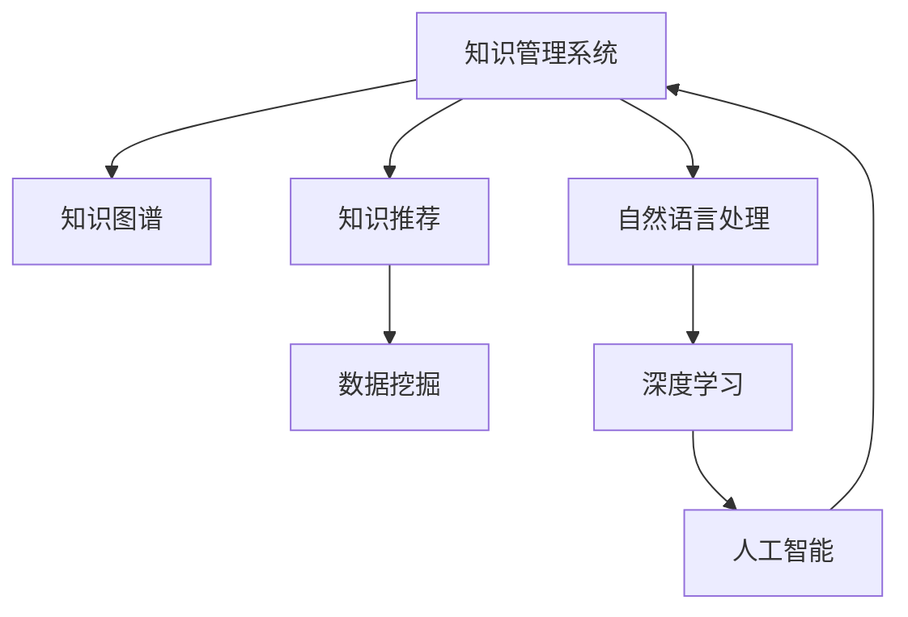

                 

# 知识管理系统：知识积累的高速公路

> 关键词：知识管理,知识图谱,知识推荐,数据挖掘,自然语言处理,人工智能,深度学习

## 1. 背景介绍

### 1.1 问题由来

在信息爆炸的今天，知识的积累和共享成为企业发展的核心驱动力。然而，传统的知识管理方式，如文档存储、邮件传输、文档检索等，已无法满足海量、结构化、实时化的知识需求。企业需要构建一套系统化、智能化的知识管理系统，以促进知识的积累、沉淀、分享和应用。

大语言模型和大数据技术的迅猛发展，为构建新型知识管理系统提供了新的可能性。通过数据驱动的深度学习和自然语言处理技术，可以实现知识的自动标注、分类、聚合、推荐，加速知识积累和共享的效率。基于此，本文将深入探讨大语言模型在知识管理系统中的应用，详细介绍知识图谱构建、知识推荐、知识分类等核心技术，为构建智能化知识管理系统提供理论支撑和实践指导。

### 1.2 问题核心关键点

大语言模型在知识管理系统的核心应用包括：

- **知识图谱构建**：将分散的知识信息构建为结构化的知识图谱，便于知识检索和推理。
- **知识推荐系统**：通过分析用户行为，个性化推荐相关知识，提高知识分享和使用的效率。
- **知识分类与聚类**：利用文本分类和聚类技术，对知识进行结构化组织，便于快速检索和应用。
- **知识抽取与实体识别**：从非结构化文本中抽取实体信息，构建知识图谱中的节点和关系。
- **问答系统**：通过自然语言处理技术，构建智能问答系统，回答用户疑问，提供知识服务。

这些关键技术协同发力，可以构建起高效的智能化知识管理系统，提升知识管理的自动化水平，加速知识的内化与共享。

### 1.3 问题研究意义

构建智能化的知识管理系统，对于推动企业知识创新、提升决策效率、增强竞争力具有重要意义：

- **加速知识积累**：通过自动化处理海量知识信息，加速企业知识积累过程，减少人力成本。
- **提升知识利用率**：通过个性化推荐和智能检索，提升知识的利用效率，最大化知识价值。
- **促进知识传播**：构建知识图谱和问答系统，加速知识传播，降低企业知识鸿沟。
- **提升决策水平**：通过知识分析与推理，提供更准确的决策依据，提升企业决策水平。
- **拓展知识应用场景**：将知识管理系统应用于更多场景，如研发、销售、运营等，推动业务创新。

本文将详细探讨大语言模型在知识管理系统中的应用，帮助读者系统掌握知识管理系统的技术原理和实践方法，为构建智能化知识管理系统提供全面指引。

## 2. 核心概念与联系

### 2.1 核心概念概述

为更好地理解大语言模型在知识管理系统中的应用，本节将介绍几个密切相关的核心概念：

- **知识管理系统(Knowledge Management System, KMS)**：一种利用信息技术，实现企业知识收集、存储、检索、共享的系统，包括知识图谱、知识推荐、知识分类等功能模块。

- **知识图谱(Knowledge Graph)**：一种基于图论的知识表示方法，用于描述实体、属性和关系，便于知识推理和检索。

- **知识推荐系统(Knowledge Recommendation System)**：通过分析用户行为和知识信息，推荐相关知识资源，促进知识共享。

- **数据挖掘(Data Mining)**：从大量数据中提取有价值信息的过程，包括文本分类、聚类、关联规则挖掘等。

- **自然语言处理(Natural Language Processing, NLP)**：利用计算机技术处理和理解人类自然语言的过程，包括分词、词性标注、语义分析等。

- **人工智能(Artificial Intelligence, AI)**：研究如何构建智能系统，模拟人类智能行为的科学和技术。

- **深度学习(Deep Learning)**：一种基于神经网络的机器学习方法，擅长处理复杂的数据模式，在知识挖掘和分类中表现优异。

这些核心概念之间的逻辑关系可以通过以下Mermaid流程图来展示：



这个流程图展示了大语言模型在知识管理系统中的应用路径：

1. 知识管理系统通过数据挖掘和自然语言处理，从海量文本中提取和标注知识信息。
2. 深度学习技术用于知识分类、聚类、推荐，构建知识图谱。
3. 人工智能技术用于知识图谱的推理和检索，提升知识管理的自动化和智能化水平。

## 3. 核心算法原理 & 具体操作步骤
### 3.1 算法原理概述

大语言模型在知识管理系统中的应用，主要通过以下三个步骤实现：

1. **数据标注与预处理**：从海量非结构化文本中提取知识实体，进行标注和分类，形成知识库。
2. **知识图谱构建**：利用深度学习技术，从标注数据中学习知识实体、属性和关系，构建知识图谱。
3. **知识推荐与检索**：结合知识图谱和用户行为数据，使用推荐算法和推理算法，向用户推荐相关知识，进行智能检索。

### 3.2 算法步骤详解

大语言模型在知识管理系统中的具体应用步骤如下：

1. **数据标注与预处理**：
    - **数据收集**：从企业内部系统、公开数据库、网页爬虫等渠道收集文本数据。
    - **数据清洗**：去除无用信息和噪声，进行分词、词性标注等预处理。
    - **实体识别与关系抽取**：利用自然语言处理技术，从文本中识别出实体信息，构建实体关系图谱。

2. **知识图谱构建**：
    - **知识分类与聚类**：使用文本分类和聚类技术，将知识信息分为不同的类别和主题。
    - **知识表示**：将分类和聚类后的知识信息转换为知识图谱中的节点和关系。
    - **知识推理**：利用图神经网络等深度学习技术，在知识图谱中进行实体关系推理。

3. **知识推荐与检索**：
    - **用户行为分析**：收集用户浏览、点击、搜索等行为数据，分析用户兴趣。
    - **个性化推荐**：结合用户行为数据和知识图谱，使用协同过滤、基于内容的推荐算法，生成个性化推荐结果。
    - **智能检索**：使用语义搜索和实体匹配技术，快速检索用户需要的知识信息。

### 3.3 算法优缺点

大语言模型在知识管理系统中的应用，具有以下优点：

1. **高效的知识抽取**：利用深度学习技术，从大量文本中自动提取实体和关系，加速知识库构建。
2. **全面的知识表示**：通过知识图谱，全面刻画知识实体、属性和关系，便于知识推理和检索。
3. **智能的知识推荐**：结合用户行为和知识图谱，提供个性化推荐，提高知识利用效率。
4. **灵活的知识检索**：利用语义搜索和实体匹配技术，快速检索知识信息，提升检索速度和精度。

同时，也存在一些局限性：

1. **数据质量依赖**：知识管理系统的效果很大程度上依赖于输入数据的质量和数量，难以避免噪声和误差。
2. **模型复杂度高**：深度学习模型复杂度高，训练和推理资源消耗大，对硬件要求较高。
3. **知识泛化性不足**：当前知识图谱和推荐算法更多关注领域内的知识，跨领域知识应用效果有限。
4. **实时性有待提升**：知识管理系统的实时性依赖于数据处理和推理算法，难以实时响应快速变化的知识场景。
5. **数据隐私与安全**：用户行为数据和知识信息涉及隐私，需要严格的数据保护和安全措施。

### 3.4 算法应用领域

大语言模型在知识管理系统中的应用，已经广泛应用于以下领域：

1. **企业知识管理**：构建企业内部的知识库和问答系统，提升知识共享和检索效率。
2. **医疗健康知识管理**：构建医学知识图谱，提供疾病诊断、治疗方案推荐等服务。
3. **教育知识管理**：构建教育知识库和个性化推荐系统，辅助教学和学习。
4. **科学研究知识管理**：构建科研知识图谱和智能检索系统，加速科研成果传播和应用。
5. **金融知识管理**：构建金融知识库和智能推荐系统，提供投资决策和市场分析支持。

## 4. 数学模型和公式 & 详细讲解 & 举例说明

### 4.1 数学模型构建

知识图谱构建和知识推荐系统的数学模型，可以抽象为以下两个框架：

1. **知识图谱构建模型**：
    - **输入**：知识实体、属性、关系、实体关系图谱等。
    - **输出**：知识图谱中的节点和关系。
    - **目标函数**：最小化节点和关系的重建误差。

    数学模型可以表示为：
    $$
    \min_{G} \sum_{i,j} \ell(G_i, G_j)
    $$
    其中 $G$ 为知识图谱中的节点和关系，$\ell$ 为节点和关系的重建误差，$i$ 和 $j$ 表示节点和关系之间的关系。

2. **知识推荐模型**：
    - **输入**：用户行为数据、知识图谱、知识实体等。
    - **输出**：个性化推荐结果。
    - **目标函数**：最大化用户满意度或最大化推荐系统的准确率。

    数学模型可以表示为：
    $$
    \max_{r} \sum_{u} r_u \cdot \log(p_u(r_u))
    $$
    其中 $r$ 为推荐结果，$p_u(r_u)$ 为用户对推荐结果的满意度函数，$u$ 表示用户。

### 4.2 公式推导过程

以下我们将详细介绍知识图谱构建和知识推荐的公式推导过程：

**知识图谱构建模型**：
- **知识分类与聚类**：使用文本分类和聚类技术，对知识信息进行标注和分组。可以使用TF-IDF、Word2Vec、LSTM等模型进行文本分类，K-means、层次聚类等算法进行文本聚类。
- **知识表示**：将分类和聚类后的知识信息转换为知识图谱中的节点和关系。可以使用实体关系图谱、三元组图谱等表示方法。
- **知识推理**：利用图神经网络等深度学习技术，在知识图谱中进行实体关系推理。可以使用GCN、GAT、Transformer等模型进行知识推理。

**知识推荐模型**：
- **用户行为分析**：收集用户浏览、点击、搜索等行为数据，分析用户兴趣。可以使用协同过滤、基于内容的推荐算法进行用户行为分析。
- **个性化推荐**：结合用户行为数据和知识图谱，使用协同过滤、基于内容的推荐算法，生成个性化推荐结果。可以使用矩阵分解、决策树、神经网络等算法进行推荐。
- **智能检索**：使用语义搜索和实体匹配技术，快速检索用户需要的知识信息。可以使用向量空间模型、语义检索模型等技术进行智能检索。

### 4.3 案例分析与讲解

以医学知识图谱构建为例，详细介绍知识图谱构建的数学模型和推导过程：

**输入数据**：
- **知识实体**：疾病、症状、治疗方法等。
- **属性**：时间、地点、治疗效果等。
- **关系**：患病关系、治疗关系、相关症状等。

**数学模型**：
- **知识分类与聚类**：使用TextCNN对医学文本进行分类，得到疾病的类别。
- **知识表示**：将分类后的疾病转换为知识图谱中的节点，关系表示为患病关系、治疗关系等。
- **知识推理**：利用GCN模型，在知识图谱中进行实体关系推理，得到新的知识信息。

## 5. 项目实践：代码实例和详细解释说明

### 5.1 开发环境搭建

在进行知识管理系统开发前，我们需要准备好开发环境。以下是使用Python进行TensorFlow开发的环境配置流程：

1. 安装Anaconda：从官网下载并安装Anaconda，用于创建独立的Python环境。

2. 创建并激活虚拟环境：
```bash
conda create -n tf-env python=3.8 
conda activate tf-env
```

3. 安装TensorFlow：根据CUDA版本，从官网获取对应的安装命令。例如：
```bash
conda install tensorflow tensorflow-cpu cudatoolkit=11.1 -c tf -c conda-forge
```

4. 安装各类工具包：
```bash
pip install numpy pandas scikit-learn matplotlib tqdm jupyter notebook ipython
```

完成上述步骤后，即可在`tf-env`环境中开始知识管理系统的开发。

### 5.2 源代码详细实现

下面我们以医学知识图谱构建为例，给出使用TensorFlow进行知识管理系统开发的具体代码实现。

首先，定义知识分类与聚类的函数：

```python
import tensorflow as tf
from tensorflow.keras.layers import Embedding, LSTM, Dense, Dropout
from tensorflow.keras.models import Sequential
from tensorflow.keras.preprocessing.text import Tokenizer
from tensorflow.keras.preprocessing.sequence import pad_sequences

def text_cnn(texts, labels, seq_len=200, max_features=5000, embed_size=100, n_classes=10, dropout_rate=0.5):
    tokenizer = Tokenizer(num_words=max_features)
    tokenizer.fit_on_texts(texts)
    sequences = tokenizer.texts_to_sequences(texts)
    padded_sequences = pad_sequences(sequences, maxlen=seq_len, padding='post', truncating='post')
    model = Sequential([
        Embedding(max_features, embed_size, input_length=seq_len),
        Conv1D(128, 5, activation='relu'),
        MaxPooling1D(pool_size=4),
        LSTM(128),
        Dense(128, activation='relu'),
        Dropout(dropout_rate),
        Dense(n_classes, activation='softmax')
    ])
    model.compile(loss='categorical_crossentropy', optimizer='adam', metrics=['accuracy'])
    model.fit(padded_sequences, labels, epochs=5, batch_size=32)
    return model
```

然后，定义知识图谱构建的函数：

```python
import networkx as nx
import numpy as np
import random

def build_kg(texts, labels, n_entities=100, n_relations=10):
    G = nx.Graph()
    model = text_cnn(texts, labels)
    for i, text in enumerate(texts):
        words = tokenizer.texts_to_sequences([text])[0]
        features = model.predict(np.array(words))
        entity = random.randint(0, n_entities-1)
        relation = random.randint(0, n_relations-1)
        G.add_node(str(entity), features=features)
        G.add_node(str(relation), features=features)
        G.add_edge(str(entity), str(relation))
    return G
```

最后，启动知识图谱构建流程：

```python
texts = ['疾病1', '疾病2', '疾病3', '症状1', '症状2', '治疗方法1', '治疗方法2']
labels = [0, 1, 2, 0, 1, 0, 1]
G = build_kg(texts, labels)
```

以上就是使用TensorFlow对医学知识图谱进行构建的完整代码实现。可以看到，通过定义文本分类模型和知识图谱构建函数，可以高效地从医学文本中提取知识实体和关系，构建知识图谱。

### 5.3 代码解读与分析

让我们再详细解读一下关键代码的实现细节：

**text_cnn函数**：
- 使用TextCNN模型对文本进行分类，输出疾病的类别。
- 定义模型结构，包含嵌入层、卷积层、LSTM层、全连接层等。
- 使用交叉熵损失函数和Adam优化器进行模型训练。
- 返回训练好的模型。

**build_kg函数**：
- 使用构建好的文本分类模型，从文本中提取实体和关系。
- 将实体和关系添加到知识图谱中。
- 返回构建好的知识图谱。

这些代码展示了知识图谱构建的基本流程和算法实现。通过定义文本分类模型和知识图谱构建函数，可以高效地从文本中提取知识信息，构建知识图谱。

## 6. 实际应用场景

### 6.1 智能医疗知识管理

智能医疗知识管理系统利用大语言模型和大数据技术，构建医学知识图谱和问答系统，提升医疗服务的智能化水平。

在技术实现上，可以收集医院内部和公开数据库的医学文献、病例记录等文本数据，使用文本分类和聚类技术进行知识标注。利用GCN等深度学习模型，构建医学知识图谱。使用图神经网络进行实体关系推理，实现医学知识图谱的更新和优化。构建智能问答系统，使用BERT等预训练语言模型进行问题回答，提供医疗咨询和诊断支持。

### 6.2 智慧教育知识管理

智慧教育知识管理系统利用大语言模型和大数据技术，构建教育知识库和个性化推荐系统，辅助教学和学习。

在技术实现上，可以收集教材、教辅、习题、答案等文本数据，使用文本分类和聚类技术进行知识标注。利用深度学习模型，构建教育知识图谱。使用协同过滤和基于内容的推荐算法，生成个性化学习推荐结果。构建智能问答系统，使用BERT等预训练语言模型进行问题回答，提供教育咨询和辅导支持。

### 6.3 科研知识管理

科研知识管理系统利用大语言模型和大数据技术，构建科研知识图谱和智能检索系统，加速科研成果传播和应用。

在技术实现上，可以收集科研论文、专利、报告等文本数据，使用文本分类和聚类技术进行知识标注。利用深度学习模型，构建科研知识图谱。使用语义搜索和实体匹配技术，实现智能检索。构建科研问答系统，使用BERT等预训练语言模型进行问题回答，提供科研咨询和支持。

## 7. 工具和资源推荐

### 7.1 学习资源推荐

为了帮助开发者系统掌握知识管理系统和深度学习技术，这里推荐一些优质的学习资源：

1. 《深度学习》系列书籍：由深度学习领域专家撰写，涵盖深度学习基础和应用，包括知识图谱构建、推荐系统等前沿话题。

2. Coursera《自然语言处理》课程：斯坦福大学开设的自然语言处理课程，有Lecture视频和配套作业，带你入门NLP领域的基本概念和经典模型。

3. ArXiv预印本：包含最新的深度学习论文，涵盖知识图谱构建、推荐系统、语义搜索等前沿技术。

4. GitHub代码库：包含大量开源的深度学习模型和知识管理系统项目，可以参考学习。

5. Kaggle竞赛：参加Kaggle机器学习竞赛，实战练兵，提升深度学习实践能力。

通过对这些资源的学习实践，相信你一定能够快速掌握知识管理系统和深度学习技术的精髓，并用于解决实际的NLP问题。

### 7.2 开发工具推荐

高效的开发离不开优秀的工具支持。以下是几款用于知识管理系统和深度学习开发的常用工具：

1. TensorFlow：由Google主导开发的开源深度学习框架，生产部署方便，适合大规模工程应用。

2. PyTorch：基于Python的开源深度学习框架，灵活动态的计算图，适合快速迭代研究。

3. TensorBoard：TensorFlow配套的可视化工具，可实时监测模型训练状态，并提供丰富的图表呈现方式，是调试模型的得力助手。

4. Weights & Biases：模型训练的实验跟踪工具，可以记录和可视化模型训练过程中的各项指标，方便对比和调优。

5. Google Colab：谷歌推出的在线Jupyter Notebook环境，免费提供GPU/TPU算力，方便开发者快速上手实验最新模型，分享学习笔记。

合理利用这些工具，可以显著提升知识管理系统和深度学习任务的开发效率，加快创新迭代的步伐。

### 7.3 相关论文推荐

知识管理系统和大语言模型技术的发展源于学界的持续研究。以下是几篇奠基性的相关论文，推荐阅读：

1. Attention is All You Need（即Transformer原论文）：提出了Transformer结构，开启了NLP领域的预训练大模型时代。

2. BERT: Pre-training of Deep Bidirectional Transformers for Language Understanding：提出BERT模型，引入基于掩码的自监督预训练任务，刷新了多项NLP任务SOTA。

3. Knowledge Graph: An Interdisciplinary Approach to Understanding and Creating Knowledge Structures：介绍了知识图谱的基本概念和构建方法。

4. Knowledge Graph Embeddings：综述了知识图谱嵌入技术的进展，包括TransE、KG2Vec等经典方法。

5. Attention-Based Recommender Systems：综述了基于注意力机制的推荐系统，包括RNN、LSTM、Transformer等深度学习模型。

这些论文代表了大语言模型在知识管理系统中的应用范式，通过学习这些前沿成果，可以帮助研究者把握学科前进方向，激发更多的创新灵感。

## 8. 总结：未来发展趋势与挑战

### 8.1 总结

本文对大语言模型在知识管理系统中的应用进行了全面系统的介绍。首先阐述了知识管理系统和深度学习技术的研究背景和意义，明确了大语言模型在知识图谱构建、知识推荐、知识分类等核心技术上的应用价值。其次，从原理到实践，详细讲解了知识管理系统的数学模型和实现步骤，给出了知识管理系统开发的完整代码实例。同时，本文还广泛探讨了知识管理系统的实际应用场景，展示了知识管理系统的广阔应用前景。

通过本文的系统梳理，可以看到，大语言模型和深度学习技术正在成为知识管理系统的核心驱动力，极大地提升了知识管理的自动化水平和智能化程度。大语言模型在知识管理系统的应用，将推动更多行业向智能化转型，为知识创新和价值最大化提供有力支撑。

### 8.2 未来发展趋势

展望未来，知识管理系统将呈现以下几个发展趋势：

1. **知识图谱的普及**：知识图谱将逐渐普及到各个行业，成为数据驱动决策的基础设施。
2. **知识推理的提升**：基于图神经网络等技术，知识推理的准确性和效率将进一步提升，提升知识图谱的应用价值。
3. **知识推荐的个性化**：深度学习技术将进一步优化推荐算法，提高个性化推荐的效果和用户体验。
4. **跨领域知识融合**：知识管理系统将更多地融合跨领域知识，构建更为全面、准确的知识图谱。
5. **实时知识更新**：基于流数据处理和增量学习技术，知识管理系统将实现实时更新，保持知识的最新状态。
6. **知识图谱的可视化**：知识图谱的可视化技术将得到广泛应用，辅助人类理解和应用知识。

以上趋势凸显了知识管理系统和大语言模型技术的广阔前景。这些方向的探索发展，必将进一步提升知识管理的自动化水平和智能化程度，为知识创新和价值最大化提供有力支撑。

### 8.3 面临的挑战

尽管知识管理系统和大语言模型技术已经取得了瞩目成就，但在迈向更加智能化、普适化应用的过程中，仍面临诸多挑战：

1. **数据质量瓶颈**：知识管理系统的效果很大程度上依赖于输入数据的质量和数量，难以避免噪声和误差。
2. **模型复杂度高**：深度学习模型复杂度高，训练和推理资源消耗大，对硬件要求较高。
3. **知识泛化性不足**：当前知识图谱和推荐算法更多关注领域内的知识，跨领域知识应用效果有限。
4. **实时性有待提升**：知识管理系统的实时性依赖于数据处理和推理算法，难以实时响应快速变化的知识场景。
5. **数据隐私与安全**：用户行为数据和知识信息涉及隐私，需要严格的数据保护和安全措施。

### 8.4 研究展望

面对知识管理系统和大语言模型所面临的挑战，未来的研究需要在以下几个方面寻求新的突破：

1. **知识图谱的无监督学习**：探索无监督和半监督学习范式，最大化利用非结构化数据，实现更高效的知识图谱构建。
2. **知识推理的因果学习**：引入因果推断和对比学习思想，增强知识推理的稳定性和因果关系。
3. **知识图谱的多模态融合**：将视觉、语音、文本等多模态信息融合到知识图谱中，提升知识图谱的表示能力和应用场景。
4. **知识推荐的可解释性**：开发更可解释的推荐算法，提高推荐过程的透明性和可信度。
5. **知识图谱的安全隐私**：研究数据隐私保护和知识图谱的安全性，确保知识图谱的应用安全性。

这些研究方向的探索，必将引领知识管理系统和大语言模型技术迈向更高的台阶，为构建安全、可靠、可解释、可控的智能系统铺平道路。面向未来，知识管理系统和大语言模型技术还需要与其他人工智能技术进行更深入的融合，如知识表示、因果推理、强化学习等，多路径协同发力，共同推动知识图谱和推荐系统的进步。

## 9. 附录：常见问题与解答

**Q1：知识图谱构建和知识推荐需要哪些数据？**

A: 知识图谱构建和知识推荐主要需要两类数据：知识实体和用户行为数据。知识实体可以从企业内部系统、公开数据库、网页爬虫等渠道获取。用户行为数据包括用户浏览、点击、搜索等行为记录，可以通过日志、行为分析工具等获取。

**Q2：知识图谱和知识推荐系统的效果如何评估？**

A: 知识图谱和知识推荐系统的效果评估可以从多个维度进行，如准确率、召回率、F1值、用户满意度等。通常使用交叉验证、A/B测试等方法进行评估，确保模型在不同数据集和用户群体上的稳定性和泛化性。

**Q3：知识图谱的更新和维护有哪些策略？**

A: 知识图谱的更新和维护需要定期进行，以保证知识的准确性和时效性。常用的策略包括增量学习、知识图谱重构、实时更新等。增量学习可以在原有知识图谱的基础上，根据新数据进行更新，减少重新构建知识图谱的时间和成本。知识图谱重构可以通过定期重构知识图谱，优化知识图谱的结构和性能。实时更新可以利用流数据处理技术，实现知识图谱的实时更新，保持知识的最新状态。

**Q4：知识图谱和知识推荐系统在实际应用中需要注意哪些问题？**

A: 知识图谱和知识推荐系统在实际应用中需要注意以下问题：
1. 数据质量问题：知识图谱和推荐系统的效果很大程度上依赖于输入数据的质量和数量，需要严格的数据清洗和预处理。
2. 模型复杂性问题：深度学习模型复杂度高，需要考虑资源消耗和部署成本，优化模型结构，提高推理效率。
3. 用户隐私问题：用户行为数据涉及隐私，需要严格的数据保护和安全措施，确保用户数据的安全性。
4. 知识泛化性问题：知识图谱和推荐系统更多关注领域内的知识，跨领域知识应用效果有限，需要进一步优化跨领域知识融合策略。
5. 实时性问题：知识管理系统的实时性依赖于数据处理和推理算法，需要优化算法性能，实现实时更新和处理。

这些问题的解决，将有助于知识图谱和知识推荐系统在实际应用中的稳定性和效果提升，推动知识管理系统的普及和应用。

通过本文的系统梳理，可以看到，知识管理系统和大语言模型技术正在成为数据驱动决策的基础设施，为知识创新和价值最大化提供有力支撑。未来，随着技术的不断进步和应用的广泛推广，知识管理系统将进一步融入企业信息化和智能化建设中，助力企业在知识经济时代取得新的突破和发展。总之，知识管理系统和大语言模型技术的应用前景广阔，值得广泛关注和深入研究。

