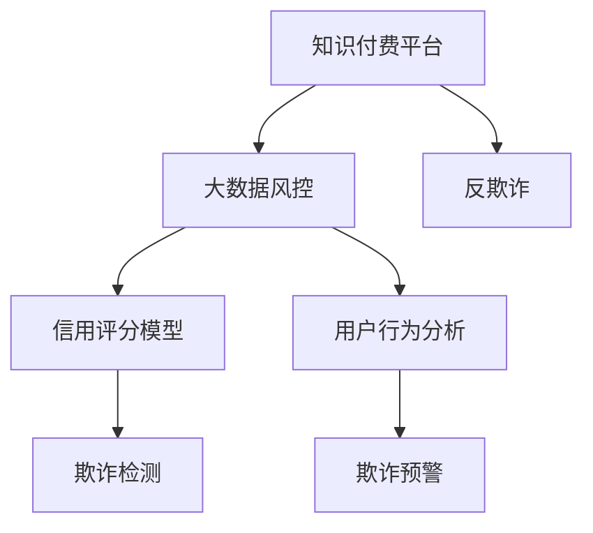

                 

# 知识经济下知识付费的大数据风控与反欺诈

> 关键词：知识付费,大数据风控,反欺诈,信用评分模型,用户行为分析

## 1. 背景介绍

随着知识经济时代的到来，越来越多的人开始通过在线课程、电子书、付费问答等方式获取知识和技能，知识付费平台如雨后春笋般涌现。但随之而来的问题是，平台面临大量用户同时在线，支付交易频繁，欺诈行为频发。如何高效防范欺诈，保障知识付费业务的顺利运行，成为各大知识付费平台急需解决的难题。

本文章将深入探讨知识付费平台在大数据风控与反欺诈方面面临的挑战，介绍大数据风控的基本原理，阐述如何构建和优化信用评分模型，以及如何在平台运营中应用用户行为分析进行实时反欺诈。希望通过本文的学习，为知识付费平台提供一些切实可行的解决方案，为知识的传播提供更安全可靠的保障。

## 2. 核心概念与联系

### 2.1 核心概念概述

为更好地理解大数据风控与反欺诈方法，本节将介绍几个密切相关的核心概念：

- **知识付费平台(Knowledge Payload Platforms)**：指基于互联网，提供知识付费服务，如在线课程、电子书、付费问答等的平台。知识付费平台通过知识产品的付费机制，鼓励用户积极获取和传播知识。

- **大数据风控(Big Data Risk Control)**：指利用大数据技术，对平台交易进行风险控制的过程。大数据风控通常结合用户历史数据、行为数据、环境数据等多源数据，通过数据挖掘和机器学习等方法，进行风险预测和评估。

- **信用评分模型(Credit Scoring Model)**：指通过对用户的历史行为数据进行分析，构建数学模型，预测用户未来的支付能力和还款意愿。常用的信用评分模型包括线性回归、逻辑回归、决策树、随机森林、神经网络等。

- **用户行为分析(User Behavior Analysis)**：指通过分析用户在知识付费平台上的行为数据，识别潜在风险用户，从而进行实时反欺诈和欺诈预警。

- **反欺诈(Fraud Detection)**：指通过技术手段，识别和防范欺诈行为，保护平台和用户的合法权益。反欺诈通常分为事前预防、事中检测、事后追踪三个阶段。

这些核心概念之间的逻辑关系可以通过以下Mermaid流程图来展示：



这个流程图展示了大数据风控与反欺诈的核心概念及其之间的关系：

1. 知识付费平台通过大数据风控手段，构建信用评分模型和用户行为分析模型。
2. 信用评分模型用于预测用户的支付能力和还款意愿，构建用户信用画像。
3. 用户行为分析用于实时监控用户行为，识别潜在欺诈行为。
4. 欺诈检测和预警系统用于实时检测和应对欺诈行为，保护平台和用户。

这些概念共同构成了大数据风控与反欺诈系统的框架，使得知识付费平台能够更加准确地识别和防范欺诈行为。

## 3. 核心算法原理 & 具体操作步骤
### 3.1 算法原理概述

知识付费平台的大数据风控与反欺诈系统，本质上是一个利用大数据和机器学习技术，进行风险预测和防范的系统。其核心思想是：通过收集和分析用户在平台上的各类数据，构建模型，预测其未来的支付行为和风险等级，进而制定相应的风控策略。

形式化地，假设知识付费平台的数据集为 $D=\{(x_i,y_i)\}_{i=1}^N$，其中 $x_i$ 表示用户的历史行为数据，$y_i$ 表示用户的支付行为（是否支付成功），$N$ 为数据集大小。目标是找到最优的模型 $M_{\theta}$，使得模型预测的支付结果与实际结果尽量接近，即最小化预测误差 $\epsilon$：

$$
\theta^* = \mathop{\arg\min}_{\theta} \epsilon(M_{\theta},D)
$$

其中，$\epsilon$ 为预测误差，可以通过交叉熵损失、平均绝对误差等方法进行量化。

### 3.2 算法步骤详解

知识付费平台的大数据风控与反欺诈系统主要包括以下几个关键步骤：

**Step 1: 数据收集与预处理**
- 收集用户的历史行为数据，包括注册时间、登录频率、浏览行为、购买记录、支付失败记录等。
- 清洗数据，处理缺失值、异常值，标准化数据格式。
- 将数据集划分为训练集、验证集和测试集，便于模型训练、调参和评估。

**Step 2: 构建信用评分模型**
- 选择合适的机器学习算法，如逻辑回归、决策树、随机森林、神经网络等，构建信用评分模型。
- 通过模型训练，学习用户历史行为与支付行为之间的关系，得到用户的信用评分。
- 将信用评分模型嵌入到知识付费平台，实时预测用户新行为的支付结果。

**Step 3: 用户行为分析**
- 通过分析用户行为数据，识别出可能存在欺诈风险的行为模式。
- 使用统计分析、规则引擎、机器学习等技术，构建用户行为分析模型。
- 实时监控用户行为，识别异常行为，进行欺诈预警。

**Step 4: 欺诈检测与预警**
- 实时检测用户行为数据，发现异常行为。
- 使用异常检测算法（如孤立森林、异常值检测等）进行欺诈行为识别。
- 对高风险用户进行实时预警，采取措施，如限制交易、联系用户等。

**Step 5: 模型评估与优化**
- 在测试集上评估模型的预测准确率、召回率、F1值等指标，优化模型性能。
- 定期更新模型参数，重新训练信用评分和用户行为分析模型。
- 对历史欺诈数据进行再训练，提高模型的鲁棒性。

### 3.3 算法优缺点

知识付费平台的大数据风控与反欺诈系统，具有以下优点：

1. **高效性**：利用大数据技术，实时分析用户行为，及时发现和处理欺诈行为，保障平台安全。
2. **准确性**：通过信用评分和行为分析，建立用户信用画像，准确预测支付行为，减少误判。
3. **通用性**：应用于各种知识付费平台，可以适应不同的业务场景和数据特点。
4. **灵活性**：模型可以根据业务需求进行动态调整，灵活应对各类欺诈行为。

同时，该方法也存在一定的局限性：

1. **数据依赖性**：系统的性能很大程度上取决于数据的质量和量级，需要平台收集和处理大量的用户行为数据。
2. **隐私问题**：用户在平台上的行为数据涉及隐私，处理和存储过程中需要严格遵守数据保护法规。
3. **复杂度**：构建和优化模型需要高水平的算法和数据处理能力，有一定技术门槛。
4. **动态变化**：用户行为数据和欺诈手段会不断变化，模型需要持续更新以应对新威胁。

尽管存在这些局限性，但就目前而言，基于大数据的风控与反欺诈系统仍是知识付费平台重要的安全保障手段。未来相关研究的重点在于如何进一步降低系统的数据依赖，提高模型的通用性和自适应能力，同时兼顾隐私保护和安全性。

### 3.4 算法应用领域

知识付费平台的大数据风控与反欺诈系统，已在多个领域得到应用，例如：

1. **在线课程平台**：识别和防范在线课程订阅、购买过程中的欺诈行为，保障课程购买和支付安全。
2. **电子书购买平台**：监测电子书购买过程中的欺诈行为，防止盗版和恶意行为。
3. **付费问答平台**：识别和防范付费问答咨询过程中的欺诈行为，保障问答服务的质量和安全。
4. **技能培训平台**：防范技能培训课程购买过程中的欺诈行为，保障培训资源的正常流通和学员权益。

此外，知识付费平台的大数据风控与反欺诈系统，也为各行各业的知识付费提供了参考范式，推动了知识付费业务的健康发展。

## 4. 数学模型和公式 & 详细讲解 & 举例说明

### 4.1 数学模型构建

本节将使用数学语言对知识付费平台的大数据风控与反欺诈系统进行更加严格的刻画。

假设知识付费平台的用户行为数据为 $X=\{x_1, x_2, \ldots, x_n\}$，支付行为为 $Y=\{y_1, y_2, \ldots, y_n\}$，其中 $x_i$ 表示第 $i$ 个用户的第 $k$ 个行为特征，$y_i$ 表示该用户的支付结果。

定义信用评分模型为 $M_{\theta}(X)=\theta_0+\sum_{k=1}^K \theta_k x_k$，其中 $\theta_0$ 为截距，$\theta_k$ 为第 $k$ 个特征的系数，$K$ 为特征维度。

构建用户信用评分的过程，可以看作是求解最小二乘问题的过程，即：

$$
\theta^* = \mathop{\arg\min}_{\theta} \frac{1}{N} \sum_{i=1}^N (y_i - M_{\theta}(x_i))^2
$$

通过求解上述优化问题，得到最优的模型参数 $\theta^*$。

### 4.2 公式推导过程

假设 $y_i$ 只有两个取值（支付成功或失败），模型 $M_{\theta}$ 为逻辑回归模型，则损失函数为：

$$
\ell(M_{\theta}(x),y) = -y \log M_{\theta}(x) - (1-y) \log(1-M_{\theta}(x))
$$

将 $M_{\theta}(x)=\theta_0+\sum_{k=1}^K \theta_k x_k$ 代入上式，得：

$$
\ell(\theta_0,\theta_k,x,y) = -y (\theta_0+\sum_{k=1}^K \theta_k x_k) - (1-y) (1-\theta_0-\sum_{k=1}^K \theta_k x_k)
$$

进一步展开，得：

$$
\ell(\theta_0,\theta_k,x,y) = \theta_0 y - y\sum_{k=1}^K \theta_k x_k - (1-\theta_0) (1-y) + (1-y)\sum_{k=1}^K \theta_k x_k
$$

将上式简化，得：

$$
\ell(\theta_0,\theta_k,x,y) = \theta_0 y - (1-y) + y\sum_{k=1}^K (\theta_k x_k)
$$

对 $\theta_0$ 和 $\theta_k$ 求偏导，得：

$$
\frac{\partial \ell(\theta_0,\theta_k,x,y)}{\partial \theta_0} = y - (1-y)
$$

$$
\frac{\partial \ell(\theta_0,\theta_k,x,y)}{\partial \theta_k} = x_k y
$$

通过求解上述偏导数，即可得到最优的模型参数 $\theta^*$。

### 4.3 案例分析与讲解

假设知识付费平台有 $N$ 个用户，每个用户有 $K=3$ 个行为特征，通过信用评分模型 $M_{\theta}(X)=\theta_0+\theta_1 x_1+\theta_2 x_2+\theta_3 x_3$ 预测用户的支付行为，其中 $x_1$ 表示注册时间，$x_2$ 表示登录频率，$x_3$ 表示支付失败次数。

已知用户 $A$ 的注册时间为 $x_1=30$，登录频率为 $x_2=10$，支付失败次数为 $x_3=5$，则其信用评分为：

$$
\hat{y}_A = M_{\theta^*}(x_A) = \theta^*_0 + \theta^*_1 \cdot 30 + \theta^*_2 \cdot 10 + \theta^*_3 \cdot 5
$$

通过训练，得到最优参数 $\theta^*$，即可计算出用户 $A$ 的预测支付行为。

## 5. 项目实践：代码实例和详细解释说明
### 5.1 开发环境搭建

在进行大数据风控与反欺诈实践前，我们需要准备好开发环境。以下是使用Python进行Scikit-learn开发的环境配置流程：

1. 安装Anaconda：从官网下载并安装Anaconda，用于创建独立的Python环境。

2. 创建并激活虚拟环境：
```bash
conda create -n sklearn-env python=3.8 
conda activate sklearn-env
```

3. 安装Scikit-learn：
```bash
conda install scikit-learn
```

4. 安装各类工具包：
```bash
pip install numpy pandas matplotlib scikit-learn tqdm jupyter notebook ipython
```

完成上述步骤后，即可在`sklearn-env`环境中开始实践。

### 5.2 源代码详细实现

这里以逻辑回归模型为例，给出知识付费平台信用评分模型的代码实现。

首先，定义数据处理函数：

```python
import numpy as np
from sklearn.linear_model import LogisticRegression

def load_data(file_path):
    data = np.loadtxt(file_path, delimiter=',')
    X = data[:, :-1]
    y = data[:, -1]
    return X, y
```

然后，定义模型训练函数：

```python
def train_model(X, y, test_data_path, test_size=0.2):
    X_train, X_test, y_train, y_test = train_test_split(X, y, test_size=test_size)
    
    model = LogisticRegression()
    model.fit(X_train, y_train)
    
    print(f'Accuracy: {model.score(X_test, y_test)}')
    
    # 使用测试集进行预测
    test_data = load_data(test_data_path)
    X_test, y_test = test_data[:, :-1], test_data[:, -1]
    y_pred = model.predict(X_test)
    
    return y_pred
```

接着，启动训练流程：

```python
X, y = load_data('data.csv')
test_data_path = 'test_data.csv'

y_pred = train_model(X, y, test_data_path)
```

以上就是使用Scikit-learn进行逻辑回归模型训练的完整代码实现。可以看到，代码实现相对简洁，但涵盖了数据加载、模型训练、测试、预测等关键环节。

### 5.3 代码解读与分析

让我们再详细解读一下关键代码的实现细节：

**load_data函数**：
- 从文件中加载数据，返回特征矩阵和目标变量。

**train_model函数**：
- 使用train_test_split将数据集划分为训练集和测试集。
- 使用LogisticRegression模型进行训练。
- 在测试集上评估模型性能，并使用测试集进行预测。

**训练流程**：
- 加载数据集，启动训练流程。
- 调用train_model函数，在训练集上训练模型，并在测试集上评估模型性能。
- 最终得到模型预测结果。

可以看到，Scikit-learn提供了便捷的接口，使得构建信用评分模型变得简单易行。开发者可以在此基础上，根据具体业务需求进行模型优化和改进。

## 6. 实际应用场景

### 6.1 在线课程平台

在线课程平台面临大量用户同时订阅、购买课程的情况，欺诈行为（如虚假注册、盗刷、恶意评价等）频繁发生。通过大数据风控与反欺诈系统，可以有效识别和防范这些风险行为。

具体而言，可以收集用户注册信息、购买记录、支付失败记录等数据，构建信用评分模型。在用户进行新行为（如订阅课程、购买商品等）时，实时预测其支付结果，进行风险控制。对于高风险用户，采取相应的防范措施，如限制交易、提示支付失败等。

### 6.2 电子书购买平台

电子书购买平台同样面临欺诈风险，用户可能通过非法手段获取电子书，甚至盗版销售。通过大数据风控与反欺诈系统，可以有效识别和防范这些风险行为。

具体而言，可以收集用户注册信息、购买记录、支付失败记录等数据，构建信用评分模型。在用户进行新行为（如购买电子书、下载文件等）时，实时预测其支付结果，进行风险控制。对于高风险用户，采取相应的防范措施，如限制交易、提示支付失败等。

### 6.3 付费问答平台

付费问答平台主要通过问答服务收费，欺诈行为可能包括恶意提问、虚假支付等。通过大数据风控与反欺诈系统，可以有效识别和防范这些风险行为。

具体而言，可以收集用户注册信息、提问记录、支付记录等数据，构建信用评分模型。在用户进行新行为（如提问、支付等）时，实时预测其支付结果，进行风险控制。对于高风险用户，采取相应的防范措施，如限制交易、提示支付失败等。

### 6.4 未来应用展望

随着大数据风控与反欺诈技术的不断发展，其在知识付费平台中的应用前景将更加广阔。未来，该技术将进一步提升平台的运营效率，保障用户的合法权益，推动知识付费业务的持续健康发展。

## 7. 工具和资源推荐
### 7.1 学习资源推荐

为了帮助开发者系统掌握大数据风控与反欺诈的理论基础和实践技巧，这里推荐一些优质的学习资源：

1. 《Python机器学习》：由机器学习领域专家编写的经典书籍，系统讲解了机器学习的基本概念和算法。

2. 《深度学习》：斯坦福大学吴恩达教授的深度学习课程，涵盖深度学习的基本原理和实践技巧。

3. Kaggle平台：数据科学竞赛平台，提供丰富的数据集和代码样例，可进行实践练习。

4. PyTorch官方文档：PyTorch深度学习框架的官方文档，提供丰富的模型和算法实现，是学习深度学习的必备资源。

5. Scikit-learn官方文档：Scikit-learn机器学习库的官方文档，提供丰富的模型和算法实现，是学习机器学习的必备资源。

通过对这些资源的学习实践，相信你一定能够快速掌握大数据风控与反欺诈的精髓，并用于解决实际问题。

### 7.2 开发工具推荐

高效的开发离不开优秀的工具支持。以下是几款用于大数据风控与反欺诈开发的常用工具：

1. Python：广泛使用的高级编程语言，拥有丰富的机器学习库和数据处理工具。

2. Scikit-learn：Python机器学习库，提供丰富的机器学习算法和工具，方便模型构建和调参。

3. PyTorch：深度学习框架，提供灵活的计算图，适合复杂模型的训练和优化。

4. TensorFlow：谷歌开发的深度学习框架，提供强大的计算能力和丰富的模型库。

5. Pandas：Python数据分析库，提供便捷的数据处理和分析工具。

6. Jupyter Notebook：交互式编程环境，方便代码调试和可视化展示。

合理利用这些工具，可以显著提升大数据风控与反欺诈任务的开发效率，加快创新迭代的步伐。

### 7.3 相关论文推荐

大数据风控与反欺诈技术的发展源于学界的持续研究。以下是几篇奠基性的相关论文，推荐阅读：

1. "The Elements of Statistical Learning"：由统计学大师提出的经典机器学习书籍，涵盖多种机器学习算法。

2. "Machine Learning Yearning"：斯坦福大学Andrew Ng教授的机器学习实践指南，提供实用的机器学习建议和代码实现。

3. "Data Mining: Concepts and Techniques"：经典的数据挖掘教材，涵盖数据预处理、模型构建、评估等环节。

4. "Fraud Detection: Methods and Approaches"：介绍多种欺诈检测方法，涵盖规则、统计、机器学习等技术。

5. "Credit Scoring Models: Techniques and Applications"：介绍信用评分模型的构建和应用，涵盖线性回归、逻辑回归、神经网络等算法。

这些论文代表了大数据风控与反欺诈技术的发展脉络。通过学习这些前沿成果，可以帮助研究者把握学科前进方向，激发更多的创新灵感。

## 8. 总结：未来发展趋势与挑战

### 8.1 总结

本文对知识付费平台大数据风控与反欺诈方法进行了全面系统的介绍。首先阐述了知识付费平台在大数据风控与反欺诈方面面临的挑战，明确了大数据风控在保障平台安全、防范欺诈行为中的重要地位。其次，从原理到实践，详细讲解了信用评分模型的构建和优化方法，以及用户行为分析在实时反欺诈中的应用。最后，本文还介绍了相关开发工具和资源推荐，力求为知识付费平台提供一些切实可行的解决方案，为知识的传播提供更安全可靠的保障。

通过本文的系统梳理，可以看到，大数据风控与反欺诈技术在大数据时代的重要性，以及其在知识付费平台中的巨大潜力。未来，随着大数据技术和机器学习算法的不断发展，基于大数据的风控与反欺诈系统必将更加高效、准确、灵活，为知识付费平台的安全运营提供坚实保障。

### 8.2 未来发展趋势

展望未来，大数据风控与反欺诈技术将呈现以下几个发展趋势：

1. **模型集成和优化**：未来的风控模型将更加注重模型集成，通过结合多种算法和特征，提升模型的泛化能力和鲁棒性。同时，通过模型优化技术，如特征选择、正则化、深度学习等，进一步提升模型的性能。

2. **实时化处理**：随着实时数据处理技术的发展，未来的风控系统将更加注重实时化处理，及时发现和防范欺诈行为。这将需要更大规模的计算资源和更高效的算法支持。

3. **多模态融合**：未来的风控系统将更加注重多模态数据的融合，结合文本、图像、音频等多种数据源，提升对欺诈行为的识别能力。

4. **深度学习**：深度学习算法在风控领域的应用将更加广泛，尤其是在图像、音频等数据上，深度学习将提供更强大的特征提取和识别能力。

5. **联邦学习**：联邦学习技术将使得平台在保护用户隐私的同时，能够实时获取用户行为数据，进行风险评估和防范。

6. **自动化和智能化**：未来的风控系统将更加注重自动化和智能化，通过自动化流程和智能化算法，提升风控的效率和准确性。

这些趋势凸显了大数据风控与反欺诈技术的广阔前景，预示着知识付费平台的安全保障将更加全面、高效和智能化。

### 8.3 面临的挑战

尽管大数据风控与反欺诈技术已经取得了不小的进展，但在迈向更加智能化、普适化应用的过程中，它仍面临着诸多挑战：

1. **数据质量问题**：高质量的数据是风控模型的基础，但现实中数据的获取和处理往往存在诸多困难，数据质量难以保证。如何提高数据质量，是未来的一大挑战。

2. **模型鲁棒性不足**：模型对新数据和新威胁的适应能力有限，容易被新型的欺诈手段欺骗。如何提高模型的鲁棒性，是未来的一大课题。

3. **计算资源限制**：实时化处理需要大规模计算资源的支持，而平台的计算资源往往有限。如何优化算法，降低计算资源消耗，是未来的一大挑战。

4. **隐私保护问题**：用户在平台上的行为数据涉及隐私，如何平衡隐私保护和风险防范，是未来的一大挑战。

5. **动态变化问题**：用户行为和欺诈手段会不断变化，如何保持模型的更新和优化，是未来的一大挑战。

6. **自动化问题**：自动化流程和算法需要较高的技术门槛，如何降低技术门槛，提高系统的可操作性，是未来的一大挑战。

这些挑战凸显了大数据风控与反欺诈技术的发展瓶颈，需要学界和业界共同努力，持续推动技术进步。

### 8.4 研究展望

面对大数据风控与反欺诈所面临的诸多挑战，未来的研究需要在以下几个方面寻求新的突破：

1. **数据质量提升**：通过数据清洗、数据增强等技术，提升数据质量，保证模型训练的基础。

2. **模型鲁棒性增强**：引入鲁棒性提升技术，如对抗学习、数据增强、多模型融合等，提高模型的泛化能力和鲁棒性。

3. **计算资源优化**：引入高效的计算资源优化技术，如模型并行、分布式训练、异构计算等，降低计算资源消耗，提升实时处理能力。

4. **隐私保护加强**：引入隐私保护技术，如联邦学习、差分隐私、匿名化等，在保护用户隐私的同时，进行风险防范。

5. **动态调整机制**：引入动态调整机制，及时更新模型参数和特征，适应动态变化的用户行为和欺诈手段。

6. **自动化流程简化**：引入自动化流程简化技术，降低技术门槛，提高系统的可操作性。

这些研究方向将推动大数据风控与反欺诈技术的进一步发展，为知识付费平台的安全运营提供更加全面、高效、智能的保障。

## 9. 附录：常见问题与解答

**Q1：大数据风控与反欺诈技术是否适用于所有知识付费平台？**

A: 大数据风控与反欺诈技术在大多数知识付费平台上都能取得较好的效果，但需要根据平台的业务特点进行适当的调整。例如，对于需要进行个性化推荐和内容过滤的平台，需要对用户行为进行更深层次的分析和建模。

**Q2：如何选择合适的机器学习算法进行信用评分模型构建？**

A: 选择合适的机器学习算法需要考虑数据的特点和业务需求。一般来说，对于线性关系较强的数据，可以使用逻辑回归、线性回归等算法；对于非线性关系较强的数据，可以使用决策树、随机森林、神经网络等算法。可以通过模型评估和调参，选择最优的算法。

**Q3：大数据风控与反欺诈系统在应用过程中需要注意哪些问题？**

A: 在应用过程中，需要注意以下问题：
1. 数据隐私保护：严格遵守数据保护法规，保护用户隐私。
2. 模型鲁棒性：定期更新模型参数，保持模型的鲁棒性。
3. 计算资源优化：合理配置计算资源，降低计算成本。
4. 自动化流程：简化自动化流程，提高系统的可操作性。
5. 实时化处理：及时处理数据，提高实时响应能力。

**Q4：如何评估大数据风控与反欺诈系统的性能？**

A: 可以通过以下指标评估系统的性能：
1. 准确率（Accuracy）：预测正确的样本数占总样本数的比例。
2. 召回率（Recall）：预测正确的正样本数占实际正样本数的比例。
3. F1值（F1 Score）：准确率和召回率的调和平均数。
4. AUC值（Area Under the ROC Curve）：ROC曲线下的面积，衡量模型的分类能力。

**Q5：如何在实际应用中应用大数据风控与反欺诈技术？**

A: 在实际应用中，可以通过以下步骤应用大数据风控与反欺诈技术：
1. 数据收集与预处理：收集平台用户的行为数据，进行数据清洗和预处理。
2. 模型训练与优化：选择适合的机器学习算法，构建信用评分模型，进行模型训练和优化。
3. 实时监控与预警：实时监控用户行为数据，使用异常检测算法进行欺诈预警。
4. 风险控制与应对：对高风险用户采取相应的风险控制措施，如限制交易、提示支付失败等。

这些步骤将帮助知识付费平台构建高效、安全、智能的风控与反欺诈系统，保障平台的稳定运营和用户权益。

---

作者：禅与计算机程序设计艺术 / Zen and the Art of Computer Programming

