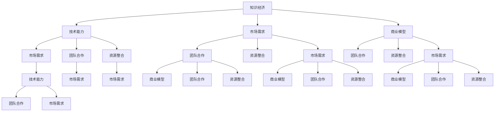

                 

# 知识经济下程序员的创业之路

## 1. 背景介绍

### 1.1 问题由来

随着互联网技术的蓬勃发展和智能手机的普及，信息技术正逐渐渗透到社会的各个领域。程序员作为信息时代的重要力量，不仅在技术领域贡献巨大，也在各行各业中扮演着越来越重要的角色。然而，传统的“雇佣制”就业模式已经无法满足新时代对程序员的需求，特别是在知识经济大背景下，如何利用自身优势创业成为程序员共同关注的焦点。

### 1.2 问题核心关键点

在知识经济时代，程序员的创业之路相较于以往更加复杂和多样化。核心关键点包括：
1. 技术能力：具备较强的技术积累和创新能力，能够独立开发和维护产品。
2. 市场洞察：对行业动态有敏锐的嗅觉，能够发现市场机会。
3. 商业思维：具备基本的商业意识和战略规划能力，能够将技术转化为商业价值。
4. 团队协作：能够组建或参与高效的创业团队，共同推动项目发展。
5. 资源整合：有效整合外部资源，如融资、合作伙伴、顾问等。

## 2. 核心概念与联系

### 2.1 核心概念概述

为更好地理解知识经济下程序员的创业之路，本节将介绍几个密切相关的核心概念：

- **知识经济**：指以知识创新、应用和扩散为核心的经济形态。与传统经济不同，知识经济更加注重知识和技术的驱动作用，而非单纯的物质资本积累。

- **程序员创业**：指利用自身编程和软件工程知识，结合市场需求，创办新型企业的活动。程序员创业可以是独立开发，也可以参与创业团队。

- **技术能力**：指程序员具备的编程技能、算法设计、系统架构等方面的知识。是创业成功的基石。

- **市场需求**：指目标市场中存在的用户需求和潜在机会。程序员需准确把握市场趋势，开发符合用户需求的产品。

- **商业模型**：指企业如何实现盈利、满足用户需求、创造价值的模式。程序员创业需制定合理的商业模式，以保障长期发展。

- **团队合作**：指创业者与合作伙伴、员工之间的协同工作和资源共享。高效的团队协作能够提升项目开发效率和质量。

- **资源整合**：指创业者如何有效利用和配置内外部资源，包括资金、技术、市场、人才等。资源整合能力强能够加速创业进程，提高成功率。

这些核心概念之间的逻辑关系可以通过以下Mermaid流程图来展示：



这个流程图展示了几大核心概念之间的联系：

1. 知识经济环境对技术能力提出了更高的要求。
2. 技术能力是满足市场需求的基础。
3. 市场需求推动了商业模型的创新。
4. 商业模型需要团队协作才能成功实施。
5. 资源整合是创业成功的重要保障。

## 3. 核心算法原理 & 具体操作步骤
### 3.1 算法原理概述

知识经济下程序员的创业之路，本质上是通过技术手段，将创新思想转化为实际产品的过程。其核心算法原理包括：

1. **问题分析与需求调研**：通过数据分析、用户访谈等方式，分析目标市场的需求和痛点，确定产品开发方向。

2. **技术选型与方案设计**：根据需求，选择合适的技术栈和解决方案，设计系统的整体架构和技术细节。

3. **原型开发与测试**：快速开发产品原型，进行用户测试和市场反馈收集，不断迭代优化产品。

4. **商业模式设计**：制定合理的定价策略、盈利模式、市场推广方案，确保产品能够持续发展。

5. **市场推广与运营**：通过营销活动、社交媒体、合作伙伴等方式，推广产品，提升品牌知名度。

6. **持续改进与升级**：根据用户反馈和市场动态，持续改进产品功能，增加新特性，保持竞争力。

### 3.2 算法步骤详解

基于上述算法原理，程序员创业的具体操作步骤可以分为以下几个步骤：

**Step 1: 市场调研与需求分析**

- 收集目标市场的相关数据，如用户行为、竞争对手情况、行业报告等。
- 通过问卷调查、访谈、焦点小组等方式，深入了解用户需求和痛点。
- 分析数据，识别市场需求，确定产品开发方向和核心功能。

**Step 2: 技术选型与方案设计**

- 根据市场需求，选择合适的技术栈，如前端技术、后端技术、数据库等。
- 设计系统的整体架构和技术细节，包括数据流、接口、组件等。
- 制定详细的产品功能需求和开发计划。

**Step 3: 原型开发与测试**

- 快速开发产品原型，采用敏捷开发、迭代开发等方法，缩短开发周期。
- 进行内部测试和用户体验评估，收集反馈，不断优化产品。
- 进行市场测试，收集真实用户的反馈，进一步改进产品。

**Step 4: 商业模式设计**

- 制定合理的定价策略、盈利模式、市场推广方案，确保产品能够持续发展。
- 明确产品价值主张，确保能够满足用户需求和创造商业价值。
- 设计可持续的商业模式，确保长期盈利和可持续发展。

**Step 5: 市场推广与运营**

- 通过营销活动、社交媒体、合作伙伴等方式，推广产品，提升品牌知名度。
- 优化用户体验和产品功能，增加新特性，提升用户黏性。
- 持续收集市场反馈，不断改进产品，提升竞争力。

### 3.3 算法优缺点

知识经济下程序员的创业之路，具有以下优点：

1. 高效利用技术优势。程序员具有较强的技术积累和创新能力，可以快速开发出高质量的产品。
2. 成本相对较低。相比传统创业模式，技术创业需要的资金和人力资源较少，成本较低。
3. 市场空间广阔。知识经济时代，技术应用领域广泛，市场潜力巨大。
4. 需求快速响应。技术创新能够快速满足市场需求，响应速度较快。

同时，该方法也存在一定的局限性：

1. 技术风险高。技术迭代迅速，产品更新换代快，技术风险较高。
2. 市场变化快。市场需求变化快，需不断调整产品策略。
3. 商业模式难设计。技术创业产品往往缺乏成熟的商业模式，需持续探索和优化。
4. 团队协作复杂。技术创业需要多方面的专业知识，团队协作复杂度较高。

尽管存在这些局限性，但就目前而言，技术创业仍是创业中最有活力和潜力的方式之一。未来相关研究的重点在于如何进一步降低技术风险，提高市场适应性，同时兼顾商业模式的创新和团队协作的效率。

### 3.4 算法应用领域

知识经济下程序员的创业之路，已经在多个领域得到了广泛应用，例如：

1. 智能科技：开发智能家居、智能办公、智能医疗等智能产品，提升用户体验和生活质量。
2. 金融科技：开发金融分析、风险控制、智能投顾等金融应用，提高金融服务的智能化水平。
3. 教育科技：开发在线教育、智能辅导、学习管理系统等教育应用，推动教育公平和质量提升。
4. 健康科技：开发健康监测、智能诊疗、远程医疗等健康应用，提升医疗服务的效率和准确性。
5. 物流科技：开发智能物流、供应链管理、仓储管理等物流应用，提升物流效率和成本控制。
6. 农业科技：开发精准农业、智能灌溉、农机自动驾驶等农业应用，提升农业生产效率和资源利用率。

除了上述这些经典领域外，技术创业还在更多新兴领域中不断涌现，如区块链、人工智能、VR/AR等，为知识经济的发展注入了新的活力。

## 4. 数学模型和公式 & 详细讲解 & 举例说明

### 4.1 数学模型构建

本节将使用数学语言对知识经济下程序员的创业之路进行更加严格的刻画。

假设目标市场的需求函数为 $D(Q)$，其中 $Q$ 为产品数量。创业者通过技术手段，开发产品，优化供应链，提升生产效率，使得产品数量为 $Q_s$。市场对该产品的支付意愿为 $P(Q)$。则创业者的总收入为 $TR(Q) = P(Q) \cdot Q$。

在市场调研阶段，创业者需要确定市场需求函数 $D(Q)$ 和支付意愿函数 $P(Q)$。根据市场需求分析结果，可以得到市场需求曲线 $D(Q)$ 和支付意愿曲线 $P(Q)$。

### 4.2 公式推导过程

通过上述假设，我们可以推导出创业者总收入的公式：

$$
TR(Q) = \int_{0}^{Q} P(Q) \cdot D(Q) dQ
$$

在实际操作中，创业者需要根据市场需求调研结果，选择合适的技术方案和生产方式，设定合理的生产规模 $Q_s$。同时，还需要确定定价策略，最大化总收入。

### 4.3 案例分析与讲解

以下以智能家居创业为例，展示如何通过数学模型分析市场需求和技术选择：

**案例背景**：某创业者希望开发一款智能家居产品，通过传感器和AI技术，实现智能控制、节能减排等功能。

**市场需求分析**：通过市场调研，发现智能家居市场每年以20%的速度增长，需求量预计将在未来五年内达到1亿台。

**技术选型与方案设计**：创业者决定采用Python开发前端和后端，使用TensorFlow进行AI模型的训练和推理。采用AWS云服务进行数据存储和处理，使用IoT协议进行设备通信。

**商业模式设计**：决定采用订阅制，提供基本功能免费使用，高级功能需要支付月费。同时提供增值服务，如定期维护、设备升级等。

**市场推广与运营**：通过社交媒体和电商渠道进行推广，提供用户试用装和优惠活动，吸引用户购买。同时，持续收集用户反馈，优化产品功能和用户体验。

**收入计算**：假设基本功能用户占比60%，高级功能用户占比40%，月费定价为9.99美元，增值服务定价为19.99美元。则每月总收入为：

$$
TR(Q) = 1 \cdot 0.6 \cdot 9.99 + 1 \cdot 0.4 \cdot 19.99
$$

$$
TR(Q) = 6.996 + 7.996 = 14.992
$$

通过上述分析，可以看到，创业者可以通过合理设计产品、定价和市场推广，实现较高的收入和市场占有率。

## 5. 项目实践：代码实例和详细解释说明
### 5.1 开发环境搭建

在进行技术创业实践前，我们需要准备好开发环境。以下是使用Python进行PyTorch开发的环境配置流程：

1. 安装Anaconda：从官网下载并安装Anaconda，用于创建独立的Python环境。

2. 创建并激活虚拟环境：
```bash
conda create -n pytorch-env python=3.8 
conda activate pytorch-env
```

3. 安装PyTorch：根据CUDA版本，从官网获取对应的安装命令。例如：
```bash
conda install pytorch torchvision torchaudio cudatoolkit=11.1 -c pytorch -c conda-forge
```

4. 安装各类工具包：
```bash
pip install numpy pandas scikit-learn matplotlib tqdm jupyter notebook ipython
```

完成上述步骤后，即可在`pytorch-env`环境中开始技术创业实践。

### 5.2 源代码详细实现

这里我们以智能家居创业为例，展示如何使用PyTorch进行技术实现。

**智能家居系统框架**

```python
class SmartHomeSystem:
    def __init__(self):
        self.devices = []
        self.sensors = []
        self.ai_model = None

    def add_device(self, device):
        self.devices.append(device)

    def add_sensor(self, sensor):
        self.sensors.append(sensor)

    def train_model(self, data):
        # 使用PyTorch训练AI模型
        pass

    def process_input(self, input):
        # 处理用户输入
        pass

    def process_output(self, output):
        # 处理系统输出
        pass

    def run(self):
        while True:
            input = self.process_input()
            output = self.run_model(input)
            self.process_output(output)
```

**传感器数据处理**

```python
class Sensor:
    def __init__(self, name, type):
        self.name = name
        self.type = type

    def read(self):
        # 模拟传感器读取数据
        pass

    def process(self, data):
        # 对传感器数据进行处理
        pass
```

**AI模型训练**

```python
class AIModel:
    def __init__(self):
        self.model = None

    def train(self, data):
        # 使用PyTorch训练模型
        pass

    def predict(self, input):
        # 对输入进行预测
        pass
```

### 5.3 代码解读与分析

让我们再详细解读一下关键代码的实现细节：

**SmartHomeSystem类**：
- `__init__`方法：初始化系统组件，包括设备、传感器和AI模型。
- `add_device`方法：添加设备到系统。
- `add_sensor`方法：添加传感器到系统。
- `train_model`方法：训练AI模型。
- `process_input`方法：处理用户输入。
- `process_output`方法：处理系统输出。
- `run`方法：循环执行系统运行逻辑。

**Sensor类**：
- `__init__`方法：初始化传感器信息。
- `read`方法：模拟传感器读取数据。
- `process`方法：对传感器数据进行处理。

**AIModel类**：
- `__init__`方法：初始化AI模型。
- `train`方法：使用PyTorch训练模型。
- `predict`方法：对输入进行预测。

这些类和方法共同构成了智能家居系统的核心逻辑。开发者可以根据具体需求，进一步完善这些组件，添加更多功能。

## 6. 实际应用场景
### 6.1 智能科技

智能科技是知识经济时代的重要应用方向，程序员可以通过技术创业，开发智能家居、智能办公、智能医疗等产品，提升用户体验和生活质量。以下以智能家居为例，展示其应用场景：

**场景描述**：
某创业者希望开发一款智能家居产品，通过传感器和AI技术，实现智能控制、节能减排等功能。该系统集成了温度、湿度、烟雾等传感器，通过AI模型对数据进行分析和决策，实现自动控制和异常检测。

**应用流程**：
1. 用户通过智能音箱或手机App进行语音或文字指令输入。
2. 系统接收指令，调用相应的传感器进行数据读取。
3. AI模型对数据进行分析和预测，生成控制指令。
4. 系统根据控制指令，调整家电设备的运行状态。
5. 传感器实时监测数据，反馈给AI模型，不断优化控制策略。

**应用效果**：
- 用户能够通过语音指令或App界面，轻松控制家中的设备，提升生活便捷性。
- 系统能够根据用户行为和环境数据，进行智能节能，节约能源和成本。
- 系统具备异常检测能力，能够在异常情况下及时预警，保障家庭安全。

### 6.2 金融科技

金融科技是知识经济时代的另一个重要应用方向，程序员可以通过技术创业，开发金融分析、风险控制、智能投顾等金融应用，提高金融服务的智能化水平。以下以智能投顾为例，展示其应用场景：

**场景描述**：
某创业者希望开发一款智能投顾产品，通过AI算法和数据分析，为用户提供个性化的投资建议和资产管理。该系统能够对用户的历史交易数据进行分析，预测市场趋势，推荐适合的投资组合。

**应用流程**：
1. 用户通过App上传历史交易数据和个人信息。
2. 系统对数据进行分析，生成个性化投资建议。
3. 系统根据市场数据和用户偏好，实时调整投资组合。
4. 用户接收投资建议，进行交易操作。
5. 系统实时监测市场动态，及时调整投资策略。

**应用效果**：
- 用户能够获得个性化投资建议，提升投资回报率。
- 系统具备实时市场分析能力，能够及时捕捉投资机会。
- 系统具备风险控制机制，降低投资风险。

### 6.3 教育科技

教育科技是知识经济时代的另一个重要应用方向，程序员可以通过技术创业，开发在线教育、智能辅导、学习管理系统等教育应用，推动教育公平和质量提升。以下以智能辅导为例，展示其应用场景：

**场景描述**：
某创业者希望开发一款智能辅导产品，通过AI算法和数据分析，提供个性化的学习建议和辅导。该系统能够根据学生的学习进度和表现，推荐适合的课程和习题。

**应用流程**：
1. 学生通过App提交学习记录和测试成绩。
2. 系统对数据进行分析，生成个性化学习建议。
3. 系统根据学生的学习进度，推荐适合的课程和习题。
4. 学生进行学习，系统实时监测学习效果。
5. 系统根据学习效果，不断调整学习建议。

**应用效果**：
- 学生能够获得个性化学习建议，提升学习效率。
- 系统具备实时监测能力，能够及时发现学习问题。
- 系统能够推荐适合的课程和习题，提升学习效果。

## 7. 工具和资源推荐
### 7.1 学习资源推荐

为了帮助创业者系统掌握知识经济下程序员创业的理论基础和实践技巧，这里推荐一些优质的学习资源：

1. **《Python数据科学手册》**：全面介绍Python在数据科学中的应用，涵盖数据处理、机器学习、数据分析等方面。
2. **《深度学习入门：基于TensorFlow的理论与实现》**：系统讲解深度学习的基本概念和实践技巧，包括神经网络、卷积神经网络、循环神经网络等。
3. **Coursera《Python for Everybody》**：由密歇根大学开设的Python编程课程，适合初学者学习，适合创业者的编程基础提升。
4. **Udacity《人工智能》**：提供从基础到高级的人工智能课程，涵盖机器学习、深度学习、自然语言处理等领域。
5. **Kaggle**：提供丰富的数据集和机器学习竞赛，通过实践提升数据处理和模型训练能力。

通过对这些资源的学习实践，相信创业者一定能够系统掌握知识经济下程序员创业的理论基础和实践技巧。

### 7.2 开发工具推荐

高效的开发离不开优秀的工具支持。以下是几款用于技术创业开发的常用工具：

1. **PyTorch**：基于Python的开源深度学习框架，适合快速迭代研究。大部分预训练语言模型都有PyTorch版本的实现。
2. **TensorFlow**：由Google主导开发的开源深度学习框架，适合大规模工程应用。同样有丰富的预训练语言模型资源。
3. **Jupyter Notebook**：开源的交互式编程环境，支持Python、R等多种语言，方便开发者进行数据处理和模型训练。
4. **GitHub**：全球最大的开源社区，提供代码托管和版本控制服务，方便开发者进行协作开发。
5. **Docker**：开源的容器化平台，支持跨平台部署，方便开发者进行应用部署和管理。

合理利用这些工具，可以显著提升技术创业的开发效率，加快创新迭代的步伐。

### 7.3 相关论文推荐

知识经济下程序员的创业之路，离不开学界的持续研究。以下是几篇奠基性的相关论文，推荐阅读：

1. **《知识经济与信息社会的形成和演化》**：探讨知识经济的基本概念和发展趋势，为创业者提供理论支持。
2. **《技术创业与创新：基于资源基础理论的分析》**：系统分析技术创业的资源需求和创新机制，提供理论框架。
3. **《基于人工智能的创业模式研究》**：研究人工智能技术在创业中的应用，提供实践案例和经验总结。
4. **《智能家居技术的研究现状及发展趋势》**：系统综述智能家居技术的研究现状和未来发展方向，为创业者提供技术支持。
5. **《金融科技：创新金融服务的新模式》**：探讨金融科技的创新模式和应用案例，为创业者提供市场洞察。

这些论文代表了大语言模型微调技术的发展脉络。通过学习这些前沿成果，可以帮助创业者把握学科前进方向，激发更多的创新灵感。

## 8. 总结：未来发展趋势与挑战

### 8.1 总结

本文对知识经济下程序员的创业之路进行了全面系统的介绍。首先阐述了知识经济时代程序员创业的背景和意义，明确了程序员创业在创新驱动、市场导向下的独特价值。其次，从原理到实践，详细讲解了创业的核心算法原理和具体操作步骤，给出了技术创业的完整代码实例。同时，本文还广泛探讨了技术创业在智能科技、金融科技、教育科技等多个领域的应用前景，展示了技术创业的广阔潜力。此外，本文精选了技术创业的各类学习资源，力求为创业者提供全方位的技术指引。

通过本文的系统梳理，可以看到，知识经济时代程序员的创业之路相较于以往更加复杂和多样化。程序员不仅需要掌握丰富的技术知识，还需要具备市场洞察和商业思维，才能在激烈的市场竞争中脱颖而出。未来，随着知识经济的发展，技术创业将成为推动经济转型和产业升级的重要力量，相信程序员创业也将迎来更加广阔的发展空间。

### 8.2 未来发展趋势

展望未来，知识经济下程序员的创业之路将呈现以下几个发展趋势：

1. **技术创新加速**：随着人工智能、大数据、物联网等技术的不断突破，技术创业的创新周期将显著缩短，创业者需要持续关注前沿技术，及时进行技术迭代。
2. **市场空间扩大**：知识经济时代，各类新兴领域不断涌现，为技术创业者提供了广阔的市场空间。创业者需关注细分市场，寻找机会。
3. **商业模式创新**：随着技术的发展，新的商业模式不断涌现，如订阅制、共享经济等。创业者需不断探索新的商业模式，提高盈利能力。
4. **数据驱动决策**：技术创业需高度依赖数据，数据的获取、处理和分析能力将直接影响创业的成功率。创业者需重视数据资源的整合和利用。
5. **人才竞争加剧**：技术创业对人才的需求不断增加，人才的争夺战将更加激烈。创业者需制定合理的人才策略，吸引和留住优秀人才。
6. **全球化市场扩展**：随着技术全球化的趋势加剧，技术创业将更加面向全球市场。创业者需具备全球化视野，开拓海外市场。

以上趋势凸显了知识经济下程序员创业的广阔前景。这些方向的探索发展，必将进一步提升技术创业的成功率和市场适应性，推动经济转型和产业升级。

### 8.3 面临的挑战

尽管知识经济下程序员的创业之路前景广阔，但在迈向更加智能化、普适化应用的过程中，它仍面临着诸多挑战：

1. **技术迭代快**：技术不断迭代，创业者需持续学习新知识，保持技术优势。
2. **市场变化快**：市场需求变化快，创业者需快速调整策略，保持市场竞争力。
3. **商业模式难设计**：技术创业产品往往缺乏成熟的商业模式，需持续探索和优化。
4. **人才难招留**：技术创业对人才的需求大，需制定合理的人才策略，吸引和留住优秀人才。
5. **资金难筹集**：技术创业需要较高的初始投入，需高效利用和合理规划资金。
6. **市场风险高**：技术创业面临较高的市场风险，需有充分的准备和应对策略。

这些挑战需要创业者在技术、市场、资金、人才等多方面进行全面规划和优化，才能在激烈的市场竞争中脱颖而出。

### 8.4 研究展望

面对知识经济下程序员创业所面临的挑战，未来的研究需要在以下几个方面寻求新的突破：

1. **技术迭代加速**：积极跟踪前沿技术，快速实现技术升级和迭代，保持技术领先。
2. **市场洞察增强**：利用大数据和人工智能技术，深入挖掘市场趋势和用户需求，及时调整策略。
3. **商业模式创新**：结合传统和新兴的商业模式，探索适合技术创业的盈利模式，提高盈利能力。
4. **人才管理优化**：制定合理的人才管理策略，吸引和留住优秀人才，提升团队协作效率。
5. **资金筹集优化**：探索多元化的资金筹集渠道，如风险投资、众筹等，高效利用和合理规划资金。
6. **市场风险控制**：制定完备的市场风险控制机制，提高应对市场变化的能力。

这些研究方向的探索，必将引领知识经济下程序员创业技术迈向更高的台阶，为构建安全、可靠、可控的智能系统铺平道路。面向未来，知识经济下程序员创业需要与其他人工智能技术进行更深入的融合，如知识表示、因果推理、强化学习等，多路径协同发力，共同推动人工智能技术的发展。

## 9. 附录：常见问题与解答

**Q1：技术创业对人才的需求有哪些？**

A: 技术创业对人才的需求主要包括：
1. 技术专家：具备丰富的技术积累和创新能力，能够独立开发和维护产品。
2. 产品经理：具备市场洞察和商业思维，能够制定合理的战略规划。
3. 数据分析师：具备数据处理和分析能力，能够为决策提供数据支持。
4. 市场营销人员：具备市场推广和品牌建设能力，能够有效推广产品。
5. 客户支持人员：具备良好的客户沟通和服务能力，能够维护客户关系。

**Q2：技术创业如何降低技术风险？**

A: 技术创业需通过以下措施降低技术风险：
1. 技术选型：选择成熟可靠的技术栈和解决方案，减少技术风险。
2. 技术测试：进行充分的测试和验证，确保产品质量。
3. 技术迭代：快速响应市场需求和技术变化，及时进行技术升级和迭代。
4. 团队协作：建立高效的团队协作机制，提高开发效率和质量。
5. 技术监控：持续监控技术状态，及时发现和解决问题。

**Q3：技术创业如何应对市场变化？**

A: 技术创业需通过以下措施应对市场变化：
1. 市场调研：深入了解市场需求和用户痛点，及时调整产品策略。
2. 快速响应：采用敏捷开发和迭代开发，快速响应市场需求。
3. 用户反馈：收集用户反馈，及时优化产品功能和服务。
4. 市场推广：利用多种营销手段，扩大产品市场份额。
5. 数据驱动：利用数据分析技术，深入挖掘市场趋势和用户需求。

**Q4：技术创业如何实现高效资金筹集？**

A: 技术创业需通过以下措施实现高效资金筹集：
1. 商业计划书：制定详细的商业计划书，展示商业模式和盈利前景。
2. 投资对接：积极对接风险投资、天使投资等资本市场。
3. 众筹平台：利用众筹平台，广泛筹集资金。
4. 技术合作：通过技术合作和联合开发，吸引合作伙伴资金支持。
5. 政府支持：积极申请政府创业基金和扶持政策。

这些措施可以帮助创业者高效筹集资金，保障创业项目的顺利进行。

**Q5：技术创业如何吸引和留住优秀人才？**

A: 技术创业需通过以下措施吸引和留住优秀人才：
1. 薪酬福利：提供有竞争力的薪酬和福利，吸引人才加入。
2. 职业发展：提供清晰的职业发展路径，帮助人才实现个人成长。
3. 工作环境：营造良好的工作环境，提供自由创新的氛围。
4. 团队氛围：建立高效的团队协作机制，增强团队凝聚力。
5. 培训学习：提供持续的培训和学习机会，提升人才技能。

这些措施可以帮助创业者吸引和留住优秀人才，提升团队竞争力。

---

作者：禅与计算机程序设计艺术 / Zen and the Art of Computer Programming

