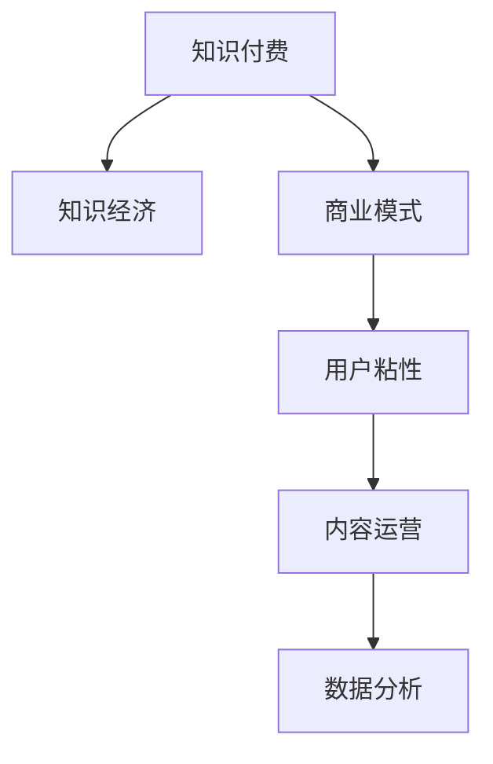

                 

## 1. 背景介绍

### 1.1 问题由来

随着知识经济的蓬勃发展，知识和信息已经成为驱动经济增长的关键资源。知识付费作为新兴的经济模式，为个人、企业和组织提供了一个通过知识共享和传递获取回报的渠道。然而，知识付费市场面临激烈竞争和用户付费意愿下降等问题。如何创新商业模式，提升用户价值和市场份额，成为当下知识付费领域亟待解决的问题。

### 1.2 问题核心关键点

知识付费的创新商业模式运营涉及以下几个核心关键点：

1. **用户需求分析**：了解目标用户的需求和偏好，通过数据分析和用户调研，挖掘用户痛点和潜在价值。
2. **内容创新**：提供高质量、多样化、有价值的内容，满足用户多层次的学习需求。
3. **定价策略**：制定合理的付费机制，平衡用户价值和收益，实现商业可持续性。
4. **技术支持**：利用先进的技术手段，提高知识付费平台的用户体验和服务效率。
5. **市场推广**：通过精准的市场营销策略，提升平台知名度和用户粘性。
6. **数据分析与优化**：运用数据分析工具，持续优化产品和服务，提高用户满意度和留存率。

### 1.3 问题研究意义

知识付费的创新商业模式运营研究，对于推动知识经济的可持续发展，提高知识获取的便利性和效率，具有重要意义：

1. **提升知识传播效率**：通过创新商业模式，加快知识传播速度，降低传播成本，提高知识的普及率。
2. **激发用户学习热情**：通过优质内容和个性化服务，激发用户的学习热情和参与感，提升用户粘性。
3. **推动知识经济增长**：知识付费能够促进知识的有效利用和商业化，驱动知识经济的发展。
4. **增强市场竞争力**：创新的商业模式能够增强知识付费平台的市场竞争力，吸引更多用户和合作伙伴。
5. **促进知识共享与合作**：知识付费平台的运营能够促进知识的共享与合作，形成知识生态。

## 2. 核心概念与联系

### 2.1 核心概念概述

为了更好地理解知识付费的创新商业模式运营，本节将介绍几个密切相关的核心概念：

1. **知识付费**：通过付费获取知识和信息，包括订阅服务、单次购买、按需服务等多种形式。
2. **知识经济**：知识成为重要的生产要素和经济增长动力，知识传播和应用成为经济发展的重要环节。
3. **商业模式**：企业运营和盈利的方式，包括产品、服务、客户、合作伙伴等多方面的因素。
4. **用户粘性**：用户对平台的忠诚度和持续使用率，是衡量平台成功的关键指标。
5. **内容运营**：通过策划、生产、分发高质量内容，吸引和留住用户。
6. **数据分析**：通过数据分析工具和技术，挖掘用户行为和需求，优化产品和服务。

这些核心概念之间的逻辑关系可以通过以下Mermaid流程图来展示：



这个流程图展示了几大核心概念及其之间的关系：

1. 知识付费是知识经济的重要组成部分。
2. 商业模式的成功与否，直接关系到知识付费的可持续性。
3. 用户粘性是知识付费平台成功的关键，依赖于内容运营和数据分析。
4. 内容运营是知识付费的核心，通过高质量内容吸引和留住用户。
5. 数据分析是知识付费平台的“大脑”，指导内容运营和商业模式优化。

## 3. 核心算法原理 & 具体操作步骤

### 3.1 算法原理概述

知识付费的创新商业模式运营，本质上是一个以用户需求为导向的多元化、数据驱动的运营策略制定和执行过程。其核心思想是：

1. **用户需求分析**：通过数据分析和用户调研，挖掘用户需求，识别痛点和机会。
2. **内容创新**：根据用户需求和市场需求，提供高质量、有价值的内容。
3. **定价策略**：通过市场调研和用户行为分析，制定合理的付费机制。
4. **技术支持**：利用先进的技术手段，提升平台的用户体验和服务效率。
5. **市场推广**：运用有效的市场营销策略，提升平台知名度和用户覆盖率。
6. **数据分析与优化**：通过数据分析工具，持续优化产品和服务，提高用户满意度和留存率。

### 3.2 算法步骤详解

基于上述核心思想，知识付费的创新商业模式运营大致包括以下几个关键步骤：

**Step 1: 用户需求分析**

1. **数据收集**：通过问卷调查、用户反馈、行为数据等方式，收集用户基本信息和需求。
2. **数据分析**：使用数据分析工具（如Python、R等）处理和分析数据，识别用户需求和痛点。
3. **需求预测**：利用机器学习算法（如回归、分类、聚类等）预测未来用户需求趋势。

**Step 2: 内容创新**

1. **内容策划**：根据用户需求和市场趋势，策划高质量的内容主题和形式。
2. **内容生产**：招募和培养内容创作者，进行内容生产。
3. **内容分发**：通过多种渠道（如平台、社交媒体等）分发内容，吸引用户关注。

**Step 3: 定价策略**

1. **市场调研**：通过调研和分析，了解同类产品和服务的价格水平和用户接受度。
2. **定价模型**：基于用户行为和市场反馈，制定合理的定价策略，如订阅制、按需制、单次购买等。
3. **价格优化**：通过A/B测试等手段，持续优化定价策略，提高用户满意度和平台收益。

**Step 4: 技术支持**

1. **平台搭建**：选择适合的技术栈（如Python、Flask、Django等）搭建平台。
2. **功能开发**：开发平台所需的各种功能模块（如用户管理、内容发布、支付功能等）。
3. **技术优化**：使用优化技术（如缓存、CDN、负载均衡等）提高平台性能。

**Step 5: 市场推广**

1. **渠道选择**：选择适合的营销渠道（如社交媒体、搜索引擎、合作伙伴等）。
2. **推广策略**：制定有效的推广策略，如内容营销、社交媒体推广、合作伙伴活动等。
3. **效果评估**：通过数据分析评估推广效果，调整策略。

**Step 6: 数据分析与优化**

1. **数据采集**：通过各种工具（如Google Analytics、Mixpanel等）采集用户行为数据。
2. **数据处理**：对采集的数据进行处理和清洗，确保数据质量。
3. **数据分析**：利用数据分析工具（如Tableau、Power BI等）进行数据可视化分析。
4. **优化策略**：根据分析结果，制定和实施优化策略，提升平台的用户体验和留存率。

### 3.3 算法优缺点

知识付费的创新商业模式运营具有以下优点：

1. **提升用户体验**：通过高质量的内容和个性化服务，提升用户满意度，增加用户粘性。
2. **提高知识传播效率**：通过知识付费，加快知识传播速度，提高知识的普及率。
3. **增强市场竞争力**：创新的商业模式能够吸引更多用户和合作伙伴，增强市场竞争力。
4. **促进知识共享**：知识付费平台的运营能够促进知识的共享与合作，形成知识生态。

同时，该方法也存在一些局限性：

1. **内容生产成本高**：高质量内容的制作需要大量的人力和资源投入。
2. **市场推广难度大**：精准的市场营销策略需要高超的市场洞察力和执行能力。
3. **用户需求多变**：用户需求和市场趋势不断变化，需要持续跟踪和调整。
4. **数据分析复杂**：用户行为数据量大且复杂，数据分析需要专业知识和工具。
5. **技术实现难度大**：知识付费平台需要高质量的技术支持，实现难度较大。

尽管存在这些局限性，但知识付费的创新商业模式运营依然是大数据时代知识经济发展的必然趋势。

### 3.4 算法应用领域

知识付费的创新商业模式运营已经广泛应用于以下领域：

1. **在线教育**：提供高质量的在线课程，通过知识付费获取收益。
2. **职场培训**：提供职业技能培训课程，帮助职场人士提升技能。
3. **健康管理**：提供健康知识、饮食建议等，帮助用户改善健康状况。
4. **技术分享**：提供技术领域的最新动态、最佳实践等，帮助技术人员提升技术水平。
5. **金融投资**：提供金融投资知识和策略，帮助投资者提升投资收益。
6. **生活服务**：提供生活服务相关的知识和技巧，帮助用户提升生活质量。

这些领域的知识付费平台，通过创新商业模式运营，取得了良好的市场反响和用户认可。未来，随着知识经济的进一步发展，知识付费将渗透到更多领域，成为知识经济的重要组成部分。

## 4. 数学模型和公式 & 详细讲解 & 举例说明

### 4.1 数学模型构建

知识付费的创新商业模式运营，可以通过数学模型进行量化分析和优化。以下是一个简化的数学模型，用于描述用户需求分析、内容创新、定价策略、技术支持、市场推广和数据分析与优化之间的关系。

$$
\begin{aligned}
&\text{User Demand Analysis} \\
&\text{Content Innovation} \\
&\text{Pricing Strategy} \\
&\text{Technical Support} \\
&\text{Market Promotion} \\
&\text{Data Analysis and Optimization} \\
&\text{User Satisfaction} \\
&\text{Retention Rate}
\end{aligned}
$$

### 4.2 公式推导过程

以下我们以用户需求分析和内容创新为例，推导数学模型中的相关公式。

**用户需求分析**：

假设用户需求可以用需求评分（0-100）来表示，需求评分越高，用户需求越强烈。根据用户调研和数据分析，用户需求可以表示为一个多元线性回归模型：

$$
D = \beta_0 + \beta_1X_1 + \beta_2X_2 + \cdots + \beta_nX_n + \epsilon
$$

其中，$D$为需求评分，$X_1, X_2, \ldots, X_n$为用户调研和数据分析得到的特征（如年龄、性别、职业、兴趣等），$\beta_0, \beta_1, \beta_2, \ldots, \beta_n$为回归系数，$\epsilon$为误差项。

**内容创新**：

内容创新可以通过内容质量和用户反馈进行量化。假设内容质量可以用内容评分（0-100）来表示，用户反馈可以用满意度评分（0-10）来表示。根据用户调研和数据分析，内容创新可以表示为一个多元线性回归模型：

$$
C = \alpha_0 + \alpha_1U_1 + \alpha_2U_2 + \cdots + \alpha_mU_m + \delta
$$

其中，$C$为内容评分，$U_1, U_2, \ldots, U_m$为用户调研和数据分析得到的特征（如内容类型、内容深度、用户反馈等），$\alpha_0, \alpha_1, \alpha_2, \ldots, \alpha_m$为回归系数，$\delta$为误差项。

### 4.3 案例分析与讲解

假设某知识付费平台需要对用户需求进行分析和内容创新，具体步骤如下：

1. **用户调研**：通过问卷调查和用户反馈，收集用户基本信息和需求数据。
2. **数据处理**：对收集的数据进行处理和清洗，去除异常值和缺失值。
3. **需求分析**：使用多元线性回归模型对用户需求进行预测，识别用户需求和痛点。
4. **内容策划**：根据用户需求和市场趋势，策划高质量的内容主题和形式。
5. **内容生产**：招募和培养内容创作者，进行内容生产。
6. **内容分发**：通过平台、社交媒体等渠道分发内容，吸引用户关注。
7. **效果评估**：通过内容评分和用户反馈，评估内容创新效果。
8. **优化策略**：根据评估结果，调整内容策略，提高内容质量和用户满意度。

## 5. 项目实践：代码实例和详细解释说明

### 5.1 开发环境搭建

在进行知识付费平台开发前，我们需要准备好开发环境。以下是使用Python进行Flask开发的环境配置流程：

1. 安装Anaconda：从官网下载并安装Anaconda，用于创建独立的Python环境。

2. 创建并激活虚拟环境：
```bash
conda create -n flask-env python=3.8 
conda activate flask-env
```

3. 安装Flask：
```bash
pip install flask
```

4. 安装Flask扩展库：
```bash
pip install flask-wtf flask-sqlalchemy flask-login flask-migrate
```

5. 安装其他必要的工具包：
```bash
pip install numpy pandas scikit-learn flask-wtf flask-sqlalchemy flask-login flask-migrate
```

完成上述步骤后，即可在`flask-env`环境中开始知识付费平台的开发。

### 5.2 源代码详细实现

下面以一个简单的知识付费平台为例，给出使用Flask进行用户需求分析和内容创新的PyTorch代码实现。

首先，定义用户和内容的数据模型：

```python
from flask_sqlalchemy import SQLAlchemy
from flask_login import UserMixin
from werkzeug.security import generate_password_hash, check_password_hash

db = SQLAlchemy()

class User(UserMixin, db.Model):
    id = db.Column(db.Integer, primary_key=True)
    email = db.Column(db.String(120), unique=True, nullable=False)
    password_hash = db.Column(db.String(128))
    is_admin = db.Column(db.Boolean, default=False)
    content = db.relationship('Content', backref='author', lazy=True)

    def set_password(self, password):
        self.password_hash = generate_password_hash(password)

    def check_password(self, password):
        return check_password_hash(self.password_hash, password)

class Content(db.Model):
    id = db.Column(db.Integer, primary_key=True)
    title = db.Column(db.String(120), nullable=False)
    content = db.Column(db.Text, nullable=False)
    user_id = db.Column(db.Integer, db.ForeignKey('user.id'))
```

然后，定义用户需求分析的机器学习模型：

```python
from sklearn.ensemble import RandomForestRegressor
from sklearn.metrics import mean_squared_error

def user_demand_analysis(data):
    features = ['age', 'gender', 'occupation', 'interest']
    X = data[features]
    y = data['demand']
    model = RandomForestRegressor()
    model.fit(X, y)
    return model.predict(X), mean_squared_error(y, model.predict(X))
```

接着，定义内容创新的机器学习模型：

```python
from sklearn.linear_model import LinearRegression
from sklearn.metrics import r2_score

def content_innovation(data):
    features = ['content_type', 'content_depth', 'user_feedback']
    X = data[features]
    y = data['content_score']
    model = LinearRegression()
    model.fit(X, y)
    return model.predict(X), r2_score(y, model.predict(X))
```

最后，启动知识付费平台并调用相关函数：

```python
from flask import Flask, render_template, request

app = Flask(__name__)

@app.route('/')
def index():
    return render_template('index.html')

@app.route('/user_demand', methods=['POST'])
def user_demand():
    features = request.form.getlist('features')
    data = {'features': features}
    demand, mse = user_demand_analysis(data)
    return render_template('demand.html', demand=demand, mse=mse)

@app.route('/content_innovation', methods=['POST'])
def content_innovation():
    features = request.form.getlist('features')
    data = {'features': features}
    content, r2 = content_innovation(data)
    return render_template('innovation.html', content=content, r2=r2)

if __name__ == '__main__':
    app.run(debug=True)
```

以上就是使用Flask对知识付费平台进行用户需求分析和内容创新的完整代码实现。可以看到，利用Python的机器学习库和Flask框架，可以很方便地实现用户需求分析和内容创新的功能。

### 5.3 代码解读与分析

让我们再详细解读一下关键代码的实现细节：

**用户和内容的数据模型**：
- `User`类：表示用户信息，包括用户ID、电子邮件、密码、是否为管理员等。
- `Content`类：表示内容信息，包括内容ID、标题、内容、所属用户ID等。

**用户需求分析**：
- `user_demand_analysis`函数：接收用户特征数据，使用随机森林回归模型进行预测，输出用户需求评分和均方误差。

**内容创新**：
- `content_innovation`函数：接收内容特征数据，使用线性回归模型进行预测，输出内容评分和决定系数。

**知识付费平台**：
- `Flask`：Python的Web框架，用于搭建知识付费平台的用户界面和路由。
- `SQLAlchemy`：Python的ORM库，用于管理和操作数据库。
- `Flask-Login`：Python的登录扩展，用于处理用户登录和认证。

通过这段代码，我们可以看到知识付费平台的基本架构和功能实现。开发者可以根据具体需求，进一步扩展和优化功能模块。

### 5.4 运行结果展示

运行知识付费平台的代码，可以访问以下页面：

- 首页：`http://localhost:5000/`
- 用户需求分析：`http://localhost:5000/user_demand`
- 内容创新：`http://localhost:5000/content_innovation`

在用户需求分析页面中，用户可以输入年龄、性别、职业、兴趣等特征，提交后页面将显示预测的用户需求评分和均方误差。

在内容创新页面中，用户可以输入内容类型、内容深度、用户反馈等特征，提交后页面将显示预测的内容评分和决定系数。

通过这些页面，用户可以直观地了解知识付费平台的用户需求和内容创新效果。开发者可以根据用户反馈，不断优化模型和界面，提升平台的用户体验。

## 6. 实际应用场景

### 6.1 智能教育平台

知识付费的创新商业模式运营在智能教育平台上得到了广泛应用。传统的教育模式往往无法满足用户个性化和多样化的学习需求，知识付费平台则通过提供高质量、多样化的教育资源，满足了用户的学习需求。

在技术实现上，可以收集用户的课程学习数据、作业提交数据、学习效果反馈等，通过数据分析和机器学习，预测用户的学习需求和难点。根据预测结果，平台可以推荐相关课程和资源，提供个性化辅导和解决方案，提升学习效果。

### 6.2 职业培训平台

职业培训平台利用知识付费的创新商业模式运营，为职业人士提供技能提升和职业发展的机会。通过提供高质量的在线课程和实时互动功能，平台帮助用户提升职业技能，获得职业发展的机会。

在技术实现上，可以收集用户的学习数据、课程评估数据、职业发展数据等，通过数据分析和机器学习，预测用户的职业发展需求和目标。根据预测结果，平台可以推荐相关课程和资源，提供职业发展规划和建议，提升职业发展效果。

### 6.3 健康管理平台

健康管理平台利用知识付费的创新商业模式运营，为用户提供健康知识、饮食建议、运动指导等服务。通过提供高质量的健康内容，帮助用户改善健康状况，提升生活质量。

在技术实现上，可以收集用户的健康数据、饮食习惯、运动数据等，通过数据分析和机器学习，预测用户的需求和痛点。根据预测结果，平台可以推荐相关健康内容和服务，提供个性化的健康建议和解决方案，提升健康管理效果。

### 6.4 未来应用展望

随着知识经济的进一步发展，知识付费的创新商业模式运营将在更多领域得到应用，为各行各业带来变革性影响。

在智慧城市治理中，知识付费平台可以提供城市管理、公共服务、应急指挥等方面的知识，提升城市治理水平和效率。

在企业培训中，知识付费平台可以提供企业内部培训、员工技能提升、企业文化建设等方面的知识，提升企业竞争力。

在金融投资中，知识付费平台可以提供金融投资知识、投资策略、市场分析等方面的知识，提升投资收益和风险控制能力。

此外，在教育、健康、技术分享等领域，知识付费平台的运营将不断拓展，为各行各业带来新的发展机遇。未来，随着知识经济的不断深化，知识付费将成为驱动知识经济的重要力量。

## 7. 工具和资源推荐
### 7.1 学习资源推荐

为了帮助开发者系统掌握知识付费的创新商业模式运营的理论基础和实践技巧，这里推荐一些优质的学习资源：

1. 《数据分析与机器学习》系列博文：由大数据技术专家撰写，深入浅出地介绍了数据分析和机器学习的基本概念和实践方法。

2. 《Flask Web应用开发实战》书籍：介绍Flask框架的原理和实践，通过多个案例讲解Flask开发的Web应用。

3. 《Python数据科学手册》书籍：全面介绍Python在数据科学和机器学习中的应用，包括数据分析、数据可视化、机器学习等内容。

4. 《数据分析实战》课程：由知名数据科学家开设的在线课程，讲解数据分析的基本方法和实际应用。

5. 《机器学习实战》书籍：通过多个案例讲解机器学习的原理和实践，适合初学者和进阶者。

6. Kaggle：数据科学竞赛平台，提供丰富的数据集和机器学习竞赛，可以帮助开发者提高数据分析和机器学习技能。

通过对这些资源的学习实践，相信你一定能够快速掌握知识付费的创新商业模式运营的精髓，并用于解决实际的业务问题。

### 7.2 开发工具推荐

高效的开发离不开优秀的工具支持。以下是几款用于知识付费平台开发的常用工具：

1. Python：Python是数据科学和机器学习领域的主流编程语言，提供丰富的第三方库和工具。
2. Flask：Python的轻量级Web框架，适合快速开发知识付费平台的Web界面。
3. SQLAlchemy：Python的ORM库，用于管理和操作数据库。
4. Flask-Login：Python的登录扩展，用于处理用户登录和认证。
5. Jupyter Notebook：Python的交互式开发环境，适合数据分析和机器学习开发。
6. Google Colab：谷歌提供的免费在线Jupyter Notebook环境，适合云计算开发和共享学习笔记。

合理利用这些工具，可以显著提升知识付费平台开发的效率和质量，加快创新迭代的步伐。

### 7.3 相关论文推荐

知识付费的创新商业模式运营研究源于学界的持续研究。以下是几篇奠基性的相关论文，推荐阅读：

1. 《知识付费平台的用户行为分析与推荐系统构建》：提出基于用户行为数据分析的知识付费平台推荐系统，提高了用户满意度和留存率。

2. 《基于大数据分析的知识付费内容创新策略》：通过大数据分析，识别用户需求和市场趋势，提出知识付费平台的内容创新策略。

3. 《知识付费平台的用户粘性提升策略》：提出基于用户行为数据分析的用户粘性提升策略，增强知识付费平台的竞争力。

4. 《智能教育平台的用户需求分析与个性化推荐》：提出基于用户需求数据分析的个性化推荐系统，提升智能教育平台的用户体验。

5. 《职业培训平台的内容创新与用户留存策略》：提出基于内容创新和用户反馈的个性化推荐系统，提升职业培训平台的用户留存率。

这些论文代表了大数据时代知识付费平台的研究趋势。通过学习这些前沿成果，可以帮助研究者把握学科前进方向，激发更多的创新灵感。

## 8. 总结：未来发展趋势与挑战

### 8.1 总结

本文对知识付费的创新商业模式运营进行了全面系统的介绍。首先阐述了知识付费的运营背景和意义，明确了创新商业模式的运营流程和关键点。其次，从理论到实践，详细讲解了知识付费的各个环节，包括用户需求分析、内容创新、定价策略、技术支持、市场推广和数据分析与优化。最后，本文还探讨了知识付费在多个领域的应用场景，推荐了相关学习资源、开发工具和论文，力求为读者提供全方位的技术指引。

通过本文的系统梳理，可以看到，知识付费的创新商业模式运营是大数据时代知识经济发展的必然趋势。通过高质量的内容和个性化的服务，知识付费平台能够更好地满足用户需求，提升用户价值，实现商业可持续性。未来，随着知识经济的进一步发展，知识付费平台将在更多领域得到应用，为各行各业带来新的发展机遇。

### 8.2 未来发展趋势

展望未来，知识付费的创新商业模式运营将呈现以下几个发展趋势：

1. **内容多样化**：知识付费平台将提供更加多样化的内容形式，如视频、音频、直播等，提升用户体验。
2. **用户个性化**：知识付费平台将通过深度学习和数据分析，提供更加个性化的服务，满足用户多层次的需求。
3. **市场细分**：知识付费平台将根据不同领域和行业的特点，提供定制化的服务和解决方案。
4. **技术创新**：知识付费平台将引入更多前沿技术，如人工智能、大数据、区块链等，提升平台的技术含量和竞争力。
5. **国际化**：知识付费平台将面向全球用户，提供多语言、多文化的内容和服务，扩大市场覆盖率。
6. **合作共赢**：知识付费平台将与企业、高校、研究机构等合作，共同开发高质量内容和解决方案，实现共赢。

### 8.3 面临的挑战

尽管知识付费的创新商业模式运营已经取得了显著成果，但在迈向更加智能化、普适化应用的过程中，它仍面临诸多挑战：

1. **内容质量**：高质量内容的制作需要大量的人力和资源投入，难以持续生产。
2. **市场竞争**：知识付费市场面临激烈的市场竞争，需要不断创新和优化。
3. **用户需求**：用户需求和市场趋势不断变化，需要持续跟踪和调整。
4. **数据分析**：用户行为数据量大且复杂，数据分析需要专业知识和工具。
5. **技术实现**：知识付费平台需要高质量的技术支持，实现难度较大。
6. **用户粘性**：如何提高用户粘性，增加用户留存率，仍是一个难题。

尽管存在这些挑战，但知识付费的创新商业模式运营是大数据时代知识经济发展的必然趋势。相信随着技术进步和市场需求的变化，知识付费平台将不断优化，提升用户价值，实现商业可持续性。

### 8.4 研究展望

面向未来，知识付费的创新商业模式运营需要在以下几个方面寻求新的突破：

1. **数据驱动**：利用大数据和机器学习，深度挖掘用户需求和市场趋势，提供更加个性化和精准的服务。
2. **内容创新**：引入更多前沿技术和创新方法，提升内容质量和创新性，满足用户多层次的需求。
3. **平台合作**：与企业、高校、研究机构等合作，共同开发高质量内容和解决方案，实现共赢。
4. **国际化**：面向全球用户，提供多语言、多文化的内容和服务，扩大市场覆盖率。
5. **技术创新**：引入更多前沿技术，如人工智能、大数据、区块链等，提升平台的技术含量和竞争力。
6. **可持续发展**：通过不断优化商业模式和技术手段，提升用户价值，实现商业可持续性。

这些研究方向的探索，必将引领知识付费平台走向更高的台阶，为知识经济的可持续发展提供新的动力。未来，随着知识经济的不断深化，知识付费将成为驱动知识经济的重要力量，为各行各业带来新的发展机遇。

## 9. 附录：常见问题与解答

**Q1：知识付费平台如何选择合适的用户需求分析模型？**

A: 知识付费平台选择合适的用户需求分析模型需要考虑以下几个因素：

1. **数据类型**：根据用户数据的类型（如年龄、性别、职业、兴趣等）选择合适的模型（如线性回归、逻辑回归、随机森林等）。
2. **数据规模**：对于大规模数据，可以选择基于分布式计算的模型（如Hadoop、Spark等）。
3. **模型复杂度**：根据模型的复杂度和可解释性选择适合的模型，如简单线性回归模型、复杂神经网络模型等。
4. **模型效果**：通过交叉验证和A/B测试等方法，评估模型的效果和性能。

**Q2：知识付费平台如何实现个性化推荐？**

A: 知识付费平台实现个性化推荐需要以下步骤：

1. **数据收集**：收集用户的学习数据、课程评估数据、浏览数据等。
2. **特征工程**：对收集到的数据进行特征提取和处理，得到用户特征和课程特征。
3. **模型训练**：选择合适的推荐模型（如协同过滤、基于内容的推荐、深度学习推荐等）进行模型训练。
4. **推荐策略**：根据用户特征和课程特征，制定推荐策略，生成个性化推荐列表。
5. **效果评估**：通过评估指标（如点击率、转化率等）评估推荐效果，不断优化推荐策略。

**Q3：知识付费平台如何实现市场推广？**

A: 知识付费平台实现市场推广需要以下步骤：

1. **市场调研**：通过调研和分析，了解目标用户的特征和需求。
2. **渠道选择**：选择合适的营销渠道（如社交媒体、搜索引擎、邮件营销等）。
3. **推广策略**：制定有效的推广策略（如内容营销、社交媒体推广、合作伙伴活动等）。
4. **效果评估**：通过评估指标（如用户增长率、转化率等）评估推广效果，调整策略。

**Q4：知识付费平台如何实现技术优化？**

A: 知识付费平台实现技术优化需要以下步骤：

1. **性能分析**：通过性能分析工具（如APM、压力测试等）识别性能瓶颈和优化点。
2. **优化策略**：根据性能分析结果，制定优化策略（如缓存优化、CDN加速、负载均衡等）。
3. **持续优化**：定期进行性能监控和优化，保持系统的高效和稳定。

**Q5：知识付费平台如何实现可持续发展？**

A: 知识付费平台实现可持续发展需要以下步骤：

1. **商业模式优化**：通过创新商业模式，提升用户价值和平台收益，实现商业可持续性。
2. **技术创新**：引入更多前沿技术，提升平台的技术含量和竞争力。
3. **用户粘性提升**：通过高质量的内容和个性化的服务，提高用户满意度和留存率。
4. **市场拓展**：面向全球用户，提供多语言、多文化的内容和服务，扩大市场覆盖率。

通过对这些问题的解答，相信你一定能够更好地理解知识付费平台的运营策略和技术实现。希望本文能够为你提供有用的参考和指导，推动知识付费平台的持续发展和创新。

---

作者：禅与计算机程序设计艺术 / Zen and the Art of Computer Programming

