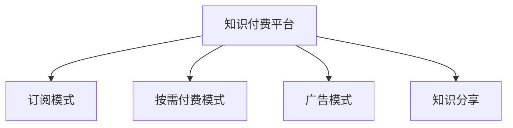

                 

# 知识经济时代的知识付费赚钱原理与方法实践

> 关键词：知识付费, 知识经济, 知识付费平台, 订阅模式, 按需付费模式, 广告模式, 知识分享, 用户需求, 用户增长, 市场竞争

## 1. 背景介绍

### 1.1 问题由来

随着互联网的普及和信息技术的飞速发展，知识经济时代已经到来。在这个时代，知识不再只是高等教育和学术研究的专享品，而是逐渐成为了一种商业模式，并且这一模式在市场上取得了显著的成功。知识付费不仅成为了个人提升自我、获取知识的重要渠道，也成为了企业知识管理和传播的重要方式。

在知识付费的浪潮下，涌现出大量知识付费平台，如得到、喜马拉雅、知乎等，这些平台通过提供高质量的课程、音频、文章等内容，实现了知识变现。但同时，随着市场竞争的加剧和用户需求的不断变化，如何实现知识的商业化变现，成为知识付费平台面临的一大挑战。

### 1.2 问题核心关键点

知识付费平台的商业模式主要包括以下几种：

- 订阅模式：用户支付一定的费用，可以获得一定期限内的内容服务。这种模式适合那些需要长期提供内容的服务，如在线教育、图书等。
- 按需付费模式：用户根据自身需求，单次或多次支付费用获取特定内容。这种模式适合需要快速满足特定需求或购买优质课程的服务。
- 广告模式：平台通过展示广告或推荐特定商品，获取广告收入。这种模式适合拥有大量用户流量但内容较少、难以支撑会员模式的平台。
- 知识分享：用户通过分享自己的知识，获得平台提供的激励（如金钱、荣誉等），促进知识的传播和交流。这种模式适合具有强烈知识分享意愿和传播能力的用户。

这些模式各有优劣，平台需要根据自身的资源、用户需求和市场环境，选择最适合的商业模式。

### 1.3 问题研究意义

研究知识付费平台的商业化变现方法，对于知识付费行业的健康发展，以及推动教育、文化和科技等领域知识传播，具有重要的意义。它不仅能够帮助平台实现盈利，还能够促进知识与技术的进一步普及，提升社会整体的知识水平和文化素养。同时，对于内容创作者而言，这一研究也能够提供有价值的商业变现思路，为其创作带来更多的激励。

## 2. 核心概念与联系

### 2.1 核心概念概述

为了更好地理解知识付费平台的商业模式，本节将介绍几个核心概念：

- 知识付费平台(Knowledge Paying Platforms, KPP)：通过提供高质量的知识内容，并收取一定费用的平台，包括在线教育、图书、音频等。
- 订阅模式(Subscription Model)：用户支付一定费用，获得一定期限内的内容服务，适合长期提供内容的服务。
- 按需付费模式(Pay-Per-Use Model)：用户根据自身需求，单次或多次支付费用获取特定内容，适合需要快速满足特定需求的服务。
- 广告模式(Ad-Based Model)：通过展示广告或推荐特定商品，获取广告收入，适合流量大但内容较少、难以支撑会员模式的服务。
- 知识分享(Knowledge Sharing)：用户通过分享自己的知识，获得平台提供的激励，促进知识的传播和交流。

这些概念之间的逻辑关系可以通过以下Mermaid流程图来展示：



这个流程图展示了一个知识付费平台可能包含的商业模式，以及它们之间的相互关系：

1. 知识付费平台通过提供不同形式的知识内容，吸引用户注册和付费。
2. 订阅模式通过收取一定期限内的费用，保证平台内容的稳定性和长期性。
3. 按需付费模式通过灵活的付费方式，满足用户对特定内容的即时需求。
4. 广告模式通过流量变现，增加平台收益。
5. 知识分享通过激励用户分享知识，促进知识的传播和平台内容的丰富。

## 3. 核心算法原理 & 具体操作步骤
### 3.1 算法原理概述

知识付费平台的商业模式核心在于如何实现内容的商业化变现，其核心算法原理包括以下几个方面：

- **用户需求分析**：分析用户需求，识别其对不同形式内容的偏好和支付意愿。
- **内容推荐算法**：通过推荐算法，向用户推荐符合其需求和兴趣的内容，提升用户黏性和满意度。
- **定价策略设计**：根据内容和用户需求，设计合理的定价策略，以最大化收益。
- **用户留存策略**：通过用户留存策略，提高平台的用户粘性，增加用户生命周期价值。
- **广告优化算法**：设计广告优化算法，提升广告投放的转化率和点击率，增加广告收入。

这些算法原理共同构成了知识付费平台的商业模式，其核心在于通过内容的精心设计和管理，实现高质量内容的商业变现。

### 3.2 算法步骤详解

知识付费平台的商业模式涉及多个方面的算法，以下是详细步骤：

**Step 1: 用户需求分析**
- 收集用户行为数据，包括浏览历史、购买记录等，通过数据分析工具（如Google Analytics、Mixpanel等）挖掘用户需求和偏好。
- 设计问卷调查，直接获取用户对不同内容形式和价格的反馈。
- 使用用户画像技术，将用户按照兴趣、行为、属性等维度进行分类。

**Step 2: 内容推荐算法**
- 收集内容元数据，包括标题、关键词、分类、标签等，构建内容知识图谱。
- 设计推荐算法，如协同过滤、基于内容的推荐、矩阵分解等，向用户推荐符合其兴趣的内容。
- 实时更新推荐算法，根据用户行为变化进行动态调整，提升推荐精度。

**Step 3: 定价策略设计**
- 根据内容制作成本、市场需求、用户支付意愿等，设计合理的定价策略。
- 对于订阅模式，设计月/年订阅价格，并提供不同价格级别的会员特权。
- 对于按需付费模式，设计单次或多次购买价格，并根据内容价值和用户需求调整价格。

**Step 4: 用户留存策略**
- 设计用户激励机制，如会员特权、积分系统、勋章奖励等，提升用户粘性。
- 定期推送个性化内容，增强用户参与感和满意度。
- 通过用户行为分析，识别流失用户，采取针对性措施进行挽留。

**Step 5: 广告优化算法**
- 分析广告效果，收集点击率、转化率等关键指标，优化广告投放策略。
- 设计智能广告推荐算法，根据用户行为和偏好，推荐匹配度高的广告。
- 实时监控广告投放效果，进行动态优化，提升广告收入。

### 3.3 算法优缺点

知识付费平台的商业模式具有以下优点：

- **多样化服务**：提供订阅、按需付费、广告等多种变现方式，满足不同用户需求。
- **精准推荐**：通过推荐算法，提升用户满意度和平台黏性。
- **内容变现**：通过内容变现，实现平台的商业化盈利。
- **用户粘性**：通过用户留存策略，提高用户生命周期价值。

同时，该模式也存在一些局限性：

- **内容成本高**：高质量内容的制作和维护成本较高，需要大量的资金投入。
- **用户流失风险**：用户支付意愿受市场环境、价格波动等因素影响，存在流失风险。
- **广告竞争激烈**：广告模式需面对大量互联网广告平台的竞争，获取优质用户流量较难。
- **版权问题**：部分内容涉及版权，需支付高昂的版权费用，增加运营成本。

尽管存在这些局限性，但知识付费模式依然是目前最有效的知识变现方式之一，被众多知识付费平台广泛应用。

### 3.4 算法应用领域

知识付费平台的商业模式不仅适用于在线教育、图书、音频等传统知识领域，还可以扩展到更多新兴领域，如医疗、法律、科技等。以下是具体应用领域的示例：

- **在线教育**：通过提供高质量的在线课程，满足用户终身学习的需求。
- **图书出版**：通过电子书和有声书等形式，提供丰富多样的阅读体验。
- **医疗咨询**：通过专家咨询、在线诊断等形式，为用户提供便捷的医疗服务。
- **科技研究**：通过学术论文、专利申请等形式，促进科研成果的传播和转化。
- **法律咨询**：通过专家解答、法律咨询等形式，提供专业的法律服务。

这些领域都具有显著的知识需求和市场潜力，未来知识付费模式在这些领域的应用前景广阔。

## 4. 数学模型和公式 & 详细讲解 & 举例说明

### 4.1 数学模型构建

知识付费平台的商业模式涉及多个数学模型，包括用户需求分析、内容推荐算法、定价策略设计等。本节将给出这些模型的数学构建。

假设知识付费平台有 $N$ 个用户，每个用户有 $M$ 个不同的内容需求，每个内容需求有 $K$ 种不同形式的内容可供选择。设每个内容的需求量为 $D$，价格为 $P$，用户的支付意愿为 $W$。

**用户需求分析模型**：

$$
U = \{u_1, u_2, ..., u_N\}
$$

**内容推荐算法模型**：

$$
R = \{r_1, r_2, ..., r_M\}
$$

**定价策略设计模型**：

$$
P = \{p_1, p_2, ..., p_K\}
$$

**用户留存策略模型**：

$$
L = \{l_1, l_2, ..., l_N\}
$$

**广告优化算法模型**：

$$
A = \{a_1, a_2, ..., a_M\}
$$

这些模型共同构成了知识付费平台的商业化变现框架。

### 4.2 公式推导过程

以下是部分关键模型的公式推导过程：

**用户需求分析**：

通过数据分析工具，可以构建用户行为模型：

$$
\hat{W} = \alpha_1 \sum_{i=1}^N D_i + \alpha_2 \sum_{i=1}^N P_i + \alpha_3 \sum_{i=1}^N C_i
$$

其中 $D_i$ 表示用户 $i$ 对内容 $j$ 的需求量，$P_i$ 表示内容 $j$ 的价格，$C_i$ 表示用户 $i$ 的行为特征。

**内容推荐算法**：

协同过滤算法可以表示为：

$$
\hat{R} = \max_{j \in C} \left\{\sum_{i=1}^N W_i \cdot \frac{R_{ij}}{\sqrt{\sum_{k=1}^N R_{ik}^2}} \cdot \frac{R_{jk}}{\sqrt{\sum_{k=1}^N R_{kj}^2}} \right\}
$$

其中 $R_{ij}$ 表示用户 $i$ 对内容 $j$ 的评分，$W_i$ 表示用户 $i$ 的评分权重。

**定价策略设计**：

单次购买定价策略可以表示为：

$$
P_j = \frac{C_j}{\max_{i \in U} W_i \cdot D_i}
$$

其中 $C_j$ 表示内容 $j$ 的制作成本，$W_i$ 表示用户 $i$ 的支付意愿，$D_i$ 表示用户 $i$ 的需求量。

**用户留存策略**：

用户留存率可以表示为：

$$
R = \frac{\sum_{i=1}^N W_i \cdot D_i}{\sum_{i=1}^N D_i}
$$

其中 $W_i$ 表示用户 $i$ 的支付意愿，$D_i$ 表示用户 $i$ 的需求量。

**广告优化算法**：

通过优化广告投放的转化率，可以提升广告收入：

$$
R = \alpha_1 \sum_{j=1}^K P_j \cdot C_j + \alpha_2 \sum_{j=1}^K P_j \cdot C_j \cdot D_j
$$

其中 $P_j$ 表示内容 $j$ 的价格，$C_j$ 表示内容 $j$ 的制作成本，$D_j$ 表示用户对内容 $j$ 的需求量。

这些数学模型的构建为知识付费平台的商业化变现提供了理论基础，能够帮助平台设计合理的策略和算法，最大化商业收益。

### 4.3 案例分析与讲解

以在线教育平台Coursera为例，分析其知识付费商业模式：

**用户需求分析**：

Coursera通过收集用户行为数据，构建用户画像，了解不同用户的需求和偏好。通过分析用户购买历史、浏览行为等数据，平台能够准确预测用户对不同课程的需求量和支付意愿。

**内容推荐算法**：

Coursera使用协同过滤算法，根据用户的历史购买和评分数据，推荐符合用户兴趣的课程。同时，通过实时更新推荐算法，平台能够及时调整推荐内容，提升用户满意度。

**定价策略设计**：

Coursera提供按需付费和订阅两种定价方式，订阅模式提供每月固定费用的课程库访问权，按需付费模式则根据课程内容和用户需求设定单次购买价格。定价策略的设计，使得Coursera能够覆盖更广泛的用户群体，满足不同层次的需求。

**用户留存策略**：

Coursera通过提供个性化学习路径、社区互动、认证证书等激励措施，提高用户黏性和留存率。同时，通过定期的课程更新和推荐，平台能够持续吸引用户回归，提升平台活跃度。

**广告优化算法**：

Coursera通过优化广告投放策略，提升广告转化率和点击率。平台将广告与用户需求紧密结合，向用户推荐匹配度高的课程，从而最大化广告收入。

Coursera的成功在于其精准的用户需求分析、高效的内容推荐算法、灵活的定价策略和有效的用户留存策略。这些关键因素的协同作用，使得Coursera能够在知识付费市场中占据领先地位。

## 5. 项目实践：代码实例和详细解释说明
### 5.1 开发环境搭建

为了实现知识付费平台的商业化变现，需要搭建一套完整的开发环境。以下是具体的步骤：

1. 选择合适的编程语言和框架：Python是实现知识付费平台的主要语言，可以使用Django、Flask等框架进行后端开发。
2. 安装必要的开发工具：包括数据库管理系统（如MySQL、PostgreSQL）、开发工具（如PyCharm、VS Code）等。
3. 配置数据管理：建立数据库表结构，设计用户、内容、交易等关键数据表。
4. 搭建Web应用：使用前端框架（如React、Vue）开发用户界面，使用后端框架进行后端开发。
5. 部署应用：将开发好的应用部署到服务器上，配置域名和访问权限。

### 5.2 源代码详细实现

以下是使用Python和Flask实现知识付费平台的部分代码：

**用户管理模块**：

```python
from flask import Flask, request, jsonify

app = Flask(__name__)

@app.route('/users', methods=['POST'])
def create_user():
    # 从请求中获取用户信息
    user_data = request.get_json()
    # 创建用户记录
    user = User(name=user_data['name'], email=user_data['email'], password=user_data['password'])
    # 保存用户记录到数据库
    db.session.add(user)
    db.session.commit()
    # 返回用户信息
    return jsonify({'id': user.id, 'name': user.name, 'email': user.email})

# 类似地，可以编写用户登录、注册、个人信息修改等模块的代码
```

**内容管理模块**：

```python
@app.route('/content', methods=['POST'])
def create_content():
    # 从请求中获取内容信息
    content_data = request.get_json()
    # 创建内容记录
    content = Content(title=content_data['title'], description=content_data['description'], price=content_data['price'])
    # 保存内容记录到数据库
    db.session.add(content)
    db.session.commit()
    # 返回内容信息
    return jsonify({'id': content.id, 'title': content.title, 'description': content.description, 'price': content.price})
```

**交易管理模块**：

```python
@app.route('/transaction', methods=['POST'])
def create_transaction():
    # 从请求中获取交易信息
    transaction_data = request.get_json()
    # 创建交易记录
    transaction = Transaction(user_id=transaction_data['user_id'], content_id=transaction_data['content_id'], paid=transaction_data['paid'])
    # 保存交易记录到数据库
    db.session.add(transaction)
    db.session.commit()
    # 返回交易信息
    return jsonify({'id': transaction.id, 'user_id': transaction.user_id, 'content_id': transaction.content_id, 'paid': transaction.paid})
```

通过这些模块，可以实现用户管理、内容管理和交易管理等核心功能。

### 5.3 代码解读与分析

以下是对关键代码的解读：

**用户管理模块**：
- 使用Flask框架，通过路由定义API接口，实现用户注册、登录等功能。
- 从请求中获取用户信息，进行用户记录的创建和保存。

**内容管理模块**：
- 同样使用Flask框架，通过路由定义API接口，实现内容创建功能。
- 从请求中获取内容信息，进行内容记录的创建和保存。

**交易管理模块**：
- 通过路由定义API接口，实现交易记录的创建和保存。
- 从请求中获取交易信息，进行交易记录的创建和保存。

这些模块的实现，展示了知识付费平台的基础功能。开发者可以根据需求，进一步扩展和优化这些模块，增加更多的高级功能，如用户权限管理、课程推荐、积分系统等。

### 5.4 运行结果展示

在实际运行中，可以通过简单的Web界面，查看用户、内容和交易记录。例如，用户登录后可以访问自己的账户信息、已购买内容、历史交易记录等。内容提供者可以查看自己发布的内容、浏览量和购买情况等。管理员可以管理用户、内容和交易记录，保障平台运营的稳定性和安全性。

## 6. 实际应用场景

### 6.1 智能教育

知识付费平台在智能教育领域有着广泛的应用。通过提供高质量的在线课程、习题解析、作业辅导等服务，平台能够帮助学生高效学习，提升学习效果。同时，平台还可以为教师提供丰富的教学资源，促进教学创新和质量提升。

**实际应用场景**：

- 在线教育平台提供各种学科的课程，如数学、物理、化学等，涵盖K12、大学、职业培训等多个层次。
- 平台通过智能推荐算法，向学生推荐匹配度高的课程和习题，提升学习效率。
- 平台支持社区互动，学生可以在平台上交流学习经验，互相帮助。
- 平台提供作业解析、在线辅导等增值服务，帮助学生解决学习难题。

**技术挑战**：

- 如何设计合理的课程和习题推荐算法，提升用户体验和效果。
- 如何设计高效的内容制作和审核机制，保障内容质量。
- 如何平衡在线教育和传统教育的关系，提升教育公平性。

**未来展望**：

- 通过AI技术，实现个性化学习路径推荐，提供定制化教育服务。
- 利用大数据分析，进行教育效果的评估和改进，提升教育质量。
- 开发虚拟现实(VR)、增强现实(AR)等技术，提升学习体验。

### 6.2 医疗咨询

知识付费平台在医疗咨询领域也有着广阔的应用前景。通过提供专家咨询、在线诊断等服务，平台能够帮助患者快速获得专业的医疗建议，提升医疗服务可及性和质量。

**实际应用场景**：

- 在线医疗咨询平台提供各种专业领域的专家咨询，如内科、外科、儿科等。
- 平台通过智能推荐算法，向患者推荐符合其症状和需求的专家。
- 平台支持线上问诊、电子病历等功能，提升患者就医效率。
- 平台提供医学教育资源，帮助医生提升专业水平。

**技术挑战**：

- 如何保证医疗咨询的准确性和安全性，避免误诊和医疗事故。
- 如何设计高效的专家匹配和调度机制，提升服务质量。
- 如何设计患者隐私保护机制，保障患者信息安全。

**未来展望**：

- 通过AI技术，实现医学影像的智能诊断，提升诊断效率和准确性。
- 开发智能问诊系统，提升患者自我诊断能力。
- 利用大数据分析，进行医疗数据的分析和挖掘，提升公共卫生管理水平。

### 6.3 企业培训

知识付费平台在企业培训领域也有着广泛的应用。通过提供各种职业培训、技能提升、管理培训等服务，平台能够帮助企业提升员工素质，提升企业竞争力。

**实际应用场景**：

- 在线企业培训平台提供各种职业培训课程，如管理培训、技术培训等。
- 平台通过智能推荐算法，向员工推荐符合其职业发展和需求的内容。
- 平台支持在线考核和认证，提升员工的学习效果和认证权威性。
- 平台提供企业定制化培训方案，帮助企业提升整体素质。

**技术挑战**：

- 如何设计合理的培训内容推荐算法，提升员工学习效果。
- 如何设计高效的内容制作和审核机制，保障内容质量。
- 如何设计企业培训方案的定制化服务，满足不同企业的需求。

**未来展望**：

- 通过AI技术，实现个性化学习路径推荐，提升员工学习效果。
- 利用大数据分析，进行企业培训效果的评估和改进，提升企业竞争力。
- 开发虚拟现实(VR)、增强现实(AR)等技术，提升培训体验。

## 7. 工具和资源推荐
### 7.1 学习资源推荐

为了帮助开发者系统掌握知识付费平台的商业化变现方法，这里推荐一些优质的学习资源：

1. 《知识付费平台商业模式解析》：一本系统讲解知识付费平台商业模式、市场竞争、用户需求等方面的书籍，适合深入了解知识付费平台的核心业务逻辑。
2. Coursera官方文档：Coursera的官方文档，详细介绍了其知识付费平台的构建和运营策略，适合学习平台的实际应用。
3. 《知识付费平台运营实战》：一本实战教程，介绍了知识付费平台的搭建、运营和推广等方面的具体方法和技巧。
4. 《知识付费平台用户留存策略》：一本专门介绍用户留存策略的书籍，详细讲解了如何提升平台用户黏性和留存率。
5. 《知识付费平台广告优化》：一本介绍广告优化策略的书籍，详细讲解了如何提升广告投放的转化率和点击率，增加广告收入。

通过对这些资源的学习实践，相信你一定能够快速掌握知识付费平台的商业模式和商业化变现方法，并用于解决实际的商业问题。

### 7.2 开发工具推荐

高效的开发离不开优秀的工具支持。以下是几款用于知识付费平台开发的常用工具：

1. Django/Flask：Python的Web开发框架，支持快速搭建Web应用，适合知识付费平台的开发。
2. React/Vue：前端框架，支持高性能的Web界面开发，提升用户体验。
3. MySQL/PostgreSQL：关系型数据库，适合存储用户、内容、交易等关键数据。
4. Elasticsearch：搜索引擎，适合快速搜索和推荐算法的高效实现。
5. TensorFlow/PyTorch：深度学习框架，适合构建智能推荐算法、广告优化算法等模型。

合理利用这些工具，可以显著提升知识付费平台开发的效率和质量。

### 7.3 相关论文推荐

知识付费平台的商业模式涉及多个前沿研究方向，以下是几篇奠基性的相关论文，推荐阅读：

1. An Empirical Study of Online Course Selection: What Matters?：研究在线课程推荐算法的影响因素，为知识付费平台推荐算法的设计提供参考。
2. A Hybrid Recommendation System for E-learning Platforms：介绍一种基于内容的推荐算法，适合知识付费平台的内容推荐。
3. Pricing in the Digital Economy：研究在线课程的定价策略，为知识付费平台定价设计提供参考。
4. A Survey on Online Learning Platforms：综述在线学习平台的研究现状和发展趋势，为知识付费平台的技术实现提供参考。
5. Social Commerce Platforms: An Empirical Study on E-commerce Recommendation Algorithms：研究社交电商平台的推荐算法，为知识付费平台的广告优化提供参考。

这些论文代表了大数据、人工智能等前沿技术在知识付费平台中的应用，帮助开发者从理论和技术角度深入理解知识付费平台的商业模式。

## 8. 总结：未来发展趋势与挑战
### 8.1 研究成果总结

通过上述分析，可以看出知识付费平台的商业模式涉及用户需求分析、内容推荐算法、定价策略设计、用户留存策略、广告优化算法等多个方面。这些关键因素的协同作用，使得知识付费平台能够最大化商业收益，实现知识的商业化变现。

### 8.2 未来发展趋势

未来，知识付费平台将继续在多个领域发挥重要作用，其发展趋势包括：

- **多样化服务**：知识付费平台将继续拓展服务类型，包括视频课程、直播授课、虚拟现实等新兴领域。
- **智能化推荐**：通过引入AI技术，提升推荐算法的智能化水平，提升用户体验和平台收益。
- **个性化定制**：基于用户画像，提供个性化学习路径、课程推荐等服务，满足不同用户的需求。
- **广告优化**：通过广告优化算法，提升广告投放的转化率和点击率，增加广告收入。
- **国际化发展**：随着互联网的普及，知识付费平台将在全球范围内拓展市场，提升国际影响力。

### 8.3 面临的挑战

尽管知识付费平台在市场竞争中取得了显著的成功，但仍面临诸多挑战：

- **内容制作成本高**：高质量内容的制作和维护需要大量资金和资源投入，运营成本较高。
- **用户流失风险**：用户支付意愿受市场环境、价格波动等因素影响，存在流失风险。
- **版权问题**：部分内容涉及版权，需支付高昂的版权费用，增加运营成本。
- **广告竞争激烈**：广告模式需面对大量互联网广告平台的竞争，获取优质用户流量较难。
- **技术挑战**：内容推荐算法、广告优化算法等关键技术仍需不断优化和提升。

尽管存在这些挑战，但通过不断技术创新和商业模式优化，知识付费平台仍具有广阔的发展前景。

### 8.4 研究展望

未来，知识付费平台的研究方向包括：

- **多模态融合**：将文字、图像、视频等不同形式的内容进行融合，提升内容表现力和用户体验。
- **知识图谱构建**：构建知识图谱，提升内容的语义理解和关联性，为推荐算法和广告优化提供基础。
- **用户行为分析**：利用大数据和机器学习技术，进行用户行为分析和预测，提升平台运营效率。
- **智能客服**：引入智能客服技术，提升平台的用户体验和服务质量。
- **伦理和安全**：设计伦理导向的算法和机制，保障用户隐私和数据安全。

这些研究方向将推动知识付费平台向更加智能化、个性化和可控化方向发展，为知识经济时代的知识传播提供更加优质的服务和体验。

## 9. 附录：常见问题与解答

**Q1: 知识付费平台如何实现商业化变现？**

A: 知识付费平台主要通过订阅模式、按需付费模式、广告模式三种方式实现商业化变现。订阅模式提供固定期限内的内容服务，按需付费模式根据用户需求提供单次或多次购买服务，广告模式通过展示广告或推荐特定商品获取广告收入。

**Q2: 知识付费平台如何提升用户留存率？**

A: 知识付费平台通过用户激励机制、个性化内容推送、社区互动等方式提升用户留存率。用户激励机制包括会员特权、积分系统、勋章奖励等，个性化内容推送包括推荐优质课程、推送学习路径等，社区互动包括学习交流、线上问答等。

**Q3: 知识付费平台如何优化广告投放？**

A: 知识付费平台通过广告优化算法提升广告投放的转化率和点击率。广告优化算法包括智能广告推荐、实时广告投放优化、用户行为分析等，通过分析用户需求和行为，优化广告展示方式和内容，提升广告效果。

**Q4: 知识付费平台如何设计合理的定价策略？**

A: 知识付费平台根据内容制作成本、市场需求和用户支付意愿设计合理的定价策略。对于订阅模式，提供不同价格级别的会员特权；对于按需付费模式，根据内容价值和用户需求调整价格。

**Q5: 知识付费平台如何设计推荐算法？**

A: 知识付费平台通过协同过滤算法、基于内容的推荐、矩阵分解等技术设计推荐算法。推荐算法需要考虑用户需求、内容属性、用户行为等因素，进行多维度匹配和排序，提升推荐精度。

通过上述分析和实践，希望你能深入理解知识付费平台的商业模式，掌握知识付费平台的商业化变现方法，并将其应用到实际项目中，提升平台的用户体验和运营效率。相信在未来，知识付费平台将成为知识经济时代的重要组成部分，为知识传播和创新提供更加高效、智能的服务。

