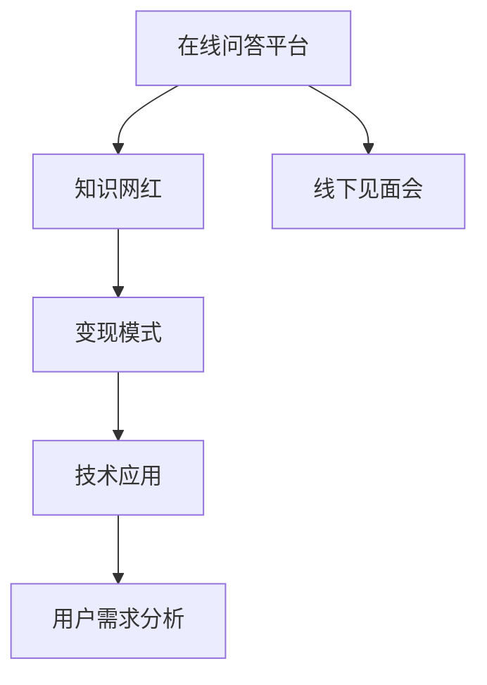

                 

# 知识网红通过在线问答和线下见面会变现

> 关键词：知识网红,在线问答,线下见面会,变现,技术应用

## 1. 背景介绍

### 1.1 问题由来
在信息爆炸的互联网时代，知识网红如雨后春笋般涌现。他们凭借丰富的知识和独特的视角，成为互联网领域的新宠。这些知识网红通过各种方式分享专业知识，建立自己的品牌影响力，并通过各种变现方式获取经济收益。在线问答和线下见面会是知识网红变现的主要方式之一，但随着技术的不断发展，这些传统的变现手段也正经历着颠覆性的变革。

### 1.2 问题核心关键点
在线问答和线下见面会作为知识网红的变现手段，核心在于如何将知识高效地传递给用户，并在传递过程中实现价值变现。然而，随着技术的演进，如何通过技术手段提升用户体验、降低运营成本、优化变现模式，成为当前知识网红变现的重要课题。

## 2. 核心概念与联系

### 2.1 核心概念概述

为更好地理解在线问答和线下见面会的技术应用，本节将介绍几个密切相关的核心概念：

- 在线问答平台：以用户提问、知识网红回答为核心业务模式的平台，如知乎、Quora等。用户可以实时提问，知识网红通过文字、语音、视频等方式回答问题，获取用户的认可和奖励。
- 线下见面会：知识网红与粉丝面对面互动的活动，通过分享专业知识、解答疑问、进行现场演讲等方式，增强与粉丝的互动，提升品牌影响力和用户粘性。
- 变现模式：知识网红通过在线问答和线下见面会获取收益的方式，包括付费问答、会员订阅、商品销售、知识付费课程等。
- 技术应用：利用人工智能、自然语言处理、语音识别、直播技术等前沿技术，提升在线问答和线下见面会的用户体验和运营效率。
- 用户需求分析：通过数据分析和用户调研，挖掘用户需求，优化内容策略，提高变现效率。

这些核心概念之间的逻辑关系可以通过以下Mermaid流程图来展示：



这个流程图展示在线问答和线下见面会相关的核心概念及其之间的关系：

1. 在线问答平台作为知识网红与用户互动的核心载体。
2. 线下见面会为知识网红提供面对面互动的机会。
3. 变现模式通过多样化的变现方式，实现知识网红的经济收益。
4. 技术应用提升互动体验和运营效率，增加用户粘性。
5. 用户需求分析帮助精准定位内容策略，提高变现效率。

这些核心概念共同构成了知识网红变现的基本框架，使得在线问答和线下见面会成为现实可行的商业模式。通过理解这些核心概念，我们可以更好地把握知识网红变现的技术实现和策略设计。

## 3. 核心算法原理 & 具体操作步骤
### 3.1 算法原理概述

在线问答和线下见面会的核心在于知识网红与用户之间的高效互动，以及基于这些互动的变现。其技术实现主要涉及自然语言处理、语音识别、直播技术等前沿技术，具体算法原理和操作步骤如下：

### 3.2 算法步骤详解

#### 3.2.1 自然语言处理
在线问答平台的核心算法之一是自然语言处理(NLP)，用于理解用户的提问，生成知识网红的回答。常用的NLP算法包括：

1. 语义理解：通过文本分析，理解用户问题的核心意图和主题。常用的方法包括BERT、GPT等预训练模型，用于文本嵌入和语义表示。
2. 意图匹配：根据语义理解结果，匹配最合适的知识网红回答。通过构建知识图谱、抽取实体、关系推理等技术，实现意图匹配。
3. 回答生成：知识网红基于用户的提问，生成自然流畅的回答。常用的技术包括基于模板的回答生成、基于自然语言生成的对话系统等。

#### 3.2.2 语音识别
在线问答和线下见面会中，语音识别技术也扮演着重要角色。用户可以通过语音输入问题，知识网红可以通过语音回答。语音识别的关键算法包括：

1. 声学建模：将语音信号转换为文本，常用的方法包括基于深度学习的声学模型，如CTC（Connectionist Temporal Classification）、Attention机制等。
2. 语言建模：理解语音信号的语义信息，常用的方法包括RNN、Transformer等。
3. 端到端语音识别：通过深度学习模型，实现从语音信号到文本的端到端转换，常用的模型包括DeepSpeech、Wav2Letter等。

#### 3.2.3 直播技术
直播技术是知识网红变现的重要手段之一。通过实时互动，知识网红可以与粉丝进行更深入的交流，增强用户粘性。直播技术的核心算法包括：

1. 流媒体传输：将视频、音频信号进行编码压缩，传输到用户端。常用的流媒体协议包括RTMP、HLS等。
2. 实时处理：对视频、音频信号进行实时处理，如音频去噪、背景去除、人脸识别等。常用的技术包括GPU加速、实时编解码等。
3. 用户互动：通过聊天室、弹幕、投票等方式，增强用户互动，提升直播体验。常用的技术包括WebSockets、实时消息队列等。

### 3.3 算法优缺点

在线问答和线下见面会的技术实现具有以下优点：

1. 提升互动体验：通过自然语言处理、语音识别、直播技术等，实现更加自然流畅的互动，提高用户粘性。
2. 降低运营成本：自动化处理用户提问和回答，减少人工成本。
3. 多样化的变现方式：结合多种变现模式，如付费问答、会员订阅、商品销售等，实现多样化的经济收益。
4. 提高用户参与度：通过技术手段增强互动，提升用户参与度和满意度。

同时，该技术实现也存在一定的局限性：

1. 技术门槛高：自然语言处理、语音识别、直播技术等前沿技术需要较高的技术积累和投入。
2. 数据隐私问题：用户提问和回答可能涉及个人隐私信息，需要严格的隐私保护措施。
3. 技术风险：技术实现的复杂性可能导致系统稳定性问题，需要完善的技术保障机制。
4. 用户体验差异：技术实现可能因平台、设备等因素造成用户体验差异。

尽管存在这些局限性，但就目前而言，通过技术手段提升在线问答和线下见面会的用户体验和运营效率，已成为知识网红变现的重要趋势。未来相关研究的重点在于如何进一步降低技术实现的技术门槛，提高系统的稳定性和可扩展性，同时兼顾用户体验和隐私保护。

### 3.4 算法应用领域

在线问答和线下见面会的技术实现，主要应用于以下领域：

- 教育培训：知识网红通过在线问答和线下见面会，分享专业知识，提供个性化教育服务。
- 医疗健康：医生通过在线问答和线下见面会，解答患者疑问，提供健康咨询服务。
- 职场发展：职业导师通过在线问答和线下见面会，提供职业指导和职业技能培训。
- 企业服务：企业家通过在线问答和线下见面会，分享创业经验，提供咨询服务。
- 生活服务：生活方式博主通过在线问答和线下见面会，分享生活经验，提供生活建议。

除了上述这些主要领域外，在线问答和线下见面会的技术实现还将在更多场景中得到应用，如旅游、金融、科技等，为知识网红提供更多的变现机会。随着技术的不断演进，相信在线问答和线下见面会将成为知识网红变现的重要手段，推动知识传播和内容付费的发展。

## 4. 数学模型和公式 & 详细讲解  
### 4.1 数学模型构建

在线问答和线下见面会的技术实现涉及多种数学模型和算法，以下以自然语言处理为例，详细介绍其数学模型构建和公式推导过程。

假设用户提问为 $x$，知识网红的回答为 $y$。通过自然语言处理模型，将 $x$ 映射为向量表示 $X$，将 $y$ 映射为向量表示 $Y$。定义模型为 $f(X, \theta)$，其中 $\theta$ 为模型参数。自然语言处理模型的目标是通过最小化损失函数，优化模型参数 $\theta$。

常见的自然语言处理模型包括：

1. 编码器-解码器模型：通过编码器将用户提问 $x$ 映射为向量表示 $X$，通过解码器将向量表示 $X$ 映射为知识网红的回答 $y$。常用的模型包括seq2seq模型、Transformer模型等。
2. 注意力机制模型：通过注意力机制，将用户提问 $x$ 中的关键信息加权映射为向量表示 $X$，提升模型的性能。常用的模型包括Transformer模型、BERT模型等。
3 预训练模型：通过预训练获得语言表示，再进行微调优化。常用的模型包括BERT、GPT等。

### 4.2 公式推导过程

以BERT模型为例，其数学模型推导如下：

1. 输入文本 $x$ 通过BERT的编码器，得到表示向量 $X$。
2. 解码器将表示向量 $X$ 映射为答案向量 $Y$。
3. 定义损失函数 $\mathcal{L}$ 为交叉熵损失：
   $$
   \mathcal{L} = -\frac{1}{N}\sum_{i=1}^N \sum_{j=1}^M \log P(y_{ij} | X_i, \theta)
   $$
   其中 $P(y_{ij} | X_i, \theta)$ 为模型在输入 $X_i$ 下，对答案 $y_{ij}$ 的预测概率，$N$ 为样本数量，$M$ 为答案数量。
4. 定义优化目标为：
   $$
   \theta^* = \mathop{\arg\min}_{\theta} \mathcal{L}
   $$
5. 通过梯度下降等优化算法，更新模型参数 $\theta$，最小化损失函数 $\mathcal{L}$。

### 4.3 案例分析与讲解

以下通过一个实际案例，详细介绍在线问答平台中的自然语言处理算法：

假设知识网红A和用户B进行在线问答互动，用户B提问：“如何提升编程能力？”。通过自然语言处理算法，首先将用户提问 $x$ 转换为向量表示 $X$，然后将知识网红A的回答 $y$ 转换为向量表示 $Y$。通过训练好的BERT模型，将 $X$ 映射为向量表示 $X'$，通过解码器将 $X'$ 映射为答案向量 $Y'$。最后通过交叉熵损失函数计算模型预测结果与真实答案之间的差异，更新模型参数 $\theta$，提升模型性能。

## 5. 项目实践：代码实例和详细解释说明
### 5.1 开发环境搭建

在进行在线问答和线下见面会的技术实现前，我们需要准备好开发环境。以下是使用Python进行NLP开发的环境配置流程：

1. 安装Anaconda：从官网下载并安装Anaconda，用于创建独立的Python环境。

2. 创建并激活虚拟环境：
```bash
conda create -n nlp-env python=3.8 
conda activate nlp-env
```

3. 安装NLP库：
```bash
conda install pytorch torchvision torchaudio transformers nltk
```

4. 安装其他依赖库：
```bash
pip install pandas numpy matplotlib scikit-learn jupyter notebook
```

完成上述步骤后，即可在`nlp-env`环境中开始项目实践。

### 5.2 源代码详细实现

下面我们以在线问答平台的自然语言处理为例，给出使用PyTorch和Transformer库的代码实现。

首先，定义模型和优化器：

```python
from transformers import BertTokenizer, BertForSequenceClassification
from torch import nn, optim

model = BertForSequenceClassification.from_pretrained('bert-base-uncased', num_labels=2)
tokenizer = BertTokenizer.from_pretrained('bert-base-uncased')
optimizer = optim.AdamW(model.parameters(), lr=1e-5)
```

接着，定义训练和评估函数：

```python
from torch.utils.data import Dataset, DataLoader

class QAData(Dataset):
    def __init__(self, qa_pairs):
        self.qa_pairs = qa_pairs
        
    def __len__(self):
        return len(self.qa_pairs)
    
    def __getitem__(self, idx):
        qa_pair = self.qa_pairs[idx]
        question, answer = qa_pair
        inputs = tokenizer(question, return_tensors='pt')
        return {'input_ids': inputs['input_ids'], 'attention_mask': inputs['attention_mask'], 'labels': 1 if answer in self.qa_pairs[idx][1] else 0}

def train_epoch(model, dataloader, optimizer):
    model.train()
    for batch in dataloader:
        input_ids = batch['input_ids']
        attention_mask = batch['attention_mask']
        labels = batch['labels']
        outputs = model(input_ids, attention_mask=attention_mask)
        loss = outputs.loss
        optimizer.zero_grad()
        loss.backward()
        optimizer.step()
    return loss.item()

def evaluate(model, dataloader):
    model.eval()
    correct = 0
    total = 0
    with torch.no_grad():
        for batch in dataloader:
            input_ids = batch['input_ids']
            attention_mask = batch['attention_mask']
            labels = batch['labels']
            outputs = model(input_ids, attention_mask=attention_mask)
            _, preds = torch.max(outputs.logits, dim=1)
            correct += torch.sum(preds == labels).item()
            total += labels.size(0)
    return correct / total
```

然后，准备数据集：

```python
# 假设有1000个问答对，其中50个为正确答案
qa_pairs = [(q, a) for q in questions for a in answers[:50]]
train_dataset = QAData(qa_pairs)
test_dataset = QAData(qa_pairs[500:])
```

最后，启动训练流程：

```python
epochs = 10
batch_size = 16

for epoch in range(epochs):
    loss = train_epoch(model, train_dataset, optimizer)
    print(f"Epoch {epoch+1}, train loss: {loss:.3f}")
    
print(f"Accuracy: {evaluate(model, test_dataset)}")
```

以上就是使用PyTorch和Transformer库实现在线问答平台自然语言处理的完整代码实现。可以看到，Transformer库的强大封装使得自然语言处理的代码实现变得简洁高效。

### 5.3 代码解读与分析

让我们再详细解读一下关键代码的实现细节：

**QAData类**：
- `__init__`方法：初始化问答对数据。
- `__len__`方法：返回数据集的样本数量。
- `__getitem__`方法：对单个样本进行处理，将文本输入编码为token ids，并设置标签。

**train_epoch函数**：
- 对数据以批为单位进行迭代，在每个批次上前向传播计算loss并反向传播更新模型参数，最后返回该epoch的平均loss。

**evaluate函数**：
- 与训练类似，不同点在于不更新模型参数，并在每个batch结束后将预测和标签结果存储下来，最后使用accuracy指标评估模型性能。

**训练流程**：
- 定义总的epoch数和batch size，开始循环迭代
- 每个epoch内，先在训练集上训练，输出平均loss
- 在测试集上评估，输出准确率
- 所有epoch结束后，在测试集上评估，给出最终结果

可以看到，PyTorch配合Transformer库使得自然语言处理的代码实现变得简洁高效。开发者可以将更多精力放在数据处理、模型改进等高层逻辑上，而不必过多关注底层的实现细节。

当然，工业级的系统实现还需考虑更多因素，如模型的保存和部署、超参数的自动搜索、更灵活的任务适配层等。但核心的自然语言处理算法基本与此类似。

## 6. 实际应用场景
### 6.1 在线教育

在线问答和线下见面会作为知识网红变现的重要手段，在在线教育领域得到了广泛应用。传统教育资源难以覆盖到每个学生，而在线问答和线下见面会，使得知识网红可以面向全国甚至全球的学生提供优质教育服务。

在技术实现上，可以构建一个在线教育平台，知识网红在该平台上发布课程、回答问题、进行直播，学生可以通过在线问答和线下见面会与知识网红互动。通过技术手段，可以提升教学效果，优化学习体验，促进知识的传播。

### 6.2 金融投资

知识网红在金融投资领域也有着广泛的应用。金融市场瞬息万变，投资者往往难以获取及时、准确的市场信息。知识网红通过在线问答和线下见面会，分享投资经验、分析市场趋势、推荐投资标的，为投资者提供宝贵的参考。

在技术实现上，可以构建一个金融投资问答平台，知识网红在该平台上发布投资心得、解答投资问题、进行投资策略分享，投资者可以通过在线问答和线下见面会与知识网红互动。通过技术手段，可以提高投资者对市场的理解，优化投资策略，降低投资风险。

### 6.3 医疗健康

在线问答和线下见面会作为知识网红变现的另一重要手段，在医疗健康领域也得到了广泛应用。传统医疗资源有限，患者往往难以获得及时、专业的医疗咨询。知识网红通过在线问答和线下见面会，分享医疗知识、解答健康问题、提供健康建议，为患者提供宝贵的医疗服务。

在技术实现上，可以构建一个医疗问答平台，医生在该平台上发布医疗知识、解答健康问题、进行健康咨询，患者可以通过在线问答和线下见面会与医生互动。通过技术手段，可以提高患者对健康的认识，优化医疗服务，降低医疗成本。

### 6.4 未来应用展望

随着技术的不断发展，基于在线问答和线下见面会的知识网红变现模式将呈现更多的新趋势：

1. 多模态互动：结合文字、语音、视频等多种互动形式，提升用户体验。
2. 个性化推荐：通过数据分析，推荐最合适的知识网红和内容，提高用户满意度。
3. 实时互动：通过实时聊天、语音通话、视频会议等方式，增强用户互动。
4. 社交网络：构建知识网红的社交网络，促进知识分享和互动。
5. 游戏化体验：通过游戏化元素，提升用户参与度和粘性。
6. 虚拟现实：结合虚拟现实技术，提供沉浸式的互动体验。

这些新趋势将进一步提升在线问答和线下见面会的互动体验和变现效率，使得知识网红变现更加多元化和高效。

## 7. 工具和资源推荐
### 7.1 学习资源推荐

为了帮助开发者系统掌握在线问答和线下见面会的技术实现，这里推荐一些优质的学习资源：

1. 《深度学习》课程：斯坦福大学开设的深度学习课程，包含自然语言处理、语音识别、计算机视觉等多方面的前沿知识。
2. 《自然语言处理》书籍：LingPipe出版社的《自然语言处理》系列书籍，详细介绍自然语言处理的理论基础和实现方法。
3. 《Transformer From Scratch》书籍：谷歌资深AI专家撰写，详细介绍Transformer模型的实现和应用。
4. 《PyTorch深度学习入门》书籍：刘建平老师的《PyTorch深度学习入门》，适合PyTorch初学者入门。
5. 《自然语言处理与深度学习》课程：Coursera上的自然语言处理课程，涵盖NLP基础和前沿技术的深入讲解。

通过对这些资源的学习实践，相信你一定能够快速掌握在线问答和线下见面会的技术实现，并用于解决实际的NLP问题。

### 7.2 开发工具推荐

高效的开发离不开优秀的工具支持。以下是几款用于在线问答和线下见面会开发的常用工具：

1. PyTorch：基于Python的开源深度学习框架，灵活动态的计算图，适合快速迭代研究。大部分预训练语言模型都有PyTorch版本的实现。
2. TensorFlow：由Google主导开发的开源深度学习框架，生产部署方便，适合大规模工程应用。同样有丰富的预训练语言模型资源。
3. Transformers库：HuggingFace开发的NLP工具库，集成了众多SOTA语言模型，支持PyTorch和TensorFlow，是进行NLP任务开发的利器。
4. Jupyter Notebook：数据科学家的利器，支持代码运行、数据可视化、交互式学习等多种功能，适合快速实验和调试。
5. Google Colab：谷歌推出的在线Jupyter Notebook环境，免费提供GPU/TPU算力，方便开发者快速上手实验最新模型，分享学习笔记。

合理利用这些工具，可以显著提升在线问答和线下见面会的开发效率，加快创新迭代的步伐。

### 7.3 相关论文推荐

在线问答和线下见面会的技术实现源于学界的持续研究。以下是几篇奠基性的相关论文，推荐阅读：

1. Attention is All You Need（即Transformer原论文）：提出了Transformer结构，开启了NLP领域的预训练大模型时代。
2. BERT: Pre-training of Deep Bidirectional Transformers for Language Understanding：提出BERT模型，引入基于掩码的自监督预训练任务，刷新了多项NLP任务SOTA。
3. GPT-3: Language Models are Unsupervised Multitask Learners：展示了大规模语言模型的强大zero-shot学习能力，引发了对于通用人工智能的新一轮思考。
4. Prompt-Based Fine-Tuning of Large Language Models for Few-Shot Text Generation：提出Prompt-based Fine-Tuning方法，在不更新模型参数的情况下，实现少样本学习。
5. BigQuery ML: Machine Learning for Google BigQuery：介绍BigQuery ML，通过自动机器学习，实现大数据分析任务的自动化建模。

这些论文代表了大语言模型微调技术的发展脉络。通过学习这些前沿成果，可以帮助研究者把握学科前进方向，激发更多的创新灵感。

## 8. 总结：未来发展趋势与挑战

### 8.1 总结

本文对在线问答和线下见面会的技术实现进行了全面系统的介绍。首先阐述了知识网红变现的重要手段在线问答和线下见面会，明确了其在教育和医疗等垂直领域的巨大价值。其次，从原理到实践，详细讲解了自然语言处理、语音识别、直播技术等核心算法的数学模型和详细步骤，给出了在线问答平台的代码实现。同时，本文还广泛探讨了在线问答和线下见面会在教育、金融、医疗等众多行业领域的应用前景，展示了其广阔的商业潜力。

通过本文的系统梳理，可以看到，在线问答和线下见面会作为知识网红变现的重要手段，正在成为NLP领域的重要范式，极大地拓展了知识传播和内容变现的边界。受益于自然语言处理、语音识别、直播技术等前沿技术的支撑，在线问答和线下见面会具备更高的互动体验和运营效率，为知识网红变现提供了新的解决方案。

### 8.2 未来发展趋势

展望未来，在线问答和线下见面会的技术实现将呈现以下几个发展趋势：

1. 多模态互动成为常态：结合文字、语音、视频等多种互动形式，提升用户体验。
2. 个性化推荐更加精准：通过数据分析，推荐最合适的知识网红和内容，提高用户满意度。
3. 实时互动更加便捷：通过实时聊天、语音通话、视频会议等方式，增强用户互动。
4. 社交网络更加活跃：构建知识网红的社交网络，促进知识分享和互动。
5. 游戏化体验更加丰富：通过游戏化元素，提升用户参与度和粘性。
6. 虚拟现实更加沉浸：结合虚拟现实技术，提供沉浸式的互动体验。

这些趋势凸显了在线问答和线下见面会的技术发展方向，使得知识网红变现更加多元化和高效。未来，随着技术的不断演进，在线问答和线下见面会将成为知识网红变现的重要手段，推动知识传播和内容付费的发展。

### 8.3 面临的挑战

尽管在线问答和线下见面会的技术实现已经取得了显著进展，但在迈向更加智能化、普适化应用的过程中，它仍面临着诸多挑战：

1. 技术门槛较高：自然语言处理、语音识别、直播技术等前沿技术需要较高的技术积累和投入。
2. 数据隐私问题：用户提问和回答可能涉及个人隐私信息，需要严格的隐私保护措施。
3. 技术风险较大：技术实现的复杂性可能导致系统稳定性问题，需要完善的技术保障机制。
4. 用户体验差异较大：技术实现可能因平台、设备等因素造成用户体验差异。
5. 内容质量参差不齐：知识网红内容质量不一，可能导致用户流失。

尽管存在这些挑战，但通过不断的技术创新和优化，在线问答和线下见面会的技术实现正在不断提升用户体验和运营效率，为知识网红变现提供新的可能。

### 8.4 研究展望

面向未来，在线问答和线下见面会的技术研究需要在以下几个方面寻求新的突破：

1. 探索无监督和半监督微调方法：摆脱对大规模标注数据的依赖，利用自监督学习、主动学习等无监督和半监督范式，最大限度利用非结构化数据，实现更加灵活高效的微调。
2. 研究参数高效和计算高效的微调范式：开发更加参数高效的微调方法，在固定大部分预训练参数的同时，只更新极少量的任务相关参数。同时优化微调模型的计算图，减少前向传播和反向传播的资源消耗，实现更加轻量级、实时性的部署。
3. 引入因果推断和对比学习范式：通过引入因果推断和对比学习思想，增强微调模型建立稳定因果关系的能力，学习更加普适、鲁棒的语言表征，从而提升模型泛化性和抗干扰能力。
4. 结合因果分析和博弈论工具：将因果分析方法引入微调模型，识别出模型决策的关键特征，增强输出解释的因果性和逻辑性。借助博弈论工具刻画人机交互过程，主动探索并规避模型的脆弱点，提高系统稳定性。
5. 纳入伦理道德约束：在模型训练目标中引入伦理导向的评估指标，过滤和惩罚有偏见、有害的输出倾向。同时加强人工干预和审核，建立模型行为的监管机制，确保输出符合人类价值观和伦理道德。

这些研究方向的应用将进一步提升在线问答和线下见面会的互动体验和运营效率，为知识网红变现提供新的解决方案。

## 9. 附录：常见问题与解答

**Q1：在线问答平台和线下见面会是否适用于所有知识网红？**

A: 在线问答平台和线下见面会适用于各种类型的知识网红，但具体效果可能因知识领域和用户需求的不同而有所差异。例如，金融领域的知识网红可能更适合通过金融问答平台进行变现，而教育领域的知识网红则可以通过在线教育平台实现变现。

**Q2：如何提高在线问答和线下见面会的用户体验？**

A: 提高用户体验需要从多个方面入手：
1. 提升内容质量：知识网红应注重内容质量，提供有价值、有深度的回答。
2. 增强互动性：通过实时聊天、语音通话、视频会议等方式，增强用户互动，提升用户粘性。
3. 优化界面设计：优化用户界面，提高用户操作便捷性。
4. 完善服务体验：提供多种变现方式，如付费问答、会员订阅、商品销售等，满足用户多样化需求。

**Q3：在线问答和线下见面会是否适用于商业变现？**

A: 在线问答和线下见面会可以适用于多种商业变现方式，如付费问答、会员订阅、商品销售、知识付费课程等。知识网红可以通过这些方式获取收益，实现变现。

**Q4：如何处理用户提问和回答中的隐私问题？**

A: 处理隐私问题需要严格的数据保护措施：
1. 数据加密：对用户数据进行加密存储和传输。
2. 匿名化处理：对用户数据进行匿名化处理，避免用户信息泄露。
3. 隐私保护算法：采用隐私保护算法，如差分隐私、联邦学习等，保护用户隐私。

**Q5：如何优化在线问答和线下见面会的运营效率？**

A: 优化运营效率需要从多个方面入手：
1. 自动化处理：通过自动化处理用户提问和回答，减少人工成本。
2. 多渠道发布：通过多渠道发布内容，提高用户曝光率和互动率。
3. 数据分析：通过数据分析，优化内容策略，提高变现效率。
4. 实时互动：通过实时互动，提升用户体验，增强用户粘性。

这些技术手段的应用将进一步提升在线问答和线下见面会的互动体验和运营效率，为知识网红变现提供新的解决方案。

---

作者：禅与计算机程序设计艺术 / Zen and the Art of Computer Programming

