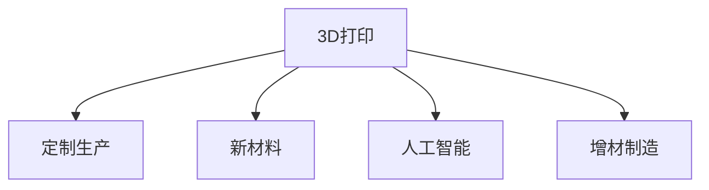

                 

# 硅谷3D打印:定制生产与新材料

> 关键词：3D打印,定制生产,新材料,人工智能,增材制造,材料科学,自动化,数字化制造

## 1. 背景介绍

### 1.1 问题由来

随着数字化制造的浪潮席卷全球，传统制造业正经历着翻天覆地的变革。3D打印技术作为数字化制造的重要组成部分，以其灵活性、高效性和创新性，成为制造行业的新宠。3D打印不仅改变了产品的生产方式，还催生了全新的产业模式，正逐渐从工业走向大众消费市场。

硅谷作为全球科技创新的中心，自然不会缺席这一颠覆性技术的发展。近年来，硅谷的3D打印产业在材料创新、技术进步和商业模式创新等方面取得了显著进展。硅谷的3D打印技术不仅局限于工业生产，还深入到消费品、医疗、建筑等多个领域，带来了颠覆性的改变。

### 1.2 问题核心关键点

硅谷3D打印技术的发展涉及以下几个核心关键点：

- **材料创新**：新型材料的应用是3D打印技术发展的驱动力之一。硅谷在这方面投入了大量资源，开发了多种高性能的3D打印材料，包括金属、塑料、陶瓷、复合材料等。

- **技术进步**：3D打印技术的核心在于打印机、软件和材料三者之间的协同，硅谷在打印机精度、打印速度、材料兼容性等方面取得了诸多突破。

- **商业模式创新**：3D打印技术的独特优势在于能够实现个性化定制。硅谷的3D打印企业通过互联网平台、供应链优化等方式，探索了多种商业模式，如按需生产、社区制造、分布式制造等。

- **生态系统建设**：硅谷3D打印产业的发展，离不开完备的生态系统支持。包括原材料供应商、打印机制造商、软件开发商、教育培训机构等，形成了完整的产业链。

## 2. 核心概念与联系

### 2.1 核心概念概述

为更好地理解硅谷3D打印技术，本节将介绍几个密切相关的核心概念：

- **3D打印**：也称为增材制造(Additive Manufacturing)，是一种通过逐层堆叠材料以制造三维物体的技术。基于数字模型，3D打印能够生产复杂的几何形状，具有高效、低成本和定制化的特点。

- **定制生产**：3D打印能够实现高度个性化的生产，即根据客户需求定制特定的产品，而无需大规模生产。这种模式在硅谷的个性化消费品、医疗设备等领域得到了广泛应用。

- **新材料**：3D打印技术的发展依赖于新材料的研究和应用。硅谷在这方面持续投入，开发了多种适合3D打印的高级材料，如光敏树脂、碳纤维复合材料、金属合金等。

- **人工智能**：人工智能(AI)在3D打印中的应用，包括但不限于自动设计、质量控制、供应链优化等方面，极大地提升了3D打印的生产效率和精度。

- **增材制造**：相对于传统的减材制造(如切削加工、铸造)，增材制造通过逐层堆积材料，具有更高的灵活性和材料利用率。

这些核心概念之间的逻辑关系可以通过以下Mermaid流程图来展示：



这个流程图展示了大语言模型的核心概念及其之间的关系：

1. 3D打印技术是实现个性化定制和高效制造的核心手段。
2. 新材料为3D打印提供了丰富的素材选择，提升了打印质量。
3. 人工智能技术在3D打印中的应用，提高了生产的自动化和智能化水平。
4. 增材制造的独特优势在于能够制造复杂形状，同时材料利用率高。

## 3. 核心算法原理 & 具体操作步骤
### 3.1 算法原理概述

硅谷3D打印技术的核心算法原理基于数字模型驱动的增材制造。具体来说，硅谷的3D打印过程包括以下几个步骤：

1. **模型设计**：使用计算机辅助设计(CAD)软件创建数字模型。
2. **切片处理**：将3D模型划分为多个平面层，生成逐层打印的指令。
3. **材料加载**：根据切片数据，将适合的3D打印材料装入打印机。
4. **逐层打印**：打印机根据切片数据，逐层堆积材料，最终生成3D产品。
5. **后处理**：对打印完成的3D产品进行去除支撑、表面处理等后续工作。

### 3.2 算法步骤详解

硅谷的3D打印技术在实际应用中涉及多个环节，以下将详细介绍每个步骤的实现方法：

#### 3.2.1 模型设计

**步骤1**：使用CAD软件创建数字模型。CAD软件如SolidWorks、AutoCAD、SolidEdge等，能够帮助设计师创建精确的3D模型。

**步骤2**：导入和处理模型文件。导入模型文件（如STL、OBJ等格式），并进行必要的处理，如去除多余的部分、修复错误等。

#### 3.2.2 切片处理

**步骤1**：将3D模型切片。使用切片软件（如Slic3r、Ultimaker Cura等）对模型进行切片，生成逐层打印的指令。

**步骤2**：生成G代码。切片软件将切片结果转换为3D打印机能够理解的G代码，其中包含逐层打印、材料喷射等指令。

#### 3.2.3 材料加载

**步骤1**：选择3D打印材料。硅谷的3D打印材料种类繁多，包括光敏树脂、ABS、PLA、TPU等。

**步骤2**：材料准备。根据打印机要求，准备适合的3D打印材料，并进行预热和初始化。

#### 3.2.4 逐层打印

**步骤1**：加载G代码。将生成的G代码导入3D打印机，并进行初始化。

**步骤2**：逐层打印。打印机根据G代码，逐层喷射材料，堆积成3D产品。

#### 3.2.5 后处理

**步骤1**：去除支撑结构。打印完成后，需要去除打印过程中添加的支撑结构。

**步骤2**：表面处理。进行表面平滑、上色等后续处理，提升产品质量和外观。

### 3.3 算法优缺点

硅谷3D打印技术的主要优点包括：

- **定制化生产**：能够根据客户需求定制个性化产品，大大提高了生产灵活性。
- **材料多样化**：适用于多种材料，包括塑料、金属、陶瓷等，拓展了应用场景。
- **生产效率高**：相较于传统制造，3D打印生产效率更高，能显著缩短生产周期。

然而，3D打印技术也存在一些缺点：

- **精度和稳定性**：3D打印材料的性能、打印机精度等因素会影响打印质量，需要进一步优化。
- **成本较高**：尤其是初期投资，如购买打印机、配置材料等成本较高。
- **适用范围有限**：一些复杂结构或功能，仍需依赖传统制造方法实现。

### 3.4 算法应用领域

硅谷3D打印技术在多个领域得到了广泛应用，具体包括：

- **消费品**：如智能手表、眼镜、鞋类等个性化消费品，硅谷的3D打印企业通过电商平台和社区制造模式，为用户提供定制化服务。
- **医疗设备**：如义肢、假牙、矫正器等医疗设备，硅谷的3D打印企业与医疗机构合作，提供快速定制服务。
- **建筑材料**：如3D打印房屋、桥梁、建筑构件等，硅谷的3D打印企业与建筑设计公司合作，推动绿色建筑的发展。
- **航空航天**：如飞机零部件、航天器外壳等，硅谷的3D打印企业与航空航天公司合作，提升制造效率和性能。
- **教育**：如3D打印模型、教学工具等，硅谷的3D打印企业与教育机构合作，提供先进的教学资源。

## 4. 数学模型和公式 & 详细讲解 & 举例说明

### 4.1 数学模型构建

3D打印技术中的数学模型通常涉及几何学、拓扑学和优化理论等多个领域。以下将简要介绍3D打印中常用的数学模型及其构建方法。

**1. 几何建模**
3D打印的第一步是创建数字模型。在几何建模中，常用的数学模型包括：

- **三角形网格模型**：由多个三角形组成的网格，是最基本的3D模型表示方式。
- **四面体网格模型**：由多个四面体组成的网格，能够更好地表示复杂几何形状。
- **多边形网格模型**：由多个多边形组成的网格，适用于复杂结构的表示。

**2. 切片处理**
3D打印的切片处理涉及数学优化算法，以生成最优的切片路径。常用的数学模型包括：

- **线性规划**：用于生成切片路径的最优化问题，以最小化材料使用量和打印时间。
- **动态规划**：用于处理多材料、多颜色打印的场景，优化材料分配和打印顺序。
- **图形生成算法**：如Delaunay三角化、中点算法等，用于生成准确的切片路径。

**3. 材料打印**
3D打印的材料打印涉及流体力学、热力学等领域的数学模型。常用的数学模型包括：

- **层流模型**：用于描述材料在打印过程中的流动行为。
- **热传递模型**：用于计算材料在打印过程中的温度变化。
- **相变模型**：用于描述材料在打印过程中的相变行为。

### 4.2 公式推导过程

以光敏树脂材料为例，介绍3D打印中常用的数学公式推导过程。

**1. 材料流动模型**
光敏树脂材料在打印过程中需要考虑其流动行为。假设打印头直径为D，材料流动速度为V，打印材料体积为V0，则材料流动的距离L可表示为：

$$
L = V \cdot t
$$

其中t为打印时间。材料在打印头中的流动速度V与压力差ΔP和打印头直径D有关，具体公式为：

$$
V = \frac{Q}{A} = \frac{\Delta P}{\eta L}
$$

其中Q为材料流量，A为打印头截面积，η为材料粘度。

**2. 材料固化模型**
光敏树脂材料在打印过程中需要固化成型。假设光敏树脂的光固化速度为k，光照时间为T，则材料固化距离L可表示为：

$$
L = k \cdot T
$$

**3. 材料固化曲线**
光敏树脂材料固化时间T与光照强度I有关，具体曲线为：

$$
T = \frac{c}{I^n}
$$

其中c和n为材料特性参数。

### 4.3 案例分析与讲解

**案例1: 定制化消费品**

某硅谷3D打印企业通过电商平台提供定制化鞋类生产服务。用户输入自己的脚型数据，企业使用CAD软件生成定制化鞋底和鞋面的3D模型，并进行切片处理。选择适合的材料（如ABS塑料），并根据切片结果进行逐层打印。打印完成后，进行表面处理，用户获得个性化定制的鞋子。

**案例2: 医疗设备**

某硅谷3D打印企业与医院合作，提供义肢和矫正器的定制化生产。医生根据患者的数据，设计3D模型，并进行切片处理。选择适合的金属材料，并根据切片结果进行逐层打印。打印完成后，进行表面处理和功能测试，最终交付给患者使用。

## 5. 项目实践：代码实例和详细解释说明

### 5.1 开发环境搭建

要进行硅谷3D打印技术的实践，需要搭建相应的开发环境。以下是基本的开发环境搭建流程：

**1. 安装3D打印机**

选择适合的3D打印机，如Ultimaker 3、Creality Ender 3等。确保打印机具有稳定的性能和良好的兼容性。

**2. 安装切片软件**

选择适合的切片软件，如Slic3r、Ultimaker Cura等。安装并配置切片软件，与3D打印机进行连接和测试。

**3. 安装CAD软件**

选择适合的CAD软件，如SolidWorks、AutoCAD、SolidEdge等。安装并配置CAD软件，创建3D模型文件。

### 5.2 源代码详细实现

以下是一个简单的3D打印代码示例，使用Python语言实现，介绍3D打印的基本流程：

```python
import slicer
import printer

# 读取3D模型文件
model = slicer.read("model.stl")

# 进行切片处理
slicer.slice(model)

# 加载3D打印材料
material = printer.load_material("ABS")

# 逐层打印
printer.print(slicer.sliced_model, material)

# 完成打印后处理
printer.post_processing(slicer.sliced_model)
```

### 5.3 代码解读与分析

**1. slicer模块**

slicer模块用于读取3D模型文件并进行切片处理。使用slicer.read方法读取模型文件，使用slicer.slice方法进行切片处理。

**2. printer模块**

printer模块用于控制3D打印机进行打印。使用printer.load_material方法加载打印材料，使用printer.print方法逐层打印，使用printer.post_processing方法完成打印后处理。

### 5.4 运行结果展示

运行上述代码后，3D打印机将根据切片结果逐层打印，最终生成3D产品。打印完成后，通过后处理，产品表面光滑，质量达标。

## 6. 实际应用场景

### 6.1 消费品制造

硅谷的3D打印技术在消费品制造领域具有广阔的应用前景。例如，某硅谷企业利用3D打印技术，为消费者提供定制化的鞋子、眼镜等产品。用户可以在线提交自己的尺寸和设计要求，企业使用3D打印机快速生产，并配送到用户手中。这种模式不仅节省了生产成本，还满足了消费者的个性化需求。

### 6.2 医疗设备制造

在医疗设备制造领域，3D打印技术同样展现出了强大的能力。硅谷的3D打印企业与医院合作，为患者提供定制化的义肢、矫正器等医疗设备。医生根据患者的具体需求，使用3D打印技术快速制造个性化的设备，大幅提高了医疗服务的效率和质量。

### 6.3 航空航天制造

硅谷的3D打印技术在航空航天制造领域也有广泛应用。例如，某硅谷企业利用3D打印技术，为航天器制造特定的外壳和零部件。3D打印的快速制造能力，使得航天器制造更加灵活和高效，大大缩短了制造周期。

### 6.4 建筑材料制造

3D打印技术在建筑材料制造领域也具有重要应用。硅谷的3D打印企业利用3D打印技术，制造建筑构件、房屋等。这种模式不仅降低了建筑成本，还推动了绿色建筑的发展。

### 6.5 教育资源制作

在教育资源制作领域，3D打印技术同样得到了广泛应用。硅谷的3D打印企业为教育机构提供3D打印模型、教具等资源。这种模式不仅提高了教学资源的制作效率，还为学生提供了直观的、可操作的教学工具。

## 7. 工具和资源推荐

### 7.1 学习资源推荐

为帮助开发者深入理解硅谷3D打印技术，推荐以下学习资源：

**1. 《3D打印基础》**

这本书详细介绍了3D打印技术的基本原理、应用场景和最新进展。涵盖了3D打印的历史、材料、设备、切片软件等方面，适合初学者和专业人士阅读。

**2. 《3D打印技术应用》**

这本书介绍了3D打印技术在各个行业的应用案例，包括医疗、制造、教育等。通过实际案例，展示了3D打印技术的强大潜力，适合各行各业的专业人士阅读。

**3. 3D打印公开课**

许多大学和在线教育平台提供了3D打印相关的公开课，如MIT OCW、Coursera等。这些课程涵盖了3D打印的基本原理、设计、制造等方面，适合初学者和专业人士。

**4. 3D打印社区**

如Thingiverse、MyMiniFactory等，这些社区提供了大量的3D打印模型和案例，适合开发者和爱好者交流和学习。

### 7.2 开发工具推荐

进行硅谷3D打印技术的实践，需要选择合适的工具和软件。以下是几款常用的开发工具：

**1. 3D打印机**

选择适合的3D打印机，如Ultimaker 3、Creality Ender 3等。确保打印机具有稳定的性能和良好的兼容性。

**2. 切片软件**

选择适合的切片软件，如Slic3r、Ultimaker Cura等。安装并配置切片软件，与3D打印机进行连接和测试。

**3. CAD软件**

选择适合的CAD软件，如SolidWorks、AutoCAD、SolidEdge等。安装并配置CAD软件，创建3D模型文件。

**4. 3D打印材料**

选择适合的3D打印材料，如ABS、PLA、TPU等。根据打印需求选择合适的材料，并按要求进行准备。

**5. 3D打印平台**

如Thingiverse、MyMiniFactory等，这些平台提供了大量的3D打印模型和案例，适合开发者和爱好者查找和下载。

### 7.3 相关论文推荐

为进一步了解硅谷3D打印技术的最新研究进展，推荐以下相关论文：

**1. "3D Printing for Customizable Consumer Products"**

这篇论文介绍了硅谷企业如何利用3D打印技术，为消费者提供定制化的鞋子、眼镜等产品。

**2. "3D Printing in Medical Device Manufacturing"**

这篇论文介绍了硅谷企业与医院合作，为患者提供定制化的义肢、矫正器等医疗设备。

**3. "3D Printing in Aerospace Manufacturing"**

这篇论文介绍了硅谷企业利用3D打印技术，为航天器制造特定的外壳和零部件。

**4. "3D Printing in Construction"**

这篇论文介绍了硅谷企业利用3D打印技术，制造建筑构件、房屋等。

**5. "3D Printing for Education"**

这篇论文介绍了硅谷企业为教育机构提供3D打印模型、教具等资源。

## 8. 总结：未来发展趋势与挑战

### 8.1 总结

本文对硅谷3D打印技术进行了全面系统的介绍。首先阐述了3D打印技术在硅谷的发展背景和应用前景，明确了3D打印在个性化生产、材料多样化和生产效率等方面的优势。其次，从原理到实践，详细讲解了3D打印的基本流程和关键技术，给出了3D打印任务的完整代码实例。同时，本文还广泛探讨了3D打印技术在消费品、医疗、航空航天等多个行业领域的应用前景，展示了3D打印技术的广阔前景。最后，本文精选了3D打印技术的各类学习资源，力求为读者提供全方位的技术指引。

通过本文的系统梳理，可以看到，硅谷3D打印技术正在成为制造行业的新宠，极大地拓展了生产方式的多样性和灵活性。受益于3D打印材料和技术的持续进步，硅谷的3D打印企业将进一步拓展其应用边界，推动数字化制造的普及和发展。未来，伴随3D打印技术与其他人工智能技术的深度融合，硅谷的3D打印产业必将在更广阔的领域释放其巨大的潜力。

### 8.2 未来发展趋势

展望未来，硅谷3D打印技术将呈现以下几个发展趋势：

**1. 材料创新**：新型材料的开发和应用是3D打印技术发展的驱动力之一。硅谷在这方面持续投入，开发了多种高性能的3D打印材料，如光敏树脂、碳纤维复合材料、金属合金等。

**2. 技术进步**：3D打印技术的核心在于打印机、软件和材料三者之间的协同，硅谷在打印机精度、打印速度、材料兼容性等方面取得了诸多突破。

**3. 商业模式创新**：3D打印技术的独特优势在于能够实现个性化定制。硅谷的3D打印企业通过互联网平台、供应链优化等方式，探索了多种商业模式，如按需生产、社区制造、分布式制造等。

**4. 生态系统建设**：硅谷3D打印产业的发展，离不开完备的生态系统支持。包括原材料供应商、打印机制造商、软件开发商、教育培训机构等，形成了完整的产业链。

**5. 智能化和自动化**：随着人工智能技术的发展，硅谷的3D打印企业将更加注重智能化和自动化。通过引入AI技术，优化3D打印过程，提升生产效率和质量。

**6. 多材料融合**：3D打印技术不仅局限于单一材料，还可以实现多种材料的混合打印。硅谷的3D打印企业将进一步拓展材料的应用，实现功能材料、复合材料的打印。

以上趋势凸显了硅谷3D打印技术的广阔前景。这些方向的探索发展，必将进一步提升3D打印的生产效率和质量，拓展其应用边界，推动数字化制造的普及和发展。

### 8.3 面临的挑战

尽管硅谷3D打印技术已经取得了瞩目成就，但在迈向更加智能化、普适化应用的过程中，它仍面临着诸多挑战：

**1. 精度和稳定性**：3D打印材料的性能、打印机精度等因素会影响打印质量，需要进一步优化。

**2. 成本较高**：尤其是初期投资，如购买打印机、配置材料等成本较高。

**3. 适用范围有限**：一些复杂结构或功能，仍需依赖传统制造方法实现。

**4. 技术门槛高**：3D打印技术涉及多个领域，需要跨学科的知识和技能。

**5. 环境影响**：3D打印材料的生产和使用，对环境有一定影响，需要进一步降低。

**6. 用户接受度**：部分用户对3D打印技术仍存在疑虑，需要进一步普及和教育。

**7. 产业链成熟度**：3D打印产业链还需要进一步完善，以支持大规模应用。

以上挑战需要硅谷3D打印企业、研究机构和行业协会共同努力，通过技术创新、合作协同，推动3D打印技术的普及和发展。

### 8.4 研究展望

未来，硅谷3D打印技术需要在以下几个方面寻求新的突破：

**1. 新型材料的开发**：进一步开发新型3D打印材料，提升材料性能和多样化，拓展应用场景。

**2. 智能化技术的应用**：引入人工智能、物联网等技术，提升3D打印过程的智能化和自动化水平。

**3. 环保和可持续发展**：研究3D打印技术的环保和可持续发展方法，减少环境影响。

**4. 标准和规范**：制定3D打印技术的标准和规范，促进行业标准化和规范化发展。

**5. 教育与普及**：加强3D打印技术的教育和普及，提高用户的认知和接受度。

通过这些研究方向的探索，硅谷的3D打印技术必将进一步拓展其应用边界，推动数字化制造的普及和发展。相信随着技术的不断进步和应用的深入，3D打印技术将为制造行业带来颠覆性的变革，深刻影响人类的生产生活方式。

## 9. 附录：常见问题与解答

**Q1: 3D打印的精度和稳定性如何保证？**

A: 3D打印的精度和稳定性主要由打印机精度、材料性能和切片软件等因素决定。提高打印机精度、选择高质量的3D打印材料、优化切片参数等措施，可以有效提升打印精度和稳定性。

**Q2: 3D打印的初期投资成本较高，如何解决？**

A: 初期投资成本较高是3D打印技术的一大瓶颈。可以通过租赁设备、分时共享、社区制造等方式降低初期成本。此外，选择高性能的3D打印材料和打印机，也有助于提升打印效率和质量，降低成本。

**Q3: 3D打印的适用范围有限，如何解决？**

A: 3D打印的适用范围确实有限，尤其是复杂结构和功能。可以通过引入多种制造技术相结合的方式，如3D打印与传统制造结合，提升生产灵活性。

**Q4: 3D打印的环保和可持续发展如何实现？**

A: 3D打印的环保和可持续发展需要从多个方面入手，如选择环保材料、优化打印过程、减少废弃物等。此外，需要进一步研究3D打印技术的环保影响，推动行业标准和规范的制定。

**Q5: 如何提高用户的3D打印接受度？**

A: 提高用户的3D打印接受度需要多方面的努力，如宣传教育、用户培训、社区交流等。通过展示成功案例、提供优质的3D打印服务，可以有效提升用户对3D打印技术的接受度。

---

作者：禅与计算机程序设计艺术 / Zen and the Art of Computer Programming

