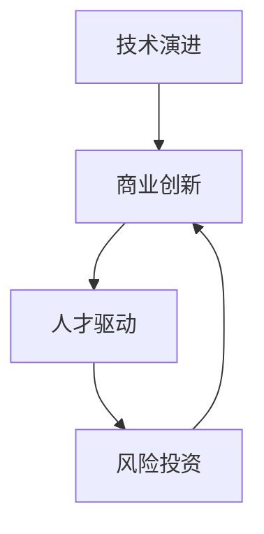

                 

# 硅谷百年沉浮录:从无到有的传奇

> 关键词：硅谷,创新,变革,技术,商业,生态,人才培养,风险投资

## 1. 背景介绍

### 1.1 问题由来
硅谷，作为全球高科技和创新的中心，不仅孕育了苹果、谷歌、Facebook、特斯拉等顶尖科技公司，更在芯片、互联网、社交媒体、人工智能等诸多领域推动了技术变革和社会进步。然而，硅谷的成功并非一蹴而就，背后是无数的创新、挑战和变革。本文将带你深入探索硅谷的百年沉浮，分析其背后的技术演进、商业创新、人才驱动和风险投资机制，揭示硅谷从无到有的传奇。

### 1.2 问题核心关键点
硅谷的发展历程，可以概括为以下几个核心关键点：

1. **技术演进**：从电子管到晶体管，再到集成电路和芯片的变革，奠定了硅谷成为全球科技中心的基础。
2. **商业创新**：互联网的兴起、社交媒体的崛起、云计算和大数据的普及，不断催生新的商业模式和市场机会。
3. **人才驱动**：斯坦福大学和加州伯克利等高校源源不断地为硅谷输送顶尖人才，成为技术创新的引擎。
4. **风险投资**：全球风险资本的聚焦，使硅谷成为全球创业热土，吸引了无数创新项目的孵化。

理解这些关键点，有助于我们全面把握硅谷发展的脉络，洞察其背后的成功要素。

## 2. 核心概念与联系

### 2.1 核心概念概述

硅谷的成功离不开几个核心概念的支撑：

- **技术演进**：指从基础硬件到软件、再到人工智能等技术领域的不断进步和创新。
- **商业创新**：指通过商业模式、市场策略、用户体验等手段，将技术成果转化为商业价值的过程。
- **人才驱动**：指高校和研究机构对人才的培养和吸引，为硅谷持续提供创新活力。
- **风险投资**：指风险资本对初创公司的投资，推动技术创新和商业模式的快速迭代。

这些概念之间相互促进，共同推动了硅谷的持续发展和创新。

### 2.2 核心概念原理和架构的 Mermaid 流程图

该流程图展示了技术演进、商业创新、人才驱动和风险投资之间的相互作用关系。技术演进推动了商业创新，商业创新吸引了人才并产生了对风险投资的需求，风险投资为技术演进和商业创新提供了资金支持，形成了良性循环。

## 3. 核心算法原理 & 具体操作步骤

### 3.1 算法原理概述

硅谷的发展历程中，有许多关键的技术突破和商业创新，本文将重点分析以下几个里程碑事件：

- **集成电路的发明**：1960年代，罗伯特·诺依斯和戈登·摩尔发明集成电路，为计算机硬件的发展奠定了基础。
- **互联网的兴起**：1990年代，蒂姆·伯纳斯·李发明万维网，开启了互联网时代。
- **社交媒体的崛起**：2000年代，马克·扎克伯格创立Facebook，社交媒体成为信息传播和社交互动的重要平台。
- **云计算和大数据的普及**：2010年代，亚马逊AWS等公司推动了云计算的普及，大数据技术迅速发展。

这些技术突破和创新，不仅改变了技术格局，更催生了新的商业模式和市场机会。

### 3.2 算法步骤详解

以下，我们将详细介绍这些技术突破和创新的实现步骤：

**集成电路的发明**：
1. **研究背景**：20世纪50年代，晶体管的出现极大地推动了计算机技术的发展。然而，晶体管体积大、能耗高，限制了计算机的规模和速度。
2. **发明过程**：罗伯特·诺依斯和戈登·摩尔提出了集成电路的构想，将多个晶体管集成在一个芯片上，大幅提升了计算机的集成度和性能。
3. **应用和推广**：集成电路迅速应用于计算机、通信设备等领域，推动了信息技术的革命。

**互联网的兴起**：
1. **研究背景**：1960年代，阿帕网（ARPANET）的建立标志着计算机网络的诞生，但当时的网络技术尚不成熟。
2. **发明过程**：蒂姆·伯纳斯·李发明万维网，将超文本链接和HTTP协议引入互联网，使得信息传播更加便捷和高效。
3. **应用和推广**：万维网迅速普及，全球用户通过互联网共享信息、交流合作，互联网成为现代社会的基石。

**社交媒体的崛起**：
1. **研究背景**：20世纪末，电子邮件和即时通讯软件（如ICQ、AOL Instant Messenger）的普及，为社交媒体提供了技术基础。
2. **发明过程**：马克·扎克伯格在哈佛大学创立Facebook，通过社交网络协议（如REST）和数据存储技术，实现了用户之间的互动和信息共享。
3. **应用和推广**：Facebook迅速扩展到全球，成为全球最大的社交媒体平台，改变了人们的社交方式。

**云计算和大数据的普及**：
1. **研究背景**：2000年代初，随着互联网的发展，数据量和复杂性急剧增加，传统的数据处理方式难以应对。
2. **发明过程**：亚马逊AWS等公司推出了云计算服务，通过虚拟化技术和分布式计算，实现了数据的弹性存储和处理。
3. **应用和推广**：云计算和大数据技术迅速应用于各行各业，成为数字经济的基础设施。

### 3.3 算法优缺点

这些技术突破和创新的优缺点如下：

**优点**：
- **集成电路**：大幅提升了计算机的集成度和性能，推动了信息技术的进步。
- **互联网**：使得信息传播更加便捷和高效，推动了全球化进程。
- **社交媒体**：改变了人们的社交方式，促进了社会互动和信息共享。
- **云计算和大数据**：提供了弹性存储和处理解决方案，支持了大数据时代的到来。

**缺点**：
- **集成电路**：初期成本高，技术复杂，普及程度有限。
- **互联网**：初期网络不稳定，安全问题突出。
- **社交媒体**：隐私保护和信息审核问题复杂。
- **云计算和大数据**：数据隐私和安全问题亟待解决。

### 3.4 算法应用领域

这些技术突破和创新，广泛应用在多个领域：

- **集成电路**：广泛应用于计算机硬件、通信设备、消费电子等领域。
- **互联网**：改变了信息传播方式，推动了电子商务、在线教育、远程工作等领域的发展。
- **社交媒体**：改变了人们的社交方式，促进了广告、营销、社交网络等领域的发展。
- **云计算和大数据**：支持了大数据分析、人工智能、物联网等领域的发展。

## 4. 数学模型和公式 & 详细讲解 & 举例说明

### 4.1 数学模型构建

这些技术突破和创新的实现，往往涉及复杂的数学模型和公式。以下将以集成电路的发明为例，介绍其数学模型的构建过程。

**集成电路的数学模型**：
1. **电路方程**：集成电路中的电信号流动可以通过电路方程进行描述。
2. **传输函数**：电路中的电阻、电容、电感等元件，可以表示为传输函数。
3. **时域仿真**：通过时域仿真技术，模拟电路在不同时间点的信号变化。

**互联网的数学模型**：
1. **图论模型**：互联网可以表示为一张图，节点表示计算机或服务器，边表示网络链接。
2. **流量模型**：通过流量模型描述数据的传输过程，优化网络带宽和延迟。
3. **随机模型**：使用随机模型模拟网络中数据包的传递和丢失情况。

### 4.2 公式推导过程

**集成电路的电路方程**：
设电路中的电压为 $V$，电流为 $I$，电阻为 $R$，电容为 $C$，电感为 $L$。根据基尔霍夫电压定律和基尔霍夫电流定律，可以建立电路方程：

$$
V = IR - IR^2 + \frac{1}{2}C\frac{dV}{dt} + L\frac{dI}{dt}
$$

**互联网的图论模型**：
设互联网的图为 $G(V,E)$，节点集合为 $V$，边集合为 $E$。通过图论中的度中心性、聚集系数等指标，可以衡量网络的结构和性能：

$$
C_G = \frac{2m}{n(n-1)}
$$

其中，$m$ 为边的数量，$n$ 为节点的数量。

### 4.3 案例分析与讲解

以Facebook为例，分析社交媒体的数学模型：

**社交网络的图论模型**：
设社交网络为 $G(V,E)$，用户为节点 $V$，好友关系为边 $E$。使用加权图模型描述用户之间的连接强度，例如好友关系可以表示为权重 $w$：

$$
G(V,E,w) = \{ (u,v,w) \mid (u,v) \in E \}
$$

通过图论算法，如PageRank、社区检测等，可以分析社交网络的结构和关系。

## 5. 项目实践：代码实例和详细解释说明

### 5.1 开发环境搭建

**开发环境准备**：
1. **编程语言**：Python、Java、C++ 等，根据具体项目需求选择。
2. **开发工具**：Visual Studio、IntelliJ IDEA、Eclipse 等，提供开发环境和调试工具。
3. **硬件设备**：高性能计算机、GPU/TPU 等，支持大计算量的模型训练和测试。
4. **软件环境**：Linux、Windows、macOS 等操作系统，根据硬件设备和项目需求选择。

**环境配置**：
1. **安装依赖**：使用包管理器（如pip、maven）安装项目所需的依赖包。
2. **配置开发工具**：设置编译器、运行环境、调试选项等，确保开发工具正常工作。
3. **配置数据库**：配置关系型数据库（如MySQL、PostgreSQL）或非关系型数据库（如MongoDB、Redis），支持数据存储和查询。

### 5.2 源代码详细实现

**集成电路仿真代码**：
1. **电路元件类**：定义电阻、电容、电感等元件的类，实现其数学模型和仿真方法。
2. **电路模块类**：定义电路模块类，将多个元件连接成完整的电路，进行时域仿真。
3. **用户交互类**：提供用户界面，支持电路设计、仿真参数设置和结果展示。

**互联网流量模拟代码**：
1. **数据包类**：定义数据包的类，包含数据、源地址、目标地址等信息。
2. **路由类**：定义路由类，根据网络拓扑和数据包的信息，进行路由选择和传输。
3. **模拟引擎类**：定义模拟引擎类，进行网络流量模拟，输出延迟、丢包率等性能指标。

### 5.3 代码解读与分析

**集成电路仿真代码分析**：
1. **电路元件类**：通过继承自基类 Element 的电阻类 Resistor、电容类 Capacitor、电感类 Inductor，实现电路元件的数学模型和仿真方法。
2. **电路模块类**：通过继承自基类 Module 的电路模块类 Circuit，将多个元件连接成完整的电路，实现时域仿真。
3. **用户交互类**：通过继承自 GUI 类的 CircuitGUI，提供用户界面，支持电路设计、仿真参数设置和结果展示。

**互联网流量模拟代码分析**：
1. **数据包类**：通过定义 Packet 类，包含数据、源地址、目标地址等信息，支持数据包的创建和传输。
2. **路由类**：通过定义 Route 类，根据网络拓扑和数据包的信息，进行路由选择和传输。
3. **模拟引擎类**：通过定义 SimulationEngine 类，进行网络流量模拟，输出延迟、丢包率等性能指标。

### 5.4 运行结果展示

**集成电路仿真结果展示**：
1. **仿真波形图**：通过 Matplotlib 等工具，展示电路在仿真过程中的电压、电流变化。
2. **仿真报告**：通过 Analyze 类，生成仿真报告，包含电路参数、仿真结果、分析结论等。

**互联网流量模拟结果展示**：
1. **流量统计图**：通过 Plot 类，展示网络流量在不同时间段的变化情况。
2. **网络性能报告**：通过 Report 类，生成网络性能报告，包含延迟、丢包率、吞吐量等指标。

## 6. 实际应用场景

### 6.1 智能家居系统

智能家居系统通过集成电路和互联网技术，实现了家电设备的智能控制和远程管理。用户可以通过手机App、语音助手等方式，控制家庭环境、安全监控等系统。

**技术实现**：
1. **集成电路**：使用微控制器（如Arduino、Raspberry Pi）控制家电设备，实现自动化控制。
2. **互联网**：通过Wi-Fi、蓝牙等网络协议，将家电设备连接互联网，实现远程控制和数据传输。

**应用场景**：
1. **智能照明**：通过集成电路控制LED灯的亮度和色温，实现智能照明效果。
2. **智能温控**：通过集成电路控制家庭环境温度，实现节能和舒适环境的保持。
3. **安全监控**：通过集成电路控制摄像头、门窗传感器等设备，实现家庭安全监控。

### 6.2 电子商务平台

电子商务平台通过互联网和大数据技术，为消费者提供便捷的购物体验和个性化的推荐服务。平台通过分析用户行为数据，提供商品推荐、优惠券发放等服务，提升用户体验和销售额。

**技术实现**：
1. **互联网**：使用Web技术（如HTTP、RESTful API）构建电子商务平台，支持用户在线购物。
2. **大数据**：使用大数据技术（如Hadoop、Spark）分析用户行为数据，进行商品推荐和个性化服务。

**应用场景**：
1. **商品推荐**：通过分析用户浏览、购买历史数据，提供个性化的商品推荐。
2. **优惠券发放**：根据用户行为数据，实时发放优惠券，促进用户购买。
3. **客户服务**：通过在线客服系统，提供实时客户支持，提升用户体验。

### 6.3 金融科技应用

金融科技应用通过云计算和大数据技术，提升金融服务的效率和安全性。金融机构通过云计算平台，提供实时交易、数据分析等服务，同时通过大数据技术，进行风险管理和用户行为分析。

**技术实现**：
1. **云计算**：使用云服务（如AWS、阿里云）提供金融服务的计算和存储资源。
2. **大数据**：使用大数据技术（如Hadoop、Spark）分析用户数据和市场数据，进行风险管理和用户行为分析。

**应用场景**：
1. **实时交易**：通过云计算平台，提供实时交易服务，支持高频交易和自动化交易。
2. **风险管理**：通过大数据技术，分析用户行为数据和市场数据，进行风险评估和管理。
3. **用户行为分析**：通过大数据技术，分析用户行为数据，提供个性化金融服务。

### 6.4 未来应用展望

未来，随着技术的不断发展，硅谷将持续引领全球科技和创新的前沿。以下是一些未来应用展望：

**人工智能与物联网**：人工智能和物联网的融合，将推动智能城市、智慧医疗、智能制造等领域的发展，为社会带来更高效、便捷的生活。

**量子计算与密码学**：量子计算的发展，将破解传统加密算法，推动量子密码学的发展，为信息安全带来新的保障。

**空间技术**：商业航天的发展，将推动卫星互联网、太空旅游、空间资源开发等领域的发展，为全球通信和资源利用带来新的契机。

**生物技术与基因工程**：基因编辑技术的发展，将推动人类健康、环境保护等领域的发展，为生物技术和基因工程带来新的突破。

## 7. 工具和资源推荐

### 7.1 学习资源推荐

为了帮助开发者深入理解硅谷的技术创新和商业实践，以下推荐一些优质的学习资源：

1. **《硅谷钢铁是怎样炼成的》**：吴军著作，详细介绍了硅谷的技术创新和创业历程，提供宝贵的实践经验。
2. **《硅谷之巅》**：沃尔特·艾萨克森著作，记录了苹果、微软、Google等科技巨头的崛起之路。
3. **《深度学习》**：Ian Goodfellow、Yoshua Bengio、Aaron Courville 著作，全面介绍了深度学习技术，为技术创新提供坚实基础。
4. **Coursera《机器学习》**：斯坦福大学Andrew Ng教授的课程，提供机器学习的理论和实践指导。
5. **Udacity《人工智能纳米学位》**：提供系统的人工智能学习和实践平台，涵盖深度学习、自然语言处理、计算机视觉等多个方向。

### 7.2 开发工具推荐

以下是几款常用的硅谷技术开发工具：

1. **Python**：强大的编程语言，广泛支持数据分析、机器学习、人工智能等领域。
2. **C++**：高性能编程语言，广泛应用于系统软件、游戏开发等领域。
3. **Java**：跨平台编程语言，广泛应用于企业级应用开发、Android开发等领域。
4. **AWS**：亚马逊云计算平台，提供丰富的计算、存储、网络等服务。
5. **TensorFlow**：谷歌开源的机器学习框架，支持深度学习模型的开发和训练。
6. **PyTorch**：Facebook开源的深度学习框架，提供高效的模型训练和推理能力。
7. **Anaconda**：Python环境管理工具，支持虚拟环境、包管理等功能。
8. **Jupyter Notebook**：交互式编程环境，支持Python、R、Scala等多种语言。

### 7.3 相关论文推荐

以下是几篇重要的硅谷技术论文，推荐阅读：

1. **《集成电路设计原理》**：罗杰·诺依斯著作，详细介绍集成电路的设计原理和应用。
2. **《互联网与计算机网络》**：Larry Roberts、J.L. Simon 著作，系统介绍计算机网络的发展历程和技术。
3. **《人工智能基础》**：Tom Mitchell 著作，全面介绍人工智能的基础理论和应用。
4. **《大数据技术与应用》**：Newton Institute 著作，详细介绍大数据技术的原理和应用。

## 8. 总结：未来发展趋势与挑战

### 8.1 研究成果总结

硅谷的发展历程，展示了技术创新和商业实践的相互促进。以下是一些核心研究成果：

1. **集成电路**：集成电路技术的发展，推动了计算机硬件和消费电子的普及。
2. **互联网**：互联网技术的发展，改变了信息传播和社交方式，推动了全球化进程。
3. **大数据与云计算**：大数据和云计算技术的发展，支持了海量数据的存储和处理，推动了商业智能和企业级应用的发展。

### 8.2 未来发展趋势

未来，硅谷将持续引领全球科技和创新的前沿，以下是一些未来发展趋势：

1. **人工智能与物联网**：人工智能和物联网的融合，将推动智能城市、智慧医疗、智能制造等领域的发展，为社会带来更高效、便捷的生活。
2. **量子计算与密码学**：量子计算的发展，将破解传统加密算法，推动量子密码学的发展，为信息安全带来新的保障。
3. **空间技术**：商业航天的发展，将推动卫星互联网、太空旅游、空间资源开发等领域的发展，为全球通信和资源利用带来新的契机。
4. **生物技术与基因工程**：基因编辑技术的发展，将推动人类健康、环境保护等领域的发展，为生物技术和基因工程带来新的突破。

### 8.3 面临的挑战

尽管硅谷在技术创新和商业实践方面取得了显著成就，但仍面临诸多挑战：

1. **技术瓶颈**：芯片制程工艺、量子计算、人工智能等技术仍有待突破，技术瓶颈成为未来发展的制约因素。
2. **伦理与安全**：人工智能、基因编辑等技术带来伦理和安全问题，如何确保技术的负责任使用成为重要课题。
3. **资源与环境**：大规模计算和数据存储的需求，带来了资源和环境压力，如何实现可持续发展成为重要课题。
4. **人才竞争**：硅谷吸引全球顶尖人才，但高昂的生活成本和激烈的人才竞争也成为制约因素。

### 8.4 研究展望

未来的研究应关注以下几个方向：

1. **技术创新**：推动基础科学和技术创新，解决技术瓶颈，推动技术进步。
2. **伦理与安全**：建立技术伦理和安全的标准和规范，确保技术的负责任使用。
3. **可持续发展**：推动能源、资源和环境的可持续发展，实现技术进步与环境保护的平衡。
4. **人才培养**：加强人才培养和引进，提供多样化的职业发展路径，吸引全球顶尖人才。

## 9. 附录：常见问题与解答

**Q1：硅谷成功的原因有哪些？**

A: 硅谷成功的原因包括技术创新、商业创新、人才驱动和风险投资机制等多个方面。技术创新提供了基础支持，商业创新实现了技术与市场的对接，人才驱动为硅谷不断注入创新活力，风险投资机制则为初创企业提供了资金支持。

**Q2：未来硅谷面临的主要挑战是什么？**

A: 未来硅谷面临的主要挑战包括技术瓶颈、伦理与安全问题、资源与环境压力和人才竞争等。技术瓶颈制约了技术进步，伦理与安全问题带来新的治理挑战，资源与环境压力要求可持续发展的重视，人才竞争则影响硅谷的持续发展。

**Q3：如何在技术创新与商业实践之间找到平衡？**

A: 技术创新与商业实践的平衡，需要加强技术应用的研究和推广，将技术转化为实际商业价值。同时，通过政策引导、市场机制、用户体验等手段，促进技术创新与商业实践的融合，形成良性循环。

**Q4：如何应对人工智能带来的伦理与安全问题？**

A: 应对人工智能带来的伦理与安全问题，需要建立技术伦理和安全的标准和规范，加强监管和审查，确保技术的负责任使用。同时，加强技术透明性，提高公众对人工智能技术的理解和信任。

**Q5：未来硅谷如何吸引全球顶尖人才？**

A: 未来硅谷需要加强人才培养和引进，提供多样化的职业发展路径，建立公平、开放的人才流动机制，吸引全球顶尖人才。同时，提供良好的工作环境、生活保障和职业发展机会，确保人才的稳定和可持续发展。

