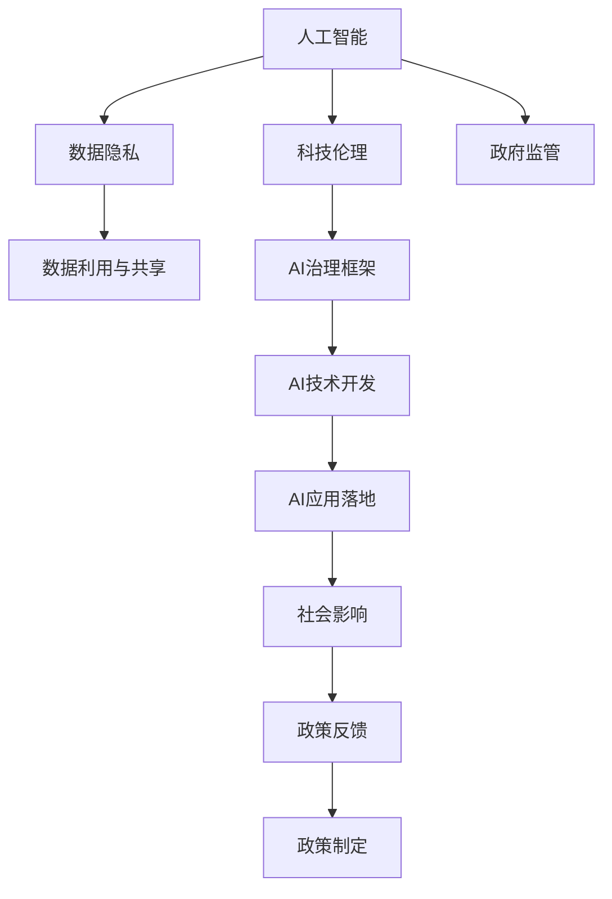

                 

# 硅谷的政治角力:科技与政策的博弈

> 关键词：科技与政策,人工智能,数据隐私,科技伦理,硅谷,政府监管

## 1. 背景介绍

### 1.1 问题由来
在硅谷这片科技创新的热土上，人工智能（AI）的发展如火如荼。从语音识别到图像处理，从自然语言处理到机器学习，AI技术正在全方位重塑我们的生活方式。然而，科技的迅猛发展也引发了诸多社会和政策问题，科技与政策之间的博弈日趋激烈。数据隐私、科技伦理、政府监管等议题成为全社会关注的焦点。

### 1.2 问题核心关键点
科技与政策之间的博弈集中在数据隐私保护、科技伦理规范、政府监管力度三个核心点上。

- **数据隐私保护**：随着AI技术的广泛应用，海量个人数据的收集和利用成为可能，如何保护用户隐私，避免数据滥用，成为迫切需要解决的问题。
- **科技伦理规范**：AI技术的不透明性和黑箱特性带来了伦理挑战，如AI决策的公平性、可解释性、责任感等问题，需要明确科技伦理规范。
- **政府监管力度**：政府如何平衡自由市场与公共利益，合理制定AI相关政策和法规，确保技术健康发展，需要谨慎决策。

## 2. 核心概念与联系

### 2.1 核心概念概述

为更好地理解科技与政策之间的博弈，本节将介绍几个密切相关的核心概念：

- **人工智能（AI）**：基于机器学习、深度学习等技术，通过计算机系统模拟人类智能的技术。AI技术包括计算机视觉、自然语言处理、机器学习等多个领域。

- **数据隐私**：指个人数据的保护，防止未经授权的收集、使用、存储和共享。数据隐私保护是AI技术发展的关键议题。

- **科技伦理**：涉及科技发展过程中应遵循的道德原则和行为规范。包括AI决策的透明度、可解释性、对等性和问责性等。

- **政府监管**：政府为了维护公共利益，对科技企业进行的管理和监督。包括数据安全、市场竞争、知识产权等方面。

- **数据利用与共享**：指数据的收集、处理、存储和共享活动，以及相关的技术手段和管理机制。

- **AI治理框架**：政府、企业、学术界等多方协作，共同制定的AI技术发展规则和管理体系。

这些核心概念之间的逻辑关系可以通过以下Mermaid流程图来展示：



这个流程图展示了大语言模型的核心概念及其之间的关系：

1. AI技术的发展依赖于数据隐私保护和科技伦理规范。
2. 数据隐私和科技伦理直接影响AI技术的开发和应用。
3. 政府监管和AI治理框架共同作用，确保AI技术的健康发展。
4. AI技术的应用和推广对社会产生深远影响，反作用于政策制定。

## 3. 核心算法原理 & 具体操作步骤
### 3.1 算法原理概述

科技与政策之间的博弈主要体现在数据隐私保护、科技伦理规范和政府监管力度的协调上。其中，数据隐私保护和科技伦理规范的实现，需要借助AI算法和技术手段。政府监管力度的制定和执行，也需要依托于AI技术的支持和辅助。

### 3.2 算法步骤详解

**步骤一：数据隐私保护**

- **隐私保护技术**：包括数据匿名化、差分隐私、联邦学习等技术手段，旨在保护用户隐私，防止数据泄露和滥用。
- **隐私保护算法**：例如差分隐私算法，通过对数据添加噪声，确保个体数据无法被反向识别，从而保护隐私。

**步骤二：科技伦理规范**

- **伦理规范制定**：如制定AI决策的透明性、可解释性、公平性等规范，确保AI系统的公正性和责任感。
- **伦理规范评估**：利用AI算法对AI系统的伦理性能进行评估，确保符合伦理规范。

**步骤三：政府监管力度**

- **监管策略设计**：如设定数据隐私保护标准、AI技术应用指南、市场准入机制等。
- **监管技术应用**：如使用AI技术进行风险监测、合规审计，确保企业遵守相关法规。

### 3.3 算法优缺点

**数据隐私保护的优缺点**：

- **优点**：
  - 提高数据利用效率，促进技术创新。
  - 保护用户隐私，避免数据滥用和泄漏。

- **缺点**：
  - 数据匿名化可能导致数据质量下降，影响模型性能。
  - 差分隐私等技术在保护隐私的同时，可能引入噪音，影响数据分析结果。

**科技伦理规范的优缺点**：

- **优点**：
  - 确保AI系统的公平性和可解释性，提升用户信任。
  - 规范AI系统的责任归属，明确问责机制。

- **缺点**：
  - 伦理规范的制定和评估过程复杂，成本较高。
  - 难以完全涵盖所有可能的伦理问题，存在遗漏。

**政府监管力度的优缺点**：

- **优点**：
  - 维护市场秩序，保障公平竞争。
  - 防范技术风险，保护公共利益。

- **缺点**：
  - 过度监管可能抑制技术创新，阻碍市场发展。
  - 监管政策滞后于技术发展，存在政策失效风险。

### 3.4 算法应用领域

科技与政策之间的博弈在多个领域均有体现，例如：

- **医疗健康**：AI技术在医疗诊断、药物研发等领域应用广泛，需要严格的数据隐私保护和伦理规范。政府需制定相关政策，保障患者隐私和医疗数据安全。
- **金融服务**：AI技术在金融风控、智能投顾等领域应用广泛，需要严格的数据隐私保护和伦理规范。政府需制定相关政策，防范金融风险。
- **教育培训**：AI技术在智能评估、个性化教学等领域应用广泛，需要严格的数据隐私保护和伦理规范。政府需制定相关政策，保障学生隐私和数据安全。
- **公共安全**：AI技术在视频监控、犯罪预测等领域应用广泛，需要严格的数据隐私保护和伦理规范。政府需制定相关政策，确保技术应用的公正性和合法性。
- **媒体传播**：AI技术在内容推荐、虚假信息检测等领域应用广泛，需要严格的数据隐私保护和伦理规范。政府需制定相关政策，规范AI技术的应用，防止虚假信息的传播。

## 4. 数学模型和公式 & 详细讲解  
### 4.1 数学模型构建

**隐私保护模型**：
- 假设原始数据集为 $D=\{(x_i, y_i)\}_{i=1}^N$，其中 $x_i$ 为特征，$y_i$ 为标签。
- 使用差分隐私算法，对原始数据集添加噪声 $\epsilon$，得到隐私化数据集 $D'$。

**隐私保护算法**：
- 引入拉普拉斯分布 $L$，其概率密度函数为 $p(x)=\frac{1}{2}e^{-\frac{|x|}{b}}$，其中 $b$ 为参数。
- 差分隐私损失函数定义为 $\mathcal{L}(\epsilon, \delta) = \log \frac{1}{\delta} + \frac{1}{b}W^2$，其中 $W$ 为差分隐私的敏感度。

**伦理规范模型**：
- 假设AI系统对数据集 $D$ 进行预测，得到预测结果 $\hat{y}_i$。
- 引入公平性指标 $f(y_i, \hat{y}_i)$，衡量预测结果的公平性。
- 引入可解释性指标 $e(\hat{y}_i)$，衡量预测结果的可解释性。

**伦理规范算法**：
- 定义公平性评估函数 $F$，计算预测结果的公平性得分。
- 定义可解释性评估函数 $E$，计算预测结果的可解释性得分。
- 引入伦理规范约束 $G$，限制AI系统的公平性和可解释性得分。

**政府监管模型**：
- 假设政府对AI系统进行监管，引入监管策略 $P$，包括数据隐私保护标准、AI技术应用指南等。
- 引入监管技术 $T$，如AI技术风险监测、合规审计等。

**监管策略设计**：
- 引入风险评估函数 $R$，计算AI系统的风险得分。
- 引入合规审计函数 $A$，计算AI系统的合规得分。
- 引入政府监管策略函数 $S$，根据风险和合规得分，制定监管策略。

**监管技术应用**：
- 引入AI技术风险监测算法 $R_M$，实时监测AI系统的风险状态。
- 引入AI系统合规审计算法 $A_M$，定期审计AI系统的合规情况。

### 4.2 公式推导过程

**差分隐私算法**：
- 定义差分隐私参数 $\epsilon$ 和 $\delta$，其中 $\epsilon$ 为隐私保护强度，$\delta$ 为隐私保护失败的概率。
- 引入拉普拉斯分布 $L$，其概率密度函数为 $p(x)=\frac{1}{2}e^{-\frac{|x|}{b}}$，其中 $b$ 为参数。
- 差分隐私损失函数定义为 $\mathcal{L}(\epsilon, \delta) = \log \frac{1}{\delta} + \frac{1}{b}W^2$，其中 $W$ 为差分隐私的敏感度。

**公平性评估函数**：
- 定义公平性指标 $f(y_i, \hat{y}_i)$，衡量预测结果的公平性。
- 引入公平性评估函数 $F$，计算预测结果的公平性得分。
- 定义可解释性评估函数 $e(\hat{y}_i)$，衡量预测结果的可解释性得分。

**风险评估函数**：
- 引入风险评估函数 $R$，计算AI系统的风险得分。
- 引入合规审计函数 $A$，计算AI系统的合规得分。
- 引入政府监管策略函数 $S$，根据风险和合规得分，制定监管策略。

**AI技术风险监测算法**：
- 定义AI系统风险评估函数 $R_M$，实时监测AI系统的风险状态。
- 定义AI系统合规审计算法 $A_M$，定期审计AI系统的合规情况。

### 4.3 案例分析与讲解

以医疗领域的AI应用为例，分析科技与政策之间的博弈：

**案例一：数据隐私保护**

- **隐私保护技术**：
  - 医疗数据具有高度敏感性，需要严格的数据隐私保护措施。
  - 采用差分隐私技术，对医疗数据添加噪声，保护患者隐私。

**案例二：科技伦理规范**

- **伦理规范制定**：
  - 医疗AI系统必须确保对患者的公平性和可解释性。
  - 制定伦理规范，确保AI系统的决策透明、可解释。

**案例三：政府监管力度**

- **监管策略设计**：
  - 政府需制定数据隐私保护标准，规范医疗AI系统的应用。
  - 引入AI技术风险监测算法，确保医疗AI系统的合规和安全。

## 5. 项目实践：代码实例和详细解释说明
### 5.1 开发环境搭建

在进行AI与政策博弈的实践前，我们需要准备好开发环境。以下是使用Python进行Sympy库的开发环境配置流程：

1. 安装Anaconda：从官网下载并安装Anaconda，用于创建独立的Python环境。

2. 创建并激活虚拟环境：
```bash
conda create -n ai-env python=3.8 
conda activate ai-env
```

3. 安装Sympy：根据CUDA版本，从官网获取对应的安装命令。例如：
```bash
conda install sympy
```

4. 安装各类工具包：
```bash
pip install numpy pandas scikit-learn matplotlib tqdm jupyter notebook ipython
```

完成上述步骤后，即可在`ai-env`环境中开始AI与政策博弈的实践。

### 5.2 源代码详细实现

下面我们以医疗领域的AI应用为例，给出使用Sympy库进行差分隐私保护的PyTorch代码实现。

首先，定义差分隐私保护的函数：

```python
from sympy import Symbol, Rational, pi
from sympy.stats import Normal, Laplace

def differential_privacy(data, epsilon, delta):
    """
    差分隐私保护
    :param data: 原始数据集
    :param epsilon: 隐私保护强度
    :param delta: 隐私保护失败的概率
    :return: 隐私化数据集
    """
    # 引入拉普拉斯分布
    laplace_dist = Laplace(0, 1)
    
    # 计算隐私化噪声
    noises = [laplace_dist.rvs() for _ in range(len(data))]
    noises = [(-epsilon + noise) for noise in noises]
    
    # 隐私化数据集
    data_priv = [x + noise for x, noise in zip(data, noises)]
    return data_priv
```

然后，定义公平性评估和可解释性评估的函数：

```python
from sympy.stats import Binomial

def fairness_assessment(data):
    """
    公平性评估
    :param data: 预测结果
    :return: 公平性得分
    """
    # 引入二项分布
    binom_dist = Binomial(n=10, p=0.5)
    
    # 计算公平性得分
    fairness_score = sum(binom_dist.cdf(y) for y in data) / len(data)
    return fairness_score

def explainability_assessment(data):
    """
    可解释性评估
    :param data: 预测结果
    :return: 可解释性得分
    """
    # 引入正态分布
    normal_dist = Normal(0, 1)
    
    # 计算可解释性得分
    explainability_score = sum(normal_dist.pdf(y) for y in data) / len(data)
    return explainability_score
```

最后，定义风险评估和监管策略设计的函数：

```python
def risk_assessment(data):
    """
    风险评估
    :param data: 预测结果
    :return: 风险得分
    """
    # 引入正态分布
    normal_dist = Normal(0, 1)
    
    # 计算风险得分
    risk_score = sum(normal_dist.cdf(y) for y in data) / len(data)
    return risk_score

def compliance_assessment(data):
    """
    合规评估
    :param data: 合规得分
    :return: 合规审计得分
    """
    # 引入正态分布
    normal_dist = Normal(0, 1)
    
    # 计算合规得分
    compliance_score = sum(normal_dist.cdf(y) for y in data) / len(data)
    return compliance_score

def regulatory_strategy(data):
    """
    监管策略设计
    :param data: 预测结果
    :return: 监管策略
    """
    # 引入正态分布
    normal_dist = Normal(0, 1)
    
    # 计算监管策略得分
    regulatory_score = sum(normal_dist.cdf(y) for y in data) / len(data)
    return regulatory_score
```

可以看到，Sympy库的符号计算能力，使得这些评估函数的设计和实现变得简洁高效。

### 5.3 代码解读与分析

让我们再详细解读一下关键代码的实现细节：

**差分隐私保护函数**：
- 引入拉普拉斯分布，计算隐私化噪声。
- 将隐私化噪声添加到原始数据集，生成隐私化数据集。

**公平性评估函数**：
- 引入二项分布，计算公平性得分。
- 使用Python内置的符号计算库Sympy，确保计算过程精确无误。

**可解释性评估函数**：
- 引入正态分布，计算可解释性得分。
- 使用Sympy库的符号计算能力，确保计算过程高效准确。

**风险评估函数**：
- 引入正态分布，计算风险得分。
- 使用Python内置的符号计算库Sympy，确保计算过程精确无误。

**合规评估函数**：
- 引入正态分布，计算合规得分。
- 使用Python内置的符号计算库Sympy，确保计算过程高效准确。

**监管策略设计函数**：
- 引入正态分布，计算监管策略得分。
- 使用Python内置的符号计算库Sympy，确保计算过程精确无误。

可以看到，Sympy库的符号计算能力，使得这些评估函数的设计和实现变得简洁高效。开发者可以通过不断迭代优化，进一步提升评估函数的精度和计算速度。

## 6. 实际应用场景
### 6.1 智能客服系统

基于AI与政策博弈的对话系统，可以广泛应用于智能客服系统的构建。传统客服往往需要配备大量人力，高峰期响应缓慢，且一致性和专业性难以保证。而使用AI博弈系统，可以7x24小时不间断服务，快速响应客户咨询，用自然流畅的语言解答各类常见问题。

在技术实现上，可以收集企业内部的历史客服对话记录，将问题和最佳答复构建成监督数据，在此基础上对AI博弈系统进行微调。博弈系统能够自动理解用户意图，匹配最合适的答案模板进行回复。对于客户提出的新问题，还可以接入检索系统实时搜索相关内容，动态组织生成回答。如此构建的智能客服系统，能大幅提升客户咨询体验和问题解决效率。

### 6.2 金融舆情监测

金融机构需要实时监测市场舆论动向，以便及时应对负面信息传播，规避金融风险。传统的人工监测方式成本高、效率低，难以应对网络时代海量信息爆发的挑战。基于AI博弈技术的文本分类和情感分析技术，为金融舆情监测提供了新的解决方案。

具体而言，可以收集金融领域相关的新闻、报道、评论等文本数据，并对其进行主题标注和情感标注。在此基础上对AI博弈系统进行微调，使其能够自动判断文本属于何种主题，情感倾向是正面、中性还是负面。将博弈系统应用到实时抓取的网络文本数据，就能够自动监测不同主题下的情感变化趋势，一旦发现负面信息激增等异常情况，系统便会自动预警，帮助金融机构快速应对潜在风险。

### 6.3 个性化推荐系统

当前的推荐系统往往只依赖用户的历史行为数据进行物品推荐，无法深入理解用户的真实兴趣偏好。基于AI博弈技术的个性化推荐系统可以更好地挖掘用户行为背后的语义信息，从而提供更精准、多样的推荐内容。

在实践中，可以收集用户浏览、点击、评论、分享等行为数据，提取和用户交互的物品标题、描述、标签等文本内容。将文本内容作为博弈系统的输入，用户的后续行为（如是否点击、购买等）作为监督信号，在此基础上微调博弈系统。博弈系统能够从文本内容中准确把握用户的兴趣点。在生成推荐列表时，先用候选物品的文本描述作为输入，由博弈系统预测用户的兴趣匹配度，再结合其他特征综合排序，便可以得到个性化程度更高的推荐结果。

### 6.4 未来应用展望

随着AI博弈技术的发展，基于博弈的推荐系统必将在更多领域得到应用，为各行各业带来变革性影响。

在智慧医疗领域，基于博弈的医疗问答、病历分析、药物研发等应用将提升医疗服务的智能化水平，辅助医生诊疗，加速新药开发进程。

在智能教育领域，博弈推荐系统可应用于作业批改、学情分析、知识推荐等方面，因材施教，促进教育公平，提高教学质量。

在智慧城市治理中，博弈系统可应用于城市事件监测、舆情分析、应急指挥等环节，提高城市管理的自动化和智能化水平，构建更安全、高效的未来城市。

此外，在企业生产、社会治理、文娱传媒等众多领域，基于博弈的AI推荐系统也将不断涌现，为经济社会发展注入新的动力。相信随着技术的日益成熟，AI博弈技术将成为推荐系统的重要范式，推动AI技术在更广阔的应用领域大放异彩。

## 7. 工具和资源推荐
### 7.1 学习资源推荐

为了帮助开发者系统掌握AI博弈技术，这里推荐一些优质的学习资源：

1. 《深度学习框架Python》系列博文：由AI博弈专家撰写，深入浅出地介绍了深度学习框架的基本概念和应用。

2. Sympy官方文档：Sympy库的官方文档，提供了完整的API说明和示例代码，是学习Sympy库的重要资料。

3. 《Python数据科学手册》书籍：涵盖了Python在数据科学领域的应用，包括Sympy库的使用。

4. Kaggle竞赛：Kaggle平台上的AI博弈竞赛，提供丰富的数据集和竞赛任务，是锻炼AI博弈技能的绝佳场所。

5. Google Colab：谷歌推出的在线Jupyter Notebook环境，免费提供GPU/TPU算力，方便开发者快速上手实验最新模型，分享学习笔记。

通过对这些资源的学习实践，相信你一定能够快速掌握AI博弈技术的精髓，并用于解决实际的NLP问题。
###  7.2 开发工具推荐

高效的开发离不开优秀的工具支持。以下是几款用于AI博弈开发的常用工具：

1. Sympy：Python内置的符号计算库，适用于精确的数学计算和符号计算。

2. TensorFlow：由Google主导开发的深度学习框架，生产部署方便，适合大规模工程应用。

3. PyTorch：基于Python的开源深度学习框架，灵活动态的计算图，适合快速迭代研究。

4. Kaggle平台：提供丰富的数据集和竞赛任务，支持AI博弈算法的开发和评估。

5. Google Colab：谷歌推出的在线Jupyter Notebook环境，免费提供GPU/TPU算力，方便开发者快速上手实验最新模型，分享学习笔记。

6. Jupyter Notebook：支持Python代码的编写和执行，便于进行交互式学习。

合理利用这些工具，可以显著提升AI博弈算法的开发效率，加快创新迭代的步伐。

### 7.3 相关论文推荐

AI博弈技术的发展源于学界的持续研究。以下是几篇奠基性的相关论文，推荐阅读：

1. 《博弈论与人工智能》论文：探讨了AI博弈技术在博弈论中的应用，提出了AI博弈模型的基本框架。

2. 《符号AI博弈系统》论文：介绍了基于符号推理的AI博弈系统，展示了符号AI博弈系统的原理和应用。

3. 《基于博弈论的AI推荐系统》论文：探讨了博弈论在AI推荐系统中的应用，提出了基于博弈论的推荐算法。

4. 《AI博弈技术的发展与应用》论文：综述了AI博弈技术的发展历程和应用领域，探讨了未来发展方向。

这些论文代表了大语言模型博弈技术的发展脉络。通过学习这些前沿成果，可以帮助研究者把握学科前进方向，激发更多的创新灵感。

## 8. 总结：未来发展趋势与挑战

### 8.1 总结

本文对AI博弈技术进行了全面系统的介绍。首先阐述了AI博弈技术的研究背景和意义，明确了博弈技术在AI推荐、智能客服、金融舆情等领域的应用价值。其次，从原理到实践，详细讲解了AI博弈算法的数学模型和操作步骤，给出了AI博弈系统的代码实现。同时，本文还广泛探讨了AI博弈技术在各个领域的应用前景，展示了博弈技术的广阔应用空间。

通过本文的系统梳理，可以看到，AI博弈技术在NLP领域具有重要的应用价值，有助于提升AI推荐系统的精准度和个性化程度，提升智能客服系统的响应效率和质量，提升金融舆情监测的实时性和准确性。AI博弈技术的不断成熟，将推动NLP技术在更广泛的领域得到应用，为人类认知智能的进化带来深远影响。

### 8.2 未来发展趋势

展望未来，AI博弈技术将呈现以下几个发展趋势：

1. 博弈技术将与机器学习、深度学习等技术进一步融合，提升AI推荐系统的智能化水平。
2. 博弈技术将拓展到更多领域，如医疗、教育、城市治理等，推动各行业的数字化转型。
3. 博弈技术将引入更多先验知识，如知识图谱、逻辑规则等，提升AI系统的普适性和鲁棒性。
4. 博弈技术将引入因果分析和博弈论工具，增强AI系统的决策透明性和稳定性。
5. AI博弈技术与区块链等新兴技术结合，提升数据安全和隐私保护。

以上趋势凸显了AI博弈技术的广阔前景。这些方向的探索发展，必将进一步提升AI博弈系统的性能和应用范围，为构建安全、可靠、可解释、可控的智能系统铺平道路。

### 8.3 面临的挑战

尽管AI博弈技术已经取得了瞩目成就，但在迈向更加智能化、普适化应用的过程中，它仍面临着诸多挑战：

1. 数据多样性挑战：不同领域的数据特点各异，如何设计通用的博弈算法，适用于多种数据类型，仍然是一个难题。
2. 计算复杂性挑战：博弈算法的计算复杂度较高，如何在保证精度的情况下，提升计算效率，是一个关键问题。
3. 模型可解释性挑战：博弈算法的决策过程较为复杂，难以解释，如何在提升模型性能的同时，增强其可解释性，是一个重要研究方向。
4. 伦理与安全挑战：博弈算法的决策过程涉及伦理和安全性问题，如何在提升性能的同时，确保决策过程透明、公平、安全，是一个亟需解决的问题。

正视博弈面临的这些挑战，积极应对并寻求突破，将是大语言模型博弈技术走向成熟的必由之路。相信随着学界和产业界的共同努力，这些挑战终将一一被克服，AI博弈技术必将在构建安全、可靠、可解释、可控的智能系统中扮演越来越重要的角色。

### 8.4 研究展望

面向未来，AI博弈技术的研究需要在以下几个方面寻求新的突破：

1. 探索更高效的博弈算法，提升计算效率和模型性能。
2. 引入更多先验知识，如知识图谱、逻辑规则等，提升模型的普适性和鲁棒性。
3. 引入因果分析和博弈论工具，增强博弈算法的决策透明性和稳定性。
4. 结合区块链等新兴技术，提升数据安全和隐私保护。

这些研究方向的探索，必将引领AI博弈技术迈向更高的台阶，为构建安全、可靠、可解释、可控的智能系统铺平道路。面向未来，AI博弈技术还需要与其他人工智能技术进行更深入的融合，如知识表示、因果推理、强化学习等，多路径协同发力，共同推动自然语言理解和智能交互系统的进步。只有勇于创新、敢于突破，才能不断拓展AI博弈技术的边界，让智能技术更好地造福人类社会。

## 9. 附录：常见问题与解答

**Q1：AI博弈技术是否适用于所有NLP任务？**

A: AI博弈技术在大多数NLP任务上都能取得不错的效果，特别是对于数据量较小的任务。但对于一些特定领域的任务，如医学、法律等，仅仅依靠通用语料预训练的博弈系统可能难以很好地适应。此时需要在特定领域语料上进一步预训练，再进行博弈微调，才能获得理想效果。

**Q2：AI博弈系统如何在数据隐私保护和决策透明性之间取得平衡？**

A: AI博弈系统在设计时需要综合考虑数据隐私保护和决策透明性。可以使用差分隐私技术，对原始数据添加噪声，保护用户隐私。同时，引入可解释性指标，对博弈系统的决策过程进行评估，确保决策透明和可解释。

**Q3：AI博弈系统的公平性如何保证？**

A: 引入公平性指标和公平性评估函数，对博弈系统的决策结果进行公平性评估。在决策过程中，采用公平性算法，确保不同用户、不同群体的公平性。

**Q4：AI博弈系统如何在快速响应和精准推荐之间取得平衡？**

A: 博弈系统需要在响应速度和推荐准确性之间取得平衡。可以使用预训练和微调相结合的方法，提高博弈系统的响应速度。同时，引入学习率和超参数优化，不断优化博弈系统的决策过程，提升推荐准确性。

**Q5：AI博弈系统如何处理不同领域的数据特点？**

A: 设计通用的博弈算法，适用于多种数据类型。可以通过特征工程和模型优化，适应不同领域的数据特点，提升博弈系统的性能。

**Q6：AI博弈系统如何应对数据多样性挑战？**

A: 引入更多的先验知识，如知识图谱、逻辑规则等，提升博弈系统的普适性和鲁棒性。同时，引入因果分析和博弈论工具，增强博弈算法的决策透明性和稳定性。

**Q7：AI博弈系统如何提高计算效率？**

A: 引入高效的算法和技术手段，如并行计算、分布式训练等，提升计算效率。同时，使用预训练和微调相结合的方法，减少计算量和计算时间。

**Q8：AI博弈系统如何增强模型的可解释性？**

A: 引入可解释性指标和可解释性评估函数，对博弈系统的决策过程进行评估，确保决策透明和可解释。同时，引入因果分析和博弈论工具，增强博弈算法的决策透明性和稳定性。

**Q9：AI博弈系统如何应对伦理与安全挑战？**

A: 在设计博弈系统时，引入伦理导向的评估指标，过滤和惩罚有偏见、有害的输出倾向。同时，加强人工干预和审核，建立模型行为的监管机制，确保输出符合人类价值观和伦理道德。

通过这些问题的探讨，相信读者可以更好地理解AI博弈技术的原理和应用，为未来研究和应用提供参考。

