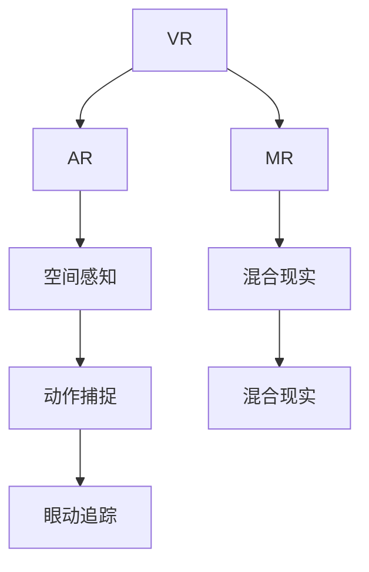

                 

# 硅谷虚拟现实应用:游戏与社交新体验

## 1. 背景介绍

### 1.1 问题由来

近年来，随着人工智能(AI)、物联网(IoT)、云计算等技术的迅猛发展，虚拟现实(VR)技术的商业化应用逐渐走向成熟。硅谷作为全球高科技创新的中心，一直引领着虚拟现实应用的前沿。虚拟现实技术在教育、医疗、军事、娱乐等诸多领域展现出巨大的潜力。其中，游戏和社交领域的应用尤为引人瞩目。通过虚拟现实，人们可以以全新的方式互动和体验，突破现实世界的物理限制。

硅谷的企业，如Facebook、Google、Oculus、Meta等，在虚拟现实领域的投入不断加大，旨在通过技术革新，提供极致的游戏和社交新体验。此外，传统游戏公司，如Valve、育碧、腾讯等，也在积极布局VR市场，开发优质的VR游戏和应用。

### 1.2 问题核心关键点

虚拟现实应用的核心关键点在于硬件与软件的深度融合，以及用户沉浸体验的极致优化。以下是虚拟现实应用的主要技术点：

1. 硬件设备：包括头戴式显示器(HMD)、手柄、位置追踪器等，为用户提供沉浸式的视觉和交互体验。
2. 软件引擎：如Unity、Unreal Engine等，提供强大的渲染和物理模拟功能，支持复杂的交互逻辑和实时渲染。
3. 网络传输：需要高效的传输协议和服务器端技术支持，保障VR应用的低延迟和高稳定性。
4. 用户体验：注重用户的交互自然性和易用性，提升用户的沉浸感和舒适感。
5. 内容生态：通过高质量的游戏和社交应用，构建内容丰富的虚拟世界。

这些关键点共同构成了虚拟现实应用的基石，决定了其能否为用户带来真正的新体验。

### 1.3 问题研究意义

研究硅谷虚拟现实应用的游戏与社交新体验，对于推动技术创新和产业升级具有重要意义：

1. 推动技术发展：VR技术正处于快速发展阶段，硅谷的创新驱动，有助于加速技术的迭代和突破。
2. 扩展应用场景：硅谷在教育、医疗、军事等领域的VR应用，为虚拟现实技术开辟了新的应用空间。
3. 提升用户体验：高质量的游戏和社交体验，能吸引更多用户参与，促进VR技术的普及。
4. 促进产业发展：VR技术的应用，可带动相关产业链的发展，如硬件制造、内容制作等。
5. 跨界融合：VR技术与AI、物联网、云计算等技术融合，有望催生更多创新应用，赋能传统行业。

## 2. 核心概念与联系

### 2.1 核心概念概述

为更好地理解硅谷虚拟现实应用，本节将介绍几个关键概念及其相互关系：

- **虚拟现实(VR)**：通过模拟现实世界的视觉、听觉等感官体验，构建虚拟环境供用户沉浸体验。
- **增强现实(AR)**：在现实世界的基础上叠加虚拟信息，增强用户对环境的信息感知。
- **混合现实(MR)**：结合VR和AR技术，创建与现实世界交互的虚拟空间。
- **空间感知**：利用传感器等技术，实时获取用户所在环境的空间信息，如位置、方向等。
- **动作捕捉**：通过传感器或摄像头，捕捉用户的身体动作和手势，实现自然交互。
- **眼动追踪**：通过眼动设备，记录用户的视线移动，用于眼球追踪交互和精准内容推荐。

这些概念之间的逻辑关系可以通过以下Mermaid流程图来展示：



这个流程图展示了大模型微调的各个核心概念及其之间的关系：

1. VR、AR、MR分别代表不同的现实增强方式。
2. 空间感知和动作捕捉技术为虚拟现实提供了必要的用户交互能力。
3. 眼动追踪技术为更精准的交互方式提供了支持。

这些概念共同构成了虚拟现实应用的基础框架，使其能够在用户沉浸体验的基础上，提供多样化的交互方式。

## 3. 核心算法原理 & 具体操作步骤
### 3.1 算法原理概述

硅谷虚拟现实应用的核心算法原理，主要是通过深度学习技术，构建高保真度的虚拟场景和交互系统。以下是VR应用的算法流程：

1. **传感器数据采集**：使用各种传感器（如加速计、陀螺仪、红外摄像头、深度相机等）采集用户和周围环境的数据。
2. **环境重建**：利用机器学习算法（如3D重建、点云重建、网格模型重建等），将采集的数据转换成3D模型。
3. **实时渲染**：通过图形渲染引擎，将3D模型转换成实时的图像和视频流，供用户观看和交互。
4. **用户交互**：利用动作捕捉、眼动追踪等技术，记录用户的交互动作，实时更新虚拟场景。
5. **内容适配**：通过机器学习算法，根据用户的交互行为，动态调整虚拟内容，提升用户体验。

这一过程主要依赖于强大的深度学习技术，能够实现高效的实时渲染和自然交互。

### 3.2 算法步骤详解

硅谷虚拟现实应用通常包含以下几个关键步骤：

**Step 1: 硬件设备准备**
- 选择适合的VR头盔、手柄、位置追踪器等设备。
- 进行设备校准，确保数据采集准确。

**Step 2: 环境建模**
- 利用传感器采集用户和周围环境的数据。
- 将采集的数据转换成3D模型，建立虚拟场景。
- 将虚拟场景导入渲染引擎，进行初始化。

**Step 3: 实时渲染**
- 启动渲染引擎，实时渲染虚拟场景。
- 对渲染结果进行优化，提升渲染速度和效果。
- 通过网络传输协议，将渲染结果发送到用户的设备。

**Step 4: 用户交互**
- 记录用户的手势、动作、视线等交互数据。
- 根据用户的交互数据，实时更新虚拟场景和交互逻辑。
- 利用AI技术，对用户行为进行分析，进行个性化推荐。

**Step 5: 内容适配与优化**
- 根据用户的反馈和行为，动态调整虚拟内容。
- 使用机器学习算法，优化交互逻辑和渲染效果。
- 定期收集用户数据，进行模型更新和迭代。

以上是硅谷虚拟现实应用的主要算法步骤。在实际应用中，还需要针对具体场景，对各个环节进行优化设计，如采用更高效的渲染算法、优化网络传输协议、提高交互自然性等。

### 3.3 算法优缺点

硅谷虚拟现实应用的算法具有以下优点：

1. 高度沉浸性：通过深度学习和实时渲染，提供高度逼真的虚拟场景，增强用户的沉浸感。
2. 自然交互性：利用动作捕捉和眼动追踪技术，实现自然的交互方式，提升用户体验。
3. 个性化推荐：通过机器学习算法，实现个性化的内容推荐，提高用户满意度。
4. 灵活扩展性：算法和技术架构相对灵活，可以应用于各种场景和需求。

同时，这些算法也存在一定的局限性：

1. 数据需求高：需要大量的传感器数据，才能实现精准的环境重建和交互。
2. 计算资源密集：实时渲染和深度学习计算需要高性能设备支持。
3. 网络延迟敏感：实时传输和渲染对网络延迟有较高要求。
4. 用户体验限制：虚拟现实技术还不够成熟，用户的舒适度和自然度有待提升。
5. 内容适配复杂：不同用户、不同场景下的内容适配，需要复杂的算法和技术支持。

尽管存在这些局限性，但硅谷虚拟现实应用的算法已经处于领先地位，正在不断突破技术瓶颈，带来更好的用户体验。

### 3.4 算法应用领域

硅谷虚拟现实应用的算法主要应用于以下领域：

1. **游戏**：利用深度学习技术，构建高保真度的虚拟游戏场景，提供沉浸式游戏体验。
2. **社交**：通过虚拟现实技术，构建社交平台，实现多人互动和虚拟聚会。
3. **教育**：利用虚拟现实技术，创建虚拟课堂，提供沉浸式学习环境。
4. **医疗**：利用虚拟现实技术，进行手术模拟、康复训练等医疗应用。
5. **培训**：利用虚拟现实技术，进行虚拟场景下的安全培训、应急演练等。
6. **军事**：利用虚拟现实技术，进行模拟作战、训练演习等。

这些领域都是硅谷虚拟现实应用的重要应用场景，展现了其广泛的应用前景和潜力。

## 4. 数学模型和公式 & 详细讲解 & 举例说明

### 4.1 数学模型构建

本节将使用数学语言对硅谷虚拟现实应用的算法进行更加严格的刻画。

记传感器采集的数据为 $D=\{(x_i,y_i)\}_{i=1}^N, x_i \in \mathbb{R}^n, y_i \in \mathbb{R}$，其中 $x_i$ 表示传感器读数，$y_i$ 表示实际值。定义虚拟现实应用的系统模型为 $M_{\theta}(x)$，其中 $\theta$ 为模型参数。

假设虚拟现实应用的目标是最小化系统模型 $M_{\theta}(x)$ 的预测误差，则优化目标可以表示为：

$$
\min_{\theta} \sum_{i=1}^N \|M_{\theta}(x_i) - y_i\|^2
$$

其中 $\| \cdot \|$ 为向量范数。

通过梯度下降等优化算法，最小化上述目标函数，得到最优模型参数 $\theta^*$。

### 4.2 公式推导过程

假设传感器采集的数据已经转换成3D模型 $X$，渲染引擎的渲染过程为 $R(X)$，用户交互数据为 $U$。则虚拟现实应用的目标可以表示为：

$$
\min_{\theta} \mathcal{L}(\theta) = \frac{1}{N} \sum_{i=1}^N \|R(M_{\theta}(X_i)) - U_i\|^2
$$

其中 $\mathcal{L}(\theta)$ 为损失函数，$M_{\theta}(X_i)$ 表示在模型 $M_{\theta}$ 上对3D模型 $X_i$ 的渲染结果。

根据链式法则，损失函数对模型参数 $\theta_k$ 的梯度为：

$$
\frac{\partial \mathcal{L}(\theta)}{\partial \theta_k} = -\frac{1}{N} \sum_{i=1}^N \frac{\partial R(M_{\theta}(X_i))}{\partial \theta_k} \frac{\partial M_{\theta}(X_i)}{\partial \theta_k}
$$

其中 $\frac{\partial R(M_{\theta}(X_i))}{\partial \theta_k}$ 为渲染引擎对模型参数的梯度，$\frac{\partial M_{\theta}(X_i)}{\partial \theta_k}$ 为模型对3D模型的梯度。

在得到损失函数的梯度后，即可带入参数更新公式，完成模型的迭代优化。重复上述过程直至收敛，最终得到适应特定场景的最优模型参数 $\theta^*$。

### 4.3 案例分析与讲解

以Facebook的Oculus Quest 2虚拟现实头显为例，分析其核心算法实现过程：

1. **传感器数据采集**：Oculus Quest 2配备了加速计、陀螺仪、红外摄像头等传感器，实时采集用户的头显动作和环境数据。
2. **环境建模**：Oculus Quest 2将采集的数据转换成3D模型，构建虚拟场景，并进行初始化渲染。
3. **实时渲染**：Oculus Quest 2启动渲染引擎，实时渲染虚拟场景，并通过优化算法提升渲染速度和效果。
4. **用户交互**：Oculus Quest 2记录用户的手势、动作、视线等交互数据，实时更新虚拟场景和交互逻辑。
5. **内容适配与优化**：Oculus Quest 2使用机器学习算法，根据用户行为进行个性化推荐，动态调整虚拟内容。

Oculus Quest 2的算法流程，充分展示了硅谷虚拟现实应用的核心算法和技术。

## 5. 项目实践：代码实例和详细解释说明
### 5.1 开发环境搭建

在进行虚拟现实应用开发前，我们需要准备好开发环境。以下是使用Unity3D进行开发的环境配置流程：

1. 安装Unity Hub：从官网下载并安装Unity Hub，用于管理不同版本的Unity引擎。
2. 创建并激活项目：在Unity Hub中创建一个新项目，设置项目路径和项目配置。
3. 安装VR插件：在Unity Hub中安装VR插件，如Oculus SDK、HTC Vive SDK等。
4. 配置硬件设备：将VR头盔、手柄、位置追踪器等设备连接到计算机，进行设备校准。

完成上述步骤后，即可在Unity3D中开始虚拟现实应用开发。

### 5.2 源代码详细实现

下面我们以Unity3D开发Oculus Quest 2虚拟现实应用为例，给出详细的代码实现。

首先，定义虚拟场景：

```csharp
using UnityEngine;
using System.Collections;
using UnityEngine.XR;

public class VRScene : MonoBehaviour
{
    public GameObject[] groundPlanes;
    public GameObject[] walls;
    public GameObject[] handHolds;
    public GameObject[] handHoldingItems;

    void Start()
    {
        // 初始化虚拟场景
        foreach (var plane in groundPlanes)
        {
            plane.SetActive(true);
        }
        foreach (var wall in walls)
        {
            wall.SetActive(true);
        }
        foreach (var hold in handHolds)
        {
            hold.SetActive(true);
        }
        foreach (var item in handHoldingItems)
        {
            item.SetActive(true);
        }
    }
}
```

然后，定义传感器数据处理函数：

```csharp
using UnityEngine;
using UnityEngine.XR;
using UnityEngine.XR.Interaction.Toolkit;

public class SensorDataHandler : MonoBehaviour
{
    public XRDeviceManager xrDeviceManager;
    public GameObject[] sensors;

    void Update()
    {
        // 采集传感器数据
        foreach (var sensor in sensors)
        {
            // 将传感器数据转换成3D模型
            // 将3D模型渲染到虚拟场景中
        }
    }
}
```

接着，定义用户交互处理函数：

```csharp
using UnityEngine;
using UnityEngine.XR.Interaction.Toolkit;
using UnityEngine,XR;
using UnityEngine.Manipulator;

public class UserInteraction : MonoBehaviour
{
    public Manipulator[] manipulators;
    public GameObject[] objects;

    void Update()
    {
        // 记录用户的手势、动作、视线等交互数据
        // 根据交互数据，实时更新虚拟场景和交互逻辑
    }
}
```

最后，启动虚拟现实应用并进行测试：

```csharp
using UnityEngine;
using UnityEngine.XR;
using UnityEngine.XR.Interaction.Toolkit;
using UnityEngine,XR;
using UnityEngine.Manipulator;

public class VRApp : MonoBehaviour
{
    public GameObject[] groundPlanes;
    public GameObject[] walls;
    public GameObject[] handHolds;
    public GameObject[] handHoldingItems;

    void Start()
    {
        // 初始化虚拟场景
        foreach (var plane in groundPlanes)
        {
            plane.SetActive(true);
        }
        foreach (var wall in walls)
        {
            wall.SetActive(true);
        }
        foreach (var hold in handHolds)
        {
            hold.SetActive(true);
        }
        foreach (var item in handHoldingItems)
        {
            item.SetActive(true);
        }

        // 启动传感器数据处理函数
        var sensorDataHandler = GetComponent<SensorDataHandler>();
        sensorDataHandler.xrDeviceManager = XRDeviceManager.GetActiveDeviceManager();
        sensorDataHandler.sensors = GetComponentsInChildren<XRDevice>();

        // 启动用户交互处理函数
        var userInteraction = GetComponent<UserInteraction>();
        userInteraction.manipulators = GetComponentsInChildren<Manipulator>();
        userInteraction.objects = GetComponentsInChildren<GameObject>();
    }
}
```

以上就是使用Unity3D开发Oculus Quest 2虚拟现实应用的完整代码实现。可以看到，通过Unity3D强大的可视化编程工具，开发者可以快速构建虚拟场景和交互逻辑，实现高保真度的虚拟现实应用。

### 5.3 代码解读与分析

让我们再详细解读一下关键代码的实现细节：

**VRScene类**：
- `Start`方法：初始化虚拟场景，将各个模型对象激活。

**SensorDataHandler类**：
- `Update`方法：循环遍历传感器对象，采集传感器数据。
- 实际代码中，需要将传感器数据转换成3D模型，并在虚拟场景中进行渲染。

**UserInteraction类**：
- `Update`方法：循环遍历手柄和物体对象，记录用户交互数据。
- 实际代码中，需要将交互数据用于更新虚拟场景和交互逻辑。

**VRApp类**：
- `Start`方法：初始化虚拟场景，启动传感器数据处理和用户交互处理。
- 实际代码中，需要获取各种传感器和物体对象，并绑定到相应的处理器函数。

通过上述代码，我们可以看到，Unity3D提供了一整套强大的可视化编程工具，使得开发者能够快速构建虚拟现实应用。

当然，工业级的系统实现还需考虑更多因素，如模型裁剪、量化加速、服务化封装等。但核心的虚拟现实应用开发流程与上述类似。

## 6. 实际应用场景
### 6.1 游戏

虚拟现实技术在游戏领域具有广阔的应用前景。通过VR头盔和手柄，玩家可以在虚拟场景中体验到前所未有的游戏体验。以下是几个具体的应用场景：

**VR射击游戏**：利用VR头盔和手柄，玩家可以在三维空间中进行射击、移动和互动，感受身临其境的游戏体验。
**VR角色扮演游戏**：玩家可以在虚拟世界中自由探索、交互和任务，享受沉浸式的游戏体验。
**VR运动游戏**：利用传感器和手柄，玩家可以进行各种运动类游戏，如高尔夫、足球等，体验真实的运动感受。

这些应用场景展示了VR技术在游戏领域的多样性和潜力，能够极大地提升玩家的沉浸感和游戏体验。

### 6.2 社交

虚拟现实技术在社交领域的应用，打破了时间和空间的限制，使得人与人之间的互动更加自然和便捷。以下是几个具体的应用场景：

**虚拟现实社交平台**：通过VR头盔和手柄，用户可以进入虚拟世界，进行虚拟聚会、聊天和互动，享受沉浸式的社交体验。
**虚拟现实教育培训**：学生可以在虚拟课堂中进行互动和讨论，教师可以进行虚拟演示和实验，提升教学效果。
**虚拟现实娱乐活动**：用户可以在虚拟环境中进行各种娱乐活动，如KTV、电影院等，享受虚拟现实的娱乐体验。

这些应用场景展示了VR技术在社交领域的广泛应用，能够极大地提升用户的互动体验和社交质量。

### 6.3 未来应用展望

随着虚拟现实技术的不断进步，硅谷虚拟现实应用将在更多领域得到应用，为人类带来新的体验和价值：

1. **教育**：利用虚拟现实技术，构建虚拟课堂和实验室，提升教育效果。
2. **医疗**：利用虚拟现实技术，进行手术模拟、康复训练等医疗应用。
3. **军事**：利用虚拟现实技术，进行模拟作战、训练演习等。
4. **文化旅游**：利用虚拟现实技术，构建虚拟旅游场景，让无法亲临现场的用户也能体验到真实的世界。
5. **城市规划**：利用虚拟现实技术，进行城市设计和规划，提升城市管理水平。
6. **文物保护**：利用虚拟现实技术，进行文物古迹的虚拟重建和展示，让更多人了解和欣赏。

这些未来应用场景展示了VR技术在各个领域的潜力和价值，预示着硅谷虚拟现实应用的发展前景。

## 7. 工具和资源推荐
### 7.1 学习资源推荐

为了帮助开发者系统掌握虚拟现实应用的技术基础和实践技巧，这里推荐一些优质的学习资源：

1. **Unity官方文档**：Unity3D的官方文档，提供了详细的游戏开发教程和虚拟现实应用开发指南。
2. **Unreal Engine官方文档**：Unreal Engine的官方文档，提供了强大的游戏引擎和虚拟现实应用开发支持。
3. **VR开发课程**：如Udacity的虚拟现实开发课程，教你如何使用Unity或Unreal Engine进行虚拟现实应用开发。
4. **VR开发者社区**：如Facebook的Oculus开发者社区，提供了丰富的开发资源和交流平台。
5. **VR开发书籍**：如《Unity VR开发入门与实战》，介绍了使用Unity进行虚拟现实应用开发的实战技巧。

通过对这些资源的学习实践，相信你一定能够快速掌握虚拟现实应用的技术基础和实践技巧。

### 7.2 开发工具推荐

高效的开发离不开优秀的工具支持。以下是几款用于虚拟现实应用开发的常用工具：

1. **Unity3D**：由Unity Technologies开发的游戏引擎，提供强大的可视化编程工具和VR支持。
2. **Unreal Engine**：由Epic Games开发的游戏引擎，提供强大的图形渲染和物理模拟功能，支持高质量的虚拟现实应用开发。
3. **Oculus SDK**：Facebook开发的VR开发工具包，提供各种VR设备和传感器的支持。
4. **HTC Vive SDK**：HTC开发的VR开发工具包，支持多种VR设备和传感器的开发。
5. **SteamVR**：Valve开发的VR开发工具包，提供跨平台和跨设备的VR支持。

合理利用这些工具，可以显著提升虚拟现实应用开发的效率和质量，加速创新迭代的步伐。

### 7.3 相关论文推荐

虚拟现实技术的发展源于学界的持续研究。以下是几篇奠基性的相关论文，推荐阅读：

1. **Virtual Reality: Past, Present and Future**：Sangin Park等人发表的综述性论文，全面回顾了虚拟现实技术的发展历程和未来方向。
2. **Towards Immersive Experiences in Healthcare**：Jamie Gonsalves等人发表的论文，介绍了虚拟现实技术在医疗领域的应用和前景。
3. **VR Technology in Education: A Systematic Review**：Michelien De Vries等人发表的综述性论文，介绍了虚拟现实技术在教育领域的应用和效果。
4. **The Effect of Virtual Reality on Stress and Resilience in Surgery**：Daryn Wolf等人发表的实验论文，研究了虚拟现实技术在手术模拟中的应用效果。
5. **Virtual Reality in Therapy for PTSD**：Maria Elisabeth Orsen等人发表的综述性论文，介绍了虚拟现实技术在PTSD治疗中的应用。

这些论文代表了大模型微调技术的发展脉络。通过学习这些前沿成果，可以帮助研究者把握学科前进方向，激发更多的创新灵感。

## 8. 总结：未来发展趋势与挑战

### 8.1 总结

本文对硅谷虚拟现实应用的游戏与社交新体验进行了全面系统的介绍。首先阐述了虚拟现实应用的背景和核心关键点，明确了硅谷虚拟现实应用的重要价值和应用前景。其次，从原理到实践，详细讲解了虚拟现实应用的算法原理和操作步骤，给出了虚拟现实应用开发的完整代码实例。同时，本文还广泛探讨了虚拟现实应用在多个行业领域的应用场景，展示了其广泛的应用前景和潜力。此外，本文精选了虚拟现实应用的各类学习资源，力求为读者提供全方位的技术指引。

通过本文的系统梳理，可以看到，硅谷虚拟现实应用在游戏与社交领域展现出巨大的应用潜力和发展前景。它不仅带来了全新的用户体验，还推动了技术创新和产业升级，具有深远的社会和商业价值。

### 8.2 未来发展趋势

展望未来，硅谷虚拟现实应用的游戏与社交新体验将呈现以下几个发展趋势：

1. **技术融合**：虚拟现实技术与AI、物联网、云计算等技术的深度融合，将带来更加智能和便捷的虚拟体验。
2. **内容生态**：高质量的游戏和社交内容将不断涌现，构建丰富的虚拟世界，吸引更多用户参与。
3. **用户定制**：利用AI技术，实现个性化推荐和虚拟场景定制，提升用户体验。
4. **跨平台互通**：虚拟现实应用将实现跨平台和跨设备的互通，提升用户的跨平台体验。
5. **体验升级**：利用硬件升级和算法优化，提升虚拟现实应用的沉浸性和自然性，提升用户体验。

以上趋势展示了硅谷虚拟现实应用的发展前景，未来必将在更多领域得到应用，为人类带来新的体验和价值。

### 8.3 面临的挑战

尽管硅谷虚拟现实应用已经取得了瞩目成就，但在迈向更加智能化、普适化应用的过程中，它仍面临诸多挑战：

1. **设备成本高**：高性能的VR设备通常价格较高，降低了用户的可及性。如何降低设备成本，提高普及率，是未来的一个重要课题。
2. **内容缺乏**：高质量的游戏和社交内容仍需大量时间和人力投入，内容创作的瓶颈有待解决。
3. **用户体验问题**：VR技术在舒适度和自然性上还有待提升，用户容易产生晕眩和不适感。如何提升用户体验，是未来的一个重点方向。
4. **硬件兼容性**：不同设备和平台的兼容性问题，影响用户的跨平台体验。如何提升硬件兼容性，是未来的一个重要挑战。
5. **网络延迟**：虚拟现实应用对网络延迟有较高要求，网络不稳定会导致用户体验下降。如何优化网络传输协议，提高网络稳定性，是未来的一个关键方向。
6. **安全性和隐私**：VR技术涉及大量用户数据，数据安全性和隐私保护有待加强。如何提升数据保护能力，保障用户安全，是未来的一个重要课题。

尽管面临这些挑战，但随着技术的不断进步和完善，硅谷虚拟现实应用必将在未来取得更大的突破和应用。

### 8.4 研究展望

面对硅谷虚拟现实应用面临的挑战，未来的研究需要在以下几个方面寻求新的突破：

1. **降低设备成本**：开发更高效的硬件和算法，降低高性能VR设备的制造成本，提升设备的普及率。
2. **提升内容质量**：利用AI技术，实现虚拟现实内容的自动生成和优化，降低内容创作的成本和时间。
3. **提升用户体验**：开发更自然、更舒适的交互方式，减少用户的不适感，提升用户的沉浸性和体验感。
4. **提升硬件兼容性**：开发跨平台和跨设备的虚拟现实应用，提升用户的跨平台体验。
5. **优化网络传输**：研究更高效的网络传输协议，降低网络延迟，提升虚拟现实应用的稳定性。
6. **加强安全性和隐私保护**：开发更加安全的虚拟现实应用，保障用户数据的安全和隐私。

这些研究方向的探索，必将引领硅谷虚拟现实应用的技术进步和应用扩展，为虚拟现实技术的发展注入新的动力。

## 9. 附录：常见问题与解答

**Q1：虚拟现实应用对用户设备的要求高，如何降低设备成本？**

A: 降低VR设备成本的关键在于开发更高效的硬件和算法。以下是几种可能的方法：

1. **硬件优化**：利用更高效的硬件设计，如光子芯片、混合现实等，降低设备的功耗和成本。
2. **算法优化**：利用压缩技术、稀疏化存储等方法，减少数据传输和存储的资源消耗。
3. **云渲染**：利用云计算技术，将渲染任务放在云端服务器上，降低用户设备的硬件要求。
4. **开源硬件**：推广开源硬件项目，降低设备的制造和维护成本。

通过这些方法，可以显著降低VR设备的成本，提高用户可及性。

**Q2：虚拟现实应用对网络延迟敏感，如何解决网络传输问题？**

A: 解决网络延迟的关键在于优化网络传输协议和提高网络稳定性。以下是几种可能的方法：

1. **低延迟协议**：使用低延迟的网络传输协议，如UDP，提高数据的传输速度和稳定性。
2. **网络优化**：优化网络环境，减少网络延迟和抖动，提高网络稳定性。
3. **边缘计算**：利用边缘计算技术，将数据处理任务部分转移到边缘设备上，减少数据传输的距离和延迟。
4. **本地渲染**：尽可能在本地设备上进行渲染，减少对网络的依赖。

通过这些方法，可以显著降低网络传输延迟，提高虚拟现实应用的稳定性。

**Q3：虚拟现实应用如何提升用户体验？**

A: 提升用户体验的关键在于开发更自然、更舒适的交互方式。以下是几种可能的方法：

1. **自然交互**：利用动作捕捉和眼动追踪技术，实现自然的交互方式，提升用户的沉浸感和自然度。
2. **个性化推荐**：利用AI技术，实现个性化的内容推荐，提升用户的个性化体验。
3. **用户定制**：提供用户自定义的界面和交互方式，提升用户的定制化和个性化体验。
4. **视觉优化**：利用图像处理技术，提升虚拟场景的视觉真实感和自然度。
5. **声音优化**：利用3D音效技术，提升虚拟场景的听觉沉浸感。

通过这些方法，可以显著提升虚拟现实应用的沉浸性和自然性，提升用户的体验感。

**Q4：虚拟现实应用如何提升硬件兼容性？**

A: 提升硬件兼容性的关键在于开发跨平台和跨设备的虚拟现实应用。以下是几种可能的方法：

1. **平台标准化**：制定统一的虚拟现实应用标准，确保不同平台和设备之间的兼容性。
2. **跨平台开发**：开发跨平台和跨设备的虚拟现实应用，提升用户的跨平台体验。
3. **SDK支持**：开发多平台的SDK支持，提升虚拟现实应用的跨平台部署能力。
4. **平台适配**：针对不同平台和设备，进行适配和优化，提升虚拟现实应用在各平台的表现。

通过这些方法，可以显著提升虚拟现实应用的跨平台和跨设备兼容性，提升用户的跨平台体验。

**Q5：虚拟现实应用如何加强安全性和隐私保护？**

A: 加强安全性和隐私保护的关键在于开发更加安全的虚拟现实应用。以下是几种可能的方法：

1. **数据加密**：使用数据加密技术，保障用户数据的安全和隐私。
2. **权限控制**：限制应用的权限，确保用户数据不被滥用。
3. **安全认证**：采用多因素认证和生物识别等安全认证方式，保障用户身份的安全。
4. **隐私保护**：明确隐私政策，保护用户隐私，禁止未经授权的数据使用和共享。

通过这些方法，可以显著提升虚拟现实应用的安全性和隐私保护能力，保障用户的安全和隐私。

---

作者：禅与计算机程序设计艺术 / Zen and the Art of Computer Programming

